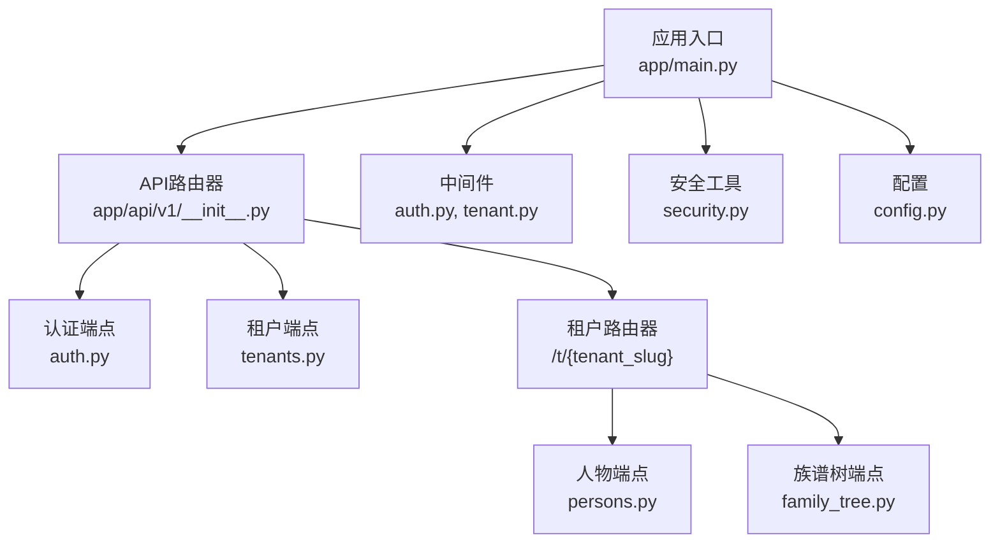
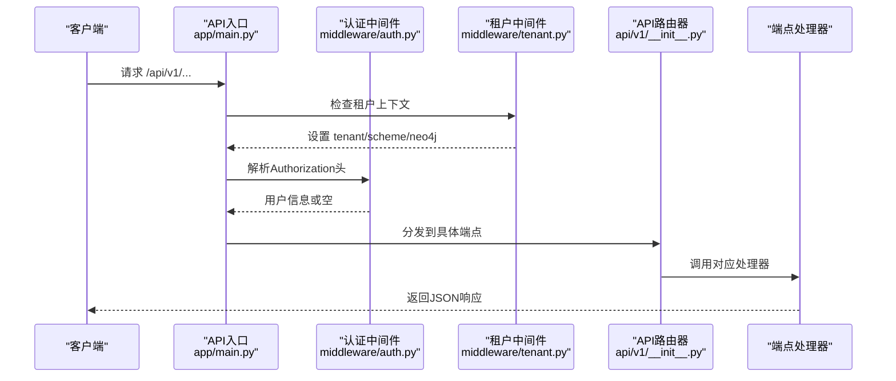
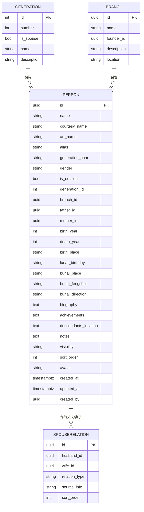
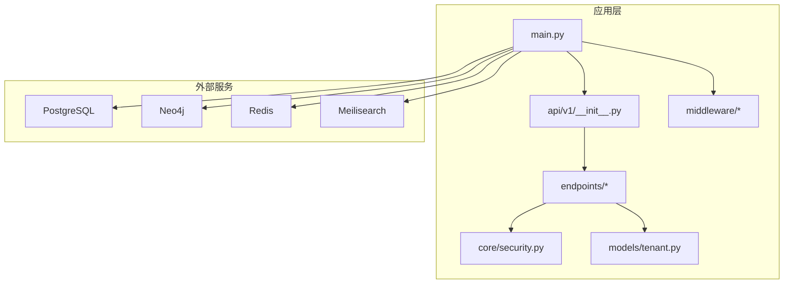

# API参考文档

<cite>
**本文档引用的文件**
- [backend/app/main.py](file://backend/app/main.py)
- [backend/app/api/v1/__init__.py](file://backend/app/api/v1/__init__.py)
- [backend/app/api/v1/endpoints/auth.py](file://backend/app/api/v1/endpoints/auth.py)
- [backend/app/api/v1/endpoints/tenants.py](file://backend/app/api/v1/endpoints/tenants.py)
- [backend/app/api/v1/endpoints/persons.py](file://backend/app/api/v1/endpoints/persons.py)
- [backend/app/api/v1/endpoints/family_tree.py](file://backend/app/api/v1/endpoints/family_tree.py)
- [backend/app/middleware/auth.py](file://backend/app/middleware/auth.py)
- [backend/app/middleware/tenant.py](file://backend/app/middleware/tenant.py)
- [backend/app/core/security.py](file://backend/app/core/security.py)
- [backend/app/models/tenant.py](file://backend/app/models/tenant.py)
- [backend/app/core/config.py](file://backend/app/core/config.py)
- [backend/tests/test_auth.py](file://backend/tests/test_auth.py)
- [backend/tests/test_persons.py](file://backend/tests/test_persons.py)
- [backend/pyproject.toml](file://backend/pyproject.toml)
</cite>

## 目录
1. [简介](#简介)
2. [项目结构](#项目结构)
3. [核心组件](#核心组件)
4. [架构总览](#架构总览)
5. [详细组件分析](#详细组件分析)
6. [依赖分析](#依赖分析)
7. [性能考虑](#性能考虑)
8. [故障排除指南](#故障排除指南)
9. [结论](#结论)
10. [附录](#附录)

## 简介
本API参考文档面向多租户族谱管理系统，覆盖认证与授权、租户管理、人物管理、族谱树查询与可视化等全部RESTful端点。文档提供每个端点的HTTP方法、URL模式、请求/响应模型、认证方式、参数说明、数据类型定义、业务规则、错误处理策略、调试与监控建议，以及客户端实现与性能优化指导。

## 项目结构
后端采用FastAPI框架，API版本前缀为 `/api/v1`。系统通过中间件识别租户上下文，租户特定路由以 `/t/{tenant_slug}` 前缀组织，如 `/api/v1/t/{tenant_slug}/persons`。

**图表来源**
- [backend/app/main.py:45-91](file://backend/app/main.py#L45-L91)
- [backend/app/api/v1/__init__.py:8-19](file://backend/app/api/v1/__init__.py#L8-L19)

**章节来源**
- [backend/app/main.py:45-91](file://backend/app/main.py#L45-L91)
- [backend/app/api/v1/__init__.py:8-19](file://backend/app/api/v1/__init__.py#L8-L19)

## 核心组件
- 应用入口与生命周期：负责初始化数据库、可选服务连接、CORS与租户中间件、健康检查端点。
- API路由器：聚合认证、租户、人物、族谱树端点；为人物与族谱树端点提供租户路由前缀。
- 中间件：认证中间件从请求头解析JWT，租户中间件从子域名、路径或Header提取租户标识并设置上下文。
- 安全工具：密码哈希、JWT访问/刷新令牌生成与校验。
- 数据模型：人物、分支、代际、配偶关系等租户级表结构。

**章节来源**
- [backend/app/main.py:17-43](file://backend/app/main.py#L17-L43)
- [backend/app/api/v1/__init__.py:8-19](file://backend/app/api/v1/__init__.py#L8-L19)
- [backend/app/middleware/auth.py:15-57](file://backend/app/middleware/auth.py#L15-L57)
- [backend/app/middleware/tenant.py:15-84](file://backend/app/middleware/tenant.py#L15-L84)
- [backend/app/core/security.py:16-103](file://backend/app/core/security.py#L16-L103)
- [backend/app/models/tenant.py:23-244](file://backend/app/models/tenant.py#L23-L244)

## 架构总览
系统采用多租户架构，租户通过子域名、路径或Header识别。认证采用Bearer JWT，支持访问/刷新令牌。人物与族谱树API在租户上下文中运行，使用租户私有Schema存储数据。

**图表来源**
- [backend/app/main.py:57-70](file://backend/app/main.py#L57-L70)
- [backend/app/middleware/tenant.py:39-84](file://backend/app/middleware/tenant.py#L39-L84)
- [backend/app/middleware/auth.py:15-57](file://backend/app/middleware/auth.py#L15-L57)
- [backend/app/api/v1/__init__.py:10-19](file://backend/app/api/v1/__init__.py#L10-L19)

## 详细组件分析

### 认证API（注册、登录、令牌刷新、当前用户）
- 基础路径：`/api/v1/auth`
- 支持的HTTP方法与端点：
  - POST /api/v1/auth/register
  - POST /api/v1/auth/login
  - POST /api/v1/auth/refresh
  - GET /api/v1/auth/me

- 认证方式
  - 注册/登录/刷新：无需认证
  - 当前用户：需要Bearer JWT

- 请求/响应模型与参数
  - 注册
    - 请求体字段：email（邮箱，必填）、password（密码，必填）、nickname（昵称，可选）
    - 成功响应：UserResponse（id、email、nickname、avatar、system_role）
    - 错误：400（邮箱已存在）
  - 登录
    - 请求体字段：email（邮箱，必填）、password（密码，必填）
    - 成功响应：Token（access_token、refresh_token、token_type=bearer）
    - 错误：401（无效邮箱或密码）、403（账户禁用）
  - 刷新
    - 请求参数：refresh_token（查询参数）
    - 成功响应：Token（新access_token与refresh_token）
    - 错误：401（无效刷新令牌或用户不存在/禁用）
  - 当前用户
    - 头部：Authorization: Bearer <access_token>
    - 成功响应：UserResponse
    - 错误：401（未认证）

- 业务规则
  - 密码使用bcrypt哈希存储
  - 访问令牌有效期默认24小时，刷新令牌30天
  - 登录成功更新最后登录时间

- 错误处理策略
  - 使用HTTP状态码明确区分业务错误
  - 统一返回结构：包含success字段（除部分端点外），必要时包含error对象

- 示例请求/响应（基于测试用例）
  - 注册：POST /api/v1/auth/register，请求体包含email/password/nickname，期望200及UserResponse
  - 登录：POST /api/v1/auth/login，请求体包含email/password，期望200及Token
  - 刷新：POST /api/v1/auth/refresh?refresh_token=...，期望200及新Token
  - 测试覆盖了重复邮箱注册、错误密码登录、密码哈希验证等场景

**章节来源**
- [backend/app/api/v1/endpoints/auth.py:55-179](file://backend/app/api/v1/endpoints/auth.py#L55-L179)
- [backend/app/middleware/auth.py:15-57](file://backend/app/middleware/auth.py#L15-L57)
- [backend/app/core/security.py:26-103](file://backend/app/core/security.py#L26-L103)
- [backend/tests/test_auth.py:12-149](file://backend/tests/test_auth.py#L12-L149)

### 租户管理API（列表、详情、创建）
- 基础路径：`/api/v1/tenants`
- 支持的HTTP方法与端点：
  - GET /api/v1/tenants
  - GET /api/v1/tenants/{slug}
  - POST /api/v1/tenants

- 请求/响应模型与参数
  - 列表
    - 查询参数：page（页码，默认1，≥1）、page_size（每页数量，默认20，1-100）、surname（可选，模糊搜索）
    - 成功响应：TenantListResponse（success、data: TenantResponse[]、meta: 总数/页码/大小/总页数）
  - 详情
    - 路径参数：slug（租户唯一标识）
    - 成功响应：TenantResponse（id、name、slug、surname、is_public、plan、created_at）
    - 错误：404（租户不存在）
  - 创建（当前注释为超级用户权限）
    - 请求体：name（名称）、slug（唯一标识，小写数字横线）、surname（姓氏）、is_public（是否公开）
    - 成功响应：TenantResponse（201）
    - 错误：400（slug已存在）

- 业务规则
  - slug用于派生PostgreSQL Schema名与Neo4j数据库名
  - 创建流程包含Schema/数据库迁移占位，当前未实现

- 错误处理策略
  - 400：输入校验失败或资源冲突
  - 404：资源不存在
  - 403：权限不足（待启用超级用户校验）

**章节来源**
- [backend/app/api/v1/endpoints/tenants.py:45-164](file://backend/app/api/v1/endpoints/tenants.py#L45-L164)

### 人物管理API（CRUD、关系维护）
- 基础路径：`/api/v1/t/{tenant_slug}/persons`
- 支持的HTTP方法与端点：
  - GET /api/v1/t/{tenant_slug}/persons
  - GET /api/v1/t/{tenant_slug}/persons/generations
  - GET /api/v1/t/{tenant_slug}/persons/branches
  - GET /api/v1/t/{tenant_slug}/persons/{person_id}
  - POST /api/v1/t/{tenant_slug}/persons
  - PUT /api/v1/t/{tenant_slug}/persons/{person_id}
  - DELETE /api/v1/t/{tenant_slug}/persons/{person_id}
  - GET /api/v1/t/{tenant_slug}/persons/{person_id}/spouses
  - POST /api/v1/t/{tenant_slug}/persons/{person_id}/spouses
  - DELETE /api/v1/t/{tenant_slug}/persons/{person_id}/spouses/{spouse_id}

- 请求/响应模型与参数
  - 列表
    - 查询参数：page/page_size、generation、branch_id、gender、search、visibility
    - 成功响应：PersonListResponse（success、data: PersonResponse[]、meta）
  - 详情
    - 路径参数：person_id（UUID）
    - 成功响应：包含PersonResponse与可选关系信息的对象
    - 错误：400（无效UUID）、404（未找到）
  - 创建
    - 请求体：PersonCreate（基础字段、出生/死亡信息、隐私可见性、排序等）
    - 校验：父系性别一致性、代际/分支存在性、可选：父/母存在性
    - 成功响应：包含PersonResponse与消息的对象（201）
    - 错误：400（关联对象不存在/性别不符/代际/分支不存在）
  - 更新
    - 请求体：PersonUpdate（字段可选）
    - 成功响应：包含PersonResponse与消息的对象
    - 错误：400/404（无效UUID/未找到）
  - 删除
    - 校验：若存在子节点则拒绝删除
    - 成功响应：包含消息的对象
    - 错误：404/400（未找到/存在子节点）
  - 配偶关系
    - 添加：请求体SpouseRelationCreate（husband_id、wife_id、relation_type、source_info、sort_order）
      - 校验：双方存在且性别正确、关系唯一
      - 成功响应：包含关系ID与基本信息
    - 删除：根据双向匹配查找并删除
    - 查询：按性别返回有序关系列表

- 业务规则
  - 人物可见性：public/member/private
  - 关系类型：婚姻、妾室、收养、追随、第一至第五等
  - 排序：按代际、sort_order、UUID排序
  - 删除保护：删除前需移除或重新指派子节点

- 错误处理策略
  - 统一返回success字段，配合HTTP状态码
  - 对UUID格式错误、资源不存在、业务约束违反进行明确错误提示

- 示例请求/响应（基于测试用例）
  - 列表空结果：GET /api/v1/t/{tenant_slug}/persons，期望200与空data数组
  - 创建人物：POST /api/v1/t/{tenant_slug}/persons，期望201（当前测试为占位，需先创建租户Schema）

**章节来源**
- [backend/app/api/v1/endpoints/persons.py:172-717](file://backend/app/api/v1/endpoints/persons.py#L172-L717)
- [backend/tests/test_persons.py:28-124](file://backend/tests/test_persons.py#L28-L124)

### 族谱树API（查询、构建、统计）
- 基础路径：`/api/v1/t/{tenant_slug}/family-tree`
- 支持的HTTP方法与端点：
  - GET /api/v1/t/{tenant_slug}/family-tree
  - GET /api/v1/t/{tenant_slug}/family-tree/ancestors/{person_id}
  - GET /api/v1/t/{tenant_slug}/family-tree/descendants/{person_id}
  - GET /api/v1/t/{tenant_slug}/family-tree/statistics

- 请求/响应模型与参数
  - 家谱树
    - 查询参数：root_id（根节点可选）、depth（深度，默认4，1-10）
    - 成功响应：包含TreeNode的树形结构
    - 规则：若未指定root_id，自动寻找最早祖先作为根
  - 祖先链
    - 查询参数：limit（上限，默认10，1-50）
    - 成功响应：祖先节点列表（id/name/generation/gender）
  - 后代树
    - 查询参数：depth（深度，默认5，1-10）
    - 成功响应：后代树形结构
  - 统计
    - 成功响应：总人数、各代人数分布、最大代数

- 业务规则
  - 树构建递归深度受depth限制
  - 祖先链防止环路访问

- 错误处理策略
  - 400：无效UUID
  - 404：未找到人员

**章节来源**
- [backend/app/api/v1/endpoints/family_tree.py:43-274](file://backend/app/api/v1/endpoints/family_tree.py#L43-L274)

### 数据模型概览（与API相关）

**图表来源**
- [backend/app/models/tenant.py:23-244](file://backend/app/models/tenant.py#L23-L244)

## 依赖分析
- 应用层依赖
  - API端点依赖数据库会话工厂与租户中间件
  - 认证端点依赖安全工具与用户模型
  - 人物与族谱树端点依赖租户Schema与相关模型
- 外部依赖
  - 数据库：PostgreSQL（异步驱动）
  - 可选服务：Neo4j、Redis、Meilisearch（连接在启动时尝试）
- 版本与配置
  - API版本前缀：/api/v1
  - JWT配置：密钥、算法、过期时间
  - CORS允许来源可通过环境变量配置

**图表来源**
- [backend/app/main.py:17-43](file://backend/app/main.py#L17-L43)
- [backend/app/api/v1/__init__.py:8-19](file://backend/app/api/v1/__init__.py#L8-L19)
- [backend/app/core/security.py:16-103](file://backend/app/core/security.py#L16-L103)
- [backend/app/models/tenant.py:23-244](file://backend/app/models/tenant.py#L23-L244)

**章节来源**
- [backend/app/main.py:17-43](file://backend/app/main.py#L17-L43)
- [backend/app/core/config.py:11-89](file://backend/app/core/config.py#L11-L89)
- [backend/pyproject.toml:7-25](file://backend/pyproject.toml#L7-L25)

## 性能考虑
- 数据库连接池
  - 通过配置项设置连接池大小与溢出，避免高并发下的连接争用
- 分页与过滤
  - 人物列表默认分页，合理设置page_size上限，避免一次性返回大量数据
- 递归查询
  - 族谱树深度限制（1-10），建议前端按需加载
- 缓存与搜索
  - 可选Redis缓存热点数据，可选Meilisearch提供全文检索
- 并发与异步
  - 使用异步SQLAlchemy与异步客户端，提升I/O密集型场景吞吐量

[本节为通用性能建议，不直接分析具体文件]

## 故障排除指南
- 认证相关
  - 401未认证：检查Authorization头格式是否为Bearer <token>
  - 401无效令牌：确认JWT密钥、算法与过期时间配置一致
  - 403禁止访问：确认用户状态正常，超级用户权限（待启用）
- 租户相关
  - 404租户不存在：确认slug正确，租户已创建且激活
  - 403租户非活跃：联系管理员恢复
- 人物相关
  - 400无效UUID：确保person_id为合法UUID格式
  - 400父/母性别不符：确保husband_id为男性、wife_id为女性
  - 400存在子节点：删除前先移除或重新指派子节点
- 服务可用性
  - 健康检查：GET /health，查看数据库、Neo4j、Redis、Search服务状态
- 调试工具
  - OpenAPI文档：/api/v1/docs
  - ReDoc：/api/v1/redoc
  - 日志：应用启动日志输出服务连接状态

**章节来源**
- [backend/app/middleware/auth.py:15-57](file://backend/app/middleware/auth.py#L15-L57)
- [backend/app/middleware/tenant.py:53-84](file://backend/app/middleware/tenant.py#L53-L84)
- [backend/app/api/v1/endpoints/persons.py:305-492](file://backend/app/api/v1/endpoints/persons.py#L305-L492)
- [backend/app/main.py:73-86](file://backend/app/main.py#L73-L86)

## 结论
本API参考文档系统性地梳理了多租户族谱管理系统的REST接口，明确了认证、租户、人物与族谱树四大模块的端点、模型与规则。通过统一的租户上下文与JWT认证机制，系统实现了清晰的多租户隔离与安全访问控制。建议在生产环境中完善租户Schema/数据库创建流程、启用超级用户权限校验，并结合缓存与搜索服务提升性能与体验。

[本节为总结性内容，不直接分析具体文件]

## 附录

### API版本控制
- 版本前缀：/api/v1
- 文档端点：/api/v1/docs、/api/v1/redoc、/api/v1/openapi.json

**章节来源**
- [backend/app/main.py:47-54](file://backend/app/main.py#L47-L54)

### 速率限制与安全
- 速率限制：当前未实现内置限流中间件，建议在网关或反向代理层配置
- CORS：通过配置项设置允许来源
- JWT：建议生产环境更换默认密钥，定期轮换
- 输入校验：Pydantic模型提供字段范围与格式校验

**章节来源**
- [backend/app/core/config.py:59-89](file://backend/app/core/config.py#L59-L89)
- [backend/app/core/security.py:53-103](file://backend/app/core/security.py#L53-L103)

### 客户端实现指南
- 认证流程
  - 注册：POST /api/v1/auth/register
  - 登录：POST /api/v1/auth/login，保存access_token与refresh_token
  - 刷新：POST /api/v1/auth/refresh，替换旧令牌
  - 请求受保护端点：在Authorization头添加Bearer <access_token>
- 租户路由
  - 所有租户相关API均位于 /api/v1/t/{tenant_slug}/...
  - 租户上下文可通过子域名、路径或Header传递
- 错误处理
  - 捕获HTTP状态码与统一响应结构，针对401执行重新登录/刷新逻辑

**章节来源**
- [backend/app/api/v1/__init__.py:14-19](file://backend/app/api/v1/__init__.py#L14-L19)
- [backend/app/middleware/tenant.py:93-114](file://backend/app/middleware/tenant.py#L93-L114)

### 监控与可观测性
- 健康检查：GET /health，监控服务可用性
- 文档：/api/v1/docs 与 /api/v1/redoc 提供交互式API文档
- 日志：应用启动时打印服务连接状态，便于诊断

**章节来源**
- [backend/app/main.py:73-86](file://backend/app/main.py#L73-L86)