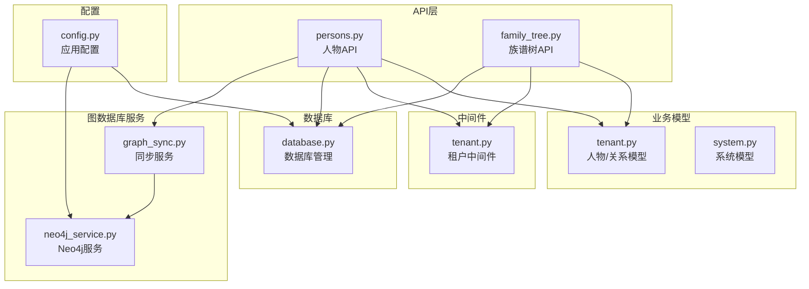
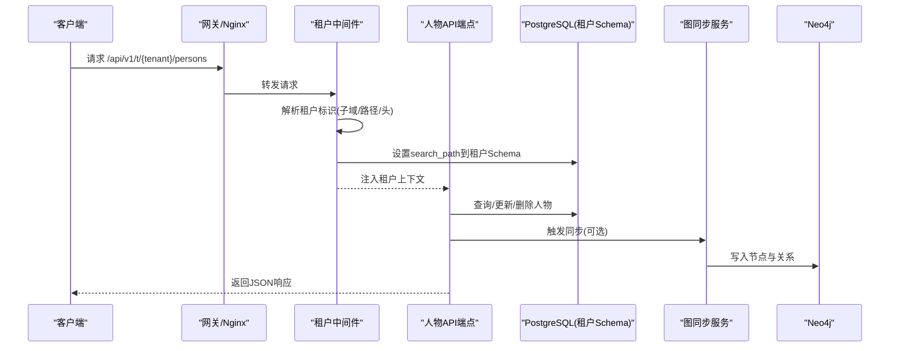
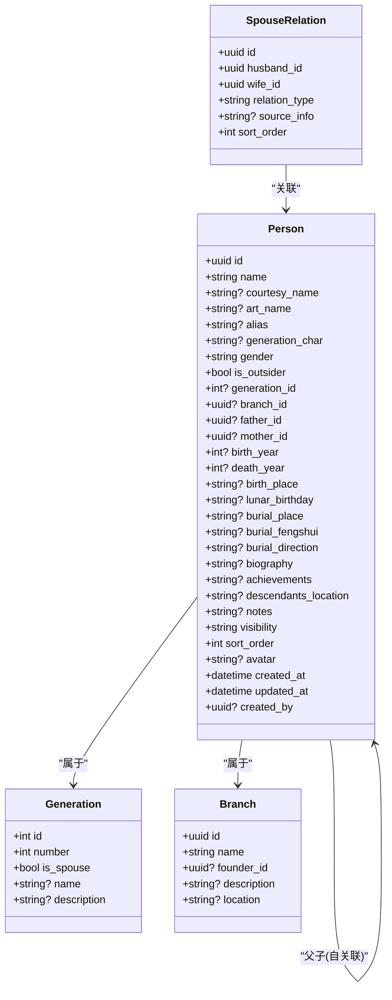
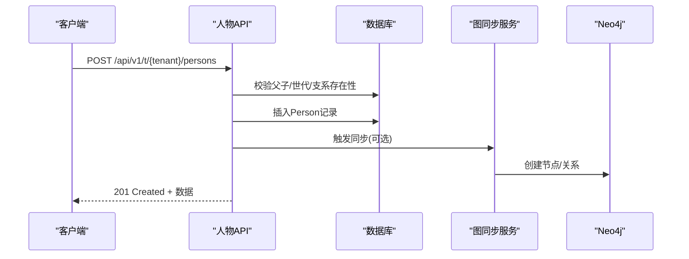
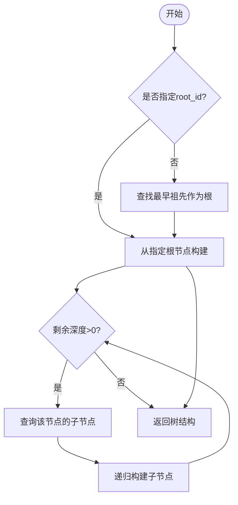
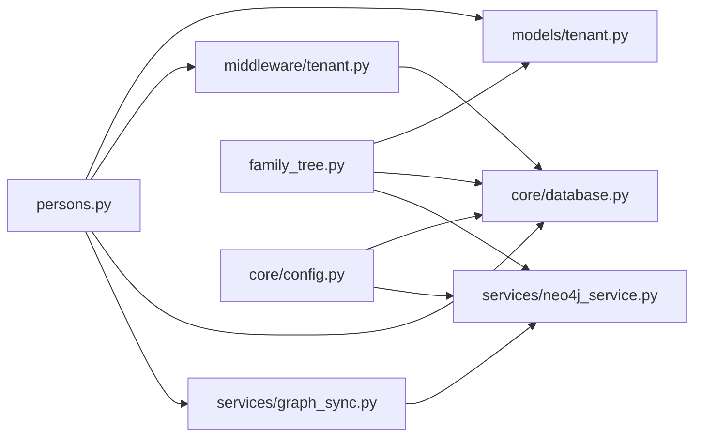

# 人物管理API

<cite>
**本文档引用的文件**
- [persons.py](file://backend/app/api/v1/endpoints/persons.py)
- [tenant.py](file://backend/app/models/tenant.py)
- [tenant.py](file://backend/app/middleware/tenant.py)
- [database.py](file://backend/app/core/database.py)
- [graph_sync.py](file://backend/app/services/graph_sync.py)
- [neo4j_service.py](file://backend/app/services/neo4j_service.py)
- [family_tree.py](file://backend/app/api/v1/endpoints/family_tree.py)
- [config.py](file://backend/app/core/config.py)
- [ARCHITECTURE.md](file://docs/ARCHITECTURE.md)
- [test_persons.py](file://backend/tests/test_persons.py)
</cite>

## 目录
1. [简介](#简介)
2. [项目结构](#项目结构)
3. [核心组件](#核心组件)
4. [架构总览](#架构总览)
5. [详细组件分析](#详细组件分析)
6. [依赖关系分析](#依赖关系分析)
7. [性能考虑](#性能考虑)
8. [故障排除指南](#故障排除指南)
9. [结论](#结论)
10. [附录](#附录)

## 简介
本文件为多租户族谱管理系统中人物管理API的权威参考文档。涵盖人物的CRUD操作、关系维护（父子、夫妻、兄弟姐妹）、批量导入导出、搜索过滤、数据验证规则、业务约束与错误处理机制，并提供性能优化建议与最佳实践。系统采用FastAPI + SQLAlchemy异步ORM + PostgreSQL关系数据库 + Neo4j图数据库的架构，通过多租户中间件实现租户隔离与路由。

## 项目结构
后端采用分层架构：
- API层：FastAPI路由与端点，位于 `backend/app/api/v1/endpoints/`
- 业务模型：SQLAlchemy模型定义，位于 `backend/app/models/`
- 中间件：租户识别与上下文注入，位于 `backend/app/middleware/`
- 数据库：连接管理与会话工厂，位于 `backend/app/core/database.py`
- 图数据库服务：同步与查询封装，位于 `backend/app/services/`
- 文档与配置：架构文档与应用配置，位于 `docs/` 与 `backend/app/core/config.py`

**图表来源**
- [persons.py:1-717](file://backend/app/api/v1/endpoints/persons.py#L1-L717)
- [family_tree.py:1-274](file://backend/app/api/v1/endpoints/family_tree.py#L1-L274)
- [tenant.py:1-244](file://backend/app/models/tenant.py#L1-L244)
- [tenant.py:1-142](file://backend/app/middleware/tenant.py#L1-L142)
- [database.py:1-171](file://backend/app/core/database.py#L1-L171)
- [graph_sync.py:1-157](file://backend/app/services/graph_sync.py#L1-L157)
- [neo4j_service.py:1-373](file://backend/app/services/neo4j_service.py#L1-L373)
- [config.py:1-89](file://backend/app/core/config.py#L1-L89)

**章节来源**
- [persons.py:1-717](file://backend/app/api/v1/endpoints/persons.py#L1-L717)
- [family_tree.py:1-274](file://backend/app/api/v1/endpoints/family_tree.py#L1-L274)
- [tenant.py:1-244](file://backend/app/models/tenant.py#L1-L244)
- [tenant.py:1-142](file://backend/app/middleware/tenant.py#L1-L142)
- [database.py:1-171](file://backend/app/core/database.py#L1-L171)
- [graph_sync.py:1-157](file://backend/app/services/graph_sync.py#L1-L157)
- [neo4j_service.py:1-373](file://backend/app/services/neo4j_service.py#L1-L373)
- [config.py:1-89](file://backend/app/core/config.py#L1-L89)

## 核心组件
- 人物模型（Person）：包含基本信息、生卒信息、墓葬信息、备注、隐私控制与排序等字段，支持父子自关联与分支归属。
- 配偶关系模型（SpouseRelation）：记录丈夫、妻子、关系类型与排序。
- 世代模型（Generation）与支系模型（Branch）：用于人物的世代与支系组织。
- 人物API端点：提供列表、详情、创建、更新、删除、配偶关系查询与添加/删除等。
- 族谱树API端点：提供祖先链、后代树、统计信息与树形结构构建。
- 图同步服务：将PostgreSQL中的人员与关系同步至Neo4j，支撑高性能图查询。

**章节来源**
- [tenant.py:61-164](file://backend/app/models/tenant.py#L61-L164)
- [persons.py:20-142](file://backend/app/api/v1/endpoints/persons.py#L20-L142)
- [family_tree.py:20-149](file://backend/app/api/v1/endpoints/family_tree.py#L20-L149)
- [graph_sync.py:20-104](file://backend/app/services/graph_sync.py#L20-L104)

## 架构总览
系统采用多租户隔离策略，PostgreSQL按Schema隔离，Neo4j按数据库隔离。租户中间件负责从子域、路径或请求头提取租户标识并注入请求上下文；API端点在执行前校验租户存在性；数据库会话根据租户切换Schema；图数据通过同步服务写入Neo4j。

**图表来源**
- [tenant.py:39-84](file://backend/app/middleware/tenant.py#L39-L84)
- [database.py:136-171](file://backend/app/core/database.py#L136-L171)
- [persons.py:323-402](file://backend/app/api/v1/endpoints/persons.py#L323-L402)
- [graph_sync.py:26-62](file://backend/app/services/graph_sync.py#L26-L62)
- [neo4j_service.py:65-143](file://backend/app/services/neo4j_service.py#L65-L143)

**章节来源**
- [ARCHITECTURE.md:98-171](file://docs/ARCHITECTURE.md#L98-L171)
- [tenant.py:15-84](file://backend/app/middleware/tenant.py#L15-L84)
- [database.py:58-106](file://backend/app/core/database.py#L58-L106)

## 详细组件分析

### 数据模型与字段规范
- 人物基本信息
  - 姓名、字、号、别名、辈分字、性别、是否外族配偶
  - 世代ID、支系ID
  - 父亲ID、母亲ID（自关联）
- 生卒信息
  - 出生年份、死亡年份、出生地、农历生日
- 墓葬信息
  - 墓葬地点、风水、朝向
- 备注与描述
  - 传记、成就、后代分布、备注
- 隐私与排序
  - 可见性（public/member/private）、排序字段、头像URL
- 时间戳
  - 创建时间、更新时间、创建人

**图表来源**
- [tenant.py:61-164](file://backend/app/models/tenant.py#L61-L164)

**章节来源**
- [tenant.py:61-164](file://backend/app/models/tenant.py#L61-L164)

### API规范：人物CRUD与关系

- 列表与搜索过滤
  - 方法：GET
  - 路径：/api/v1/t/{tenant_slug}/persons
  - 查询参数：page/page_size/generation/branch_id/gender/search/visibility
  - 返回：分页结果，包含总数、页码、每页数量与数据列表
- 获取人物详情
  - 方法：GET
  - 路径：/api/v1/t/{tenant_slug}/persons/{person_id}
  - 返回：人物详情，包含计算字段（如父名、母名、支系名等）
- 创建人物
  - 方法：POST
  - 路径：/api/v1/t/{tenant_slug}/persons
  - 请求体：PersonCreate（含必填与可选字段）
  - 业务校验：父亲存在且为男性、母亲存在且为女性、世代与支系存在
  - 返回：创建成功信息与人物详情
- 更新人物
  - 方法：PUT
  - 路径：/api/v1/t/{tenant_slug}/persons/{person_id}
  - 请求体：PersonUpdate（字段可选）
  - 返回：更新成功信息与最新详情
- 删除人物
  - 方法：DELETE
  - 路径：/api/v1/t/{tenant_slug}/persons/{person_id}
  - 业务校验：若存在子代则禁止删除
  - 返回：删除成功信息
- 配偶关系
  - 查询配偶：GET /persons/{person_id}/spouses
  - 添加配偶：POST /persons/{person_id}/spouses（需保证性别匹配与唯一性）
  - 删除配偶：DELETE /persons/{person_id}/spouses/{spouse_id}

**图表来源**
- [persons.py:323-402](file://backend/app/api/v1/endpoints/persons.py#L323-L402)
- [graph_sync.py:26-62](file://backend/app/services/graph_sync.py#L26-L62)
- [neo4j_service.py:65-143](file://backend/app/services/neo4j_service.py#L65-L143)

**章节来源**
- [persons.py:172-492](file://backend/app/api/v1/endpoints/persons.py#L172-L492)
- [persons.py:497-647](file://backend/app/api/v1/endpoints/persons.py#L497-L647)

### 族谱树与关系查询
- 族谱树结构
  - GET /api/v1/t/{tenant_slug}/family-tree?root_id&depth
  - 支持指定根节点与最大深度，返回嵌套树结构
- 祖先链
  - GET /api/v1/t/{tenant_slug}/family-tree/ancestors/{person_id}?limit
  - 逐代向上追溯，限制条数
- 后代树
  - GET /api/v1/t/{tenant_slug}/family-tree/descendants/{person_id}?depth
  - 从指定节点向下展开
- 统计信息
  - GET /api/v1/t/{tenant_slug}/family-tree/statistics
  - 总人数、按世代分布、最大世代

**图表来源**
- [family_tree.py:71-149](file://backend/app/api/v1/endpoints/family_tree.py#L71-L149)

**章节来源**
- [family_tree.py:43-274](file://backend/app/api/v1/endpoints/family_tree.py#L43-L274)

### 数据验证规则与业务约束
- 输入验证
  - 字符串长度限制、数值范围限制（年份ge 0且le 2100）、枚举值限制（性别、可见性、关系类型）
  - UUID格式校验与异常处理
- 业务约束
  - 创建时：父必须存在且性别为M，母必须存在且性别为F；世代与支系必须存在
  - 删除时：若存在子代则拒绝删除
  - 配偶关系：性别必须为男/女；关系唯一性校验
- 租户隔离
  - 所有端点均要求租户上下文，否则返回404

**章节来源**
- [persons.py:22-92](file://backend/app/api/v1/endpoints/persons.py#L22-L92)
- [persons.py:332-364](file://backend/app/api/v1/endpoints/persons.py#L332-L364)
- [persons.py:465-473](file://backend/app/api/v1/endpoints/persons.py#L465-L473)
- [persons.py:558-589](file://backend/app/api/v1/endpoints/persons.py#L558-L589)
- [tenant.py:133-141](file://backend/app/middleware/tenant.py#L133-L141)

### 错误处理机制
- 通用响应结构：success字段与data/meta或error字段
- 常见HTTP状态：
  - 400：参数无效、违反业务约束（如重复关系、删除有子代人物）
  - 404：资源不存在（租户/人物/关系）
  - 403：租户非活跃
- 租户中间件对公共路径放行，其余路径强制租户上下文

**章节来源**
- [persons.py:307-315](file://backend/app/api/v1/endpoints/persons.py#L307-L315)
- [persons.py:417-425](file://backend/app/api/v1/endpoints/persons.py#L417-L425)
- [persons.py:508-517](file://backend/app/api/v1/endpoints/persons.py#L508-L517)
- [tenant.py:53-74](file://backend/app/middleware/tenant.py#L53-L74)

## 依赖关系分析

**图表来源**
- [persons.py:1-17](file://backend/app/api/v1/endpoints/persons.py#L1-L17)
- [family_tree.py:1-16](file://backend/app/api/v1/endpoints/family_tree.py#L1-L16)
- [tenant.py:1-244](file://backend/app/models/tenant.py#L1-L244)
- [tenant.py:1-142](file://backend/app/middleware/tenant.py#L1-L142)
- [database.py:1-171](file://backend/app/core/database.py#L1-L171)
- [graph_sync.py:1-17](file://backend/app/services/graph_sync.py#L1-L17)
- [neo4j_service.py:1-373](file://backend/app/services/neo4j_service.py#L1-L373)
- [config.py:1-89](file://backend/app/core/config.py#L1-L89)

**章节来源**
- [persons.py:1-17](file://backend/app/api/v1/endpoints/persons.py#L1-L17)
- [family_tree.py:1-16](file://backend/app/api/v1/endpoints/family_tree.py#L1-L16)
- [tenant.py:1-244](file://backend/app/models/tenant.py#L1-L244)
- [tenant.py:1-142](file://backend/app/middleware/tenant.py#L1-L142)
- [database.py:1-171](file://backend/app/core/database.py#L1-L171)
- [graph_sync.py:1-17](file://backend/app/services/graph_sync.py#L1-L17)
- [neo4j_service.py:1-373](file://backend/app/services/neo4j_service.py#L1-L373)
- [config.py:1-89](file://backend/app/core/config.py#L1-L89)

## 性能考虑
- 数据库层面
  - 使用异步会话与连接池，合理设置pool_size与overflow
  - 对常用查询字段建立索引（如generation_id、branch_id、name等）
  - 分页查询避免一次性加载大量数据
- 图数据库层面
  - 仅在必要时触发同步，批量导入时使用事务
  - 使用Neo4j的索引与查询优化（按generation、name等）
- 缓存与CDN
  - 头像与媒体资源走CDN，减少数据库压力
- API层面
  - 控制返回字段大小，避免冗余计算
  - 对高频查询结果进行短期缓存

[本节为通用指导，不直接分析具体文件]

## 故障排除指南
- 租户未找到或非活跃
  - 检查子域/路径/头是否正确传递
  - 确认租户状态与激活状态
- UUID格式错误
  - 确保ID为合法UUID格式
- 创建人物失败
  - 检查父子性别与存在性、世代与支系是否存在
- 删除人物失败
  - 若存在子代，请先移除或重新指派子代后再删除
- 配偶关系冲突
  - 确保性别匹配、关系唯一、双方均存在

**章节来源**
- [tenant.py:133-141](file://backend/app/middleware/tenant.py#L133-L141)
- [persons.py:332-364](file://backend/app/api/v1/endpoints/persons.py#L332-L364)
- [persons.py:465-473](file://backend/app/api/v1/endpoints/persons.py#L465-L473)
- [persons.py:558-589](file://backend/app/api/v1/endpoints/persons.py#L558-L589)

## 结论
本API围绕多租户隔离与高性能图查询设计，提供完善的人物CRUD与关系维护能力。通过严格的输入验证与业务约束保障数据一致性，结合Neo4j实现族谱关系的高效查询与可视化。建议在生产环境中配合缓存、CDN与合理的索引策略，持续监控与优化查询性能。

[本节为总结性内容，不直接分析具体文件]

## 附录

### API端点一览（按功能分类）
- 人物管理
  - GET /api/v1/t/{tenant}/persons
  - GET /api/v1/t/{tenant}/persons/{id}
  - POST /api/v1/t/{tenant}/persons
  - PUT /api/v1/t/{tenant}/persons/{id}
  - DELETE /api/v1/t/{tenant}/persons/{id}
- 配偶关系
  - GET /api/v1/t/{tenant}/persons/{id}/spouses
  - POST /api/v1/t/{tenant}/persons/{id}/spouses
  - DELETE /api/v1/t/{tenant}/persons/{id}/spouses/{spouse_id}
- 族谱树
  - GET /api/v1/t/{tenant}/family-tree
  - GET /api/v1/t/{tenant}/family-tree/ancestors/{id}
  - GET /api/v1/t/{tenant}/family-tree/descendants/{id}
  - GET /api/v1/t/{tenant}/family-tree/statistics

**章节来源**
- [persons.py:172-492](file://backend/app/api/v1/endpoints/persons.py#L172-L492)
- [persons.py:497-647](file://backend/app/api/v1/endpoints/persons.py#L497-L647)
- [family_tree.py:43-274](file://backend/app/api/v1/endpoints/family_tree.py#L43-L274)

### 字段与类型参考（节选）
- 基本信息：name、courtesy_name、art_name、alias、generation_char、gender、is_outsider
- 关系：generation_id、branch_id、father_id、mother_id
- 生卒：birth_year、death_year、birth_place、lunar_birthday
- 墓葬：burial_place、burial_fengshui、burial_direction
- 备注：biography、achievements、descendants_location、notes
- 隐私与排序：visibility、sort_order、avatar
- 时间戳：created_at、updated_at、created_by

**章节来源**
- [tenant.py:61-164](file://backend/app/models/tenant.py#L61-L164)

### 测试与验证建议
- 单元测试覆盖
  - 列表空数据、创建人物、更新人物、删除人物（含删除有子代场景）、搜索与过滤、添加/删除配偶关系
- 集成测试
  - 租户中间件与数据库Schema切换、Neo4j同步流程
- 性能测试
  - 大规模人物导入后的查询延迟与并发吞吐

**章节来源**
- [test_persons.py:11-124](file://backend/tests/test_persons.py#L11-L124)