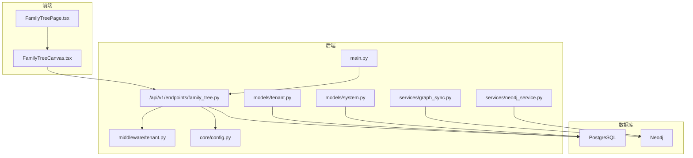
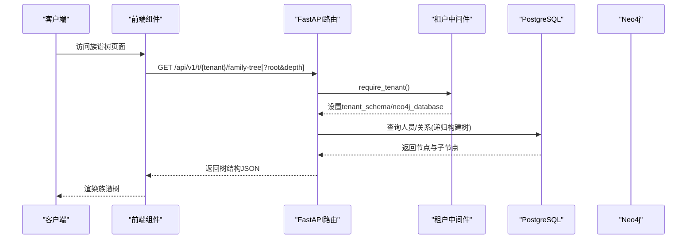
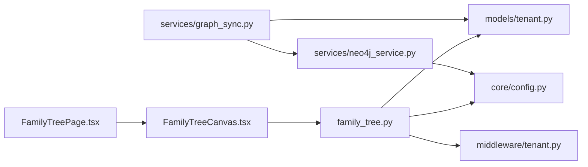

# 族谱树API

<cite>
**本文引用的文件**
- [backend/app/api/v1/endpoints/family_tree.py](file://backend/app/api/v1/endpoints/family_tree.py)
- [backend/app/services/neo4j_service.py](file://backend/app/services/neo4j_service.py)
- [backend/app/services/graph_sync.py](file://backend/app/services/graph_sync.py)
- [backend/app/models/tenant.py](file://backend/app/models/tenant.py)
- [backend/app/models/system.py](file://backend/app/models/system.py)
- [backend/app/middleware/tenant.py](file://backend/app/middleware/tenant.py)
- [backend/app/core/config.py](file://backend/app/core/config.py)
- [backend/app/main.py](file://backend/app/main.py)
- [frontend/components/family-tree/FamilyTreePage.tsx](file://frontend/components/family-tree/FamilyTreePage.tsx)
- [frontend/components/family-tree/FamilyTreeCanvas.tsx](file://frontend/components/family-tree/FamilyTreeCanvas.tsx)
- [scripts/sync_neo4j.py](file://scripts/sync_neo4j.py)
- [README.md](file://README.md)
- [docs/ARCHITECTURE.md](file://docs/ARCHITECTURE.md)
- [docker-compose.yml](file://docker-compose.yml)
- [docker-compose.prod.yml](file://docker-compose.prod.yml)
</cite>

## 目录
1. [简介](#简介)
2. [项目结构](#项目结构)
3. [核心组件](#核心组件)
4. [架构总览](#架构总览)
5. [详细组件分析](#详细组件分析)
6. [依赖分析](#依赖分析)
7. [性能考虑](#性能考虑)
8. [故障排查指南](#故障排查指南)
9. [结论](#结论)
10. [附录](#附录)

## 简介
本文件为多租户族谱管理系统的“族谱树API”完整参考文档。内容覆盖：
- 族谱树查询、构建与可视化相关端点
- 族谱树数据结构、节点关系与层级查询
- 根节点查询、后代查询、祖先查询、关系链路等多维查询
- 族谱树构建算法、数据同步机制与缓存策略
- 搜索功能、过滤条件、排序规则等高级查询特性
- 图数据库Neo4j的使用方式与性能优化技巧
- 前端集成示例与可视化组件使用指南

## 项目结构
后端采用FastAPI + SQLAlchemy 2.0 + PostgreSQL；图数据采用Neo4j（可选）。前端采用Next.js + react-d3-tree进行可视化。

图表来源
- [backend/app/api/v1/endpoints/family_tree.py:1-274](file://backend/app/api/v1/endpoints/family_tree.py#L1-L274)
- [backend/app/middleware/tenant.py:1-142](file://backend/app/middleware/tenant.py#L1-L142)
- [backend/app/core/config.py:1-89](file://backend/app/core/config.py#L1-L89)
- [backend/app/main.py:1-103](file://backend/app/main.py#L1-L103)
- [backend/app/services/graph_sync.py:1-157](file://backend/app/services/graph_sync.py#L1-L157)
- [backend/app/services/neo4j_service.py:1-373](file://backend/app/services/neo4j_service.py#L1-L373)
- [backend/app/models/tenant.py:1-244](file://backend/app/models/tenant.py#L1-L244)
- [backend/app/models/system.py:1-223](file://backend/app/models/system.py#L1-L223)
- [frontend/components/family-tree/FamilyTreePage.tsx:1-226](file://frontend/components/family-tree/FamilyTreePage.tsx#L1-L226)
- [frontend/components/family-tree/FamilyTreeCanvas.tsx:1-236](file://frontend/components/family-tree/FamilyTreeCanvas.tsx#L1-L236)

章节来源
- [README.md:1-133](file://README.md#L1-L133)
- [docs/ARCHITECTURE.md:1-1020](file://docs/ARCHITECTURE.md#L1-L1020)

## 核心组件
- 族谱树API路由与端点：提供族谱树查询、祖先链、后代树、统计等接口
- Neo4j服务：提供节点创建、关系建立、查询祖先/后代/兄弟/配偶、按代查询、模糊搜索、统计等
- 图同步服务：将PostgreSQL中的人员、关系数据同步至Neo4j
- 多租户中间件：解析租户上下文（子域/路径/请求头），切换Schema与Neo4j数据库
- 前端可视化组件：基于react-d3-tree渲染族谱树，支持缩放、平移、节点点击

章节来源
- [backend/app/api/v1/endpoints/family_tree.py:1-274](file://backend/app/api/v1/endpoints/family_tree.py#L1-L274)
- [backend/app/services/neo4j_service.py:1-373](file://backend/app/services/neo4j_service.py#L1-L373)
- [backend/app/services/graph_sync.py:1-157](file://backend/app/services/graph_sync.py#L1-L157)
- [backend/app/middleware/tenant.py:1-142](file://backend/app/middleware/tenant.py#L1-L142)
- [frontend/components/family-tree/FamilyTreePage.tsx:1-226](file://frontend/components/family-tree/FamilyTreePage.tsx#L1-L226)
- [frontend/components/family-tree/FamilyTreeCanvas.tsx:1-236](file://frontend/components/family-tree/FamilyTreeCanvas.tsx#L1-L236)

## 架构总览
系统采用“多租户Schema隔离 + Neo4j图数据”的混合架构。租户通过子域或路径识别，中间件注入租户上下文，API在租户Schema中读写数据；Neo4j用于复杂关系查询与高性能可视化。

图表来源
- [backend/app/api/v1/endpoints/family_tree.py:43-150](file://backend/app/api/v1/endpoints/family_tree.py#L43-L150)
- [backend/app/middleware/tenant.py:39-84](file://backend/app/middleware/tenant.py#L39-L84)
- [frontend/components/family-tree/FamilyTreeCanvas.tsx:39-59](file://frontend/components/family-tree/FamilyTreeCanvas.tsx#L39-L59)

章节来源
- [docs/ARCHITECTURE.md:98-171](file://docs/ARCHITECTURE.md#L98-L171)
- [backend/app/main.py:66-70](file://backend/app/main.py#L66-L70)

## 详细组件分析

### 1) 族谱树API端点
- GET /api/v1/t/{tenant}/family-tree
  - 查询参数：root（可选，指定根人ID）、depth（默认4，范围1-10）
  - 返回：success + data（树形结构）
  - 构建逻辑：若提供root则从该人开始构建；否则查找最早祖先作为根
- GET /api/v1/t/{tenant}/family-tree/ancestors/{person_id}
  - 查询参数：limit（默认10，范围1-50）
  - 返回：祖先链（含id/name/generation/gender）
- GET /api/v1/t/{tenant}/family-tree/descendants/{person_id}
  - 查询参数：depth（默认5，范围1-10）
  - 返回：以该人为根的后代树
- GET /api/v1/t/{tenant}/family-tree/statistics
  - 返回：总人数、各代人数分布、最大代数

数据结构
- TreeNode：包含id、name、generation、gender、birthYear、deathYear、avatar、courtesyName、children[]
- TreeStats：total_persons、generations[]、max_generation

章节来源
- [backend/app/api/v1/endpoints/family_tree.py:21-274](file://backend/app/api/v1/endpoints/family_tree.py#L21-L274)

### 2) Neo4j图数据库服务
- 节点与关系
  - 节点标签：Person + {tenant_database}
  - 关系类型：FATHER_OF、CHILD_OF、MARRIED（带属性type、order）
- 查询能力
  - 从某人出发的祖先链、后代链、兄弟、配偶
  - 按代查询成员
  - 模糊姓名搜索（name/courtesy_name/art_name/alias）
  - 统计：总人数、按代统计、按支系统计
- 树构建
  - 使用路径匹配收集nodes与relationships，再组装为嵌套结构

章节来源
- [backend/app/services/neo4j_service.py:65-373](file://backend/app/services/neo4j_service.py#L65-L373)
- [docs/ARCHITECTURE.md:496-524](file://docs/ARCHITECTURE.md#L496-L524)

### 3) 图同步机制
- 全量同步：遍历persons创建节点，遍历father_id建立父子关系，遍历spouse_relations建立婚姻关系
- 快速同步：仅同步单个人员及其父节点
- 重建图：清空当前租户图后全量重同步

章节来源
- [backend/app/services/graph_sync.py:20-114](file://backend/app/services/graph_sync.py#L20-L114)
- [scripts/sync_neo4j.py:14-38](file://scripts/sync_neo4j.py#L14-L38)

### 4) 多租户中间件
- 租户识别顺序：子域 → 路径 → 请求头
- 设置：tenant_schema、tenant_neo4j
- 对应的系统模型：Tenant（包含schema_name、neo4j_database）

章节来源
- [backend/app/middleware/tenant.py:15-142](file://backend/app/middleware/tenant.py#L15-L142)
- [backend/app/models/system.py:23-71](file://backend/app/models/system.py#L23-L71)

### 5) 前端集成与可视化
- FamilyTreePage：页面容器，包含搜索框、视图切换、侧栏详情
- FamilyTreeCanvas：调用后端族谱树接口，使用react-d3-tree渲染，支持缩放、适配屏幕、图例
- 节点样式：根据性别设置边框颜色，展示姓名、代数、生卒年份

章节来源
- [frontend/components/family-tree/FamilyTreePage.tsx:1-226](file://frontend/components/family-tree/FamilyTreePage.tsx#L1-L226)
- [frontend/components/family-tree/FamilyTreeCanvas.tsx:1-236](file://frontend/components/family-tree/FamilyTreeCanvas.tsx#L1-L236)

### 6) 数据模型要点
- 人员模型Person：包含姓名、字、号、别名、性别、代数、父母、支系、生卒、头像、排序等
- 配偶关系SpouseRelation：记录丈夫、妻子、关系类型、排序
- 系统模型Tenant：租户的schema与Neo4j数据库名

章节来源
- [backend/app/models/tenant.py:61-164](file://backend/app/models/tenant.py#L61-L164)
- [backend/app/models/system.py:23-71](file://backend/app/models/system.py#L23-L71)

## 依赖分析

图表来源
- [backend/app/api/v1/endpoints/family_tree.py:1-274](file://backend/app/api/v1/endpoints/family_tree.py#L1-L274)
- [backend/app/services/graph_sync.py:1-157](file://backend/app/services/graph_sync.py#L1-L157)
- [backend/app/services/neo4j_service.py:1-373](file://backend/app/services/neo4j_service.py#L1-L373)
- [frontend/components/family-tree/FamilyTreePage.tsx:1-226](file://frontend/components/family-tree/FamilyTreePage.tsx#L1-L226)
- [frontend/components/family-tree/FamilyTreeCanvas.tsx:1-236](file://frontend/components/family-tree/FamilyTreeCanvas.tsx#L1-L236)

章节来源
- [backend/app/models/tenant.py:1-244](file://backend/app/models/tenant.py#L1-L244)
- [backend/app/middleware/tenant.py:1-142](file://backend/app/middleware/tenant.py#L1-L142)
- [backend/app/core/config.py:1-89](file://backend/app/core/config.py#L1-L89)

## 性能考虑
- 族谱树深度限制：后端默认depth=4，避免深层递归导致的N+1与高延迟
- Neo4j查询优化
  - 使用标签限定（{tenant_database}）减少扫描范围
  - 限制返回数量（LIMIT）与排序（ORDER BY）
  - 使用路径表达式（[:FATHER_OF|CHILD_OF*0..N]）一次性获取层级
- 同步策略
  - 全量同步仅在初始化或数据重大变更时执行
  - 快速同步用于新增/更新人员及其父节点
- 前端渲染
  - 使用react-d3-tree的初始深度与节点尺寸控制，避免一次性渲染过多节点
  - 节点点击触发详情加载，减少主画布压力

章节来源
- [backend/app/api/v1/endpoints/family_tree.py:46-47](file://backend/app/api/v1/endpoints/family_tree.py#L46-L47)
- [backend/app/services/neo4j_service.py:154-163](file://backend/app/services/neo4j_service.py#L154-L163)
- [frontend/components/family-tree/FamilyTreeCanvas.tsx:146-167](file://frontend/components/family-tree/FamilyTreeCanvas.tsx#L146-L167)

## 故障排查指南
- 租户未找到
  - 现象：返回404，提示租户不存在
  - 排查：确认子域/路径/请求头是否正确，租户是否激活
- Neo4j不可用
  - 现象：健康检查显示图数据库不可用，部分图查询功能降级
  - 排查：检查连接URI、凭据、容器健康状态
- 同步失败
  - 现象：同步脚本报错或未产生预期节点/关系
  - 排查：确认租户schema与Neo4j数据库名一致，检查父ID是否有效
- 前端无法渲染
  - 现象：空白画布或加载失败
  - 排查：确认API返回success=true且data非空；检查跨域与CORS配置

章节来源
- [backend/app/middleware/tenant.py:53-74](file://backend/app/middleware/tenant.py#L53-L74)
- [backend/app/main.py:73-86](file://backend/app/main.py#L73-L86)
- [backend/app/services/graph_sync.py:106-114](file://backend/app/services/graph_sync.py#L106-L114)
- [frontend/components/family-tree/FamilyTreeCanvas.tsx:42-58](file://frontend/components/family-tree/FamilyTreeCanvas.tsx#L42-L58)

## 结论
本族谱树API以“SQL构建树 + Neo4j关系查询”相结合的方式，兼顾易用性与性能。通过多租户中间件与Schema/数据库隔离，确保数据安全与可扩展。前端采用react-d3-tree实现直观的可视化体验。建议在生产环境中启用Neo4j并定期执行快速同步，以保证查询性能与数据一致性。

## 附录

### A. API端点一览
- GET /api/v1/t/{tenant}/family-tree
  - 查询参数：root（可选）、depth（默认4）
  - 返回：树形结构
- GET /api/v1/t/{tenant}/family-tree/ancestors/{person_id}
  - 查询参数：limit（默认10）
  - 返回：祖先链
- GET /api/v1/t/{tenant}/family-tree/descendants/{person_id}
  - 查询参数：depth（默认5）
  - 返回：后代树
- GET /api/v1/t/{tenant}/family-tree/statistics
  - 返回：统计信息

章节来源
- [backend/app/api/v1/endpoints/family_tree.py:43-274](file://backend/app/api/v1/endpoints/family_tree.py#L43-L274)

### B. Neo4j查询模式
- 获取祖先链：MATCH (p)<-[:CHILD_OF*1..]-(ancestor) WHERE ancestor:{database}
- 获取后代树：MATCH (p)-[:FATHER_OF*1..{depth}]->(desc) WHERE desc:{database}
- 获取兄弟：通过同一父节点的多个子节点
- 获取配偶：MATCH (p)-[r:MARRIED]->(spouse) WHERE spouse:{database}

章节来源
- [backend/app/services/neo4j_service.py:166-246](file://backend/app/services/neo4j_service.py#L166-L246)

### C. 前端集成要点
- 使用FamilyTreeCanvas发起请求：/api/v1/t/{tenant}/family-tree?root={personId}
- 节点点击回调：fetch对应人物详情
- 控制面板：缩放、复位、适配屏幕

章节来源
- [frontend/components/family-tree/FamilyTreePage.tsx:46-61](file://frontend/components/family-tree/FamilyTreePage.tsx#L46-L61)
- [frontend/components/family-tree/FamilyTreeCanvas.tsx:42-73](file://frontend/components/family-tree/FamilyTreeCanvas.tsx#L42-L73)

### D. 部署与运行
- 本地开发：一键启动后端与前端，访问 http://localhost:8010/api/v1/docs 查看API
- Docker：使用compose文件启动PostgreSQL、Neo4j、Redis等服务
- 同步脚本：通过命令行将租户数据同步至Neo4j

章节来源
- [README.md:29-68](file://README.md#L29-L68)
- [docker-compose.yml:1-56](file://docker-compose.yml#L1-L56)
- [docker-compose.prod.yml:1-46](file://docker-compose.prod.yml#L1-L46)
- [scripts/sync_neo4j.py:14-38](file://scripts/sync_neo4j.py#L14-L38)