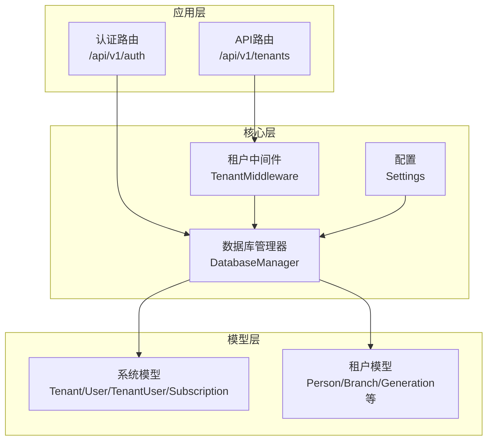
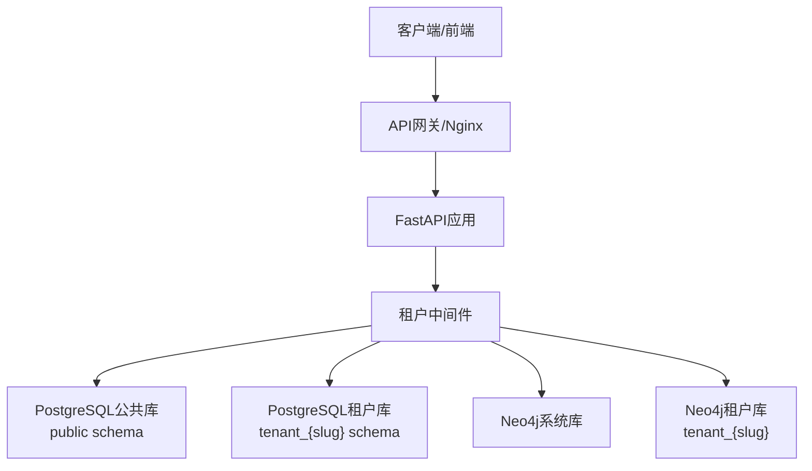
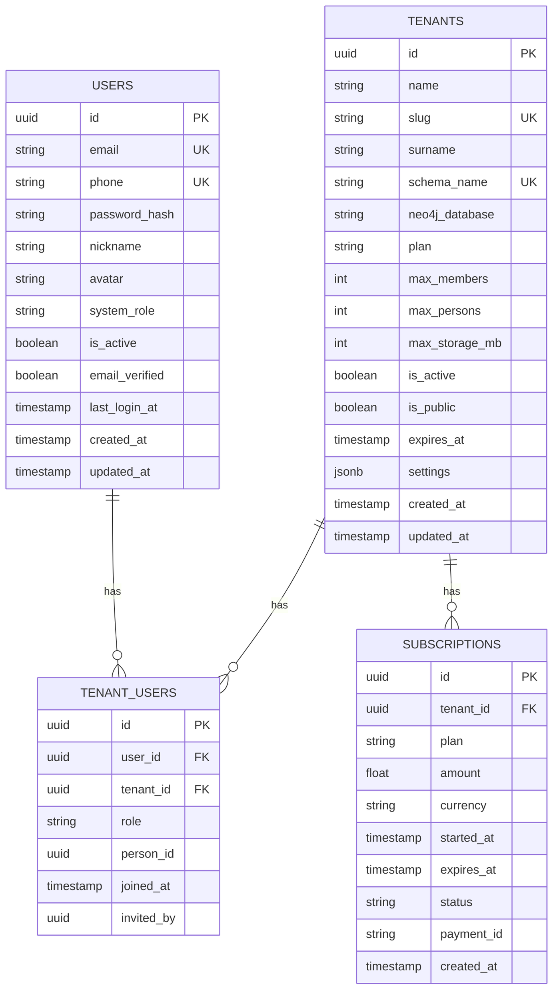
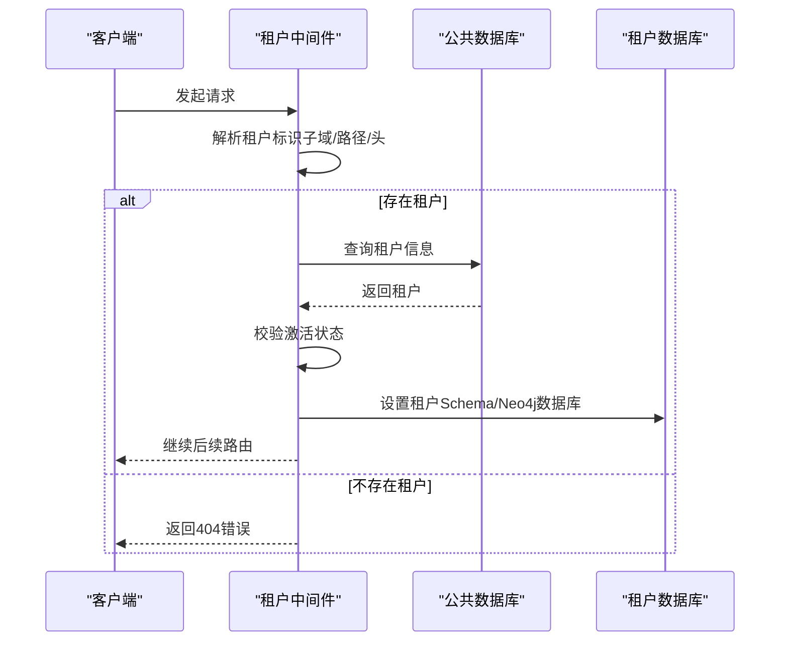
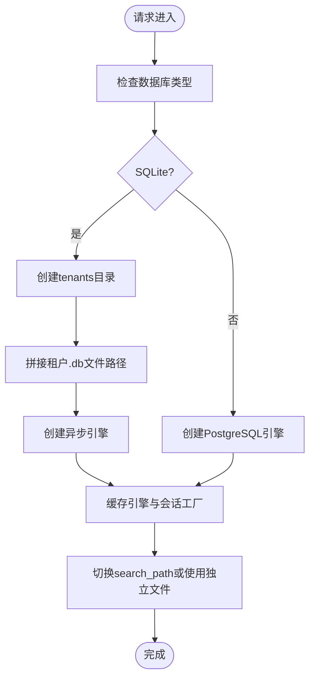
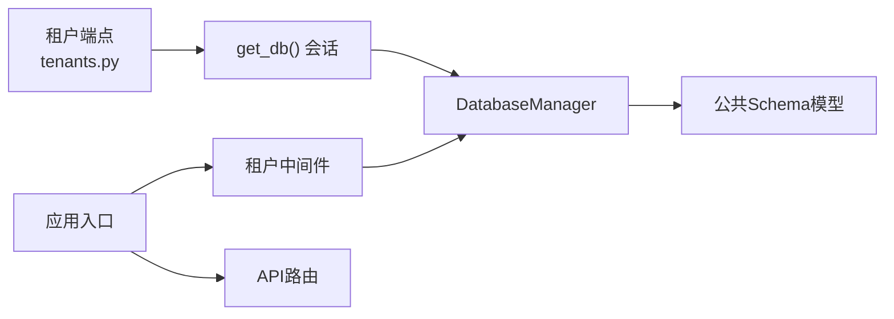

# 租户管理API

<cite>
**本文引用的文件**
- [backend/app/api/v1/endpoints/tenants.py](file://backend/app/api/v1/endpoints/tenants.py)
- [backend/app/models/system.py](file://backend/app/models/system.py)
- [backend/app/middleware/tenant.py](file://backend/app/middleware/tenant.py)
- [backend/app/core/database.py](file://backend/app/core/database.py)
- [backend/app/core/config.py](file://backend/app/core/config.py)
- [backend/app/api/v1/endpoints/auth.py](file://backend/app/api/v1/endpoints/auth.py)
- [backend/tests/test_tenants.py](file://backend/tests/test_tenants.py)
- [backend/app/main.py](file://backend/app/main.py)
- [docs/ARCHITECTURE.md](file://docs/ARCHITECTURE.md)
</cite>

## 目录
1. [简介](#简介)
2. [项目结构](#项目结构)
3. [核心组件](#核心组件)
4. [架构总览](#架构总览)
5. [详细组件分析](#详细组件分析)
6. [依赖分析](#依赖分析)
7. [性能考虑](#性能考虑)
8. [故障排除指南](#故障排除指南)
9. [结论](#结论)
10. [附录](#附录)

## 简介
本文件为多租户族谱管理系统的“租户管理API”完整参考文档。重点覆盖以下方面：
- 租户的创建、配置、成员管理与权限控制相关端点
- 租户基本信息管理、成员邀请与退出、角色分配等能力
- 租户配置参数、成员角色权限、订阅状态等数据模型定义
- 租户创建、成员管理、权限变更的请求/响应示例路径
- 多租户隔离机制与数据安全策略
- 租户生命周期管理与常见问题排查

## 项目结构
后端采用FastAPI + SQLAlchemy异步ORM，按“应用层-核心层-中间件-模型-服务-工具”的分层组织。租户管理API位于v1版本路由下，通过中间件实现多租户上下文注入，并在公共Schema中维护系统级租户、用户与订阅模型。

图表来源
- [backend/app/api/v1/endpoints/tenants.py:1-164](file://backend/app/api/v1/endpoints/tenants.py#L1-L164)
- [backend/app/middleware/tenant.py:1-142](file://backend/app/middleware/tenant.py#L1-L142)
- [backend/app/core/database.py:1-171](file://backend/app/core/database.py#L1-L171)
- [backend/app/models/system.py:1-223](file://backend/app/models/system.py#L1-L223)

章节来源
- [backend/app/api/v1/endpoints/tenants.py:1-164](file://backend/app/api/v1/endpoints/tenants.py#L1-L164)
- [backend/app/middleware/tenant.py:1-142](file://backend/app/middleware/tenant.py#L1-L142)
- [backend/app/core/database.py:1-171](file://backend/app/core/database.py#L1-L171)
- [backend/app/models/system.py:1-223](file://backend/app/models/system.py#L1-L223)

## 核心组件
- 租户管理端点：提供租户列表、详情查询、创建等能力；当前实现支持列表与详情查询，创建端点预留了超级管理员鉴权占位。
- 系统模型：包含租户、用户、租户-用户关系、订阅等系统级实体，用于支撑租户与成员管理。
- 租户中间件：负责从请求中提取租户上下文（子域/路径/头），加载租户并切换数据库Schema与Neo4j数据库。
- 数据库管理器：统一管理默认引擎与多租户引擎，支持SQLite与PostgreSQL两种模式下的Schema隔离。
- 配置：集中管理数据库、Neo4j、Redis、JWT等配置项，包含租户默认套餐与配额等参数。

章节来源
- [backend/app/api/v1/endpoints/tenants.py:118-164](file://backend/app/api/v1/endpoints/tenants.py#L118-L164)
- [backend/app/models/system.py:23-223](file://backend/app/models/system.py#L23-L223)
- [backend/app/middleware/tenant.py:15-142](file://backend/app/middleware/tenant.py#L15-L142)
- [backend/app/core/database.py:24-171](file://backend/app/core/database.py#L24-L171)
- [backend/app/core/config.py:11-89](file://backend/app/core/config.py#L11-L89)

## 架构总览
系统采用“公共Schema + 租户Schema”的多租户隔离策略，结合Neo4j数据库隔离，实现族谱数据的强隔离与高效查询。

图表来源
- [docs/ARCHITECTURE.md:100-129](file://docs/ARCHITECTURE.md#L100-L129)
- [backend/app/middleware/tenant.py:15-84](file://backend/app/middleware/tenant.py#L15-L84)
- [backend/app/core/database.py:58-106](file://backend/app/core/database.py#L58-L106)

## 详细组件分析

### 租户管理API端点
- 列表租户
  - 方法与路径：GET /api/v1/tenants
  - 查询参数：page、page_size、surname（模糊匹配）
  - 返回：分页列表，包含租户基本信息与元数据
  - 业务要点：仅返回公开且激活的租户
- 获取租户详情
  - 方法与路径：GET /api/v1/tenants/{slug}
  - 参数：slug（租户唯一标识）
  - 返回：租户完整信息
  - 错误：不存在时返回404
- 创建租户
  - 方法与路径：POST /api/v1/tenants
  - 请求体：TenantCreate（名称、slug、姓氏、是否公开）
  - 返回：创建后的租户信息
  - 当前实现：预留超级管理员鉴权占位，实际创建流程包含Schema与Neo4j初始化的TODO注释

请求/响应示例路径（不展示具体代码内容）
- [租户列表请求示例:34-40](file://backend/tests/test_tenants.py#L34-L40)
- [租户详情请求示例:56-61](file://backend/tests/test_tenants.py#L56-L61)
- [非存在租户错误示例:67-69](file://backend/tests/test_tenants.py#L67-L69)
- [创建租户请求示例（需鉴权）:76-84](file://backend/tests/test_tenants.py#L76-L84)

章节来源
- [backend/app/api/v1/endpoints/tenants.py:45-88](file://backend/app/api/v1/endpoints/tenants.py#L45-L88)
- [backend/app/api/v1/endpoints/tenants.py:91-116](file://backend/app/api/v1/endpoints/tenants.py#L91-L116)
- [backend/app/api/v1/endpoints/tenants.py:118-164](file://backend/app/api/v1/endpoints/tenants.py#L118-L164)
- [backend/tests/test_tenants.py:11-112](file://backend/tests/test_tenants.py#L11-L112)

### 数据模型定义

#### 系统级模型（公共Schema）
- 租户（Tenant）
  - 关键字段：名称、slug、姓氏、schema名称、Neo4j数据库名、套餐、最大成员数/人物数/存储MB、激活/公开状态、到期时间、配置JSON、创建/更新时间
  - 用途：系统级租户注册与配置
- 用户（User）
  - 关键字段：邮箱/手机唯一、密码哈希、昵称/头像、系统角色（user/operator/super_admin）、激活/验证状态、最近登录时间
- 租户-用户关系（TenantUser）
  - 关键字段：用户-租户关联、角色（member/editor/reviewer/tenant_admin/guest）、关联族谱人物ID、加入时间、邀请人
- 订阅（Subscription）
  - 关键字段：租户ID、套餐、金额/币种、起止时间、状态、支付ID、创建时间

图表来源
- [backend/app/models/system.py:23-223](file://backend/app/models/system.py#L23-L223)

章节来源
- [backend/app/models/system.py:23-223](file://backend/app/models/system.py#L23-L223)

#### 租户级模型（租户Schema）
- 人物（Person）、支系（Branch）、世代（Generation）、配偶关系（SpouseRelation）、人物图片/视频、变更日志（ChangeLog）
- 用途：承载各家族的族谱数据与审计追踪

章节来源
- [backend/app/models/tenant.py:1-244](file://backend/app/models/tenant.py#L1-L244)

### 租户中间件与多租户隔离
- 租户识别顺序：子域（如 liu.genealogy.com）> URL路径（如 /t/liu/...）> 请求头（X-Tenant-ID）
- 中间件职责：跳过公共路径、解析租户、加载租户信息、设置租户上下文（schema与Neo4j数据库名）、校验激活状态
- 隔离策略：通过切换PostgreSQL search_path或使用独立SQLite文件实现Schema隔离；Neo4j通过独立数据库实现隔离

图表来源
- [backend/app/middleware/tenant.py:39-84](file://backend/app/middleware/tenant.py#L39-L84)
- [backend/app/middleware/tenant.py:93-125](file://backend/app/middleware/tenant.py#L93-L125)

章节来源
- [backend/app/middleware/tenant.py:15-142](file://backend/app/middleware/tenant.py#L15-L142)

### 数据库管理与租户Schema切换
- 默认引擎：根据配置初始化，支持SQLite与PostgreSQL
- 多租户引擎：按租户schema动态创建引擎与会话
- SQLite模式：每个租户使用独立SQLite文件（目录结构在数据库URL所在目录下创建tenants子目录）
- PostgreSQL模式：通过SET search_path切换至租户schema

图表来源
- [backend/app/core/database.py:58-106](file://backend/app/core/database.py#L58-L106)
- [backend/app/core/database.py:136-171](file://backend/app/core/database.py#L136-L171)

章节来源
- [backend/app/core/database.py:24-171](file://backend/app/core/database.py#L24-L171)

### 认证与授权（与租户管理相关的鉴权）
- 认证端点：注册、登录、刷新Token、获取当前用户信息
- 当前实现：鉴权依赖为占位，租户创建端点预留超级管理员鉴权占位
- 建议：结合系统级角色（super_admin/operator）与租户级角色（tenant_admin/editor/reviewer/member/guest）进行权限控制

章节来源
- [backend/app/api/v1/endpoints/auth.py:55-179](file://backend/app/api/v1/endpoints/auth.py#L55-L179)
- [backend/app/api/v1/endpoints/tenants.py:122-123](file://backend/app/api/v1/endpoints/tenants.py#L122-L123)

## 依赖分析
- 租户端点依赖数据库会话（公共Schema），用于查询租户列表与详情
- 租户中间件依赖数据库管理器以加载租户并切换上下文
- 应用入口注册中间件与API路由，暴露健康检查端点

图表来源
- [backend/app/api/v1/endpoints/tenants.py:11-14](file://backend/app/api/v1/endpoints/tenants.py#L11-L14)
- [backend/app/core/database.py:124-134](file://backend/app/core/database.py#L124-L134)
- [backend/app/middleware/tenant.py:15-84](file://backend/app/middleware/tenant.py#L15-L84)
- [backend/app/main.py:66-70](file://backend/app/main.py#L66-L70)

章节来源
- [backend/app/api/v1/endpoints/tenants.py:11-14](file://backend/app/api/v1/endpoints/tenants.py#L11-L14)
- [backend/app/core/database.py:124-134](file://backend/app/core/database.py#L124-L134)
- [backend/app/middleware/tenant.py:15-84](file://backend/app/middleware/tenant.py#L15-L84)
- [backend/app/main.py:66-70](file://backend/app/main.py#L66-L70)

## 性能考虑
- 数据库连接池：PostgreSQL模式下通过配置项设置连接池大小与溢出数量
- 异步I/O：使用SQLAlchemy异步引擎与会话，提升并发性能
- 搜索优化：建议在租户Schema中建立全文检索索引（如Meilisearch或PostgreSQL TSVector），并结合Neo4j图查询优化
- 缓存策略：利用Redis缓存热点数据与会话信息，降低数据库压力

章节来源
- [backend/app/core/config.py:34-51](file://backend/app/core/config.py#L34-L51)
- [backend/app/core/database.py:44-49](file://backend/app/core/database.py#L44-L49)

## 故障排除指南
- 租户不存在
  - 现象：访问 /api/v1/tenants/{slug} 返回404
  - 排查：确认slug正确、租户已创建且处于激活状态
- 租户未激活
  - 现象：中间件返回403，提示租户未激活
  - 排查：检查租户状态字段与到期时间
- 创建租户失败（400）
  - 现象：slug重复导致创建失败
  - 排查：更换唯一slug
- 认证相关
  - 现象：需要鉴权的端点返回未认证或权限不足
  - 排查：确保携带有效Token并满足角色要求（当前实现为占位）

章节来源
- [backend/app/api/v1/endpoints/tenants.py:101-105](file://backend/app/api/v1/endpoints/tenants.py#L101-L105)
- [backend/app/middleware/tenant.py:64-74](file://backend/app/middleware/tenant.py#L64-L74)
- [backend/app/api/v1/endpoints/tenants.py:128-132](file://backend/app/api/v1/endpoints/tenants.py#L128-L132)
- [backend/app/api/v1/endpoints/auth.py:166-171](file://backend/app/api/v1/endpoints/auth.py#L166-L171)

## 结论
本租户管理API已完成基础能力：租户列表与详情查询，以及创建端点的预留实现。结合中间件与数据库管理器，系统实现了基于PostgreSQL Schema与Neo4j数据库的强隔离多租户架构。建议尽快补齐成员管理、角色分配、订阅管理等端点，并完善鉴权与权限控制逻辑，以满足生产环境需求。

## 附录

### API端点一览（当前实现）
- GET /api/v1/tenants
  - 查询参数：page、page_size、surname
  - 返回：分页列表与元数据
- GET /api/v1/tenants/{slug}
  - 返回：租户详情
- POST /api/v1/tenants
  - 请求体：TenantCreate
  - 返回：创建后的租户信息（预留超级管理员鉴权）

章节来源
- [backend/app/api/v1/endpoints/tenants.py:45-116](file://backend/app/api/v1/endpoints/tenants.py#L45-L116)

### 数据模型字段说明（节选）
- 租户（Tenant）
  - 关键字段：name、slug、surname、schema_name、neo4j_database、plan、max_members、max_persons、max_storage_mb、is_active、is_public、expires_at、settings
- 用户（User）
  - 关键字段：email、phone、password_hash、nickname、avatar、system_role、is_active、email_verified、last_login_at
- 租户-用户关系（TenantUser）
  - 关键字段：role、person_id、joined_at、invited_by
- 订阅（Subscription）
  - 关键字段：plan、amount、currency、started_at、expires_at、status、payment_id

章节来源
- [backend/app/models/system.py:23-223](file://backend/app/models/system.py#L23-L223)

### 多租户隔离与安全策略
- 数据库隔离：公共Schema存放系统级数据，租户Schema隔离各家族数据；SQLite模式下每租户独立文件
- Neo4j隔离：每个租户独立数据库，避免跨租户关系泄露
- 中间件强制上下文：所有租户相关请求必须经中间件识别并设置租户上下文
- 访问控制：建议结合系统级角色与租户级角色实现细粒度权限控制

章节来源
- [docs/ARCHITECTURE.md:100-129](file://docs/ARCHITECTURE.md#L100-L129)
- [backend/app/middleware/tenant.py:15-84](file://backend/app/middleware/tenant.py#L15-L84)