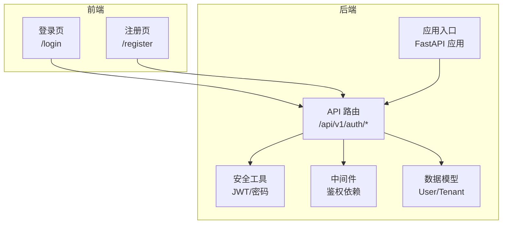
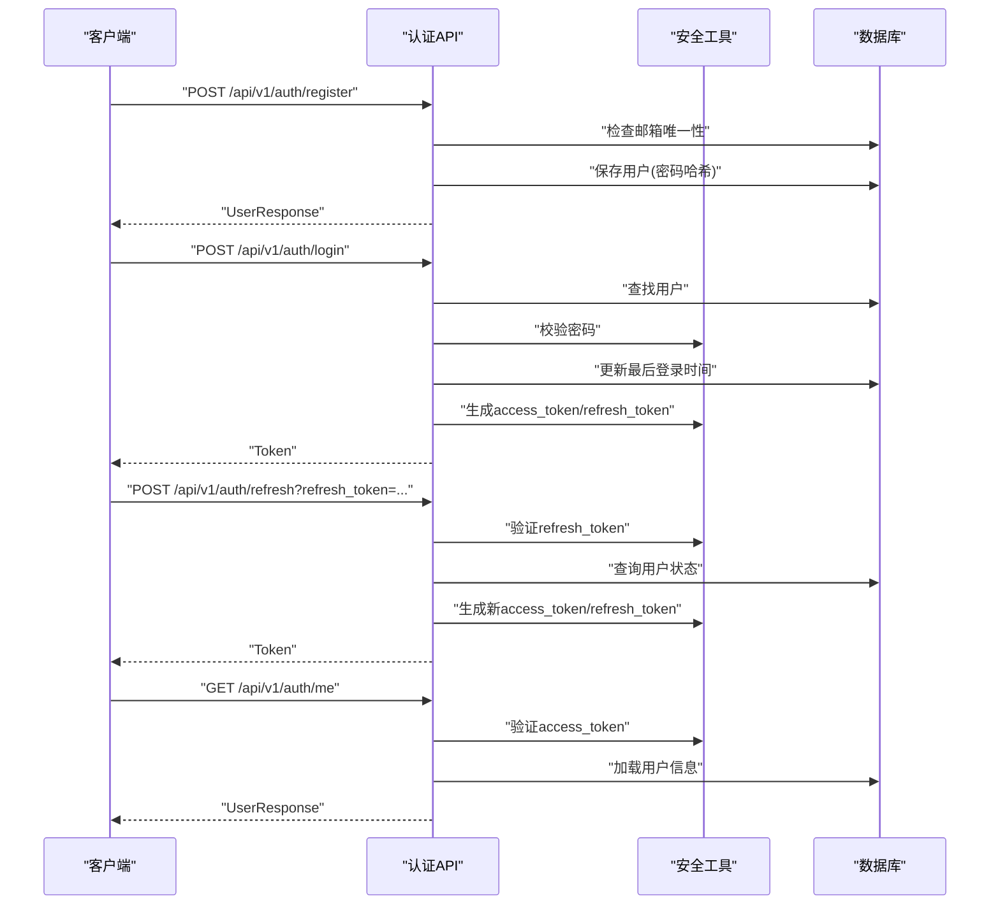
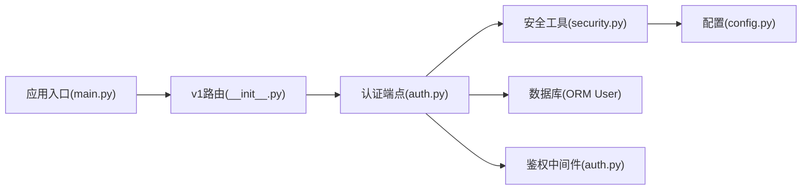

# 认证API

<cite>
**本文引用的文件**
- [backend/app/api/v1/endpoints/auth.py](file://backend/app/api/v1/endpoints/auth.py)
- [backend/app/middleware/auth.py](file://backend/app/middleware/auth.py)
- [backend/app/core/security.py](file://backend/app/core/security.py)
- [backend/app/models/system.py](file://backend/app/models/system.py)
- [backend/app/core/config.py](file://backend/app/core/config.py)
- [backend/app/api/v1/__init__.py](file://backend/app/api/v1/__init__.py)
- [backend/app/main.py](file://backend/app/main.py)
- [backend/tests/test_auth.py](file://backend/tests/test_auth.py)
- [frontend/app/login/page.tsx](file://frontend/app/login/page.tsx)
- [frontend/app/register/page.tsx](file://frontend/app/register/page.tsx)
</cite>

## 目录
1. [简介](#简介)
2. [项目结构](#项目结构)
3. [核心组件](#核心组件)
4. [架构总览](#架构总览)
5. [详细组件分析](#详细组件分析)
6. [依赖分析](#依赖分析)
7. [性能考虑](#性能考虑)
8. [故障排查指南](#故障排查指南)
9. [结论](#结论)
10. [附录](#附录)

## 简介
本文件为多租户族谱管理系统的认证API参考文档，覆盖用户注册、登录、令牌刷新与当前用户信息查询等接口。文档详细说明各端点的HTTP方法、URL路径、请求参数、响应格式与错误码；给出UserRegister、UserLogin、Token、UserResponse等数据模型定义；提供JWT令牌生成、验证与刷新机制说明；并包含密码加密、会话管理与安全注意事项，以及客户端集成指南与常见问题解决方案。

## 项目结构
认证相关代码主要分布在以下模块：
- API层：认证端点定义于v1路由下
- 安全层：JWT生成、校验与密码哈希
- 中间件：基于Bearer Token的用户解析与鉴权依赖
- 数据模型：用户实体与角色字段
- 配置：JWT密钥、算法与过期时间
- 前端：登录与注册页面对认证API的调用示例

图表来源
- [backend/app/api/v1/endpoints/auth.py:1-179](file://backend/app/api/v1/endpoints/auth.py#L1-L179)
- [backend/app/middleware/auth.py:1-88](file://backend/app/middleware/auth.py#L1-L88)
- [backend/app/core/security.py:1-103](file://backend/app/core/security.py#L1-L103)
- [backend/app/models/system.py:73-121](file://backend/app/models/system.py#L73-L121)
- [backend/app/main.py:45-91](file://backend/app/main.py#L45-L91)

章节来源
- [backend/app/api/v1/endpoints/auth.py:1-179](file://backend/app/api/v1/endpoints/auth.py#L1-L179)
- [backend/app/middleware/auth.py:1-88](file://backend/app/middleware/auth.py#L1-L88)
- [backend/app/core/security.py:1-103](file://backend/app/core/security.py#L1-L103)
- [backend/app/models/system.py:73-121](file://backend/app/models/system.py#L73-L121)
- [backend/app/main.py:45-91](file://backend/app/main.py#L45-L91)

## 核心组件
- 认证端点（FastAPI）：提供注册、登录、刷新令牌与获取当前用户信息四个端点
- 安全工具（JWT与密码）：负责令牌生成/验证、密码哈希与校验
- 鉴权中间件：从请求头提取并校验Bearer Token，解析当前用户
- 数据模型：User实体包含邮箱、密码哈希、昵称、头像、系统角色、状态与时间戳等字段
- 配置：JWT密钥、算法、访问令牌与刷新令牌过期时间等

章节来源
- [backend/app/api/v1/endpoints/auth.py:25-52](file://backend/app/api/v1/endpoints/auth.py#L25-L52)
- [backend/app/core/security.py:12-103](file://backend/app/core/security.py#L12-L103)
- [backend/app/middleware/auth.py:15-57](file://backend/app/middleware/auth.py#L15-L57)
- [backend/app/models/system.py:73-121](file://backend/app/models/system.py#L73-L121)
- [backend/app/core/config.py:53-58](file://backend/app/core/config.py#L53-L58)

## 架构总览
认证流程涉及客户端、API层、安全工具与数据库交互。登录成功后返回JWT访问令牌与刷新令牌；后续受保护资源通过访问令牌访问；当访问令牌过期时使用刷新令牌换取新的令牌对。

图表来源
- [backend/app/api/v1/endpoints/auth.py:55-179](file://backend/app/api/v1/endpoints/auth.py#L55-L179)
- [backend/app/core/security.py:26-103](file://backend/app/core/security.py#L26-L103)
- [backend/app/middleware/auth.py:15-57](file://backend/app/middleware/auth.py#L15-L57)
- [backend/app/models/system.py:73-121](file://backend/app/models/system.py#L73-L121)

## 详细组件分析

### 数据模型定义
- UserRegister：注册请求体
  - 字段：email（邮箱）、password（密码）、nickname（昵称，可选）
- UserLogin：登录请求体
  - 字段：email（邮箱）、password（密码）
- Token：令牌响应
  - 字段：access_token（访问令牌）、refresh_token（刷新令牌）、token_type（类型，默认bearer）
- UserResponse：用户信息响应
  - 字段：id（UUID字符串）、email、nickname（可选）、avatar（可选）、system_role（系统角色）

章节来源
- [backend/app/api/v1/endpoints/auth.py:25-52](file://backend/app/api/v1/endpoints/auth.py#L25-L52)
- [backend/app/models/system.py:73-121](file://backend/app/models/system.py#L73-L121)

### 端点定义与行为

#### 注册（POST /api/v1/auth/register）
- 请求体：UserRegister
- 成功响应：UserResponse
- 错误码：
  - 400：邮箱已存在
- 行为要点：
  - 检查邮箱唯一性
  - 使用密码哈希保存用户
  - 返回用户基本信息

章节来源
- [backend/app/api/v1/endpoints/auth.py:55-87](file://backend/app/api/v1/endpoints/auth.py#L55-L87)

#### 登录（POST /api/v1/auth/login）
- 请求体：UserLogin
- 成功响应：Token
- 错误码：
  - 401：邮箱或密码无效
  - 403：账户被禁用
- 行为要点：
  - 查找用户并校验密码
  - 更新最后登录时间
  - 生成访问令牌与刷新令牌

章节来源
- [backend/app/api/v1/endpoints/auth.py:89-124](file://backend/app/api/v1/endpoints/auth.py#L89-L124)

#### 刷新令牌（POST /api/v1/auth/refresh）
- 查询参数：refresh_token（字符串）
- 成功响应：Token
- 错误码：
  - 401：刷新令牌无效或用户不存在/未激活
- 行为要点：
  - 验证刷新令牌类型与有效性
  - 查询用户状态
  - 生成新的访问令牌与刷新令牌

章节来源
- [backend/app/api/v1/endpoints/auth.py:126-159](file://backend/app/api/v1/endpoints/auth.py#L126-L159)

#### 获取当前用户（GET /api/v1/auth/me）
- 认证方式：请求头携带Authorization: Bearer <access_token>
- 成功响应：UserResponse
- 错误码：
  - 401：未认证
- 行为要点：
  - 通过中间件解析并校验访问令牌
  - 加载用户信息并返回

章节来源
- [backend/app/api/v1/endpoints/auth.py:161-179](file://backend/app/api/v1/endpoints/auth.py#L161-L179)
- [backend/app/middleware/auth.py:15-57](file://backend/app/middleware/auth.py#L15-L57)

### JWT 令牌机制
- 生成
  - 访问令牌：包含子(subject)、过期(exp)与类型(type=access)，默认有效期由配置决定
  - 刷新令牌：包含子(subject)、过期(exp)与类型(type=refresh)，默认有效期由配置决定
- 验证
  - 解码并校验签名与算法
  - 校验令牌类型匹配（access 或 refresh）
  - 提取subject（用户ID）
- 刷新
  - 使用有效且正确的刷新令牌换取新的令牌对

章节来源
- [backend/app/core/security.py:26-103](file://backend/app/core/security.py#L26-L103)
- [backend/app/core/config.py:53-58](file://backend/app/core/config.py#L53-L58)

### 密码加密与会话管理
- 密码加密
  - 使用bcrypt上下文进行哈希与校验
- 会话管理
  - 访问令牌用于短期受保护资源访问
  - 刷新令牌用于在过期后换取新的令牌对
  - 当前“获取当前用户”端点依赖中间件解析访问令牌，但实现中存在待办标记，建议使用更完善的依赖注入

章节来源
- [backend/app/core/security.py:12-24](file://backend/app/core/security.py#L12-L24)
- [backend/app/api/v1/endpoints/auth.py:161-179](file://backend/app/api/v1/endpoints/auth.py#L161-L179)
- [backend/app/middleware/auth.py:15-57](file://backend/app/middleware/auth.py#L15-L57)

### 客户端集成指南
- 登录
  - 向 /api/v1/auth/login 发送邮箱与密码
  - 成功后保存 access_token 与 refresh_token
  - 后续请求在 Authorization 头部添加 Bearer <access_token>
- 注册
  - 向 /api/v1/auth/register 发送邮箱、密码与昵称
  - 成功后自动触发登录并保存令牌
- 刷新令牌
  - 当访问令牌即将过期时，向 /api/v1/auth/refresh 传入 refresh_token
  - 成功后替换本地存储的新令牌对

章节来源
- [frontend/app/login/page.tsx:18-38](file://frontend/app/login/page.tsx#L18-L38)
- [frontend/app/register/page.tsx:20-52](file://frontend/app/register/page.tsx#L20-L52)
- [backend/app/api/v1/endpoints/auth.py:89-159](file://backend/app/api/v1/endpoints/auth.py#L89-L159)

### 请求/响应示例

- 注册（成功）
  - 请求：POST /api/v1/auth/register
  - 请求体：{
    - "email": "string",
    - "password": "string",
    - "nickname": "string"
  }
  - 响应：{
    - "id": "string(UUID)",
    - "email": "string",
    - "nickname": "string|null",
    - "avatar": "string|null",
    - "system_role": "string"
  }

- 登录（成功）
  - 请求：POST /api/v1/auth/login
  - 请求体：{
    - "email": "string",
    - "password": "string"
  }
  - 响应：{
    - "access_token": "string",
    - "refresh_token": "string",
    - "token_type": "bearer"
  }

- 刷新令牌（成功）
  - 请求：POST /api/v1/auth/refresh?refresh_token=...
  - 响应：{
    - "access_token": "string",
    - "refresh_token": "string",
    - "token_type": "bearer"
  }

- 获取当前用户（成功）
  - 请求：GET /api/v1/auth/me
  - 请求头：Authorization: Bearer <access_token>
  - 响应：{
    - "id": "string(UUID)",
    - "email": "string",
    - "nickname": "string|null",
    - "avatar": "string|null",
    - "system_role": "string"
  }

- 典型错误
  - 注册：400 邮箱已存在
  - 登录：401 无效邮箱或密码；403 账户被禁用
  - 刷新：401 刷新令牌无效或用户不存在/未激活
  - 获取当前用户：401 未认证

章节来源
- [backend/tests/test_auth.py:12-149](file://backend/tests/test_auth.py#L12-L149)
- [backend/app/api/v1/endpoints/auth.py:55-179](file://backend/app/api/v1/endpoints/auth.py#L55-L179)

## 依赖分析
- API路由聚合
  - v1路由聚合了认证、租户、族谱树与人员等端点
- 认证端点依赖
  - 安全工具：密码哈希与校验、JWT生成与验证
  - 数据库：用户表查询与写入
  - 中间件：访问令牌解析与鉴权
- 配置依赖
  - JWT密钥、算法与过期时间来自配置

图表来源
- [backend/app/api/v1/endpoints/auth.py:1-22](file://backend/app/api/v1/endpoints/auth.py#L1-L22)
- [backend/app/api/v1/__init__.py:6-19](file://backend/app/api/v1/__init__.py#L6-L19)
- [backend/app/middleware/auth.py:1-13](file://backend/app/middleware/auth.py#L1-L13)
- [backend/app/core/security.py:1-11](file://backend/app/core/security.py#L1-L11)
- [backend/app/core/config.py:1-20](file://backend/app/core/config.py#L1-L20)
- [backend/app/main.py:45-71](file://backend/app/main.py#L45-L71)

章节来源
- [backend/app/api/v1/endpoints/auth.py:1-22](file://backend/app/api/v1/endpoints/auth.py#L1-L22)
- [backend/app/api/v1/__init__.py:6-19](file://backend/app/api/v1/__init__.py#L6-L19)
- [backend/app/middleware/auth.py:1-13](file://backend/app/middleware/auth.py#L1-L13)
- [backend/app/core/security.py:1-11](file://backend/app/core/security.py#L1-L11)
- [backend/app/core/config.py:1-20](file://backend/app/core/config.py#L1-L20)
- [backend/app/main.py:45-71](file://backend/app/main.py#L45-L71)

## 性能考虑
- 密码哈希成本：bcrypt默认成本适中，建议在生产环境根据硬件能力调整以平衡安全性与性能
- JWT负载：仅包含必要声明（如sub、exp、type），避免冗余字段
- 令牌轮换：定期轮换刷新令牌，限制单个刷新令牌的使用次数与有效期
- 数据库连接：使用异步会话池，合理设置连接数与溢出，避免高并发下的连接争用

## 故障排查指南
- 登录失败（401）
  - 检查邮箱与密码是否正确
  - 确认账户处于启用状态
- 刷新失败（401）
  - 确认refresh_token未过期且类型正确
  - 确认用户仍存在且处于启用状态
- 获取当前用户失败（401）
  - 确认请求头中携带有效的Bearer访问令牌
  - 确认令牌未过期且签名有效
- 注册失败（400）
  - 检查邮箱是否已被注册

章节来源
- [backend/app/api/v1/endpoints/auth.py:89-179](file://backend/app/api/v1/endpoints/auth.py#L89-L179)
- [backend/tests/test_auth.py:12-149](file://backend/tests/test_auth.py#L12-L149)

## 结论
本认证API提供了完整的用户生命周期管理与令牌体系，结合前端示例可快速完成集成。建议在生产环境中强化令牌轮换策略、完善鉴权依赖注入，并持续监控与优化性能与安全配置。

## 附录

### 端点一览与规范
- 注册
  - 方法：POST
  - 路径：/api/v1/auth/register
  - 请求体：UserRegister
  - 成功响应：UserResponse
  - 错误码：400
- 登录
  - 方法：POST
  - 路径：/api/v1/auth/login
  - 请求体：UserLogin
  - 成功响应：Token
  - 错误码：401、403
- 刷新令牌
  - 方法：POST
  - 路径：/api/v1/auth/refresh
  - 查询参数：refresh_token
  - 成功响应：Token
  - 错误码：401
- 获取当前用户
  - 方法：GET
  - 路径：/api/v1/auth/me
  - 请求头：Authorization: Bearer <access_token>
  - 成功响应：UserResponse
  - 错误码：401

章节来源
- [backend/app/api/v1/endpoints/auth.py:55-179](file://backend/app/api/v1/endpoints/auth.py#L55-L179)