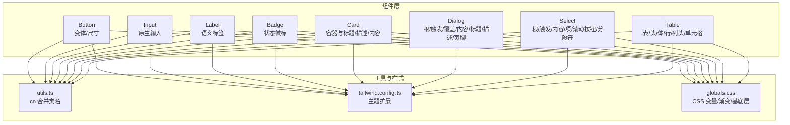
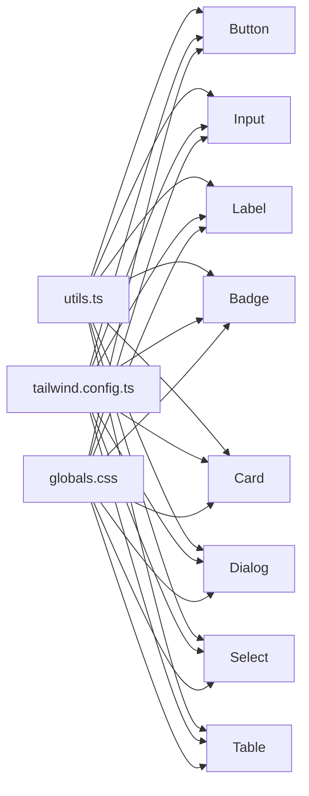
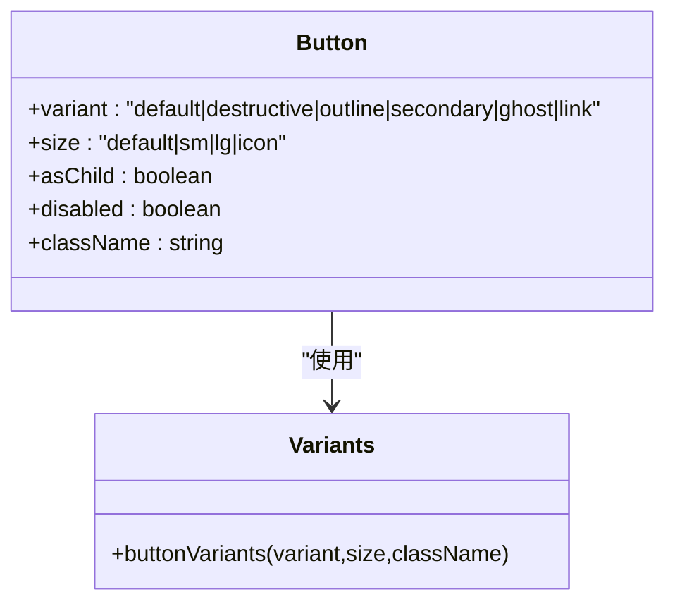
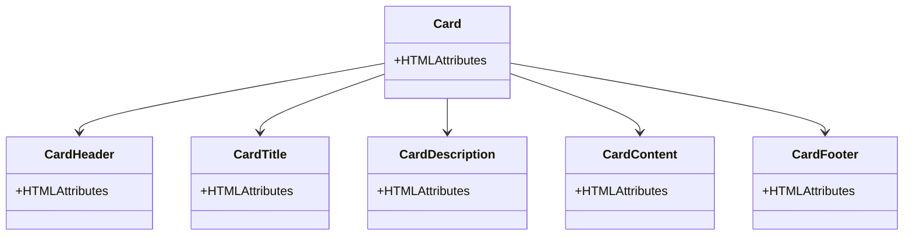
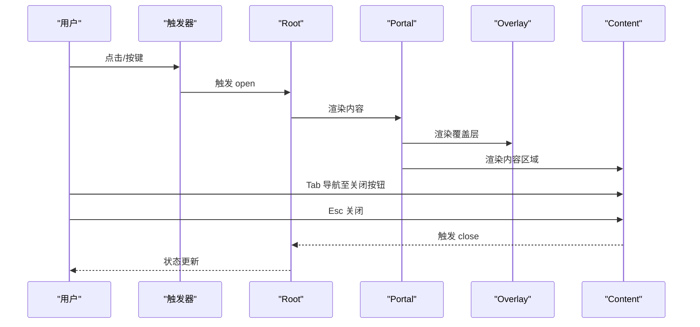
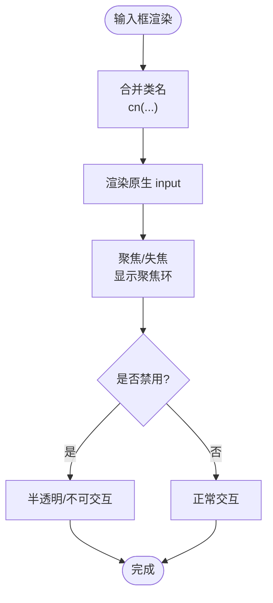
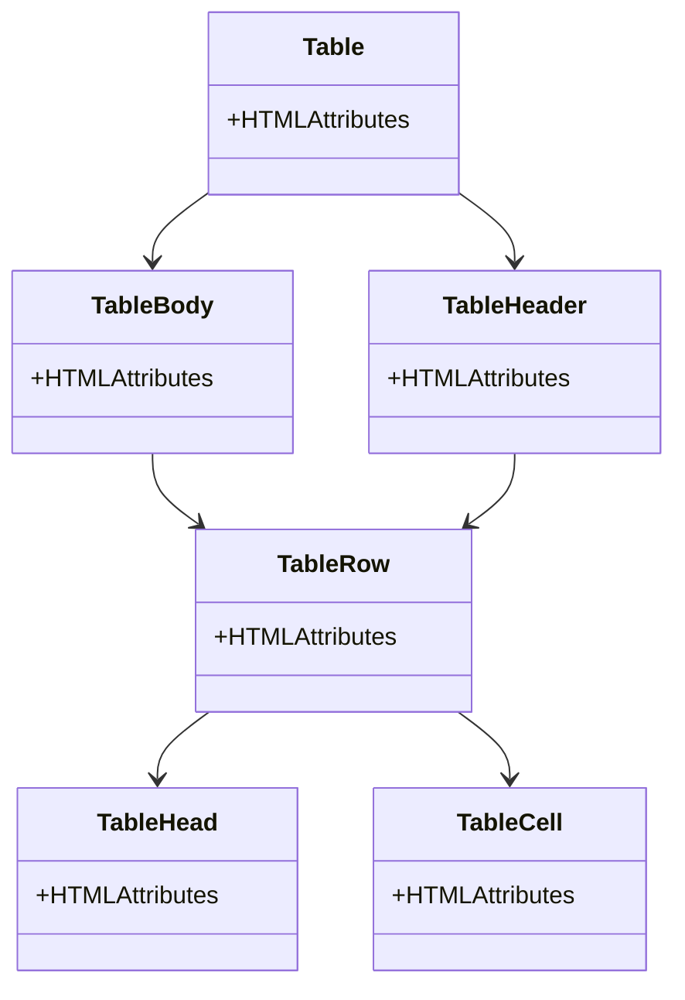
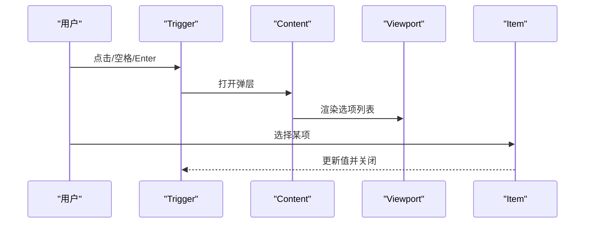
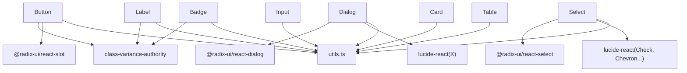

# UI组件库

<cite>
**本文引用的文件**
- [button.tsx](file://frontend/components/ui/button.tsx)
- [card.tsx](file://frontend/components/ui/card.tsx)
- [dialog.tsx](file://frontend/components/ui/dialog.tsx)
- [input.tsx](file://frontend/components/ui/input.tsx)
- [table.tsx](file://frontend/components/ui/table.tsx)
- [badge.tsx](file://frontend/components/ui/badge.tsx)
- [label.tsx](file://frontend/components/ui/label.tsx)
- [select.tsx](file://frontend/components/ui/select.tsx)
- [utils.ts](file://frontend/lib/utils.ts)
- [tailwind.config.ts](file://frontend/tailwind.config.ts)
- [globals.css](file://frontend/app/globals.css)
- [layout.tsx](file://frontend/app/layout.tsx)
- [package.json](file://frontend/package.json)
</cite>

## 目录
1. [简介](#简介)
2. [项目结构](#项目结构)
3. [核心组件](#核心组件)
4. [架构总览](#架构总览)
5. [详细组件分析](#详细组件分析)
6. [依赖关系分析](#依赖关系分析)
7. [性能考量](#性能考量)
8. [无障碍与键盘导航](#无障碍与键盘导航)
9. [主题定制与样式覆盖](#主题定制与样式覆盖)
10. [组合模式与状态管理](#组合模式与状态管理)
11. [故障排查指南](#故障排查指南)
12. [结论](#结论)

## 简介
本文件为多租户族谱管理系统前端的UI组件库文档，聚焦于基于 shadcn/ui 设计理念与 Radix UI 原子能力构建的组件体系，以及在本项目中的定制化扩展。文档从设计原则、属性接口、使用模式、主题定制、无障碍支持、性能优化与常见问题等方面进行系统说明，帮助开发者快速理解并正确使用组件库。

## 项目结构
组件库位于 frontend/components/ui 下，采用“原子化组件 + 组合容器”的分层组织方式：基础输入/展示型组件（如按钮、输入框、标签、徽章）与复合交互组件（如对话框、选择器、表格）分离，便于复用与维护；通过 Tailwind CSS 与 class-variance-authority 实现变体与样式控制；借助 Radix UI 提供可访问性与跨浏览器一致性。

图表来源
- [button.tsx:1-56](file://frontend/components/ui/button.tsx#L1-L56)
- [input.tsx:1-25](file://frontend/components/ui/input.tsx#L1-L25)
- [label.tsx:1-23](file://frontend/components/ui/label.tsx#L1-L23)
- [badge.tsx:1-36](file://frontend/components/ui/badge.tsx#L1-L36)
- [card.tsx:1-79](file://frontend/components/ui/card.tsx#L1-L79)
- [dialog.tsx:1-119](file://frontend/components/ui/dialog.tsx#L1-L119)
- [select.tsx:1-158](file://frontend/components/ui/select.tsx#L1-L158)
- [table.tsx:1-81](file://frontend/components/ui/table.tsx#L1-L81)
- [utils.ts:1-7](file://frontend/lib/utils.ts#L1-L7)
- [tailwind.config.ts:1-36](file://frontend/tailwind.config.ts#L1-L36)
- [globals.css:1-67](file://frontend/app/globals.css#L1-L67)

章节来源
- [layout.tsx:1-25](file://frontend/app/layout.tsx#L1-L25)
- [package.json:1-45](file://frontend/package.json#L1-L45)

## 核心组件
本节概述各组件的设计原则与通用特性：
- 统一的类名合并：通过工具函数合并 Tailwind 类，避免冲突并支持变体叠加。
- 变体与尺寸：使用 class-variance-authority 定义变体与默认值，确保一致的视觉与交互反馈。
- 可访问性：基于 Radix UI 的语义与键盘行为，保证屏幕阅读器与键盘导航可用。
- 受控与非受控：输入类组件遵循原生 HTML 属性；复合组件通过状态管理实现受控行为。

章节来源
- [button.tsx:6-33](file://frontend/components/ui/button.tsx#L6-L33)
- [input.tsx:4-24](file://frontend/components/ui/input.tsx#L4-L24)
- [label.tsx:5-19](file://frontend/components/ui/label.tsx#L5-L19)
- [badge.tsx:5-23](file://frontend/components/ui/badge.tsx#L5-L23)
- [card.tsx:4-78](file://frontend/components/ui/card.tsx#L4-L78)
- [dialog.tsx:8-118](file://frontend/components/ui/dialog.tsx#L8-L118)
- [select.tsx:8-157](file://frontend/components/ui/select.tsx#L8-L157)
- [table.tsx:4-80](file://frontend/components/ui/table.tsx#L4-L80)
- [utils.ts:4-6](file://frontend/lib/utils.ts#L4-L6)

## 架构总览
组件库围绕以下关键点构建：
- 基础组件：Button、Input、Label、Badge、Table、Select、Dialog、Card。
- 工具与样式：utils.ts 提供类名合并；Tailwind 配置扩展主色系；全局 CSS 提供 CSS 变量与渐变。
- 无障碍与键盘：Radix UI 提供可访问性语义与键盘行为；组件内显式包含 sr-only 文本以增强可读性。
- 主题与暗色模式：通过 CSS 变量与 Tailwind 扩展颜色空间，支持明/暗两套调色板。

图表来源
- [utils.ts:4-6](file://frontend/lib/utils.ts#L4-L6)
- [tailwind.config.ts:10-30](file://frontend/tailwind.config.ts#L10-L30)
- [globals.css:52-66](file://frontend/app/globals.css#L52-L66)
- [button.tsx:1-56](file://frontend/components/ui/button.tsx#L1-L56)
- [input.tsx:1-25](file://frontend/components/ui/input.tsx#L1-L25)
- [label.tsx:1-23](file://frontend/components/ui/label.tsx#L1-L23)
- [badge.tsx:1-36](file://frontend/components/ui/badge.tsx#L1-L36)
- [card.tsx:1-79](file://frontend/components/ui/card.tsx#L1-L79)
- [dialog.tsx:1-119](file://frontend/components/ui/dialog.tsx#L1-L119)
- [select.tsx:1-158](file://frontend/components/ui/select.tsx#L1-L158)
- [table.tsx:1-81](file://frontend/components/ui/table.tsx#L1-L81)

## 详细组件分析

### 按钮 Button
- 设计原则
  - 使用 Slot 支持 asChild 将按钮渲染为任意元素，提升组合灵活性。
  - 变体与尺寸通过 cva 定义，统一视觉反馈与交互状态。
- 关键属性
  - 变体：default、destructive、outline、secondary、ghost、link。
  - 尺寸：default、sm、lg、icon。
  - 其他：disabled、className、asChild 等原生属性透传。
- 无障碍与键盘
  - 默认 button 元素具备原生可访问性；作为链接时建议提供语义化替代方案或额外 aria-label。
- 性能与渲染
  - 无内部状态，纯函数组件，渲染开销极低；注意避免频繁重渲染导致的 className 计算。

图表来源
- [button.tsx:35-53](file://frontend/components/ui/button.tsx#L35-L53)
- [button.tsx:6-33](file://frontend/components/ui/button.tsx#L6-L33)

章节来源
- [button.tsx:1-56](file://frontend/components/ui/button.tsx#L1-L56)

### 卡片 Card
- 设计原则
  - 分离 Header/Title/Description/Content/Footer，便于灵活组合。
  - 保持圆角、边框与阴影的一致性，适配卡片式布局。
- 关键属性
  - Card：div 容器，支持 className。
  - CardHeader/CardFooter：flex 布局，间距与对齐。
  - CardTitle：标题语义与字号。
  - CardDescription：辅助文本，弱化强调。
  - CardContent：内边距与顶部留白控制。
- 无障碍与键盘
  - 语义化 HTML 结构；标题层级合理。
- 性能与渲染
  - 纯展示组件，渲染成本低；注意避免在 Card 内部进行重型计算。

图表来源
- [card.tsx:4-78](file://frontend/components/ui/card.tsx#L4-L78)

章节来源
- [card.tsx:1-79](file://frontend/components/ui/card.tsx#L1-L79)

### 对话框 Dialog
- 设计原则
  - 基于 Radix UI 的 Root/Portal/Overlay/Content/Trigger/Close，确保可访问性与动画一致性。
  - 覆盖层与内容居中，带淡入/缩放/滑入动画。
- 关键属性
  - Overlay：全屏遮罩，支持 data-state 动画。
  - Content：固定居中网格，最大宽度与阴影。
  - Close：带 sr-only 文本的关闭按钮，支持聚焦环与禁用态。
  - Header/Footer：响应式布局，移动端纵向、桌面横向。
  - Title/Description：语义化标题与描述。
- 无障碍与键盘
  - 自动聚焦到内容；Esc 关闭；焦点陷阱；屏幕阅读器可读。
- 性能与渲染
  - Portal 渲染到文档根节点，减少布局抖动；动画使用 CSS 过渡，避免 JS 动画阻塞。

图表来源
- [dialog.tsx:8-118](file://frontend/components/ui/dialog.tsx#L8-L118)

章节来源
- [dialog.tsx:1-119](file://frontend/components/ui/dialog.tsx#L1-L119)

### 输入框 Input
- 设计原则
  - 原生 input 行为，支持 type、placeholder、禁用态与聚焦环。
  - 统一圆角、边框、背景与占位符颜色。
- 关键属性
  - 原生 input 属性透传：type、value、onChange、onBlur 等。
  - className：允许覆盖样式。
- 无障碍与键盘
  - 语义化 label 关联；错误状态可通过 aria-invalid 传达。
- 性能与渲染
  - 纯函数组件；避免在父级频繁重建 props。

图表来源
- [input.tsx:7-21](file://frontend/components/ui/input.tsx#L7-L21)
- [utils.ts:4-6](file://frontend/lib/utils.ts#L4-L6)

章节来源
- [input.tsx:1-25](file://frontend/components/ui/input.tsx#L1-L25)

### 表格 Table
- 设计原则
  - 外层容器提供水平滚动，保障小屏可读性。
  - 行悬停与选中态，配合复选框场景。
- 关键属性
  - Table：外层容器 + 水平滚动。
  - TableHeader/TableBody：语义化分区。
  - TableRow：边框与悬停态。
  - TableHead/TableCell：对齐、内边距与复选框场景处理。
- 无障碍与键盘
  - 语义化表结构；可结合 aria-sort 等属性标注排序状态。
- 性能与渲染
  - 大数据量建议虚拟化或分页；避免每行重新计算样式。

图表来源
- [table.tsx:4-80](file://frontend/components/ui/table.tsx#L4-L80)

章节来源
- [table.tsx:1-81](file://frontend/components/ui/table.tsx#L1-L81)

### 徽章 Badge
- 设计原则
  - 状态化标签，支持默认/次要/破坏性/描边等变体。
- 关键属性
  - 变体：default、secondary、destructive、outline。
  - className：允许覆盖。
- 无障碍与键盘
  - 纯展示，无需特殊处理。
- 性能与渲染
  - 轻量组件，渲染成本低。

章节来源
- [badge.tsx:1-36](file://frontend/components/ui/badge.tsx#L1-L36)

### 标签 Label
- 设计原则
  - 与表单控件配对使用，支持 peer 系列伪类联动。
- 关键属性
  - 原生 label 属性透传。
- 无障碍与键盘
  - 与 input/textarea 等控件关联时，点击标签可激活控件。
- 性能与渲染
  - 纯展示，渲染成本低。

章节来源
- [label.tsx:1-23](file://frontend/components/ui/label.tsx#L1-L23)

### 选择器 Select
- 设计原则
  - 基于 Radix UI Select，支持滚动按钮、视口、指示器与图标。
  - 支持 popper 位置偏移，适配不同布局。
- 关键属性
  - Trigger：触发器，含下拉图标与占位文本。
  - Content：弹出层，含上下滚动按钮与视口。
  - Item：选项项，含选中指示器。
  - ScrollUpButton/ScrollDownButton：滚动控制。
  - Separator：分隔线。
- 无障碍与键盘
  - 键盘导航、自动聚焦、选中态同步。
- 性能与渲染
  - 选项较多时建议虚拟化；Portal 渲染减少布局影响。

图表来源
- [select.tsx:12-157](file://frontend/components/ui/select.tsx#L12-L157)

章节来源
- [select.tsx:1-158](file://frontend/components/ui/select.tsx#L1-L158)

## 依赖关系分析
- 组件依赖
  - class-variance-authority：用于定义变体与默认值。
  - @radix-ui/react-*：提供可访问性与状态管理（Slot、Dialog、Select、DropdownMenu、Tabs）。
  - lucide-react：提供图标。
  - tailwind-merge/clsx：合并类名，避免冲突。
- 样式依赖
  - Tailwind CSS：原子化样式；CSS 变量提供主题切换。
  - 全局 CSS：定义 CSS 变量与渐变工具类。

图表来源
- [button.tsx:2-4](file://frontend/components/ui/button.tsx#L2-L4)
- [dialog.tsx:3-6](file://frontend/components/ui/dialog.tsx#L3-L6)
- [select.tsx:3-6](file://frontend/components/ui/select.tsx#L3-L6)
- [input.tsx:2](file://frontend/components/ui/input.tsx#L2)
- [label.tsx:2-3](file://frontend/components/ui/label.tsx#L2-L3)
- [badge.tsx:2-3](file://frontend/components/ui/badge.tsx#L2-L3)
- [card.tsx:2](file://frontend/components/ui/card.tsx#L2)
- [table.tsx:2](file://frontend/components/ui/table.tsx#L2)
- [utils.ts:1-2](file://frontend/lib/utils.ts#L1-L2)

章节来源
- [package.json:12-31](file://frontend/package.json#L12-L31)

## 性能考量
- 渲染优化
  - 使用 React.memo 或稳定化 props，避免不必要的重渲染。
  - 大表格建议虚拟化或分页；Select 选项过多时考虑懒加载。
- 样式优化
  - 合理使用 cn 合并类名，避免重复与冲突。
  - Tailwind JIT 模式下按需生成样式，减少包体积。
- 动画与交互
  - 使用 CSS 过渡而非 JS 动画；Dialog/Select 的动画应简洁高效。
- 内存泄漏
  - 避免在组件卸载后仍持有定时器或订阅；清理副作用。
  - Portal 渲染的组件应在根节点正确卸载。

## 无障碍与键盘导航
- 可访问性
  - 所有交互组件基于 Radix UI，具备 ARIA 属性与键盘行为。
  - 对话框自动聚焦到内容；关闭按钮提供 sr-only 文本。
  - 选择器支持键盘导航与快捷键。
- 键盘导航
  - Tab 切换焦点；Esc 关闭；Enter/Space 触发。
  - 表格支持方向键与 Enter/Space 选择。
- 屏幕阅读器
  - 标题与描述使用语义化标签；必要时添加 aria-label/aria-describedby。
  - 状态变化（如错误）通过 aria-live 区域提示。

## 主题定制与样式覆盖
- 主题扩展
  - Tailwind 配置扩展了 primary 色阶，满足品牌色需求。
  - CSS 变量定义明/暗两套主题，支持 class 切换。
- 样式覆盖
  - 通过 className 与变体叠加实现局部覆盖。
  - 全局 CSS 提供渐变工具类与基底层样式。
- 响应式行为
  - Dialog Footer 在移动端纵向、桌面横向排列。
  - Table 外层容器提供水平滚动，适配窄屏。

章节来源
- [tailwind.config.ts:10-30](file://frontend/tailwind.config.ts#L10-L30)
- [globals.css:52-66](file://frontend/app/globals.css#L52-L66)
- [dialog.tsx:66-77](file://frontend/components/ui/dialog.tsx#L66-L77)
- [table.tsx:8](file://frontend/components/ui/table.tsx#L8)

## 组合模式与状态管理
- 组合模式
  - Card 与 Button/Label/Select 组合用于表单卡片。
  - Dialog 与 Form/Select/Table 组合用于模态编辑。
  - Badge 与 Label/Icon 组合用于状态提示。
- 状态管理
  - 使用 zustand 或 React 状态管理库进行轻量状态存储。
  - 表单状态建议集中管理，避免深层传递。
- 事件处理
  - Input/Select/Dialog 等组件通过回调与受控属性处理事件。
  - 注意防抖与节流在搜索/筛选场景中的使用。

## 故障排查指南
- 样式不生效
  - 检查 Tailwind 内容路径与 CSS 变量是否正确。
  - 确认 className 合并顺序与优先级。
- 动画异常
  - 检查 Radix UI 动画类与 Portal 渲染位置。
  - 确保覆盖层与内容在同一层级。
- 可访问性问题
  - 确保标签与输入关联；为图标提供 sr-only 文本。
  - 检查焦点顺序与 Esc 关闭逻辑。
- 性能问题
  - 大表格/列表虚拟化；避免在渲染中执行昂贵操作。
  - 清理定时器与订阅，防止内存泄漏。

## 结论
本组件库以 shadcn/ui 的设计思想为基础，结合 Radix UI 的可访问性与 Tailwind 的样式系统，提供了高复用、可定制、易扩展的 UI 基础设施。通过清晰的变体与尺寸体系、完善的无障碍支持与主题定制能力，能够满足多租户族谱管理系统的复杂交互与视觉需求。建议在实际开发中遵循本文档的组合模式与性能实践，持续优化用户体验与可维护性。