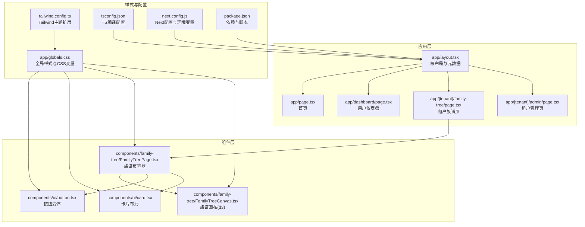
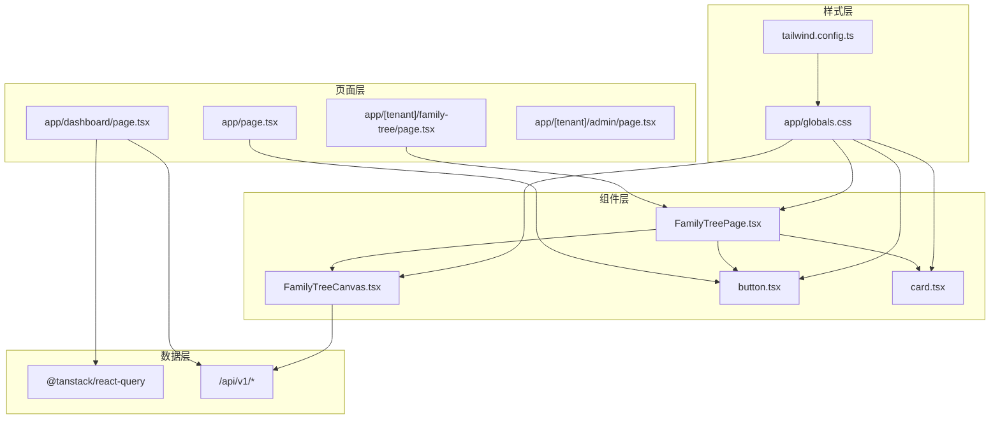
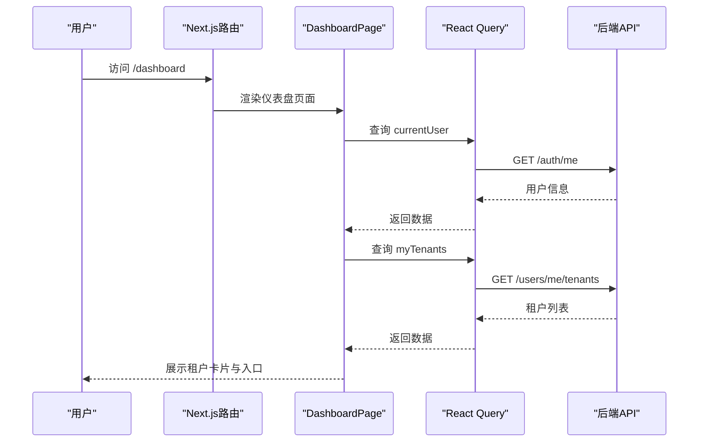
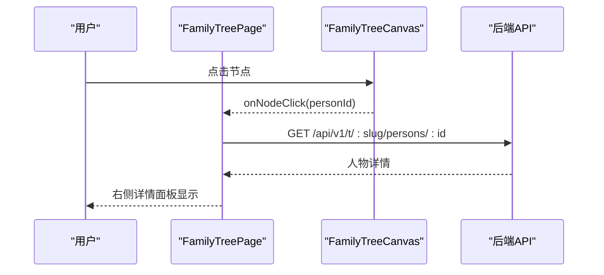
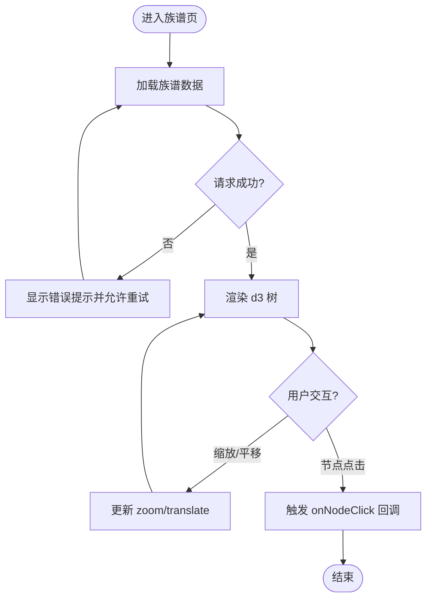
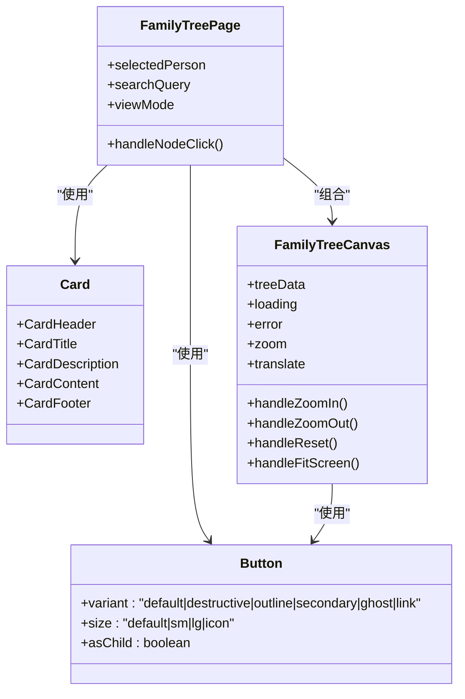
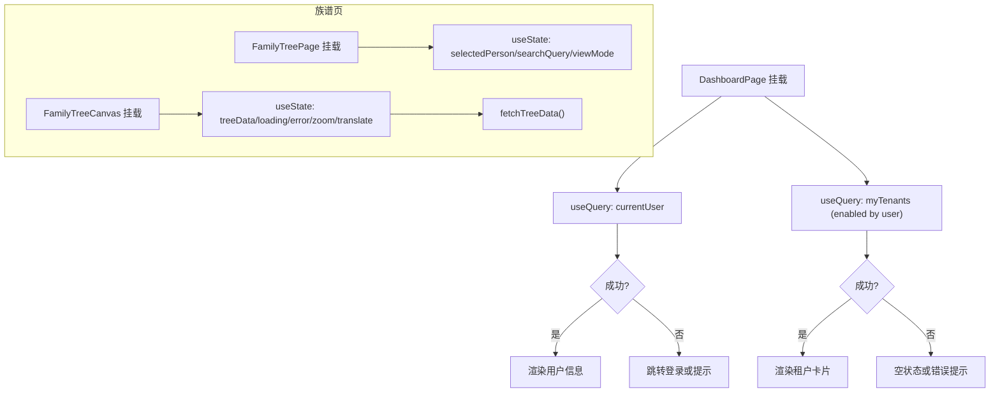
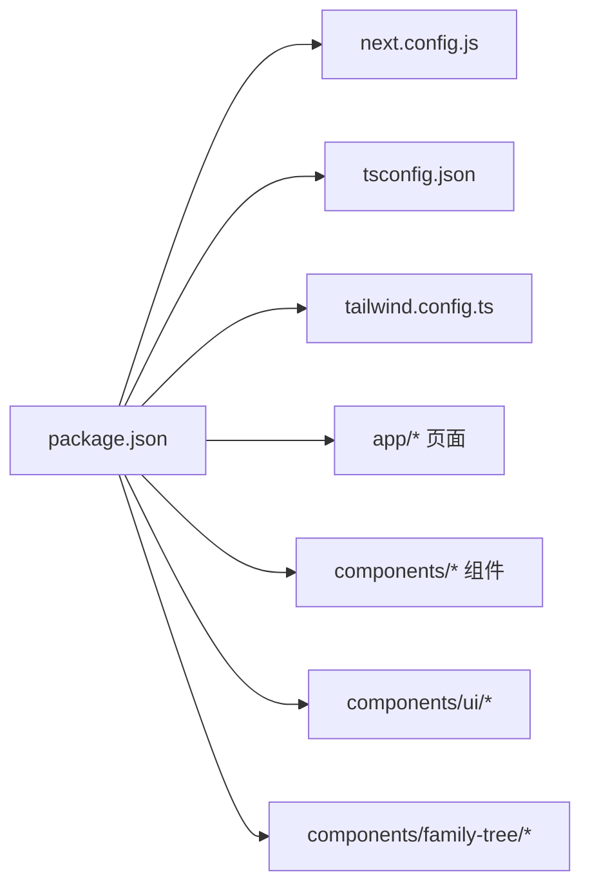

# 前端架构

<cite>
**本文引用的文件**
- [package.json](file://frontend/package.json)
- [next.config.js](file://frontend/next.config.js)
- [tsconfig.json](file://frontend/tsconfig.json)
- [tailwind.config.ts](file://frontend/tailwind.config.ts)
- [app/layout.tsx](file://frontend/app/layout.tsx)
- [app/page.tsx](file://frontend/app/page.tsx)
- [app/dashboard/page.tsx](file://frontend/app/dashboard/page.tsx)
- [app/[tenant]/family-tree/page.tsx](file://frontend/app/[tenant]/family-tree/page.tsx)
- [app/[tenant]/admin/page.tsx](file://frontend/app/[tenant]/admin/page.tsx)
- [app/globals.css](file://frontend/app/globals.css)
- [components/family-tree/FamilyTreePage.tsx](file://frontend/components/family-tree/FamilyTreePage.tsx)
- [components/family-tree/FamilyTreeCanvas.tsx](file://frontend/components/family-tree/FamilyTreeCanvas.tsx)
- [components/ui/button.tsx](file://frontend/components/ui/button.tsx)
- [components/ui/card.tsx](file://frontend/components/ui/card.tsx)
</cite>

## 目录
1. [引言](#引言)
2. [项目结构](#项目结构)
3. [核心组件](#核心组件)
4. [架构总览](#架构总览)
5. [详细组件分析](#详细组件分析)
6. [依赖分析](#依赖分析)
7. [性能考虑](#性能考虑)
8. [故障排查指南](#故障排查指南)
9. [结论](#结论)
10. [附录](#附录)

## 引言
本文件面向多租户族谱管理系统（前端）提供系统化、可操作的架构文档，聚焦于基于 Next.js 15 的前端技术栈与组件架构。内容涵盖页面路由设计、状态管理、UI 组件库、族谱树可视化组件的实现原理与交互模式、组件间通信与数据流、生命周期管理、响应式与可访问性、样式定制与主题、跨浏览器兼容与性能优化、组件组合与集成方式，以及开发环境与构建流程。

## 项目结构
前端采用 Next.js App Router 的 app 目录结构，按“租户域”组织页面路由，核心目录与职责如下：
- app：页面与布局，包含根布局、首页、仪表盘、登录注册、租户域页面等
- components：可复用 UI 组件与业务组件（如族谱树）
- 配置：Next.js、TypeScript、TailwindCSS、环境变量等

图表来源
- [app/layout.tsx:1-25](file://frontend/app/layout.tsx#L1-L25)
- [app/page.tsx:1-122](file://frontend/app/page.tsx#L1-L122)
- [app/dashboard/page.tsx:1-185](file://frontend/app/dashboard/page.tsx#L1-L185)
- [app/[tenant]/family-tree/page.tsx:1-22](file://frontend/app/[tenant]/family-tree/page.tsx#L1-L22)
- [app/[tenant]/admin/page.tsx:1-20](file://frontend/app/[tenant]/admin/page.tsx#L1-L20)
- [components/family-tree/FamilyTreePage.tsx:1-226](file://frontend/components/family-tree/FamilyTreePage.tsx#L1-L226)
- [components/family-tree/FamilyTreeCanvas.tsx:1-236](file://frontend/components/family-tree/FamilyTreeCanvas.tsx#L1-L236)
- [components/ui/button.tsx:1-56](file://frontend/components/ui/button.tsx#L1-L56)
- [components/ui/card.tsx:1-79](file://frontend/components/ui/card.tsx#L1-L79)
- [app/globals.css:1-67](file://frontend/app/globals.css#L1-L67)
- [tailwind.config.ts:1-36](file://frontend/tailwind.config.ts#L1-L36)
- [tsconfig.json:1-28](file://frontend/tsconfig.json#L1-L28)
- [next.config.js:1-23](file://frontend/next.config.js#L1-L23)
- [package.json:1-45](file://frontend/package.json#L1-L45)

章节来源
- [app/layout.tsx:1-25](file://frontend/app/layout.tsx#L1-L25)
- [app/page.tsx:1-122](file://frontend/app/page.tsx#L1-L122)
- [app/dashboard/page.tsx:1-185](file://frontend/app/dashboard/page.tsx#L1-L185)
- [app/[tenant]/family-tree/page.tsx:1-22](file://frontend/app/[tenant]/family-tree/page.tsx#L1-L22)
- [app/[tenant]/admin/page.tsx:1-20](file://frontend/app/[tenant]/admin/page.tsx#L1-L20)
- [app/globals.css:1-67](file://frontend/app/globals.css#L1-L67)
- [tailwind.config.ts:1-36](file://frontend/tailwind.config.ts#L1-L36)
- [tsconfig.json:1-28](file://frontend/tsconfig.json#L1-L28)
- [next.config.js:1-23](file://frontend/next.config.js#L1-L23)
- [package.json:1-45](file://frontend/package.json#L1-L45)

## 核心组件
- 页面与路由
  - 根布局与元数据：定义站点标题、字体、语言与根节点挂载
  - 首页：营销型页面，包含特性展示与引导按钮
  - 仪表盘：用户认证态下的租户列表与入口
  - 租户域页面：动态路由 [tenant] 下的族谱页与管理页
- 族谱树组件
  - FamilyTreePage：族谱页容器，负责搜索、视图切换、侧栏详情面板
  - FamilyTreeCanvas：基于 d3 的树形可视化，支持缩放、平移、自适应布局、图例与节点点击回调
- UI 组件库
  - Button：基于 class-variance-authority 的变体与尺寸系统
  - Card：卡片布局与标题/描述/内容组合
- 状态管理
  - React Query：用于用户信息与租户列表的查询与缓存
  - React 内置状态：族谱页的选中人物、搜索词、视图模式
- 可视化与交互
  - 动态导入 d3 树以避免 SSR 问题
  - 节点点击回调驱动详情面板更新
- 样式与主题
  - Tailwind CSS + CSS 变量 + 深色类名开关
  - 主题扩展：主色系、字体、渐变文本等

章节来源
- [app/layout.tsx:1-25](file://frontend/app/layout.tsx#L1-L25)
- [app/page.tsx:1-122](file://frontend/app/page.tsx#L1-L122)
- [app/dashboard/page.tsx:1-185](file://frontend/app/dashboard/page.tsx#L1-L185)
- [app/[tenant]/family-tree/page.tsx:1-22](file://frontend/app/[tenant]/family-tree/page.tsx#L1-L22)
- [components/family-tree/FamilyTreePage.tsx:1-226](file://frontend/components/family-tree/FamilyTreePage.tsx#L1-L226)
- [components/family-tree/FamilyTreeCanvas.tsx:1-236](file://frontend/components/family-tree/FamilyTreeCanvas.tsx#L1-L236)
- [components/ui/button.tsx:1-56](file://frontend/components/ui/button.tsx#L1-L56)
- [components/ui/card.tsx:1-79](file://frontend/components/ui/card.tsx#L1-L79)
- [app/globals.css:1-67](file://frontend/app/globals.css#L1-L67)
- [tailwind.config.ts:1-36](file://frontend/tailwind.config.ts#L1-L36)

## 架构总览
系统采用“页面路由 + 组合组件”的分层架构：
- 页面层：Next.js App Router 动态路由与页面导出
- 组件层：通用 UI 组件与业务组件（族谱树）
- 数据层：React Query 查询、本地状态与 API 调用
- 视图层：Tailwind CSS + 自定义 CSS 变量 + 深色主题

图表来源
- [app/page.tsx:1-122](file://frontend/app/page.tsx#L1-L122)
- [app/dashboard/page.tsx:1-185](file://frontend/app/dashboard/page.tsx#L1-L185)
- [app/[tenant]/family-tree/page.tsx:1-22](file://frontend/app/[tenant]/family-tree/page.tsx#L1-L22)
- [components/family-tree/FamilyTreePage.tsx:1-226](file://frontend/components/family-tree/FamilyTreePage.tsx#L1-L226)
- [components/family-tree/FamilyTreeCanvas.tsx:1-236](file://frontend/components/family-tree/FamilyTreeCanvas.tsx#L1-L236)
- [components/ui/button.tsx:1-56](file://frontend/components/ui/button.tsx#L1-L56)
- [components/ui/card.tsx:1-79](file://frontend/components/ui/card.tsx#L1-L79)
- [app/globals.css:1-67](file://frontend/app/globals.css#L1-L67)
- [tailwind.config.ts:1-36](file://frontend/tailwind.config.ts#L1-L36)

## 详细组件分析

### 页面与路由设计
- 根布局与元数据：设置站点标题、字体变量、语言与防水合警告
- 首页：营销型布局，包含特性卡片与引导按钮
- 仪表盘：使用 React Query 获取当前用户与租户列表；未登录自动跳转登录页
- 租户域页面：动态路由 [tenant] 下的族谱页与管理页，传递租户 slug 与名称

图表来源
- [app/dashboard/page.tsx:1-185](file://frontend/app/dashboard/page.tsx#L1-L185)

章节来源
- [app/layout.tsx:1-25](file://frontend/app/layout.tsx#L1-L25)
- [app/page.tsx:1-122](file://frontend/app/page.tsx#L1-L122)
- [app/dashboard/page.tsx:1-185](file://frontend/app/dashboard/page.tsx#L1-L185)
- [app/[tenant]/family-tree/page.tsx:1-22](file://frontend/app/[tenant]/family-tree/page.tsx#L1-L22)
- [app/[tenant]/admin/page.tsx:1-20](file://frontend/app/[tenant]/admin/page.tsx#L1-L20)

### 族谱树可视化组件
- 容器组件 FamilyTreePage
  - 负责：搜索输入、视图模式切换（树/列表）、右侧详情面板、节点点击回调
  - 状态：selectedPerson、searchQuery、viewMode
- 画布组件 FamilyTreeCanvas
  - 负责：d3 树渲染、缩放/平移控制、自适应屏幕、图例、节点点击回调
  - 状态：treeData、loading、error、zoom、translate
  - 交互：缩放、重置、适配屏幕、节点点击
  - 动态导入：避免 SSR 中 d3 依赖导致的渲染异常

图表来源
- [components/family-tree/FamilyTreePage.tsx:1-226](file://frontend/components/family-tree/FamilyTreePage.tsx#L1-L226)
- [components/family-tree/FamilyTreeCanvas.tsx:1-236](file://frontend/components/family-tree/FamilyTreeCanvas.tsx#L1-L236)

图表来源
- [components/family-tree/FamilyTreeCanvas.tsx:1-236](file://frontend/components/family-tree/FamilyTreeCanvas.tsx#L1-L236)

章节来源
- [components/family-tree/FamilyTreePage.tsx:1-226](file://frontend/components/family-tree/FamilyTreePage.tsx#L1-L226)
- [components/family-tree/FamilyTreeCanvas.tsx:1-236](file://frontend/components/family-tree/FamilyTreeCanvas.tsx#L1-L236)

### UI 组件库与组合模式
- Button：通过 class-variance-authority 提供多种变体与尺寸，支持 asChild 透传
- Card：提供 Header/Title/Description/Content/Footer 组合，便于卡片式布局
- 组合模式：FamilyTreePage 使用 Button 与 Card 构建头部控制区与详情面板；FamilyTreeCanvas 使用 Button 实现工具栏

图表来源
- [components/ui/button.tsx:1-56](file://frontend/components/ui/button.tsx#L1-L56)
- [components/ui/card.tsx:1-79](file://frontend/components/ui/card.tsx#L1-L79)
- [components/family-tree/FamilyTreePage.tsx:1-226](file://frontend/components/family-tree/FamilyTreePage.tsx#L1-L226)
- [components/family-tree/FamilyTreeCanvas.tsx:1-236](file://frontend/components/family-tree/FamilyTreeCanvas.tsx#L1-L236)

章节来源
- [components/ui/button.tsx:1-56](file://frontend/components/ui/button.tsx#L1-L56)
- [components/ui/card.tsx:1-79](file://frontend/components/ui/card.tsx#L1-L79)
- [components/family-tree/FamilyTreePage.tsx:1-226](file://frontend/components/family-tree/FamilyTreePage.tsx#L1-L226)
- [components/family-tree/FamilyTreeCanvas.tsx:1-236](file://frontend/components/family-tree/FamilyTreeCanvas.tsx#L1-L236)

### 状态管理与数据流
- React Query：在仪表盘页面对用户与租户进行查询与缓存，支持 enabled 条件与错误处理
- React 内置状态：在族谱页容器中维护选中人物、搜索词与视图模式
- 生命周期：FamilyTreeCanvas 在 mount 后拉取数据；动态导入确保仅客户端渲染

图表来源
- [app/dashboard/page.tsx:1-185](file://frontend/app/dashboard/page.tsx#L1-L185)
- [components/family-tree/FamilyTreePage.tsx:1-226](file://frontend/components/family-tree/FamilyTreePage.tsx#L1-L226)
- [components/family-tree/FamilyTreeCanvas.tsx:1-236](file://frontend/components/family-tree/FamilyTreeCanvas.tsx#L1-L236)

章节来源
- [app/dashboard/page.tsx:1-185](file://frontend/app/dashboard/page.tsx#L1-L185)
- [components/family-tree/FamilyTreePage.tsx:1-226](file://frontend/components/family-tree/FamilyTreePage.tsx#L1-L226)
- [components/family-tree/FamilyTreeCanvas.tsx:1-236](file://frontend/components/family-tree/FamilyTreeCanvas.tsx#L1-L236)

### 响应式设计与可访问性
- 响应式：使用 Tailwind 的断点类与 flex/grid 布局；族谱页采用左右分栏，右侧详情面板在小屏下可滚动
- 可访问性：根节点启用语言属性；按钮与卡片具备语义化标签；深色模式通过 CSS 变量与类名切换实现
- 字体与排版：通过 Google Fonts Inter 设置变量字体，保证中英文排版一致性

章节来源
- [app/layout.tsx:1-25](file://frontend/app/layout.tsx#L1-L25)
- [app/globals.css:1-67](file://frontend/app/globals.css#L1-L67)
- [tailwind.config.ts:1-36](file://frontend/tailwind.config.ts#L1-L36)

### 样式定制与主题支持
- CSS 变量：在 :root 与 .dark 类中定义背景、前景、主色等变量
- Tailwind 扩展：主题内扩展 primary 色阶与 sans 字体
- 文本渐变：通过工具类实现标题渐变效果
- 深色主题：通过类名切换与 CSS 变量实现全站深色模式

章节来源
- [app/globals.css:1-67](file://frontend/app/globals.css#L1-L67)
- [tailwind.config.ts:1-36](file://frontend/tailwind.config.ts#L1-L36)

### 开发环境与构建流程
- 依赖与脚本：Next.js 15、React 19、React Query、Zustand、TailwindCSS、Radix UI、Lucide React、d3 与 react-d3-tree
- TypeScript：严格模式、bundler 解析、路径别名 @/*
- Next 配置：React Strict Mode、图片远程模式、浏览器暴露环境变量
- 构建与启动：dev/build/start/lint/type-check

章节来源
- [package.json:1-45](file://frontend/package.json#L1-L45)
- [tsconfig.json:1-28](file://frontend/tsconfig.json#L1-L28)
- [next.config.js:1-23](file://frontend/next.config.js#L1-L23)

## 依赖分析
- 运行时依赖
  - Next.js 15：App Router、动态导入、SSR/CSR 模式
  - React 19：函数组件与 Hooks
  - @tanstack/react-query：查询、缓存、错误处理
  - axios：HTTP 客户端（在本仓库未直接使用，但已声明）
  - d3 与 react-d3-tree：树形可视化
  - TailwindCSS、Lucide React、Radix UI：UI 基础设施
- 开发依赖
  - TypeScript、TailwindCSS、ESLint、PostCSS、Autoprefixer

图表来源
- [package.json:1-45](file://frontend/package.json#L1-L45)
- [next.config.js:1-23](file://frontend/next.config.js#L1-L23)
- [tsconfig.json:1-28](file://frontend/tsconfig.json#L1-L28)
- [tailwind.config.ts:1-36](file://frontend/tailwind.config.ts#L1-L36)

章节来源
- [package.json:1-45](file://frontend/package.json#L1-L45)
- [next.config.js:1-23](file://frontend/next.config.js#L1-L23)
- [tsconfig.json:1-28](file://frontend/tsconfig.json#L1-L28)
- [tailwind.config.ts:1-36](file://frontend/tailwind.config.ts#L1-L36)

## 性能考虑
- 动态导入：族谱树组件通过 Next.js 动态导入避免 SSR 渲染 d3 依赖
- 查询缓存：React Query 缓存用户与租户数据，减少重复请求
- 懒加载：详情面板按需渲染，降低初始负载
- 图像优化：Next 图片配置支持远程图像
- 构建优化：TypeScript 严格检查与 ESLint 提前发现潜在性能问题

章节来源
- [components/family-tree/FamilyTreeCanvas.tsx:1-236](file://frontend/components/family-tree/FamilyTreeCanvas.tsx#L1-L236)
- [app/dashboard/page.tsx:1-185](file://frontend/app/dashboard/page.tsx#L1-L185)
- [next.config.js:1-23](file://frontend/next.config.js#L1-L23)

## 故障排查指南
- 族谱树不显示或报错
  - 检查后端接口是否返回 success 字段与正确数据结构
  - 确认动态导入是否生效（SSR 禁止）
  - 查看错误提示与重试按钮
- 登录后无法进入仪表盘
  - 检查 /auth/me 是否返回有效用户信息
  - 确认 React Query enabled 条件与错误处理
- 深色模式不生效
  - 检查 .dark 类是否正确切换
  - 确认 CSS 变量在 :root 与 .dark 中定义

章节来源
- [components/family-tree/FamilyTreeCanvas.tsx:1-236](file://frontend/components/family-tree/FamilyTreeCanvas.tsx#L1-L236)
- [app/dashboard/page.tsx:1-185](file://frontend/app/dashboard/page.tsx#L1-L185)
- [app/globals.css:1-67](file://frontend/app/globals.css#L1-L67)

## 结论
该前端架构以 Next.js 15 为核心，结合 React Query、d3 与 TailwindCSS，实现了多租户场景下的族谱树可视化与管理页面。通过动态导入与查询缓存提升性能，通过 CSS 变量与深色主题增强可访问性与可定制性。建议后续完善租户信息获取、错误边界与国际化支持，并持续优化树渲染性能与交互体验。

## 附录
- 开发命令
  - 开发：npm run dev
  - 构建：npm run build
  - 启动：npm run start
  - Lint：npm run lint
  - 类型检查：npm run type-check
- 关键配置
  - Next.js：Strict Mode、图片远程模式、环境变量
  - TypeScript：严格模式、bundler 解析、路径别名
  - Tailwind：深色模式、内容扫描、主题扩展

章节来源
- [package.json:1-45](file://frontend/package.json#L1-L45)
- [next.config.js:1-23](file://frontend/next.config.js#L1-L23)
- [tsconfig.json:1-28](file://frontend/tsconfig.json#L1-L28)
- [tailwind.config.ts:1-36](file://frontend/tailwind.config.ts#L1-L36)