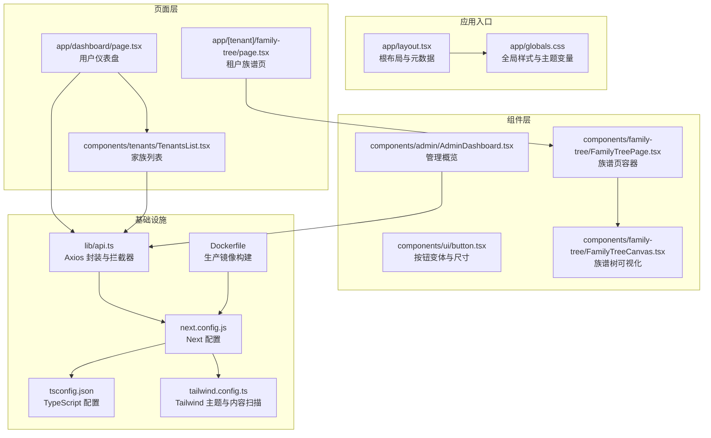
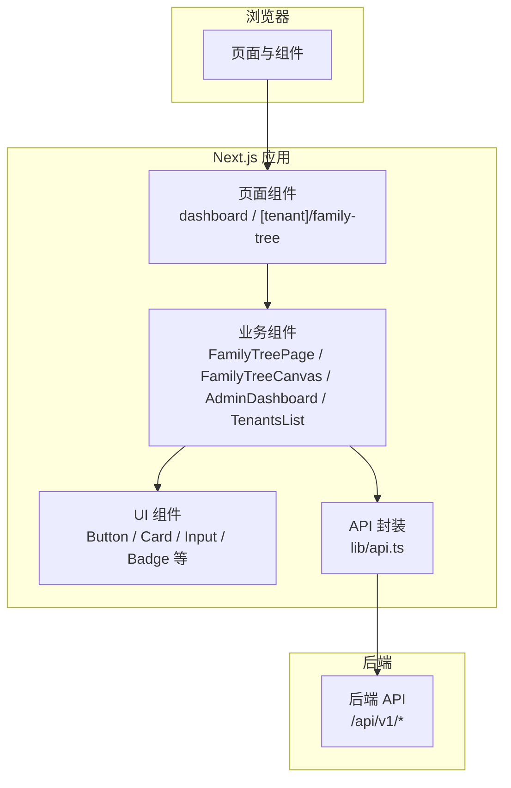
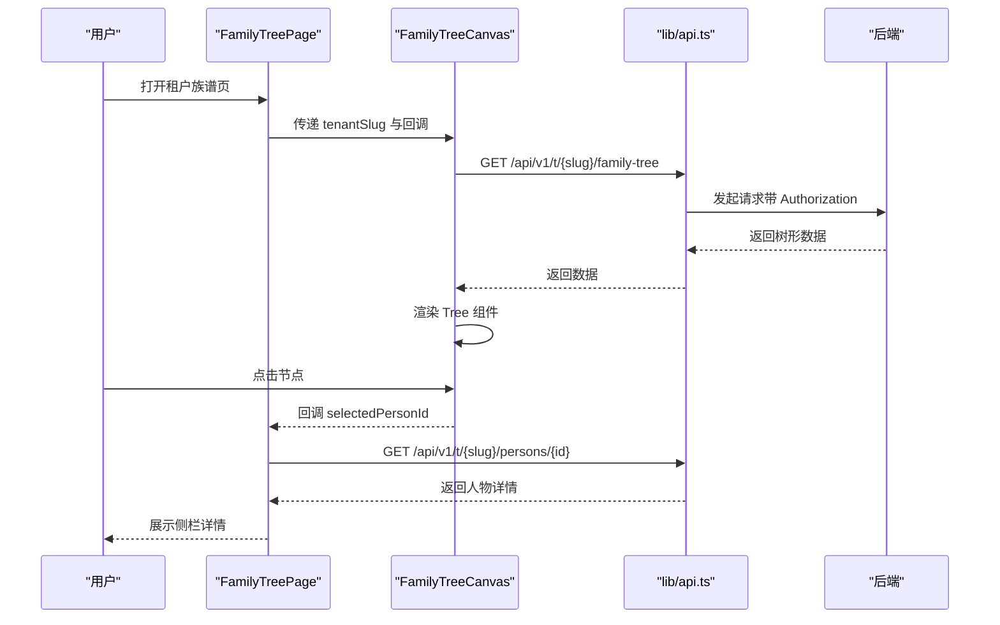
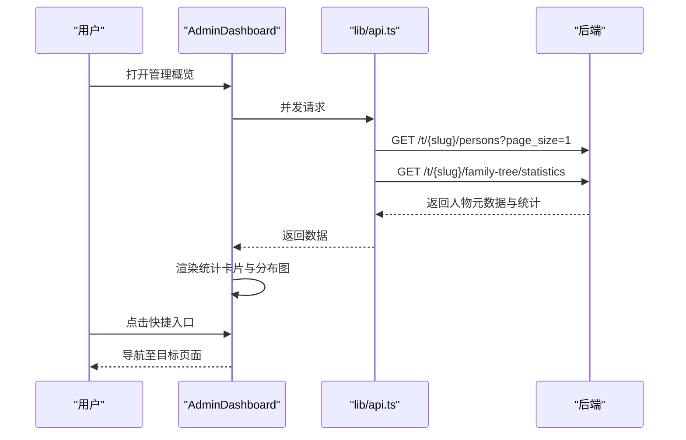
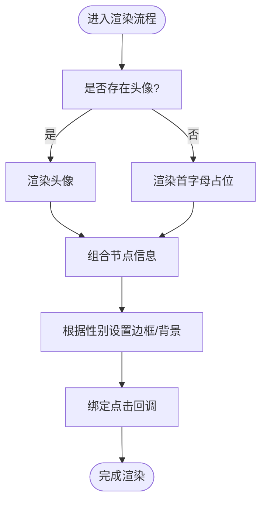
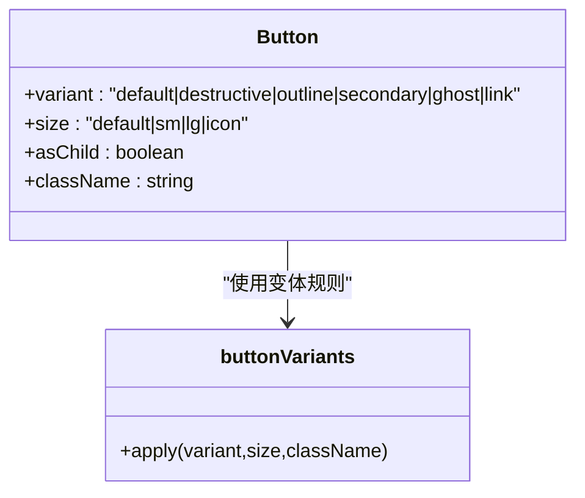
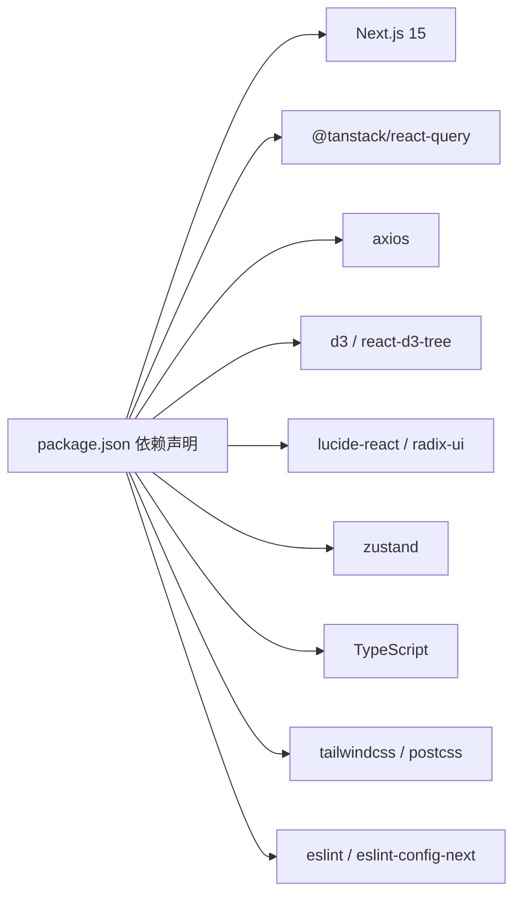

# 前端概览

<cite>
**本文引用的文件**
- [package.json](file://frontend/package.json)
- [next.config.js](file://frontend/next.config.js)
- [tsconfig.json](file://frontend/tsconfig.json)
- [tailwind.config.ts](file://frontend/tailwind.config.ts)
- [app/layout.tsx](file://frontend/app/layout.tsx)
- [app/globals.css](file://frontend/app/globals.css)
- [components/ui/button.tsx](file://frontend/components/ui/button.tsx)
- [components/family-tree/FamilyTreePage.tsx](file://frontend/components/family-tree/FamilyTreePage.tsx)
- [components/family-tree/FamilyTreeCanvas.tsx](file://frontend/components/family-tree/FamilyTreeCanvas.tsx)
- [components/admin/AdminDashboard.tsx](file://frontend/components/admin/AdminDashboard.tsx)
- [app/[tenant]/family-tree/page.tsx](file://frontend/app/[tenant]/family-tree/page.tsx)
- [app/dashboard/page.tsx](file://frontend/app/dashboard/page.tsx)
- [components/tenants/TenantsList.tsx](file://frontend/components/tenants/TenantsList.tsx)
- [lib/api.ts](file://frontend/lib/api.ts)
- [Dockerfile](file://frontend/Dockerfile)
</cite>

## 目录
1. [引言](#引言)
2. [项目结构](#项目结构)
3. [核心组件](#核心组件)
4. [架构总览](#架构总览)
5. [详细组件分析](#详细组件分析)
6. [依赖分析](#依赖分析)
7. [性能考虑](#性能考虑)
8. [故障排查指南](#故障排查指南)
9. [结论](#结论)
10. [附录](#附录)

## 引言
本文件为多租户族谱管理系统前端概览，聚焦于基于 Next.js 15 的前端技术栈与架构决策，涵盖项目结构组织、路由设计原则、页面布局系统、国际化与字体配置、全局样式管理、开发工具链与构建配置、性能优化策略、响应式与移动端适配、开发环境与调试工具，以及快速开始与常见问题解决方案。

## 项目结构
前端采用 Next.js App Router（App 目录）组织方式，按功能模块划分 app、components、lib 等目录，结合 Tailwind CSS 实现样式体系，使用 TypeScript 提升类型安全，配合 React Query 进行数据获取与缓存，Axios 封装 API 请求，Radix UI 组件与自定义 UI 组件库统一交互风格。

图表来源
- [app/layout.tsx:1-25](file://frontend/app/layout.tsx#L1-L25)
- [app/globals.css:1-67](file://frontend/app/globals.css#L1-L67)
- [app/dashboard/page.tsx:1-185](file://frontend/app/dashboard/page.tsx#L1-L185)
- [app/[tenant]/family-tree/page.tsx](file://frontend/app/[tenant]/family-tree/page.tsx#L1-L22)
- [components/tenants/TenantsList.tsx:1-118](file://frontend/components/tenants/TenantsList.tsx#L1-L118)
- [components/ui/button.tsx:1-56](file://frontend/components/ui/button.tsx#L1-L56)
- [components/family-tree/FamilyTreePage.tsx:1-226](file://frontend/components/family-tree/FamilyTreePage.tsx#L1-L226)
- [components/family-tree/FamilyTreeCanvas.tsx:1-236](file://frontend/components/family-tree/FamilyTreeCanvas.tsx#L1-L236)
- [components/admin/AdminDashboard.tsx:1-172](file://frontend/components/admin/AdminDashboard.tsx#L1-L172)
- [next.config.js:1-23](file://frontend/next.config.js#L1-L23)
- [tsconfig.json:1-28](file://frontend/tsconfig.json#L1-L28)
- [tailwind.config.ts:1-36](file://frontend/tailwind.config.ts#L1-L36)
- [lib/api.ts:1-46](file://frontend/lib/api.ts#L1-L46)
- [Dockerfile:1-51](file://frontend/Dockerfile#L1-L51)

章节来源
- [package.json:1-45](file://frontend/package.json#L1-L45)
- [next.config.js:1-23](file://frontend/next.config.js#L1-L23)
- [tsconfig.json:1-28](file://frontend/tsconfig.json#L1-L28)
- [tailwind.config.ts:1-36](file://frontend/tailwind.config.ts#L1-L36)
- [app/layout.tsx:1-25](file://frontend/app/layout.tsx#L1-L25)
- [app/globals.css:1-67](file://frontend/app/globals.css#L1-L67)

## 核心组件
- 路由与页面
  - 租户级动态路由：通过 app/[tenant]/family-tree/page.tsx 支持多租户族谱树访问，租户参数在页面中透传给 FamilyTreePage。
  - 用户仪表盘：app/dashboard/page.tsx 展示用户可访问的家族列表与快捷入口。
  - 家族列表：components/tenants/TenantsList.tsx 提供公开家族检索与展示。
- 可视化与交互
  - 族谱页容器：components/family-tree/FamilyTreePage.tsx 负责头部搜索、视图切换与侧栏详情面板。
  - 族谱树画布：components/family-tree/FamilyTreeCanvas.tsx 使用 react-d3-tree 渲染树形图，支持缩放、平移、自适应布局与节点点击回调。
- 管理与数据
  - 管理概览：components/admin/AdminDashboard.tsx 使用 React Query 并发请求统计数据，渲染卡片与生成分布图。
  - API 封装：lib/api.ts 基于 Axios 创建实例，注入请求/响应拦截器处理鉴权与 401 自动跳转。
- UI 组件
  - 按钮：components/ui/button.tsx 基于 class-variance-authority 提供多种变体与尺寸，结合 Radix Slot 支持语义化渲染。

章节来源
- [app/[tenant]/family-tree/page.tsx](file://frontend/app/[tenant]/family-tree/page.tsx#L1-L22)
- [app/dashboard/page.tsx:1-185](file://frontend/app/dashboard/page.tsx#L1-L185)
- [components/tenants/TenantsList.tsx:1-118](file://frontend/components/tenants/TenantsList.tsx#L1-L118)
- [components/family-tree/FamilyTreePage.tsx:1-226](file://frontend/components/family-tree/FamilyTreePage.tsx#L1-L226)
- [components/family-tree/FamilyTreeCanvas.tsx:1-236](file://frontend/components/family-tree/FamilyTreeCanvas.tsx#L1-L236)
- [components/admin/AdminDashboard.tsx:1-172](file://frontend/components/admin/AdminDashboard.tsx#L1-L172)
- [lib/api.ts:1-46](file://frontend/lib/api.ts#L1-L46)
- [components/ui/button.tsx:1-56](file://frontend/components/ui/button.tsx#L1-L56)

## 架构总览
前端采用“页面 + 组件 + 服务”分层：
- 页面层负责路由与数据拉取（React Query），并与组件层组合。
- 组件层包含通用 UI 组件与业务组件（如族谱树、管理面板）。
- 服务层封装 API 请求与拦截器，统一处理鉴权与错误。

图表来源
- [app/dashboard/page.tsx:1-185](file://frontend/app/dashboard/page.tsx#L1-L185)
- [app/[tenant]/family-tree/page.tsx](file://frontend/app/[tenant]/family-tree/page.tsx#L1-L22)
- [components/family-tree/FamilyTreePage.tsx:1-226](file://frontend/components/family-tree/FamilyTreePage.tsx#L1-L226)
- [components/family-tree/FamilyTreeCanvas.tsx:1-236](file://frontend/components/family-tree/FamilyTreeCanvas.tsx#L1-L236)
- [components/admin/AdminDashboard.tsx:1-172](file://frontend/components/admin/AdminDashboard.tsx#L1-L172)
- [components/tenants/TenantsList.tsx:1-118](file://frontend/components/tenants/TenantsList.tsx#L1-L118)
- [lib/api.ts:1-46](file://frontend/lib/api.ts#L1-L46)

## 详细组件分析

### 族谱树可视化流程
族谱树从页面容器进入画布组件，通过 API 获取树形数据，使用 d3 与 react-d3-tree 渲染，支持缩放、平移、自适应布局与节点点击回调。

图表来源
- [components/family-tree/FamilyTreePage.tsx:41-129](file://frontend/components/family-tree/FamilyTreePage.tsx#L41-L129)
- [components/family-tree/FamilyTreeCanvas.tsx:27-169](file://frontend/components/family-tree/FamilyTreeCanvas.tsx#L27-L169)
- [lib/api.ts:1-46](file://frontend/lib/api.ts#L1-L46)

章节来源
- [components/family-tree/FamilyTreePage.tsx:1-226](file://frontend/components/family-tree/FamilyTreePage.tsx#L1-L226)
- [components/family-tree/FamilyTreeCanvas.tsx:1-236](file://frontend/components/family-tree/FamilyTreeCanvas.tsx#L1-L236)
- [lib/api.ts:1-46](file://frontend/lib/api.ts#L1-L46)

### 管理概览数据流
管理概览通过并发请求获取人物总数与族谱统计，渲染卡片与生成分布图，并提供快捷入口跳转到族谱树与人物管理。

图表来源
- [components/admin/AdminDashboard.tsx:12-26](file://frontend/components/admin/AdminDashboard.tsx#L12-L26)
- [lib/api.ts:1-46](file://frontend/lib/api.ts#L1-L46)

章节来源
- [components/admin/AdminDashboard.tsx:1-172](file://frontend/components/admin/AdminDashboard.tsx#L1-L172)
- [lib/api.ts:1-46](file://frontend/lib/api.ts#L1-L46)

### 族谱节点渲染算法
族谱节点采用自定义渲染元素，根据性别设置边框与背景色，支持头像或首字母占位，点击触发回调。

图表来源
- [components/family-tree/FamilyTreeCanvas.tsx:177-227](file://frontend/components/family-tree/FamilyTreeCanvas.tsx#L177-L227)

章节来源
- [components/family-tree/FamilyTreeCanvas.tsx:1-236](file://frontend/components/family-tree/FamilyTreeCanvas.tsx#L1-L236)

### 按钮组件设计模式
按钮组件通过 class-variance-authority 定义变体与尺寸，结合 Radix Slot 支持语义化渲染，统一风格与可访问性。

图表来源
- [components/ui/button.tsx:6-33](file://frontend/components/ui/button.tsx#L6-L33)

章节来源
- [components/ui/button.tsx:1-56](file://frontend/components/ui/button.tsx#L1-L56)

## 依赖分析
- 运行时依赖
  - Next.js 15、React 19、TypeScript：提供现代框架能力与类型安全。
  - @tanstack/react-query：声明式数据获取与缓存。
  - axios：HTTP 客户端，配合拦截器处理鉴权与错误。
  - d3 与 react-d3-tree：树形图可视化。
  - lucide-react：图标库。
  - radix-ui 组件：对话框、下拉菜单、选择器、标签等。
  - zustand：轻量状态管理（用于演示）。
- 开发依赖
  - tailwindcss、postcss、autoprefixer：原子化样式与自动前缀。
  - eslint 与 eslint-config-next：代码规范与静态检查。
  - @types/*：类型定义。

图表来源
- [package.json:12-43](file://frontend/package.json#L12-L43)

章节来源
- [package.json:1-45](file://frontend/package.json#L1-L45)

## 性能考虑
- 代码分割与懒加载
  - 族谱树画布通过 Next.js 动态导入避免 SSR 中 d3 依赖导致的渲染问题，并提供骨架屏提示。
- 图像优化
  - Next.config.js 启用 images.remotePatterns，允许远程图像优化。
- 构建与运行
  - Dockerfile 使用多阶段构建，仅复制必要产物，减少镜像体积；生产环境暴露健康检查与非 root 用户运行。
- 缓存与并发
  - React Query 缓存策略与并发请求提升数据获取效率。
- 样式与主题
  - Tailwind CSS 内容扫描仅针对 app、components、pages，减少无关文件扫描成本。

章节来源
- [components/family-tree/FamilyTreeCanvas.tsx:11-22](file://frontend/components/family-tree/FamilyTreeCanvas.tsx#L11-L22)
- [next.config.js:6-14](file://frontend/next.config.js#L6-L14)
- [Dockerfile:1-51](file://frontend/Dockerfile#L1-L51)
- [tailwind.config.ts:5-9](file://frontend/tailwind.config.ts#L5-L9)

## 故障排查指南
- 401 未授权自动跳转
  - lib/api.ts 在响应拦截器中检测 401，清理本地令牌并跳转登录页。
- 网络错误与加载状态
  - FamilyTreeCanvas 在加载失败时显示错误卡片并提供重试按钮；空数据时显示提示。
- 本地开发环境
  - package.json 提供 dev/build/start/lint/type-check 脚本；tsconfig.json 启用严格模式与 bundler 解析；next.config.js 设置环境变量 NEXT_PUBLIC_API_URL。
- Docker 运行
  - Dockerfile 暴露 3010 端口，设置健康检查，使用非 root 用户运行。

章节来源
- [lib/api.ts:29-43](file://frontend/lib/api.ts#L29-L43)
- [components/family-tree/FamilyTreeCanvas.tsx:75-102](file://frontend/components/family-tree/FamilyTreeCanvas.tsx#L75-L102)
- [package.json:5-11](file://frontend/package.json#L5-L11)
- [tsconfig.json:7-14](file://frontend/tsconfig.json#L7-L14)
- [next.config.js:16-19](file://frontend/next.config.js#L16-L19)
- [Dockerfile:37-47](file://frontend/Dockerfile#L37-L47)

## 结论
该前端以 Next.js 15 为核心，结合 React Query、Axios、Tailwind CSS、Radix UI 与 d3 可视化，形成清晰的页面-组件-服务分层架构。通过动态导入、远程图像优化、多阶段 Docker 构建与严格的 TypeScript 配置，兼顾了开发体验与运行性能。路由采用 App Router 动态参数实现多租户隔离，页面布局简洁、交互一致，适合扩展为完整的多租户族谱管理平台。

## 附录

### 快速开始
- 安装依赖
  - 使用包管理器安装依赖。
- 启动开发服务器
  - 运行开发脚本启动本地服务。
- 访问页面
  - 仪表盘：/dashboard
  - 租户族谱：/t/:tenant/family-tree
  - 家族列表：/tenants
- 构建与运行
  - 执行构建脚本生成生产包；使用 Dockerfile 构建镜像并在容器中运行。

章节来源
- [package.json:5-11](file://frontend/package.json#L5-L11)
- [app/dashboard/page.tsx:77-184](file://frontend/app/dashboard/page.tsx#L77-L184)
- [app/[tenant]/family-tree/page.tsx](file://frontend/app/[tenant]/family-tree/page.tsx#L9-L21)
- [components/tenants/TenantsList.tsx:43-117](file://frontend/components/tenants/TenantsList.tsx#L43-L117)
- [Dockerfile:15-16](file://frontend/Dockerfile#L15-L16)

### 国际化与字体配置
- 字体与语言
  - 根布局使用 Inter 字体并通过变量注入到 CSS 变量，页面 lang 设为 zh-CN。
- 元数据
  - 根布局提供标题与描述，便于 SEO 与分享预览。

章节来源
- [app/layout.tsx:2-10](file://frontend/app/layout.tsx#L2-L10)
- [app/layout.tsx:18-24](file://frontend/app/layout.tsx#L18-L24)

### 全局样式与主题
- Tailwind 配置
  - 启用类名驱动深色模式，主题扩展主色与无衬线字体。
- 全局 CSS
  - 定义 CSS 变量与明暗主题映射，提供渐变文本工具类。

章节来源
- [tailwind.config.ts:3-33](file://frontend/tailwind.config.ts#L3-L33)
- [app/globals.css:5-67](file://frontend/app/globals.css#L5-L67)

### 响应式与移动端适配
- 布局网格
  - 使用 Tailwind 的响应式断点（md/lg）控制卡片网格列数。
- 交互控件
  - 族谱树画布提供缩放、自适应屏幕与重置控件，适配不同设备。
- 输入与按钮
  - UI 组件提供多种尺寸与语义化渲染，保证移动端可触达性。

章节来源
- [app/dashboard/page.tsx:121-173](file://frontend/app/dashboard/page.tsx#L121-L173)
- [components/family-tree/FamilyTreeCanvas.tsx:104-169](file://frontend/components/family-tree/FamilyTreeCanvas.tsx#L104-L169)
- [components/ui/button.tsx:21-32](file://frontend/components/ui/button.tsx#L21-L32)

### 开发工具链与调试
- 类型检查
  - tsconfig.json 启用严格模式与 bundler 解析，确保类型安全。
- 代码规范
  - eslint 与 eslint-config-next 规范代码风格。
- 调试建议
  - 使用 React DevTools 检查组件层级与 props；利用 React Query Devtools 监控缓存与请求；在浏览器 Network 面板观察 API 请求与响应。

章节来源
- [tsconfig.json:7-23](file://frontend/tsconfig.json#L7-L23)
- [package.json:32-42](file://frontend/package.json#L32-L42)