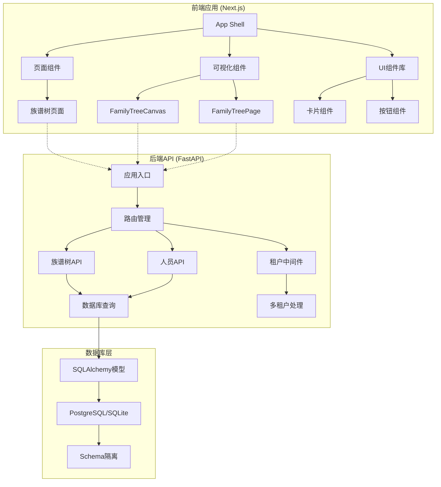
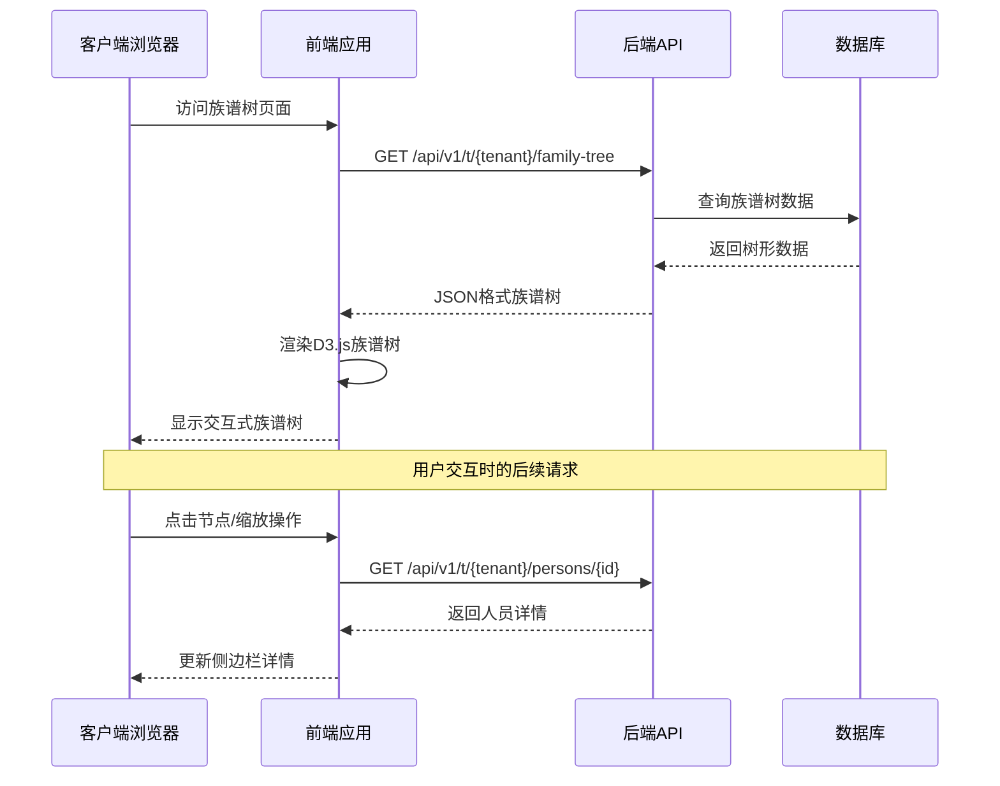
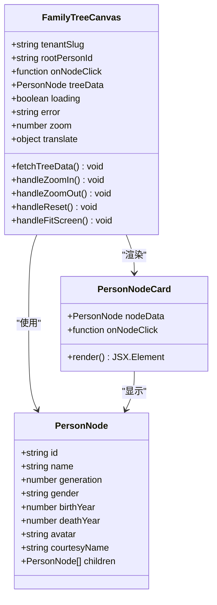
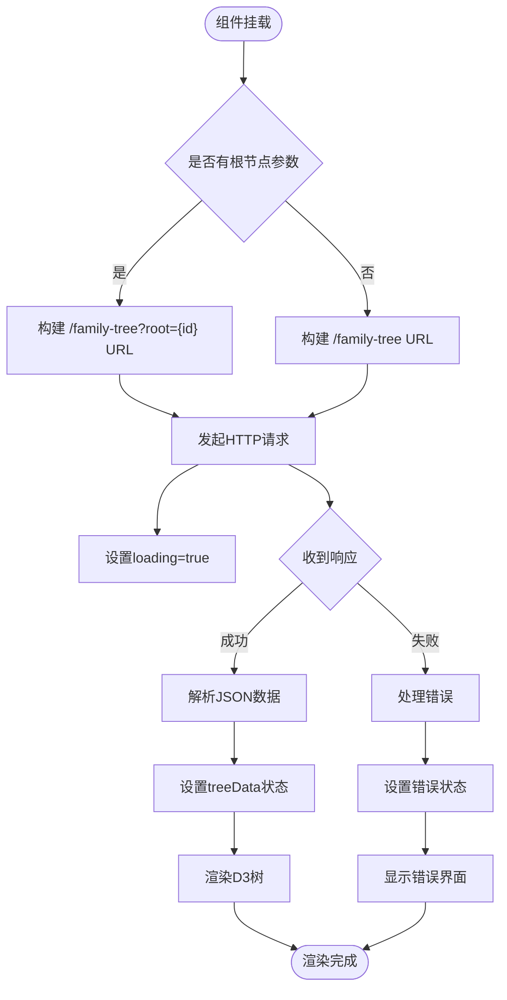
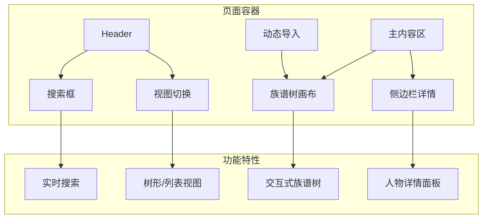
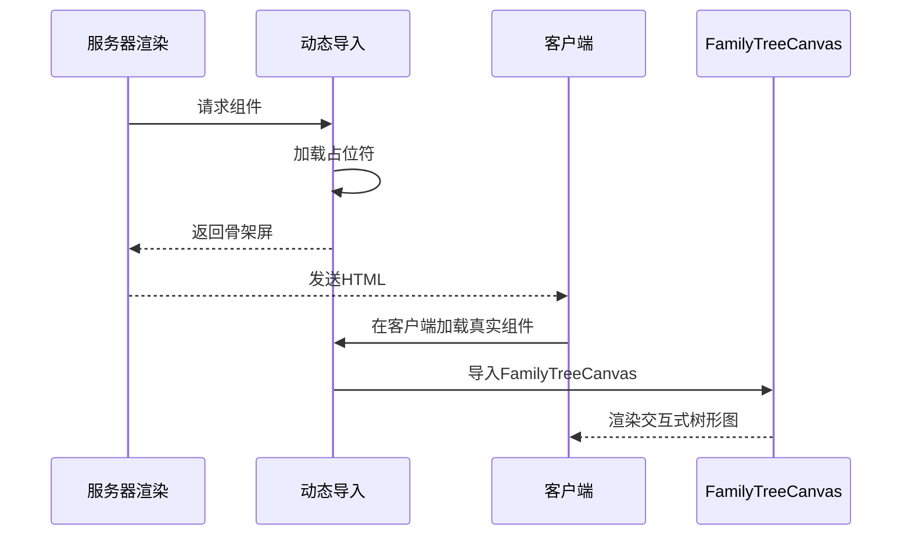
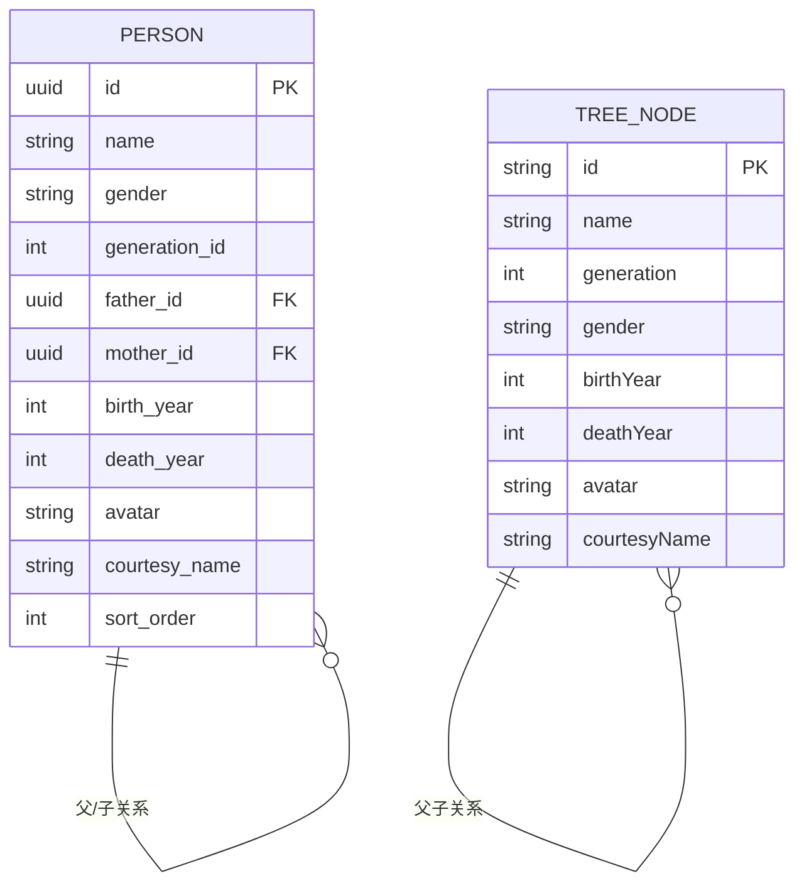
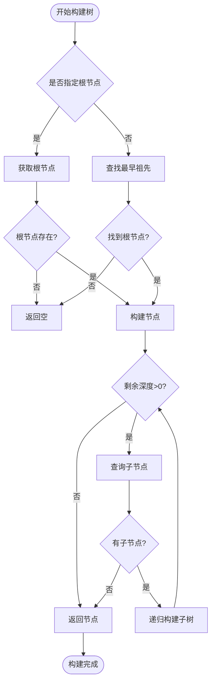
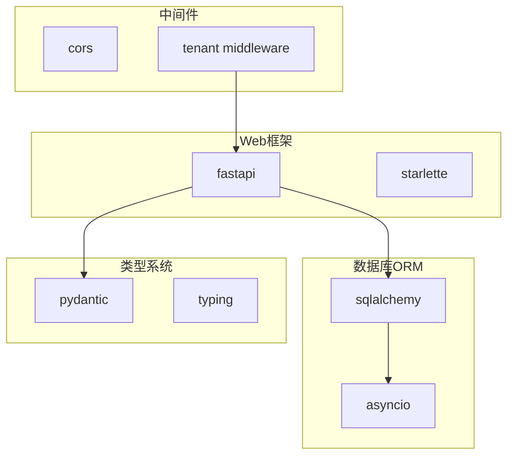

# 族谱树可视化

<cite>
**本文档引用的文件**
- [FamilyTreeCanvas.tsx](file://frontend/components/family-tree/FamilyTreeCanvas.tsx)
- [FamilyTreePage.tsx](file://frontend/components/family-tree/FamilyTreePage.tsx)
- [page.tsx](file://frontend/app/[tenant]/family-tree/page.tsx)
- [family_tree.py](file://backend/app/api/v1/endpoints/family_tree.py)
- [tenant.py](file://backend/app/middleware/tenant.py)
- [database.py](file://backend/app/core/database.py)
- [main.py](file://backend/app/main.py)
- [package.json](file://frontend/package.json)
- [layout.tsx](file://frontend/app/layout.tsx)
- [card.tsx](file://frontend/components/ui/card.tsx)
- [button.tsx](file://frontend/components/ui/button.tsx)
</cite>

## 目录
1. [引言](#引言)
2. [项目结构](#项目结构)
3. [核心组件](#核心组件)
4. [架构概览](#架构概览)
5. [详细组件分析](#详细组件分析)
6. [依赖关系分析](#依赖关系分析)
7. [性能考虑](#性能考虑)
8. [故障排除指南](#故障排除指南)
9. [结论](#结论)
10. [附录](#附录)

## 引言

本项目是一个基于React和D3.js的多租户族谱树可视化管理系统。该系统实现了交互式的族谱树展示功能，支持缩放、平移、点击展开等用户交互操作，能够处理大规模族谱数据的渲染和展示。

系统采用前后端分离架构，前端使用Next.js框架和React技术栈，后端基于FastAPI构建RESTful API服务。通过多租户架构支持多个家族独立管理各自的族谱数据，每个租户拥有独立的数据隔离和配置。

## 项目结构

项目采用模块化组织方式，主要分为前端应用和后端API两个部分：



**图表来源**
- [layout.tsx:12-24](file://frontend/app/layout.tsx#L12-L24)
- [main.py:45-88](file://backend/app/main.py#L45-L88)

**章节来源**
- [layout.tsx:1-25](file://frontend/app/layout.tsx#L1-L25)
- [main.py:1-103](file://backend/app/main.py#L1-L103)

## 核心组件

### 前端可视化组件

系统的核心可视化组件是基于react-d3-tree库构建的交互式族谱树，提供了完整的族谱数据展示和交互功能。

### 后端数据服务

后端API提供了族谱树数据的查询和管理功能，支持从指定根节点开始构建族谱树，以及统计信息查询。

**章节来源**
- [FamilyTreeCanvas.tsx:27-170](file://frontend/components/family-tree/FamilyTreeCanvas.tsx#L27-L170)
- [family_tree.py:43-68](file://backend/app/api/v1/endpoints/family_tree.py#L43-L68)

## 架构概览

系统采用分层架构设计，确保了良好的可维护性和扩展性：



**图表来源**
- [FamilyTreePage.tsx:41-129](file://frontend/components/family-tree/FamilyTreePage.tsx#L41-L129)
- [family_tree.py:43-68](file://backend/app/api/v1/endpoints/family_tree.py#L43-L68)

系统架构的关键特点：

1. **多租户隔离**: 每个租户拥有独立的数据空间和访问控制
2. **前后端分离**: 前端负责数据展示和用户交互，后端专注数据处理
3. **异步数据流**: 使用Promise和async/await处理异步操作
4. **响应式设计**: 支持不同屏幕尺寸的设备访问

**章节来源**
- [tenant.py:15-84](file://backend/app/middleware/tenant.py#L15-L84)
- [database.py:24-106](file://backend/app/core/database.py#L24-L106)

## 详细组件分析

### FamilyTreeCanvas 组件

FamilyTreeCanvas是族谱树可视化的核心组件，基于react-d3-tree库实现：

#### 组件架构



**图表来源**
- [FamilyTreeCanvas.tsx:9-25](file://frontend/components/family-tree/FamilyTreeCanvas.tsx#L9-L25)
- [FamilyTreeCanvas.tsx:172-175](file://frontend/components/family-tree/FamilyTreeCanvas.tsx#L172-L175)

#### 数据绑定机制

组件使用React的状态管理来处理数据绑定：

1. **树形数据状态**: `useState<PersonNode | null>(null)`
2. **加载状态**: `useState(true)` 控制骨架屏显示
3. **错误状态**: `useState<string | null>(null)` 处理异常情况
4. **视口状态**: `useState({ x: 400, y: 50 })` 和 `useState(1)` 管理缩放和平移

#### 渲染流程



**图表来源**
- [FamilyTreeCanvas.tsx:35-59](file://frontend/components/family-tree/FamilyTreeCanvas.tsx#L35-L59)

#### 交互功能实现

组件实现了完整的用户交互功能：

1. **缩放控制**: `handleZoomIn()` 和 `handleZoomOut()` 方法
2. **视口重置**: `handleReset()` 恢复默认视图
3. **适应屏幕**: `handleFitScreen()` 自动调整到最佳显示比例
4. **节点点击**: 通过onNodeClick回调处理节点选择

**章节来源**
- [FamilyTreeCanvas.tsx:61-73](file://frontend/components/family-tree/FamilyTreeCanvas.tsx#L61-L73)
- [FamilyTreeCanvas.tsx:146-167](file://frontend/components/family-tree/FamilyTreeCanvas.tsx#L146-L167)

### FamilyTreePage 组件

FamilyTreePage作为页面容器，整合了可视化组件和用户界面：

#### 页面布局



**图表来源**
- [FamilyTreePage.tsx:63-129](file://frontend/components/family-tree/FamilyTreePage.tsx#L63-L129)

#### 动态导入优化

组件使用Next.js的动态导入功能避免SSR问题：



**图表来源**
- [FamilyTreePage.tsx:11-22](file://frontend/components/family-tree/FamilyTreePage.tsx#L11-L22)

**章节来源**
- [FamilyTreePage.tsx:41-129](file://frontend/components/family-tree/FamilyTreePage.tsx#L41-L129)

### 后端API服务

后端API提供了完整的族谱树数据管理功能：

#### 数据模型设计



**图表来源**
- [tenant.py:61-132](file://backend/app/models/tenant.py#L61-L132)
- [family_tree.py:21-34](file://backend/app/api/v1/endpoints/family_tree.py#L21-L34)

#### 树形数据构建算法

后端实现了递归的树形数据构建算法：



**图表来源**
- [family_tree.py:71-149](file://backend/app/api/v1/endpoints/family_tree.py#L71-L149)

**章节来源**
- [family_tree.py:43-149](file://backend/app/api/v1/endpoints/family_tree.py#L43-L149)

## 依赖关系分析

### 前端依赖关系

系统前端依赖关系清晰，主要依赖于React生态系统：

```mermaid
graph TB
subgraph "核心依赖"
A[react@19.0.0]
B[react-dom@19.0.0]
C[next@15.0.0]
end
subgraph "可视化依赖"
D[react-d3-tree@3.6.0]
E[d3@7.8.0]
end
subgraph "UI组件库"
F[lucide-react@0.300.0]
G[@radix-ui/react-*]
end
subgraph "工具库"
H[@tanstack/react-query@5.0.0]
I[zustand@4.5.0]
J[date-fns@3.0.0]
end
A --> D
C --> A
D --> E
F --> A
G --> A
H --> A
I --> A
```

**图表来源**
- [package.json:12-31](file://frontend/package.json#L12-L31)

### 后端依赖关系

后端API服务依赖关系简洁明确：



**图表来源**
- [main.py:7-14](file://backend/app/main.py#L7-L14)

**章节来源**
- [package.json:1-45](file://frontend/package.json#L1-L45)
- [main.py:1-103](file://backend/app/main.py#L1-L103)

## 性能考虑

### 前端性能优化

1. **懒加载策略**: 使用Next.js的动态导入避免SSR问题
2. **状态管理**: 合理的状态分割减少不必要的重新渲染
3. **虚拟滚动**: 对于大量数据的场景可以考虑实现虚拟滚动
4. **缓存机制**: 可以添加数据缓存避免重复请求

### 后端性能优化

1. **数据库索引**: 为常用查询字段建立适当的索引
2. **查询优化**: 使用批量查询减少数据库往返次数
3. **连接池管理**: 合理配置数据库连接池参数
4. **异步处理**: 充分利用async/await提升并发性能

### 大数据量处理

对于大规模族谱数据，建议：

1. **分页加载**: 实现按代际或按区域的分页加载
2. **增量更新**: 只更新发生变化的部分DOM
3. **内存管理**: 及时清理不再使用的节点引用
4. **预计算**: 在后端预计算常用的统计数据

## 故障排除指南

### 常见问题及解决方案

#### 数据加载失败

**症状**: 页面显示"加载失败"错误信息

**可能原因**:
1. 网络连接问题
2. 租户标识无效
3. 数据库连接异常

**解决方法**:
1. 检查网络连接状态
2. 验证租户slug格式
3. 查看后端日志获取详细错误信息

#### 族谱树渲染异常

**症状**: 族谱树无法正常显示或显示不完整

**可能原因**:
1. D3.js版本兼容性问题
2. DOM元素未正确挂载
3. 数据格式不符合预期

**解决方法**:
1. 确认D3.js和react-d3-tree版本兼容
2. 检查容器元素的CSS样式
3. 验证后端返回的数据结构

#### 性能问题

**症状**: 页面响应缓慢或卡顿

**可能原因**:
1. 数据量过大导致渲染时间过长
2. 重复的DOM操作
3. 缺乏必要的性能优化

**解决方法**:
1. 实现数据分页或延迟加载
2. 优化CSS动画和过渡效果
3. 添加防抖和节流机制

**章节来源**
- [FamilyTreeCanvas.tsx:75-102](file://frontend/components/family-tree/FamilyTreeCanvas.tsx#L75-L102)
- [family_tree.py:53-58](file://backend/app/api/v1/endpoints/family_tree.py#L53-L58)

## 结论

本族谱树可视化系统成功实现了基于D3.js的交互式族谱展示功能。系统具有以下优势：

1. **架构清晰**: 前后端分离，职责明确
2. **功能完整**: 支持基本的族谱树展示和交互操作
3. **扩展性强**: 多租户架构便于功能扩展
4. **用户体验好**: 响应式设计支持多设备访问

未来可以考虑的功能增强：
- 添加搜索和过滤功能
- 实现导出PDF/图片功能
- 增加编辑和管理功能
- 优化大数据量处理性能

## 附录

### API接口规范

系统提供的主要API接口包括：

1. **族谱树查询**: `GET /api/v1/t/{tenant}/family-tree`
2. **人员详情查询**: `GET /api/v1/t/{tenant}/persons/{id}`
3. **祖先链查询**: `GET /api/v1/t/{tenant}/family-tree/ancestors/{person_id}`
4. **后代树查询**: `GET /api/v1/t/{tenant}/family-tree/descendants/{person_id}`

### 配置选项

系统支持的主要配置包括：
- 数据库连接配置
- 多租户标识规则
- API版本控制
- CORS跨域设置