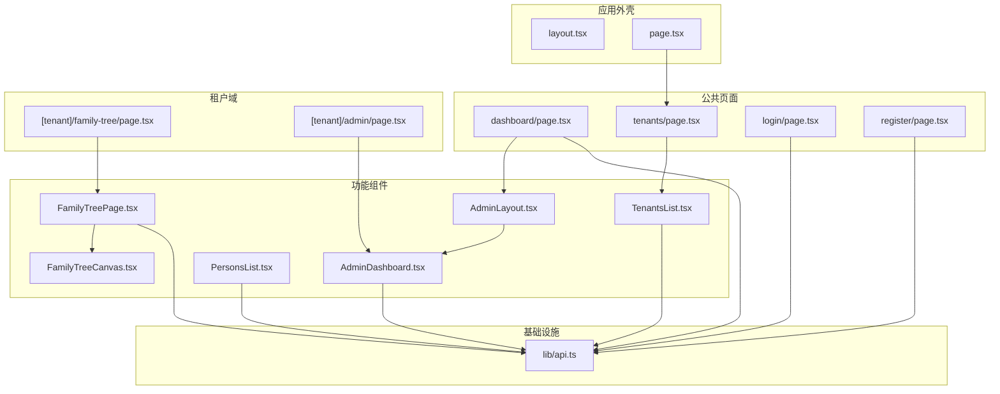
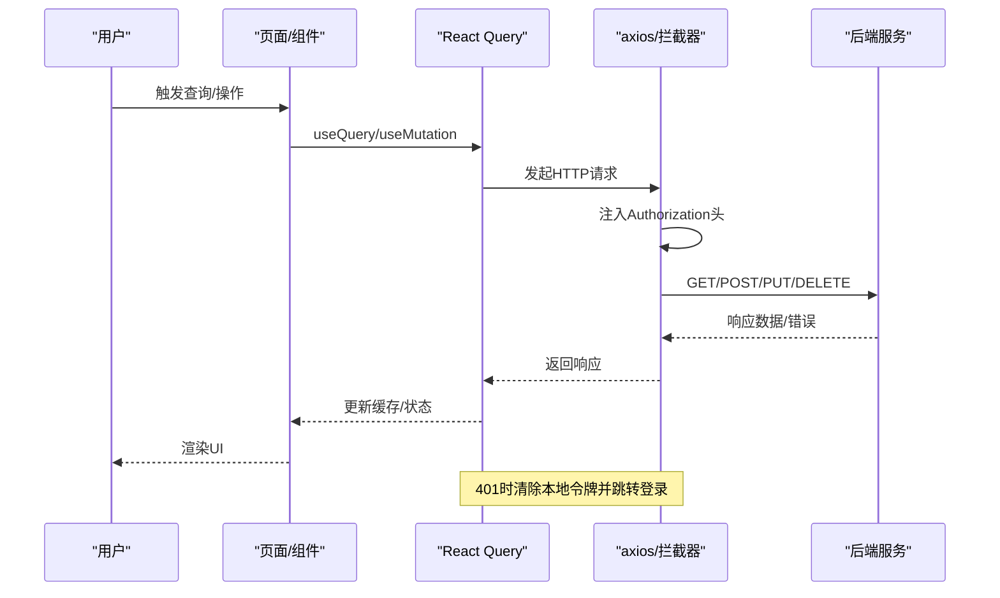
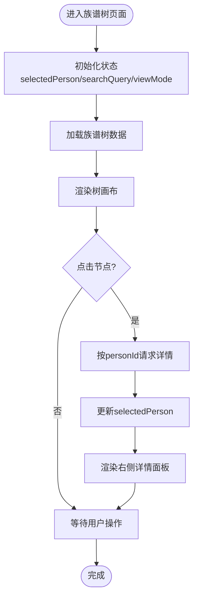
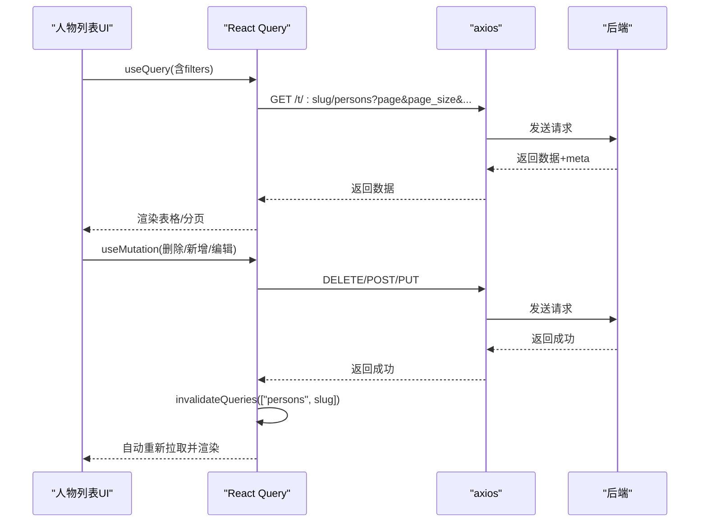
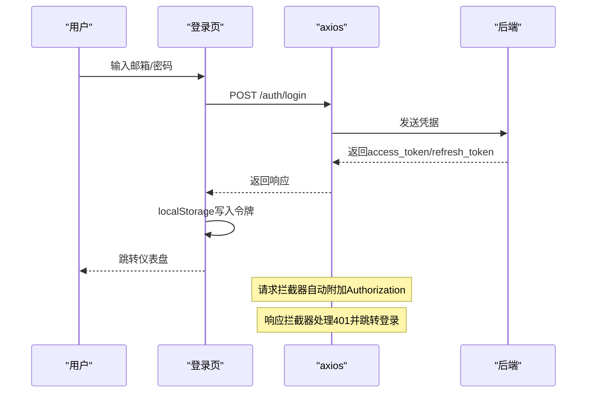
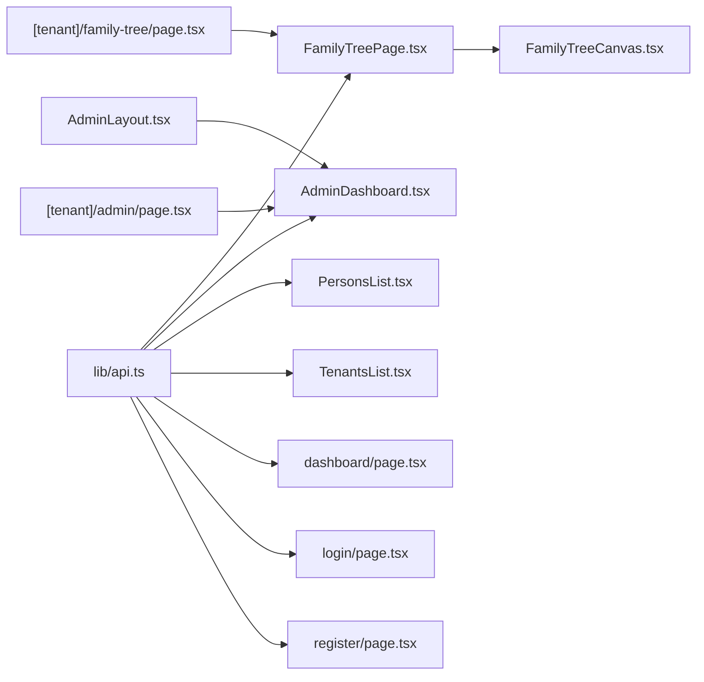

# 状态管理

<cite>
**本文引用的文件**
- [frontend/app/layout.tsx](file://frontend/app/layout.tsx)
- [frontend/app/page.tsx](file://frontend/app/page.tsx)
- [frontend/lib/api.ts](file://frontend/lib/api.ts)
- [frontend/components/family-tree/FamilyTreePage.tsx](file://frontend/components/family-tree/FamilyTreePage.tsx)
- [frontend/components/family-tree/FamilyTreeCanvas.tsx](file://frontend/components/family-tree/FamilyTreeCanvas.tsx)
- [frontend/components/admin/AdminDashboard.tsx](file://frontend/components/admin/AdminDashboard.tsx)
- [frontend/components/admin/AdminLayout.tsx](file://frontend/components/admin/AdminLayout.tsx)
- [frontend/components/admin/PersonsList.tsx](file://frontend/components/admin/PersonsList.tsx)
- [frontend/components/tenants/TenantsList.tsx](file://frontend/components/tenants/TenantsList.tsx)
- [frontend/app/dashboard/page.tsx](file://frontend/app/dashboard/page.tsx)
- [frontend/app/tenants/page.tsx](file://frontend/app/tenants/page.tsx)
- [frontend/app/[tenant]/family-tree/page.tsx](file://frontend/app/[tenant]/family-tree/page.tsx)
- [frontend/app/[tenant]/admin/page.tsx](file://frontend/app/[tenant]/admin/page.tsx)
- [frontend/app/login/page.tsx](file://frontend/app/login/page.tsx)
- [frontend/app/register/page.tsx](file://frontend/app/register/page.tsx)
</cite>

## 目录
1. [引言](#引言)
2. [项目结构](#项目结构)
3. [核心组件](#核心组件)
4. [架构总览](#架构总览)
5. [详细组件分析](#详细组件分析)
6. [依赖分析](#依赖分析)
7. [性能考虑](#性能考虑)
8. [故障排查指南](#故障排查指南)
9. [结论](#结论)
10. [附录](#附录)

## 引言
本文件面向“多租户族谱管理系统”的前端状态管理，聚焦于以下目标：
- 明确全局状态与局部状态的划分原则、状态提升与组件通信模式
- 记录租户上下文的状态管理、用户认证状态与权限控制
- 描述API数据缓存策略、状态同步与错误恢复机制
- 提供本地存储、会话管理与持久化方案
- 给出状态调试工具、性能监控与内存泄漏防护建议
- 解决并发状态更新、数据一致性与用户体验优化问题

## 项目结构
前端采用 Next.js App Router，页面级路由与客户端组件并用，配合 TanStack React Query 实现数据请求与缓存，使用 axios 封装 API 请求拦截器与统一错误处理。

图表来源
- [frontend/app/layout.tsx:1-25](file://frontend/app/layout.tsx#L1-L25)
- [frontend/app/page.tsx:1-122](file://frontend/app/page.tsx#L1-L122)
- [frontend/app/tenants/page.tsx:1-39](file://frontend/app/tenants/page.tsx#L1-L39)
- [frontend/app/dashboard/page.tsx:1-185](file://frontend/app/dashboard/page.tsx#L1-L185)
- [frontend/app/[tenant]/family-tree/page.tsx:1-22](file://frontend/app/[tenant]/family-tree/page.tsx#L1-L22)
- [frontend/app/[tenant]/admin/page.tsx:1-20](file://frontend/app/[tenant]/admin/page.tsx#L1-L20)
- [frontend/components/family-tree/FamilyTreePage.tsx:1-226](file://frontend/components/family-tree/FamilyTreePage.tsx#L1-L226)
- [frontend/components/family-tree/FamilyTreeCanvas.tsx:1-236](file://frontend/components/family-tree/FamilyTreeCanvas.tsx#L1-L236)
- [frontend/components/admin/AdminDashboard.tsx:1-172](file://frontend/components/admin/AdminDashboard.tsx#L1-L172)
- [frontend/components/admin/AdminLayout.tsx:1-116](file://frontend/components/admin/AdminLayout.tsx#L1-L116)
- [frontend/components/admin/PersonsList.tsx:1-481](file://frontend/components/admin/PersonsList.tsx#L1-L481)
- [frontend/components/tenants/TenantsList.tsx:1-118](file://frontend/components/tenants/TenantsList.tsx#L1-L118)
- [frontend/lib/api.ts:1-46](file://frontend/lib/api.ts#L1-L46)

章节来源
- [frontend/app/layout.tsx:1-25](file://frontend/app/layout.tsx#L1-L25)
- [frontend/app/page.tsx:1-122](file://frontend/app/page.tsx#L1-L122)
- [frontend/lib/api.ts:1-46](file://frontend/lib/api.ts#L1-L46)

## 核心组件
- 租户上下文：通过动态路由参数 tenant 传递租户标识，贯穿页面与组件，用于拼接 API 路径与渲染租户名称。
- 客户端状态：以 React Hooks（useState/useEffect）管理局部 UI 状态；以 TanStack React Query 管理远端数据缓存与同步。
- 认证与会话：基于 localStorage 存储访问令牌与刷新令牌，axios 请求拦截器自动附加 Authorization，响应拦截器处理 401 并跳转登录。
- 数据流：组件通过 api 封装发起请求，React Query 缓存结果；Mutation 成功后通过 queryClient.invalidateQueries 触发缓存失效与重新拉取。

章节来源
- [frontend/app/[tenant]/family-tree/page.tsx:1-22](file://frontend/app/[tenant]/family-tree/page.tsx#L1-L22)
- [frontend/app/[tenant]/admin/page.tsx:1-20](file://frontend/app/[tenant]/admin/page.tsx#L1-L20)
- [frontend/lib/api.ts:1-46](file://frontend/lib/api.ts#L1-L46)
- [frontend/components/admin/PersonsList.tsx:1-481](file://frontend/components/admin/PersonsList.tsx#L1-L481)

## 架构总览
下图展示从页面到组件、再到 API 的状态流转与缓存策略：

图表来源
- [frontend/lib/api.ts:12-43](file://frontend/lib/api.ts#L12-L43)
- [frontend/components/admin/PersonsList.tsx:63-96](file://frontend/components/admin/PersonsList.tsx#L63-L96)
- [frontend/app/dashboard/page.tsx:24-48](file://frontend/app/dashboard/page.tsx#L24-L48)

## 详细组件分析

### 租户上下文与导航
- 页面通过动态路由参数 tenant 获取租户标识，并在 AdminLayout 中作为面包屑与侧边栏链接的基础。
- AdminLayout 使用 usePathname 控制导航高亮与移动端抽屉开关。
- AdminDashboard 通过 api 查询统计数据并聚合展示。

章节来源
- [frontend/app/[tenant]/admin/page.tsx:1-20](file://frontend/app/[tenant]/admin/page.tsx#L1-L20)
- [frontend/components/admin/AdminLayout.tsx:1-116](file://frontend/components/admin/AdminLayout.tsx#L1-L116)
- [frontend/components/admin/AdminDashboard.tsx:1-172](file://frontend/components/admin/AdminDashboard.tsx#L1-L172)

### 族谱树页面与画布
- FamilyTreePage 负责：
  - 局部状态：选中人物、搜索关键词、视图模式（树形/列表）
  - 事件：节点点击回调，触发按 personId 拉取详情
- FamilyTreeCanvas 负责：
  - 局部状态：树数据、加载/错误、缩放与平移
  - 生命周期：首次挂载与租户/根节点变化时拉取树数据
  - 用户交互：缩放、自适应屏幕、重置视图

图表来源
- [frontend/components/family-tree/FamilyTreePage.tsx:41-61](file://frontend/components/family-tree/FamilyTreePage.tsx#L41-L61)
- [frontend/components/family-tree/FamilyTreeCanvas.tsx:27-59](file://frontend/components/family-tree/FamilyTreeCanvas.tsx#L27-L59)

章节来源
- [frontend/components/family-tree/FamilyTreePage.tsx:1-226](file://frontend/components/family-tree/FamilyTreePage.tsx#L1-L226)
- [frontend/components/family-tree/FamilyTreeCanvas.tsx:1-236](file://frontend/components/family-tree/FamilyTreeCanvas.tsx#L1-L236)

### 人物管理与分页过滤
- PersonsList 使用 React Query 管理人物列表、分页与过滤条件（页码、搜索、世代、性别），Mutation 成功后通过 queryClient.invalidateQueries 使缓存失效并重新拉取。
- 表单对话框 PersonFormDialog 支持新增与编辑，提交时根据是否带 id 决定 PUT 或 POST。

图表来源
- [frontend/components/admin/PersonsList.tsx:63-96](file://frontend/components/admin/PersonsList.tsx#L63-L96)
- [frontend/components/admin/PersonsList.tsx:332-345](file://frontend/components/admin/PersonsList.tsx#L332-L345)

章节来源
- [frontend/components/admin/PersonsList.tsx:1-481](file://frontend/components/admin/PersonsList.tsx#L1-L481)

### 租户列表与搜索
- TenantsList 使用 React Query 拉取公开/私有租户列表，支持按姓氏搜索，本地过滤展示。
- 该组件仅维护本地搜索词状态，数据由查询键 ["tenants", search] 管理。

章节来源
- [frontend/components/tenants/TenantsList.tsx:1-118](file://frontend/components/tenants/TenantsList.tsx#L1-L118)

### 仪表盘与用户会话
- DashboardPage 使用 React Query 拉取当前用户与用户所属租户列表，登录态由 api 拦截器与本地存储共同保障。
- 登出时清理 localStorage 并跳转登录页。

章节来源
- [frontend/app/dashboard/page.tsx:1-185](file://frontend/app/dashboard/page.tsx#L1-L185)
- [frontend/lib/api.ts:12-43](file://frontend/lib/api.ts#L12-L43)

### 认证流程与会话管理
- 登录/注册页面负责调用认证接口，成功后写入访问令牌与刷新令牌到 localStorage，并跳转至仪表盘。
- axios 请求拦截器自动附加 Authorization；响应拦截器处理 401，清空令牌并跳转登录。

图表来源
- [frontend/app/login/page.tsx:18-38](file://frontend/app/login/page.tsx#L18-L38)
- [frontend/lib/api.ts:12-43](file://frontend/lib/api.ts#L12-L43)

章节来源
- [frontend/app/login/page.tsx:1-94](file://frontend/app/login/page.tsx#L1-L94)
- [frontend/app/register/page.tsx:1-131](file://frontend/app/register/page.tsx#L1-L131)
- [frontend/lib/api.ts:1-46](file://frontend/lib/api.ts#L1-L46)

## 依赖分析
- 组件间依赖
  - AdminLayout 为 AdminDashboard 提供布局与导航
  - Tenant 域页面将租户 slug 传给子组件，实现租户上下文贯穿
  - FamilyTreePage 与 FamilyTreeCanvas 通过 props 与回调进行数据与事件传递
- 外部库依赖
  - axios：封装基础 URL、请求/响应拦截器
  - @tanstack/react-query：查询键、缓存、失效与并发控制
  - next/dynamic：避免 SSR 渲染 d3 树组件

图表来源
- [frontend/lib/api.ts:1-46](file://frontend/lib/api.ts#L1-L46)
- [frontend/components/family-tree/FamilyTreePage.tsx:1-226](file://frontend/components/family-tree/FamilyTreePage.tsx#L1-L226)
- [frontend/components/family-tree/FamilyTreeCanvas.tsx:1-236](file://frontend/components/family-tree/FamilyTreeCanvas.tsx#L1-L236)
- [frontend/components/admin/AdminDashboard.tsx:1-172](file://frontend/components/admin/AdminDashboard.tsx#L1-L172)
- [frontend/components/admin/AdminLayout.tsx:1-116](file://frontend/components/admin/AdminLayout.tsx#L1-L116)
- [frontend/components/admin/PersonsList.tsx:1-481](file://frontend/components/admin/PersonsList.tsx#L1-L481)
- [frontend/components/tenants/TenantsList.tsx:1-118](file://frontend/components/tenants/TenantsList.tsx#L1-L118)
- [frontend/app/dashboard/page.tsx:1-185](file://frontend/app/dashboard/page.tsx#L1-L185)
- [frontend/app/[tenant]/family-tree/page.tsx:1-22](file://frontend/app/[tenant]/family-tree/page.tsx#L1-L22)
- [frontend/app/[tenant]/admin/page.tsx:1-20](file://frontend/app/[tenant]/admin/page.tsx#L1-L20)

章节来源
- [frontend/lib/api.ts:1-46](file://frontend/lib/api.ts#L1-L46)

## 性能考虑
- 查询键设计
  - 为每个查询建立稳定且细粒度的 queryKey，确保缓存命中与精准失效
  - 示例：["persons", tenantSlug, page, search, generationFilter, genderFilter]
- 并发与去重
  - React Query 默认去重相同 queryKey 的请求，避免重复网络开销
- 懒加载与SSR
  - 通过 next/dynamic 动态导入 d3 树组件，避免 SSR 渲染与浏览器 API 依赖
- 防抖与节流
  - 对搜索输入建议使用防抖，减少频繁请求
- 分页与懒加载
  - 人物列表使用分页，避免一次性加载大量数据
- 缓存策略
  - 对只读统计类数据（如族谱统计）可设置较长 staleTime，降低请求频率
- 内存泄漏防护
  - 在组件卸载时确保取消未完成请求（若需要），避免闭包持有过期状态

## 故障排查指南
- 401 未授权
  - 现象：接口返回 401，页面跳转登录
  - 处理：拦截器自动清除本地令牌并跳转；确认令牌是否过期或被撤销
- 网络错误/加载失败
  - 现象：族谱树加载失败或提示网络错误
  - 处理：检查 API 地址、网络连通性；在画布组件中提供“重试”按钮
- 登录/注册失败
  - 现象：表单报错或无法跳转
  - 处理：检查后端返回的错误信息；确认邮箱/密码格式与长度要求
- 数据未更新
  - 现象：新增/编辑/删除后列表未刷新
  - 处理：确认 Mutation 成功后调用了 queryClient.invalidateQueries；检查 queryKey 是否匹配

章节来源
- [frontend/lib/api.ts:29-43](file://frontend/lib/api.ts#L29-L43)
- [frontend/components/family-tree/FamilyTreeCanvas.tsx:79-89](file://frontend/components/family-tree/FamilyTreeCanvas.tsx#L79-L89)
- [frontend/app/login/page.tsx:33-38](file://frontend/app/login/page.tsx#L33-L38)
- [frontend/app/register/page.tsx:47-52](file://frontend/app/register/page.tsx#L47-L52)
- [frontend/components/admin/PersonsList.tsx:93-96](file://frontend/components/admin/PersonsList.tsx#L93-L96)

## 结论
本系统前端采用“局部状态 + React Query 缓存 + axios 拦截器”的组合策略：
- 局部状态用于 UI 交互与轻量数据（如搜索词、视图模式、抽屉开关）
- React Query 管理远端数据的缓存、失效与并发，保证数据一致性与性能
- axios 拦截器统一处理认证与错误，简化组件逻辑
- 租户上下文通过动态路由参数贯穿页面与组件，形成清晰的命名空间隔离

## 附录

### 状态管理清单
- 全局状态（推荐）
  - 用户认证：access_token/refresh_token（localStorage）
  - 租户上下文：tenantSlug（路由参数）
  - 应用主题/语言：可选（localStorage）
- 局部状态（推荐）
  - 页面内 UI 状态：搜索词、视图模式、抽屉开关
  - 表单状态：新建/编辑对话框字段
  - 画布状态：缩放、平移、加载/错误
- 状态提升与通信
  - 父子组件：props 传递；回调函数回传
  - 跨层级：通过上层容器组件集中管理并向下传递
  - 跨页面：通过路由参数与 React Query 缓存共享

### 本地存储与会话
- 存储项
  - access_token：用于请求鉴权
  - refresh_token：用于刷新访问令牌（当前拦截器未实现刷新逻辑）
- 生命周期
  - 登录成功写入
  - 401 清除
  - 退出登录清除
- 建议
  - 优先使用 HttpOnly Cookie（服务端）管理会话，localStorage 更适合非敏感配置
  - 若引入刷新令牌，需在拦截器中实现刷新流程并妥善处理并发请求

章节来源
- [frontend/lib/api.ts:12-43](file://frontend/lib/api.ts#L12-L43)
- [frontend/app/login/page.tsx:27-32](file://frontend/app/login/page.tsx#L27-L32)
- [frontend/app/dashboard/page.tsx:50-54](file://frontend/app/dashboard/page.tsx#L50-L54)