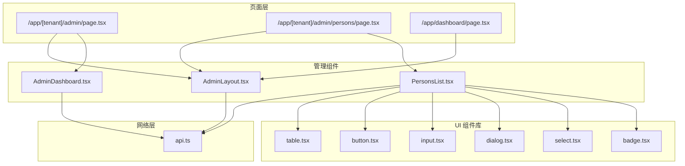
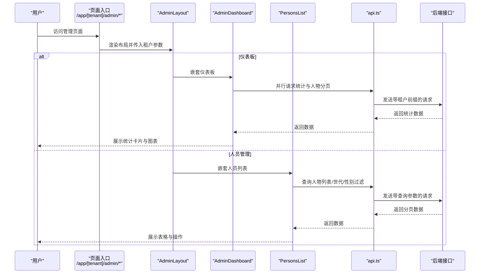
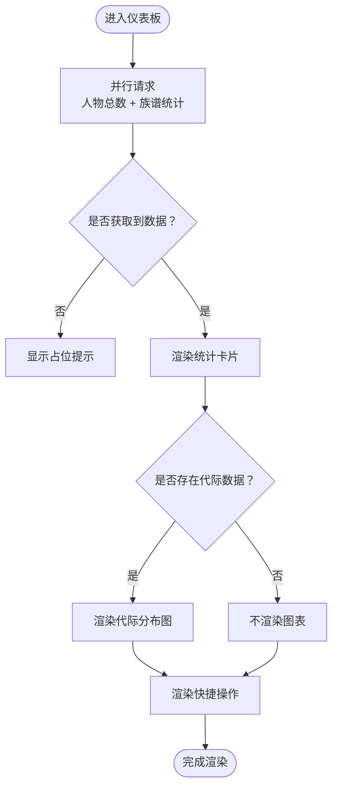
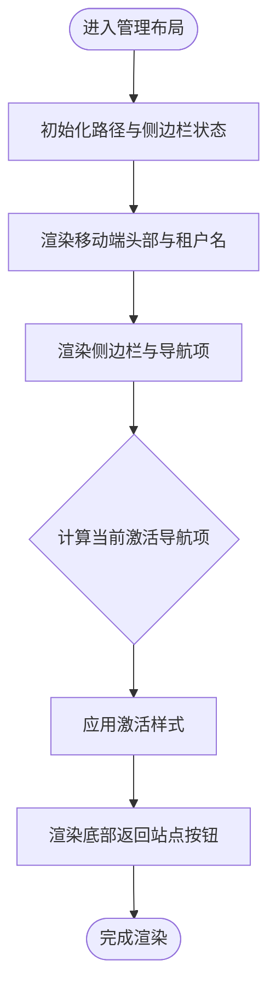
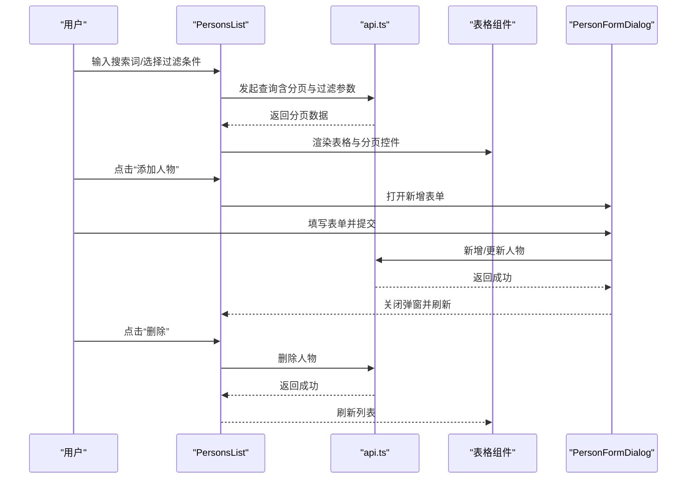
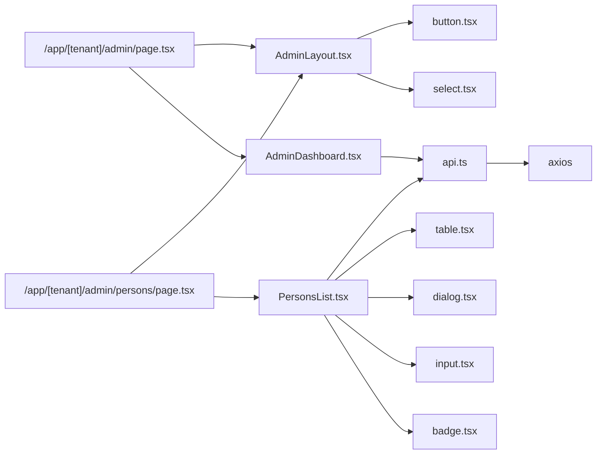

# 管理组件

<cite>
**本文引用的文件**
- [frontend/components/admin/AdminDashboard.tsx](file://frontend/components/admin/AdminDashboard.tsx)
- [frontend/components/admin/AdminLayout.tsx](file://frontend/components/admin/AdminLayout.tsx)
- [frontend/components/admin/PersonsList.tsx](file://frontend/components/admin/PersonsList.tsx)
- [frontend/app/[tenant]/admin/page.tsx](file://frontend/app/[tenant]/admin/page.tsx)
- [frontend/app/[tenant]/admin/persons/page.tsx](file://frontend/app/[tenant]/admin/persons/page.tsx)
- [frontend/app/dashboard/page.tsx](file://frontend/app/dashboard/page.tsx)
- [frontend/lib/api.ts](file://frontend/lib/api.ts)
- [frontend/components/ui/table.tsx](file://frontend/components/ui/table.tsx)
- [frontend/components/ui/button.tsx](file://frontend/components/ui/button.tsx)
- [frontend/components/ui/input.tsx](file://frontend/components/ui/input.tsx)
- [frontend/components/ui/dialog.tsx](file://frontend/components/ui/dialog.tsx)
- [frontend/components/ui/select.tsx](file://frontend/components/ui/select.tsx)
- [frontend/components/ui/badge.tsx](file://frontend/components/ui/badge.tsx)
</cite>

## 目录
1. [引言](#引言)
2. [项目结构](#项目结构)
3. [核心组件](#核心组件)
4. [架构总览](#架构总览)
5. [详细组件分析](#详细组件分析)
6. [依赖分析](#依赖分析)
7. [性能考虑](#性能考虑)
8. [故障排除指南](#故障排除指南)
9. [结论](#结论)
10. [附录](#附录)

## 引言
本文件面向多租户族谱管理系统的“管理组件”，聚焦管理员界面的组件架构与功能模块，涵盖以下主题：
- 仪表板组件：数据展示、统计图表与快捷操作
- 人员列表组件：CRUD、批量处理、筛选与分页
- 管理布局组件：侧边栏导航、面包屑与权限控制
- 表单组件：验证规则、错误处理与提交流程
- 数据表格：排序、分页、搜索与导出
- 组件状态管理、数据同步与用户体验优化

目标是帮助开发者与产品人员快速理解前端管理界面的实现方式与交互逻辑。

## 项目结构
管理组件位于前端 Next.js 应用中，采用按功能分层的组织方式：
- 页面入口：根据租户 slug 动态路由进入管理页面与人员管理页面
- 布局与仪表板：AdminLayout 与 AdminDashboard 提供统一布局与概览视图
- 人员管理：PersonsList 负责人物数据的增删改查、筛选与分页
- UI 组件库：table、button、input、dialog、select、badge 等基础 UI 组成
- API 客户端：封装 axios 并注入鉴权头与统一错误处理

**图表来源**
- [frontend/app/[tenant]/admin/page.tsx](file://frontend/app/[tenant]/admin/page.tsx#L1-L20)
- [frontend/app/[tenant]/admin/persons/page.tsx](file://frontend/app/[tenant]/admin/persons/page.tsx#L1-L20)
- [frontend/app/dashboard/page.tsx:1-185](file://frontend/app/dashboard/page.tsx#L1-L185)
- [frontend/components/admin/AdminLayout.tsx:1-116](file://frontend/components/admin/AdminLayout.tsx#L1-L116)
- [frontend/components/admin/AdminDashboard.tsx:1-172](file://frontend/components/admin/AdminDashboard.tsx#L1-L172)
- [frontend/components/admin/PersonsList.tsx:1-481](file://frontend/components/admin/PersonsList.tsx#L1-L481)
- [frontend/lib/api.ts:1-46](file://frontend/lib/api.ts#L1-L46)
- [frontend/components/ui/table.tsx:1-81](file://frontend/components/ui/table.tsx#L1-L81)
- [frontend/components/ui/button.tsx:1-56](file://frontend/components/ui/button.tsx#L1-L56)
- [frontend/components/ui/input.tsx:1-25](file://frontend/components/ui/input.tsx#L1-L25)
- [frontend/components/ui/dialog.tsx:1-119](file://frontend/components/ui/dialog.tsx#L1-L119)
- [frontend/components/ui/select.tsx:1-158](file://frontend/components/ui/select.tsx#L1-L158)
- [frontend/components/ui/badge.tsx:1-36](file://frontend/components/ui/badge.tsx#L1-L36)

**章节来源**
- [frontend/app/[tenant]/admin/page.tsx](file://frontend/app/[tenant]/admin/page.tsx#L1-L20)
- [frontend/app/[tenant]/admin/persons/page.tsx](file://frontend/app/[tenant]/admin/persons/page.tsx#L1-L20)
- [frontend/app/dashboard/page.tsx:1-185](file://frontend/app/dashboard/page.tsx#L1-L185)

## 核心组件
- 管理布局组件（AdminLayout）：提供移动端适配的侧边栏导航、当前租户标识与返回站点按钮；通过路径高亮实现导航状态管理。
- 仪表板组件（AdminDashboard）：聚合统计信息（人物总数、世代统计）、生成代际分布柱状图、提供快捷操作入口。
- 人员列表组件（PersonsList）：支持搜索、过滤（世代、性别）、分页、新增/编辑弹窗表单、删除确认与数据刷新。
- UI 组件库：table、button、input、dialog、select、badge 等，统一风格与交互行为。
- API 客户端（api.ts）：集中处理鉴权头注入与 401 统一跳转登录。

**章节来源**
- [frontend/components/admin/AdminLayout.tsx:1-116](file://frontend/components/admin/AdminLayout.tsx#L1-L116)
- [frontend/components/admin/AdminDashboard.tsx:1-172](file://frontend/components/admin/AdminDashboard.tsx#L1-L172)
- [frontend/components/admin/PersonsList.tsx:1-481](file://frontend/components/admin/PersonsList.tsx#L1-L481)
- [frontend/lib/api.ts:1-46](file://frontend/lib/api.ts#L1-L46)
- [frontend/components/ui/table.tsx:1-81](file://frontend/components/ui/table.tsx#L1-L81)
- [frontend/components/ui/button.tsx:1-56](file://frontend/components/ui/button.tsx#L1-L56)
- [frontend/components/ui/input.tsx:1-25](file://frontend/components/ui/input.tsx#L1-L25)
- [frontend/components/ui/dialog.tsx:1-119](file://frontend/components/ui/dialog.tsx#L1-L119)
- [frontend/components/ui/select.tsx:1-158](file://frontend/components/ui/select.tsx#L1-L158)
- [frontend/components/ui/badge.tsx:1-36](file://frontend/components/ui/badge.tsx#L1-L36)

## 架构总览
管理组件的运行时交互链路如下：
- 页面入口根据租户 slug 渲染 AdminLayout，并在其中嵌套具体业务组件（仪表板或人员列表）
- 管理布局负责导航与租户上下文传递
- 业务组件通过 React Query 发起请求，使用 api.ts 封装的 axios 实例
- UI 组件库提供一致的交互体验与视觉风格
- 401 错误由 api.ts 的响应拦截器统一处理，自动清理本地令牌并跳转登录

**图表来源**
- [frontend/app/[tenant]/admin/page.tsx](file://frontend/app/[tenant]/admin/page.tsx#L1-L20)
- [frontend/app/[tenant]/admin/persons/page.tsx](file://frontend/app/[tenant]/admin/persons/page.tsx#L1-L20)
- [frontend/components/admin/AdminLayout.tsx:1-116](file://frontend/components/admin/AdminLayout.tsx#L1-L116)
- [frontend/components/admin/AdminDashboard.tsx:1-172](file://frontend/components/admin/AdminDashboard.tsx#L1-L172)
- [frontend/components/admin/PersonsList.tsx:1-481](file://frontend/components/admin/PersonsList.tsx#L1-L481)
- [frontend/lib/api.ts:1-46](file://frontend/lib/api.ts#L1-L46)

## 详细组件分析

### 仪表板组件（AdminDashboard）
职责与特性：
- 数据聚合：通过并行请求获取人物总数与族谱统计，避免串行等待
- 统计卡片：展示总人物数、最高世代、最早/最新世代等关键指标
- 代际分布图：基于最高世代人数占比绘制进度条，直观显示代际规模
- 快捷操作：提供“管理人物”“查看族谱树”的入口链接

交互与状态：
- 使用 React Query 的并行查询与缓存策略，减少重复请求
- 通过 props 接收 tenantSlug，确保数据与租户绑定
- 图表渲染依赖后端返回的 generations 数组，若为空则隐藏图表区域

**图表来源**
- [frontend/components/admin/AdminDashboard.tsx:1-172](file://frontend/components/admin/AdminDashboard.tsx#L1-L172)

**章节来源**
- [frontend/components/admin/AdminDashboard.tsx:12-121](file://frontend/components/admin/AdminDashboard.tsx#L12-L121)

### 管理布局组件（AdminLayout）
职责与特性：
- 导航：提供“概览”“人物管理”“族谱树”“设置”四类导航项，支持移动端抽屉式侧边栏
- 高亮：根据当前路径高亮对应导航项，增强可发现性
- 租户上下文：在侧边栏顶部显示租户名称，便于多租户切换识别
- 返回站点：底部提供“查看族谱”按钮，便于从管理视角快速回到前台

交互与状态：
- 使用 useState 控制移动端侧边栏开关
- 使用 usePathname 判断当前路由，动态计算激活状态
- 所有导航链接均拼接租户 slug，保证多租户隔离

**图表来源**
- [frontend/components/admin/AdminLayout.tsx:30-99](file://frontend/components/admin/AdminLayout.tsx#L30-L99)

**章节来源**
- [frontend/components/admin/AdminLayout.tsx:30-114](file://frontend/components/admin/AdminLayout.tsx#L30-L114)

### 人员列表组件（PersonsList）
职责与特性：
- 列表展示：以表格形式展示人物姓名、性别、世代、生卒年、父亲、可见性等字段
- 过滤与搜索：支持按“世代”“性别”进行下拉过滤，支持按姓名/字/号进行关键词搜索
- 分页：内置页码状态，支持上一页/下一页导航
- CRUD：支持新增与编辑（弹窗表单），支持删除（二次确认）
- 刷新：提供刷新按钮，手动触发数据重载

数据流与状态：
- 使用 React Query 管理查询键（含分页、搜索、过滤参数），自动缓存与失效
- 删除使用 useMutation，成功后主动失效相关查询键，确保 UI 与服务端数据一致
- 表单弹窗复用同一组件，通过是否传入 person 决定新增或编辑模式

**图表来源**
- [frontend/components/admin/PersonsList.tsx:62-102](file://frontend/components/admin/PersonsList.tsx#L62-L102)
- [frontend/lib/api.ts:1-46](file://frontend/lib/api.ts#L1-L46)
- [frontend/components/ui/table.tsx:1-81](file://frontend/components/ui/table.tsx#L1-L81)
- [frontend/components/ui/dialog.tsx:1-119](file://frontend/components/ui/dialog.tsx#L1-L119)
- [frontend/components/ui/select.tsx:1-158](file://frontend/components/ui/select.tsx#L1-L158)

**章节来源**
- [frontend/components/admin/PersonsList.tsx:52-309](file://frontend/components/admin/PersonsList.tsx#L52-L309)

### 表单组件（PersonFormDialog）
职责与特性：
- 复用性：同时支持新增与编辑两种模式，通过是否传入 person 切换标题与默认值
- 字段覆盖：姓名、字、性别、世代、出生/逝世年份、可见性、生平简介
- 提交流程：序列化数值字段（世代、生卒年），调用对应 API，提交后关闭弹窗并刷新列表

验证与错误处理：
- 表单未内联校验逻辑，建议在实际开发中结合表单库增加必填与范围校验
- 提交过程通过 mutation 状态反馈，避免重复提交

**章节来源**
- [frontend/components/admin/PersonsList.tsx:320-481](file://frontend/components/admin/PersonsList.tsx#L320-L481)

### 数据表格（PersonsList 表格）
职责与特性：
- 结构：表头包含姓名、性别、世代、生卒年、父亲、可见性、操作列
- 可见性标签：使用 badge 展示 public/member/private
- 操作列：提供编辑与删除按钮，删除采用二次确认
- 空态：当无数据时显示提示与图标

可扩展点：
- 当前未实现列排序与导出，可在后端支持排序参数与 CSV 导出后接入

**章节来源**
- [frontend/components/admin/PersonsList.tsx:172-256](file://frontend/components/admin/PersonsList.tsx#L172-L256)
- [frontend/components/ui/table.tsx:1-81](file://frontend/components/ui/table.tsx#L1-L81)
- [frontend/components/ui/badge.tsx:1-36](file://frontend/components/ui/badge.tsx#L1-L36)

### UI 组件库与通用交互
- 按钮（button.tsx）：提供多种变体与尺寸，用于操作按钮与表单提交
- 输入框（input.tsx）：统一输入样式，支持受控组件
- 对话框（dialog.tsx）：提供模态弹窗容器，支持关闭与遮罩层
- 选择器（select.tsx）：提供下拉选择，支持滚动与选项渲染
- 标签（badge.tsx）：用于展示可见性等状态标签

这些组件在 PersonsList 中被广泛使用，形成一致的交互与视觉体验。

**章节来源**
- [frontend/components/ui/button.tsx:1-56](file://frontend/components/ui/button.tsx#L1-L56)
- [frontend/components/ui/input.tsx:1-25](file://frontend/components/ui/input.tsx#L1-L25)
- [frontend/components/ui/dialog.tsx:1-119](file://frontend/components/ui/dialog.tsx#L1-L119)
- [frontend/components/ui/select.tsx:1-158](file://frontend/components/ui/select.tsx#L1-L158)
- [frontend/components/ui/badge.tsx:1-36](file://frontend/components/ui/badge.tsx#L1-L36)

## 依赖分析
- 页面层依赖布局与业务组件：/app/[tenant]/admin/* 仅负责组装 AdminLayout 与具体业务组件
- 布局依赖 UI 组件与图标库：AdminLayout 使用按钮、菜单图标与链接组件
- 业务组件依赖 UI 组件与 API 客户端：PersonsList 依赖表格、对话框、选择器、输入框与 api.ts
- API 客户端依赖 axios 与浏览器存储：统一注入 Authorization 头并在 401 时跳转登录

**图表来源**
- [frontend/app/[tenant]/admin/page.tsx](file://frontend/app/[tenant]/admin/page.tsx#L1-L20)
- [frontend/app/[tenant]/admin/persons/page.tsx](file://frontend/app/[tenant]/admin/persons/page.tsx#L1-L20)
- [frontend/components/admin/AdminLayout.tsx:1-116](file://frontend/components/admin/AdminLayout.tsx#L1-L116)
- [frontend/components/admin/AdminDashboard.tsx:1-172](file://frontend/components/admin/AdminDashboard.tsx#L1-L172)
- [frontend/components/admin/PersonsList.tsx:1-481](file://frontend/components/admin/PersonsList.tsx#L1-L481)
- [frontend/lib/api.ts:1-46](file://frontend/lib/api.ts#L1-L46)
- [frontend/components/ui/table.tsx:1-81](file://frontend/components/ui/table.tsx#L1-L81)
- [frontend/components/ui/button.tsx:1-56](file://frontend/components/ui/button.tsx#L1-L56)
- [frontend/components/ui/input.tsx:1-25](file://frontend/components/ui/input.tsx#L1-L25)
- [frontend/components/ui/dialog.tsx:1-119](file://frontend/components/ui/dialog.tsx#L1-L119)
- [frontend/components/ui/select.tsx:1-158](file://frontend/components/ui/select.tsx#L1-L158)
- [frontend/components/ui/badge.tsx:1-36](file://frontend/components/ui/badge.tsx#L1-L36)

**章节来源**
- [frontend/lib/api.ts:1-46](file://frontend/lib/api.ts#L1-L46)

## 性能考虑
- 并行查询：仪表板使用 Promise.all 并行获取统计数据，降低首屏等待时间
- 查询缓存：React Query 自动缓存查询结果，避免重复请求
- 本地状态最小化：仅在必要处使用 useState（如分页、过滤、弹窗开关），减少重渲染
- 懒加载与分页：人员列表采用分页与按需查询，避免一次性加载大量数据
- 401 自动处理：统一拦截器在 401 时清理令牌并跳转登录，避免无效请求堆积

[本节为通用指导，无需特定文件引用]

## 故障排除指南
常见问题与定位方法：
- 登录态失效：出现 401 时，拦截器会清除本地令牌并跳转登录页。检查本地存储中的 access_token 是否存在，确认后端 JWT 令牌有效。
- 请求失败：确认 API 基础地址配置正确，网络连通性正常，后端接口返回格式符合预期。
- 列表不刷新：删除或新增成功后，组件通过 queryClient.invalidateQueries 触发缓存失效，确保 UI 与服务端一致。
- 移动端侧边栏无法关闭：检查移动端头部按钮事件绑定与 overlay 点击回调，确保状态切换正常。

**章节来源**
- [frontend/lib/api.ts:29-43](file://frontend/lib/api.ts#L29-L43)
- [frontend/components/admin/PersonsList.tsx:93-96](file://frontend/components/admin/PersonsList.tsx#L93-L96)

## 结论
管理组件围绕“布局—业务—UI—网络”四层清晰分工，通过 React Query 与自定义 API 客户端实现高效的数据获取与状态同步。仪表板提供关键指标与快捷入口，人员列表覆盖日常管理所需的核心 CRUD 与筛选能力。后续可在排序、导出、表单校验等方面进一步完善，以提升管理效率与用户体验。

[本节为总结性内容，无需特定文件引用]

## 附录
- 页面入口与租户上下文：通过 /app/[tenant]/admin/* 动态路由接收 tenantSlug，并在布局中透传给子组件
- 用户与租户门户：/app/dashboard/page.tsx 提供用户角色与租户列表入口，便于多租户场景下的快速切换

**章节来源**
- [frontend/app/[tenant]/admin/page.tsx](file://frontend/app/[tenant]/admin/page.tsx#L1-L20)
- [frontend/app/[tenant]/admin/persons/page.tsx](file://frontend/app/[tenant]/admin/persons/page.tsx#L1-L20)
- [frontend/app/dashboard/page.tsx:1-185](file://frontend/app/dashboard/page.tsx#L1-L185)