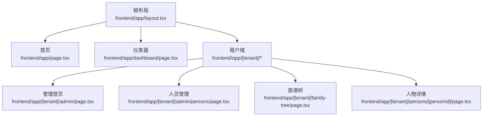
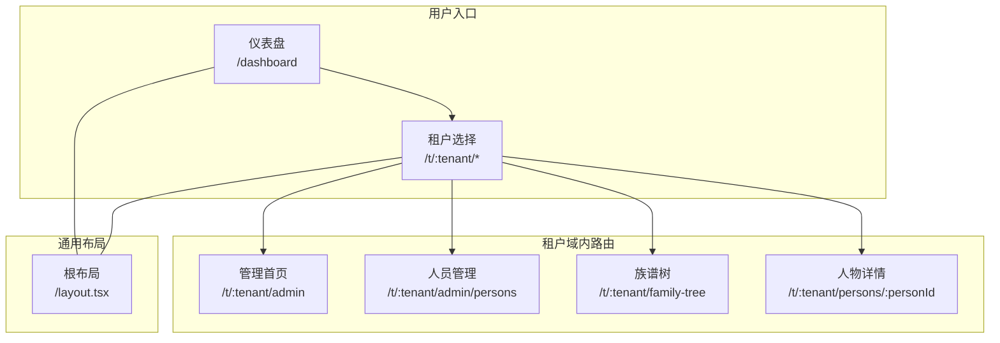
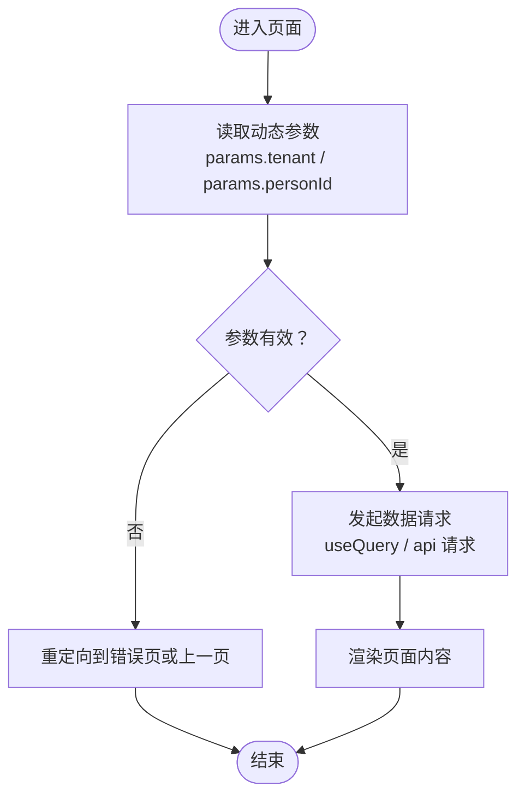
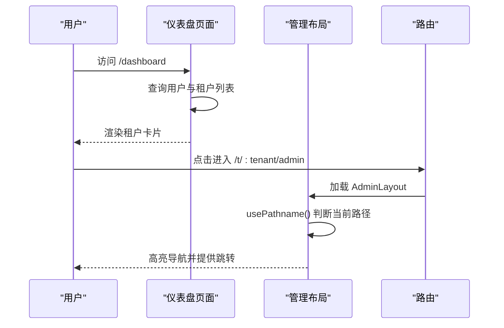
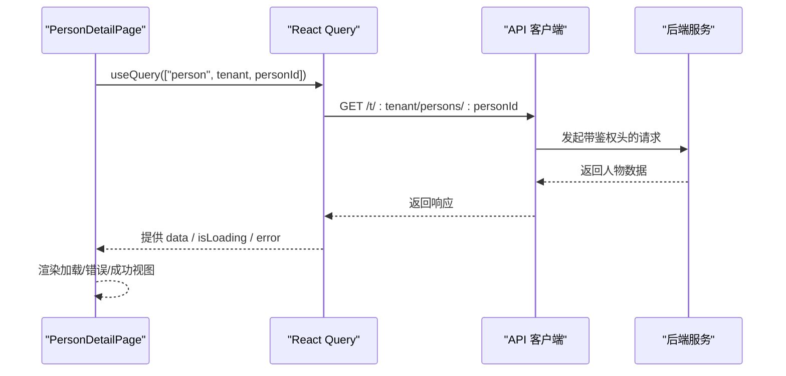
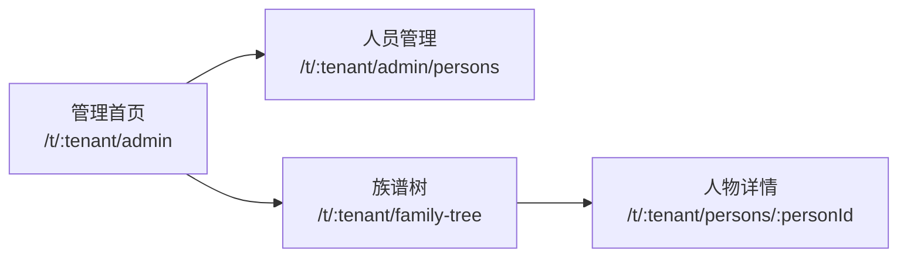
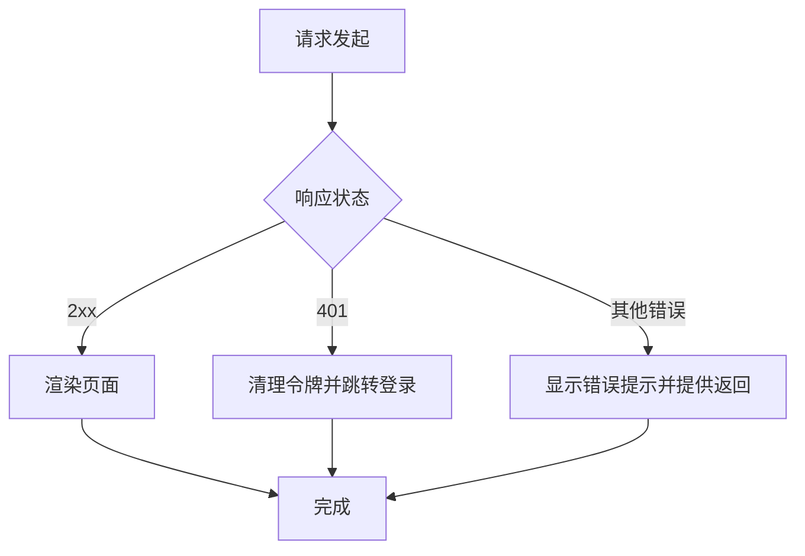
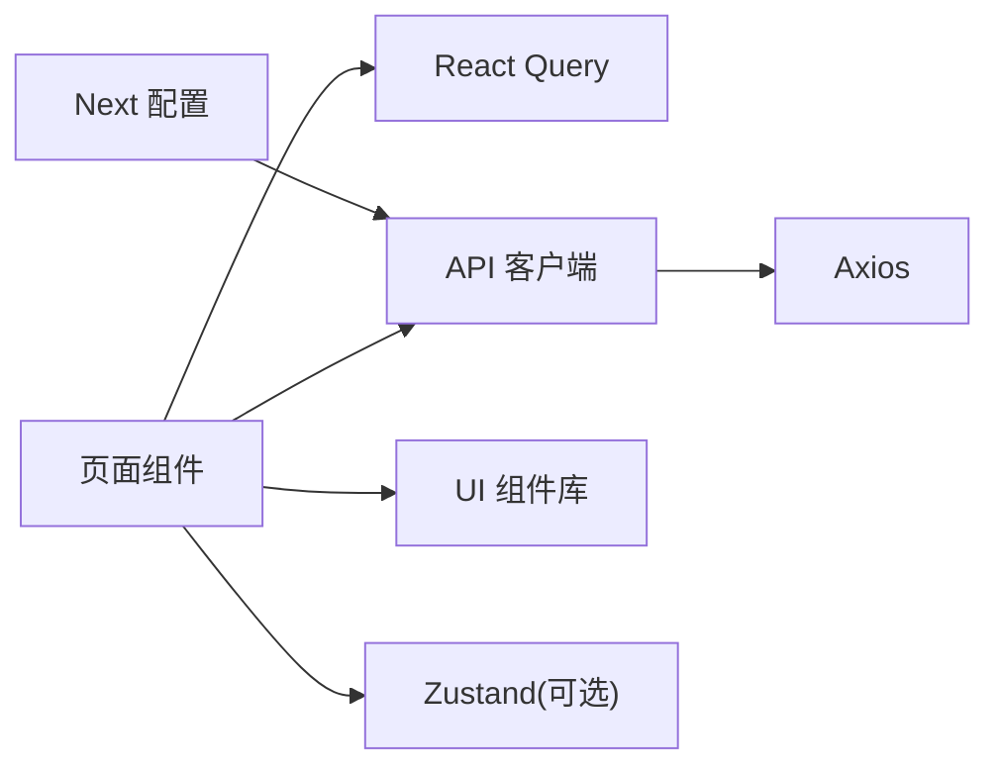

# 页面与路由

<cite>
**本文引用的文件**
- [frontend/app/layout.tsx](file://frontend/app/layout.tsx)
- [frontend/app/page.tsx](file://frontend/app/page.tsx)
- [frontend/app/[tenant]/admin/page.tsx](file://frontend/app/[tenant]/admin/page.tsx)
- [frontend/app/[tenant]/admin/persons/page.tsx](file://frontend/app/[tenant]/admin/persons/page.tsx)
- [frontend/app/[tenant]/family-tree/page.tsx](file://frontend/app/[tenant]/family-tree/page.tsx)
- [frontend/app/[tenant]/persons/[personId]/page.tsx](file://frontend/app/[tenant]/persons/[personId]/page.tsx)
- [frontend/app/dashboard/page.tsx](file://frontend/app/dashboard/page.tsx)
- [frontend/components/admin/AdminLayout.tsx](file://frontend/components/admin/AdminLayout.tsx)
- [frontend/lib/api.ts](file://frontend/lib/api.ts)
- [frontend/next.config.js](file://frontend/next.config.js)
- [frontend/package.json](file://frontend/package.json)
</cite>

## 目录
1. [引言](#引言)
2. [项目结构](#项目结构)
3. [核心组件](#核心组件)
4. [架构总览](#架构总览)
5. [详细组件分析](#详细组件分析)
6. [依赖分析](#依赖分析)
7. [性能考虑](#性能考虑)
8. [故障排查指南](#故障排查指南)
9. [结论](#结论)
10. [附录](#附录)

## 引言
本文件面向多租户族谱管理系统（前端基于 Next.js App Router）的页面与路由架构，系统性阐述以下主题：
- Next.js App Router 的使用方式与路由约定
- 动态路由参数处理、租户路由隔离与权限控制机制
- 页面组件生命周期管理、数据预取与缓存策略
- 嵌套路由设计、路由守卫与导航控制
- 页面间数据传递、状态共享与跳转逻辑
- 路由性能优化技巧与 SEO 配置方案
- 路由冲突、错误处理与回退机制

## 项目结构
前端采用 Next.js App Router 的 app 目录结构，按功能与租户域进行组织：
- 根布局与元数据：在根层定义全局样式与站点元信息
- 租户域路由：以 [tenant] 作为租户动态段，承载租户内所有子路由
- 页面级路由：在租户域下划分 admin、family-tree、persons 等页面
- 仪表盘与公共页：如 dashboard、登录、注册、租户列表等

图表来源
- [frontend/app/layout.tsx:1-25](file://frontend/app/layout.tsx#L1-L25)
- [frontend/app/page.tsx:1-122](file://frontend/app/page.tsx#L1-L122)
- [frontend/app/dashboard/page.tsx:1-185](file://frontend/app/dashboard/page.tsx#L1-L185)
- [frontend/app/[tenant]/admin/page.tsx:1-20](file://frontend/app/[tenant]/admin/page.tsx#L1-L20)
- [frontend/app/[tenant]/admin/persons/page.tsx:1-20](file://frontend/app/[tenant]/admin/persons/page.tsx#L1-L20)
- [frontend/app/[tenant]/family-tree/page.tsx:1-22](file://frontend/app/[tenant]/family-tree/page.tsx#L1-L22)
- [frontend/app/[tenant]/persons/[personId]/page.tsx:1-263](file://frontend/app/[tenant]/persons/[personId]/page.tsx#L1-L263)

章节来源
- [frontend/app/layout.tsx:1-25](file://frontend/app/layout.tsx#L1-L25)
- [frontend/app/page.tsx:1-122](file://frontend/app/page.tsx#L1-L122)
- [frontend/app/dashboard/page.tsx:1-185](file://frontend/app/dashboard/page.tsx#L1-L185)
- [frontend/app/[tenant]/admin/page.tsx:1-20](file://frontend/app/[tenant]/admin/page.tsx#L1-L20)
- [frontend/app/[tenant]/admin/persons/page.tsx:1-20](file://frontend/app/[tenant]/admin/persons/page.tsx#L1-L20)
- [frontend/app/[tenant]/family-tree/page.tsx:1-22](file://frontend/app/[tenant]/family-tree/page.tsx#L1-L22)
- [frontend/app/[tenant]/persons/[personId]/page.tsx:1-263](file://frontend/app/[tenant]/persons/[personId]/page.tsx#L1-L263)

## 核心组件
- 根布局与元数据：定义站点标题、描述与全局字体变量，确保页面统一风格
- 页面组件：各路由页面负责渲染内容、发起数据请求与处理交互
- 管理侧边栏与布局：在租户管理域内提供导航与面包屑式路径
- API 客户端：封装 axios 实例，自动注入鉴权头与统一错误处理
- 构建配置：暴露环境变量给浏览器端，配置图片远程源与严格模式

章节来源
- [frontend/app/layout.tsx:1-25](file://frontend/app/layout.tsx#L1-L25)
- [frontend/lib/api.ts:1-46](file://frontend/lib/api.ts#L1-L46)
- [frontend/next.config.js:1-23](file://frontend/next.config.js#L1-L23)
- [frontend/package.json:1-45](file://frontend/package.json#L1-L45)

## 架构总览
系统采用“租户域 + 页面”的两级路由模型：
- 租户域隔离：通过 [tenant] 动态段将不同家族的资源与 UI 进行逻辑隔离
- 页面路由：在租户域内细分管理后台、族谱树、人物详情等页面
- 权限与导航：仪表盘聚合用户参与的多个租户，点击后进入对应租户域；管理侧边栏根据当前路径高亮并提供跳转

图表来源
- [frontend/app/dashboard/page.tsx:120-172](file://frontend/app/dashboard/page.tsx#L120-L172)
- [frontend/app/[tenant]/admin/page.tsx:10-19](file://frontend/app/[tenant]/admin/page.tsx#L10-L19)
- [frontend/app/[tenant]/admin/persons/page.tsx:10-19](file://frontend/app/[tenant]/admin/persons/page.tsx#L10-L19)
- [frontend/app/[tenant]/family-tree/page.tsx:9-21](file://frontend/app/[tenant]/family-tree/page.tsx#L9-L21)
- [frontend/app/[tenant]/persons/[personId]/page.tsx:20-55](file://frontend/app/[tenant]/persons/[personId]/page.tsx#L20-L55)
- [frontend/app/layout.tsx:12-24](file://frontend/app/layout.tsx#L12-L24)

## 详细组件分析

### 动态路由与参数处理
- 租户动态段：[tenant] 用于捕获租户标识符，页面通过 params.tenant 获取当前租户 slug
- 人物动态段：[personId] 用于捕获人物 ID，页面通过 params.personId 获取当前人物标识符
- 参数类型：在客户端页面中，参数以字符串形式存在，需在业务层进行类型转换与校验

图表来源
- [frontend/app/[tenant]/persons/[personId]/page.tsx:20-32](file://frontend/app/[tenant]/persons/[personId]/page.tsx#L20-L32)
- [frontend/app/[tenant]/admin/page.tsx:10-19](file://frontend/app/[tenant]/admin/page.tsx#L10-L19)
- [frontend/app/[tenant]/admin/persons/page.tsx:10-19](file://frontend/app/[tenant]/admin/persons/page.tsx#L10-L19)

章节来源
- [frontend/app/[tenant]/persons/[personId]/page.tsx:20-32](file://frontend/app/[tenant]/persons/[personId]/page.tsx#L20-L32)
- [frontend/app/[tenant]/admin/page.tsx:10-19](file://frontend/app/[tenant]/admin/page.tsx#L10-L19)
- [frontend/app/[tenant]/admin/persons/page.tsx:10-19](file://frontend/app/[tenant]/admin/persons/page.tsx#L10-L19)

### 租户路由隔离与权限控制
- 租户隔离：路由以 /t/:tenant 开头，确保不同租户资源互不干扰
- 权限控制：仪表盘根据用户在后端的租户成员身份聚合可访问的租户列表；管理侧边栏仅在租户域内生效
- 导航控制：AdminLayout 使用 usePathname 判断当前路径，高亮匹配项并生成跳转链接

图表来源
- [frontend/app/dashboard/page.tsx:20-48](file://frontend/app/dashboard/page.tsx#L20-L48)
- [frontend/components/admin/AdminLayout.tsx:30-88](file://frontend/components/admin/AdminLayout.tsx#L30-L88)
- [frontend/app/[tenant]/admin/page.tsx:10-19](file://frontend/app/[tenant]/admin/page.tsx#L10-L19)

章节来源
- [frontend/app/dashboard/page.tsx:120-172](file://frontend/app/dashboard/page.tsx#L120-L172)
- [frontend/components/admin/AdminLayout.tsx:30-88](file://frontend/components/admin/AdminLayout.tsx#L30-L88)
- [frontend/app/[tenant]/admin/page.tsx:10-19](file://frontend/app/[tenant]/admin/page.tsx#L10-L19)

### 页面生命周期、数据预取与缓存
- 生命周期：页面组件在服务端渲染或客户端渲染时，先执行参数解析与数据请求，再渲染 UI
- 数据预取：使用 TanStack React Query 在页面挂载时发起请求，查询键包含租户与实体 ID，避免跨租户污染
- 缓存策略：查询键组合保证缓存隔离；对用户信息与租户列表使用独立键，避免不必要的重复请求

图表来源
- [frontend/app/[tenant]/persons/[personId]/page.tsx:26-32](file://frontend/app/[tenant]/persons/[personId]/page.tsx#L26-L32)
- [frontend/lib/api.ts:13-27](file://frontend/lib/api.ts#L13-L27)

章节来源
- [frontend/app/[tenant]/persons/[personId]/page.tsx:26-32](file://frontend/app/[tenant]/persons/[personId]/page.tsx#L26-L32)
- [frontend/lib/api.ts:13-27](file://frontend/lib/api.ts#L13-L27)

### 嵌套路由设计与导航控制
- 嵌套路由：租户域内以 /t/:tenant 为父路由，子路由包括 /admin、/admin/persons、/family-tree、/persons/:personId
- 导航控制：AdminLayout 使用 usePathname 与 useNavigation 控制移动端侧边栏开关与高亮；提供从管理页回到族谱树或人员列表的快捷入口

图表来源
- [frontend/app/[tenant]/admin/page.tsx:10-19](file://frontend/app/[tenant]/admin/page.tsx#L10-L19)
- [frontend/app/[tenant]/admin/persons/page.tsx:10-19](file://frontend/app/[tenant]/admin/persons/page.tsx#L10-L19)
- [frontend/app/[tenant]/family-tree/page.tsx:9-21](file://frontend/app/[tenant]/family-tree/page.tsx#L9-L21)
- [frontend/app/[tenant]/persons/[personId]/page.tsx:236-241](file://frontend/app/[tenant]/persons/[personId]/page.tsx#L236-L241)

章节来源
- [frontend/app/[tenant]/admin/page.tsx:10-19](file://frontend/app/[tenant]/admin/page.tsx#L10-L19)
- [frontend/app/[tenant]/admin/persons/page.tsx:10-19](file://frontend/app/[tenant]/admin/persons/page.tsx#L10-L19)
- [frontend/app/[tenant]/family-tree/page.tsx:9-21](file://frontend/app/[tenant]/family-tree/page.tsx#L9-L21)
- [frontend/app/[tenant]/persons/[personId]/page.tsx:236-241](file://frontend/app/[tenant]/persons/[personId]/page.tsx#L236-L241)

### 页面间数据传递与状态共享
- 路径参数传递：通过动态段传递 tenant 与 personId，无需额外状态管理
- 状态共享：使用 React Query 在页面间共享缓存数据；用户登录状态通过本地存储与 API 拦截器共享
- 跳转逻辑：使用 next/navigation 的 useRouter 或 Link 组件进行页面跳转；在管理侧边栏中统一拼接 /t/:tenant 前缀

章节来源
- [frontend/app/[tenant]/persons/[personId]/page.tsx:20-32](file://frontend/app/[tenant]/persons/[personId]/page.tsx#L20-L32)
- [frontend/lib/api.ts:13-27](file://frontend/lib/api.ts#L13-L27)
- [frontend/components/admin/AdminLayout.tsx:75](file://frontend/components/admin/AdminLayout.tsx#L75)

### 错误处理与回退机制
- 401 自动登出：API 拦截器检测 401 后清理本地令牌并跳转至登录页
- 页面级错误：人物详情页在请求失败或数据为空时显示错误提示并提供返回按钮
- 回退策略：使用 router.back() 返回上一页，或在仪表盘中未登录时重定向到登录页

图表来源
- [frontend/lib/api.ts:30-43](file://frontend/lib/api.ts#L30-L43)
- [frontend/app/[tenant]/persons/[personId]/page.tsx:44-55](file://frontend/app/[tenant]/persons/[personId]/page.tsx#L44-L55)
- [frontend/app/dashboard/page.tsx:72-75](file://frontend/app/dashboard/page.tsx#L72-L75)

章节来源
- [frontend/lib/api.ts:30-43](file://frontend/lib/api.ts#L30-L43)
- [frontend/app/[tenant]/persons/[personId]/page.tsx:44-55](file://frontend/app/[tenant]/persons/[personId]/page.tsx#L44-L55)
- [frontend/app/dashboard/page.tsx:72-75](file://frontend/app/dashboard/page.tsx#L72-L75)

## 依赖分析
- 依赖关系：页面组件依赖 React Query 进行数据拉取，依赖 API 客户端进行网络请求，依赖 UI 组件库与工具函数
- 环境变量：NEXT_PUBLIC_API_URL 在构建时注入，运行时通过 axios 实例使用
- 版本与特性：Next.js 15、React 19、TanStack React Query、Axios、Zustand（状态管理）

图表来源
- [frontend/package.json:12-31](file://frontend/package.json#L12-L31)
- [frontend/next.config.js:16-19](file://frontend/next.config.js#L16-L19)
- [frontend/lib/api.ts:1-10](file://frontend/lib/api.ts#L1-L10)

章节来源
- [frontend/package.json:12-31](file://frontend/package.json#L12-L31)
- [frontend/next.config.js:16-19](file://frontend/next.config.js#L16-L19)
- [frontend/lib/api.ts:1-10](file://frontend/lib/api.ts#L1-L10)

## 性能考虑
- 路由与渲染
  - 使用 App Router 的并行数据流与流式传输，减少首屏阻塞
  - 将静态内容与动态内容分离，利用 React Suspense 与渐进式渲染
- 数据缓存
  - 为常用查询设置合理的 staleTime 与 gcTime，避免频繁请求
  - 对用户信息与租户列表使用独立键，降低缓存污染
- 图片与资源
  - 配置 images.remotePatterns 支持外部图片，结合现代格式与懒加载
- 构建与运行
  - 启用 reactStrictMode 提升开发期质量
  - 通过环境变量暴露 API 地址，避免硬编码

章节来源
- [frontend/next.config.js:3-19](file://frontend/next.config.js#L3-L19)
- [frontend/package.json:12-31](file://frontend/package.json#L12-L31)

## 故障排查指南
- 登录态异常
  - 症状：出现 401 并被重定向到登录页
  - 排查：检查本地存储中的 access_token 是否存在；确认 API 拦截器是否正确注入 Authorization 头
- 页面空白或加载失败
  - 症状：人物详情页显示加载失败或空数据
  - 排查：确认动态参数 tenant 与 personId 是否正确；检查后端接口是否返回有效数据
- 导航错位
  - 症状：管理侧边栏高亮不正确或跳转链接错误
  - 排查：确认 AdminLayout 中的 usePathname 与链接拼接是否包含 /t/:tenant 前缀

章节来源
- [frontend/lib/api.ts:30-43](file://frontend/lib/api.ts#L30-L43)
- [frontend/app/[tenant]/persons/[personId]/page.tsx:44-55](file://frontend/app/[tenant]/persons/[personId]/page.tsx#L44-L55)
- [frontend/components/admin/AdminLayout.tsx:68-88](file://frontend/components/admin/AdminLayout.tsx#L68-L88)

## 结论
本系统通过 Next.js App Router 的动态路由与租户域隔离，实现了多家族的路由与数据隔离；配合 React Query 的数据预取与缓存、Axios 的统一拦截与错误处理，以及 AdminLayout 的导航与高亮，构建了清晰、可维护且具备良好用户体验的页面与路由体系。建议在生产环境中进一步完善路由守卫、SEO 元数据与性能监控，以提升安全性与可观测性。

## 附录
- 路由约定速览
  - 根页面：/、/dashboard、/login、/register、/tenants
  - 租户域：/t/:tenant/*
  - 子路由示例：/t/:tenant/admin、/t/:tenant/admin/persons、/t/:tenant/family-tree、/t/:tenant/persons/:personId
- 关键实现参考
  - 动态参数与数据请求：[frontend/app/[tenant]/persons/[personId]/page.tsx](file://frontend/app/[tenant]/persons/[personId]/page.tsx#L20-L32)
  - 租户隔离与导航：[frontend/components/admin/AdminLayout.tsx:30-88](file://frontend/components/admin/AdminLayout.tsx#L30-L88)
  - 鉴权与错误处理：[frontend/lib/api.ts:13-43](file://frontend/lib/api.ts#L13-L43)
  - 构建配置与环境变量：[frontend/next.config.js:16-19](file://frontend/next.config.js#L16-L19)