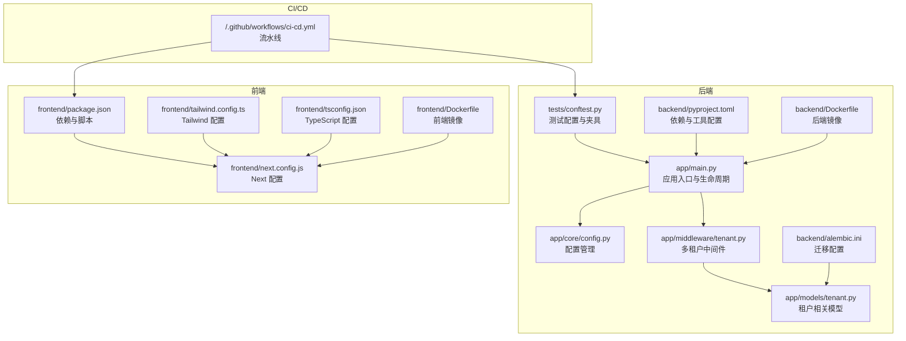
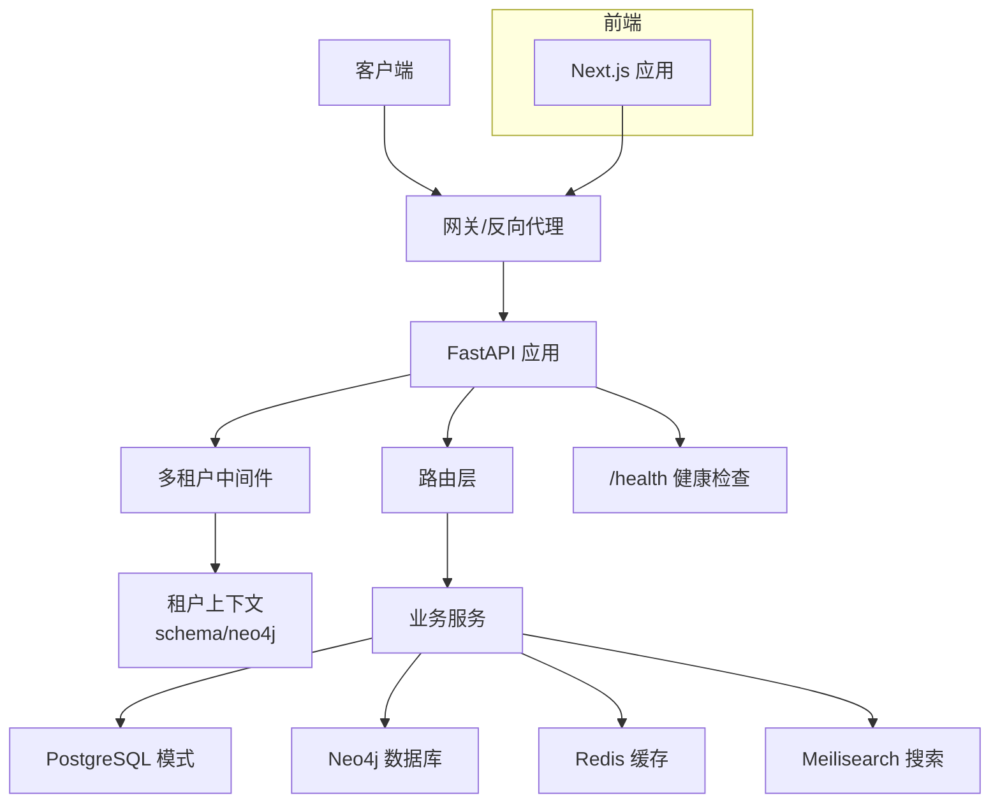
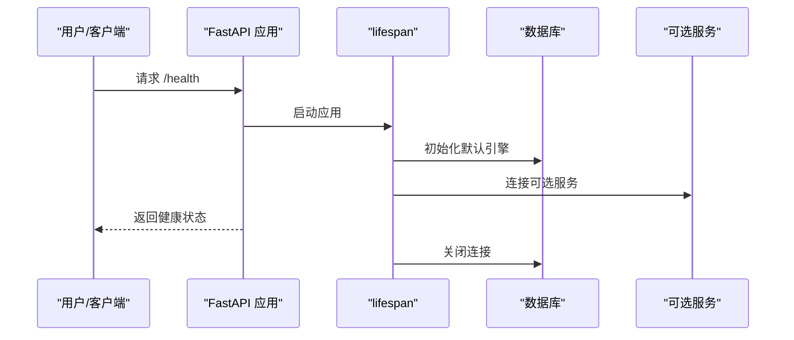
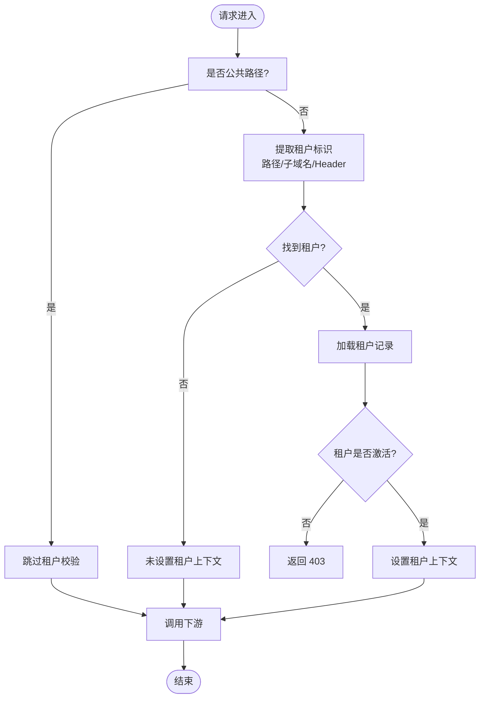
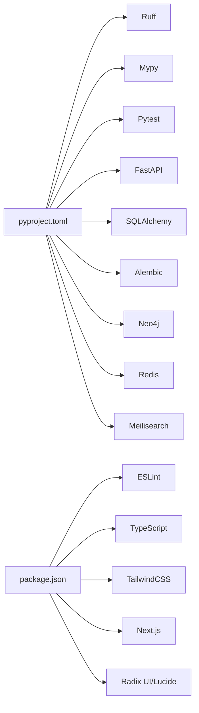

# 代码规范

<cite>
**本文引用的文件**
- [backend/pyproject.toml](file://backend/pyproject.toml)
- [backend/Dockerfile](file://backend/Dockerfile)
- [backend/app/main.py](file://backend/app/main.py)
- [backend/app/core/config.py](file://backend/app/core/config.py)
- [backend/app/middleware/tenant.py](file://backend/app/middleware/tenant.py)
- [backend/app/models/tenant.py](file://backend/app/models/tenant.py)
- [backend/tests/conftest.py](file://backend/tests/conftest.py)
- [backend/alembic.ini](file://backend/alembic.ini)
- [.github/workflows/ci-cd.yml](file://.github/workflows/ci-cd.yml)
- [frontend/package.json](file://frontend/package.json)
- [frontend/Dockerfile](file://frontend/Dockerfile)
- [frontend/next.config.js](file://frontend/next.config.js)
- [frontend/tailwind.config.ts](file://frontend/tailwind.config.ts)
- [frontend/tsconfig.json](file://frontend/tsconfig.json)
- [scripts/create_tenant.py](file://scripts/create_tenant.py)
</cite>

## 目录
1. [引言](#引言)
2. [项目结构](#项目结构)
3. [核心组件](#核心组件)
4. [架构总览](#架构总览)
5. [详细组件分析](#详细组件分析)
6. [依赖关系分析](#依赖关系分析)
7. [性能与内存优化](#性能与内存优化)
8. [故障排查指南](#故障排查指南)
9. [结论](#结论)
10. [附录](#附录)

## 引言
本指南面向多租户族谱管理系统（后端基于 FastAPI，前端基于 Next.js）的开发团队，旨在统一代码风格、构建流程与质量标准，确保在多租户场景下的可维护性、可扩展性与稳定性。内容覆盖：
- 后端 Python 编码规范（PEP8、命名、注释、错误处理）
- 前端 TypeScript/JavaScript 代码风格（ESLint 规则、组件命名、样式）
- Git 提交信息规范与分支管理策略
- 代码审查清单与质量标准
- 项目结构组织与模块化设计
- 格式化与自动化检查流程
- 性能优化与内存管理最佳实践

## 项目结构
项目采用前后端分离与多租户架构：
- 后端：FastAPI 应用，使用 SQLAlchemy（异步）、Alembic 迁移、Ruff/Mypy 检查、Pytest 测试、Redis/Neo4j/Meilisearch 可选服务
- 前端：Next.js 应用，TypeScript、TailwindCSS、ESLint、React 组件化
- CI/CD：GitHub Actions，分别执行后端测试、前端 Lint/类型检查/构建、Docker 镜像构建与推送、生产部署

图表来源
- [backend/app/main.py:1-103](file://backend/app/main.py#L1-L103)
- [backend/app/core/config.py:1-89](file://backend/app/core/config.py#L1-L89)
- [backend/app/middleware/tenant.py:1-142](file://backend/app/middleware/tenant.py#L1-L142)
- [backend/app/models/tenant.py:1-244](file://backend/app/models/tenant.py#L1-L244)
- [backend/tests/conftest.py:1-105](file://backend/tests/conftest.py#L1-L105)
- [backend/Dockerfile:1-24](file://backend/Dockerfile#L1-L24)
- [backend/pyproject.toml:1-61](file://backend/pyproject.toml#L1-L61)
- [backend/alembic.ini:1-45](file://backend/alembic.ini#L1-L45)
- [frontend/package.json:1-45](file://frontend/package.json#L1-L45)
- [frontend/next.config.js:1-23](file://frontend/next.config.js#L1-L23)
- [frontend/tailwind.config.ts:1-36](file://frontend/tailwind.config.ts#L1-L36)
- [frontend/tsconfig.json:1-28](file://frontend/tsconfig.json#L1-L28)
- [frontend/Dockerfile:1-51](file://frontend/Dockerfile#L1-L51)
- [.github/workflows/ci-cd.yml:1-160](file://.github/workflows/ci-cd.yml#L1-L160)

章节来源
- [backend/app/main.py:1-103](file://backend/app/main.py#L1-L103)
- [backend/app/core/config.py:1-89](file://backend/app/core/config.py#L1-L89)
- [backend/app/middleware/tenant.py:1-142](file://backend/app/middleware/tenant.py#L1-L142)
- [backend/app/models/tenant.py:1-244](file://backend/app/models/tenant.py#L1-L244)
- [backend/tests/conftest.py:1-105](file://backend/tests/conftest.py#L1-L105)
- [backend/Dockerfile:1-24](file://backend/Dockerfile#L1-L24)
- [backend/pyproject.toml:1-61](file://backend/pyproject.toml#L1-L61)
- [backend/alembic.ini:1-45](file://backend/alembic.ini#L1-L45)
- [frontend/package.json:1-45](file://frontend/package.json#L1-L45)
- [frontend/next.config.js:1-23](file://frontend/next.config.js#L1-L23)
- [frontend/tailwind.config.ts:1-36](file://frontend/tailwind.config.ts#L1-L36)
- [frontend/tsconfig.json:1-28](file://frontend/tsconfig.json#L1-L28)
- [frontend/Dockerfile:1-51](file://frontend/Dockerfile#L1-L51)
- [.github/workflows/ci-cd.yml:1-160](file://.github/workflows/ci-cd.yml#L1-L160)

## 核心组件
- 应用入口与生命周期：定义 FastAPI 实例、CORS、中间件、路由注册与健康检查端点
- 配置系统：集中管理环境变量、数据库、缓存、搜索、JWT、CORS、存储等
- 多租户中间件：从子域名、路径或请求头提取租户标识，设置租户上下文
- 租户数据模型：生成代际、支系、人物、配偶关系、人物图片/视频、变更日志等
- 测试配置：异步数据库引擎、会话、依赖注入覆盖、用户夹具
- 工具与容器：Ruff/Mypy/Lint/TypeCheck；Docker 构建与健康检查；CI/CD 流水线

章节来源
- [backend/app/main.py:1-103](file://backend/app/main.py#L1-L103)
- [backend/app/core/config.py:1-89](file://backend/app/core/config.py#L1-L89)
- [backend/app/middleware/tenant.py:1-142](file://backend/app/middleware/tenant.py#L1-L142)
- [backend/app/models/tenant.py:1-244](file://backend/app/models/tenant.py#L1-L244)
- [backend/tests/conftest.py:1-105](file://backend/tests/conftest.py#L1-L105)
- [backend/pyproject.toml:1-61](file://backend/pyproject.toml#L1-L61)
- [backend/Dockerfile:1-24](file://backend/Dockerfile#L1-L24)
- [.github/workflows/ci-cd.yml:1-160](file://.github/workflows/ci-cd.yml#L1-L160)

## 架构总览
多租户通过“模式/数据库隔离”实现，每个租户拥有独立的 PostgreSQL 模式与可选的 Neo4j 数据库。中间件在请求进入时解析租户上下文，后续业务逻辑按租户上下文读写对应数据。

图表来源
- [backend/app/main.py:72-86](file://backend/app/main.py#L72-L86)
- [backend/app/middleware/tenant.py:39-84](file://backend/app/middleware/tenant.py#L39-L84)
- [backend/app/core/config.py:34-51](file://backend/app/core/config.py#L34-L51)

章节来源
- [backend/app/main.py:45-88](file://backend/app/main.py#L45-L88)
- [backend/app/middleware/tenant.py:15-142](file://backend/app/middleware/tenant.py#L15-L142)
- [backend/app/core/config.py:11-89](file://backend/app/core/config.py#L11-L89)

## 详细组件分析

### 后端：应用入口与生命周期
- 使用 lifespan 管理启动/关闭阶段，初始化默认数据库引擎，连接可选服务（Neo4j/Redis/Meilisearch），打印服务状态
- 注册 CORS、多租户中间件、API 路由前缀
- 提供 /health 健康检查端点，返回服务可用性

图表来源
- [backend/app/main.py:17-42](file://backend/app/main.py#L17-L42)
- [backend/app/main.py:72-86](file://backend/app/main.py#L72-L86)

章节来源
- [backend/app/main.py:17-42](file://backend/app/main.py#L17-L42)
- [backend/app/main.py:72-86](file://backend/app/main.py#L72-L86)

### 后端：配置系统
- 使用 Pydantic Settings 管理配置，支持 .env 文件、大小写不敏感、额外字段忽略
- 关键配置项：应用名/版本、调试/环境、API 前缀、服务器地址/端口、数据库（PostgreSQL/SQLite）、Neo4j、Redis、Meilisearch、JWT、CORS、文件存储（MinIO/S3）、租户配额

章节来源
- [backend/app/core/config.py:11-89](file://backend/app/core/config.py#L11-L89)

### 后端：多租户中间件
- 支持三种租户识别方式：URL 路径前缀 /t/{slug}/...、子域名 {slug}.domain、请求头 X-Tenant-ID
- 公共路径无需租户上下文（认证/租户管理/文档/根路径/健康检查）
- 加载租户后校验激活状态，设置 request.state.tenant、schema 与 Neo4j 数据库名

图表来源
- [backend/app/middleware/tenant.py:39-84](file://backend/app/middleware/tenant.py#L39-L84)
- [backend/app/middleware/tenant.py:93-125](file://backend/app/middleware/tenant.py#L93-L125)

章节来源
- [backend/app/middleware/tenant.py:15-142](file://backend/app/middleware/tenant.py#L15-L142)

### 后端：租户数据模型
- 包含 Generation/Branch/Person/SpouseRelation/PersonImage/PersonVideo/ChangeLog 等表
- 字段覆盖基本属性、关系、时间戳、隐私与排序等
- 使用 UUID 主键与 JSONB 存储变更日志

章节来源
- [backend/app/models/tenant.py:23-244](file://backend/app/models/tenant.py#L23-L244)

### 后端：测试配置与夹具
- 使用 sqlite 内存数据库进行测试，创建/销毁表
- 通过依赖注入覆盖数据库连接，构造管理员与普通用户夹具
- 使用 pytest-asyncio 运行异步测试

章节来源
- [backend/tests/conftest.py:17-105](file://backend/tests/conftest.py#L17-L105)

### 前端：配置与构建
- package.json 定义开发/构建/运行脚本与依赖，包含 ESLint、Next、Tailwind、TypeScript
- next.config.js 开启 React Strict Mode、远程图片白名单、浏览器端环境变量
- tailwind.config.ts 扩展主题颜色与字体族
- tsconfig.json 启用严格模式、禁用编译输出、路径别名

章节来源
- [frontend/package.json:1-45](file://frontend/package.json#L1-L45)
- [frontend/next.config.js:1-23](file://frontend/next.config.js#L1-L23)
- [frontend/tailwind.config.ts:1-36](file://frontend/tailwind.config.ts#L1-L36)
- [frontend/tsconfig.json:1-28](file://frontend/tsconfig.json#L1-L28)

### 前端：Docker 构建与健康检查
- 多阶段构建：安装生产依赖、构建产物、运行时镜像
- 非 root 用户运行、健康检查、暴露端口、环境变量

章节来源
- [frontend/Dockerfile:1-51](file://frontend/Dockerfile#L1-L51)

### 后端：Docker 与工具链
- Dockerfile：安装系统依赖、复制并安装 Python 依赖、复制源码、暴露端口、运行 Uvicorn
- pyproject.toml：Ruff（行宽、规则集、目标版本）、Mypy（严格模式、忽略缺失导入）、Pytest 配置

章节来源
- [backend/Dockerfile:1-24](file://backend/Dockerfile#L1-24)
- [backend/pyproject.toml:45-61](file://backend/pyproject.toml#L45-L61)

### CI/CD 流水线
- 后端：启动 Postgres/Redis 服务，安装开发依赖，运行 pytest 并上传覆盖率
- 前端：安装依赖、ESLint、类型检查、构建
- Docker：仅在主分支推送时构建并推送到仓库
- 部署：SSH 到服务器执行部署脚本

章节来源
- [.github/workflows/ci-cd.yml:14-160](file://.github/workflows/ci-cd.yml#L14-L160)

## 依赖关系分析
- 后端依赖：FastAPI、SQLAlchemy（异步）、Pydantic/Settings、Alembic、HTTPX、Redis、Neo4j、Meilisearch、Email 验证、dotenv
- 前端依赖：Next、React、TanStack React Query、Axios、Zustand、Tailwind、Radix UI、Lucide、Date-fns、React D3 Tree
- 工具链：Ruff、Mypy、ESLint（Next 配置）、TypeScript、TailwindCSS、PostCSS、Autoprefixer

图表来源
- [backend/pyproject.toml:7-36](file://backend/pyproject.toml#L7-L36)
- [frontend/package.json:12-43](file://frontend/package.json#L12-L43)

章节来源
- [backend/pyproject.toml:7-36](file://backend/pyproject.toml#L7-L36)
- [frontend/package.json:12-43](file://frontend/package.json#L12-L43)

## 性能与内存优化
- 数据库连接池：合理设置池大小与溢出，避免高并发下的连接争用
- 异步 I/O：优先使用异步驱动与 ORM，减少阻塞
- 可选服务降级：Neo4j/Redis/Meilisearch 不可用时应用仍可运行，但需记录状态
- 查询优化：对高频查询建立索引，避免 N+1 查询，使用分页与投影
- 缓存策略：对只读数据与热点接口使用 Redis 缓存，设置合理过期时间
- 前端构建：多阶段 Docker 减少镜像体积，启用静态资源优化与健康检查
- 内存管理：及时释放数据库会话与外部连接，避免循环引用与大对象常驻

[本节为通用指导，无需特定文件引用]

## 故障排查指南
- 健康检查失败：确认 /health 返回的服务状态，检查数据库、Neo4j、Redis、Meilisearch 的可用性
- 租户上下文缺失：核对请求路径/子域名/Header 是否符合中间件识别规则
- 数据迁移问题：检查 alembic.ini 中的 SQLAlchemy URL 与数据库连接
- 测试异常：确认测试数据库引擎、会话生命周期与依赖注入覆盖是否正确

章节来源
- [backend/app/main.py:72-86](file://backend/app/main.py#L72-L86)
- [backend/app/middleware/tenant.py:93-125](file://backend/app/middleware/tenant.py#L93-L125)
- [backend/alembic.ini:8](file://backend/alembic.ini#L8)
- [backend/tests/conftest.py:56-69](file://backend/tests/conftest.py#L56-L69)

## 结论
本规范以现有工程配置为基础，结合多租户架构与前后端技术栈，制定了统一的编码与流程标准。建议在团队内推广并持续演进，配合 CI/CD 与监控体系，保障系统长期稳定与高质量交付。

[本节为总结，无需特定文件引用]

## 附录

### Python 后端编码规范（PEP8 及扩展）
- 命名约定
  - 模块与包：下划线分隔（如 app.middleware.tenant）
  - 类：PascalCase（如 TenantMiddleware、Person）
  - 函数/方法：snake_case（如 create_tenant_schema）
  - 常量：UPPER_CASE（如 MAX_PERSONS）
  - 私有成员：下划线前缀（如 _internal_method）
- 注释与文档字符串
  - 模块顶部添加简要描述的文档字符串
  - 公开函数/类提供 docstring，参数与返回值清晰
  - 行内注释简洁明确，避免显而易见的注释
- 错误处理
  - 明确区分业务异常与系统异常，使用 HTTP 状态码与统一响应结构
  - 对外部服务（Neo4j/Redis/Meilisearch）进行可用性检查与降级处理
- 格式化与静态检查
  - 使用 Ruff 进行格式化与规则检查，遵循 pyproject.toml 中的规则集与行宽
  - 使用 Mypy 进行类型检查，保持 strict 模式
- 异步与并发
  - 优先使用异步函数与异步 ORM，避免阻塞操作
  - 正确管理事件循环与会话生命周期

章节来源
- [backend/pyproject.toml:45-57](file://backend/pyproject.toml#L45-L57)
- [backend/app/middleware/tenant.py:133-141](file://backend/app/middleware/tenant.py#L133-L141)

### TypeScript/JavaScript 前端代码风格
- ESLint 规则
  - 使用 eslint-config-next，确保与 Next.js 最佳实践一致
  - 保持严格模式，禁止未使用的变量与无意义的空 catch
- 组件命名
  - 页面组件：PascalCase（如 FamilyTreePage）
  - UI 组件：PascalCase（如 Button、Dialog）
  - 文件命名：与导出组件同名（如 Button.tsx）
- 样式规范
  - 使用 TailwindCSS 类名，避免内联样式
  - 在 tailwind.config.ts 中集中扩展主题色与字体
- 类型安全
  - tsconfig.json 启用严格模式，禁止隐式 any
  - 为 API 响应与状态管理定义明确的类型

章节来源
- [frontend/package.json:41-42](file://frontend/package.json#L41-L42)
- [frontend/tailwind.config.ts:10-30](file://frontend/tailwind.config.ts#L10-L30)
- [frontend/tsconfig.json:7-15](file://frontend/tsconfig.json#L7-L15)

### Git 提交信息规范与分支管理策略
- 提交信息规范
  - 标题：动词开头的简短描述（如 feat(auth): 添加租户认证流程）
  - 类型：feat、fix、docs、style、refactor、perf、test、chore
  - 范围：模块或目录（如 backend、frontend、ci-cd）
  - 描述：必要时补充动机与影响
- 分支管理
  - develop：集成开发分支
  - main：发布分支，仅合并来自 develop 的稳定变更
  - feature/*：功能开发分支
  - hotfix/*：紧急修复分支

[本节为通用规范，无需特定文件引用]

### 代码审查检查清单与质量标准
- 后端
  - 配置项齐全且有默认值，敏感信息通过环境变量管理
  - 异常处理完整，返回结构统一
  - 单元测试覆盖关键路径，异步测试正确注入依赖
  - Alembic 迁移可回滚，命名清晰
- 前端
  - ESLint 与类型检查通过，无告警
  - 组件职责单一，状态管理合理
  - Tailwind 使用规范，无重复样式
- CI/CD
  - 测试覆盖率报告上传
  - Docker 镜像构建成功，健康检查通过

章节来源
- [.github/workflows/ci-cd.yml:58-71](file://.github/workflows/ci-cd.yml#L58-L71)
- [backend/tests/conftest.py:56-69](file://backend/tests/conftest.py#L56-L69)

### 项目结构组织原则与模块化设计
- 后端
  - 按功能域划分：api（路由）、core（配置/数据库/安全/服务）、middleware（中间件）、models/schemas/services/utils（领域模型与工具）
  - 路由版本化：/api/v1，便于未来升级
  - 中间件集中管理租户上下文
- 前端
  - app 目录采用 App Router 结构，按租户与页面组织
  - components 目录拆分业务组件与 UI 组件
  - 配置文件集中于 next.config.js、tsconfig.json、tailwind.config.ts

章节来源
- [backend/app/main.py:69-70](file://backend/app/main.py#L69-L70)
- [frontend/next.config.js:17-19](file://frontend/next.config.js#L17-L19)

### 代码格式化工具配置与自动化检查流程
- 后端
  - Ruff：行宽 100，规则集包含 E/F/I/N/W/UP，忽略 E501
  - Mypy：strict 模式，忽略缺失导入
  - Pytest：自动发现 tests 目录，异步模式
- 前端
  - ESLint：eslint-config-next
  - TypeScript：严格模式，禁止编译输出
  - TailwindCSS：content 覆盖 pages/components/app
- CI/CD
  - 后端：pytest + coverage
  - 前端：lint + type-check + build

章节来源
- [backend/pyproject.toml:45-61](file://backend/pyproject.toml#L45-L61)
- [frontend/package.json:5-11](file://frontend/package.json#L5-L11)
- [frontend/tsconfig.json:7-15](file://frontend/tsconfig.json#L7-L15)
- [frontend/tailwind.config.ts:5-9](file://frontend/tailwind.config.ts#L5-L9)
- [.github/workflows/ci-cd.yml:58-101](file://.github/workflows/ci-cd.yml#L58-L101)

### 多租户初始化与脚本
- 脚本 create_tenant.py：创建租户、PostgreSQL 模式、初始化表、Neo4j 数据库（或验证连接）
- 建议：在生产中通过 Alembic 与数据库迁移工具完成表结构同步，而非直接 SQL

章节来源
- [scripts/create_tenant.py:18-282](file://scripts/create_tenant.py#L18-L282)