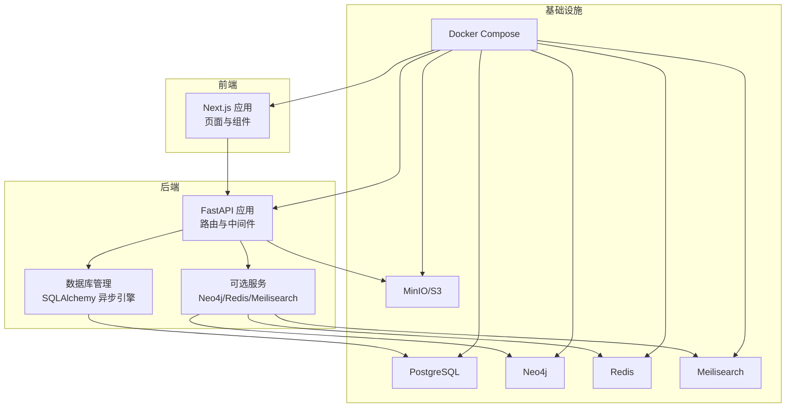
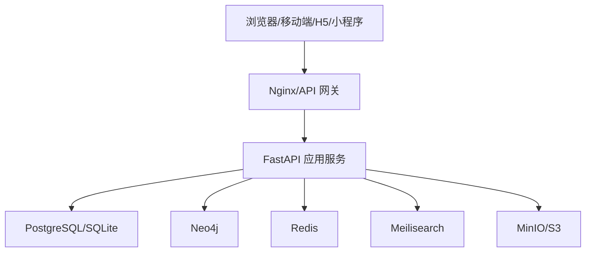
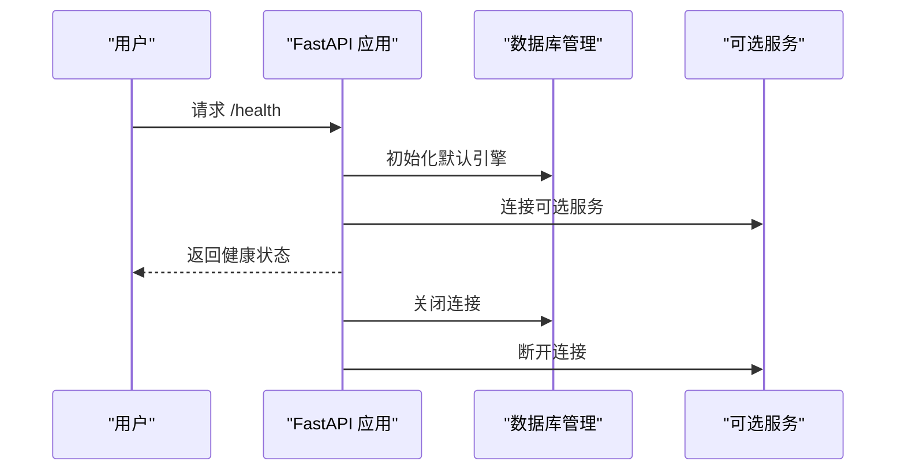
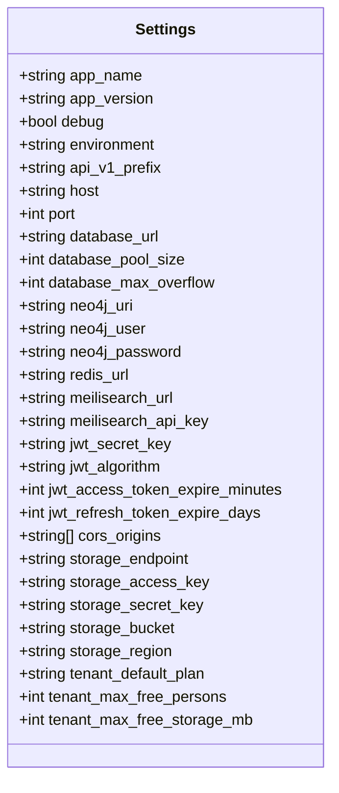
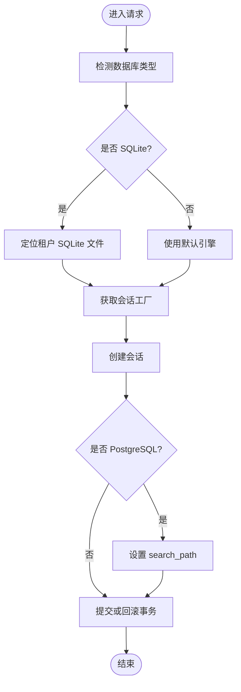
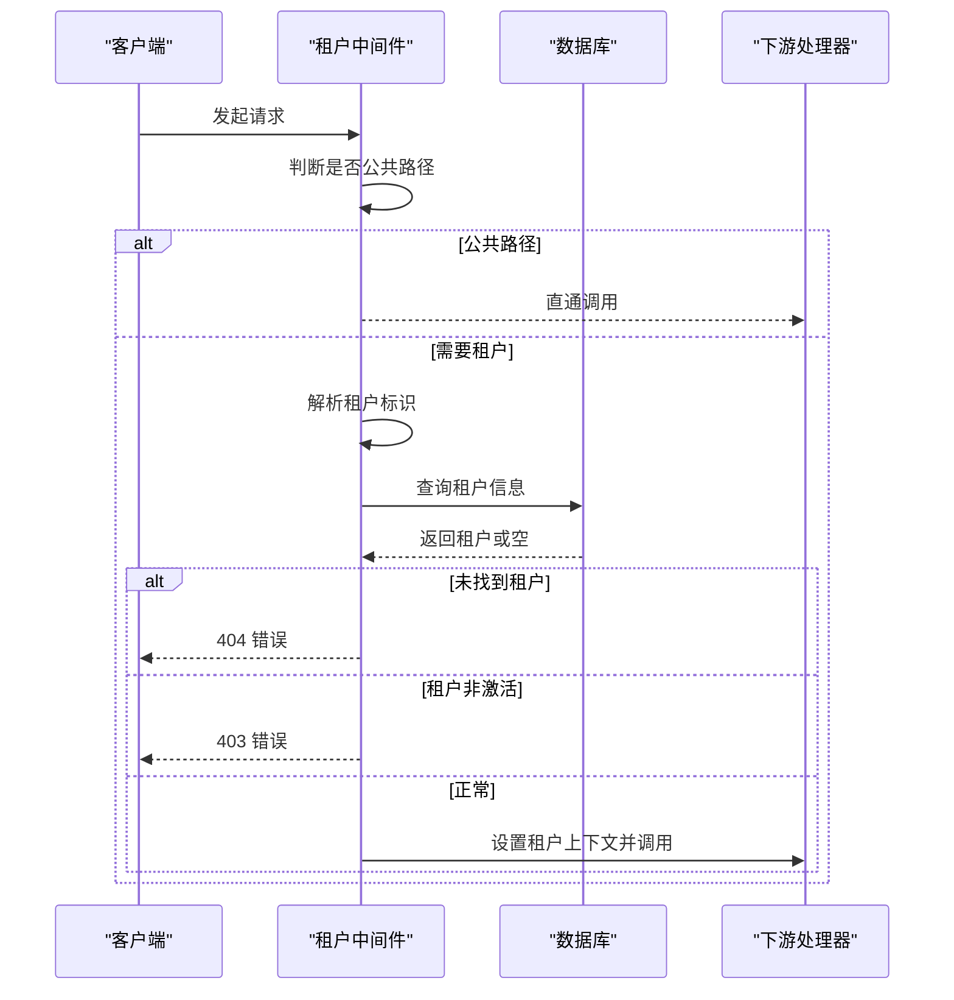
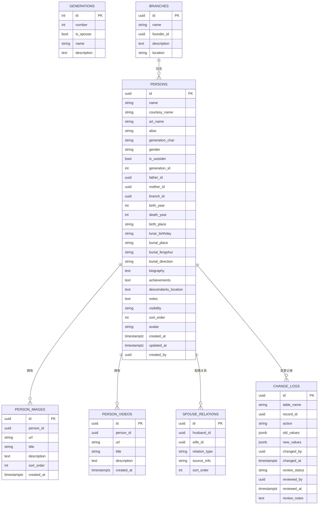
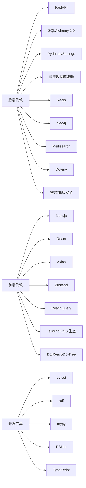

# 开发指南

<cite>
**本文引用的文件**
- [README.md](file://README.md)
- [LOCAL_DEVELOPMENT.md](file://docs/LOCAL_DEVELOPMENT.md)
- [ARCHITECTURE.md](file://docs/ARCHITECTURE.md)
- [ci-cd.yml](file://.github/workflows/ci-cd.yml)
- [docker-compose.yml](file://docker-compose.yml)
- [backend/README.md](file://backend/README.md)
- [backend/pyproject.toml](file://backend/pyproject.toml)
- [backend/app/main.py](file://backend/app/main.py)
- [backend/app/core/config.py](file://backend/app/core/config.py)
- [backend/app/core/database.py](file://backend/app/core/database.py)
- [backend/app/middleware/tenant.py](file://backend/app/middleware/tenant.py)
- [backend/app/models/tenant.py](file://backend/app/models/tenant.py)
- [backend/tests/test_auth.py](file://backend/tests/test_auth.py)
- [frontend/package.json](file://frontend/package.json)
- [frontend/next.config.js](file://frontend/next.config.js)
</cite>

## 目录
1. [简介](#简介)
2. [项目结构](#项目结构)
3. [核心组件](#核心组件)
4. [架构总览](#架构总览)
5. [详细组件分析](#详细组件分析)
6. [依赖分析](#依赖分析)
7. [性能考虑](#性能考虑)
8. [故障排查指南](#故障排查指南)
9. [结论](#结论)
10. [附录](#附录)

## 简介
本指南面向多租户族谱管理系统（Genealogy SaaS）的开发者，覆盖开发环境搭建、依赖与配置、数据库初始化、代码规范与最佳实践、测试策略、调试技巧、版本控制与代码审查、性能优化、开发工具与 IDE 设置、CI/CD 流程以及贡献指南与社区参与方式。目标是帮助团队快速上手并高质量交付系统。

## 项目结构
项目采用前后端分离架构，包含：
- 后端（FastAPI）：多租户 API、认证、中间件、数据库与服务连接
- 前端（Next.js 15 App Router）：页面、组件、UI 库、类型与构建配置
- Docker 与编排：本地开发与生产部署的一致环境
- 文档：架构设计与本地开发指南
- 脚本与迁移：租户初始化、数据迁移与 Neo4j 同步
- 测试：后端 pytest 与前端测试、类型检查与 Lint

图表来源
- [docker-compose.yml:1-145](file://docker-compose.yml#L1-L145)
- [backend/app/main.py:1-103](file://backend/app/main.py#L1-L103)
- [backend/app/core/database.py:1-171](file://backend/app/core/database.py#L1-L171)

章节来源
- [README.md:1-133](file://README.md#L1-L133)
- [docker-compose.yml:1-145](file://docker-compose.yml#L1-L145)

## 核心组件
- 应用入口与生命周期：应用启动时初始化数据库引擎、连接可选服务，并提供健康检查端点
- 配置系统：集中管理数据库、缓存、搜索、存储、JWT、CORS 等参数
- 数据库管理：支持 SQLite（本地开发）与 PostgreSQL（生产），并为每个租户提供独立会话
- 多租户中间件：从请求中识别租户（子域、路径、Header），加载租户信息并切换 Schema/数据库
- 模型与实体：租户级数据模型（人物、支系、世代、配偶关系、变更日志等）

章节来源
- [backend/app/main.py:17-88](file://backend/app/main.py#L17-L88)
- [backend/app/core/config.py:11-89](file://backend/app/core/config.py#L11-L89)
- [backend/app/core/database.py:24-171](file://backend/app/core/database.py#L24-L171)
- [backend/app/middleware/tenant.py:15-142](file://backend/app/middleware/tenant.py#L15-L142)
- [backend/app/models/tenant.py:23-244](file://backend/app/models/tenant.py#L23-L244)

## 架构总览
系统采用“客户端层 → API 网关层 → 应用服务层 → 数据存储层”的分层设计，结合多租户隔离策略（Schema/数据库隔离）与可选服务（图数据库、缓存、搜索、对象存储）支撑高性能与可扩展性。

图表来源
- [ARCHITECTURE.md:30-95](file://docs/ARCHITECTURE.md#L30-L95)

章节来源
- [ARCHITECTURE.md:9-95](file://docs/ARCHITECTURE.md#L9-L95)

## 详细组件分析

### 后端应用与生命周期
- 生命周期钩子负责应用启动与关闭时的资源管理：初始化默认引擎、连接可选服务、关闭连接
- 健康检查端点返回服务可用性状态（数据库、图数据库、缓存、搜索）

图表来源
- [backend/app/main.py:17-42](file://backend/app/main.py#L17-L42)
- [backend/app/main.py:73-86](file://backend/app/main.py#L73-L86)

章节来源
- [backend/app/main.py:17-103](file://backend/app/main.py#L17-L103)

### 配置系统
- 使用 Pydantic Settings 管理环境变量，支持多种外部服务地址与凭据
- CORS、JWT、存储、租户默认策略等均通过配置集中管理

图表来源
- [backend/app/core/config.py:11-89](file://backend/app/core/config.py#L11-L89)

章节来源
- [backend/app/core/config.py:11-89](file://backend/app/core/config.py#L11-L89)

### 数据库管理与多租户会话
- 默认引擎与会话工厂：根据数据库类型（SQLite/PostgreSQL）创建异步引擎与会话
- 租户会话：SQLite 模式下按租户目录生成独立数据库文件；PostgreSQL 模式下通过 search_path 切换 Schema
- 上下文管理器：确保事务提交/回滚与异常处理

图表来源
- [backend/app/core/database.py:58-106](file://backend/app/core/database.py#L58-L106)
- [backend/app/core/database.py:136-171](file://backend/app/core/database.py#L136-L171)

章节来源
- [backend/app/core/database.py:24-171](file://backend/app/core/database.py#L24-L171)

### 多租户中间件
- 识别顺序：子域 → 路径 → Header
- 对公共路径（认证、租户管理、系统管理、健康检查）跳过租户校验
- 未找到租户或租户非激活时返回相应错误

图表来源
- [backend/app/middleware/tenant.py:39-84](file://backend/app/middleware/tenant.py#L39-L84)
- [backend/app/middleware/tenant.py:116-125](file://backend/app/middleware/tenant.py#L116-L125)

章节来源
- [backend/app/middleware/tenant.py:15-142](file://backend/app/middleware/tenant.py#L15-L142)

### 租户级数据模型
- 人物、支系、世代、配偶关系、人物图片/视频、变更日志等
- 支持隐私控制（公开/成员/私有）、排序、头像、时间戳与审计字段

图表来源
- [backend/app/models/tenant.py:23-244](file://backend/app/models/tenant.py#L23-L244)

章节来源
- [backend/app/models/tenant.py:23-244](file://backend/app/models/tenant.py#L23-L244)

### 前端应用与构建配置
- Next.js 15 App Router，启用 React Strict Mode，远程图片优化
- 暴露环境变量 NEXT_PUBLIC_API_URL，默认指向后端 API

章节来源
- [frontend/next.config.js:1-23](file://frontend/next.config.js#L1-L23)
- [frontend/package.json:1-45](file://frontend/package.json#L1-L45)

## 依赖分析
- 后端依赖：FastAPI、SQLAlchemy 2.0、Pydantic/Settings、异步数据库驱动、Redis、Neo4j、Meilisearch、Dotenv、密码加密、HTTP 客户端等
- 前端依赖：Next.js、React、TanStack React Query、Axios、Zustand、Tailwind CSS 生态、D3/React-D3-Tree、日期工具、图标库等
- 开发工具：pytest、pytest-asyncio、pytest-cov、ruff、mypy、ESLint、TypeScript

图表来源
- [backend/pyproject.toml:7-36](file://backend/pyproject.toml#L7-L36)
- [frontend/package.json:12-43](file://frontend/package.json#L12-L43)

章节来源
- [backend/pyproject.toml:1-61](file://backend/pyproject.toml#L1-L61)
- [frontend/package.json:1-45](file://frontend/package.json#L1-L45)

## 性能考虑
- 数据库连接池：PostgreSQL 使用连接池参数，SQLite 在本地开发模式下避免池化以简化配置
- 异步 I/O：后端基于 SQLAlchemy 异步引擎与 FastAPI，提升并发能力
- 可选服务：Neo4j 用于复杂关系查询，Redis 用于缓存热点数据，Meilisearch 提供全文搜索
- 前端优化：Next.js App Router、React 严格模式、远程图片优化、状态管理与查询缓存
- 多租户隔离：SQLite 模式下按租户文件隔离，PostgreSQL 模式下通过 Schema 隔离，减少跨租户干扰

章节来源
- [backend/app/core/database.py:33-96](file://backend/app/core/database.py#L33-L96)
- [backend/app/core/config.py:34-67](file://backend/app/core/config.py#L34-L67)
- [ARCHITECTURE.md:80-95](file://docs/ARCHITECTURE.md#L80-L95)

## 故障排查指南
- 后端启动失败：确认虚拟环境、依赖安装、.env 配置正确；检查数据库连接字符串与可选服务可达性
- 数据库迁移：SQLite 自动建表；PostgreSQL 需手动创建数据库并运行迁移
- 租户识别问题：确认子域、路径或 Header 设置；检查租户是否存在且处于激活状态
- 健康检查：通过 /health 端点查看各服务连接状态
- 前端无法访问后端：确认 NEXT_PUBLIC_API_URL 与后端端口一致

章节来源
- [docs/LOCAL_DEVELOPMENT.md:266-279](file://docs/LOCAL_DEVELOPMENT.md#L266-L279)
- [backend/app/main.py:73-86](file://backend/app/main.py#L73-L86)
- [backend/app/middleware/tenant.py:39-84](file://backend/app/middleware/tenant.py#L39-L84)

## 结论
本指南提供了从环境搭建到部署运维的完整开发路径，结合多租户架构与可选服务，既满足本地快速迭代，又为生产环境提供可扩展方案。建议在开发过程中遵循统一的代码规范与测试策略，配合 CI/CD 自动化保障质量与效率。

## 附录

### 开发环境搭建流程
- 本地开发（最简）：仅需 Python 3.11+ 与 Node.js 18+，SQLite 默认启用
- Docker Compose：一键启动 PostgreSQL、Neo4j、Redis、Meilisearch、MinIO、后端与前端
- 手动启动：后端使用虚拟环境与 uvicorn，前端使用 npm run dev

章节来源
- [README.md:29-60](file://README.md#L29-L60)
- [docs/LOCAL_DEVELOPMENT.md:45-83](file://docs/LOCAL_DEVELOPMENT.md#L45-L83)
- [docker-compose.yml:89-132](file://docker-compose.yml#L89-L132)

### 依赖安装与配置设置
- 后端：安装开发依赖，配置 .env（数据库、缓存、搜索、存储、JWT、CORS）
- 前端：安装依赖，配置 next.config.js 与环境变量

章节来源
- [backend/pyproject.toml:27-36](file://backend/pyproject.toml#L27-L36)
- [frontend/package.json:5-11](file://frontend/package.json#L5-L11)
- [frontend/next.config.js:16-19](file://frontend/next.config.js#L16-L19)

### 数据库初始化
- SQLite：自动创建表（Alembic 迁移）
- PostgreSQL：创建数据库并运行迁移

章节来源
- [docs/LOCAL_DEVELOPMENT.md:198-218](file://docs/LOCAL_DEVELOPMENT.md#L198-L218)

### 代码规范与最佳实践
- 后端：Ruff 规范检查，mypy 类型检查，pytest 异步测试
- 前端：ESLint、TypeScript 类型检查、构建验证

章节来源
- [backend/pyproject.toml:45-60](file://backend/pyproject.toml#L45-L60)
- [frontend/package.json:41-43](file://frontend/package.json#L41-L43)

### 测试策略与测试用例编写
- 后端：pytest + pytest-asyncio + pytest-cov，覆盖认证等关键流程
- 前端：类型检查与构建验证

章节来源
- [backend/tests/test_auth.py:12-149](file://backend/tests/test_auth.py#L12-L149)
- [.github/workflows/ci-cd.yml:58-101](file://.github/workflows/ci-cd.yml#L58-L101)

### 调试技巧
- 启用 debug 模式输出 SQL 日志
- 使用 /health 端点快速诊断服务连通性
- 检查租户中间件路径匹配与租户状态

章节来源
- [backend/app/core/config.py:24-25](file://backend/app/core/config.py#L24-L25)
- [backend/app/main.py:73-86](file://backend/app/main.py#L73-L86)
- [backend/app/middleware/tenant.py:39-84](file://backend/app/middleware/tenant.py#L39-L84)

### 版本控制流程与代码审查标准
- 分支策略：主分支与开发分支，PR 触发测试
- 代码审查：确保通过后端测试、前端 Lint 与类型检查

章节来源
- [.github/workflows/ci-cd.yml:3-7](file://.github/workflows/ci-cd.yml#L3-L7)
- [.github/workflows/ci-cd.yml:58-101](file://.github/workflows/ci-cd.yml#L58-L101)

### 性能优化与内存管理
- 合理设置数据库连接池参数
- 使用缓存与搜索服务降低数据库压力
- 前端使用状态管理与查询缓存，避免重复请求

章节来源
- [backend/app/core/database.py:44-49](file://backend/app/core/database.py#L44-L49)
- [backend/app/core/config.py:46-51](file://backend/app/core/config.py#L46-L51)
- [frontend/package.json:16-18](file://frontend/package.json#L16-L18)

### 开发工具配置与 IDE 设置
- 后端：VS Code + Python 扩展，启用 ruff、mypy、pytest 插件
- 前端：VS Code + TypeScript/ESLint 扩展，Tailwind CSS IntelliSense

章节来源
- [backend/pyproject.toml:45-57](file://backend/pyproject.toml#L45-L57)
- [frontend/package.json:41-43](file://frontend/package.json#L41-L43)

### 持续集成/持续部署（CI/CD）流程
- 触发条件：推送 main/develop 或 PR 至 main
- 步骤：后端测试（含覆盖率）、前端 Lint/类型检查/构建、Docker 镜像构建与推送、生产部署

章节来源
- [.github/workflows/ci-cd.yml:1-160](file://.github/workflows/ci-cd.yml#L1-L160)

### 贡献指南与社区参与
- 提交规范：遵循仓库内工具配置（Ruff、ESLint、mypy）
- 测试要求：新增功能需配套测试用例
- 文档更新：涉及架构或流程变更时同步更新 ARCHITECTURE.md 与 LOCAL_DEVELOPMENT.md

章节来源
- [backend/pyproject.toml:45-60](file://backend/pyproject.toml#L45-L60)
- [frontend/package.json:41-43](file://frontend/package.json#L41-L43)
- [docs/ARCHITECTURE.md:1-10](file://docs/ARCHITECTURE.md#L1-L10)
- [docs/LOCAL_DEVELOPMENT.md:1-10](file://docs/LOCAL_DEVELOPMENT.md#L1-L10)