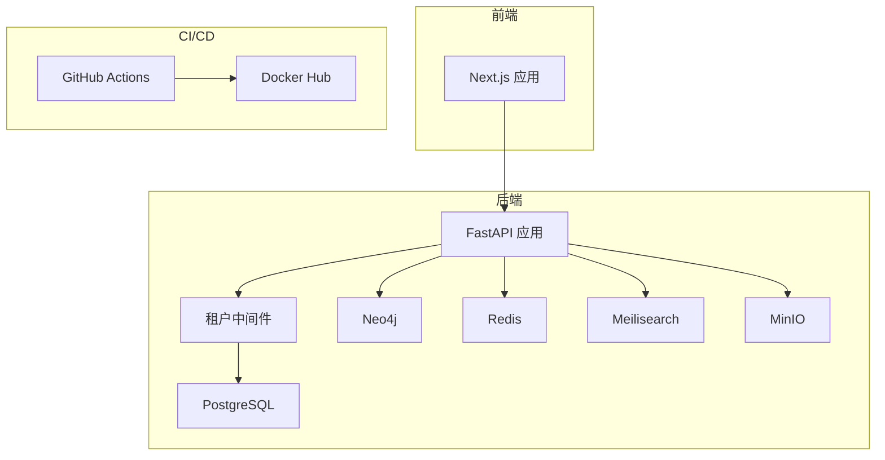
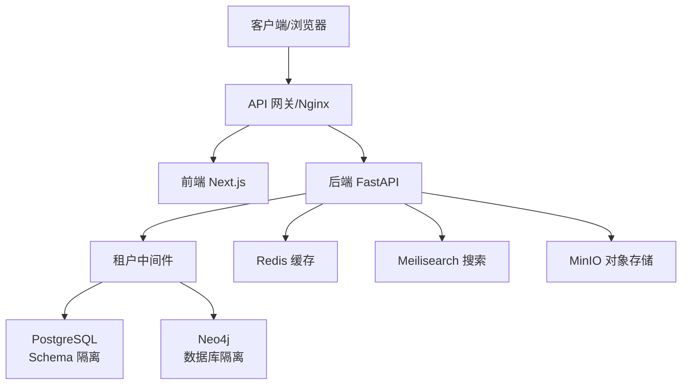
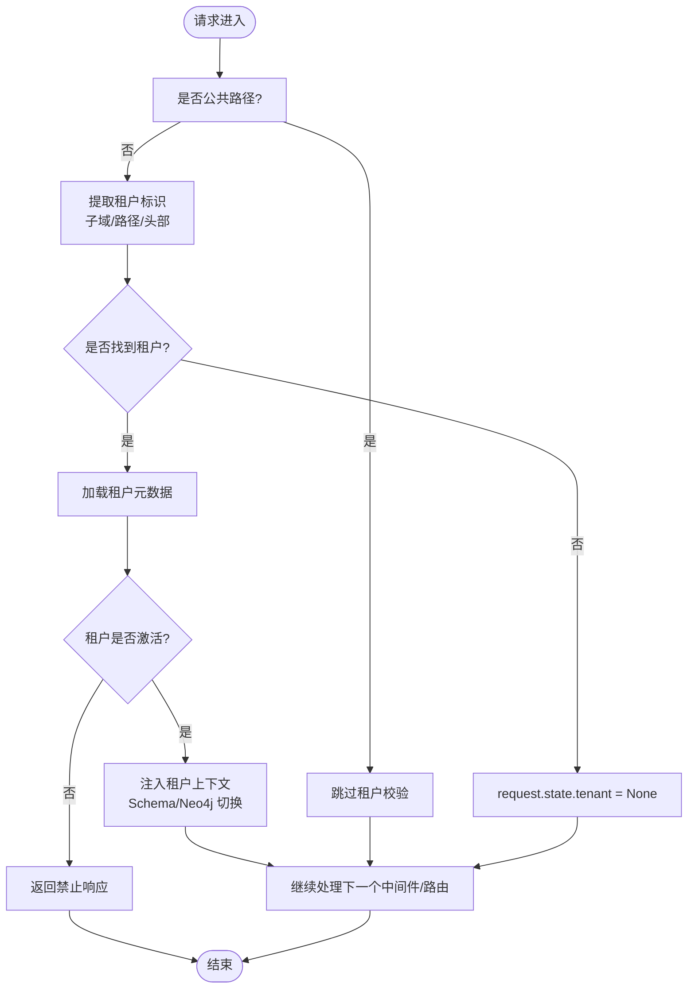
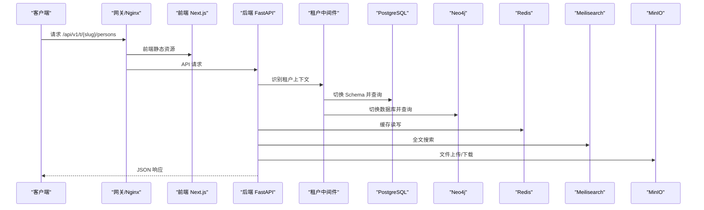
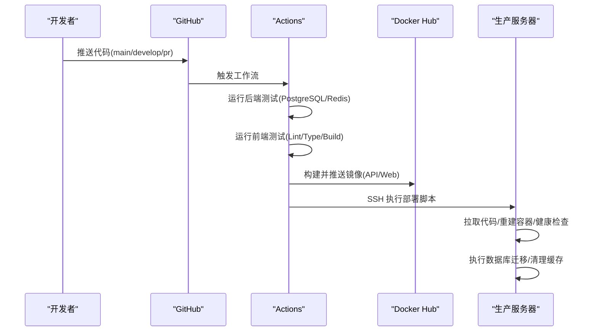
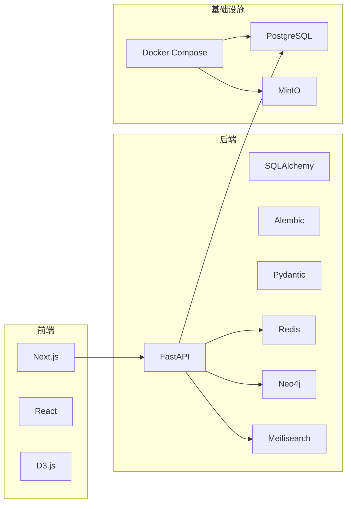

# 开发流程

<cite>
**本文引用的文件**
- [README.md](file://README.md)
- [ARCHITECTURE.md](file://docs/ARCHITECTURE.md)
- [ci-cd.yml](file://.github/workflows/ci-cd.yml)
- [docker-compose.yml](file://docker-compose.yml)
- [deploy.sh](file://deploy.sh)
- [main.py](file://backend/app/main.py)
- [tenant.py](file://backend/app/middleware/tenant.py)
- [tenants.py](file://backend/app/api/v1/endpoints/tenants.py)
- [persons.py](file://backend/app/api/v1/endpoints/persons.py)
- [family_tree.py](file://backend/app/api/v1/endpoints/family_tree.py)
- [test_tenants.py](file://backend/tests/test_tenants.py)
- [test_persons.py](file://backend/tests/test_persons.py)
- [pyproject.toml](file://backend/pyproject.toml)
- [package.json](file://frontend/package.json)
</cite>

## 目录
1. [简介](#简介)
2. [项目结构](#项目结构)
3. [核心组件](#核心组件)
4. [架构总览](#架构总览)
5. [详细组件分析](#详细组件分析)
6. [依赖分析](#依赖分析)
7. [性能考虑](#性能考虑)
8. [故障排查指南](#故障排查指南)
9. [结论](#结论)
10. [附录](#附录)

## 简介
本文件面向“多租户族谱管理系统”的标准化开发流程与协作规范，覆盖从需求分析到代码上线的完整生命周期，明确 Git 工作流与分支策略、代码评审与合并规范、版本发布与变更管理、CI/CD 配置与执行、团队协作工具与沟通规范，以及需求变更处理与进度跟踪方法。该规范以仓库现有架构与流水线为基础，结合多租户隔离、API 路由、租户中间件与测试实践，形成可落地的工程化标准。

## 项目结构
项目采用前后端分离与容器化部署架构：
- 后端：FastAPI 应用，提供多租户 API；包含中间件、路由、模型与测试。
- 前端：Next.js 应用，提供族谱可视化与管理界面。
- 基础设施：Docker Compose 编排数据库、图数据库、缓存、搜索与对象存储等服务。
- CI/CD：GitHub Actions 实现后端测试、前端检查、镜像构建与远程部署。
- 文档：架构设计文档与本地开发指南。

图表来源
- [docker-compose.yml:1-145](file://docker-compose.yml#L1-L145)
- [main.py:1-103](file://backend/app/main.py#L1-L103)
- [tenant.py:1-142](file://backend/app/middleware/tenant.py#L1-L142)
- [ci-cd.yml:1-160](file://.github/workflows/ci-cd.yml#L1-L160)

章节来源
- [README.md:1-133](file://README.md#L1-L133)
- [docker-compose.yml:1-145](file://docker-compose.yml#L1-L145)

## 核心组件
- 应用入口与生命周期：后端应用在启动时初始化数据库连接、可选服务并注册中间件与路由，提供健康检查端点。
- 租户中间件：负责从请求中识别租户（子域、路径或头部），加载租户元数据并切换数据库 Schema 与图数据库，同时对公共路径放行。
- API 路由与领域模型：提供认证、租户管理、人物管理、族谱树等接口；人物模型包含性别、辈分、支系、隐私等级等字段。
- CI/CD 流水线：在推送主干与拉取请求时触发后端测试、前端检查与构建；在主干推送时构建镜像并远程部署。

章节来源
- [main.py:1-103](file://backend/app/main.py#L1-L103)
- [tenant.py:1-142](file://backend/app/middleware/tenant.py#L1-L142)
- [tenants.py:1-164](file://backend/app/api/v1/endpoints/tenants.py#L1-L164)
- [persons.py:1-717](file://backend/app/api/v1/endpoints/persons.py#L1-L717)
- [family_tree.py:1-274](file://backend/app/api/v1/endpoints/family_tree.py#L1-L274)
- [ci-cd.yml:1-160](file://.github/workflows/ci-cd.yml#L1-L160)

## 架构总览
系统采用多租户隔离策略，通过 PostgreSQL Schema 与 Neo4j 数据库分别隔离不同家族的数据，前端通过子域或路径区分租户，后端中间件在请求进入时完成租户上下文注入与数据库切换。

图表来源
- [ARCHITECTURE.md:98-140](file://docs/ARCHITECTURE.md#L98-L140)
- [tenant.py:15-84](file://backend/app/middleware/tenant.py#L15-L84)
- [docker-compose.yml:4-145](file://docker-compose.yml#L4-L145)

## 详细组件分析

### 租户中间件与多租户识别
- 识别顺序：子域 → 路径 → 头部；公共路径（如认证、租户列表、健康检查）不强制租户上下文。
- 上下文注入：成功识别后设置租户对象、Schema 名称与 Neo4j 数据库名，供后续业务逻辑使用。
- 错误处理：租户不存在或非激活状态返回结构化错误响应。

图表来源
- [tenant.py:39-84](file://backend/app/middleware/tenant.py#L39-L84)

章节来源
- [tenant.py:1-142](file://backend/app/middleware/tenant.py#L1-L142)

### API 路由与数据模型
- 路由结构：/api/v1 下按模块划分，租户级 API 通过 /t/{tenant_slug} 前缀访问；提供认证、租户管理、人物管理、族谱树与搜索等接口。
- 数据模型：人物模型包含基本信息、关系字段、隐私控制与排序等；支持配偶关系、支系与变更审计等扩展能力。
- 族谱树：支持从根节点构建指定深度的树、祖先链与后代树，以及统计信息。

图表来源
- [persons.py:172-235](file://backend/app/api/v1/endpoints/persons.py#L172-L235)
- [family_tree.py:43-68](file://backend/app/api/v1/endpoints/family_tree.py#L43-L68)
- [docker-compose.yml:89-132](file://docker-compose.yml#L89-L132)

章节来源
- [tenants.py:45-88](file://backend/app/api/v1/endpoints/tenants.py#L45-L88)
- [persons.py:172-493](file://backend/app/api/v1/endpoints/persons.py#L172-L493)
- [family_tree.py:43-232](file://backend/app/api/v1/endpoints/family_tree.py#L43-L232)

### CI/CD 流水线与部署
- 触发条件：推送至 main/develop 分支触发后端测试；拉取请求触发主干测试；主干推送触发镜像构建与远程部署。
- 后端测试：使用 PostgreSQL 与 Redis 服务进行集成测试，覆盖率上报至 Codecov。
- 前端测试：安装依赖、代码风格检查、类型检查与构建。
- 镜像构建：后端与前端分别构建镜像并推送到 Docker Hub。
- 远程部署：通过 SSH 在服务器上执行部署脚本，拉取代码、重建容器、运行迁移并检查健康状态。

图表来源
- [ci-cd.yml:1-160](file://.github/workflows/ci-cd.yml#L1-L160)
- [deploy.sh:1-64](file://deploy.sh#L1-L64)

章节来源
- [ci-cd.yml:1-160](file://.github/workflows/ci-cd.yml#L1-L160)
- [deploy.sh:1-64](file://deploy.sh#L1-L64)

## 依赖分析
- 后端依赖：FastAPI、SQLAlchemy、Alembic、Pydantic、Redis、Neo4j、Meilisearch、Redis 等；开发依赖包含 pytest、ruff、mypy。
- 前端依赖：Next.js、React、Tailwind CSS、D3 可视化、状态与查询库等。
- 基础设施：Docker Compose 编排数据库、缓存、搜索与对象存储；生产环境通过部署脚本与 docker-compose.prod.yml 启动。

图表来源
- [pyproject.toml:1-61](file://backend/pyproject.toml#L1-L61)
- [package.json:1-45](file://frontend/package.json#L1-L45)
- [docker-compose.yml:1-145](file://docker-compose.yml#L1-L145)

章节来源
- [pyproject.toml:1-61](file://backend/pyproject.toml#L1-L61)
- [package.json:1-45](file://frontend/package.json#L1-L45)
- [docker-compose.yml:1-145](file://docker-compose.yml#L1-L145)

## 性能考虑
- 数据库：PostgreSQL 使用异步驱动与连接池；建议在高并发场景下优化索引与查询计划，必要时引入只读副本或分表分库。
- 图数据库：Neo4j 查询复杂度与深度限制，建议对族谱树渲染设置最大深度参数并缓存热点结果。
- 缓存：Redis 用于会话与热点数据，建议对高频查询结果与树结构进行缓存，设置合理过期时间。
- 搜索：Meilisearch 适合中文检索，建议预建索引与定期更新，避免大规模重建。
- 前端：D3 渲染大体量族谱树时建议虚拟化与懒加载，减少一次性渲染压力。

## 故障排查指南
- 健康检查：后端提供 /health 端点，检查数据库、图数据库、缓存与搜索服务可用性。
- 日志定位：部署脚本在健康检查失败时输出 API 容器日志，便于快速定位启动异常。
- 数据库迁移：生产环境需执行数据库迁移命令，确保模式一致。
- 测试验证：后端与前端测试分别覆盖 API 与 UI 基本功能，发现问题及时修复。

章节来源
- [main.py:72-86](file://backend/app/main.py#L72-L86)
- [deploy.sh:38-43](file://deploy.sh#L38-L43)
- [test_tenants.py:1-112](file://backend/tests/test_tenants.py#L1-L112)
- [test_persons.py:1-124](file://backend/tests/test_persons.py#L1-L124)

## 结论
本规范以现有架构与流水线为基础，明确了多租户族谱管理系统的开发流程与协作标准。通过规范化的 Git 工作流、严格的代码评审与合并策略、完善的 CI/CD 流程、清晰的版本发布与变更管理，以及团队协作与沟通机制，能够有效提升交付质量与效率，支撑多家族、大规模数据的稳定运营。

## 附录

### Git 工作流与分支策略
- 分支命名
  - feature/*：功能开发分支，基于 develop 合并回 develop。
  - develop：集成分支，合并 feature 后进行测试与评审。
  - release/*：发布分支，准备版本发布，仅做缺陷修复与文档完善。
  - hotfix/*：紧急修复分支，从 main 派生，修复后合并回 main 与 develop。
- 合并策略
  - feature → develop：squash 合并，保持主干整洁。
  - release → main：rebase 合并，保留完整提交历史。
  - hotfix → main/develop：rebase 合并，确保版本号一致。
- 提交规范
  - 类型：feat、fix、docs、style、refactor、test、chore
  - 格式：type(scope): subject
  - 示例：feat(api): 添加人物搜索接口

章节来源
- [ci-cd.yml:3-7](file://.github/workflows/ci-cd.yml#L3-L7)

### 代码评审与合并规范
- 评审要求
  - 每次 PR 至少一名同行评审，涉及多租户隔离与安全的变更需双人评审。
  - 评审关注点：安全性、性能、可维护性、测试覆盖、文档与注释。
- 合并前置
  - 通过 CI/CD 流水线（后端测试、前端检查、类型检查）。
  - 无未解决冲突，代码风格符合 ruff/mypy 规范。
  - 通过本地与集成测试，必要时补充单元测试。

章节来源
- [ci-cd.yml:58-70](file://.github/workflows/ci-cd.yml#L58-L70)
- [pyproject.toml:45-61](file://backend/pyproject.toml#L45-L61)

### 版本发布与变更管理
- 版本号：语义化版本（主.次.修订），在 pyproject.toml 与 package.json 中统一维护。
- 发布流程
  - 创建 release/* 分支，更新版本号与变更日志。
  - 进行回归测试与安全扫描，修复缺陷后关闭分支。
  - 合并至 main 并打标签，触发 CI/CD 构建镜像与部署。
- 变更管理
  - 变更记录：在变更日志中记录功能、修复与破坏性变更。
  - 影响评估：对数据库迁移与第三方依赖升级进行影响评估与回滚预案。

章节来源
- [README.md:83-98](file://README.md#L83-L98)
- [deploy.sh:1-64](file://deploy.sh#L1-L64)

### CI/CD 配置与执行
- 触发条件：push 到 main/develop；pull_request 到 main。
- 后端测试：使用 GitHub Actions 服务（PostgreSQL 与 Redis），运行 pytest 并上传覆盖率。
- 前端测试：安装依赖、Linter、类型检查与构建。
- 镜像构建：后端与前端分别构建并推送至 Docker Hub。
- 远程部署：通过 SSH 在服务器执行部署脚本，拉取代码、重建容器、健康检查、数据库迁移与缓存清理。

章节来源
- [ci-cd.yml:1-160](file://.github/workflows/ci-cd.yml#L1-L160)
- [deploy.sh:1-64](file://deploy.sh#L1-L64)

### 团队协作工具与沟通规范
- 任务管理：使用 Issue/Project 追踪需求与缺陷，按优先级与依赖排序。
- 沟通渠道：Slack/钉钉等即时通讯，每日站会同步进展与阻塞项。
- 文档共享：架构与设计文档集中于 docs 目录，变更需同步更新。
- 会议纪要：评审与发布会议形成纪要并归档，便于追溯。

### 需求变更处理与进度跟踪
- 变更流程
  - 提交变更请求（Issue），明确背景、范围与验收标准。
  - 评估影响与风险，制定开发与测试计划。
  - 开发完成后进行回归测试与评审，合并至 develop。
- 进度跟踪
  - 使用看板（如 ZenHub/Tapd）可视化任务状态。
  - 每日站会同步阻塞项与风险，迭代末评估完成度。
  - 发布前进行冒烟测试与用户验收测试（UAT）。