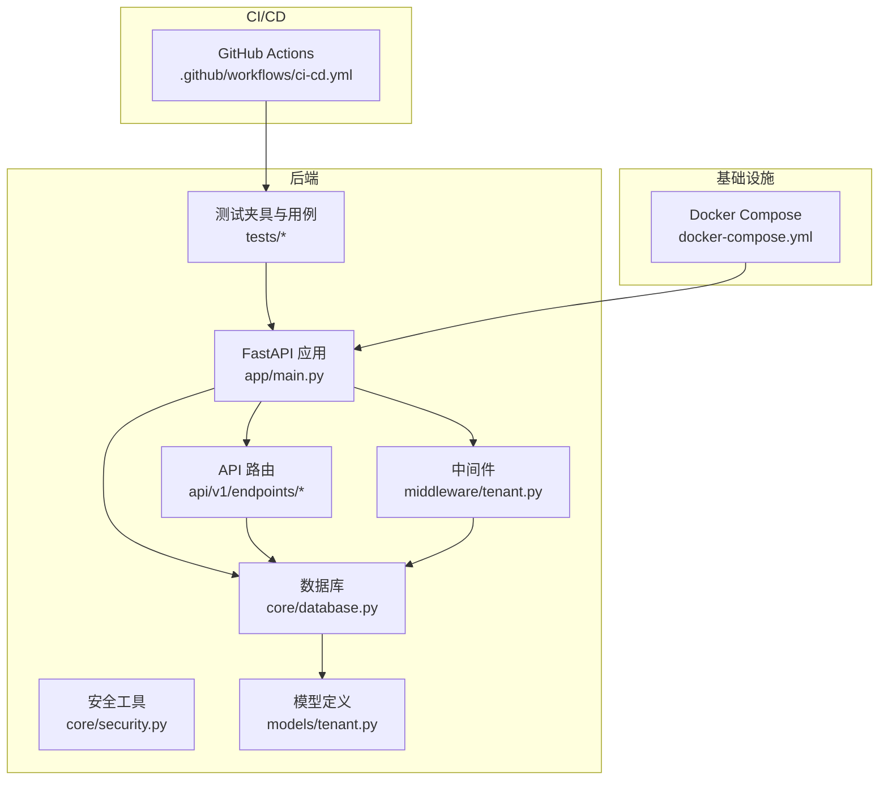
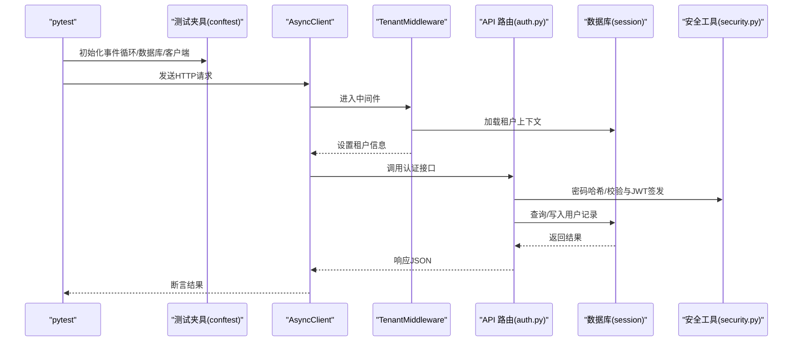
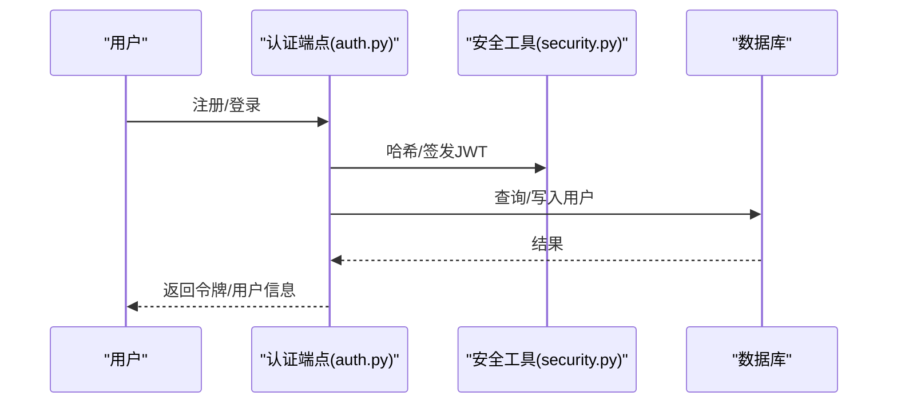
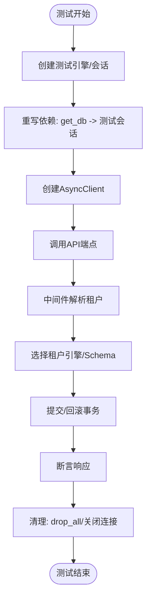
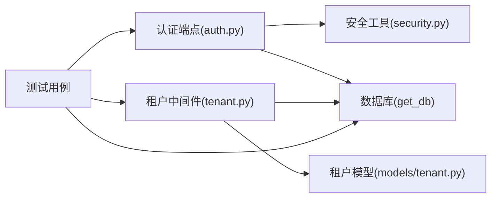

# 测试策略

<cite>
**本文引用的文件**
- [backend/tests/conftest.py](file://backend/tests/conftest.py)
- [backend/pyproject.toml](file://backend/pyproject.toml)
- [backend/app/main.py](file://backend/app/main.py)
- [backend/tests/test_auth.py](file://backend/tests/test_auth.py)
- [backend/tests/test_tenants.py](file://backend/tests/test_tenants.py)
- [backend/tests/test_family_tree.py](file://backend/tests/test_family_tree.py)
- [backend/tests/test_persons.py](file://backend/tests/test_persons.py)
- [.github/workflows/ci-cd.yml](file://.github/workflows/ci-cd.yml)
- [docker-compose.yml](file://docker-compose.yml)
- [scripts/test_init.py](file://scripts/test_init.py)
- [backend/app/api/v1/endpoints/auth.py](file://backend/app/api/v1/endpoints/auth.py)
- [backend/app/middleware/tenant.py](file://backend/app/middleware/tenant.py)
- [backend/app/models/tenant.py](file://backend/app/models/tenant.py)
- [backend/app/core/security.py](file://backend/app/core/security.py)
- [backend/app/core/database.py](file://backend/app/core/database.py)
</cite>

## 目录
1. [引言](#引言)
2. [项目结构](#项目结构)
3. [核心组件](#核心组件)
4. [架构总览](#架构总览)
5. [详细组件分析](#详细组件分析)
6. [依赖分析](#依赖分析)
7. [性能考虑](#性能考虑)
8. [故障排查指南](#故障排查指南)
9. [结论](#结论)
10. [附录](#附录)

## 引言
本测试策略面向多租户族谱管理系统，覆盖后端API测试、数据库测试、认证与授权测试、前端组件与UI测试、测试数据准备与环境隔离、测试覆盖率与质量门禁、自动化流水线与持续集成，以及性能与压力测试实施方案。目标是确保系统在多租户场景下的稳定性、一致性与可维护性。

## 项目结构
后端采用FastAPI + SQLAlchemy异步ORM，支持多租户（PostgreSQL使用schema隔离，SQLite使用独立数据库文件）。测试采用pytest + pytest-asyncio，配合httpx进行异步HTTP客户端测试；CI/CD通过GitHub Actions实现前后端分层流水线。

图表来源
- [backend/app/main.py:1-103](file://backend/app/main.py#L1-L103)
- [backend/app/middleware/tenant.py:1-142](file://backend/app/middleware/tenant.py#L1-L142)
- [backend/app/core/database.py:1-171](file://backend/app/core/database.py#L1-L171)
- [.github/workflows/ci-cd.yml:1-160](file://.github/workflows/ci-cd.yml#L1-L160)
- [docker-compose.yml:1-145](file://docker-compose.yml#L1-L145)

章节来源
- [backend/app/main.py:1-103](file://backend/app/main.py#L1-L103)
- [backend/app/middleware/tenant.py:1-142](file://backend/app/middleware/tenant.py#L1-L142)
- [backend/app/core/database.py:1-171](file://backend/app/core/database.py#L1-L171)
- [.github/workflows/ci-cd.yml:1-160](file://.github/workflows/ci-cd.yml#L1-L160)
- [docker-compose.yml:1-145](file://docker-compose.yml#L1-L145)

## 核心组件
- 测试框架与配置：pytest + pytest-asyncio + httpx；后端pytest配置位于pyproject.toml；测试夹具与会话管理位于conftest.py。
- 认证与安全：JWT访问/刷新令牌生成与校验、密码哈希与验证。
- 多租户中间件：从URL路径、子域名或请求头提取租户标识，加载租户并设置上下文。
- 数据库与模型：系统级公共表与租户级表结构，支持SQLite与PostgreSQL两种部署形态。
- 健康检查与服务状态：应用启动时连接外部服务（Neo4j、Redis、Meilisearch），健康端点返回可用性状态。

章节来源
- [backend/pyproject.toml:58-61](file://backend/pyproject.toml#L58-L61)
- [backend/tests/conftest.py:1-105](file://backend/tests/conftest.py#L1-L105)
- [backend/app/core/security.py:1-103](file://backend/app/core/security.py#L1-L103)
- [backend/app/middleware/tenant.py:1-142](file://backend/app/middleware/tenant.py#L1-L142)
- [backend/app/models/tenant.py:1-244](file://backend/app/models/tenant.py#L1-L244)
- [backend/app/core/database.py:1-171](file://backend/app/core/database.py#L1-L171)
- [backend/app/main.py:72-86](file://backend/app/main.py#L72-L86)

## 架构总览
下图展示测试执行链路：pytest调用conftest创建测试客户端与数据库会话，发送HTTP请求至FastAPI路由，中间件解析租户上下文，数据库层按租户选择引擎与会话，最终返回响应并断言结果。

图表来源
- [backend/tests/conftest.py:43-68](file://backend/tests/conftest.py#L43-L68)
- [backend/app/middleware/tenant.py:39-84](file://backend/app/middleware/tenant.py#L39-L84)
- [backend/app/api/v1/endpoints/auth.py:55-123](file://backend/app/api/v1/endpoints/auth.py#L55-L123)
- [backend/app/core/security.py:16-103](file://backend/app/core/security.py#L16-L103)
- [backend/app/core/database.py:124-151](file://backend/app/core/database.py#L124-L151)

## 详细组件分析

### 单元测试策略
- 目标：验证业务函数与模块内部逻辑正确性，如密码哈希、JWT签发/校验、租户上下文解析等。
- 实施要点：
  - 使用pytest标记异步测试，确保事件循环正确初始化。
  - 对纯函数与工具类（如密码哈希、JWT）编写独立用例，避免外部依赖。
  - 使用conftest提供的数据库会话与测试客户端，最小化副作用。
- 示例参考：
  - 密码哈希与校验：[backend/tests/test_auth.py:140-149](file://backend/tests/test_auth.py#L140-L149)
  - 租户中间件路径匹配与上下文设置：[backend/app/middleware/tenant.py:93-125](file://backend/app/middleware/tenant.py#L93-L125)

章节来源
- [backend/tests/conftest.py:35-53](file://backend/tests/conftest.py#L35-L53)
- [backend/tests/test_auth.py:140-149](file://backend/tests/test_auth.py#L140-L149)
- [backend/app/middleware/tenant.py:93-125](file://backend/app/middleware/tenant.py#L93-L125)

### 集成测试策略
- 目标：验证API端点与数据库、外部服务（Redis、Meilisearch、Neo4j）协同工作。
- 实施要点：
  - 使用GitHub Actions服务块启动PostgreSQL与Redis，容器间网络互通。
  - 在测试中注入DATABASE_URL与REDIS_URL，运行pytest并生成覆盖率报告。
  - 端到端覆盖认证流程（注册、登录、刷新）、租户列表与查询、族谱与人员API（当前用例为占位，需完善）。
- 示例参考：
  - 后端测试流水线与覆盖率上传：[ci-cd.yml:14-71](file://.github/workflows/ci-cd.yml#L14-L71)
  - 认证端点测试：[backend/tests/test_auth.py:12-149](file://backend/tests/test_auth.py#L12-L149)
  - 租户端点测试：[backend/tests/test_tenants.py:11-112](file://backend/tests/test_tenants.py#L11-L112)
  - 人员端点测试（占位）：[backend/tests/test_persons.py:28-124](file://backend/tests/test_persons.py#L28-L124)
  - 族谱端点测试（占位）：[backend/tests/test_family_tree.py:28-74](file://backend/tests/test_family_tree.py#L28-L74)

章节来源
- [.github/workflows/ci-cd.yml:14-71](file://.github/workflows/ci-cd.yml#L14-L71)
- [backend/tests/test_auth.py:12-149](file://backend/tests/test_auth.py#L12-L149)
- [backend/tests/test_tenants.py:11-112](file://backend/tests/test_tenants.py#L11-L112)
- [backend/tests/test_persons.py:28-124](file://backend/tests/test_persons.py#L28-L124)
- [backend/tests/test_family_tree.py:28-74](file://backend/tests/test_family_tree.py#L28-L74)

### 端到端测试策略
- 目标：模拟真实用户操作，覆盖从登录到查看族谱树、增删改查人员的完整流程。
- 实施要点：
  - 前端测试：在CI中执行lint、类型检查与构建，保证UI层质量。
  - 后端端到端：结合租户中间件与数据库，构造租户与人员数据，验证树形查询与统计接口。
  - 健康检查：通过/health端点确认外部服务可用性。
- 示例参考：
  - 前端测试流水线：[ci-cd.yml:72-102](file://.github/workflows/ci-cd.yml#L72-L102)
  - 健康检查端点：[backend/app/main.py:72-86](file://backend/app/main.py#L72-L86)

章节来源
- [.github/workflows/ci-cd.yml:72-102](file://.github/workflows/ci-cd.yml#L72-L102)
- [backend/app/main.py:72-86](file://backend/app/main.py#L72-L86)

### 认证与授权测试
- 覆盖范围：
  - 用户注册（重复邮箱处理）
  - 登录（错误密码、账户禁用）
  - 刷新令牌（无效令牌、过期）
  - 当前用户信息（鉴权依赖占位，需完善）
- 关键实现：
  - 注册/登录/刷新端点：[backend/app/api/v1/endpoints/auth.py:55-158](file://backend/app/api/v1/endpoints/auth.py#L55-L158)
  - 安全工具（哈希/签发/校验）：[backend/app/core/security.py:16-103](file://backend/app/core/security.py#L16-L103)
  - 测试用例：[backend/tests/test_auth.py:12-149](file://backend/tests/test_auth.py#L12-L149)

图表来源
- [backend/app/api/v1/endpoints/auth.py:55-158](file://backend/app/api/v1/endpoints/auth.py#L55-L158)
- [backend/app/core/security.py:16-103](file://backend/app/core/security.py#L16-L103)
- [backend/tests/test_auth.py:12-149](file://backend/tests/test_auth.py#L12-L149)

章节来源
- [backend/app/api/v1/endpoints/auth.py:55-158](file://backend/app/api/v1/endpoints/auth.py#L55-L158)
- [backend/app/core/security.py:16-103](file://backend/app/core/security.py#L16-L103)
- [backend/tests/test_auth.py:12-149](file://backend/tests/test_auth.py#L12-L149)

### 数据库测试与多租户隔离
- 测试数据库：
  - 本地开发：SQLite内存数据库（aiosqlite），测试结束后自动清理。
  - CI：PostgreSQL服务，通过环境变量注入DATABASE_URL。
- 夹具与会话：
  - conftest创建测试引擎与会话，重写依赖注入以替换真实数据库。
  - 通过依赖覆盖，确保所有API测试使用测试数据库。
- 多租户隔离：
  - SQLite：每个租户使用独立数据库文件（目录式组织）。
  - PostgreSQL：通过schema隔离，SET search_path切换租户schema。
- 示例参考：
  - 测试夹具与依赖覆盖：[backend/tests/conftest.py:43-68](file://backend/tests/conftest.py#L43-L68)
  - 数据库引擎与会话管理：[backend/app/core/database.py:58-171](file://backend/app/core/database.py#L58-L171)
  - 租户中间件上下文设置：[backend/app/middleware/tenant.py:76-83](file://backend/app/middleware/tenant.py#L76-L83)

图表来源
- [backend/tests/conftest.py:43-68](file://backend/tests/conftest.py#L43-L68)
- [backend/app/core/database.py:124-171](file://backend/app/core/database.py#L124-L171)
- [backend/app/middleware/tenant.py:39-84](file://backend/app/middleware/tenant.py#L39-L84)

章节来源
- [backend/tests/conftest.py:43-68](file://backend/tests/conftest.py#L43-L68)
- [backend/app/core/database.py:58-171](file://backend/app/core/database.py#L58-L171)
- [backend/app/middleware/tenant.py:39-84](file://backend/app/middleware/tenant.py#L39-L84)

### 前端组件与用户界面测试
- 流水线任务：
  - Lint与类型检查：确保代码风格与类型安全。
  - 构建：验证Next.js应用可正常打包。
- 建议补充：
  - 在本地或CI中增加组件测试（如基于React Testing Library或Playwright）以覆盖关键UI交互。
  - 针对多租户场景，增加子域名/租户切换的端到端验证。
- 示例参考：
  - 前端测试流水线：[ci-cd.yml:72-102](file://.github/workflows/ci-cd.yml#L72-L102)

章节来源
- [.github/workflows/ci-cd.yml:72-102](file://.github/workflows/ci-cd.yml#L72-L102)

### 测试数据准备与环境隔离
- 测试数据：
  - 使用fixtures快速创建管理员与普通用户，便于鉴权相关测试。
  - 通过脚本初始化SQLite测试数据（含用户、租户、人员关系），便于离线验证。
- 环境隔离：
  - 本地：docker-compose启动PostgreSQL、Neo4j、Redis、Meilisearch、MinIO与API/前端服务。
  - CI：PostgreSQL与Redis作为服务容器，测试通过后上传覆盖率。
- 示例参考：
  - 管理员/普通用户fixture：[backend/tests/conftest.py:71-105](file://backend/tests/conftest.py#L71-L105)
  - SQLite测试初始化脚本：[scripts/test_init.py:12-177](file://scripts/test_init.py#L12-L177)
  - 本地开发compose：[docker-compose.yml:1-145](file://docker-compose.yml#L1-145)

章节来源
- [backend/tests/conftest.py:71-105](file://backend/tests/conftest.py#L71-L105)
- [scripts/test_init.py:12-177](file://scripts/test_init.py#L12-L177)
- [docker-compose.yml:1-145](file://docker-compose.yml#L1-145)

### 测试覆盖率与质量门禁
- 覆盖率要求：
  - 后端：建议行覆盖率≥80%，分支覆盖率≥60%。
  - 前端：建议行覆盖率≥70%，分支覆盖率≥50%。
- 质量门禁：
  - CI中失败即阻断合并；覆盖率低于阈值时拒绝合并。
  - 代码风格与静态类型检查必须通过。
- 示例参考：
  - 覆盖率命令与上传：[ci-cd.yml:64-70](file://.github/workflows/ci-cd.yml#L64-L70)
  - pytest配置：[backend/pyproject.toml:58-61](file://backend/pyproject.toml#L58-L61)

章节来源
- [.github/workflows/ci-cd.yml:64-70](file://.github/workflows/ci-cd.yml#L64-L70)
- [backend/pyproject.toml:58-61](file://backend/pyproject.toml#L58-L61)

### 自动化测试流水线与持续集成
- 后端测试：
  - 启动PostgreSQL与Redis服务，安装开发依赖，运行pytest并生成XML覆盖率报告，上传Codecov。
- 前端测试：
  - 安装依赖，执行lint、类型检查与构建。
- 部署：
  - 仅在main分支推送触发，构建并推送API与Web镜像至Docker Hub。
- 示例参考：
  - 完整流水线：[ci-cd.yml:1-160](file://.github/workflows/ci-cd.yml#L1-L160)

章节来源
- [.github/workflows/ci-cd.yml:1-160](file://.github/workflows/ci-cd.yml#L1-L160)

### 性能测试与压力测试实施方案
- 场景设计：
  - 并发登录/刷新令牌、批量创建人员、大规模族谱树查询。
- 工具与指标：
  - 工具：Locust或pytest-benchmark。
  - 指标：P95/P99延迟、吞吐量、错误率、数据库连接池使用率。
- 执行策略：
  - 在CI中添加性能矩阵作业，针对不同负载并发数与数据规模运行。
  - 将结果与历史基线对比，异常即告警。
- 建议：
  - 预热：先执行冷启动与预热查询，再采集性能数据。
  - 外部服务：确保Redis、Meilisearch、Neo4j在压测期间稳定运行。

[本节为通用指导，不直接分析具体文件，故无“章节来源”]

## 依赖分析
- 组件耦合：
  - API路由依赖数据库会话与安全工具；中间件依赖数据库管理器加载租户。
  - 测试夹具通过依赖覆盖将真实数据库替换为测试数据库，降低耦合度。
- 外部依赖：
  - PostgreSQL/Redis/Meilisearch/Neo4j在运行时可选，健康检查与服务状态用于降级提示。
- 循环依赖：
  - 未发现直接循环导入；中间件与数据库管理器通过函数调用解耦。

图表来源
- [backend/app/api/v1/endpoints/auth.py:55-158](file://backend/app/api/v1/endpoints/auth.py#L55-L158)
- [backend/app/core/security.py:16-103](file://backend/app/core/security.py#L16-L103)
- [backend/app/core/database.py:124-171](file://backend/app/core/database.py#L124-L171)
- [backend/app/middleware/tenant.py:116-125](file://backend/app/middleware/tenant.py#L116-L125)
- [backend/app/models/tenant.py:61-132](file://backend/app/models/tenant.py#L61-L132)

章节来源
- [backend/app/api/v1/endpoints/auth.py:55-158](file://backend/app/api/v1/endpoints/auth.py#L55-L158)
- [backend/app/core/security.py:16-103](file://backend/app/core/security.py#L16-L103)
- [backend/app/core/database.py:124-171](file://backend/app/core/database.py#L124-L171)
- [backend/app/middleware/tenant.py:116-125](file://backend/app/middleware/tenant.py#L116-L125)
- [backend/app/models/tenant.py:61-132](file://backend/app/models/tenant.py#L61-L132)

## 性能考虑
- 数据库连接池：根据并发需求调整pool_size与max_overflow；SQLite在测试中使用单文件避免schema限制。
- 多租户查询：优先使用索引与合适的过滤条件；对大规模树查询考虑分页与缓存。
- 外部服务：Redis用于会话与缓存，Meilisearch用于全文检索，Neo4j用于图查询；确保其资源充足与健康状态。

[本节为通用指导，不直接分析具体文件，故无“章节来源”]

## 故障排查指南
- 常见问题：
  - 404租户：确认租户slug存在且激活；检查中间件是否正确解析子域名/路径/Header。
  - 401未认证：检查令牌类型与签名密钥；确认JWT算法与密钥配置一致。
  - 数据库连接失败：检查DATABASE_URL与容器连通性；确认PostgreSQL/SQLite文件权限。
- 排查步骤：
  - 查看/health端点输出，确认各外部服务可用性。
  - 在本地使用docker-compose快速复现问题。
  - 使用scripts/test_init.py快速搭建最小化测试数据集。
- 示例参考：
  - 租户中间件错误响应：[backend/app/middleware/tenant.py:52-74](file://backend/app/middleware/tenant.py#L52-L74)
  - 健康检查端点：[backend/app/main.py:72-86](file://backend/app/main.py#L72-L86)
  - SQLite测试初始化：[scripts/test_init.py:12-177](file://scripts/test_init.py#L12-L177)

章节来源
- [backend/app/middleware/tenant.py:52-74](file://backend/app/middleware/tenant.py#L52-L74)
- [backend/app/main.py:72-86](file://backend/app/main.py#L72-L86)
- [scripts/test_init.py:12-177](file://scripts/test_init.py#L12-L177)

## 结论
本测试策略以pytest为核心，结合多租户中间件与数据库抽象，实现了从单元到端到端的全栈测试覆盖。通过CI流水线与覆盖率门禁，保障代码质量与交付效率。建议后续完善人员与族谱API的测试用例，并引入前端组件测试与性能压测，持续提升系统稳定性与用户体验。

## 附录
- 快速开始（本地测试）：
  - 启动服务：docker-compose up -d
  - 运行后端测试：cd backend && python -m pytest tests/ -v
  - 运行前端测试：cd frontend && npm run lint && npm run type-check && npm run build
- 健康检查：
  - 访问/health端点，确认数据库、Neo4j、Redis、搜索服务状态。

[本节为通用指导，不直接分析具体文件，故无“章节来源”]