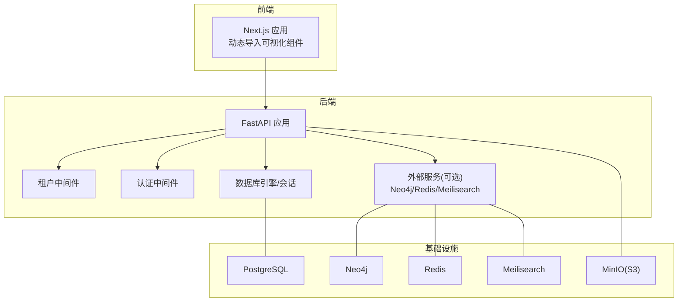
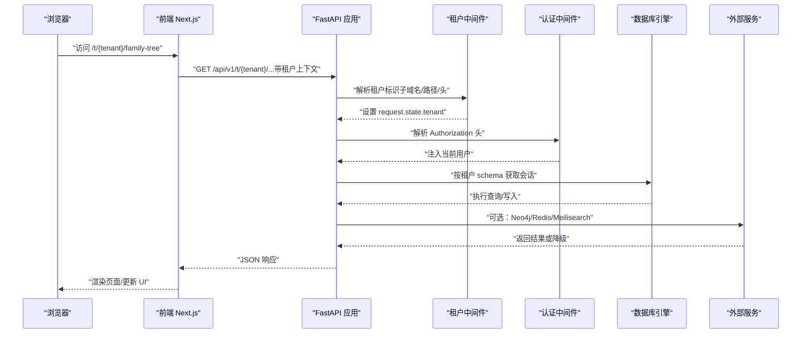
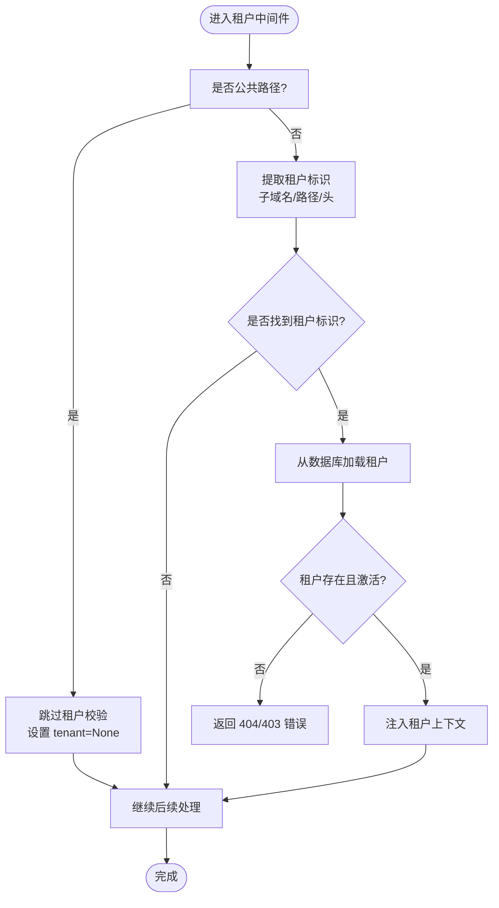
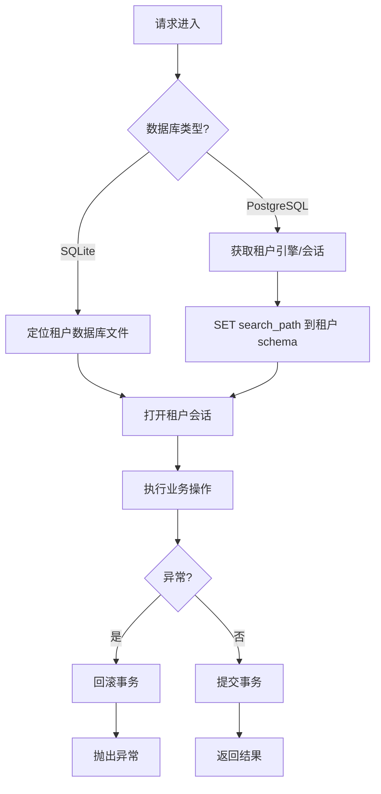
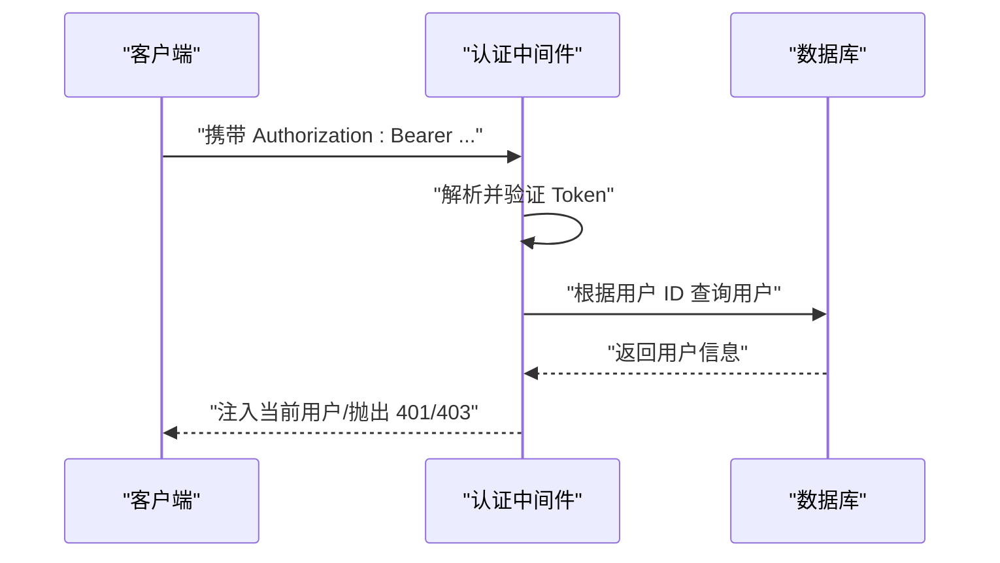
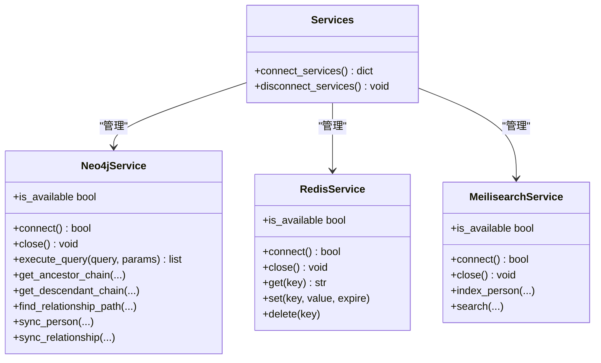
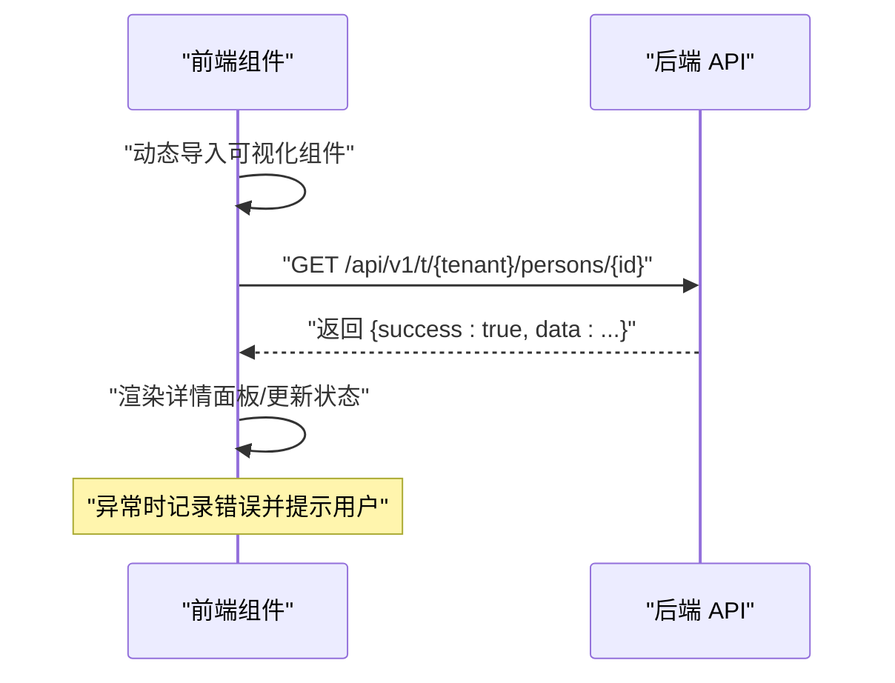
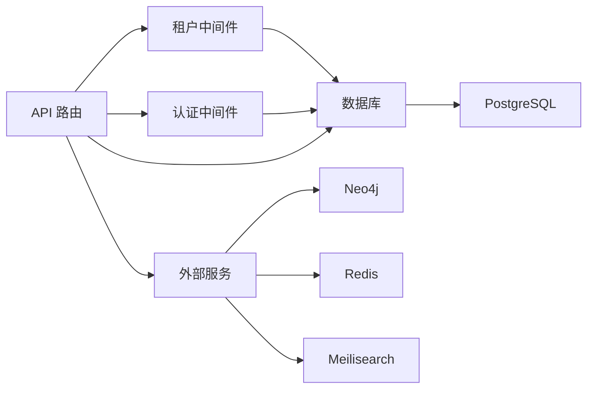

# 调试与故障排除

<cite>
**本文引用的文件**
- [backend/app/main.py](file://backend/app/main.py)
- [backend/app/core/config.py](file://backend/app/core/config.py)
- [backend/app/core/database.py](file://backend/app/core/database.py)
- [backend/app/middleware/tenant.py](file://backend/app/middleware/tenant.py)
- [backend/app/middleware/auth.py](file://backend/app/middleware/auth.py)
- [backend/app/models/tenant.py](file://backend/app/models/tenant.py)
- [backend/app/api/v1/endpoints/tenants.py](file://backend/app/api/v1/endpoints/tenants.py)
- [backend/app/api/v1/endpoints/auth.py](file://backend/app/api/v1/endpoints/auth.py)
- [backend/app/core/services.py](file://backend/app/core/services.py)
- [backend/docker-compose.yml](file://backend/docker-compose.yml)
- [backend/tests/test_tenants.py](file://backend/tests/test_tenants.py)
- [scripts/create_tenant.py](file://scripts/create_tenant.py)
- [frontend/app/layout.tsx](file://frontend/app/layout.tsx)
- [frontend/components/family-tree/FamilyTreePage.tsx](file://frontend/components/family-tree/FamilyTreePage.tsx)
</cite>

## 目录
1. [引言](#引言)
2. [项目结构](#项目结构)
3. [核心组件](#核心组件)
4. [架构总览](#架构总览)
5. [详细组件分析](#详细组件分析)
6. [依赖分析](#依赖分析)
7. [性能考虑](#性能考虑)
8. [故障排除指南](#故障排除指南)
9. [结论](#结论)
10. [附录](#附录)

## 引言
本指南面向多租户族谱管理系统（后端基于 FastAPI，前端基于 Next.js）的开发与运维团队，聚焦于开发与生产环境中的调试与故障排除。内容涵盖数据库连接问题、API 调用异常、前端渲染错误、日志与监控配置、调试工具使用、多租户特有问题排查、性能分析与优化、错误处理最佳实践以及生产应急流程。

## 项目结构
系统采用前后端分离与容器化部署：
- 后端：FastAPI 应用，通过中间件实现多租户识别与上下文注入；数据库层支持 SQLite/PostgreSQL，并对 PostgreSQL 实现 schema 级多租户隔离；可选外部服务（Neo4j、Redis、Meilisearch）在启动时按需连接。
- 前端：Next.js 应用，动态导入可视化组件以避免 SSR 问题；页面通过 /api/v1/t/{tenant} 路由访问租户数据。
- 容器编排：docker-compose 提供数据库、图数据库、缓存、搜索引擎与对象存储等基础设施。

图表来源
- [backend/app/main.py:45-91](file://backend/app/main.py#L45-L91)
- [backend/app/middleware/tenant.py:15-84](file://backend/app/middleware/tenant.py#L15-L84)
- [backend/app/middleware/auth.py:15-57](file://backend/app/middleware/auth.py#L15-L57)
- [backend/app/core/database.py:24-121](file://backend/app/core/database.py#L24-L121)
- [backend/app/core/services.py:262-284](file://backend/app/core/services.py#L262-L284)
- [backend/docker-compose.yml:1-145](file://backend/docker-compose.yml#L1-L145)

章节来源
- [backend/app/main.py:17-42](file://backend/app/main.py#L17-L42)
- [backend/docker-compose.yml:1-145](file://backend/docker-compose.yml#L1-L145)

## 核心组件
- 应用生命周期与健康检查：应用启动时初始化默认数据库引擎、连接可选外部服务，并提供 /health 接口返回服务可用性状态。
- 配置中心：集中管理数据库、外部服务、CORS、JWT、文件存储等配置项。
- 数据库管理：支持 SQLite/PostgreSQL，默认引擎与租户引擎分离；PostgreSQL 使用 schema 隔离租户数据；SQLite 模式下按租户生成独立数据库文件。
- 租户中间件：从子域名、路径前缀或请求头提取租户标识，校验租户存在性与激活状态，注入请求上下文。
- 认证中间件：从 Authorization 头解析 Bearer Token，验证并加载用户信息。
- 外部服务：Neo4j（图查询）、Redis（缓存）、Meilisearch（全文检索），均提供可选连接与降级策略。
- 前端布局与可视化：动态导入可视化组件，避免 SSR 渲染问题；页面通过租户路由访问后端 API。

章节来源
- [backend/app/main.py:17-42](file://backend/app/main.py#L17-L42)
- [backend/app/core/config.py:11-89](file://backend/app/core/config.py#L11-L89)
- [backend/app/core/database.py:24-121](file://backend/app/core/database.py#L24-L121)
- [backend/app/middleware/tenant.py:15-84](file://backend/app/middleware/tenant.py#L15-L84)
- [backend/app/middleware/auth.py:15-57](file://backend/app/middleware/auth.py#L15-L57)
- [backend/app/core/services.py:262-284](file://backend/app/core/services.py#L262-L284)
- [frontend/app/layout.tsx:12-24](file://frontend/app/layout.tsx#L12-L24)
- [frontend/components/family-tree/FamilyTreePage.tsx:11-22](file://frontend/components/family-tree/FamilyTreePage.tsx#L11-L22)

## 架构总览
下图展示从浏览器到后端 API 的典型请求链路，以及多租户上下文如何贯穿请求生命周期。

图表来源
- [backend/app/middleware/tenant.py:39-84](file://backend/app/middleware/tenant.py#L39-L84)
- [backend/app/middleware/auth.py:15-57](file://backend/app/middleware/auth.py#L15-L57)
- [backend/app/core/database.py:136-171](file://backend/app/core/database.py#L136-L171)
- [backend/app/core/services.py:268-277](file://backend/app/core/services.py#L268-L277)
- [frontend/components/family-tree/FamilyTreePage.tsx:51-61](file://frontend/components/family-tree/FamilyTreePage.tsx#L51-L61)

## 详细组件分析

### 组件A：租户中间件与多租户上下文
- 功能要点
  - 支持三种租户标识方式：子域名、URL 路径前缀、请求头。
  - 对公共路径（如 /api/v1/auth、/api/v1/tenants、/health）跳过租户校验。
  - 加载租户元数据并注入 request.state.tenant、request.state.tenant_schema、request.state.tenant_neo4j。
  - 若租户不存在或未激活，返回结构化错误响应。
- 典型问题
  - 租户未创建或 slug 错误导致 404。
  - 租户被禁用导致 403。
  - 子域名/路径/头不匹配导致无法识别租户。
- 调试建议
  - 在中间件入口打印请求路径与提取的租户标识。
  - 校验数据库中 Tenant 表的 slug、is_active 字段。
  - 确认 /health 返回的数据库/外部服务状态。

图表来源
- [backend/app/middleware/tenant.py:39-84](file://backend/app/middleware/tenant.py#L39-L84)
- [backend/app/middleware/tenant.py:116-125](file://backend/app/middleware/tenant.py#L116-L125)

章节来源
- [backend/app/middleware/tenant.py:15-142](file://backend/app/middleware/tenant.py#L15-L142)

### 组件B：数据库引擎与租户会话
- 功能要点
  - 默认引擎用于系统数据库；租户引擎按 schema 或 SQLite 文件区分。
  - PostgreSQL 使用 SET search_path 切换 schema；SQLite 模式下按租户生成独立数据库文件。
  - 提供 get_tenant_db/tenant_session 上下文管理器，自动提交/回滚事务。
- 典型问题
  - PostgreSQL 未创建 schema 导致查询失败。
  - SQLite 多租户文件未生成或权限不足。
  - search_path 设置失败或不受支持。
- 调试建议
  - 在启动日志中确认数据库类型与连接参数。
  - 手动执行 schema 创建脚本或使用脚本工具初始化租户表结构。
  - 检查数据库连接池大小与超量配置。

图表来源
- [backend/app/core/database.py:136-171](file://backend/app/core/database.py#L136-L171)
- [scripts/create_tenant.py:18-44](file://scripts/create_tenant.py#L18-L44)
- [scripts/create_tenant.py:69-206](file://scripts/create_tenant.py#L69-L206)

章节来源
- [backend/app/core/database.py:24-171](file://backend/app/core/database.py#L24-L171)
- [scripts/create_tenant.py:18-282](file://scripts/create_tenant.py#L18-L282)

### 组件C：认证中间件与用户依赖
- 功能要点
  - 从 Authorization 头解析 Bearer Token，验证并加载用户。
  - 提供 require_auth、require_superuser、permission_checker 等依赖。
- 典型问题
  - 缺少 Authorization 头或格式错误。
  - Token 过期或算法不匹配。
  - 用户不存在或非活动状态。
- 调试建议
  - 在 get_current_user 中增加日志输出 token 与解析结果。
  - 校验 JWT 密钥、算法与过期时间配置。
  - 使用 /api/v1/auth/login 获取有效令牌进行测试。

图表来源
- [backend/app/middleware/auth.py:15-57](file://backend/app/middleware/auth.py#L15-L57)
- [backend/app/api/v1/endpoints/auth.py:89-123](file://backend/app/api/v1/endpoints/auth.py#L89-L123)

章节来源
- [backend/app/middleware/auth.py:15-88](file://backend/app/middleware/auth.py#L15-L88)
- [backend/app/api/v1/endpoints/auth.py:55-123](file://backend/app/api/v1/endpoints/auth.py#L55-L123)

### 组件D：外部服务（Neo4j/Redis/Meilisearch）
- 功能要点
  - 启动时尝试连接外部服务，失败时降级为 SQL/本地缓存/LIKE 搜索。
  - 提供统一的 is_available 状态与连接/关闭方法。
- 典型问题
  - 服务不可达或凭据错误。
  - 连接超时或驱动版本不兼容。
- 调试建议
  - 在启动日志中观察服务连接状态。
  - 使用 /health 检查各服务可用性。
  - 逐步启用外部服务功能，定位具体模块问题。

图表来源
- [backend/app/core/services.py:9-284](file://backend/app/core/services.py#L9-L284)

章节来源
- [backend/app/core/services.py:268-284](file://backend/app/core/services.py#L268-L284)

### 组件E：前端渲染与 API 调用
- 功能要点
  - 使用动态导入避免 SSR 渲染可视化组件。
  - 通过 /api/v1/t/{tenant}/... 路由访问租户数据。
  - 族谱页面支持搜索、视图切换与节点详情面板。
- 典型问题
  - 动态导入失败或 SSR 报错。
  - 租户路由参数缺失导致 404。
  - API 返回结构不一致导致前端解构报错。
- 调试建议
  - 在浏览器控制台查看动态导入错误与网络请求。
  - 使用浏览器 Network 面板检查 /api/v1/t/{tenant}/... 请求状态码与响应体。
  - 在前端组件中增加 try/catch 并记录错误堆栈。

图表来源
- [frontend/components/family-tree/FamilyTreePage.tsx:11-22](file://frontend/components/family-tree/FamilyTreePage.tsx#L11-L22)
- [frontend/components/family-tree/FamilyTreePage.tsx:51-61](file://frontend/components/family-tree/FamilyTreePage.tsx#L51-L61)

章节来源
- [frontend/components/family-tree/FamilyTreePage.tsx:1-226](file://frontend/components/family-tree/FamilyTreePage.tsx#L1-L226)

## 依赖分析
- 组件耦合
  - 租户中间件依赖数据库读取 Tenant；认证中间件依赖数据库读取 User；API 层依赖中间件提供的上下文。
  - 外部服务为可插拔模块，通过统一接口管理，降低耦合度。
- 外部依赖
  - 数据库：PostgreSQL/SQLite；连接池参数影响并发与稳定性。
  - 图数据库：Neo4j；集群/企业版特性需额外配置。
  - 缓存与搜索：Redis/Meilisearch；需关注网络连通性与权限。
- 循环依赖
  - 当前结构未发现循环导入；注意模型与中间件之间的导入顺序。

图表来源
- [backend/app/middleware/tenant.py:11-125](file://backend/app/middleware/tenant.py#L11-L125)
- [backend/app/middleware/auth.py:10-44](file://backend/app/middleware/auth.py#L10-L44)
- [backend/app/core/database.py:120-171](file://backend/app/core/database.py#L120-L171)
- [backend/app/core/services.py:262-284](file://backend/app/core/services.py#L262-L284)

章节来源
- [backend/app/middleware/tenant.py:15-142](file://backend/app/middleware/tenant.py#L15-L142)
- [backend/app/middleware/auth.py:15-88](file://backend/app/middleware/auth.py#L15-L88)
- [backend/app/core/database.py:24-171](file://backend/app/core/database.py#L24-L171)
- [backend/app/core/services.py:262-284](file://backend/app/core/services.py#L262-L284)

## 性能考虑
- 数据库
  - PostgreSQL 连接池参数（pool_size/max_overflow）需结合并发与硬件资源调整；SQLite 不支持连接池，建议通过独立文件与读写分离优化。
  - 在租户引擎上执行查询时，确保索引覆盖常用过滤字段（如 slug、id）。
- 外部服务
  - Redis 缓存命中率低时，优先检查键空间与过期策略；Meilisearch 索引构建与增量同步需规划任务调度。
- API
  - 分页与排序参数限制（最小/最大页大小）防止大查询；对列表接口增加总数统计与分页元信息。
- 前端
  - 动态导入与懒加载减少首屏体积；可视化组件应限制渲染节点数量与层级深度。

## 故障排除指南

### 一、数据库连接问题
- 症状
  - 启动时报数据库连接失败；/health 显示数据库 unavailable。
- 诊断步骤
  - 检查 DATABASE_URL 是否正确（SQLite/PostgreSQL）。
  - 确认 docker-compose 中数据库容器已健康运行。
  - 对 PostgreSQL：确认 schema 已创建；对 SQLite：确认租户数据库文件存在。
- 解决方案
  - 使用脚本初始化租户 schema 与表结构。
  - 调整连接池参数与超时设置。
  - 在调试模式下开启 SQLAlchemy echo 输出 SQL。

章节来源
- [backend/app/core/config.py:34-51](file://backend/app/core/config.py#L34-L51)
- [backend/app/core/database.py:33-96](file://backend/app/core/database.py#L33-L96)
- [scripts/create_tenant.py:18-206](file://scripts/create_tenant.py#L18-L206)
- [backend/docker-compose.yml:4-21](file://backend/docker-compose.yml#L4-L21)

### 二、API 调用异常
- 症状
  - /api/v1/tenants 列表为空；/api/v1/tenants/{slug} 返回 404；/api/v1/auth 登录失败。
- 诊断步骤
  - 使用 Postman 或 curl 直接调用 API，观察状态码与响应体。
  - 检查租户是否创建且 is_active=true；确认 slug 正确。
  - 校验 JWT 密钥与算法配置；确认 Authorization 头格式。
- 解决方案
  - 通过 /api/v1/tenants 创建租户并初始化 schema。
  - 使用 /api/v1/auth/login 获取令牌，再在后续请求中携带 Authorization: Bearer。
  - 在中间件与依赖函数中增加日志输出，定位解析失败点。

章节来源
- [backend/app/api/v1/endpoints/tenants.py:45-115](file://backend/app/api/v1/endpoints/tenants.py#L45-L115)
- [backend/app/api/v1/endpoints/auth.py:89-123](file://backend/app/api/v1/endpoints/auth.py#L89-L123)
- [backend/app/middleware/tenant.py:40-84](file://backend/app/middleware/tenant.py#L40-L84)
- [backend/app/middleware/auth.py:15-57](file://backend/app/middleware/auth.py#L15-L57)

### 三、前端渲染错误
- 症状
  - 页面空白或报错“动态导入失败”；族谱树不显示。
- 诊断步骤
  - 浏览器控制台查看动态导入错误与网络请求。
  - 确认 API 响应结构与前端预期一致。
  - 检查租户路由参数是否传入（tenantSlug）。
- 解决方案
  - 确保动态导入组件的 SSR 禁用与加载占位符正常工作。
  - 在 fetchPersonDetails 中增加 try/catch 并提示用户重试。
  - 校验前端环境变量 NEXT_PUBLIC_API_URL 与后端 API 前缀一致。

章节来源
- [frontend/components/family-tree/FamilyTreePage.tsx:11-22](file://frontend/components/family-tree/FamilyTreePage.tsx#L11-L22)
- [frontend/components/family-tree/FamilyTreePage.tsx:51-61](file://frontend/components/family-tree/FamilyTreePage.tsx#L51-L61)
- [frontend/app/layout.tsx:12-24](file://frontend/app/layout.tsx#L12-L24)

### 四、日志记录与监控配置
- 日志
  - FastAPI 应用在启动时打印服务状态；可启用 settings.debug 以输出 SQL。
  - 在关键中间件与依赖函数中增加结构化日志（请求路径、租户标识、用户 ID）。
- 监控
  - 使用 /health 接口作为存活探针；结合 docker-compose 健康检查。
  - 外部服务连接状态在启动日志中可见；可在应用内暴露指标端点（建议）。

章节来源
- [backend/app/main.py:25-42](file://backend/app/main.py#L25-L42)
- [backend/app/core/config.py:24-25](file://backend/app/core/config.py#L24-L25)

### 五、调试工具使用
- 浏览器开发者工具
  - Network 面板：检查 API 请求/响应、状态码、请求头（Authorization）。
  - Console 面板：查看动态导入错误与运行时异常。
- Python 调试器
  - 在中间件与依赖函数中设置断点，检查 request.state 与用户解析结果。
  - 使用 unittest 或 pytest 单测辅助定位逻辑分支。
- Postman API 测试
  - 先登录获取令牌，再携带 Authorization 头调用受保护接口。
  - 使用集合运行多接口测试，对比响应时间与成功率。

章节来源
- [backend/app/middleware/tenant.py:39-84](file://backend/app/middleware/tenant.py#L39-L84)
- [backend/app/middleware/auth.py:15-57](file://backend/app/middleware/auth.py#L15-L57)
- [backend/tests/test_tenants.py:11-112](file://backend/tests/test_tenants.py#L11-L112)

### 六、多租户环境特有问题排查
- 症状
  - 子域名或路径访问返回 404；租户激活状态导致 403。
- 诊断步骤
  - 按租户中间件的识别顺序（子域名/路径/头）逐一验证。
  - 校验 Tenant 表的 slug、is_active、schema_name、neo4j_database 字段。
- 解决方案
  - 在前端或网关正确配置子域名映射。
  - 使用脚本创建租户并初始化 schema 与表结构。

章节来源
- [backend/app/middleware/tenant.py:93-125](file://backend/app/middleware/tenant.py#L93-L125)
- [scripts/create_tenant.py:231-282](file://scripts/create_tenant.py#L231-L282)

### 七、错误处理与异常捕获最佳实践
- 后端
  - 在数据库依赖中统一 try/except 并回滚事务；对外返回结构化错误。
  - 在中间件与依赖中对空值与无效输入进行显式判断与错误响应。
- 前端
  - 在 fetch 调用中包裹 try/catch，记录错误并提示用户。
  - 对必填参数（如 tenantSlug）进行前置校验。

章节来源
- [backend/app/core/database.py:124-133](file://backend/app/core/database.py#L124-L133)
- [backend/app/middleware/tenant.py:52-74](file://backend/app/middleware/tenant.py#L52-L74)
- [frontend/components/family-tree/FamilyTreePage.tsx:58-61](file://frontend/components/family-tree/FamilyTreePage.tsx#L58-L61)

### 八、生产环境应急处理流程
- 快速评估
  - 通过 /health 快速判断数据库与外部服务状态。
  - 检查容器健康检查与日志输出。
- 临时措施
  - 关闭可选外部服务（Neo4j/Redis/Meilisearch）以保证核心功能可用。
  - 降低数据库连接池或暂停高负载任务。
- 恢复步骤
  - 修复连接参数与凭据后重启对应容器。
  - 重新初始化租户 schema 与表结构（如必要）。
  - 回归测试关键 API 与前端页面。

章节来源
- [backend/app/main.py:72-86](file://backend/app/main.py#L72-L86)
- [backend/docker-compose.yml:16-87](file://backend/docker-compose.yml#L16-L87)
- [scripts/create_tenant.py:18-206](file://scripts/create_tenant.py#L18-L206)

## 结论
本指南提供了从数据库、API、前端到外部服务的全链路调试与故障排除方法。通过明确的中间件职责、结构化的错误处理与可选外部服务的降级策略，系统在开发与生产环境中均具备良好的可观测性与可维护性。建议在日常开发中持续完善日志与监控，规范测试流程，并建立标准化的应急响应机制。

## 附录
- 常用命令
  - 启动开发环境：docker-compose up
  - 创建租户：python -m scripts.create_tenant <slug>
  - 运行测试：pytest -v
- 关键端点
  - /health：健康检查
  - /api/v1/tenants：租户列表与详情
  - /api/v1/auth/login：登录获取令牌
  - /api/v1/t/{tenant}/...：租户数据接口（前端路由）