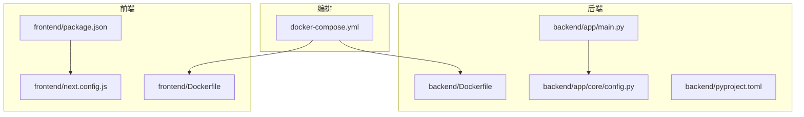
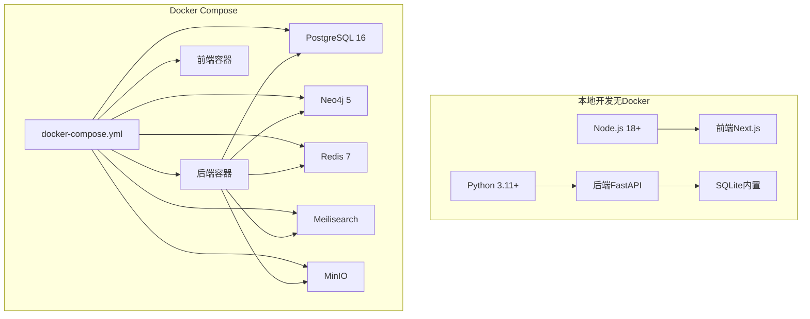
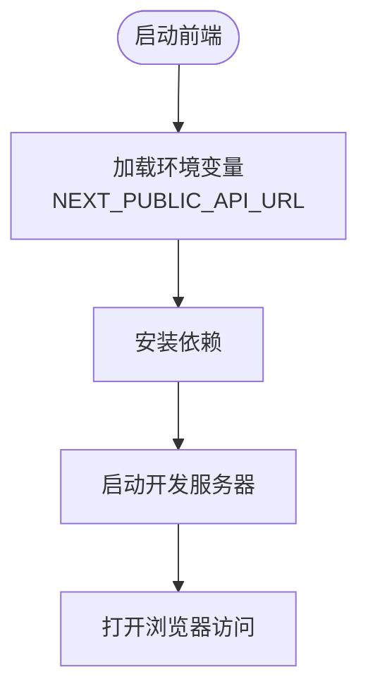
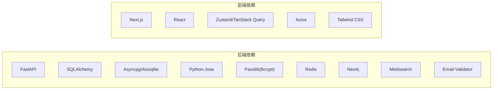

# 快速开始

<cite>
**本文引用的文件**
- [README.md](file://README.md)
- [docs/LOCAL_DEVELOPMENT.md](file://docs/LOCAL_DEVELOPMENT.md)
- [docker-compose.yml](file://docker-compose.yml)
- [backend/app/main.py](file://backend/app/main.py)
- [backend/app/core/config.py](file://backend/app/core/config.py)
- [backend/pyproject.toml](file://backend/pyproject.toml)
- [backend/Dockerfile](file://backend/Dockerfile)
- [frontend/package.json](file://frontend/package.json)
- [frontend/Dockerfile](file://frontend/Dockerfile)
- [frontend/next.config.js](file://frontend/next.config.js)
- [setup.ps1](file://setup.ps1)
- [start-dev.ps1](file://start-dev.ps1)
</cite>

## 目录
1. [简介](#简介)
2. [项目结构](#项目结构)
3. [核心组件](#核心组件)
4. [架构总览](#架构总览)
5. [详细组件分析](#详细组件分析)
6. [依赖分析](#依赖分析)
7. [性能考虑](#性能考虑)
8. [故障排除指南](#故障排除指南)
9. [结论](#结论)
10. [附录](#附录)

## 简介
本指南面向首次接触“族谱云”多租户族谱管理系统的开发者，帮助你在30分钟内完成本地开发环境或Docker Compose方式的完整启动，访问前端界面、后端API与API文档。项目采用前后端分离架构：后端基于FastAPI，前端基于Next.js，支持多租户与可选的图数据库、缓存、搜索与对象存储等服务。

## 项目结构
项目采用分层组织方式，主要包含：
- backend：FastAPI后端，包含API路由、核心配置、中间件、模型、服务与数据库迁移
- frontend：Next.js前端应用，包含页面、组件与样式
- docker：Compose编排与各服务初始化脚本
- docs：架构与本地开发指南
- scripts：系统初始化与数据同步脚本



图表来源
- [docker-compose.yml:1-145](file://docker-compose.yml#L1-L145)
- [backend/app/main.py:1-103](file://backend/app/main.py#L1-L103)
- [backend/app/core/config.py:1-89](file://backend/app/core/config.py#L1-L89)
- [backend/Dockerfile:1-24](file://backend/Dockerfile#L1-L24)
- [frontend/Dockerfile:1-51](file://frontend/Dockerfile#L1-L51)
- [frontend/package.json:1-45](file://frontend/package.json#L1-L45)
- [frontend/next.config.js:1-23](file://frontend/next.config.js#L1-L23)

章节来源
- [README.md:5-27](file://README.md#L5-L27)
- [docker-compose.yml:1-145](file://docker-compose.yml#L1-L145)

## 核心组件
- 后端服务（FastAPI）
  - 应用入口与生命周期管理：负责启动数据库引擎、连接可选服务（Neo4j、Redis、Meilisearch）、注册CORS与租户中间件、挂载API路由与健康检查端点
  - 配置中心：集中管理数据库、缓存、搜索、存储、JWT、CORS等配置项
- 前端服务（Next.js）
  - 开发与构建配置：定义开发端口、环境变量暴露、图片优化策略
  - 依赖与脚本：管理React、Next、Tailwind、状态管理与查询等依赖
- 编排与可选服务
  - Docker Compose：统一编排PostgreSQL、Neo4j、Redis、Meilisearch、MinIO与后端/前端容器
  - 可选服务：Neo4j（图查询）、Redis（缓存）、Meilisearch（全文搜索）、MinIO（对象存储）

章节来源
- [backend/app/main.py:17-87](file://backend/app/main.py#L17-L87)
- [backend/app/core/config.py:11-89](file://backend/app/core/config.py#L11-L89)
- [frontend/package.json:1-45](file://frontend/package.json#L1-L45)
- [frontend/next.config.js:1-23](file://frontend/next.config.js#L1-L23)
- [docker-compose.yml:1-145](file://docker-compose.yml#L1-L145)

## 架构总览
下图展示了本地开发与Docker Compose两种启动方式的系统交互关系：



图表来源
- [README.md:29-68](file://README.md#L29-L68)
- [docker-compose.yml:1-145](file://docker-compose.yml#L1-L145)
- [backend/app/core/config.py:34-67](file://backend/app/core/config.py#L34-L67)

## 详细组件分析

### 本地开发环境（Windows/macOS/Linux）
目标：仅需Python 3.11+与Node.js 18+即可启动，使用SQLite作为默认数据库，无需额外安装数据库。

- 环境要求
  - Python 3.11+（后端依赖声明）
  - Node.js 18+（前端依赖声明）
  - SQLite（内置，无需安装）

- Windows启动流程
  1) 安装依赖
     - 运行安装脚本，自动创建并激活Python虚拟环境，安装后端开发依赖；安装前端依赖；生成前端环境配置
     - 预期结果：后端与前端依赖安装完成，生成配置文件
  2) 启动服务
     - 后端：在新控制台激活虚拟环境并启动FastAPI（端口8010）
     - 前端：在新控制台启动Next.js开发服务器（端口3010）
     - 预期结果：浏览器访问前端与后端API、API文档均可用

- macOS/Linux启动流程
  - 使用脚本安装依赖并启动，或手动执行后端与前端启动命令
  - 预期结果：与Windows一致

- 关键配置与端口
  - 后端端口：8010
  - 前端端口：3010
  - API文档：/api/v1/docs
  - SQLite：默认使用本地文件数据库

章节来源
- [README.md:29-49](file://README.md#L29-L49)
- [docs/LOCAL_DEVELOPMENT.md:14-83](file://docs/LOCAL_DEVELOPMENT.md#L14-L83)
- [setup.ps1:1-88](file://setup.ps1#L1-L88)
- [start-dev.ps1:1-94](file://start-dev.ps1#L1-L94)
- [backend/pyproject.toml:6-25](file://backend/pyproject.toml#L6-L25)
- [frontend/package.json:12-31](file://frontend/package.json#L12-L31)

### Docker Compose方式
目标：通过单条命令启动完整开发环境，包含数据库、图数据库、缓存、搜索与对象存储。

- 启动步骤
  1) 开发环境
     - 使用默认compose文件启动所有服务
     - 预期结果：后端API与前端均可访问，其他服务按需可用
  2) 生产环境
     - 复制生产环境配置文件并启动
     - 预期结果：服务以生产配置运行

- 服务与端口
  - 后端API：8010
  - 前端：3010
  - PostgreSQL：5432
  - Neo4j：7474/7687
  - Redis：6379
  - Meilisearch：7700
  - MinIO：9000/9001

章节来源
- [README.md:51-60](file://README.md#L51-L60)
- [docker-compose.yml:1-145](file://docker-compose.yml#L1-L145)

### 后端服务（FastAPI）
- 应用入口与生命周期
  - 初始化默认数据库引擎
  - 连接可选服务（Neo4j、Redis、Meilisearch），失败时仍可运行
  - 注册CORS与租户中间件
  - 挂载API路由与健康检查端点
- 配置中心
  - 集中管理数据库、缓存、搜索、存储、JWT、CORS、租户配额等参数
  - 默认使用SQLite，可切换至PostgreSQL

```mermaid
sequenceDiagram
participant Dev as "开发者"
participant Uvicorn as "Uvicorn"
participant App as "FastAPI应用"
participant Cfg as "配置中心"
participant DB as "数据库"
participant Opt as "可选服务"
Dev->>Uvicorn : 启动后端
Uvicorn->>App : 加载应用入口
App->>Cfg : 读取配置
App->>DB : 初始化默认引擎
App->>Opt : 连接可选服务
App-->>Dev : 提供API与健康检查
```

图表来源
- [backend/app/main.py:17-87](file://backend/app/main.py#L17-L87)
- [backend/app/core/config.py:34-67](file://backend/app/core/config.py#L34-L67)

章节来源
- [backend/app/main.py:17-87](file://backend/app/main.py#L17-L87)
- [backend/app/core/config.py:11-89](file://backend/app/core/config.py#L11-L89)

### 前端服务（Next.js）
- 开发与构建
  - 使用开发脚本启动Next.js
  - 构建产物用于生产镜像
- 环境变量
  - 暴露API地址给浏览器端调用
  - 默认指向本地后端API



图表来源
- [frontend/next.config.js:16-19](file://frontend/next.config.js#L16-L19)
- [frontend/package.json:5-11](file://frontend/package.json#L5-L11)
- [frontend/Dockerfile:1-51](file://frontend/Dockerfile#L1-L51)

章节来源
- [frontend/package.json:5-11](file://frontend/package.json#L5-L11)
- [frontend/next.config.js:16-19](file://frontend/next.config.js#L16-L19)
- [frontend/Dockerfile:1-51](file://frontend/Dockerfile#L1-L51)

## 依赖分析
- 后端依赖（Python）
  - FastAPI、SQLAlchemy、异步数据库驱动、JWT、密码加密、Redis、Neo4j、Meilisearch、Dotenv等
  - 开发依赖：测试、类型检查、格式化与覆盖率工具
- 前端依赖（Node.js）
  - Next.js、React、Tailwind、状态管理与查询、可视化库等



图表来源
- [backend/pyproject.toml:7-25](file://backend/pyproject.toml#L7-L25)
- [frontend/package.json:12-31](file://frontend/package.json#L12-L31)

章节来源
- [backend/pyproject.toml:1-61](file://backend/pyproject.toml#L1-L61)
- [frontend/package.json:1-45](file://frontend/package.json#L1-L45)

## 性能考虑
- SQLite适合本地开发与小规模部署，具备零配置与单文件备份的优势；高并发写入场景建议使用PostgreSQL
- 可选服务（Neo4j、Redis、Meilisearch）均为可插拔增强，关闭这些服务不会影响核心功能
- Docker Compose默认开启健康检查，便于监控服务可用性

## 故障排除指南
- 后端启动报错
  - 确认已在后端目录激活虚拟环境并重新安装开发依赖
  - 检查环境配置文件内容是否正确
- 前端无法访问或端口占用
  - 确认前端开发端口未被占用，或修改Next.js端口配置
- 数据库迁移
  - SQLite模式下Alembic会自动创建表；PostgreSQL需先创建数据库并执行迁移
- 可选服务未运行
  - Neo4j、Redis、Meilisearch为可选服务，未运行不影响基础功能

章节来源
- [docs/LOCAL_DEVELOPMENT.md:237-279](file://docs/LOCAL_DEVELOPMENT.md#L237-L279)

## 结论
通过本指南，你可以在30分钟内完成“族谱云”的本地开发或Docker Compose启动，访问前端界面、后端API与API文档。系统默认使用SQLite，可选服务按需启用，便于快速验证功能与扩展能力。

## 附录
- 系统默认配置摘要
  - 后端端口：8010
  - 前端端口：3010
  - API文档路径：/api/v1/docs
  - 默认数据库：SQLite（本地文件）
  - 可选服务：Neo4j、Redis、Meilisearch、MinIO
- 基本使用示例
  - 访问前端：http://localhost:3010
  - 访问后端API：http://localhost:8010
  - 访问API文档：http://localhost:8010/api/v1/docs

章节来源
- [README.md:44-47](file://README.md#L44-L47)
- [backend/app/core/config.py:31-67](file://backend/app/core/config.py#L31-L67)
- [frontend/next.config.js:16-19](file://frontend/next.config.js#L16-L19)