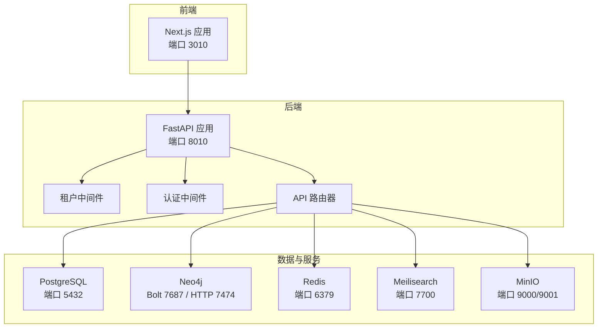
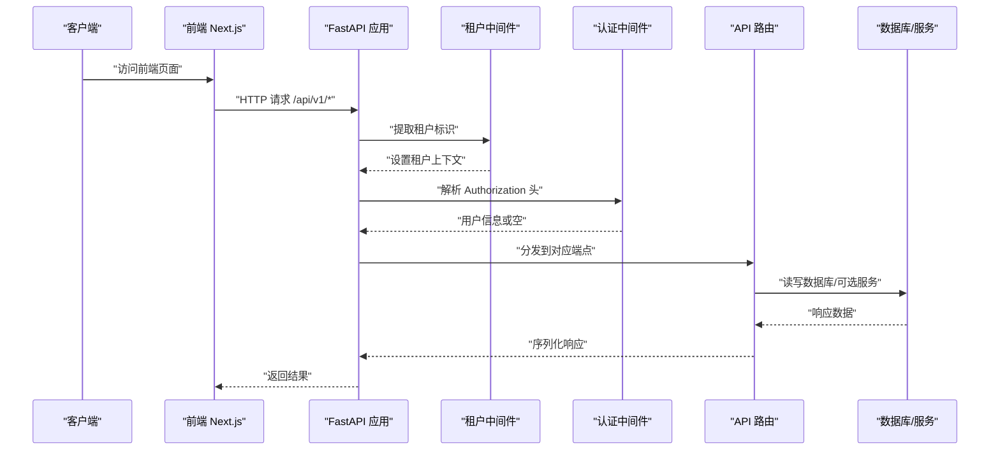
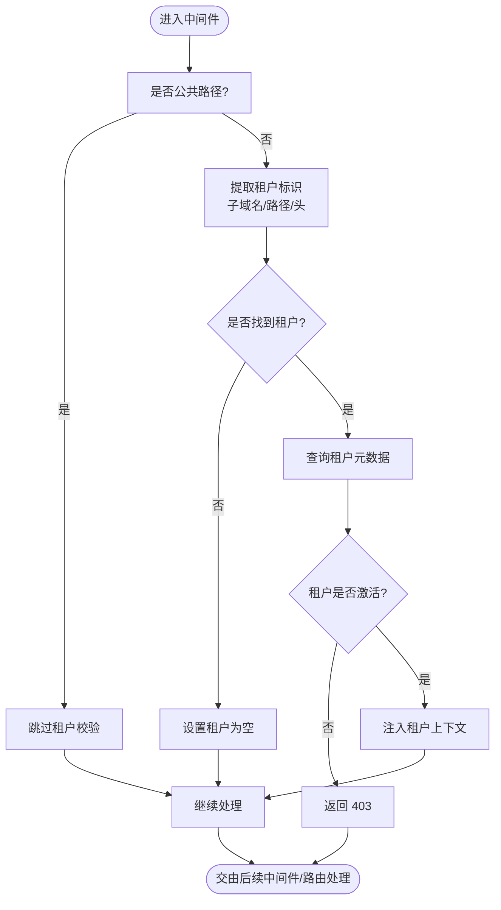
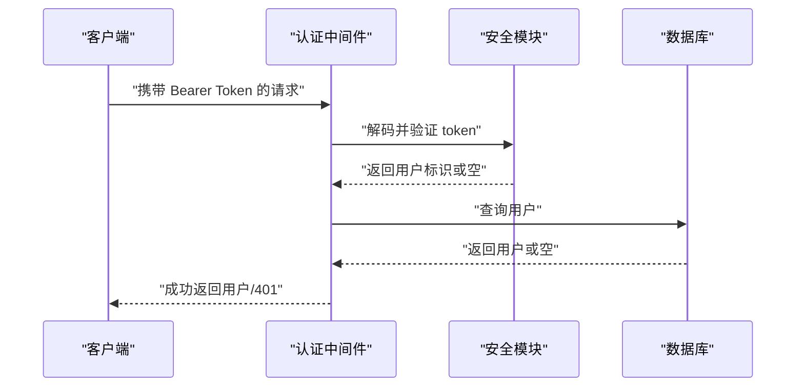
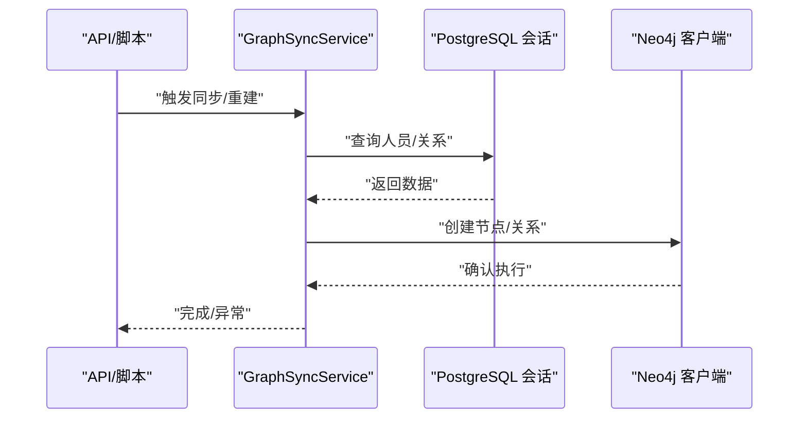
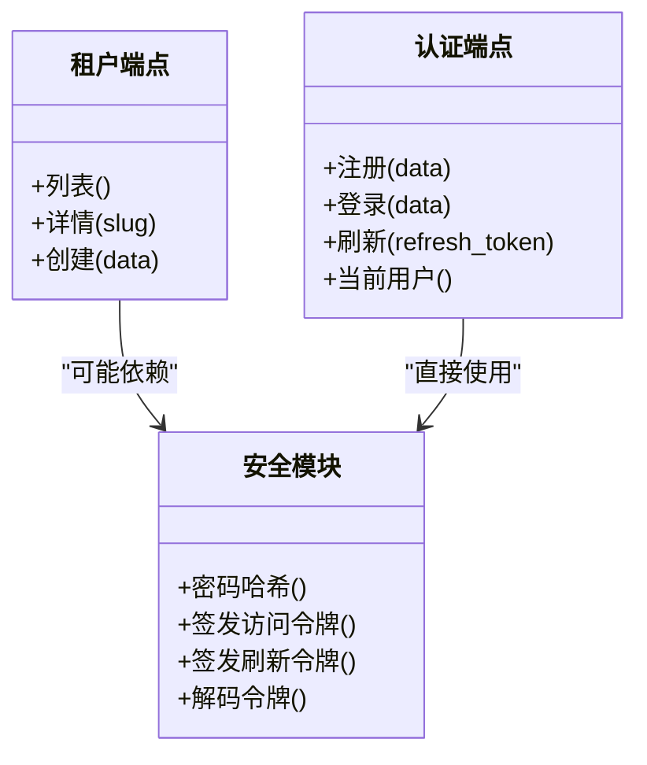
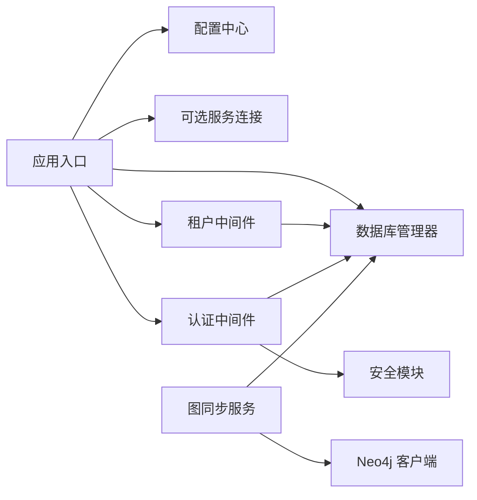

# 故障排除

<cite>
**本文引用的文件**
- [backend/app/main.py](file://backend/app/main.py)
- [backend/app/core/config.py](file://backend/app/core/config.py)
- [backend/app/core/database.py](file://backend/app/core/database.py)
- [backend/app/middleware/tenant.py](file://backend/app/middleware/tenant.py)
- [backend/app/middleware/auth.py](file://backend/app/middleware/auth.py)
- [backend/app/api/v1/endpoints/auth.py](file://backend/app/api/v1/endpoints/auth.py)
- [backend/app/api/v1/endpoints/tenants.py](file://backend/app/api/v1/endpoints/tenants.py)
- [backend/app/core/security.py](file://backend/app/core/security.py)
- [backend/app/services/graph_sync.py](file://backend/app/services/graph_sync.py)
- [backend/app/services/neo4j_service.py](file://backend/app/services/neo4j_service.py)
- [backend/tests/test_auth.py](file://backend/tests/test_auth.py)
- [backend/tests/test_tenants.py](file://backend/tests/test_tenants.py)
- [docker-compose.yml](file://docker-compose.yml)
- [scripts/create_tenant.py](file://scripts/create_tenant.py)
- [scripts/sync_neo4j.py](file://scripts/sync_neo4j.py)
</cite>

## 目录
1. [简介](#简介)
2. [项目结构](#项目结构)
3. [核心组件](#核心组件)
4. [架构总览](#架构总览)
5. [详细组件分析](#详细组件分析)
6. [依赖分析](#依赖分析)
7. [性能考虑](#性能考虑)
8. [故障排除指南](#故障排除指南)
9. [结论](#结论)
10. [附录](#附录)

## 简介
本指南面向多租户族谱管理系统的运维与开发人员，聚焦于环境配置、数据库连接、API 调用错误、日志分析、性能诊断、网络与防火墙、数据一致性、第三方服务集成、紧急恢复与数据保护，以及问题报告与反馈机制。文档基于代码库的实际实现进行梳理，并提供可操作的排障步骤与可视化图示。

## 项目结构
系统采用前后端分离与容器化部署方案：
- 后端：FastAPI 应用，提供多租户 API、认证鉴权、数据库会话管理、可选的图数据库与搜索引擎服务集成。
- 前端：Next.js 应用，通过 API 访问后端接口。
- 数据与服务：PostgreSQL（主库/多租户模式）、Neo4j（可选）、Redis（可选）、Meilisearch（可选）、MinIO（对象存储）。
- 部署：Docker Compose 编排，统一网络与健康检查。

图表来源
- [docker-compose.yml:1-145](file://docker-compose.yml#L1-L145)
- [backend/app/main.py:45-91](file://backend/app/main.py#L45-L91)

章节来源
- [docker-compose.yml:1-145](file://docker-compose.yml#L1-L145)
- [backend/app/main.py:45-91](file://backend/app/main.py#L45-L91)

## 核心组件
- 应用生命周期与健康检查：应用启动时初始化默认数据库引擎、连接可选服务（Neo4j/Redis/Meilisearch），并提供 /health 接口返回服务状态。
- 配置中心：集中管理数据库、缓存、搜索、存储、JWT、CORS 等参数，支持从 .env 文件加载。
- 多租户数据库管理：支持 SQLite（按租户文件）与 PostgreSQL（按 schema）两种多租户模式；提供租户会话与 search_path 设置。
- 租户中间件：从子域名、路径前缀或自定义头提取租户标识，校验租户状态并注入请求上下文。
- 认证中间件：从 Authorization 头解析 Bearer Token，验证并加载用户信息。
- 图同步服务：将 PostgreSQL 中的人口数据同步到 Neo4j，支持全量重建与增量同步。

章节来源
- [backend/app/main.py:17-42](file://backend/app/main.py#L17-L42)
- [backend/app/core/config.py:11-89](file://backend/app/core/config.py#L11-L89)
- [backend/app/core/database.py:24-171](file://backend/app/core/database.py#L24-L171)
- [backend/app/middleware/tenant.py:15-142](file://backend/app/middleware/tenant.py#L15-L142)
- [backend/app/middleware/auth.py:15-88](file://backend/app/middleware/auth.py#L15-L88)
- [backend/app/services/graph_sync.py:20-157](file://backend/app/services/graph_sync.py#L20-L157)

## 架构总览
下图展示请求在系统中的流转：前端发起请求，经 CORS 与租户/认证中间件处理，路由到具体 API，再访问数据库与可选服务。

图表来源
- [backend/app/main.py:57-70](file://backend/app/main.py#L57-L70)
- [backend/app/middleware/tenant.py:39-84](file://backend/app/middleware/tenant.py#L39-L84)
- [backend/app/middleware/auth.py:15-57](file://backend/app/middleware/auth.py#L15-L57)

## 详细组件分析

### 组件A：租户中间件与多租户数据库
- 功能要点
  - 支持三种租户识别方式：子域名、URL 路径前缀、自定义头。
  - 对公共路径放行，不强制租户上下文。
  - 加载租户元数据并注入请求状态，同时校验租户激活状态。
  - 多租户数据库会话：SQLite 模式按租户文件访问；PostgreSQL 模式设置 search_path。
- 关键异常
  - 租户不存在：返回 404 并携带错误码。
  - 租户未激活：返回 403。
- 性能与一致性
  - search_path 设置仅适用于 PostgreSQL。
  - SQLite 模式下每个租户独立数据库文件，天然隔离。

图表来源
- [backend/app/middleware/tenant.py:39-84](file://backend/app/middleware/tenant.py#L39-L84)

章节来源
- [backend/app/middleware/tenant.py:15-142](file://backend/app/middleware/tenant.py#L15-L142)
- [backend/app/core/database.py:58-171](file://backend/app/core/database.py#L58-L171)

### 组件B：认证与授权中间件
- 功能要点
  - 从 Authorization 头解析 Bearer Token。
  - 使用 JWT 解码与类型校验，获取用户 ID。
  - 从数据库加载用户并返回，或抛出 401。
  - 提供超级用户权限检查占位。
- 常见问题
  - 缺失 Authorization 头或格式错误：返回 401。
  - Token 过期或类型不符：返回 401。
  - 用户不存在或非激活状态：返回 401/403。

图表来源
- [backend/app/middleware/auth.py:15-57](file://backend/app/middleware/auth.py#L15-L57)
- [backend/app/core/security.py:80-103](file://backend/app/core/security.py#L80-L103)

章节来源
- [backend/app/middleware/auth.py:15-88](file://backend/app/middleware/auth.py#L15-L88)
- [backend/app/core/security.py:16-103](file://backend/app/core/security.py#L16-L103)

### 组件C：图同步服务与 Neo4j 客户端
- 功能要点
  - 将 PostgreSQL 的人员与关系同步到 Neo4j。
  - 支持全量重建与单人快速同步。
  - Neo4j 客户端封装连接、会话与常用查询。
- 常见问题
  - Neo4j 未连接：verify_connectivity 返回失败，需检查服务可用性与凭据。
  - 同步失败：检查节点标签/属性命名与关系类型一致性。

图表来源
- [backend/app/services/graph_sync.py:64-114](file://backend/app/services/graph_sync.py#L64-L114)
- [backend/app/services/neo4j_service.py:12-60](file://backend/app/services/neo4j_service.py#L12-L60)

章节来源
- [backend/app/services/graph_sync.py:20-157](file://backend/app/services/graph_sync.py#L20-L157)
- [backend/app/services/neo4j_service.py:12-373](file://backend/app/services/neo4j_service.py#L12-L373)

### 组件D：租户与认证 API 端点
- 租户端点
  - 列表、详情、创建（预留超级用户权限）。
  - 支持按姓氏模糊筛选。
- 认证端点
  - 注册、登录、刷新、当前用户信息。
  - 密码哈希与 JWT 签发/校验。

图表来源
- [backend/app/api/v1/endpoints/tenants.py:45-164](file://backend/app/api/v1/endpoints/tenants.py#L45-L164)
- [backend/app/api/v1/endpoints/auth.py:55-179](file://backend/app/api/v1/endpoints/auth.py#L55-L179)
- [backend/app/core/security.py:26-103](file://backend/app/core/security.py#L26-L103)

章节来源
- [backend/app/api/v1/endpoints/tenants.py:17-164](file://backend/app/api/v1/endpoints/tenants.py#L17-L164)
- [backend/app/api/v1/endpoints/auth.py:25-179](file://backend/app/api/v1/endpoints/auth.py#L25-L179)
- [backend/app/core/security.py:16-103](file://backend/app/core/security.py#L16-L103)

## 依赖分析
- 组件耦合
  - 应用入口依赖配置、数据库管理器与服务连接。
  - 租户中间件依赖数据库查询与请求上下文。
  - 认证中间件依赖安全模块与数据库。
  - 图同步服务依赖 Neo4j 客户端与数据库。
- 外部依赖
  - PostgreSQL/Neo4j/Redis/Meilisearch/MinIO 通过环境变量配置，容器编排中统一暴露端口与健康检查。

图表来源
- [backend/app/main.py:17-42](file://backend/app/main.py#L17-L42)
- [backend/app/middleware/tenant.py:117-125](file://backend/app/middleware/tenant.py#L117-L125)
- [backend/app/middleware/auth.py:15-44](file://backend/app/middleware/auth.py#L15-L44)
- [backend/app/services/graph_sync.py:109-114](file://backend/app/services/graph_sync.py#L109-L114)
- [backend/app/services/neo4j_service.py:56-60](file://backend/app/services/neo4j_service.py#L56-L60)

章节来源
- [backend/app/main.py:17-42](file://backend/app/main.py#L17-L42)
- [backend/app/middleware/tenant.py:116-125](file://backend/app/middleware/tenant.py#L116-L125)
- [backend/app/middleware/auth.py:15-44](file://backend/app/middleware/auth.py#L15-L44)
- [backend/app/services/graph_sync.py:106-114](file://backend/app/services/graph_sync.py#L106-L114)
- [backend/app/services/neo4j_service.py:52-60](file://backend/app/services/neo4j_service.py#L52-L60)

## 性能考虑
- 数据库连接池
  - PostgreSQL：通过配置项设置池大小与溢出，避免高并发下的连接争用。
  - SQLite：不支持连接池，按租户文件访问，注意磁盘 I/O。
- 查询与索引
  - 在高频查询字段上建立索引（如人员姓名、关系唯一约束）。
  - 分页与限制返回数量，避免大结果集。
- 可选服务
  - Neo4j/Redis/Meilisearch 为可选服务，若不可用应不影响核心功能，但会影响图查询与搜索体验。
- 缓存策略
  - Redis 可用于热点数据缓存与会话存储，需关注内存与持久化配置。

章节来源
- [backend/app/core/config.py:34-51](file://backend/app/core/config.py#L34-L51)
- [backend/app/core/database.py:33-56](file://backend/app/core/database.py#L33-L56)

## 故障排除指南

### 环境配置问题
- 症状
  - 应用无法启动或端口占用。
  - 环境变量缺失导致连接串为空或默认值不符合预期。
- 排查步骤
  - 检查 .env 文件与环境变量覆盖顺序。
  - 确认主机与端口映射正确（容器内端口与宿主映射）。
  - 使用健康检查端点 /health 验证服务状态。
- 工具与命令
  - docker compose ps 查看容器状态。
  - docker compose logs <service> 查看服务日志。
  - curl http://localhost:8010/health 检查健康状态。

章节来源
- [backend/app/main.py:72-86](file://backend/app/main.py#L72-L86)
- [docker-compose.yml:95-114](file://docker-compose.yml#L95-L114)

### 数据库连接问题
- 症状
  - 登录/注册失败，数据库写入异常。
  - 租户会话报错（PostgreSQL search_path）。
- 排查步骤
  - 确认 DATABASE_URL 正确指向 PostgreSQL 或 SQLite。
  - 若为 PostgreSQL，确认 schema 存在且 search_path 设置成功。
  - 若为 SQLite，确认租户数据库文件存在且可写。
- 相关实现
  - 默认引擎初始化与会话工厂创建。
  - 租户会话设置 search_path（仅 PostgreSQL）。

章节来源
- [backend/app/core/database.py:33-106](file://backend/app/core/database.py#L33-L106)
- [backend/app/core/database.py:136-171](file://backend/app/core/database.py#L136-L171)

### API 调用错误
- 症状
  - 401 未认证：缺少或无效的 Authorization 头。
  - 403 权限不足：非超级用户尝试创建租户。
  - 404 租户不存在：子域名/路径/头不匹配或租户未激活。
- 排查步骤
  - 检查请求头 Authorization 是否为 Bearer Token。
  - 使用 /api/v1/auth/login 获取有效 token。
  - 确认租户 slug 正确且 is_active 为真。
- 相关实现
  - 认证中间件与端点。
  - 租户中间件与端点。

章节来源
- [backend/app/middleware/auth.py:15-57](file://backend/app/middleware/auth.py#L15-L57)
- [backend/app/api/v1/endpoints/auth.py:89-123](file://backend/app/api/v1/endpoints/auth.py#L89-L123)
- [backend/app/middleware/tenant.py:48-83](file://backend/app/middleware/tenant.py#L48-L83)
- [backend/app/api/v1/endpoints/tenants.py:118-163](file://backend/app/api/v1/endpoints/tenants.py#L118-L163)

### 日志分析与错误定位
- 日志位置
  - 容器标准输出与日志卷：docker compose logs <service>。
  - 应用启动阶段打印服务状态与版本信息。
- 分析技巧
  - 结合请求路径与租户上下文定位问题范围。
  - 关注数据库事务提交/回滚与异常捕获。
  - 对比 /health 与各服务容器健康检查状态。

章节来源
- [backend/app/main.py:21-42](file://backend/app/main.py#L21-L42)
- [docker-compose.yml:16-41](file://docker-compose.yml#L16-L41)

### 性能问题诊断与优化
- 诊断
  - 观察 /health 中数据库与可选服务状态。
  - 使用数据库慢查询日志与连接数监控。
- 优化
  - 调整数据库连接池参数。
  - 为高频查询字段添加索引。
  - 减少一次性返回的数据量，启用分页。
  - 对可选服务（Redis/Meilisearch）进行容量评估与配置优化。

章节来源
- [backend/app/core/config.py:34-51](file://backend/app/core/config.py#L34-L51)
- [backend/app/core/database.py:33-56](file://backend/app/core/database.py#L33-L56)

### 网络连接问题与防火墙配置
- 症状
  - 前端无法访问后端 API。
  - Neo4j/Redis/Meilisearch 无法连通。
- 排查步骤
  - 检查容器间网络与端口映射。
  - 确认防火墙未阻断 5432/7687/6379/7700/9000/9001。
  - 使用 curl 或 telnet 测试端口连通性。
- 相关配置
  - docker-compose 中端口映射与健康检查。

章节来源
- [docker-compose.yml:12-114](file://docker-compose.yml#L12-L114)

### 数据一致性问题排查与修复
- 症状
  - 租户数据隔离异常。
  - Neo4j 与 PostgreSQL 数据不一致。
- 排查步骤
  - 确认租户 schema/文件是否正确创建。
  - 执行全量图重建同步，核对节点与关系数量。
  - 对比变更日志表（如存在）与实际数据。
- 工具
  - 脚本创建租户与初始化表结构。
  - 图同步脚本触发重建。

章节来源
- [scripts/create_tenant.py:18-282](file://scripts/create_tenant.py#L18-L282)
- [scripts/sync_neo4j.py:14-38](file://scripts/sync_neo4j.py#L14-L38)
- [backend/app/services/graph_sync.py:94-114](file://backend/app/services/graph_sync.py#L94-L114)

### 第三方服务集成问题
- Neo4j
  - 连接失败：检查 URI、用户名、密码与 bolt 端口。
  - 图查询异常：核对节点标签与关系类型。
- Redis
  - 连接超时：检查网络连通与内存配置。
- Meilisearch
  - 搜索异常：确认 API Key 与索引状态。
- MinIO
  - 上传失败：检查端点、密钥与桶权限。

章节来源
- [backend/app/services/neo4j_service.py:12-60](file://backend/app/services/neo4j_service.py#L12-L60)
- [backend/app/core/config.py:46-67](file://backend/app/core/config.py#L46-L67)

### 紧急情况下的恢复流程与数据保护
- 快速恢复
  - 重启相关容器（API、数据库、可选服务）。
  - 使用 /health 快速确认服务可用性。
- 数据保护
  - PostgreSQL：启用 WAL 与定期备份。
  - Neo4j：开启快照与备份策略。
  - MinIO：启用版本控制与跨域复制。
- 回滚与演练
  - 保留最近一次备份镜像，定期演练恢复流程。

章节来源
- [docker-compose.yml:16-87](file://docker-compose.yml#L16-L87)

### 问题报告与反馈机制
- 建议流程
  - 收集环境信息（操作系统、容器版本、数据库版本）。
  - 提供最小复现步骤与相关日志片段。
  - 明确问题影响面（全局/租户/用户）。
- 反馈渠道
  - 通过项目 Issue/工单系统提交，附带上述信息。

章节来源
- [backend/app/main.py:72-86](file://backend/app/main.py#L72-L86)

## 结论
本指南围绕多租户族谱管理系统的运行与维护，提供了从环境配置、数据库连接、API 错误、日志分析、性能优化、网络与防火墙、数据一致性、第三方服务集成到紧急恢复与反馈机制的系统化排障方法。建议在生产环境中结合健康检查、日志聚合与告警体系，持续监控服务状态与性能指标，确保系统稳定运行。

## 附录
- 常用命令
  - 启动：docker compose up -d
  - 停止：docker compose down
  - 查看日志：docker compose logs -f <service>
  - 进入容器：docker compose exec <service> sh
- 测试参考
  - 认证与租户相关测试用例可作为行为参考与回归验证依据。

章节来源
- [backend/tests/test_auth.py:12-149](file://backend/tests/test_auth.py#L12-L149)
- [backend/tests/test_tenants.py:11-112](file://backend/tests/test_tenants.py#L11-L112)