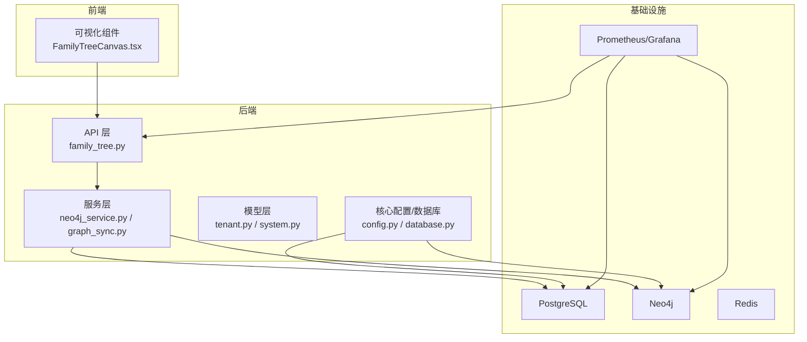
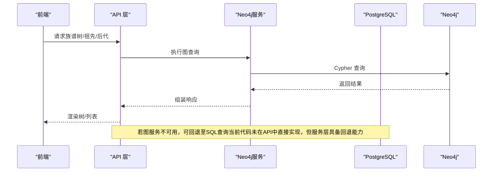
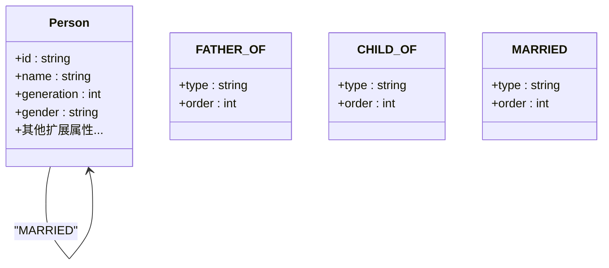
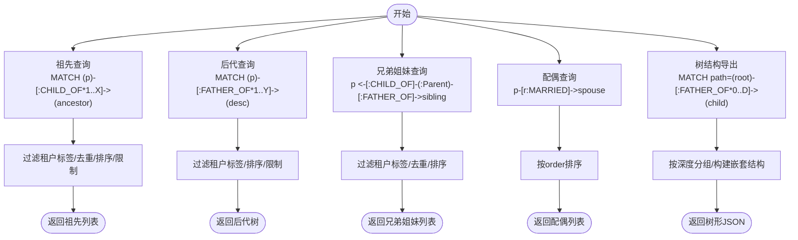
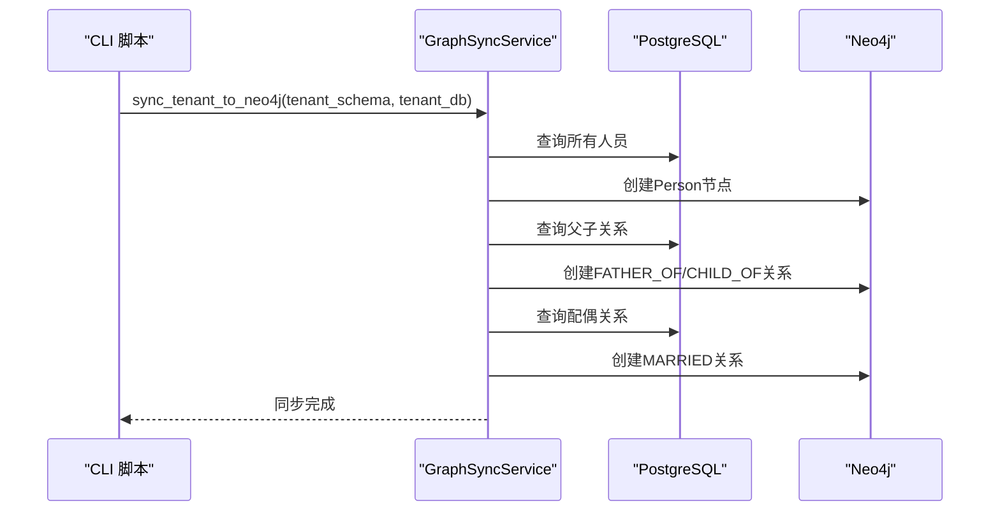
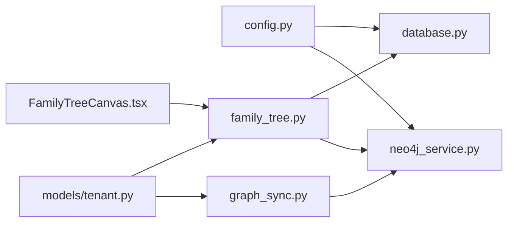

# 图数据库模型

<cite>
**本文引用的文件**
- [neo4j_service.py](file://backend/app/services/neo4j_service.py)
- [graph_sync.py](file://backend/app/services/graph_sync.py)
- [sync_neo4j.py](file://scripts/sync_neo4j.py)
- [tenant.py](file://backend/app/models/tenant.py)
- [system.py](file://backend/app/models/system.py)
- [config.py](file://backend/app/core/config.py)
- [database.py](file://backend/app/core/database.py)
- [family_tree.py](file://backend/app/api/v1/endpoints/family_tree.py)
- [FamilyTreeCanvas.tsx](file://frontend/components/family-tree/FamilyTreeCanvas.tsx)
- [docker-compose.yml](file://docker-compose.yml)
- [prometheus.yml](file://docker/prometheus/prometheus.yml)
- [docker-compose.prod.yml](file://docker-compose.prod.yml)
</cite>

## 目录
1. [简介](#简介)
2. [项目结构](#项目结构)
3. [核心组件](#核心组件)
4. [架构总览](#架构总览)
5. [详细组件分析](#详细组件分析)
6. [依赖关系分析](#依赖关系分析)
7. [性能考量](#性能考量)
8. [故障排查指南](#故障排查指南)
9. [结论](#结论)
10. [附录](#附录)

## 简介
本文件面向“多租户族谱管理系统”的图数据库建模与实现，聚焦于Neo4j图数据库的设计原理、节点与关系定义、查询模式、数据同步机制、索引与性能优化、一致性与并发控制、备份与监控，以及可视化实现与调优建议。系统采用“关系型数据库（PostgreSQL）+ 图数据库（Neo4j）”双引擎架构：以PostgreSQL作为主业务库，负责多租户隔离、结构化数据与审计；以Neo4j承载族谱关系的高效查询与可视化。

## 项目结构
- 后端服务位于 backend/app，包含：
  - 服务层：Neo4j客户端与图同步服务
  - 模型层：租户与系统级ORM模型
  - API层：族谱树相关接口
  - 核心配置与数据库会话管理
- 前端位于 frontend，包含族谱树可视化组件
- 脚本位于 scripts，提供命令行数据同步工具
- 运维位于 docker 与 docker-compose，包含Neo4j、PostgreSQL、Redis、Prometheus/Grafana等

图表来源
- [family_tree.py:1-274](file://backend/app/api/v1/endpoints/family_tree.py#L1-L274)
- [neo4j_service.py:1-373](file://backend/app/services/neo4j_service.py#L1-L373)
- [graph_sync.py:1-157](file://backend/app/services/graph_sync.py#L1-L157)
- [tenant.py:1-244](file://backend/app/models/tenant.py#L1-L244)
- [system.py:1-223](file://backend/app/models/system.py#L1-L223)
- [config.py:1-89](file://backend/app/core/config.py#L1-L89)
- [database.py:1-171](file://backend/app/core/database.py#L1-L171)
- [FamilyTreeCanvas.tsx:1-236](file://frontend/components/family-tree/FamilyTreeCanvas.tsx#L1-L236)
- [docker-compose.yml:1-56](file://docker-compose.yml#L1-L56)
- [docker-compose.prod.yml:174-216](file://docker-compose.prod.yml#L174-L216)

章节来源
- [family_tree.py:1-274](file://backend/app/api/v1/endpoints/family_tree.py#L1-L274)
- [neo4j_service.py:1-373](file://backend/app/services/neo4j_service.py#L1-L373)
- [graph_sync.py:1-157](file://backend/app/services/graph_sync.py#L1-L157)
- [tenant.py:1-244](file://backend/app/models/tenant.py#L1-L244)
- [system.py:1-223](file://backend/app/models/system.py#L1-L223)
- [config.py:1-89](file://backend/app/core/config.py#L1-L89)
- [database.py:1-171](file://backend/app/core/database.py#L1-L171)
- [FamilyTreeCanvas.tsx:1-236](file://frontend/components/family-tree/FamilyTreeCanvas.tsx#L1-L236)
- [docker-compose.yml:1-56](file://docker-compose.yml#L1-L56)
- [docker-compose.prod.yml:174-216](file://docker-compose.prod.yml#L174-L216)

## 核心组件
- Neo4j客户端与查询封装：提供异步连接、会话管理、节点与关系创建、常用族谱查询（祖先、后代、兄弟、配偶、按代统计、名称模糊搜索、树结构导出、统计汇总）
- 图同步服务：将PostgreSQL中的人员、父子关系、配偶关系迁移到Neo4j；支持全量重建与单人快速同步
- 租户与系统模型：定义租户、用户、订阅、人员、配偶关系、支系、变更日志等
- API族谱树：提供树构建、祖先链、后代树、统计等接口
- 前端可视化：基于D3的树形图组件，支持缩放、适配屏幕、点击回调
- 配置与数据库：统一配置（含Neo4j连接参数）、多租户数据库会话管理
- 运维：Compose编排Neo4j、PostgreSQL、Redis、Prometheus/Grafana；生产环境可选监控

章节来源
- [neo4j_service.py:1-373](file://backend/app/services/neo4j_service.py#L1-L373)
- [graph_sync.py:1-157](file://backend/app/services/graph_sync.py#L1-L157)
- [tenant.py:1-244](file://backend/app/models/tenant.py#L1-L244)
- [system.py:1-223](file://backend/app/models/system.py#L1-L223)
- [family_tree.py:1-274](file://backend/app/api/v1/endpoints/family_tree.py#L1-L274)
- [FamilyTreeCanvas.tsx:1-236](file://frontend/components/family-tree/FamilyTreeCanvas.tsx#L1-L236)
- [config.py:1-89](file://backend/app/core/config.py#L1-L89)
- [database.py:1-171](file://backend/app/core/database.py#L1-L171)
- [docker-compose.yml:1-56](file://docker-compose.yml#L1-L56)
- [docker-compose.prod.yml:174-216](file://docker-compose.prod.yml#L174-L216)

## 架构总览
系统采用“SQL主库 + 图查询加速”的双引擎架构：
- PostgreSQL负责：
  - 多租户Schema隔离
  - 结构化数据存储（人员、配偶关系、支系、变更日志等）
  - 审计与权限控制
- Neo4j负责：
  - 高效的关系遍历与路径查询
  - 族谱树可视化与交互
  - 统计与聚合（按代、按支系）

图表来源
- [family_tree.py:1-274](file://backend/app/api/v1/endpoints/family_tree.py#L1-L274)
- [neo4j_service.py:1-373](file://backend/app/services/neo4j_service.py#L1-L373)
- [graph_sync.py:1-157](file://backend/app/services/graph_sync.py#L1-L157)

## 详细组件分析

### 图模型设计：节点与关系
- 节点标签与属性
  - Person节点：标签为Person，属性包含id、name、generation、gender等；扩展属性如courtesy_name、art_name、birth_year、death_year、avatar等
  - 通过租户标识作为标签或命名空间隔离（当前实现将租户名作为标签附加在节点上，实现逻辑见节点创建与查询处）
- 关系类型与属性
  - FATHER_OF/CHILD_OF：父子双向关系
  - MARRIED：配偶关系，属性包含type（如婚姻）、order（排序）
- 设计原则
  - 使用双向边保持查询灵活性
  - 关系属性承载业务语义（如多重婚姻的排序）
  - 通过租户标签实现多租户隔离

图表来源
- [neo4j_service.py:65-144](file://backend/app/services/neo4j_service.py#L65-L144)
- [tenant.py:61-164](file://backend/app/models/tenant.py#L61-L164)

章节来源
- [neo4j_service.py:65-144](file://backend/app/services/neo4j_service.py#L65-L144)
- [tenant.py:61-164](file://backend/app/models/tenant.py#L61-L164)

### 图查询模式与最佳实践
- 祖先查找
  - 使用反向CHILD_OF边沿路径向上追溯，限制深度与数量
  - 注意去重与生成序排序
- 后代搜索
  - 使用FATHER_OF边沿路径向下展开，限制深度
  - 支持按代与姓名排序
- 兄弟姐妹查找
  - 通过共同父节点定位兄弟姐妹集合
- 配偶关系
  - 查询MARRIED关系，按order排序返回
- 名称模糊搜索
  - 在name、courtesy_name、art_name、alias中进行CONTAINS匹配
- 树结构导出
  - 使用FATHER_OF*0..N路径收集节点与深度，构建嵌套结构用于前端渲染
- 统计查询
  - 统计总数、按代分布、按支系分布

图表来源
- [neo4j_service.py:146-373](file://backend/app/services/neo4j_service.py#L146-L373)

章节来源
- [neo4j_service.py:146-373](file://backend/app/services/neo4j_service.py#L146-L373)

### 数据同步机制：从关系型数据库到图数据库
- 同步流程
  - 全量同步：先同步所有人员节点，再同步父子关系，最后同步配偶关系
  - 重建图：清空现有租户图数据后重新同步
  - 单人快速同步：仅同步指定人员及其父节点
- 触发方式
  - CLI脚本：接收租户slug，转换为schema与Neo4j数据库名，执行同步
  - 服务层：提供异步入口，供后台任务或事件驱动触发
- 数据一致性
  - 当前实现未在同步过程中引入事务边界；建议在批量写入时分批提交，避免超大事务
  - 建议增加幂等性检查（如存在则跳过），避免重复创建

图表来源
- [graph_sync.py:64-114](file://backend/app/services/graph_sync.py#L64-L114)
- [sync_neo4j.py:14-38](file://scripts/sync_neo4j.py#L14-L38)

章节来源
- [graph_sync.py:1-157](file://backend/app/services/graph_sync.py#L1-L157)
- [sync_neo4j.py:1-41](file://scripts/sync_neo4j.py#L1-L41)

### 前端可视化与交互
- 组件职责
  - FamilyTreeCanvas：拉取树数据、处理缩放与适配、渲染节点卡片、图例与控件
  - API接口：提供族谱树、祖先链、后代树、统计等
- 数据流
  - 前端请求API，后端返回树形JSON，前端使用react-d3-tree渲染
- 性能建议
  - 控制最大深度，避免一次性加载过大子树
  - 使用骨架屏与错误提示提升体验
  - 节点卡片内懒加载头像

章节来源
- [FamilyTreeCanvas.tsx:1-236](file://frontend/components/family-tree/FamilyTreeCanvas.tsx#L1-L236)
- [family_tree.py:1-274](file://backend/app/api/v1/endpoints/family_tree.py#L1-L274)

## 依赖关系分析
- 服务层依赖
  - Neo4j服务依赖配置模块提供的连接参数
  - 图同步服务依赖模型层的Person与SpouseRelation
  - API层依赖数据库会话管理与中间件
- 外部依赖
  - Neo4j驱动（异步）
  - PostgreSQL驱动（SQLAlchemy）
  - 前端D3树组件
- 运维依赖
  - Docker Compose编排
  - Prometheus/Grafana监控

图表来源
- [config.py:1-89](file://backend/app/core/config.py#L1-L89)
- [database.py:1-171](file://backend/app/core/database.py#L1-L171)
- [neo4j_service.py:1-373](file://backend/app/services/neo4j_service.py#L1-L373)
- [graph_sync.py:1-157](file://backend/app/services/graph_sync.py#L1-L157)
- [tenant.py:1-244](file://backend/app/models/tenant.py#L1-L244)
- [family_tree.py:1-274](file://backend/app/api/v1/endpoints/family_tree.py#L1-L274)
- [FamilyTreeCanvas.tsx:1-236](file://frontend/components/family-tree/FamilyTreeCanvas.tsx#L1-L236)

章节来源
- [config.py:1-89](file://backend/app/core/config.py#L1-L89)
- [database.py:1-171](file://backend/app/core/database.py#L1-L171)
- [neo4j_service.py:1-373](file://backend/app/services/neo4j_service.py#L1-L373)
- [graph_sync.py:1-157](file://backend/app/services/graph_sync.py#L1-L157)
- [tenant.py:1-244](file://backend/app/models/tenant.py#L1-L244)
- [family_tree.py:1-274](file://backend/app/api/v1/endpoints/family_tree.py#L1-L274)
- [FamilyTreeCanvas.tsx:1-236](file://frontend/components/family-tree/FamilyTreeCanvas.tsx#L1-L236)

## 性能考量
- 查询性能
  - 使用最短路径与限定深度，避免全图扫描
  - 对频繁过滤字段建立索引（如id、generation、name等）
  - 分页与限制返回数量，避免超大数据集
- 写入性能
  - 批量写入时分批提交，减少事务开销
  - 幂等性检查，避免重复创建
- 缓存策略
  - 对热点树片段或统计结果进行缓存（Redis）
- 监控与告警
  - 采集Neo4j、PostgreSQL、API的指标，结合Grafana可视化
- 资源规划
  - Neo4j堆内存与插件（APOC）合理配置
  - Docker Compose中已设置内存上限

章节来源
- [docker-compose.yml:22-41](file://docker-compose.yml#L22-L41)
- [docker-compose.prod.yml:174-216](file://docker-compose.prod.yml#L174-L216)
- [prometheus.yml:1-32](file://docker/prometheus/prometheus.yml#L1-L32)

## 故障排查指南
- 连接问题
  - 检查Neo4j URI、用户名、密码是否正确
  - 确认容器健康状态与端口映射
- 同步失败
  - 查看CLI输出与异常栈
  - 确认租户schema与Neo4j数据库名转换逻辑
- 查询异常
  - 检查租户标签是否正确附加
  - 确认节点属性是否存在（如generation、name等）
- 可视化问题
  - 检查API返回格式与前端解析
  - 确认树数据深度与节点数量

章节来源
- [config.py:41-44](file://backend/app/core/config.py#L41-L44)
- [docker-compose.yml:22-41](file://docker-compose.yml#L22-L41)
- [sync_neo4j.py:14-38](file://scripts/sync_neo4j.py#L14-L38)
- [neo4j_service.py:146-373](file://backend/app/services/neo4j_service.py#L146-L373)
- [FamilyTreeCanvas.tsx:39-59](file://frontend/components/family-tree/FamilyTreeCanvas.tsx#L39-L59)

## 结论
该系统通过“SQL主库 + Neo4j图库”的架构实现了多租户族谱管理的高可用与高性能。图数据库在关系查询与可视化方面提供了显著优势，配合完善的同步机制与前端可视化组件，能够满足复杂的族谱浏览与分析需求。后续可在索引策略、缓存与监控方面进一步优化，并在同步流程中引入更强的一致性保障。

## 附录

### 图数据库索引策略与最佳实践
- 建议索引
  - Person(id)：唯一索引，加速节点查找
  - Person(generation)：加速按代查询
  - Person(name/courtesy_name/art_name/alias)：全文或前缀索引，加速模糊搜索
- Cypher最佳实践
  - 显式限定标签与属性，避免全表扫描
  - 使用LIMIT与SKIP控制结果规模
  - 对路径查询使用深度限制
  - 使用EXPLAIN/PROFILE分析查询计划

章节来源
- [neo4j_service.py:268-289](file://backend/app/services/neo4j_service.py#L268-L289)

### 一致性与并发控制
- 当前实现
  - 同步过程未显式使用事务边界，建议在批量写入时分批提交
  - 未实现图层面的锁或版本控制
- 建议
  - 引入幂等性检查（存在即跳过）
  - 对关键写操作使用事务，确保原子性
  - 在API层对并发写入进行限流与重试

章节来源
- [graph_sync.py:64-114](file://backend/app/services/graph_sync.py#L64-L114)

### 备份与恢复策略
- Neo4j
  - 使用快照或备份卷（docker volume）定期备份
  - 导出重要数据（如schema、索引定义）到版本控制
- PostgreSQL
  - 使用pg_dump/pg_restore或逻辑复制
- 回滚与演练
  - 定期进行恢复演练，验证备份完整性

章节来源
- [docker-compose.yml:34-36](file://docker-compose.yml#L34-L36)
- [docker-compose.prod.yml:203-212](file://docker-compose.prod.yml#L203-L212)

### 监控指标与可视化
- 指标
  - Neo4j：查询QPS、慢查询、内存使用、连接数
  - PostgreSQL：连接数、查询延迟、缓冲命中率
  - API：请求延迟、错误率、吞吐量
  - 前端：首屏时间、交互延迟
- 工具
  - Prometheus抓取指标，Grafana展示
  - 可选：Neo4j内置监控与APM

章节来源
- [docker-compose.yml:37-41](file://docker-compose.yml#L37-L41)
- [docker-compose.prod.yml:176-201](file://docker-compose.prod.yml#L176-L201)
- [prometheus.yml:12-32](file://docker/prometheus/prometheus.yml#L12-L32)

### 可视化实现与性能调优
- 实现要点
  - 前端使用react-d3-tree，支持垂直布局、步骤连线、节点自定义渲染
  - 控制最大深度与节点数量，避免渲染卡顿
  - 提供缩放、适配屏幕、重置等交互
- 调优建议
  - 将树数据按需分页或懒加载
  - 对节点卡片内容进行节流渲染
  - 使用骨架屏与错误提示提升用户体验

章节来源
- [FamilyTreeCanvas.tsx:104-169](file://frontend/components/family-tree/FamilyTreeCanvas.tsx#L104-L169)