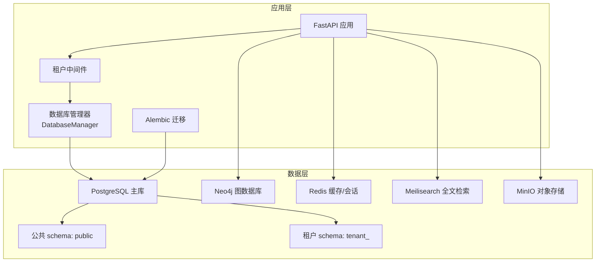
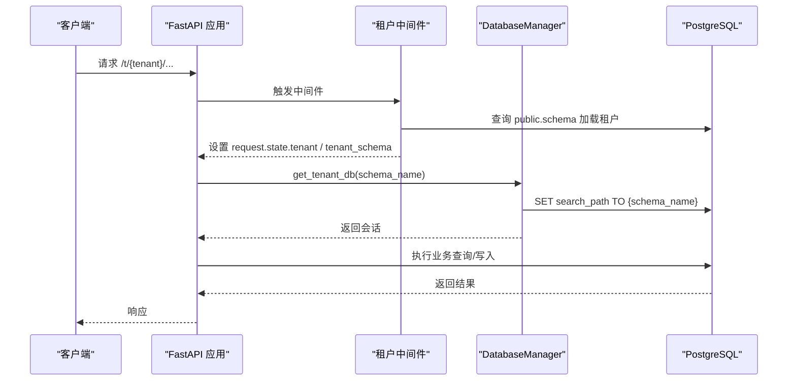
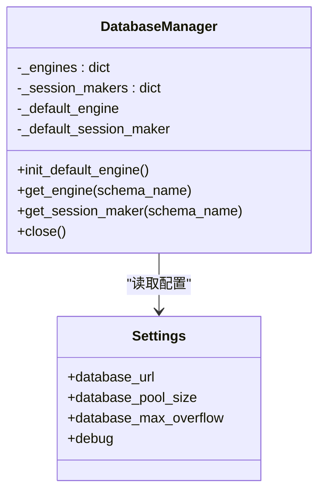
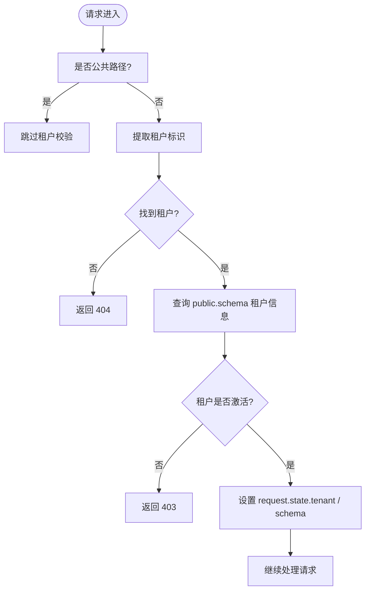
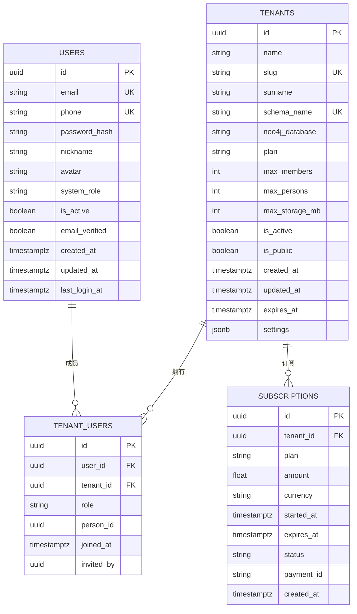
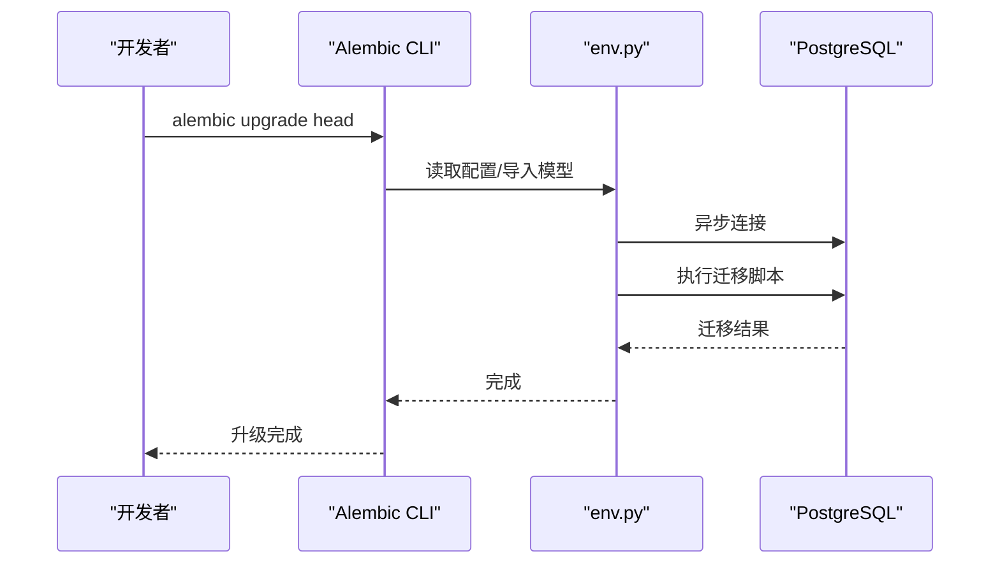
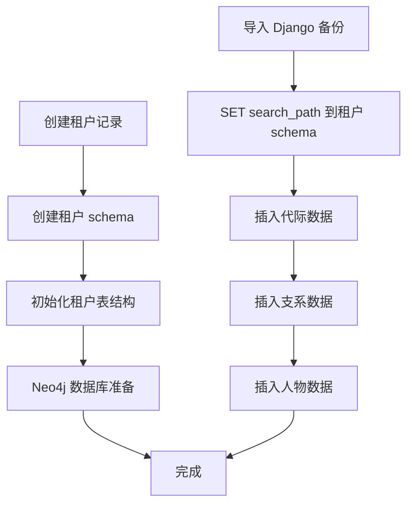
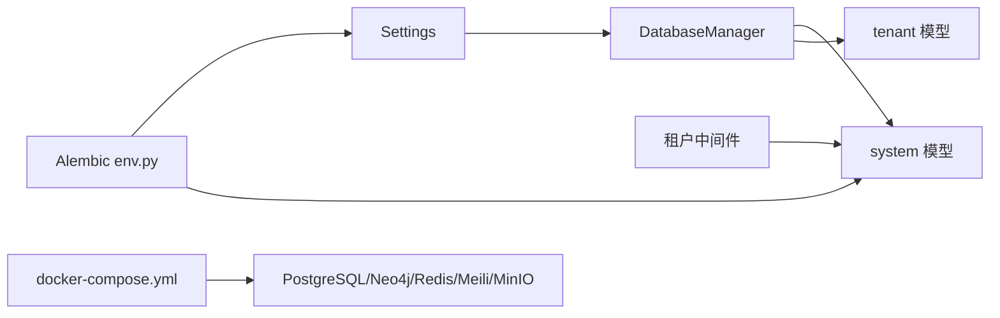

# 数据库架构设计

<cite>
**本文档引用的文件**
- [backend/app/core/database.py](file://backend/app/core/database.py)
- [backend/app/core/config.py](file://backend/app/core/config.py)
- [backend/migrations/env.py](file://backend/migrations/env.py)
- [backend/alembic.ini](file://backend/alembic.ini)
- [backend/migrations/versions/001_initial.py](file://backend/migrations/versions/001_initial.py)
- [backend/app/models/system.py](file://backend/app/models/system.py)
- [backend/app/models/tenant.py](file://backend/app/models/tenant.py)
- [backend/app/middleware/tenant.py](file://backend/app/middleware/tenant.py)
- [docker/docker-compose.yml](file://docker/docker-compose.yml)
- [docker/postgres/init.sql](file://docker/postgres/init.sql)
- [scripts/create_tenant.py](file://scripts/create_tenant.py)
- [scripts/migrate_data.py](file://scripts/migrate_data.py)
- [docker/prometheus/prometheus.yml](file://docker/prometheus/prometheus.yml)
- [backend/pyproject.toml](file://backend/pyproject.toml)
</cite>

## 目录
1. [简介](#简介)
2. [项目结构](#项目结构)
3. [核心组件](#核心组件)
4. [架构总览](#架构总览)
5. [详细组件分析](#详细组件分析)
6. [依赖关系分析](#依赖关系分析)
7. [性能考虑](#性能考虑)
8. [故障排查指南](#故障排查指南)
9. [结论](#结论)
10. [附录](#附录)

## 简介
本文件面向多租户族谱管理系统，系统采用 PostgreSQL 作为主数据库，结合 Alembic 进行数据库迁移管理，并通过租户级 schema 实现数据隔离。系统同时集成 Neo4j 用于图谱查询增强、Redis 用于缓存与会话、Meilisearch 用于全文检索、MinIO 用于对象存储。本文档从数据库整体架构、连接池与事务管理、并发控制、多租户隔离、迁移管理、性能优化、备份恢复、监控与安全等方面进行系统化阐述。

## 项目结构
后端使用 FastAPI + SQLAlchemy Async + Alembic 的组合，数据库相关的关键位置如下：
- 配置与连接：settings、DatabaseManager、依赖注入
- 模型定义：system（公共 schema）、tenant（租户 schema）
- 迁移：Alembic 配置与初始迁移脚本
- 中间件：租户识别与上下文设置
- 初始化与运维：租户创建、数据迁移脚本
- 基础设施：docker-compose 编排 PostgreSQL、Neo4j、Redis、Meilisearch、MinIO

图表来源
- [backend/app/core/database.py:1-171](file://backend/app/core/database.py#L1-L171)
- [backend/app/middleware/tenant.py:1-142](file://backend/app/middleware/tenant.py#L1-L142)
- [docker/docker-compose.yml:1-145](file://docker/docker-compose.yml#L1-L145)

章节来源
- [backend/app/core/database.py:1-171](file://backend/app/core/database.py#L1-L171)
- [docker/docker-compose.yml:1-145](file://docker/docker-compose.yml#L1-L145)

## 核心组件
- 数据库配置与连接池
  - 使用异步引擎与会话工厂，支持 SQLite 与 PostgreSQL 双栈；PostgreSQL 默认启用连接池参数，SQLite 不支持 pool_size。
  - 提供默认引擎与按租户 schema 的动态引擎/会话工厂，支持在租户请求中切换 search_path。
- 多租户中间件
  - 支持子域名、路径前缀、自定义头三种方式识别租户，加载租户元数据到请求上下文。
- 系统与租户模型
  - system 模型位于 public schema，包含租户、用户、租户-用户关系、订阅等。
  - tenant 模型位于各租户 schema，包含代际、支系、人物、配偶关系、图片视频、变更日志等。
- 迁移管理
  - Alembic 配置支持异步引擎，初始化脚本创建系统表与索引。
- 初始化与运维脚本
  - 创建租户 schema、初始化租户表、Neo4j 数据库准备、数据迁移工具。

章节来源
- [backend/app/core/database.py:1-171](file://backend/app/core/database.py#L1-L171)
- [backend/app/middleware/tenant.py:1-142](file://backend/app/middleware/tenant.py#L1-L142)
- [backend/app/models/system.py:1-223](file://backend/app/models/system.py#L1-L223)
- [backend/app/models/tenant.py:1-244](file://backend/app/models/tenant.py#L1-L244)
- [backend/migrations/env.py:1-89](file://backend/migrations/env.py#L1-L89)
- [backend/migrations/versions/001_initial.py:1-113](file://backend/migrations/versions/001_initial.py#L1-L113)
- [scripts/create_tenant.py:1-306](file://scripts/create_tenant.py#L1-L306)
- [scripts/migrate_data.py:1-73](file://scripts/migrate_data.py#L1-L73)

## 架构总览
系统采用“公共 schema + 租户 schema”的分层设计：
- 公共层（public）：存放系统级元数据（租户、用户、订阅等），由系统数据库统一管理。
- 租户层（tenant_<slug>）：每个租户拥有独立 schema，包含族谱相关业务表，实现强隔离。
- 连接与会话：DatabaseManager 统一管理引擎与会话工厂；租户请求通过中间件设置 search_path 切换至对应 schema。
- 迁移：Alembic 以异步方式执行迁移，确保系统表与租户表均可被管理。

图表来源
- [backend/app/middleware/tenant.py:1-142](file://backend/app/middleware/tenant.py#L1-L142)
- [backend/app/core/database.py:1-171](file://backend/app/core/database.py#L1-L171)

## 详细组件分析

### 数据库连接池与会话管理
- 引擎与会话工厂
  - 默认引擎用于公共层（public）；按需为每个租户 schema 创建独立引擎与会话工厂。
  - SQLite 场景下，每个租户使用独立数据库文件（tenant_<slug>.db），不走 schema 分离。
  - PostgreSQL 场景下，通过 search_path 将当前会话限定在目标租户 schema。
- 连接池参数
  - PostgreSQL 默认连接池大小与溢出配置来自 settings；SQLite 不支持连接池参数。
- 事务与回滚
  - 依赖注入函数在异常时自动回滚，成功则提交，保证一致性。

图表来源
- [backend/app/core/database.py:1-171](file://backend/app/core/database.py#L1-L171)
- [backend/app/core/config.py:1-89](file://backend/app/core/config.py#L1-L89)

章节来源
- [backend/app/core/database.py:1-171](file://backend/app/core/database.py#L1-L171)
- [backend/app/core/config.py:1-89](file://backend/app/core/config.py#L1-L89)

### 多租户数据隔离与并发控制
- 隔离策略
  - PostgreSQL：通过独立 schema 实现强隔离；每个租户 schema 内部表名冲突不影响其他租户。
  - SQLite：通过独立数据库文件实现隔离。
- 并发控制
  - 使用异步会话与连接池，避免阻塞；每个租户独立连接池，降低相互影响。
  - 在租户请求中设置 search_path，确保查询仅作用于当前租户 schema。
- 中间件流程
  - 优先从路径提取租户 slug，其次尝试子域名与自定义头；加载租户元数据后设置请求上下文。

图表来源
- [backend/app/middleware/tenant.py:1-142](file://backend/app/middleware/tenant.py#L1-L142)

章节来源
- [backend/app/middleware/tenant.py:1-142](file://backend/app/middleware/tenant.py#L1-L142)
- [backend/app/core/database.py:1-171](file://backend/app/core/database.py#L1-L171)

### 数据模型与表结构
- 系统层（public）
  - 租户表：包含租户标识、slug、schema 名称、Neo4j 数据库名、套餐与配额、状态与时间戳等。
  - 用户表：邮箱/手机号唯一、角色、状态与登录时间等。
  - 租户-用户关系表：记录成员角色与关联的族谱人物。
  - 订阅表：记录租户套餐、有效期与支付信息。
- 租户层（tenant_<slug>）
  - 代际表：记录家族代际信息。
  - 支系表：记录不同支系及其始祖。
  - 人物表：姓名、性别、生卒年月、籍贯、墓葬信息、隐私可见性、排序、头像、审计字段等。
  - 配偶关系表：记录配偶关系类型与来源信息。
  - 人物图片/视频表：媒体资源与排序。
  - 变更日志表：记录表名、记录 ID、操作类型、前后值、审核状态与审核人等。

图表来源
- [backend/app/models/system.py:1-223](file://backend/app/models/system.py#L1-L223)
- [backend/migrations/versions/001_initial.py:1-113](file://backend/migrations/versions/001_initial.py#L1-L113)

章节来源
- [backend/app/models/system.py:1-223](file://backend/app/models/system.py#L1-L223)
- [backend/app/models/tenant.py:1-244](file://backend/app/models/tenant.py#L1-L244)
- [backend/migrations/versions/001_initial.py:1-113](file://backend/migrations/versions/001_initial.py#L1-L113)

### 数据库迁移管理（Alembic）
- 异步迁移环境
  - env.py 使用异步引擎创建连接，支持在线迁移。
  - 若未在 alembic.ini 指定 sqlalchemy.url，则从 settings 动态注入。
- 初始迁移
  - 版本脚本创建系统表（tenants、users、tenant_users、subscriptions）及索引。
  - 使用 uuid-ossp 扩展生成随机 UUID，默认 JSONB 字段为空字典。
- 迁移执行
  - 建议在生产环境使用 Alembic 在线迁移，避免停机；开发环境可使用 offline 模式快速验证。

图表来源
- [backend/migrations/env.py:1-89](file://backend/migrations/env.py#L1-L89)
- [backend/alembic.ini:1-45](file://backend/alembic.ini#L1-L45)
- [backend/migrations/versions/001_initial.py:1-113](file://backend/migrations/versions/001_initial.py#L1-L113)

章节来源
- [backend/migrations/env.py:1-89](file://backend/migrations/env.py#L1-L89)
- [backend/alembic.ini:1-45](file://backend/alembic.ini#L1-L45)
- [backend/migrations/versions/001_initial.py:1-113](file://backend/migrations/versions/001_initial.py#L1-L113)

### 租户初始化与数据迁移
- 租户初始化
  - 脚本创建租户记录（保存在 public.schema），随后创建对应 schema 与表结构。
  - Neo4j 数据库准备（社区版通过命名空间替代多数据库）。
- 数据迁移
  - 从 Django 备份导入数据，设置 search_path 到目标租户 schema，批量插入并处理冲突。

图表来源
- [scripts/create_tenant.py:1-306](file://scripts/create_tenant.py#L1-L306)
- [scripts/migrate_data.py:1-73](file://scripts/migrate_data.py#L1-L73)

章节来源
- [scripts/create_tenant.py:1-306](file://scripts/create_tenant.py#L1-L306)
- [scripts/migrate_data.py:1-73](file://scripts/migrate_data.py#L1-L73)

### 数据库性能优化
- 索引设计
  - 系统层对 slug 建立唯一索引，提升租户查询效率。
  - 建议在租户层常用过滤字段（如人物 name、branch_id、generation_id）建立复合索引。
- 查询优化
  - 使用异步查询避免阻塞；合理使用 join 与 limit。
  - 对模糊搜索场景，可利用 pg_trgm 扩展与相似度函数（初始化脚本已提供）。
- 分区策略
  - 对历史数据量大的表（如变更日志）可考虑按时间分区，减少扫描范围。
- 连接池调优
  - 根据并发与硬件资源调整 pool_size 与 max_overflow；监控连接等待与超时。

章节来源
- [docker/postgres/init.sql:1-8](file://docker/postgres/init.sql#L1-L8)
- [backend/app/core/config.py:1-89](file://backend/app/core/config.py#L1-L89)

### 备份与恢复、灾难恢复
- 备份策略
  - 使用逻辑备份（pg_dump）定期导出 public 与各租户 schema；增量备份可结合时间点恢复（PITR）。
  - 对大表建议分表导出，配合压缩与归档。
- 恢复流程
  - 从备份恢复到新实例后，重建租户 schema 与表结构，重新初始化租户记录。
- 灾难恢复
  - 建立跨机房镜像与只读副本；配置自动故障转移与健康检查。
  - 结合外部存储（MinIO）与对象版本控制，保障媒体文件可恢复。

（本节为通用实践指导，无需特定文件引用）

### 监控与性能分析
- 指标采集
  - Prometheus 抓取 API、PostgreSQL Exporter、Redis Exporter、Nginx Exporter 指标。
- 关键指标
  - 数据库连接数、查询延迟、慢查询数量、缓存命中率、队列长度。
- 性能分析
  - 使用 EXPLAIN/EXPLAIN ANALYZE 分析慢查询；结合 pg_stat_statements（需扩展）定位热点。
  - 定期审查索引使用情况与失效索引。

章节来源
- [docker/prometheus/prometheus.yml:1-32](file://docker/prometheus/prometheus.yml#L1-L32)

### 安全配置
- SSL 连接
  - 生产环境建议强制 SSL 连接，配置证书与加密传输。
- 访问控制
  - 使用最小权限原则，为不同租户 schema 授权受限角色；限制 DDL 权限。
- 审计日志
  - 启用数据库审计（如审计扩展），记录敏感操作与变更日志表。
- 中间件与配置
  - 严格校验租户标识来源，防止 SSRF 与越权访问；对公共接口与鉴权接口分别处理。

（本节为通用实践指导，无需特定文件引用）

### 扩容与高可用
- 垂直扩容
  - 提升 CPU/内存与磁盘 IOPS；优化连接池与查询性能。
- 水平扩容
  - 读写分离：主库写入，多从库只读；分片策略按租户或按表分区。
- 高可用
  - 使用 PostgreSQL 流复制与仲裁节点；容器编排中配置健康检查与自动重启。
- 缓存与会话
  - Redis 集群化部署，开启持久化与主从同步；会话共享与分布式锁。

（本节为通用实践指导，无需特定文件引用）

## 依赖关系分析
- 组件耦合
  - DatabaseManager 与 Settings 强耦合；中间件依赖系统层模型加载租户。
  - Alembic 依赖 env.py 与 settings 注入的数据库 URL。
- 外部依赖
  - PostgreSQL、Neo4j、Redis、Meilisearch、MinIO 通过 docker-compose 统一编排。
- 循环依赖
  - 当前结构未见循环导入；模型导入集中在 env.py 与中间件中。

图表来源
- [backend/app/core/database.py:1-171](file://backend/app/core/database.py#L1-L171)
- [backend/migrations/env.py:1-89](file://backend/migrations/env.py#L1-L89)
- [backend/app/middleware/tenant.py:1-142](file://backend/app/middleware/tenant.py#L1-L142)
- [docker/docker-compose.yml:1-145](file://docker/docker-compose.yml#L1-L145)

章节来源
- [backend/app/core/database.py:1-171](file://backend/app/core/database.py#L1-L171)
- [backend/migrations/env.py:1-89](file://backend/migrations/env.py#L1-L89)
- [backend/app/middleware/tenant.py:1-142](file://backend/app/middleware/tenant.py#L1-L142)
- [docker/docker-compose.yml:1-145](file://docker/docker-compose.yml#L1-L145)

## 性能考虑
- 连接池与并发
  - 合理设置 pool_size 与 max_overflow，避免连接耗尽；监控排队与超时。
- 查询优化
  - 为高频过滤字段建立索引；避免 SELECT *；使用 LIMIT 与分页。
- 存储与备份
  - 使用 SSD 或 NVMe；定期清理历史数据与临时表。
- 监控与告警
  - 建立数据库性能基线，设置慢查询阈值与连接数上限告警。

（本节为通用指导，无需特定文件引用）

## 故障排查指南
- 连接失败
  - 检查 DATABASE_URL 与网络连通性；确认 PostgreSQL 已初始化扩展（uuid-ossp、pg_trgm）。
- 迁移失败
  - 查看 Alembic 日志级别与输出；确保 env.py 正确注入 settings.database_url。
- 租户隔离问题
  - 确认中间件正确设置 request.state.tenant 与 search_path；检查租户 schema 是否存在。
- 性能问题
  - 使用 EXPLAIN 分析慢查询；检查索引缺失与锁竞争；评估连接池配置。

章节来源
- [docker/postgres/init.sql:1-8](file://docker/postgres/init.sql#L1-L8)
- [backend/migrations/env.py:1-89](file://backend/migrations/env.py#L1-L89)
- [backend/app/middleware/tenant.py:1-142](file://backend/app/middleware/tenant.py#L1-L142)

## 结论
该数据库架构以 PostgreSQL 为核心，结合 Alembic 迁移与租户级 schema 实现强隔离，辅以中间件与异步连接池提升并发性能。通过完善的监控与安全配置，系统可在多租户场景下稳定运行并支持后续扩展。建议持续优化索引与查询、完善备份与灾备策略，并根据业务增长逐步引入读写分离与分片。

## 附录
- 依赖清单
  - FastAPI、SQLAlchemy Async、Alembic、asyncpg、aiosqlite、neo4j、redis、meilisearch、python-dotenv 等。
- 启动与编排
  - docker-compose 提供 PostgreSQL、Neo4j、Redis、Meilisearch、MinIO 与 API 的一键启动。

章节来源
- [backend/pyproject.toml:1-61](file://backend/pyproject.toml#L1-L61)
- [docker/docker-compose.yml:1-145](file://docker/docker-compose.yml#L1-L145)