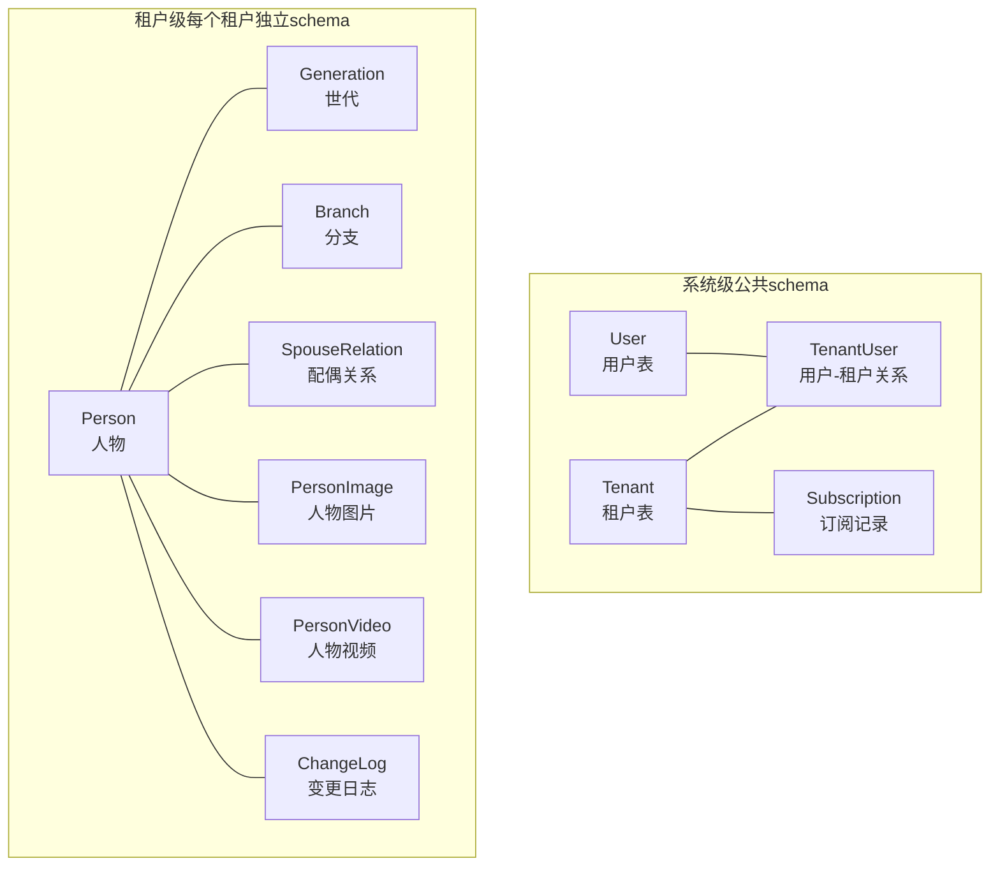
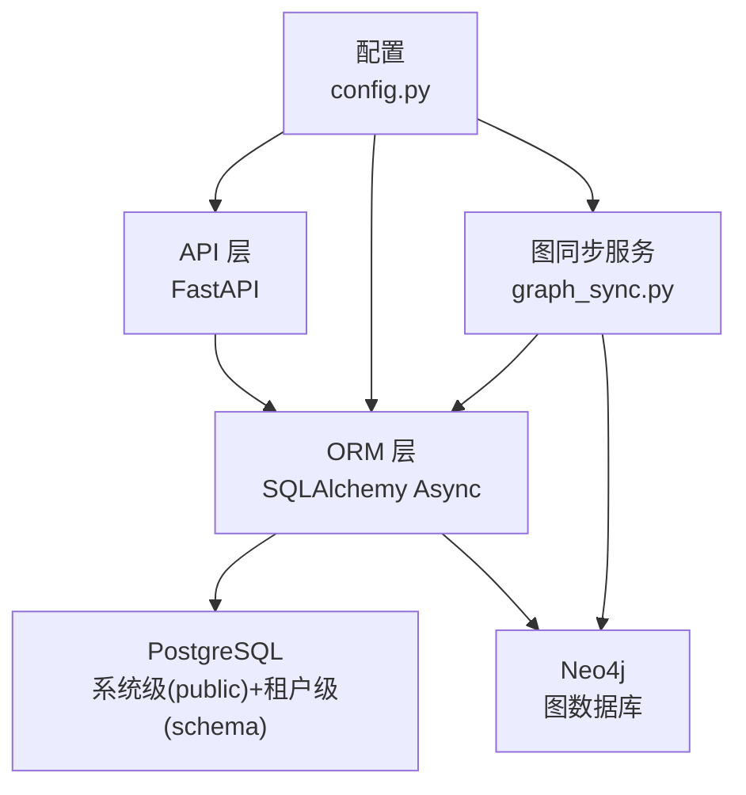
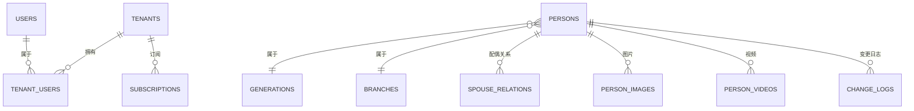
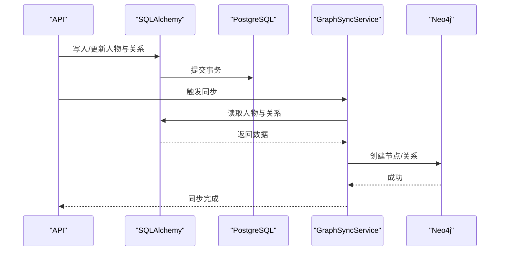
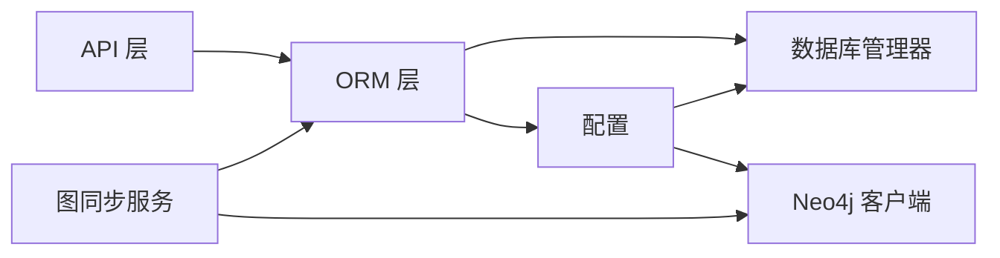

# 数据模型设计

<cite>
**本文引用的文件**
- [backend/app/models/system.py](file://backend/app/models/system.py)
- [backend/app/models/tenant.py](file://backend/app/models/tenant.py)
- [backend/migrations/versions/001_initial.py](file://backend/migrations/versions/001_initial.py)
- [backend/app/core/database.py](file://backend/app/core/database.py)
- [backend/app/services/neo4j_service.py](file://backend/app/services/neo4j_service.py)
- [backend/app/services/graph_sync.py](file://backend/app/services/graph_sync.py)
- [backend/app/api/v1/endpoints/persons.py](file://backend/app/api/v1/endpoints/persons.py)
- [backend/app/api/v1/endpoints/family_tree.py](file://backend/app/api/v1/endpoints/family_tree.py)
- [scripts/create_tenant.py](file://scripts/create_tenant.py)
- [scripts/sync_neo4j.py](file://scripts/sync_neo4j.py)
- [docker-compose.yml](file://docker-compose.yml)
- [backend/app/core/config.py](file://backend/app/core/config.py)
</cite>

## 目录
1. [简介](#简介)
2. [项目结构](#项目结构)
3. [核心组件](#核心组件)
4. [架构总览](#架构总览)
5. [详细组件分析](#详细组件分析)
6. [依赖分析](#依赖分析)
7. [性能考虑](#性能考虑)
8. [故障排查指南](#故障排查指南)
9. [结论](#结论)
10. [附录](#附录)

## 简介
本文件为多租户族谱管理系统提供系统级与租户级数据模型设计文档。系统采用“系统级模型”（用户、角色、权限等）与“租户级模型”（人物、关系、分支等）分层设计，并结合 PostgreSQL 与 Neo4j 的混合存储方案：以关系型数据库承载结构化数据与审计日志，以图数据库支撑复杂族谱关系查询与可视化。

## 项目结构
- 后端采用 FastAPI + SQLAlchemy Async + Alembic 迁移，系统级模型位于公共 schema，租户级模型按租户 schema 隔离。
- 图数据库采用 Neo4j，提供族谱关系的高效查询与树形可视化能力。
- 提供租户初始化脚本与图数据库同步脚本，确保数据一致性。

图表来源
- [backend/app/models/system.py:23-68](file://backend/app/models/system.py#L23-L68)
- [backend/app/models/system.py:123-168](file://backend/app/models/system.py#L123-L168)
- [backend/app/models/system.py:183-223](file://backend/app/models/system.py#L183-L223)
- [backend/app/models/tenant.py:23-39](file://backend/app/models/tenant.py#L23-L39)
- [backend/app/models/tenant.py:42-58](file://backend/app/models/tenant.py#L42-L58)
- [backend/app/models/tenant.py:61-132](file://backend/app/models/tenant.py#L61-L132)
- [backend/app/models/tenant.py:144-164](file://backend/app/models/tenant.py#L144-L164)
- [backend/app/models/tenant.py:167-188](file://backend/app/models/tenant.py#L167-L188)
- [backend/app/models/tenant.py:191-211](file://backend/app/models/tenant.py#L191-L211)
- [backend/app/models/tenant.py:214-243](file://backend/app/models/tenant.py#L214-L243)

章节来源
- [backend/app/models/system.py:23-223](file://backend/app/models/system.py#L23-L223)
- [backend/app/models/tenant.py:23-244](file://backend/app/models/tenant.py#L23-L244)

## 核心组件
- 系统级模型（公共 schema）
  - 租户（Tenant）：标识租户、隔离参数、计费配置、状态与元数据。
  - 用户（User）：统一身份认证与系统角色。
  - 用户-租户关系（TenantUser）：在租户内的角色与关联人物。
  - 订阅（Subscription）：租户付费计划与有效期。
- 租户级模型（每个租户独立 schema）
  - 世代（Generation）：代际划分。
  - 分支（Branch）：支系标识与开基祖。
  - 人物（Person）：基本信息、性别、代际、双亲、分支、生卒、墓葬、隐私等级、排序与头像。
  - 配偶关系（SpouseRelation）：多任配偶、关系类型与排序。
  - 人物图片（PersonImage）、人物视频（PersonVideo）：多媒体资源。
  - 变更日志（ChangeLog）：审计追踪与审核流程。

章节来源
- [backend/app/models/system.py:23-223](file://backend/app/models/system.py#L23-L223)
- [backend/app/models/tenant.py:23-244](file://backend/app/models/tenant.py#L23-L244)

## 架构总览
系统采用“关系型数据库 + 图数据库”的混合架构：
- PostgreSQL（系统级：public；租户级：各租户 schema）：存储结构化数据、权限与审计。
- Neo4j：存储人物节点与关系边，支持族谱查询与可视化。
- 同步机制：通过图同步服务将 PostgreSQL 中的人物与关系写入 Neo4j。

图表来源
- [backend/app/core/database.py:24-171](file://backend/app/core/database.py#L24-L171)
- [backend/app/services/neo4j_service.py:12-53](file://backend/app/services/neo4j_service.py#L12-L53)
- [backend/app/services/graph_sync.py:20-104](file://backend/app/services/graph_sync.py#L20-L104)
- [backend/app/core/config.py:11-89](file://backend/app/core/config.py#L11-L89)

章节来源
- [docker-compose.yml:1-145](file://docker-compose.yml#L1-L145)
- [backend/app/core/database.py:24-171](file://backend/app/core/database.py#L24-L171)
- [backend/app/services/neo4j_service.py:12-373](file://backend/app/services/neo4j_service.py#L12-L373)
- [backend/app/services/graph_sync.py:20-157](file://backend/app/services/graph_sync.py#L20-L157)
- [backend/app/core/config.py:11-89](file://backend/app/core/config.py#L11-L89)

## 详细组件分析

### 系统级数据模型（公共 schema）
- 租户（Tenant）
  - 主键：UUID（id）
  - 字段：名称、slug（唯一索引）、姓氏、schema 名称（唯一）、Neo4j 数据库名、套餐、限额、状态、过期时间、设置（JSONB）、时间戳
  - 约束：唯一性（slug、schema_name），默认值与时间戳
  - 关系：一对多（users）
- 用户（User）
  - 主键：UUID（id）
  - 字段：邮箱（唯一索引）、手机（唯一）、密码哈希、昵称、头像、系统角色、状态、邮箱验证、登录时间、时间戳
  - 关系：一对多（tenants）
- 用户-租户关系（TenantUser）
  - 主键：UUID（id）
  - 外键：user_id → users.id（级联删除），tenant_id → tenants.id（级联删除）
  - 字段：角色、关联人物、加入时间、邀请人
  - 权限属性：管理员、可编辑、可复核
- 订阅（Subscription）
  - 主键：UUID（id）
  - 外键：tenant_id → tenants.id（级联删除）
  - 字段：计划、金额、币种、起止时间、状态、支付单号、创建时间

章节来源
- [backend/app/models/system.py:23-68](file://backend/app/models/system.py#L23-L68)
- [backend/app/models/system.py:73-112](file://backend/app/models/system.py#L73-L112)
- [backend/app/models/system.py:123-181](file://backend/app/models/system.py#L123-L181)
- [backend/app/models/system.py:183-223](file://backend/app/models/system.py#L183-L223)
- [backend/migrations/versions/001_initial.py:25-104](file://backend/migrations/versions/001_initial.py#L25-L104)

### 租户级数据模型（每个租户独立 schema）
- 世代（Generation）
  - 主键：自增整数（id），字段：代数、是否配偶、名称、描述
- 分支（Branch）
  - 主键：UUID（id），字段：名称、开基祖、描述、地点
- 人物（Person）
  - 主键：UUID（id）
  - 字段：姓名、字号、号、别名、辈分字、性别、是否外族、代际、双亲、分支、生卒、出生地、农历生日、墓葬信息、生平、成就、后裔分布、备注、可见性、排序、头像、时间戳、创建者
- 配偶关系（SpouseRelation）
  - 主键：UUID（id），字段：丈夫、妻子、关系类型、来源信息、排序
- 人物图片（PersonImage）、人物视频（PersonVideo）
  - 主键：UUID（id），字段：人物、URL、标题、描述、排序、时间戳
- 变更日志（ChangeLog）
  - 主键：UUID（id），字段：表名、记录ID、动作、旧值/新值（JSONB）、变更人、变更时间、审核状态、审核人、审核时间、审核备注

章节来源
- [backend/app/models/tenant.py:23-39](file://backend/app/models/tenant.py#L23-L39)
- [backend/app/models/tenant.py:42-58](file://backend/app/models/tenant.py#L42-L58)
- [backend/app/models/tenant.py:61-132](file://backend/app/models/tenant.py#L61-L132)
- [backend/app/models/tenant.py:144-164](file://backend/app/models/tenant.py#L144-L164)
- [backend/app/models/tenant.py:167-188](file://backend/app/models/tenant.py#L167-L188)
- [backend/app/models/tenant.py:191-211](file://backend/app/models/tenant.py#L191-L211)
- [backend/app/models/tenant.py:214-243](file://backend/app/models/tenant.py#L214-L243)

### 实体关系与约束

图表来源
- [backend/app/models/system.py:23-223](file://backend/app/models/system.py#L23-L223)
- [backend/app/models/tenant.py:23-244](file://backend/app/models/tenant.py#L23-L244)

章节来源
- [backend/app/models/system.py:23-223](file://backend/app/models/system.py#L23-L223)
- [backend/app/models/tenant.py:23-244](file://backend/app/models/tenant.py#L23-L244)

### 数据访问模式与业务规则
- API 层（FastAPI）
  - 人物接口：列表、生成器、分支、详情、创建、更新、删除、配偶关系管理
  - 族谱接口：树形结构、祖先链、后代树、统计
- 业务规则
  - 创建人物时校验父/母性别与存在性、代际与分支存在性
  - 删除人物前检查是否存在子代或配偶关系
  - 配偶关系唯一性校验
  - 可见性字段限制（公开/成员/私有）

章节来源
- [backend/app/api/v1/endpoints/persons.py:172-493](file://backend/app/api/v1/endpoints/persons.py#L172-L493)
- [backend/app/api/v1/endpoints/persons.py:497-648](file://backend/app/api/v1/endpoints/persons.py#L497-L648)
- [backend/app/api/v1/endpoints/family_tree.py:43-270](file://backend/app/api/v1/endpoints/family_tree.py#L43-L270)

### 图数据库模型（Neo4j）设计与使用场景
- 节点标签
  - Person：节点标签包含租户数据库名，用于隔离不同租户的图数据
- 边类型
  - FATHER_OF / CHILD_OF：父子关系双向
  - MARRIED：配偶关系，属性包含关系类型与排序
- 查询能力
  - 家族树（指定根节点与深度）
  - 祖先链、后代树、兄弟姐妹、配偶列表
  - 按代际成员查询、模糊姓名搜索、树结构导出
- 同步策略
  - 全量同步：将人物与关系从 PostgreSQL 写入 Neo4j
  - 快速同步：仅同步单个节点及其父关系
  - 清理重建：清空租户图后全量重同步

图表来源
- [backend/app/services/graph_sync.py:64-92](file://backend/app/services/graph_sync.py#L64-L92)
- [backend/app/services/neo4j_service.py:65-144](file://backend/app/services/neo4j_service.py#L65-L144)

章节来源
- [backend/app/services/neo4j_service.py:12-373](file://backend/app/services/neo4j_service.py#L12-L373)
- [backend/app/services/graph_sync.py:20-157](file://backend/app/services/graph_sync.py#L20-L157)
- [scripts/sync_neo4j.py:14-41](file://scripts/sync_neo4j.py#L14-L41)

### 示例数据
- 租户
  - 字段：名称、slug、姓氏、schema_name、neo4j_database、套餐、限额、状态、设置
- 用户
  - 字段：邮箱、手机号、密码哈希、昵称、头像、系统角色、状态、验证状态、时间戳
- 用户-租户关系
  - 字段：用户ID、租户ID、角色、关联人物、加入时间、邀请人
- 订阅
  - 字段：租户ID、计划、金额、币种、起止时间、状态、支付单号、创建时间
- 人物
  - 字段：姓名、性别、代际、双亲、分支、生卒、墓葬、隐私、排序、头像、时间戳、创建者
- 配偶关系
  - 字段：丈夫、妻子、关系类型、来源信息、排序
- 变更日志
  - 字段：表名、记录ID、动作、旧值/新值、变更人、变更时间、审核状态、审核人、审核备注

章节来源
- [backend/app/models/system.py:23-223](file://backend/app/models/system.py#L23-L223)
- [backend/app/models/tenant.py:61-243](file://backend/app/models/tenant.py#L61-L243)

## 依赖分析
- 组件耦合
  - API 层依赖 ORM 与中间件进行租户隔离
  - ORM 层依赖数据库管理器与配置
  - 图同步服务依赖 Neo4j 客户端与 ORM
- 外部依赖
  - PostgreSQL（系统级与租户级）
  - Neo4j（图数据库）
  - Redis（缓存）、Meilisearch（搜索）、MinIO（对象存储）

图表来源
- [backend/app/core/database.py:24-171](file://backend/app/core/database.py#L24-L171)
- [backend/app/core/config.py:11-89](file://backend/app/core/config.py#L11-L89)
- [backend/app/services/neo4j_service.py:12-53](file://backend/app/services/neo4j_service.py#L12-L53)
- [backend/app/services/graph_sync.py:20-104](file://backend/app/services/graph_sync.py#L20-L104)

章节来源
- [docker-compose.yml:1-145](file://docker-compose.yml#L1-L145)
- [backend/app/core/database.py:24-171](file://backend/app/core/database.py#L24-L171)
- [backend/app/core/config.py:11-89](file://backend/app/core/config.py#L11-L89)

## 性能考虑
- 数据库连接池
  - PostgreSQL：默认池大小与溢出配置，SQLite 使用独立文件避免 schema 限制
- 查询优化
  - 人物列表：按代际、排序、ID 分页查询
  - 搜索：基于 ILIKE 的模糊匹配
- 图数据库
  - 通过标签与属性建立索引（建议在 Neo4j 中为常用查询字段建立索引）
  - 合理设置查询深度，避免深度过大导致性能下降
- 缓存与搜索
  - Redis：用于会话、令牌、热点数据缓存
  - Meilisearch：全文检索与搜索建议
- 文件存储
  - MinIO：对象存储，支持缩略图与 CDN 加速

章节来源
- [backend/app/core/database.py:33-96](file://backend/app/core/database.py#L33-L96)
- [backend/app/api/v1/endpoints/persons.py:172-235](file://backend/app/api/v1/endpoints/persons.py#L172-L235)
- [docker-compose.yml:43-88](file://docker-compose.yml#L43-L88)

## 故障排查指南
- 租户初始化失败
  - 检查 PostgreSQL schema 是否创建成功，确认租户 slug 对应的 schema 名称
  - 确认 Neo4j 连接可用，社区版通过标签隔离而非多数据库
- 同步异常
  - 核对租户 schema 与 Neo4j 数据库名一致
  - 查看同步日志，确认节点与关系创建成功
- API 报错
  - 人物删除失败：检查是否存在子代或配偶关系
  - 配偶关系重复：确认唯一性约束
- 连接问题
  - 检查数据库与图数据库健康检查状态
  - 确认环境变量与容器端口映射正确

章节来源
- [scripts/create_tenant.py:18-44](file://scripts/create_tenant.py#L18-L44)
- [scripts/create_tenant.py:208-229](file://scripts/create_tenant.py#L208-L229)
- [backend/app/services/graph_sync.py:94-104](file://backend/app/services/graph_sync.py#L94-L104)
- [backend/app/api/v1/endpoints/persons.py:444-493](file://backend/app/api/v1/endpoints/persons.py#L444-L493)
- [docker-compose.yml:16-41](file://docker-compose.yml#L16-L41)

## 结论
本设计通过“系统级 + 租户级”的分层模型与 PostgreSQL + Neo4j 的混合架构，实现了多租户族谱管理的数据隔离、高性能查询与可视化展示。通过完善的迁移、同步与 API 控制，保障了数据一致性与业务规则执行。建议在生产环境中进一步完善索引、缓存与监控体系，并持续演进图查询与搜索能力。

## 附录
- 数据库初始化与迁移
  - 初始迁移脚本创建系统级表与索引
- 租户生命周期
  - 初始化：创建 schema、表、Neo4j 数据库
  - 运行：同步数据、提供 API 与可视化
  - 归档：可基于时间戳与可见性策略进行数据归档
- 版本管理
  - 使用 Alembic 进行数据库版本控制，迁移脚本记录演进历史

章节来源
- [backend/migrations/versions/001_initial.py:21-113](file://backend/migrations/versions/001_initial.py#L21-L113)
- [scripts/create_tenant.py:18-44](file://scripts/create_tenant.py#L18-L44)
- [scripts/create_tenant.py:69-206](file://scripts/create_tenant.py#L69-L206)