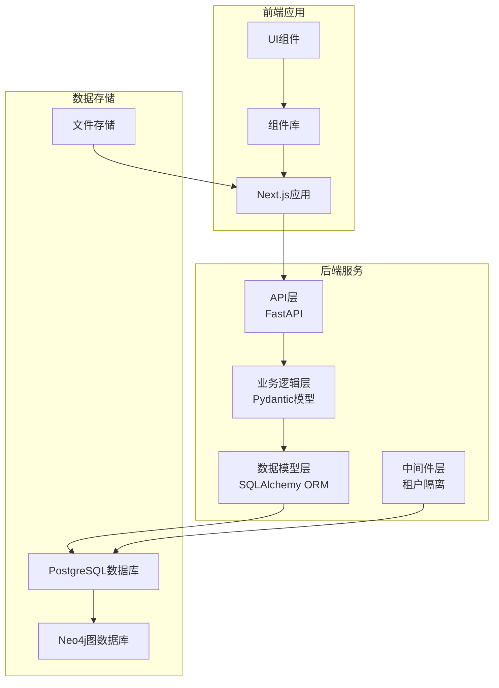
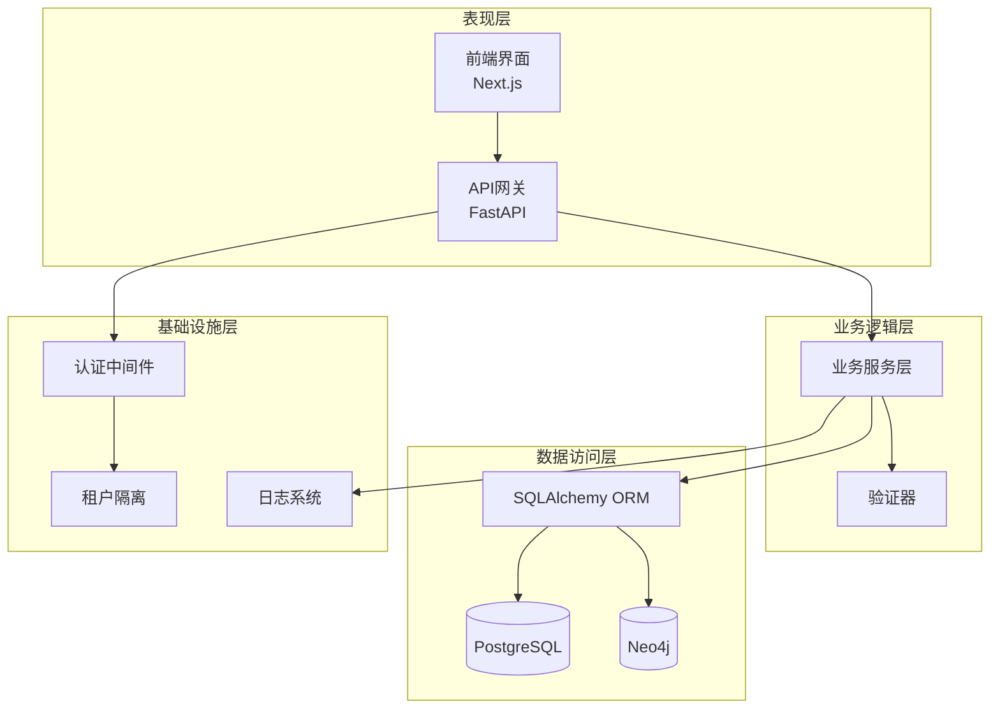
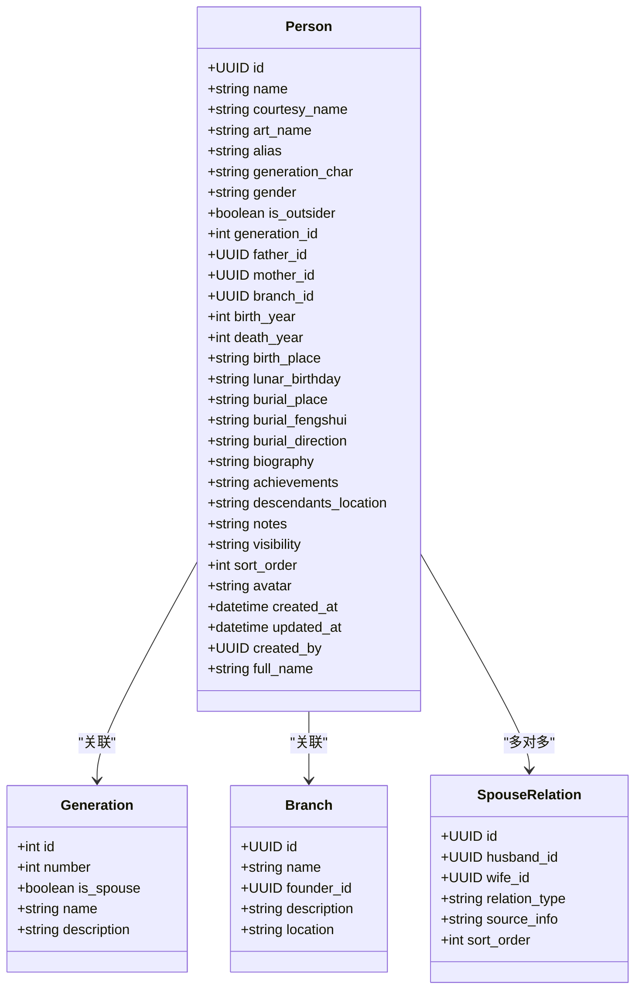
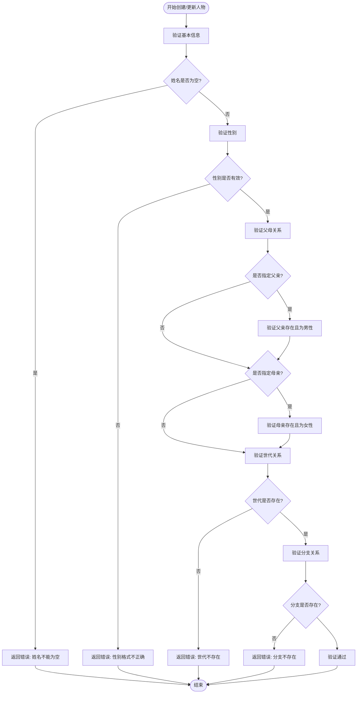
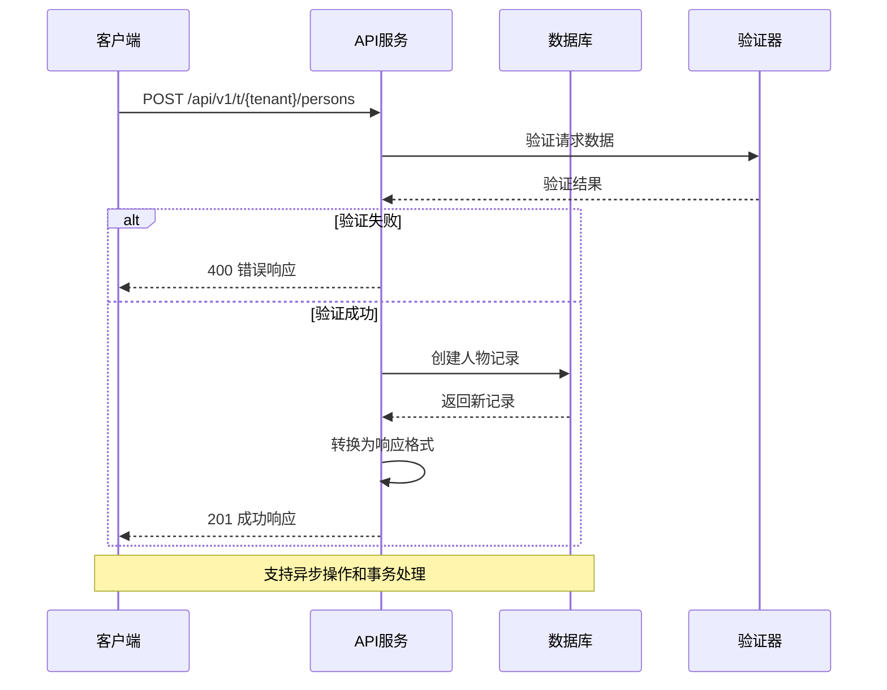
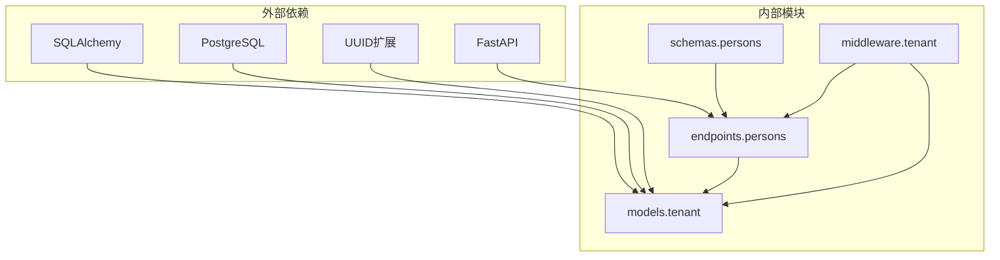

# 人物实体模型

<cite>
**本文档引用的文件**
- [backend/app/models/tenant.py](file://backend/app/models/tenant.py)
- [backend/app/api/v1/endpoints/persons.py](file://backend/app/api/v1/endpoints/persons.py)
- [django_backup/genealogy/models.py](file://django_backup/genealogy/models.py)
- [backend/tests/test_persons.py](file://backend/tests/test_persons.py)
- [scripts/migrate_data.py](file://scripts/migrate_data.py)
</cite>

## 目录
1. [简介](#简介)
2. [项目结构概览](#项目结构概览)
3. [核心组件](#核心组件)
4. [架构概览](#架构概览)
5. [详细组件分析](#详细组件分析)
6. [依赖关系分析](#依赖关系分析)
7. [性能考虑](#性能考虑)
8. [故障排除指南](#故障排除指南)
9. [结论](#结论)

## 简介

本文档详细描述了多租户族谱管理系统中的人物实体(Person)的完整数据模型。该系统采用现代化的前后端分离架构，支持多租户隔离，提供完整的族谱管理功能。人物实体作为系统的核心数据模型，承载着丰富的称谓信息、生卒信息、墓葬信息以及隐私设置等关键属性。

系统基于PostgreSQL数据库，使用SQLAlchemy ORM进行数据持久化，并通过FastAPI提供RESTful API接口。前端采用Next.js框架构建响应式用户界面，支持多租户环境下的个性化配置。

## 项目结构概览

系统采用模块化的项目结构，主要分为以下几个核心部分：

**图表来源**
- [backend/app/models/tenant.py:61-142](file://backend/app/models/tenant.py#L61-L142)
- [backend/app/api/v1/endpoints/persons.py:17-17](file://backend/app/api/v1/endpoints/persons.py#L17-L17)

**章节来源**
- [backend/app/models/tenant.py:1-244](file://backend/app/models/tenant.py#L1-L244)
- [backend/app/api/v1/endpoints/persons.py:1-717](file://backend/app/api/v1/endpoints/persons.py#L1-L717)

## 核心组件

### 人物实体模型(Person)

人物实体是整个族谱系统的核心数据模型，定义了完整的个人信息结构：

#### 基本信息字段
- **姓名(name)**: 必填字段，最大长度100字符，存储人物的主要姓名
- **字(courtesy_name)**: 可选字段，最大长度100字符，存储人物的表字
- **号(art_name)**: 可选字段，最大长度100字符，存储人物的号
- **别名(alias)**: 可选字段，最大长度100字符，存储人物的别名
- **字号(generation_char)**: 可选字段，最大长度10字符，存储辈分字

#### 称谓信息处理
系统实现了智能的称谓组合逻辑，通过`full_name`属性动态生成完整的称谓字符串。该属性按照以下优先级组合：
1. 基本姓名（始终包含）
2. 字（courtesy_name，可选）
3. 号（art_name，可选）

**章节来源**
- [backend/app/models/tenant.py:134-142](file://backend/app/models/tenant.py#L134-L142)
- [backend/app/api/v1/endpoints/persons.py:95-142](file://backend/app/api/v1/endpoints/persons.py#L95-L142)

### 性别与外人标识

#### 性别字段(gender)
- 类型：字符串，长度为1
- 默认值："M"（男性）
- 枚举值：M（男性）、F（女性）
- 作用：标识人物的性别属性，影响配偶关系的验证逻辑

#### 外人标识(is_outsider)
- 类型：布尔值
- 默认值：False
- 作用：标识人物是否为外族配偶
- 影响：当设置为True时，会影响世代选项和配偶关系的选择逻辑

**章节来源**
- [backend/app/models/tenant.py:79-81](file://backend/app/models/tenant.py#L79-L81)
- [django_backup/genealogy/models.py:121-125](file://django_backup/genealogy/models.py#L121-L125)

### 家庭关系字段

#### 世代关联(generation_id)
- 类型：整数，可选
- 关联模型：Generation
- 作用：建立人物与世代的关联关系
- 影响：决定人物在族谱中的辈分位置

#### 分支关联(branch_id)
- 类型：UUID，可选
- 关联模型：Branch
- 作用：标识人物所属的支系分支
- 影响：用于族谱树的分支管理和展示

#### 父母关系
- **父亲(father_id)**: UUID，可选，必须为男性
- **母亲(mother_id)**: UUID，可选，必须为女性
- 验证：创建时会验证父母亲的存在性和性别正确性

**章节来源**
- [backend/app/models/tenant.py:83-91](file://backend/app/models/tenant.py#L83-L91)
- [backend/app/api/v1/endpoints/persons.py:332-350](file://backend/app/api/v1/endpoints/persons.py#L332-L350)

### 生卒信息字段

#### 出生信息
- **出生年份(birth_year)**: 整数，可选，范围0-2100
- **出生地(birth_place)**: 字符串，可选，最大长度200字符
- **农历生日(lunar_birthday)**: 字符串，可选，最大长度50字符

#### 死亡信息
- **死亡年份(death_year)**: 整数，可选，范围0-2100

#### 生卒信息验证
系统提供了严格的数值范围验证，确保历史数据的合理性。

**章节来源**
- [backend/app/models/tenant.py:93-97](file://backend/app/models/tenant.py#L93-L97)
- [backend/app/api/v1/endpoints/persons.py:38-41](file://backend/app/api/v1/endpoints/persons.py#L38-L41)

### 墓葬相关信息

#### 墓葬字段
- **安葬地点(burial_place)**: 字符串，可选，最大长度300字符
- **风水(burial_fengshui)**: 字符串，可选，最大长度200字符
- **朝向(burial_direction)**: 字符串，可选，最大长度100字符

这些字段专门用于记录人物的墓葬信息，支持传统的风水文化需求。

**章节来源**
- [backend/app/models/tenant.py:99-102](file://backend/app/models/tenant.py#L99-L102)

### 传记与备注字段

#### 传记信息
- **生平(biography)**: 文本字段，可选，存储人物生平简介
- **成就(achievements)**: 文本字段，可选，存储人物主要事迹
- **后代分布(descendants_location)**: 文本字段，可选，存储后代分布情况

#### 备注信息
- **notes**: 文本字段，可选，存储其他备注信息

**章节来源**
- [backend/app/models/tenant.py:104-108](file://backend/app/models/tenant.py#L104-L108)

### 隐私与排序设置

#### 隐私设置(visibility)
- 类型：字符串，最大长度20字符
- 可选值：public（公开）、member（成员可见）、private（私有）
- 默认值：public
- 作用：控制人物信息的可见性级别

#### 排序字段(sort_order)
- 类型：整数，默认值：0
- 作用：控制人物在列表中的显示顺序
- 影响：结合世代信息进行综合排序

**章节来源**
- [backend/app/models/tenant.py:110-114](file://backend/app/models/tenant.py#L110-L114)
- [backend/app/api/v1/endpoints/persons.py:52-53](file://backend/app/api/v1/endpoints/persons.py#L52-L53)

### 媒体与时间戳字段

#### 头像字段(avatar)
- 类型：字符串，可选，最大长度500字符
- 作用：存储人物头像的URL或文件路径

#### 时间戳字段
- **created_at**: 日期时间，服务器默认值为当前时间
- **updated_at**: 日期时间，创建时为当前时间，更新时自动更新
- **created_by**: UUID，可选，标识创建者

**章节来源**
- [backend/app/models/tenant.py:116-130](file://backend/app/models/tenant.py#L116-L130)

## 架构概览

系统采用分层架构设计，确保各层职责清晰分离：

**图表来源**
- [backend/app/models/tenant.py:1-244](file://backend/app/models/tenant.py#L1-L244)
- [backend/app/api/v1/endpoints/persons.py:1-17](file://backend/app/api/v1/endpoints/persons.py#L1-L17)

## 详细组件分析

### Person模型类结构

**图表来源**
- [backend/app/models/tenant.py:61-142](file://backend/app/models/tenant.py#L61-L142)

### 数据验证流程

系统在创建和更新人物信息时执行严格的数据验证：

**图表来源**
- [backend/app/api/v1/endpoints/persons.py:323-365](file://backend/app/api/v1/endpoints/persons.py#L323-L365)

### API交互流程

**图表来源**
- [backend/app/api/v1/endpoints/persons.py:323-402](file://backend/app/api/v1/endpoints/persons.py#L323-L402)

**章节来源**
- [backend/app/api/v1/endpoints/persons.py:172-235](file://backend/app/api/v1/endpoints/persons.py#L172-L235)
- [backend/app/api/v1/endpoints/persons.py:323-402](file://backend/app/api/v1/endpoints/persons.py#L323-L402)

## 依赖关系分析

系统中的依赖关系体现了清晰的分层设计：

**图表来源**
- [backend/app/models/tenant.py:1-244](file://backend/app/models/tenant.py#L1-L244)
- [backend/app/api/v1/endpoints/persons.py:1-17](file://backend/app/api/v1/endpoints/persons.py#L1-L17)

### 数据模型依赖

人物实体与其他模型之间的关系：

- **Generation**: 一对多关系，人物属于特定世代
- **Branch**: 多对一关系，人物属于特定分支
- **Person**: 自引用关系，通过父子ID建立家庭关系
- **SpouseRelation**: 多对多关系，通过中间表建立配偶关系

**章节来源**
- [backend/app/models/tenant.py:23-164](file://backend/app/models/tenant.py#L23-L164)

## 性能考虑

### 查询优化策略

1. **索引设计**
   - UUID主键自动创建索引
   - 常用查询字段建立适当索引
   - 复合索引优化复杂查询

2. **查询优化**
   - 使用延迟加载避免不必要的关联查询
   - 实现分页机制处理大量数据
   - 缓存常用查询结果

3. **并发处理**
   - 异步数据库操作支持高并发
   - 连接池管理优化数据库连接
   - 事务边界明确避免锁竞争

### 存储优化

1. **数据压缩**
   - 文本字段合理使用VARCHAR限制
   - 数值字段选择合适的数据类型
   - 日期时间字段使用TIMEZONE支持

2. **文件存储**
   - 头像和多媒体文件使用独立存储
   - 文件路径存储而非文件内容
   - 支持CDN加速静态资源

## 故障排除指南

### 常见问题及解决方案

#### 数据验证错误
- **问题**: 创建人物时返回400错误
- **原因**: 姓名为空、性别格式不正确、父母关系无效
- **解决**: 检查请求数据格式，确保必填字段完整

#### 关系约束错误
- **问题**: 更新人物时提示关系冲突
- **原因**: 父母性别与指定不符，或世代/分支不存在
- **解决**: 验证关联对象的有效性，确保数据一致性

#### 性能问题
- **问题**: 查询响应缓慢
- **原因**: 缺少必要索引，查询条件不当
- **解决**: 添加适当的数据库索引，优化查询语句

**章节来源**
- [backend/app/api/v1/endpoints/persons.py:332-350](file://backend/app/api/v1/endpoints/persons.py#L332-L350)
- [backend/tests/test_persons.py:40-91](file://backend/tests/test_persons.py#L40-L91)

## 结论

多租户族谱管理系统的人员实体模型设计充分考虑了传统族谱管理的需求和现代技术架构的要求。通过合理的字段设计、严格的数据验证、清晰的关联关系和完善的API接口，系统能够有效支持复杂的族谱数据管理需求。

该模型的关键优势包括：
- **完整性**: 覆盖了传统族谱管理的所有关键信息
- **灵活性**: 支持多租户隔离和个性化配置
- **可扩展性**: 模块化设计便于功能扩展
- **可靠性**: 严格的数据验证和错误处理机制

未来可以考虑的功能增强包括：
- 更丰富的生卒信息支持（具体日期）
- 多语言称谓支持
- 媒体文件的版本管理
- 更精细的权限控制机制