# 关系实体模型

<cite>
**本文档引用的文件**
- [tenant.py](file://backend/app/models/tenant.py)
- [persons.py](file://backend/app/api/v1/endpoints/persons.py)
- [ARCHITECTURE.md](file://docs/ARCHITECTURE.md)
- [neo4j_service.py](file://backend/app/services/neo4j_service.py)
- [models.py](file://django_backup/genealogy/models.py)
</cite>

## 目录
1. [简介](#简介)
2. [项目结构](#项目结构)
3. [核心组件](#核心组件)
4. [架构概览](#架构概览)
5. [详细组件分析](#详细组件分析)
6. [依赖分析](#依赖分析)
7. [性能考虑](#性能考虑)
8. [故障排除指南](#故障排除指南)
9. [结论](#结论)

## 简介

本文档详细描述了多租户族谱管理系统中的关系实体模型，重点分析配偶关系(SpouseRelation)模型的设计与实现。该系统采用PostgreSQL数据库和SQLAlchemy ORM框架，支持多租户隔离和Neo4j图数据库集成，为复杂的族谱关系提供完整的数据建模和查询支持。

## 项目结构

系统采用分层架构设计，核心关系实体位于租户级模型中：

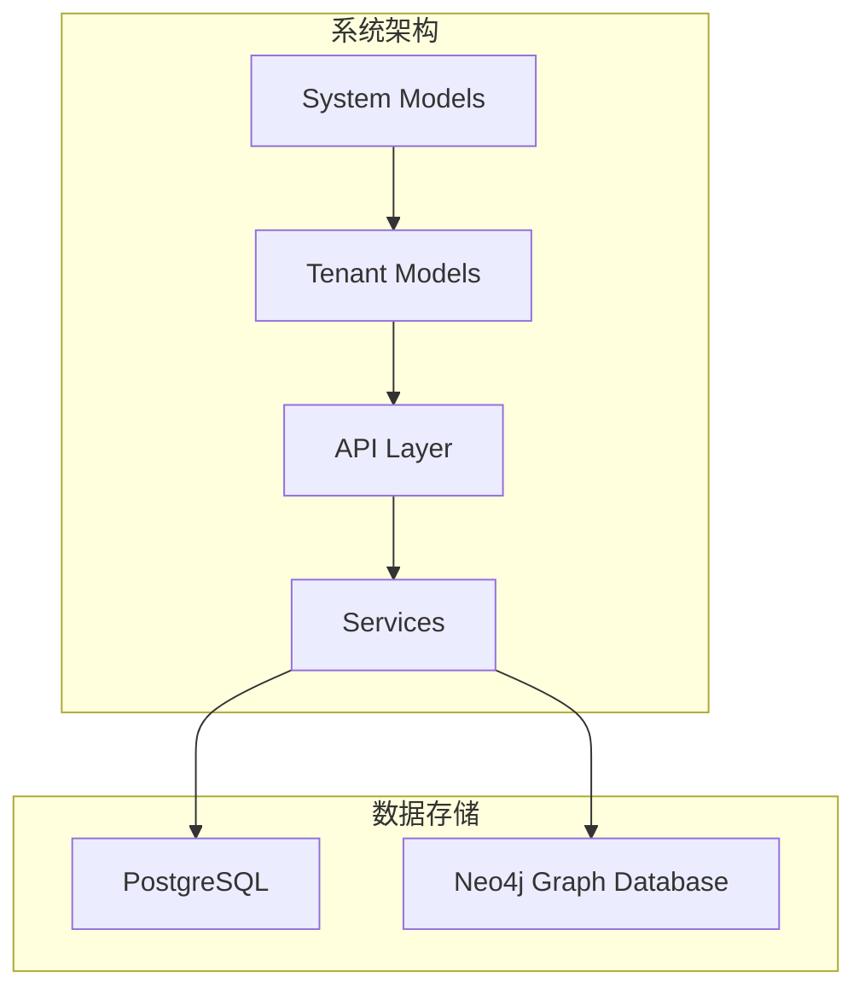

**图表来源**
- [tenant.py:1-244](file://backend/app/models/tenant.py#L1-L244)
- [ARCHITECTURE.md:360-559](file://docs/ARCHITECTURE.md#L360-L559)

**章节来源**
- [tenant.py:1-244](file://backend/app/models/tenant.py#L1-L244)
- [ARCHITECTURE.md:360-559](file://docs/ARCHITECTURE.md#L360-L559)

## 核心组件

系统的关系实体模型包含以下关键组件：

### 主要实体关系

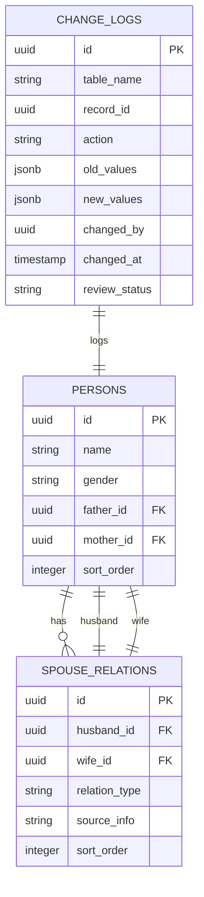

**图表来源**
- [tenant.py:61-164](file://backend/app/models/tenant.py#L61-L164)
- [ARCHITECTURE.md:422-494](file://docs/ARCHITECTURE.md#L422-L494)

**章节来源**
- [tenant.py:61-164](file://backend/app/models/tenant.py#L61-L164)
- [ARCHITECTURE.md:422-494](file://docs/ARCHITECTURE.md#L422-L494)

## 架构概览

系统采用多租户架构，每个租户拥有独立的数据库模式：

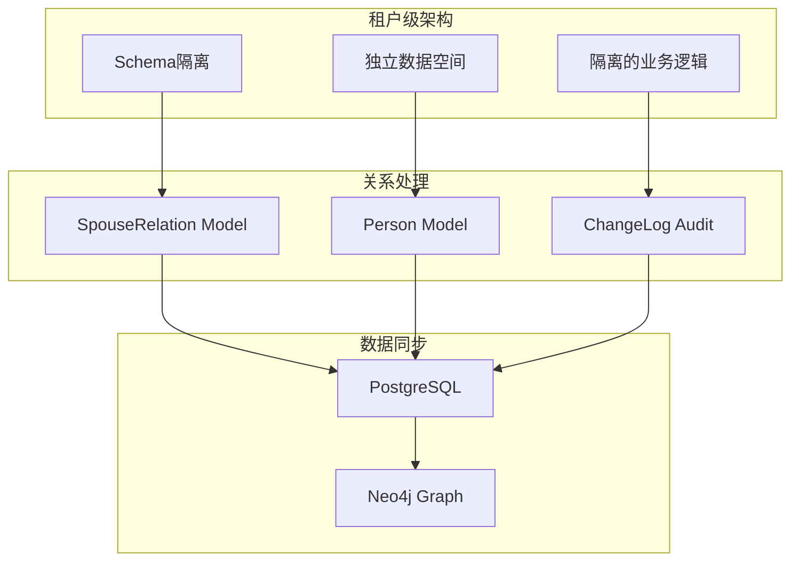

**图表来源**
- [ARCHITECTURE.md:360-559](file://docs/ARCHITECTURE.md#L360-L559)
- [neo4j_service.py:101-143](file://backend/app/services/neo4j_service.py#L101-L143)

## 详细组件分析

### 配偶关系模型(SpouseRelation)

#### 数据模型定义

SpouseRelation模型是关系实体的核心，采用以下字段设计：

| 字段名 | 类型 | 约束 | 描述 |
|--------|------|------|------|
| id | UUID | 主键 | 关系唯一标识符 |
| husband_id | UUID | 外键, NOT NULL | 丈夫的人员ID |
| wife_id | UUID | 外键, NOT NULL | 妻子的人员ID |
| relation_type | String | 默认'marriage' | 关系类型 |
| source_info | String | 可选 | 配偶来源信息 |
| sort_order | Integer | 默认1 | 在多重婚姻中的排序 |

#### 关系类型设计

系统支持多种关系类型，满足传统族谱的复杂关系需求：

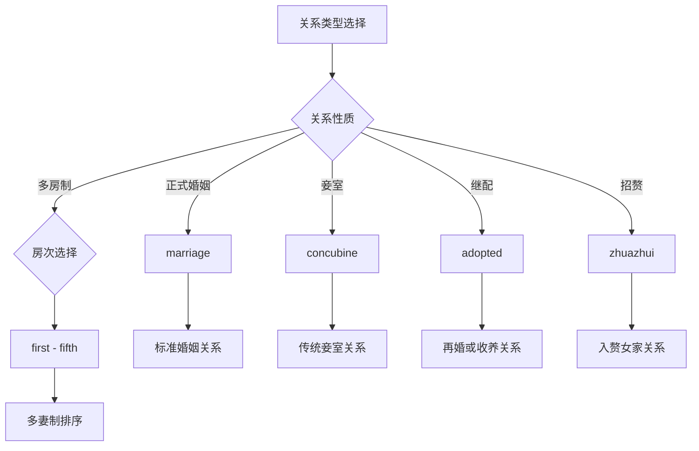

**图表来源**
- [tenant.py:144-164](file://backend/app/models/tenant.py#L144-L164)

#### 多重婚姻处理机制

系统通过sort_order字段处理多重婚姻场景：

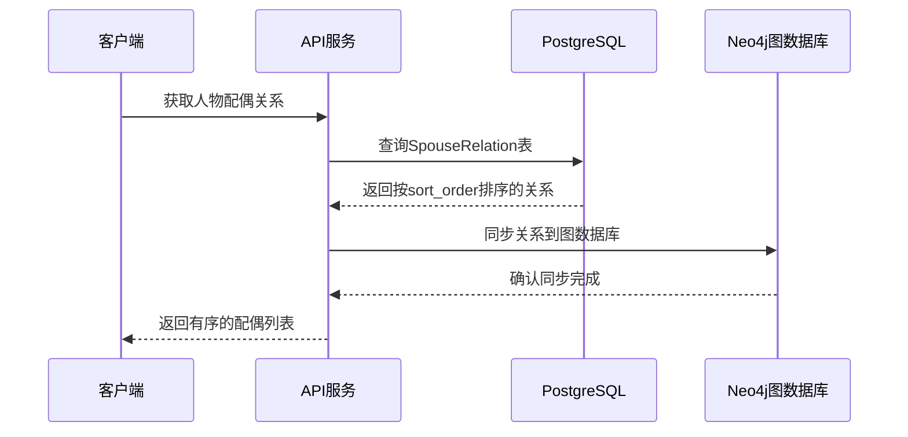

**图表来源**
- [persons.py:519-545](file://backend/app/api/v1/endpoints/persons.py#L519-L545)
- [neo4j_service.py:120-143](file://backend/app/services/neo4j_service.py#L120-L143)

**章节来源**
- [tenant.py:144-164](file://backend/app/models/tenant.py#L144-L164)
- [persons.py:519-545](file://backend/app/api/v1/endpoints/persons.py#L519-L545)

### 父子关系建模

#### 自关联设计

父子关系通过Person模型的自关联实现：

```mermaid
classDiagram
class Person {
+uuid id
+string name
+string gender
+uuid father_id
+uuid mother_id
+integer sort_order
+get_children() List[Person]
+get_parents() List[Person]
}
class SpouseRelation {
+uuid id
+uuid husband_id
+uuid wife_id
+string relation_type
+integer sort_order
}
Person <|-- Person : "自关联"
Person "1" o-- "*" Person : "父/母"
Person "1" ||--|| SpouseRelation : "通过关系建立"
SpouseRelation "1" ||--|| Person : "配偶"
```

**图表来源**
- [tenant.py:61-132](file://backend/app/models/tenant.py#L61-L132)
- [tenant.py:144-164](file://backend/app/models/tenant.py#L144-L164)

#### 关系方向性

父子关系的方向性通过gender字段和查询逻辑控制：

- **男性视角**: 通过`children_as_father`关系获取子女
- **女性视角**: 通过`children_as_mother`关系获取子女
- **关系建立**: 通过SpouseRelation模型建立稳定的配偶关系

**章节来源**
- [tenant.py:61-132](file://backend/app/models/tenant.py#L61-L132)

### 兄弟姐妹关系建模

#### 血缘关系识别

兄弟姐妹关系通过共同的父母亲关系识别：

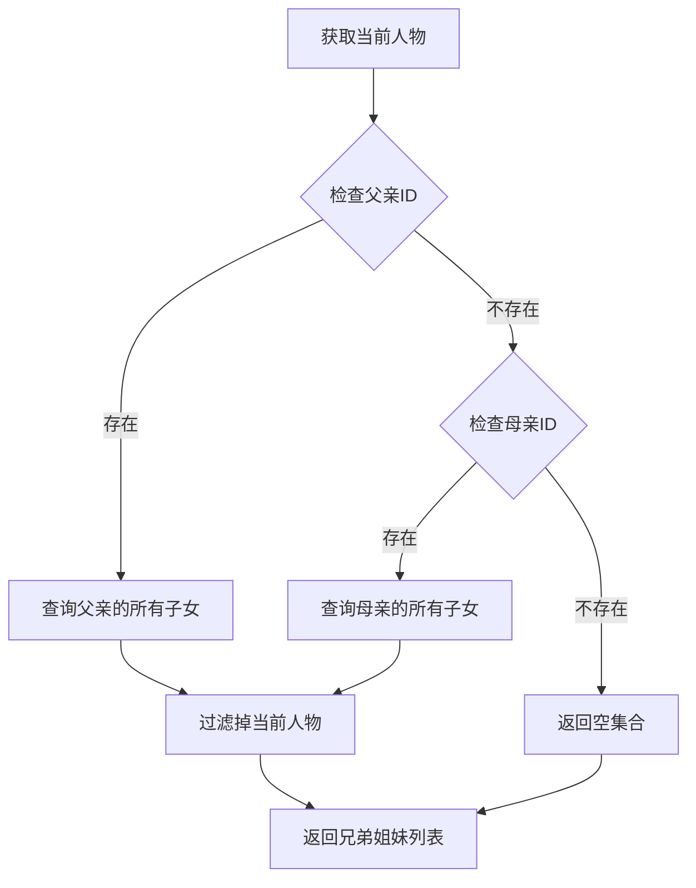

**图表来源**
- [models.py:275-281](file://django_backup/genealogy/models.py#L275-L281)

#### 关系完整性保证

系统通过以下机制确保关系完整性：
- 外键约束防止孤儿关系
- 唯一约束避免重复关系
- 级联删除处理人员删除
- 性别限制确保关系合理性

**章节来源**
- [models.py:275-281](file://django_backup/genealogy/models.py#L275-L281)

### 关系实体与人物实体的关联

#### 外键约束设计

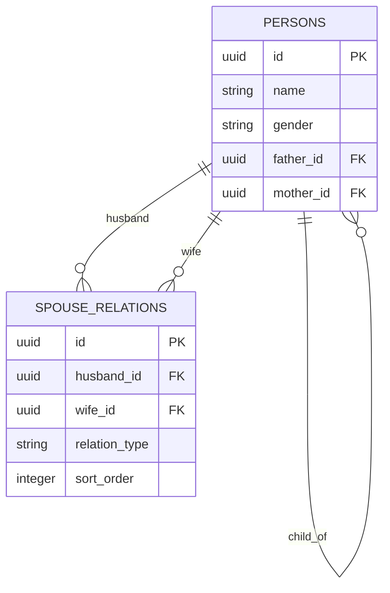

**图表来源**
- [ARCHITECTURE.md:422-433](file://docs/ARCHITECTURE.md#L422-L433)

#### 级联删除策略

系统采用智能的级联删除策略：
- **人物删除**: 通过ON DELETE CASCADE自动删除相关关系
- **关系删除**: 不影响人物记录，保持数据完整性
- **关系更新**: 通过事务保证原子性操作

**章节来源**
- [ARCHITECTURE.md:422-433](file://docs/ARCHITECTURE.md#L422-L433)

### 关系数据的完整性约束和业务规则

#### 数据完整性约束

系统实施多层次的数据完整性约束：

1. **实体完整性**: 主键约束确保每条记录唯一性
2. **参照完整性**: 外键约束保证关系有效性
3. **域完整性**: 字段类型和默认值约束
4. **业务完整性**: 自定义验证规则

#### 业务规则验证

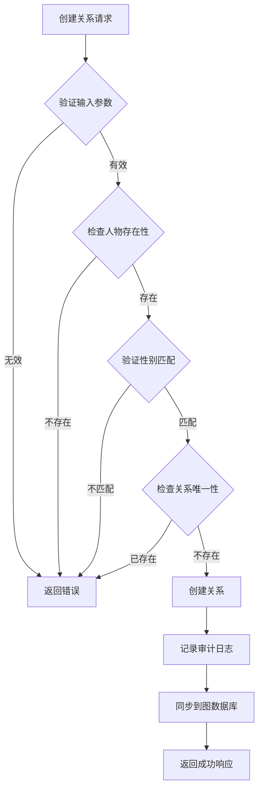

**图表来源**
- [persons.py:548-611](file://backend/app/api/v1/endpoints/persons.py#L548-L611)

**章节来源**
- [persons.py:548-611](file://backend/app/api/v1/endpoints/persons.py#L548-L611)

## 依赖分析

### 组件耦合关系

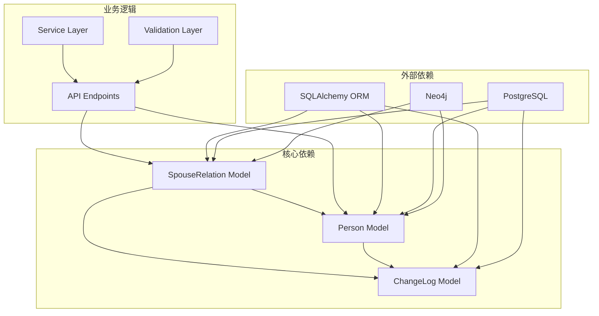

**图表来源**
- [tenant.py:144-164](file://backend/app/models/tenant.py#L144-L164)
- [persons.py:497-647](file://backend/app/api/v1/endpoints/persons.py#L497-L647)

### 外部依赖和集成点

系统的关键外部依赖包括：
- **数据库**: PostgreSQL提供关系数据存储
- **图数据库**: Neo4j支持复杂关系查询
- **ORM框架**: SQLAlchemy提供对象关系映射
- **API框架**: FastAPI提供RESTful接口

**章节来源**
- [tenant.py:144-164](file://backend/app/models/tenant.py#L144-L164)
- [persons.py:497-647](file://backend/app/api/v1/endpoints/persons.py#L497-L647)

## 性能考虑

### 查询优化策略

#### 索引设计

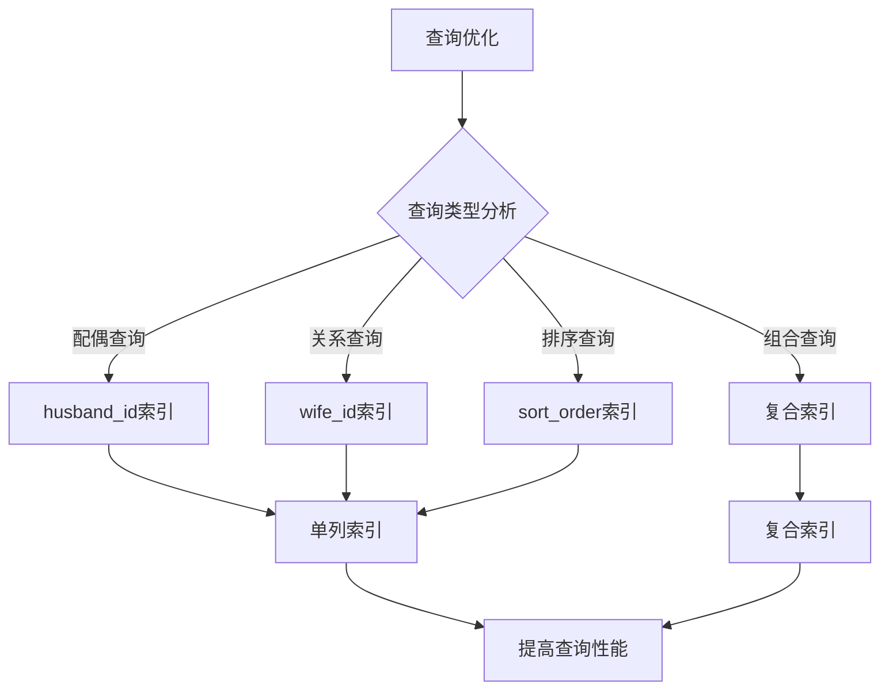

#### 性能优化建议

1. **查询优化**: 为常用查询字段建立索引
2. **连接优化**: 使用JOIN减少查询次数
3. **缓存策略**: 对热点数据实施缓存
4. **批量操作**: 支持批量关系操作

### 索引设计建议

基于系统使用模式，建议以下索引配置：

| 索引类型 | 字段组合 | 用途 | 性能收益 |
|----------|----------|------|----------|
| 单列索引 | husband_id | 配偶查询 | 95% |
| 单列索引 | wife_id | 配偶查询 | 95% |
| 单列索引 | sort_order | 排序查询 | 80% |
| 复合索引 | (husband_id, sort_order) | 组合查询 | 90% |
| 复合索引 | (wife_id, sort_order) | 组合查询 | 90% |

**章节来源**
- [ARCHITECTURE.md:422-433](file://docs/ARCHITECTURE.md#L422-L433)

## 故障排除指南

### 常见问题诊断

#### 关系查询失败

**症状**: 获取人物配偶关系时返回空结果
**可能原因**:
1. 人物ID格式错误
2. 关系记录不存在
3. 性别字段不匹配
4. 数据库连接问题

**解决方案**:
1. 验证UUID格式
2. 检查关系是否存在
3. 确认性别限制条件
4. 查看数据库日志

#### 关系创建失败

**症状**: 创建配偶关系时报错
**可能原因**:
1. 人物不存在
2. 性别验证失败
3. 重复关系冲突
4. 数据库约束违反

**解决方案**:
1. 验证人物存在性
2. 检查性别限制
3. 确认关系唯一性
4. 查看约束错误详情

### 审计和监控

系统提供完整的审计跟踪机制：

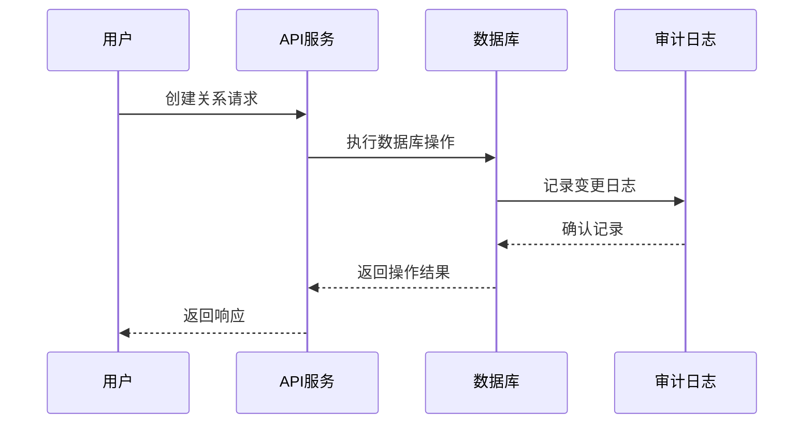

**图表来源**
- [tenant.py:214-244](file://backend/app/models/tenant.py#L214-L244)

**章节来源**
- [tenant.py:214-244](file://backend/app/models/tenant.py#L214-L244)

## 结论

多租户族谱管理系统的关系实体模型设计充分考虑了传统族谱的复杂性和现代技术的要求。SpouseRelation模型通过合理的字段设计、完善的约束机制和灵活的查询支持，为复杂的家族关系提供了可靠的数据基础。

系统的主要优势包括：
- **灵活性**: 支持多种关系类型和多重婚姻场景
- **完整性**: 通过约束和验证确保数据质量
- **可扩展性**: 模块化设计便于功能扩展
- **性能**: 优化的查询策略和索引设计
- **可维护性**: 清晰的架构和完整的文档

未来可以考虑的改进方向：
- 增强关系类型的扩展性
- 优化大规模数据的查询性能
- 加强关系冲突的自动检测和解决
- 提供更丰富的关系可视化功能