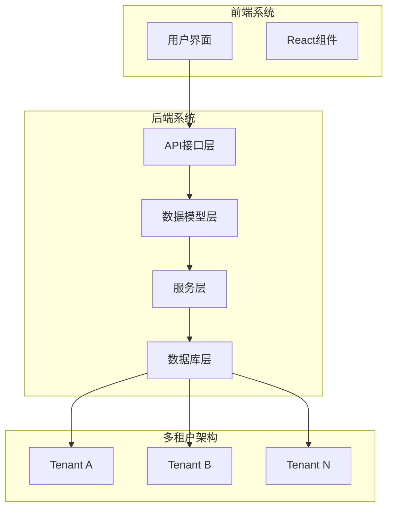
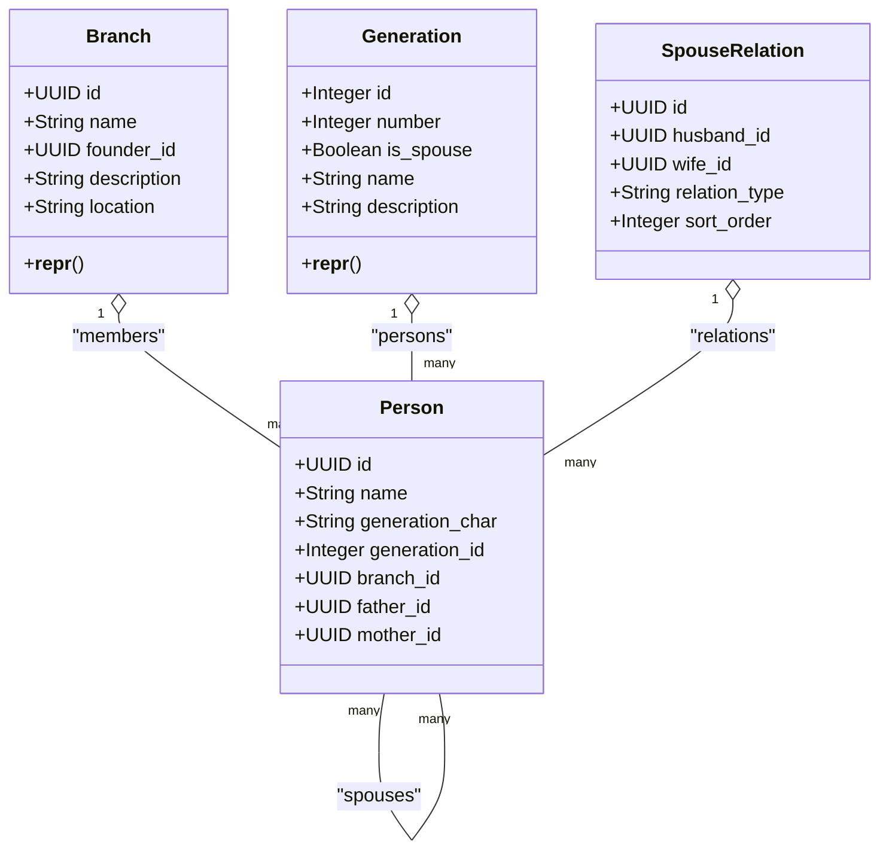
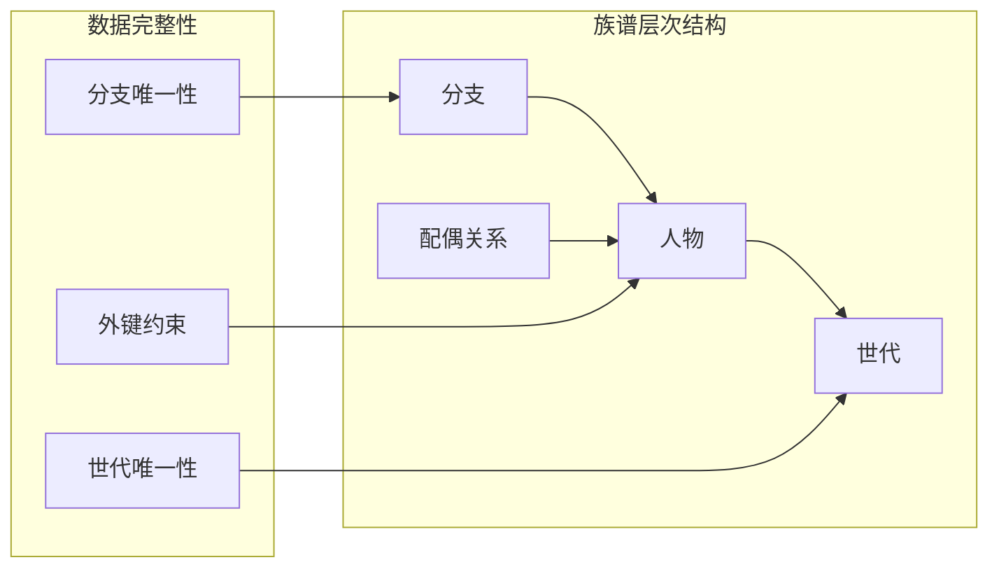
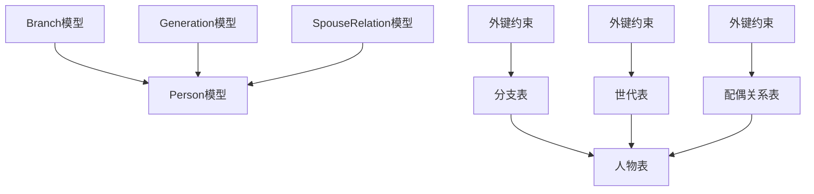
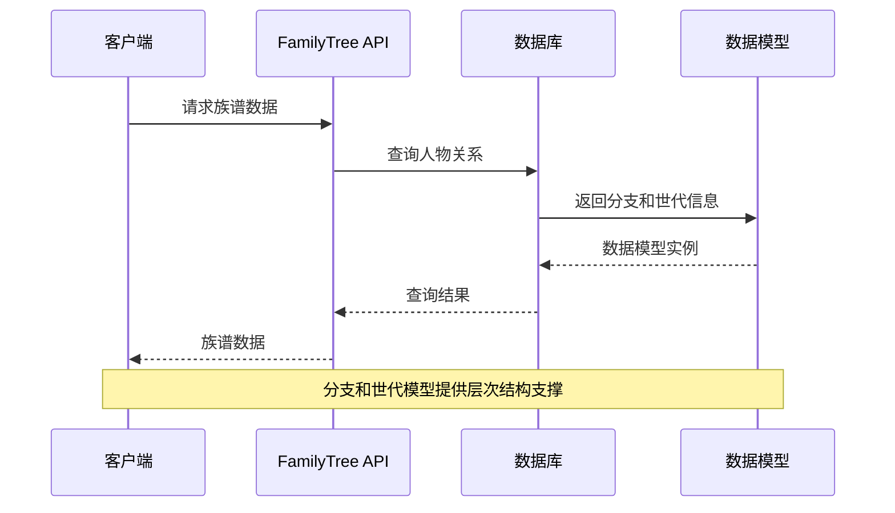

# 分支与世代模型

<cite>
**本文档引用的文件**
- [tenant.py](file://backend/app/models/tenant.py)
- [models.py](file://django_backup/genealogy/models.py)
- [001_initial.py](file://backend/migrations/versions/001_initial.py)
- [family_tree.py](file://backend/app/api/v1/endpoints/family_tree.py)
- [graph_sync.py](file://backend/app/services/graph_sync.py)
- [database.py](file://backend/app/core/database.py)
- [init_system.py](file://scripts/init_system.py)
- [create_tenant.py](file://scripts/create_tenant.py)
- [0005_alter_generation_options_generation_is_spouse_and_more.py](file://django_backup/genealogy/migrations/0005_alter_generation_options_generation_is_spouse_and_more.py)
</cite>

## 目录
1. [简介](#简介)
2. [项目结构](#项目结构)
3. [核心组件](#核心组件)
4. [架构概览](#架构概览)
5. [详细组件分析](#详细组件分析)
6. [依赖关系分析](#依赖关系分析)
7. [性能考虑](#性能考虑)
8. [故障排除指南](#故障排除指南)
9. [结论](#结论)

## 简介

本文档详细描述了多租户族谱管理系统中分支(Branch)和世代(Generation)模型的数据结构设计。这两个核心模型构成了族谱系统的基础层次结构，为人物关系管理和族谱可视化提供了数据支撑。

系统采用多租户架构，每个租户拥有独立的数据库模式，确保数据隔离和安全性。分支模型负责组织族谱的地理和血缘分支，而世代模型则定义了人物的辈分层级结构。

## 项目结构

系统采用前后端分离的架构设计，主要包含以下关键组件：



**图表来源**
- [database.py:58-106](file://backend/app/core/database.py#L58-L106)
- [tenant.py:23-58](file://backend/app/models/tenant.py#L23-L58)

**章节来源**
- [database.py:1-171](file://backend/app/core/database.py#L1-L171)
- [tenant.py:1-244](file://backend/app/models/tenant.py#L1-L244)

## 核心组件

### 分支模型(Branch)

分支模型代表族谱中的不同分支或支系，具有以下核心属性：

- **标识符**: 使用UUID作为主键，确保全局唯一性
- **名称**: 分支名称，最大长度100字符
- **创始人**: 关联到人物实体的外键，可为空
- **描述**: 分支的详细描述信息
- **位置**: 分支分布的地理位置信息

### 世代模型(Generation)

世代模型定义了人物的辈分层级，具有以下属性：

- **标识符**: 自增整数主键
- **世代编号**: 人物所在的具体世代
- **是否为配偶世代**: 布尔标志，区分主系和配偶系
- **名称**: 世代的显示名称
- **描述**: 世代的详细描述

**章节来源**
- [tenant.py:23-58](file://backend/app/models/tenant.py#L23-L58)
- [models.py:38-78](file://django_backup/genealogy/models.py#L38-L78)

## 架构概览

系统采用分层架构，结合多租户设计理念：



**图表来源**
- [tenant.py:42-164](file://backend/app/models/tenant.py#L42-L164)

## 详细组件分析

### 分支模型详细设计

分支模型在系统中扮演着组织和分类的角色：

#### 字段设计分析

| 字段名 | 数据类型 | 约束条件 | 描述 |
|--------|----------|----------|------|
| id | UUID | 主键, 默认生成 | 分支唯一标识符 |
| name | String(100) | 非空 | 分支名称 |
| founder_id | UUID | 外键, 可空 | 创始人关联 |
| description | Text | 可空 | 分支描述信息 |
| location | String(200) | 可空 | 分布地区 |

#### 关联关系

分支与人物实体存在一对多的关系：
- 一个分支可以包含多个成员人物
- 一个人物只能属于一个分支
- 创始人与分支是一对一关系

### 世代模型详细设计

世代模型是族谱系统的核心层次结构：

#### 字段设计分析

| 字段名 | 数据类型 | 约束条件 | 描述 |
|--------|----------|----------|------|
| id | Integer | 主键, 自增 | 世代唯一标识符 |
| number | Integer | 非空 | 世代编号 |
| is_spouse | Boolean | 默认False | 是否为配偶世代 |
| name | String(50) | 可空 | 世代名称 |
| description | Text | 可空 | 世代描述 |

#### 唯一性约束

系统实现了复合唯一性约束：
- `(number, is_spouse)` 组合必须唯一
- 确保同一世代不会重复定义
- 支持主系和配偶系的并存

### 世代字符(generation_char)的应用

世代字符是人物命名系统的重要组成部分：

#### 功能作用

1. **辈分标识**: 通过特定字符表示人物在家族中的辈分
2. **命名规范**: 为人物起名提供统一的辈分标准
3. **家族传承**: 体现家族传统的命名方式

#### 在系统中的集成

- 人物模型包含 `generation_char` 字段
- 与世代编号配合使用
- 支持多种命名传统和文化背景

### 分支与世代的关系

分支和世代模型共同构成族谱的层次结构：



**图表来源**
- [tenant.py:61-164](file://backend/app/models/tenant.py#L61-L164)

## 依赖关系分析

### 数据模型依赖



**图表来源**
- [tenant.py:42-164](file://backend/app/models/tenant.py#L42-L164)

### API依赖关系

家族树API依赖于分支和世代模型：



**图表来源**
- [family_tree.py:43-150](file://backend/app/api/v1/endpoints/family_tree.py#L43-L150)

**章节来源**
- [tenant.py:144-164](file://backend/app/models/tenant.py#L144-L164)
- [family_tree.py:1-274](file://backend/app/api/v1/endpoints/family_tree.py#L1-L274)

## 性能考虑

### 数据库索引设计

#### 当前索引策略

系统在关键字段上建立了适当的索引：

1. **租户表索引**
   - `ix_tenants_slug`: 用于快速查找租户
   - `ix_users_email`: 用于用户认证

2. **族谱相关索引**
   - 世代表的 `(number, is_spouse)` 唯一约束
   - 人物表的 `generation_id` 和 `branch_id` 外键

#### 查询优化建议

1. **分支查询优化**
   ```sql
   -- 为分支查询建立索引
   CREATE INDEX idx_branches_founder_id ON branches(founder_id);
   CREATE INDEX idx_branches_name ON branches(name);
   ```

2. **世代查询优化**
   ```sql
   -- 为世代查询建立复合索引
   CREATE INDEX idx_generations_number_spouse ON generations(number, is_spouse);
   ```

3. **人物查询优化**
   ```sql
   -- 为人物关系查询建立索引
   CREATE INDEX idx_persons_generation_id ON persons(generation_id);
   CREATE INDEX idx_persons_branch_id ON persons(branch_id);
   CREATE INDEX idx_persons_father_id ON persons(father_id);
   CREATE INDEX idx_persons_mother_id ON persons(mother_id);
   ```

### 缓存策略

1. **世代信息缓存**
   - 频繁访问的世代信息可以缓存
   - 减少数据库查询压力

2. **分支统计缓存**
   - 分支成员数量等统计信息缓存
   - 提高统计查询性能

### 连接池配置

系统使用异步连接池管理数据库连接：

- **默认连接池**: 适用于系统表操作
- **租户专用连接池**: 每个租户独立的连接池
- **连接复用**: 减少连接建立开销

**章节来源**
- [database.py:24-106](file://backend/app/core/database.py#L24-L106)
- [init_system.py:79-109](file://scripts/init_system.py#L79-L109)

## 故障排除指南

### 常见问题及解决方案

#### 1. 分支数据不一致

**问题症状**:
- 分支成员查询异常
- 分支统计信息错误

**排查步骤**:
1. 检查分支表的外键约束
2. 验证人物表的 `branch_id` 字段
3. 确认分支删除操作的级联行为

**解决方案**:
```sql
-- 检查分支完整性
SELECT b.id, b.name, COUNT(p.id) as member_count
FROM branches b
LEFT JOIN persons p ON b.id = p.branch_id
GROUP BY b.id, b.name
HAVING COUNT(p.id) = 0;
```

#### 2. 世代唯一性冲突

**问题症状**:
- 创建世代时出现唯一性约束错误
- 世代编号重复

**排查步骤**:
1. 检查 `(number, is_spouse)` 组合的唯一性
2. 验证世代编号的逻辑顺序
3. 确认配偶世代和主系世代的区分

**解决方案**:
```sql
-- 查找重复的世代定义
SELECT number, is_spouse, COUNT(*) as count
FROM generations
GROUP BY number, is_spouse
HAVING COUNT(*) > 1;
```

#### 3. 多租户数据隔离问题

**问题症状**:
- 租户间数据交叉
- 查询返回其他租户数据

**排查步骤**:
1. 检查 `search_path` 设置
2. 验证租户Schema隔离
3. 确认数据库连接的租户上下文

**解决方案**:
```sql
-- 验证当前租户Schema
SHOW search_path;

-- 切换到正确租户Schema
SET search_path TO tenant_specific_schema;
```

### 监控和诊断

#### 数据库监控指标

1. **连接使用率**
   - 连接池利用率
   - 等待队列长度
   - 连接超时次数

2. **查询性能指标**
   - 查询响应时间
   - 慢查询统计
   - 索引使用率

3. **数据完整性检查**
   - 外键约束违反次数
   - 唯一性约束冲突
   - 约束缺失检测

**章节来源**
- [database.py:124-171](file://backend/app/core/database.py#L124-L171)
- [graph_sync.py:20-104](file://backend/app/services/graph_sync.py#L20-L104)

## 结论

分支与世代模型为多租户族谱管理系统提供了坚实的层次结构基础。通过合理的数据设计和约束机制，系统能够有效管理复杂的族谱关系，支持大规模数据的高效查询和维护。

### 设计优势

1. **清晰的层次结构**: 分支和世代的明确划分便于理解和维护
2. **强数据完整性**: 外键约束和唯一性约束确保数据一致性
3. **灵活的扩展性**: 支持不同文化背景下的命名传统
4. **高效的查询性能**: 合理的索引设计和缓存策略

### 未来改进方向

1. **查询优化**: 进一步优化复杂查询的执行计划
2. **数据迁移**: 提供更完善的跨版本数据迁移工具
3. **监控增强**: 加强系统性能和数据质量的监控能力
4. **用户体验**: 改进分支和世代管理的用户界面

通过持续的优化和完善，该模型将继续为多租户族谱管理提供可靠的技术支撑。