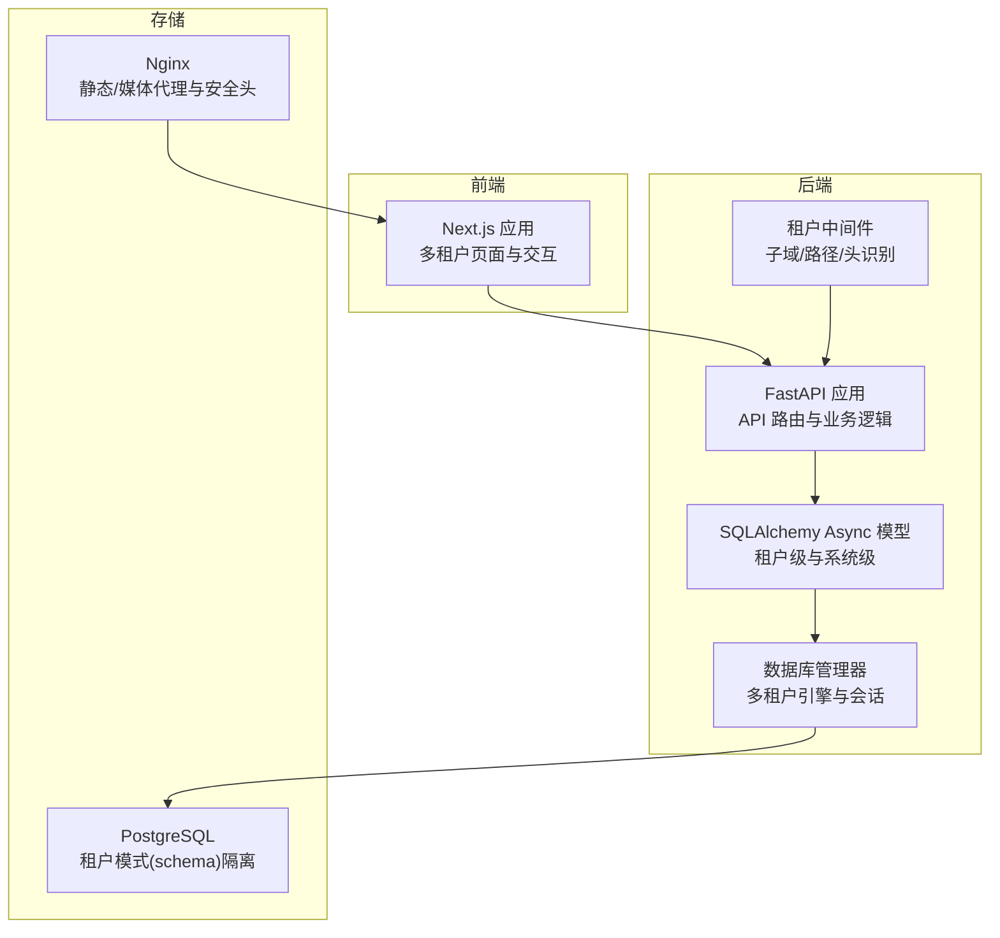
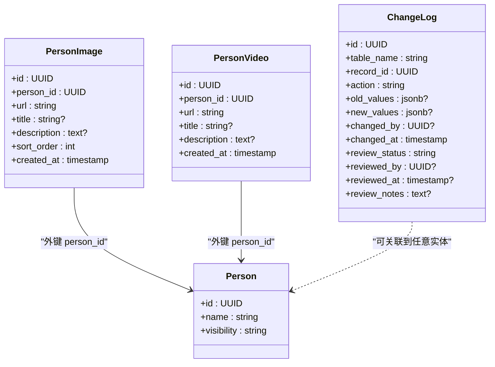
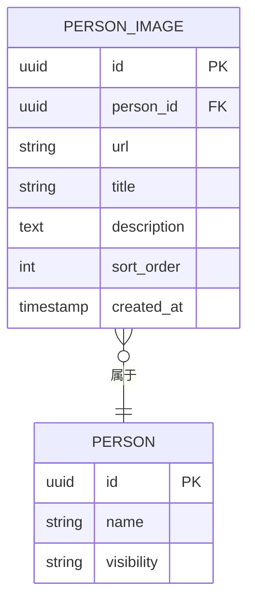
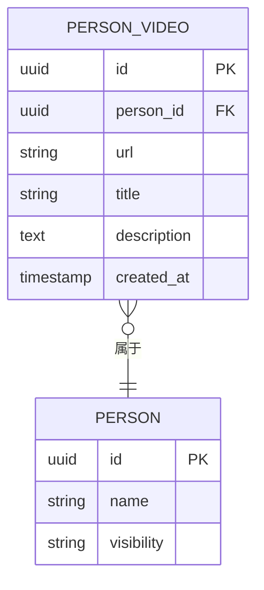
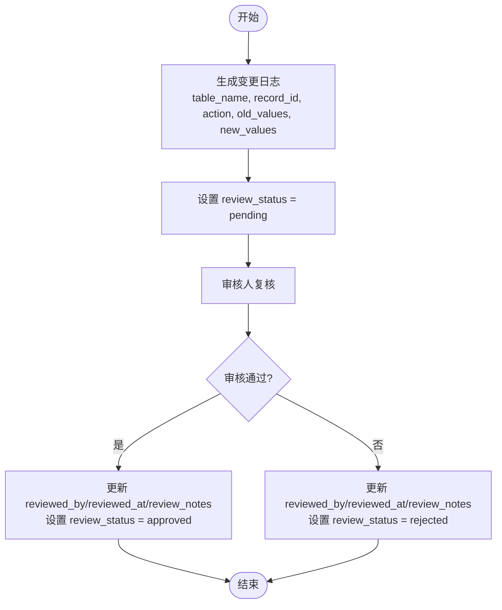
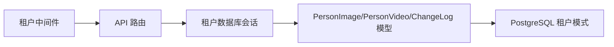

# 媒体与审计模型

<cite>
**本文引用的文件**
- [backend/app/models/tenant.py](file://backend/app/models/tenant.py)
- [backend/app/models/system.py](file://backend/app/models/system.py)
- [django_backup/genealogy/models.py](file://django_backup/genealogy/models.py)
- [backend/migrations/versions/001_initial.py](file://backend/migrations/versions/001_initial.py)
- [docs/ARCHITECTURE.md](file://docs/ARCHITECTURE.md)
- [scripts/create_tenant.py](file://scripts/create_tenant.py)
- [scripts/init3init_system.py](file://scripts/init3init_system.py)
- [backend/app/api/v1/endpoints/persons.py](file://backend/app/api/v1/endpoints/persons.py)
- [backend/app/middleware/tenant.py](file://backend/app/middleware/tenant.py)
- [backend/app/core/database.py](file://backend/app/core/database.py)
- [backend/app/core/security.py](file://backend/app/core/security.py)
- [django_backup/templates/genealogy/upload_media.html](file://django_backup/templates/genealogy/upload_media.html)
- [django_backup/genealogy/views.py](file://django_backup/genealogy/views.py)
- [django_backup/nginx.conf](file://django_backup/nginx.conf)
</cite>

## 目录
1. [引言](#引言)
2. [项目结构](#项目结构)
3. [核心组件](#核心组件)
4. [架构概览](#架构概览)
5. [详细组件分析](#详细组件分析)
6. [依赖分析](#依赖分析)
7. [性能考虑](#性能考虑)
8. [故障排查指南](#故障排查指南)
9. [结论](#结论)
10. [附录](#附录)

## 引言
本文件聚焦于多租户族谱管理系统的媒体与审计相关数据模型，系统性梳理人物图片(PersonImage)、人物视频(PersonVideo)以及变更日志(ChangeLog)的设计与实现，明确字段定义、业务语义、变更审核流程、审计查询接口与权限控制机制，并总结媒体文件的存储策略与访问控制方案。文档同时给出代码级架构图与流程图，帮助读者快速理解系统在数据层与应用层的协作方式。

## 项目结构
本项目采用前后端分离与多租户架构：
- 后端采用 FastAPI + SQLAlchemy Async + PostgreSQL，租户级数据按模式(schema)隔离，系统级数据位于 public 模式。
- 前端采用 Next.js，提供多租户站点入口与可视化界面。
- 历史 Django 版本保留了媒体模型与上传逻辑，便于对比与迁移参考。

图表来源
- [backend/app/models/tenant.py:167-243](file://backend/app/models/tenant.py#L167-L243)
- [backend/app/models/system.py:23-121](file://backend/app/models/system.py#L23-L121)
- [backend/app/core/database.py:24-171](file://backend/app/core/database.py#L24-L171)
- [backend/app/middleware/tenant.py:15-142](file://backend/app/middleware/tenant.py#L15-L142)
- [django_backup/nginx.conf:1-44](file://django_backup/nginx.conf#L1-L44)

章节来源
- [backend/app/models/tenant.py:167-243](file://backend/app/models/tenant.py#L167-L243)
- [backend/app/models/system.py:23-121](file://backend/app/models/system.py#L23-L121)
- [backend/app/core/database.py:24-171](file://backend/app/core/database.py#L24-L171)
- [backend/app/middleware/tenant.py:15-142](file://backend/app/middleware/tenant.py#L15-L142)
- [django_backup/nginx.conf:1-44](file://django_backup/nginx.conf#L1-L44)

## 核心组件
- 人物图片(PersonImage)：用于记录人物的图片资源，包含人物ID、URL、标题、描述、排序与创建时间。
- 人物视频(PersonVideo)：用于记录人物的视频资源，包含人物ID、URL、标题、描述与创建时间。
- 变更日志(ChangeLog)：用于审计跟踪，记录表名、记录ID、操作类型、旧值、新值、变更人、变更时间及审核状态与审核人等。

章节来源
- [backend/app/models/tenant.py:167-243](file://backend/app/models/tenant.py#L167-L243)
- [docs/ARCHITECTURE.md:455-493](file://docs/ARCHITECTURE.md#L455-L493)

## 架构概览
下图展示媒体与审计模型在系统中的位置与交互关系，包括模型定义、数据库表结构、中间件与路由的关系。

图表来源
- [backend/app/models/tenant.py:167-243](file://backend/app/models/tenant.py#L167-L243)
- [docs/ARCHITECTURE.md:455-493](file://docs/ARCHITECTURE.md#L455-L493)

章节来源
- [backend/app/models/tenant.py:167-243](file://backend/app/models/tenant.py#L167-L243)
- [docs/ARCHITECTURE.md:455-493](file://docs/ARCHITECTURE.md#L455-L493)

## 详细组件分析

### 人物图片(PersonImage)模型
- 表名与字段
  - 表名：person_images
  - 字段：id、person_id、url、title、description、sort_order、created_at
- 字段语义
  - person_id：指向人物表的外键，标识图片归属。
  - url：媒体资源的访问地址或存储路径。
  - title/description：图片标题与描述，便于检索与展示。
  - sort_order：排序字段，用于控制图片显示顺序。
  - created_at：创建时间戳，服务器默认写入。
- 使用场景
  - 展示人物头像或家族照片。
  - 支持多张图片，按 sort_order 排序。
- 数据库定义与迁移
  - 在租户模式(schema)中创建 person_images 表，字段与约束与模型一致。

图表来源
- [backend/app/models/tenant.py:167-188](file://backend/app/models/tenant.py#L167-L188)
- [docs/ARCHITECTURE.md:455-464](file://docs/ARCHITECTURE.md#L455-L464)

章节来源
- [backend/app/models/tenant.py:167-188](file://backend/app/models/tenant.py#L167-L188)
- [docs/ARCHITECTURE.md:455-464](file://docs/ARCHITECTURE.md#L455-L464)

### 人物视频(PersonVideo)模型
- 表名与字段
  - 表名：person_videos
  - 字段：id、person_id、url、title、description、created_at
- 字段语义
  - person_id：指向人物表的外键。
  - url：视频资源的访问地址或存储路径。
  - title/description：视频标题与描述。
  - created_at：创建时间戳。
- 使用场景
  - 记录人物传记视频、纪念视频等多媒体资料。
- 数据库定义与迁移
  - 在租户模式(schema)中创建 person_videos 表，字段与约束与模型一致。

图表来源
- [backend/app/models/tenant.py:191-211](file://backend/app/models/tenant.py#L191-L211)
- [docs/ARCHITECTURE.md:466-474](file://docs/ARCHITECTURE.md#L466-L474)

章节来源
- [backend/app/models/tenant.py:191-211](file://backend/app/models/tenant.py#L191-L211)
- [docs/ARCHITECTURE.md:466-474](file://docs/ARCHITECTURE.md#L466-L474)

### 变更日志(ChangeLog)模型
- 表名与字段
  - 表名：change_logs
  - 字段：id、table_name、record_id、action、old_values、new_values、changed_by、changed_at、review_status、reviewed_by、reviewed_at、review_notes
- 字段语义
  - table_name：被变更的表名。
  - record_id：被变更记录的主键。
  - action：操作类型，如 create/update/delete。
  - old_values/new_values：JSONB，分别记录变更前后的值快照。
  - changed_by：执行变更的用户ID。
  - changed_at：变更发生时间。
  - review_status：审核状态，初始为 pending，可为 approved 或 rejected。
  - reviewed_by/reviewed_at/review_notes：审核人、审核时间与审核备注。
- 审核流程
  - 变更发生后生成一条 ChangeLog 记录，状态为 pending。
  - 审核人根据 old_values 与 new_values 进行复核，更新 review_status、reviewed_by、reviewed_at 与 review_notes。
  - 审核通过后方可生效，拒绝则回滚或标记待处理。

图表来源
- [backend/app/models/tenant.py:214-243](file://backend/app/models/tenant.py#L214-L243)
- [docs/ARCHITECTURE.md:476-493](file://docs/ARCHITECTURE.md#L476-L493)

章节来源
- [backend/app/models/tenant.py:214-243](file://backend/app/models/tenant.py#L214-L243)
- [docs/ARCHITECTURE.md:476-493](file://docs/ARCHITECTURE.md#L476-L493)

### 历史 Django 媒体模型对比
- PersonImage/PersonVideo 字段差异
  - Django 版本使用 ImageField/FileField 存储文件对象，字段含 upload_to、validators 等。
  - FastAPI 版本使用字符串 URL 字段，强调“链接化”存储策略，减少数据库体积。
- 适用场景
  - Django 版本适合本地文件系统或简单对象存储直存。
  - FastAPI 版本更适合云存储（如 OSS/MinIO/S3），通过 URL 访问，利于横向扩展。

章节来源
- [django_backup/genealogy/models.py:438-486](file://django_backup/genealogy/models.py#L438-L486)

## 依赖分析
- 模型依赖
  - PersonImage/PersonVideo 依赖 Person 主表，形成一对多关系。
  - ChangeLog 与具体业务实体解耦，通过 table_name 与 record_id 关联。
- 中间件与路由
  - 租户中间件负责识别当前租户上下文，API 路由在执行前校验租户存在性。
- 数据库管理
  - DatabaseManager 为每个租户(schema)维护独立引擎与会话，SQLite 与 PostgreSQL 的处理策略不同。

图表来源
- [backend/app/middleware/tenant.py:15-142](file://backend/app/middleware/tenant.py#L15-L142)
- [backend/app/api/v1/endpoints/persons.py:172-235](file://backend/app/api/v1/endpoints/persons.py#L172-L235)
- [backend/app/core/database.py:136-171](file://backend/app/core/database.py#L136-L171)

章节来源
- [backend/app/middleware/tenant.py:15-142](file://backend/app/middleware/tenant.py#L15-L142)
- [backend/app/api/v1/endpoints/persons.py:172-235](file://backend/app/api/v1/endpoints/persons.py#L172-L235)
- [backend/app/core/database.py:136-171](file://backend/app/core/database.py#L136-L171)

## 性能考虑
- 数据库索引与查询
  - 对 person_id 建立索引，加速按人物查询媒体。
  - 对 created_at 建立索引，优化分页与时间范围查询。
- JSONB 查询
  - old_values/new_values 为 JSONB，建议仅在必要时进行全文检索或条件过滤，避免全表扫描。
- 分页与排序
  - 使用 sort_order 与 created_at 组合排序，提升前端渲染效率。
- 缓存与代理
  - Nginx 提供静态/媒体文件缓存与安全头，降低后端压力。

章节来源
- [docs/ARCHITECTURE.md:455-493](file://docs/ARCHITECTURE.md#L455-L493)
- [django_backup/nginx.conf:1-44](file://django_backup/nginx.conf#L1-L44)

## 故障排查指南
- 租户上下文缺失
  - 症状：API 返回租户未找到或未激活。
  - 排查：确认请求头/子域/路径是否正确传递租户标识；检查租户中间件配置。
- 数据库连接问题
  - 症状：SQLite/PostgreSQL 连接失败或 schema 设置异常。
  - 排查：确认数据库 URL 与池参数；SQLite 模式下不支持 SET search_path。
- 媒体上传与访问
  - 症状：上传失败或无法访问媒体文件。
  - 排查：确认 Nginx 代理 /media/ 路径；检查文件大小与格式限制；确认 URL 指向正确的存储服务。
- 审计日志查询
  - 症状：无法定位某条变更或审核状态异常。
  - 排查：根据 table_name 与 record_id 查询 ChangeLog；核对 changed_by 与 review_status。

章节来源
- [backend/app/middleware/tenant.py:15-142](file://backend/app/middleware/tenant.py#L15-L142)
- [backend/app/core/database.py:136-171](file://backend/app/core/database.py#L136-L171)
- [django_backup/nginx.conf:1-44](file://django_backup/nginx.conf#L1-L44)

## 结论
本文件系统化梳理了多租户族谱管理系统的媒体与审计模型，明确了 PersonImage、PersonVideo 与 ChangeLog 的字段设计、业务语义与使用场景，并结合中间件与数据库管理器说明了租户隔离与会话管理机制。通过链接化存储策略与严格的审核流程，系统在保证扩展性的同时兼顾了数据完整性与可追溯性。

## 附录

### 审计日志查询接口与权限控制机制
- 查询接口
  - 可基于 table_name 与 record_id 过滤变更日志。
  - 支持按 changed_by、changed_at 时间范围、review_status 状态筛选。
- 权限控制
  - 租户中间件确保每条请求都绑定到有效租户。
  - 审核权限由角色决定（如 tenant_admin/editor/reviewer），可在业务层进行授权判断。

章节来源
- [backend/app/middleware/tenant.py:15-142](file://backend/app/middleware/tenant.py#L15-L142)
- [backend/app/models/system.py:123-181](file://backend/app/models/system.py#L123-L181)

### 媒体文件存储策略与访问控制
- 存储策略
  - 推荐使用云存储（OSS/MinIO/S3），PersonImage/PersonVideo 仅保存 URL。
  - 上传时进行格式与大小校验，避免非法文件进入系统。
- 访问控制
  - Nginx 代理 /media/ 并设置安全头，限制上传大小。
  - 前端根据人物 visibility 控制展示范围；后台根据角色控制编辑与审核权限。

章节来源
- [django_backup/genealogy/models.py:11-36](file://django_backup/genealogy/models.py#L11-L36)
- [django_backup/templates/genealogy/upload_media.html:49-108](file://django_backup/templates/genealogy/upload_media.html#L49-L108)
- [django_backup/genealogy/views.py:513-585](file://django_backup/genealogy/views.py#L513-L585)
- [django_backup/nginx.conf:1-44](file://django_backup/nginx.conf#L1-L44)

### 版本控制与迁移
- 初始化迁移
  - 创建租户系统表与租户级表（person_images、person_videos、change_logs）。
- 租户初始化脚本
  - 为每个租户创建 schema 并初始化上述表结构。

章节来源
- [backend/migrations/versions/001_initial.py:21-104](file://backend/migrations/versions/001_initial.py#L21-L104)
- [scripts/create_tenant.py:159-200](file://scripts/create_tenant.py#L159-L200)
- [scripts/init3init_system.py:321-363](file://scripts/init3init_system.py#L321-L363)