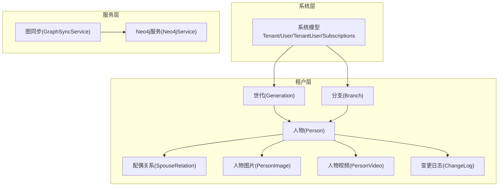
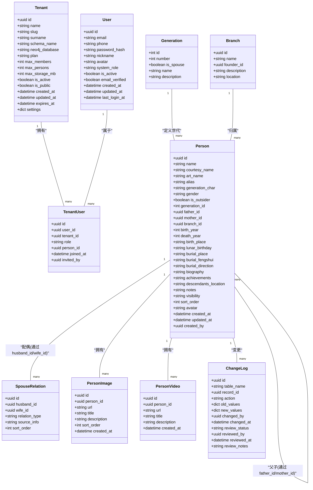
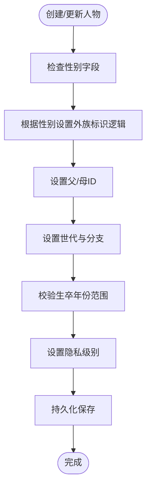
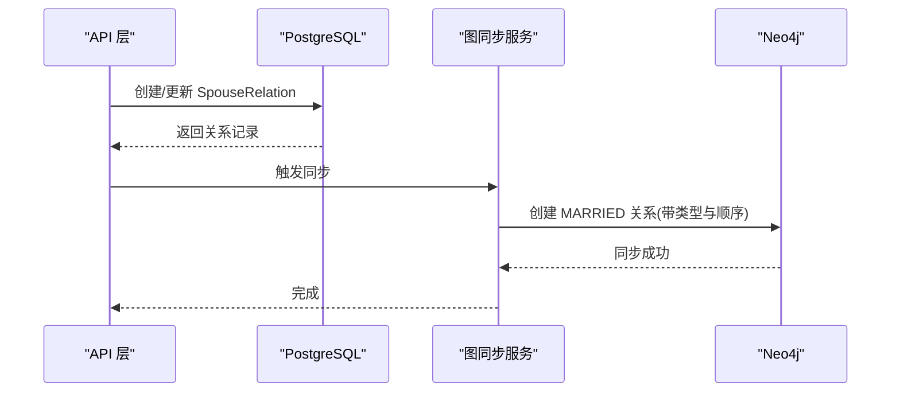
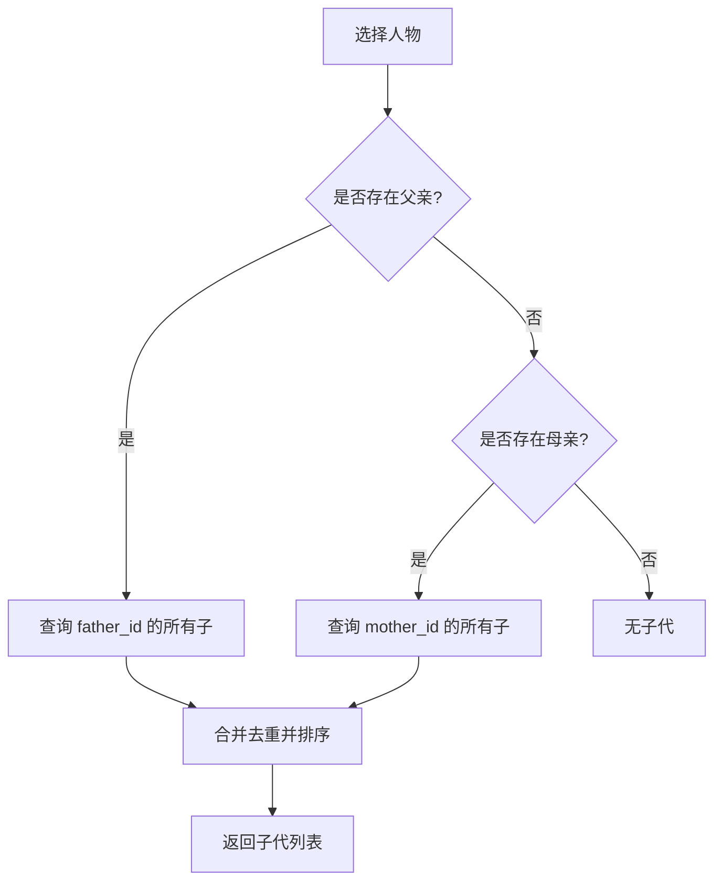
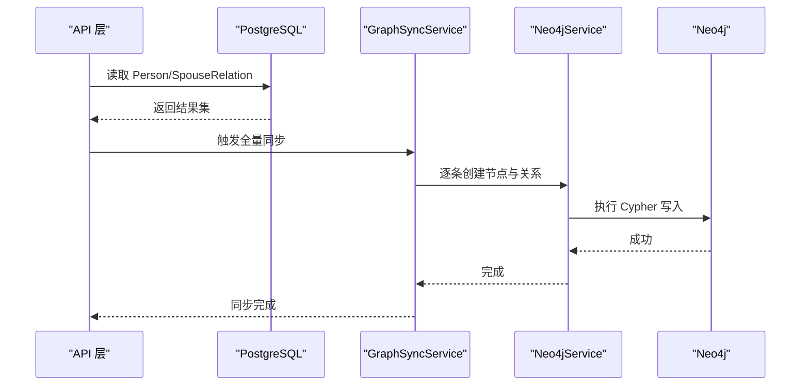
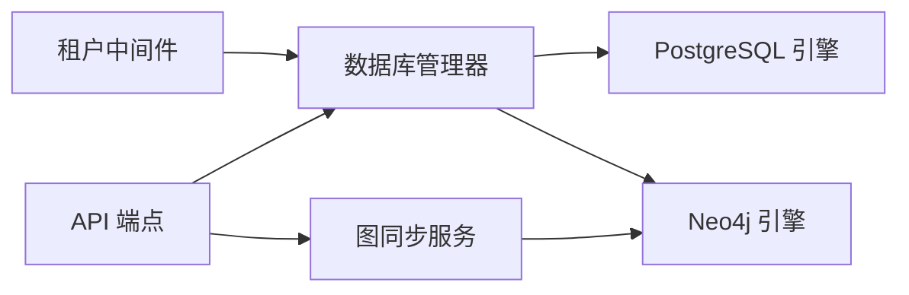

# 租户级数据模型

<cite>
**本文引用的文件**
- [backend/app/models/tenant.py](file://backend/app/models/tenant.py)
- [backend/app/models/system.py](file://backend/app/models/system.py)
- [backend/migrations/versions/001_initial.py](file://backend/migrations/versions/001_initial.py)
- [backend/app/api/v1/endpoints/persons.py](file://backend/app/api/v1/endpoints/persons.py)
- [backend/app/api/v1/endpoints/family_tree.py](file://backend/app/api/v1/endpoints/family_tree.py)
- [backend/app/services/graph_sync.py](file://backend/app/services/graph_sync.py)
- [backend/app/services/neo4j_service.py](file://backend/app/services/neo4j_service.py)
- [backend/app/middleware/tenant.py](file://backend/app/middleware/tenant.py)
- [backend/app/core/database.py](file://backend/app/core/database.py)
- [django_backup/genealogy/models.py](file://django_backup/genealogy/models.py)
- [django_backup/genealogy/migrations/0004_person_is_outsider_spouserelation_relation_type_and_more.py](file://django_backup/genealogy/migrations/0004_person_is_outsider_spouserelation_relation_type_and_more.py)
</cite>

## 目录
1. [引言](#引言)
2. [项目结构](#项目结构)
3. [核心组件](#核心组件)
4. [架构概览](#架构概览)
5. [详细组件分析](#详细组件分析)
6. [依赖分析](#依赖分析)
7. [性能考虑](#性能考虑)
8. [故障排除指南](#故障排除指南)
9. [结论](#结论)
10. [附录](#附录)

## 引言
本文件面向多租户族谱管理系统，聚焦于“租户级数据模型”的设计与实现，围绕人物(Person)、配偶关系(SpouseRelation)、父子关系(由Person.father_id表达)、兄弟姐妹关系(由共同父/母推导)等族谱实体展开。文档覆盖以下主题：
- 实体字段与语义：人物基本信息、生卒与墓葬、备注与隐私、排序与头像、时间戳与创建者等
- 关系设计：关系类型枚举、方向性与双向一致性、唯一性与排序
- 分支与世代：分类机制与展示
- 人物状态：在世/去世标识、隐私设置
- 数据验证：输入校验、日期范围、关系冲突检测思路
- 人物与用户的关联：系统用户与族谱人物的绑定
- 完整性约束与业务规则：主键、外键、索引、唯一性、默认值
- 查询优化建议：索引策略、查询模式、图数据库同步

## 项目结构
系统采用前后端分离与多租户架构：
- 后端使用 FastAPI + SQLAlchemy Async + PostgreSQL/SQLite
- 每个租户拥有独立的数据库模式(schema)或独立数据库文件
- 使用 Neo4j 进行族谱关系图查询与可视化
- 前端 Next.js 提供租户级界面与交互

图表来源
- [backend/app/models/system.py:23-70](file://backend/app/models/system.py#L23-L70)
- [backend/app/models/tenant.py:23-132](file://backend/app/models/tenant.py#L23-L132)
- [backend/app/services/graph_sync.py:20-93](file://backend/app/services/graph_sync.py#L20-L93)
- [backend/app/services/neo4j_service.py:65-144](file://backend/app/services/neo4j_service.py#L65-L144)

章节来源
- [backend/app/models/tenant.py:23-132](file://backend/app/models/tenant.py#L23-L132)
- [backend/app/models/system.py:23-70](file://backend/app/models/system.py#L23-L70)
- [backend/app/services/graph_sync.py:20-93](file://backend/app/services/graph_sync.py#L20-L93)
- [backend/app/services/neo4j_service.py:65-144](file://backend/app/services/neo4j_service.py#L65-L144)

## 核心组件
本节从数据模型角度梳理关键实体及职责：
- 人物(Person)：承载族谱主体信息，含基础信息、性别、父母、分支、生卒、墓葬、传记、备注、隐私、排序、头像、时间戳与创建者
- 配偶关系(SpouseRelation)：记录婚姻关系，含关系类型、来源信息、排序
- 分支(Branch)：支系维度，含名称、创始人、描述、地点
- 世代(Generation)：世代维度，含编号、是否配偶世代、名称与描述
- 变更日志(ChangeLog)：审计追踪，记录表名、记录ID、动作、旧/新值、变更人与时间、审核状态
- 系统模型：租户(Tenant)、用户(User)、租户用户(TenantUser)、订阅(Subscription)，支撑多租户隔离与权限

章节来源
- [backend/app/models/tenant.py:23-132](file://backend/app/models/tenant.py#L23-L132)
- [backend/app/models/system.py:23-70](file://backend/app/models/system.py#L23-L70)

## 架构概览
下图展示租户级数据模型在系统中的位置与交互：

图表来源
- [backend/app/models/tenant.py:23-244](file://backend/app/models/tenant.py#L23-L244)
- [backend/app/models/system.py:23-223](file://backend/app/models/system.py#L23-L223)

## 详细组件分析

### 人物(Person)实体
- 字段设计要点
  - 基本信息：姓名、字、号、别名、辈分字
  - 性别与外族标识：性别(M/F)、是否外族配偶
  - 世代与分支：generation_id、branch_id
  - 父母：father_id、mother_id（自引用）
  - 生卒与墓葬：出生/死亡年份、出生地、农历生日、葬地、墓形/风水、坐向
  - 传记与备注：生平简介、主要事迹、后裔分布、备注
  - 隐私与排序：visibility、sort_order
  - 头像与元数据：avatar、created_at/updated_at、created_by
- 业务语义
  - 在世/去世：通过death_year是否存在或为空判断
  - 隐私控制：visibility(public/member/private)影响可见范围
  - 排序：sort_order用于同一代内排序
- 关系与约束
  - generation_id 外键到 Generation
  - branch_id 外键到 Branch
  - father_id/mother_id 自引用到 Person
  - created_by 外键到 User（系统用户）

图表来源
- [backend/app/models/tenant.py:61-132](file://backend/app/models/tenant.py#L61-L132)
- [backend/app/api/v1/endpoints/persons.py:22-92](file://backend/app/api/v1/endpoints/persons.py#L22-L92)

章节来源
- [backend/app/models/tenant.py:61-132](file://backend/app/models/tenant.py#L61-L132)
- [backend/app/api/v1/endpoints/persons.py:22-92](file://backend/app/api/v1/endpoints/persons.py#L22-L92)

### 配偶关系(SpouseRelation)实体
- 设计要点
  - 两端：husband_id、wife_id（均非空）
  - 关系类型：枚举值包括婚姻、妾室、继配、招赘、第一至第五房等
  - 来源信息：用于外族配偶来源说明
  - 排序：sort_order 表示“第几任”
- 方向性与一致性
  - 该模型仅存储单向(husband_id, wife_id)，实际显示可按关系类型与排序进行双向呈现
  - 建议在应用层保证同一对配偶仅存一条记录，避免重复
- 唯一性与排序
  - 可通过唯一性约束限制重复关系
  - sort_order用于区分多任配偶

图表来源
- [backend/app/models/tenant.py:144-164](file://backend/app/models/tenant.py#L144-L164)
- [backend/app/services/graph_sync.py:54-62](file://backend/app/services/graph_sync.py#L54-L62)
- [backend/app/services/neo4j_service.py:120-143](file://backend/app/services/neo4j_service.py#L120-L143)

章节来源
- [backend/app/models/tenant.py:144-164](file://backend/app/models/tenant.py#L144-L164)
- [backend/app/services/graph_sync.py:54-62](file://backend/app/services/graph_sync.py#L54-L62)
- [backend/app/services/neo4j_service.py:120-143](file://backend/app/services/neo4j_service.py#L120-L143)

### 父子关系与兄弟姐妹关系
- 父子关系
  - 通过 Person.father_id 与 Person.mother_id 建模
  - 查询子代：以当前人为父/母过滤 father_id/mother_id
- 兄弟姐妹关系
  - 共同父/母的其他子即为兄弟姐妹
  - 可通过父/母的 children_as_father/children_as_mother 推导
- 关系方向性
  - 父子关系为单向(husband_id/wife_id)或自引用(father_id/mother_id)，在应用层统一处理

图表来源
- [backend/app/models/tenant.py:86-88](file://backend/app/models/tenant.py#L86-L88)
- [backend/app/api/v1/endpoints/family_tree.py:136-148](file://backend/app/api/v1/endpoints/family_tree.py#L136-L148)

章节来源
- [backend/app/models/tenant.py:86-88](file://backend/app/models/tenant.py#L86-L88)
- [backend/app/api/v1/endpoints/family_tree.py:136-148](file://backend/app/api/v1/endpoints/family_tree.py#L136-L148)

### 分支(Branch)与世代(Generation)
- 分支
  - 名称、创始人、描述、地点
  - 与人物的多对一关系，用于按支系聚合展示
- 世代
  - 编号、是否配偶世代、名称与描述
  - 与人物的一对多关系，用于按世代排序与筛选

章节来源
- [backend/app/models/tenant.py:23-58](file://backend/app/models/tenant.py#L23-L58)

### 人物状态管理：在世/去世与隐私
- 在世/去世
  - 通过 death_year 是否存在或为空判断
  - 可结合 birth_year 与 death_year 的范围校验
- 隐私设置
  - visibility 字段支持 public/member/private
  - 影响前端展示与接口返回

章节来源
- [backend/app/models/tenant.py:94-111](file://backend/app/models/tenant.py#L94-L111)
- [backend/app/api/v1/endpoints/persons.py:52-53](file://backend/app/api/v1/endpoints/persons.py#L52-L53)

### 数据验证规则与业务规则
- 输入验证
  - 年份范围：0~2100
  - 性别枚举：M/F
  - 隐私枚举：public/member/private
- 关系冲突检测
  - 配偶关系唯一性：同一对(husband_id, wife_id)应唯一
  - 父子关系自引用：禁止自身为自己的父/母
  - 世代与分支：外族标识(is_outsider)与世代选择联动
- 完整性约束
  - 主键：各表主键
  - 外键：generation_id、branch_id、father_id、mother_id、created_by
  - 索引：系统模型中对 email/slug/schema_name 等建立索引
  - 默认值：性别默认M、隐私默认public、排序默认0等

章节来源
- [backend/app/api/v1/endpoints/persons.py:38-92](file://backend/app/api/v1/endpoints/persons.py#L38-L92)
- [backend/migrations/versions/001_initial.py:25-47](file://backend/migrations/versions/001_initial.py#L25-L47)
- [django_backup/genealogy/migrations/0004_person_is_outsider_spouserelation_relation_type_and_more.py:14-38](file://django_backup/genealogy/migrations/0004_person_is_outsider_spouserelation_relation_type_and_more.py#L14-L38)

### 人物与用户的关联机制
- 系统用户(User)与租户用户(TenantUser)建立多对多关系
- TenantUser 中可绑定关联的族谱人物(person_id)
- 便于登录用户与族谱人物的映射，支持权限控制与操作审计

章节来源
- [backend/app/models/system.py:73-121](file://backend/app/models/system.py#L73-L121)
- [backend/app/models/system.py:123-181](file://backend/app/models/system.py#L123-L181)

### 图数据库集成与同步
- 同步策略
  - 将 PostgreSQL 中的 Person 与 SpouseRelation 同步到 Neo4j
  - 父子关系通过 father_id 建立 FATHER_OF/CHILD_OF 双向关系
- 查询能力
  - 获取祖先链、后代、兄弟姐妹、配偶、按世代聚合等
  - 支持树形结构可视化与统计

图表来源
- [backend/app/services/graph_sync.py:64-92](file://backend/app/services/graph_sync.py#L64-L92)
- [backend/app/services/neo4j_service.py:65-144](file://backend/app/services/neo4j_service.py#L65-L144)

章节来源
- [backend/app/services/graph_sync.py:64-92](file://backend/app/services/graph_sync.py#L64-L92)
- [backend/app/services/neo4j_service.py:65-144](file://backend/app/services/neo4j_service.py#L65-L144)

## 依赖分析
- 多租户隔离
  - 通过中间件识别租户上下文，设置 schema_name 与 Neo4j 数据库名
  - 数据库引擎按租户动态创建，PostgreSQL 使用 search_path 切换 schema
- 模型依赖
  - Person 依赖 Generation/Branch
  - SpouseRelation 依赖 Person
  - TenantUser 依赖 Tenant/User
- 同步依赖
  - GraphSyncService 依赖 Neo4jService 与数据库会话

图表来源
- [backend/app/middleware/tenant.py:39-84](file://backend/app/middleware/tenant.py#L39-L84)
- [backend/app/core/database.py:58-106](file://backend/app/core/database.py#L58-L106)
- [backend/app/services/graph_sync.py:20-62](file://backend/app/services/graph_sync.py#L20-L62)

章节来源
- [backend/app/middleware/tenant.py:39-84](file://backend/app/middleware/tenant.py#L39-L84)
- [backend/app/core/database.py:58-106](file://backend/app/core/database.py#L58-L106)
- [backend/app/services/graph_sync.py:20-62](file://backend/app/services/graph_sync.py#L20-L62)

## 性能考虑
- 索引策略
  - 对 Person.generation_id、branch_id、father_id、mother_id 建立索引，加速家族树查询
  - 对 SpouseRelation(husband_id, wife_id) 建立复合索引，避免重复
  - 对系统模型 User.email、Tenant.slug、Tenant.schema_name 建立索引
- 查询模式
  - 家族树：优先从 generation_id 最小且 father_id 为空的祖先开始，再递归查询子代
  - 模糊搜索：按 name/courtesy_name/art_name/alias 搜索，限制返回数量
- 图数据库
  - Neo4j 使用 Cypher 查询路径长度与关系属性，避免 N+1 查询
  - 同步时批量写入，减少事务开销

## 故障排除指南
- 租户上下文缺失
  - 确认请求路径、子域名或 X-Tenant-ID 是否正确传递
  - 检查租户是否激活
- 数据库连接
  - SQLite 模式下每个租户独立文件；PostgreSQL 下确保 search_path 设置正确
- 同步失败
  - 检查 Neo4j 连接与认证配置
  - 确认关系两端 ID 有效且存在对应 Person

章节来源
- [backend/app/middleware/tenant.py:116-125](file://backend/app/middleware/tenant.py#L116-L125)
- [backend/app/core/database.py:136-171](file://backend/app/core/database.py#L136-L171)
- [backend/app/services/neo4j_service.py:21-49](file://backend/app/services/neo4j_service.py#L21-L49)

## 结论
本数据模型以“人物为中心”，通过世代与分支实现层次化组织，通过父子与配偶关系构建完整的族谱网络。系统通过多租户隔离与图数据库增强查询能力，配合严格的输入验证与业务规则，保障数据一致性与用户体验。建议在生产环境中持续完善索引、监控同步状态，并基于实际业务迭代关系类型与隐私策略。

## 附录
- 数据模型示例
  - 人物：包含姓名、性别、生卒、墓葬、传记、备注、隐私、排序、头像与时间戳
  - 配偶关系：包含关系类型、来源信息、排序
  - 分支与世代：用于分类与展示
- 查询优化建议
  - 为高频过滤字段建立索引
  - 使用分页与范围查询，避免一次性加载大量数据
  - 图数据库查询限制深度与返回数量，提升响应速度