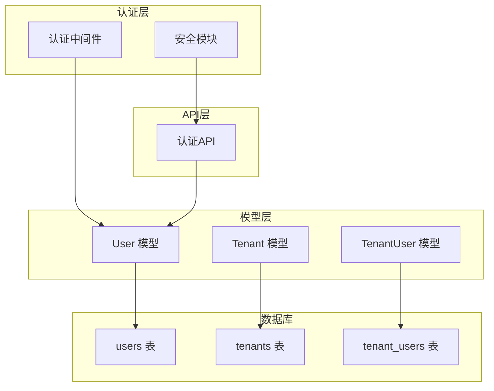
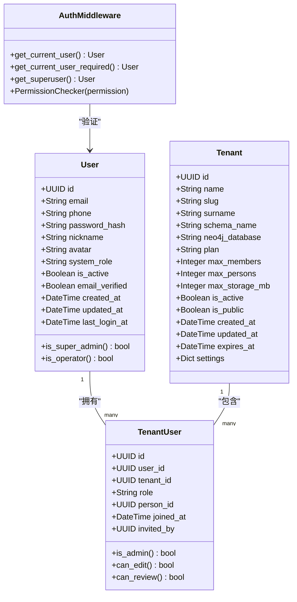
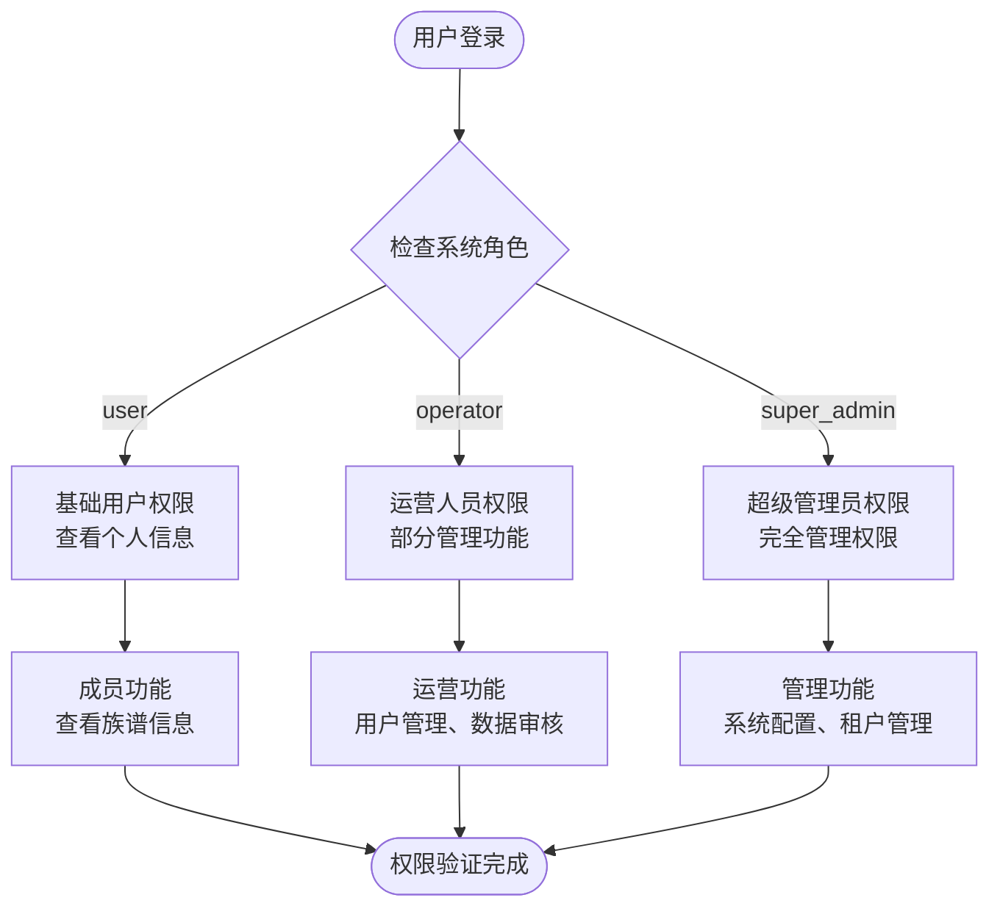
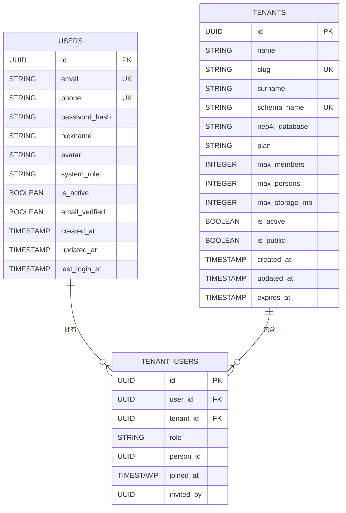
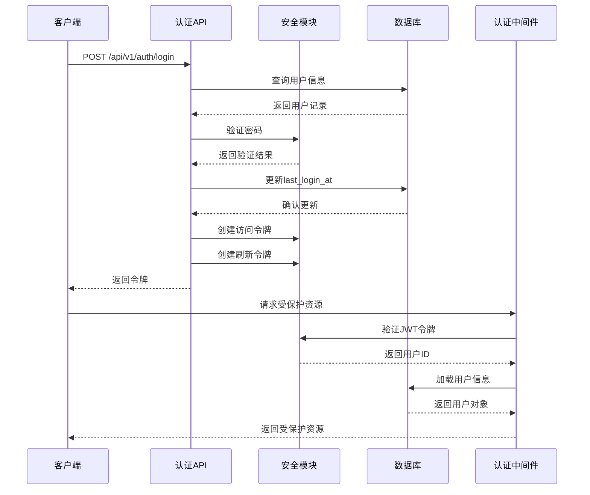
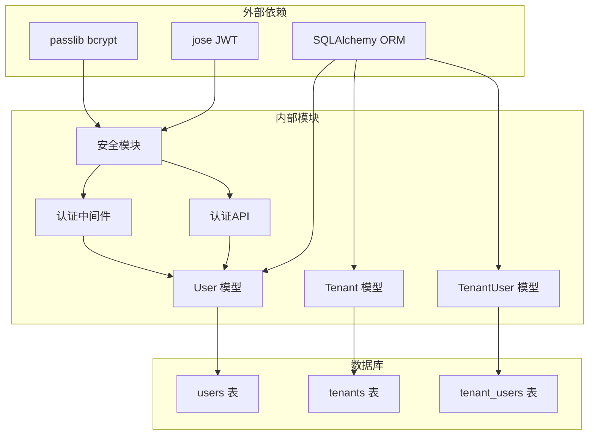

# 用户模型

<cite>
**本文档引用的文件**
- [system.py](file://backend/app/models/system.py)
- [tenant.py](file://backend/app/models/tenant.py)
- [auth.py](file://backend/app/middleware/auth.py)
- [auth.py](file://backend/app/api/v1/endpoints/auth.py)
- [security.py](file://backend/app/core/security.py)
- [001_initial.py](file://backend/migrations/versions/001_initial.py)
- [init_system.py](file://scripts/init_system.py)
- [test_auth.py](file://backend/tests/test_auth.py)
</cite>

## 目录
1. [简介](#简介)
2. [项目结构](#项目结构)
3. [核心组件](#核心组件)
4. [架构概览](#架构概览)
5. [详细组件分析](#详细组件分析)
6. [依赖关系分析](#依赖关系分析)
7. [性能考虑](#性能考虑)
8. [故障排除指南](#故障排除指南)
9. [结论](#结论)

## 简介

用户模型是多租户族谱管理系统的核心数据结构之一，负责管理系统的用户身份认证、授权以及与租户的关系映射。该模型实现了完整的用户生命周期管理，包括注册、登录、权限验证、状态管理和多租户关联等功能。

本系统采用基于角色的访问控制（RBAC）机制，支持三种系统级角色：普通用户（user）、超级管理员（super_admin）和运营人员（operator）。同时，在租户层面还支持多种角色权限，包括成员（member）、编辑者（editor）、审核员（reviewer）和租户管理员（tenant_admin）。

## 项目结构

用户模型位于后端应用的模型层中，采用SQLAlchemy ORM进行数据库映射。系统采用分层架构设计，用户模型与认证中间件、安全模块和API端点协同工作。

**图表来源**
- [system.py:73-121](file://backend/app/models/system.py#L73-L121)
- [auth.py:15-57](file://backend/app/middleware/auth.py#L15-L57)
- [security.py:26-52](file://backend/app/core/security.py#L26-L52)

**章节来源**
- [system.py:1-223](file://backend/app/models/system.py#L1-L223)
- [auth.py:1-88](file://backend/app/middleware/auth.py#L1-L88)

## 核心组件

用户模型由三个主要组件构成：User基础模型、TenantUser关系模型和相关的认证中间件。每个组件都有明确的职责分工和相互依赖关系。

### User 基础模型

User模型是系统的核心实体，负责存储用户的基本信息和系统级权限。该模型实现了完整的用户生命周期管理功能。

### TenantUser 关系模型

TenantUser模型实现了用户与租户之间的多对多关系映射，支持在租户层面分配不同的角色权限。

### 认证中间件

认证中间件提供了用户身份验证和权限检查功能，包括获取当前用户、验证超级用户权限等。

**章节来源**
- [system.py:73-181](file://backend/app/models/system.py#L73-L181)
- [auth.py:15-88](file://backend/app/middleware/auth.py#L15-L88)

## 架构概览

用户模型采用三层架构设计，确保了良好的代码组织和职责分离。

**图表来源**
- [system.py:73-181](file://backend/app/models/system.py#L73-L181)
- [auth.py:15-88](file://backend/app/middleware/auth.py#L15-L88)

## 详细组件分析

### User 模型详细分析

User模型是系统的核心实体，包含了用户的所有基本信息和权限属性。

#### 字段定义与约束

| 字段名 | 数据类型 | 约束条件 | 默认值 | 描述 |
|--------|----------|----------|--------|------|
| id | UUID | 主键 | 自动生成 | 用户唯一标识符 |
| email | String(255) | 唯一、非空、索引 | - | 用户邮箱地址 |
| phone | String(20) | 唯一、可空 | null | 用户手机号码 |
| password_hash | String(255) | 非空 | - | 用户密码哈希值 |
| nickname | String(50) | 可空 | null | 用户昵称 |
| avatar | String(500) | 可空 | null | 用户头像URL |
| system_role | String(20) | 非空 | "user" | 系统角色类型 |
| is_active | Boolean | 非空 | true | 用户账户激活状态 |
| email_verified | Boolean | 非空 | false | 邮箱验证状态 |
| created_at | DateTime(timezone) | 非空、服务器默认 | now() | 创建时间 |
| updated_at | DateTime(timezone) | 非空、服务器默认、更新触发 | now() | 最后更新时间 |
| last_login_at | DateTime(timezone) | 可空 | null | 最后登录时间 |

#### 角色权限体系

系统实现了三级角色权限体系：

1. **普通用户 (user)**: 基础用户权限，只能访问自己的个人信息
2. **运营人员 (operator)**: 具备超级管理员的部分权限，但权限范围有限
3. **超级管理员 (super_admin)**: 系统最高权限，可以管理所有用户和系统设置

**图表来源**
- [system.py:114-120](file://backend/app/models/system.py#L114-L120)
- [auth.py:60-69](file://backend/app/middleware/auth.py#L60-L69)

#### 状态管理机制

用户状态通过多个布尔标志位进行管理：

- **is_active**: 控制用户账户是否被激活，影响登录和访问权限
- **email_verified**: 验证用户邮箱的有效性，用于安全验证和通知功能

#### 时间戳自动管理

系统实现了完整的自动时间戳管理机制：

- **created_at**: 用户创建时自动设置，使用服务器默认值
- **updated_at**: 记录用户信息的最后修改时间，支持自动更新
- **last_login_at**: 每次成功登录时更新，用于审计和统计

**章节来源**
- [system.py:73-121](file://backend/app/models/system.py#L73-L121)
- [auth.py:90-123](file://backend/app/api/v1/endpoints/auth.py#L90-L123)

### TenantUser 关系模型分析

TenantUser模型实现了用户与租户之间的多对多关系，支持在租户层面分配不同的角色权限。

#### 租户角色权限体系

租户层面支持四种角色权限：

1. **成员 (member)**: 基础成员权限，只能查看和参与基本功能
2. **编辑者 (editor)**: 具备编辑和修改数据的权限
3. **审核员 (reviewer)**: 可以审核其他用户的编辑内容
4. **租户管理员 (tenant_admin)**: 租户最高权限，可以管理租户内的所有用户和数据

#### 关系字段定义

| 字段名 | 数据类型 | 约束条件 | 默认值 | 描述 |
|--------|----------|----------|--------|------|
| id | UUID | 主键 | 自动生成 | 关系记录唯一标识符 |
| user_id | UUID | 外键(users.id)、非空、索引 | - | 关联的用户ID |
| tenant_id | UUID | 外键(tenants.id)、非空、索引 | - | 关联的租户ID |
| role | String(20) | 非空 | "member" | 在租户中的角色 |
| person_id | UUID | 可空 | null | 在族谱中的关联人物ID |
| joined_at | DateTime(timezone) | 非空、服务器默认 | now() | 加入租户时间 |
| invited_by | UUID | 可空 | null | 邀请人ID |

**图表来源**
- [system.py:123-181](file://backend/app/models/system.py#L123-L181)
- [001_initial.py:50-86](file://backend/migrations/versions/001_initial.py#L50-L86)

**章节来源**
- [system.py:123-181](file://backend/app/models/system.py#L123-L181)
- [001_initial.py:71-86](file://backend/migrations/versions/001_initial.py#L71-L86)

### 认证流程分析

用户认证流程涉及多个组件的协作，从API端点到数据库验证的完整过程。

**图表来源**
- [auth.py:89-123](file://backend/app/api/v1/endpoints/auth.py#L89-L123)
- [auth.py:15-57](file://backend/app/middleware/auth.py#L15-L57)
- [security.py:26-52](file://backend/app/core/security.py#L26-L52)

**章节来源**
- [auth.py:89-123](file://backend/app/api/v1/endpoints/auth.py#L89-L123)
- [auth.py:15-57](file://backend/app/middleware/auth.py#L15-L57)
- [security.py:26-52](file://backend/app/core/security.py#L26-L52)

## 依赖关系分析

用户模型与其他系统组件存在紧密的依赖关系，形成了完整的认证授权体系。

**图表来源**
- [system.py:1-223](file://backend/app/models/system.py#L1-L223)
- [auth.py:1-88](file://backend/app/middleware/auth.py#L1-L88)
- [security.py:1-103](file://backend/app/core/security.py#L1-L103)

### 组件耦合度分析

用户模型的耦合度设计合理，遵循了单一职责原则：

- **User模型**: 负责用户基本信息和系统级权限
- **TenantUser模型**: 专门处理用户与租户的关系
- **认证中间件**: 独立处理用户身份验证逻辑
- **安全模块**: 专注于密码加密和令牌管理

这种设计降低了组件间的耦合度，提高了代码的可维护性和可测试性。

**章节来源**
- [system.py:1-223](file://backend/app/models/system.py#L1-L223)
- [auth.py:1-88](file://backend/app/middleware/auth.py#L1-L88)
- [security.py:1-103](file://backend/app/core/security.py#L1-L103)

## 性能考虑

用户模型在设计时充分考虑了性能优化，采用了多种策略来提升系统响应速度和资源利用率。

### 数据库索引优化

系统为关键查询字段建立了适当的索引：

- **users.email**: 唯一索引，支持快速邮箱查找
- **users.phone**: 唯一索引，支持手机号码查找
- **tenant_users.user_id**: 普通索引，加速用户租户关系查询
- **tenant_users.tenant_id**: 普通索引，加速租户用户关系查询

### 缓存策略

虽然当前实现没有显式的缓存机制，但可以通过以下方式优化：

1. **令牌缓存**: JWT令牌可以在内存中短期缓存
2. **用户信息缓存**: 经常访问的用户信息可以缓存
3. **权限检查缓存**: 权限验证结果可以缓存一段时间

### 查询优化

系统通过合理的数据库设计避免了N+1查询问题：

- 使用关系查询一次性加载用户及其租户关系
- 通过外键约束确保数据一致性
- 避免不必要的字段选择

## 故障排除指南

### 常见问题及解决方案

#### 登录失败问题

**问题症状**: 用户无法登录，返回401错误

**可能原因**:
1. 密码不正确
2. 用户账户未激活
3. 令牌过期

**解决步骤**:
1. 验证用户输入的密码
2. 检查用户账户状态 (`is_active`)
3. 重新生成访问令牌

#### 权限不足问题

**问题症状**: 用户访问受限，返回403错误

**可能原因**:
1. 用户角色权限不足
2. 缺少必要的系统角色
3. 租户权限配置错误

**解决步骤**:
1. 检查用户系统角色 (`system_role`)
2. 验证用户在目标租户的角色
3. 确认权限检查逻辑

#### 数据库连接问题

**问题症状**: 用户操作超时或数据库连接失败

**可能原因**:
1. 数据库连接池耗尽
2. 查询执行时间过长
3. 索引缺失导致查询缓慢

**解决步骤**:
1. 检查数据库连接配置
2. 分析慢查询日志
3. 添加必要的数据库索引

**章节来源**
- [auth.py:50-69](file://backend/app/middleware/auth.py#L50-L69)
- [auth.py:106-110](file://backend/app/api/v1/endpoints/auth.py#L106-L110)

## 结论

用户模型作为多租户族谱管理系统的核心组件，实现了完整的用户身份认证、授权管理和多租户关系映射功能。通过精心设计的字段约束、权限体系和时间戳管理机制，系统确保了数据的一致性和安全性。

该模型的设计充分体现了现代Web应用的最佳实践：
- 清晰的职责分离和低耦合设计
- 完善的权限控制和审计功能
- 高效的数据库查询和索引策略
- 可扩展的架构设计

未来可以考虑的改进方向包括：
- 实现更细粒度的权限控制
- 添加用户会话管理和令牌刷新机制
- 优化数据库查询性能
- 增强安全防护措施