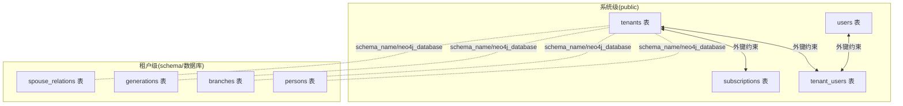
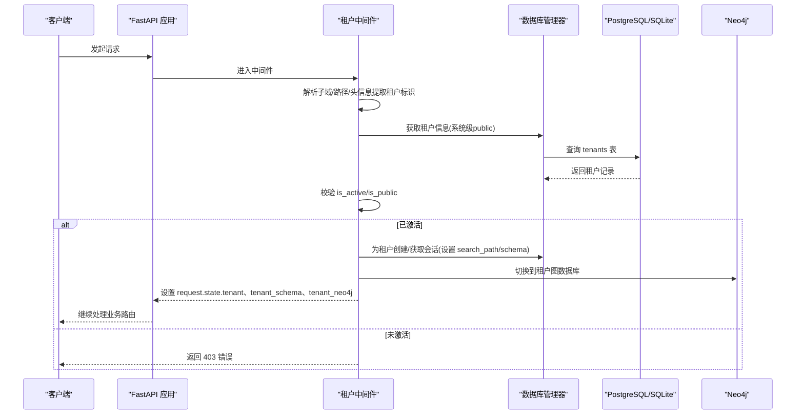
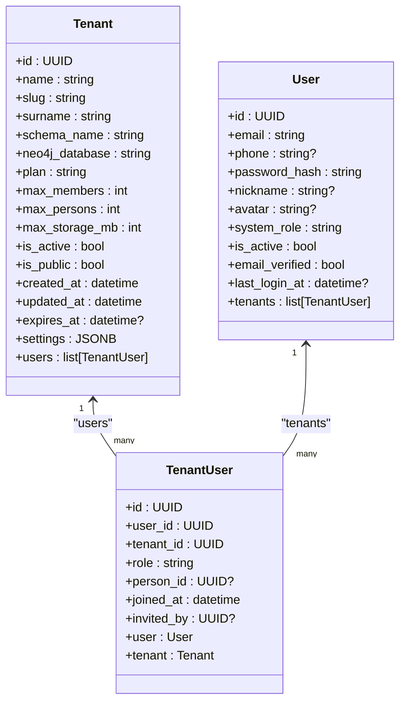
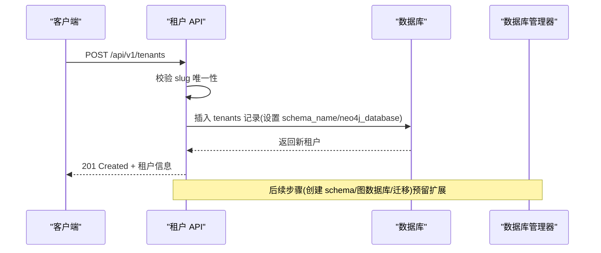
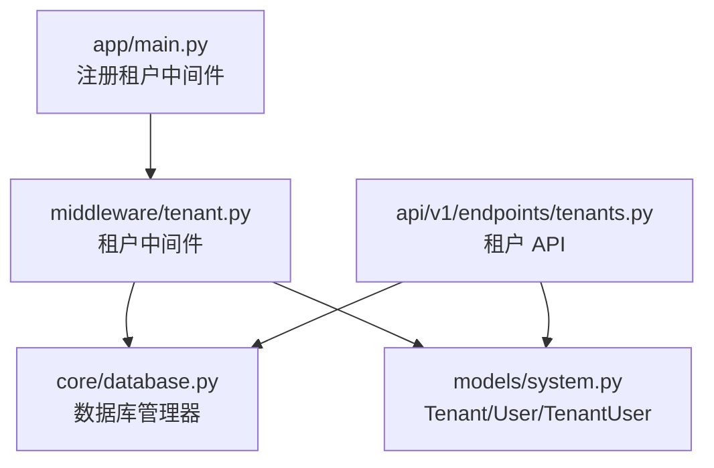

# 租户模型

<cite>
**本文引用的文件**
- [system.py](file://backend/app/models/system.py)
- [tenant.py](file://backend/app/models/tenant.py)
- [tenants.py](file://backend/app/api/v1/endpoints/tenants.py)
- [tenant.py](file://backend/app/middleware/tenant.py)
- [database.py](file://backend/app/core/database.py)
- [main.py](file://backend/app/main.py)
- [001_initial.py](file://backend/migrations/versions/001_initial.py)
- [test_tenants.py](file://backend/tests/test_tenants.py)
</cite>

## 目录
1. [简介](#简介)
2. [项目结构](#项目结构)
3. [核心组件](#核心组件)
4. [架构总览](#架构总览)
5. [详细组件分析](#详细组件分析)
6. [依赖分析](#依赖分析)
7. [性能考虑](#性能考虑)
8. [故障排除指南](#故障排除指南)
9. [结论](#结论)
10. [附录](#附录)

## 简介
本文件系统化梳理多租户族谱管理系统的租户模型（Tenant），重点覆盖以下方面：
- 租户实体的核心字段定义与业务含义，包括 id、name、slug、surname 等标识性字段
- 多租户隔离机制：schema_name 与 neo4j_database 字段如何在数据库与图数据库层面实现数据隔离
- 订阅管理相关字段：plan、max_members、max_persons、max_storage_mb 的作用与限制逻辑
- 租户状态控制字段：is_active、is_public 的业务语义与影响范围
- 租户配置字段 settings 的 JSONB 存储机制与典型使用场景
- 时间戳字段 expires_at 的过期管理策略
- 租户模型与 User、TenantUser 关系的映射说明
- 租户创建、激活、停用的实际操作示例与最佳实践

## 项目结构
租户模型位于后端应用的系统级模型中，采用“系统级表”与“租户级表”的分层设计：
- 系统级表（public 模式）：租户、用户、用户-租户关系、订阅等
- 租户级表（每个租户拥有独立 schema 或数据库）：族谱数据（人物、支系、世代等）

图表来源
- [system.py:23-71](file://backend/app/models/system.py#L23-L71)
- [tenant.py:23-142](file://backend/app/models/tenant.py#L23-L142)

章节来源
- [system.py:23-71](file://backend/app/models/system.py#L23-L71)
- [tenant.py:23-142](file://backend/app/models/tenant.py#L23-L142)

## 核心组件
本节聚焦租户模型的关键字段及其职责：
- 标识性字段
  - id：租户唯一标识（UUID）
  - name：租户显示名称（如“刘氏家族”）
  - slug：租户访问路径或子域标识（唯一、索引、小写/数字/短横线）
  - surname：姓氏（用于按姓氏筛选）
- 隔离字段
  - schema_name：PostgreSQL 中的租户 schema 名称（唯一）
  - neo4j_database：Neo4j 中的租户图数据库名（用于图数据隔离）
- 订阅与配额字段
  - plan：套餐类型（默认 free）
  - max_members：最大成员数
  - max_persons：最大人物记录数
  - max_storage_mb：最大存储容量（MB）
- 状态控制字段
  - is_active：租户是否启用（影响请求路由处理）
  - is_public：是否对外公开展示（用于公共列表）
- 元数据与配置
  - created_at/updated_at：创建与更新时间戳
  - expires_at：到期时间（可选）
  - settings：JSONB 配置对象（用于动态开关、样式、功能开关等）
- 关系映射
  - users：与 TenantUser 的一对多关系，反向为 TenantUser.tenant

章节来源
- [system.py:23-71](file://backend/app/models/system.py#L23-L71)

## 架构总览
多租户架构通过“系统级表 + 租户级表”的模式实现强隔离：
- 系统级表（public）保存租户元信息、用户与订阅等公共数据
- 租户级表（每个租户一个 schema 或数据库）保存族谱数据
- 请求通过中间件识别租户，切换数据库 schema 或图数据库，确保数据隔离

图表来源
- [tenant.py:15-84](file://backend/app/middleware/tenant.py#L15-L84)
- [database.py:58-106](file://backend/app/core/database.py#L58-L106)
- [database.py:136-171](file://backend/app/core/database.py#L136-L171)

章节来源
- [tenant.py:15-84](file://backend/app/middleware/tenant.py#L15-L84)
- [database.py:58-106](file://backend/app/core/database.py#L58-L106)
- [database.py:136-171](file://backend/app/core/database.py#L136-L171)

## 详细组件分析

### 租户模型类图

图表来源
- [system.py:23-181](file://backend/app/models/system.py#L23-L181)

章节来源
- [system.py:23-181](file://backend/app/models/system.py#L23-L181)

### 租户字段详解与业务语义
- 标识性字段
  - id：全局唯一标识，用于内部关联与日志追踪
  - name：面向用户的显示名称，用于界面展示与 SEO
  - slug：作为 URL 路径或子域的一部分，必须唯一且符合规则
  - surname：用于按姓氏聚合与搜索
- 隔离字段
  - schema_name：PostgreSQL 中的租户 schema 名称，用于数据隔离；SQLite 下将转换为独立数据库文件
  - neo4j_database：Neo4j 中的租户图数据库名，用于图数据隔离
- 订阅与配额字段
  - plan：套餐类型，决定可用功能与配额上限
  - max_members/max_persons/max_storage_mb：资源配额，用于业务校验与容量管理
- 状态控制字段
  - is_active：租户启用状态，中间件会拒绝未激活租户的请求
  - is_public：是否在公共租户列表中可见
- 元数据与配置
  - created_at/updated_at：审计与排序依据
  - expires_at：到期时间，可用于到期提醒与自动停用流程
  - settings：JSONB 配置对象，支持动态开关、样式定制、功能开关等

章节来源
- [system.py:23-71](file://backend/app/models/system.py#L23-L71)

### 多租户隔离机制
- 数据库隔离
  - PostgreSQL：通过设置 search_path 切换到目标 schema，实现表级隔离
  - SQLite：为每个租户创建独立数据库文件，避免 schema 限制
- 图数据库隔离
  - 通过切换 Neo4j 数据库连接，实现图数据隔离
- 中间件流程
  - 优先从子域解析租户标识，其次从路径解析，最后从请求头解析
  - 校验租户存在性与 is_active 状态，设置 request.state.tenant、tenant_schema、tenant_neo4j

章节来源
- [tenant.py:15-84](file://backend/app/middleware/tenant.py#L15-L84)
- [database.py:58-106](file://backend/app/core/database.py#L58-L106)
- [database.py:136-171](file://backend/app/core/database.py#L136-L171)

### 订阅管理与配额控制
- 订阅记录模型（Subscription）独立于 Tenant，但通过外键关联
- 租户模型中的配额字段用于快速判断与限制，实际业务应结合 Subscription 的生效状态与到期时间综合判断
- 建议在业务层对配额进行校验，例如新增人物前检查 max_persons 与当前数量

章节来源
- [system.py:183-223](file://backend/app/models/system.py#L183-L223)

### 租户配置字段 settings 的使用场景
- 动态功能开关：如是否启用评论、是否开启隐私模式
- 主题与样式：如自定义颜色、布局偏好
- 审计与合规：如是否启用变更日志、导出权限
- 使用建议
  - 保持 JSONB 结构简洁，避免过度嵌套
  - 对关键字段提供默认值与校验
  - 在迁移或升级时保留向后兼容

章节来源
- [system.py:63-64](file://backend/app/models/system.py#L63-L64)

### 时间戳字段 expires_at 的过期管理策略
- 适用场景
  - 试用期到期：is_active=false，停止业务访问
  - 订阅到期：根据 Subscription 状态与计划调整资源配额
- 实施建议
  - 定时任务扫描 expires_at 接近当前时间的租户，发送提醒
  - 到期后自动冻结服务，仅允许付费续费
  - 提供到期宽限期以提升用户体验

章节来源
- [system.py:61](file://backend/app/models/system.py#L61)

### 租户与用户关系映射
- User 与 Tenant 通过 TenantUser 建立多对多关系
- TenantUser 的 role 字段用于区分成员角色（如 tenant_admin、editor、reviewer、member）
- 可选地通过 person_id 关联到族谱中的具体人物，便于身份与权限绑定

章节来源
- [system.py:123-181](file://backend/app/models/system.py#L123-L181)

### 租户 API 与创建流程
- 租户列表与详情接口
  - GET /api/v1/tenants：支持按 surname 搜索、分页与排序
  - GET /api/v1/tenants/{slug}：按 slug 获取租户详情
- 创建租户
  - POST /api/v1/tenants：需要超级管理员权限
  - 自动根据 slug 生成 schema_name 与 neo4j_database
  - 当前实现预留了后续创建 schema、图数据库与迁移的扩展点

图表来源
- [tenants.py:118-164](file://backend/app/api/v1/endpoints/tenants.py#L118-L164)
- [tenants.py:18-36](file://backend/app/api/v1/endpoints/tenants.py#L18-L36)

章节来源
- [tenants.py:45-164](file://backend/app/api/v1/endpoints/tenants.py#L45-L164)

### 租户创建、激活、停用的最佳实践
- 创建
  - 选择稳定的 slug（小写、数字、短横线），避免与现有租户冲突
  - 自动生成 schema_name 与 neo4j_database，确保命名规范一致
  - 初始化 settings 为空对象，后续按需填充
- 激活
  - 默认 is_active=true，确保中间件放行
  - 如需临时停用，设置 is_active=false 并通知用户
- 停用
  - 将 is_active=false，阻止业务路由访问
  - 可配合 expires_at 实现到期自动停用
- 配额与订阅
  - plan 与配额字段用于快速判断，实际业务应结合 Subscription 生效状态
  - 定期校验 max_persons、max_members、max_storage_mb，防止越界

章节来源
- [tenants.py:118-164](file://backend/app/api/v1/endpoints/tenants.py#L118-L164)
- [system.py:23-71](file://backend/app/models/system.py#L23-L71)

## 依赖分析
- 应用启动时注册租户中间件，确保所有请求进入租户上下文
- 数据库管理器根据 schema_name 动态创建引擎与会话，支持 PostgreSQL 与 SQLite 的差异化处理
- 租户中间件从系统级 public 模式查询租户信息，再切换到租户级 schema 或数据库

图表来源
- [main.py:66-67](file://backend/app/main.py#L66-L67)
- [tenant.py:15-84](file://backend/app/middleware/tenant.py#L15-L84)
- [database.py:24-106](file://backend/app/core/database.py#L24-L106)
- [system.py:23-181](file://backend/app/models/system.py#L23-L181)
- [tenants.py:11-14](file://backend/app/api/v1/endpoints/tenants.py#L11-L14)

章节来源
- [main.py:66-67](file://backend/app/main.py#L66-L67)
- [tenant.py:15-84](file://backend/app/middleware/tenant.py#L15-L84)
- [database.py:24-106](file://backend/app/core/database.py#L24-L106)
- [system.py:23-181](file://backend/app/models/system.py#L23-L181)
- [tenants.py:11-14](file://backend/app/api/v1/endpoints/tenants.py#L11-L14)

## 性能考虑
- 中间件租户解析
  - 优先使用子域解析，减少正则匹配开销
  - 对公共路径（如 /api/v1/tenants、/health）跳过租户解析
- 数据库连接
  - 为每个 schema/数据库缓存引擎与会话工厂，避免重复初始化
  - SQLite 下为每个租户创建独立文件，避免 schema 切换
- 查询优化
  - slug 与 schema_name 均建立唯一索引，加速租户查找
  - 租户列表按 created_at 倒序分页，支持 surname 过滤

章节来源
- [tenant.py:25-34](file://backend/app/middleware/tenant.py#L25-L34)
- [database.py:58-106](file://backend/app/core/database.py#L58-L106)
- [001_initial.py:41-50](file://backend/migrations/versions/001_initial.py#L41-L50)

## 故障排除指南
- 租户不存在
  - 现象：返回 404，错误码 TENANT_NOT_FOUND
  - 处理：确认 slug 正确，检查租户是否已创建
- 租户未激活
  - 现象：返回 403，错误码 TENANT_INACTIVE
  - 处理：将 is_active 设为 true，或联系管理员
- 子域/路径解析失败
  - 现象：无法识别租户上下文
  - 处理：检查子域配置、URL 路径格式、请求头 X-Tenant-ID
- 数据库连接异常
  - 现象：SQL 执行报错或找不到表
  - 处理：确认 schema_name 是否正确，PostgreSQL 需要 search_path 设置，SQLite 需要对应数据库文件存在

章节来源
- [tenant.py:40-84](file://backend/app/middleware/tenant.py#L40-L84)
- [database.py:136-171](file://backend/app/core/database.py#L136-L171)

## 结论
租户模型通过清晰的标识字段、严格的隔离机制与灵活的配置能力，支撑多租户族谱管理平台的规模化运营。结合中间件的租户识别与数据库管理器的 schema/数据库切换，系统实现了高效、安全的数据隔离。建议在实际部署中：
- 明确 slug 命名规范与 schema/数据库命名规则
- 建立完善的租户生命周期管理（创建、激活、停用、到期）
- 对配额与订阅进行统一治理，确保业务稳定性
- 通过 settings 字段实现功能的渐进式开放与个性化配置

## 附录
- 数据库初始化脚本中对 tenants 表的建表与索引定义，体现了字段约束与唯一性要求
- 测试用例覆盖了租户列表、按 slug 查询、按 surname 搜索等核心场景

章节来源
- [001_initial.py:41-50](file://backend/migrations/versions/001_initial.py#L41-L50)
- [test_tenants.py:11-112](file://backend/tests/test_tenants.py#L11-L112)