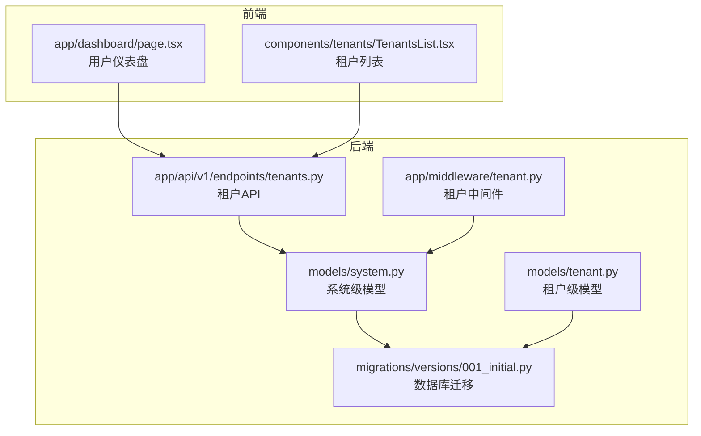
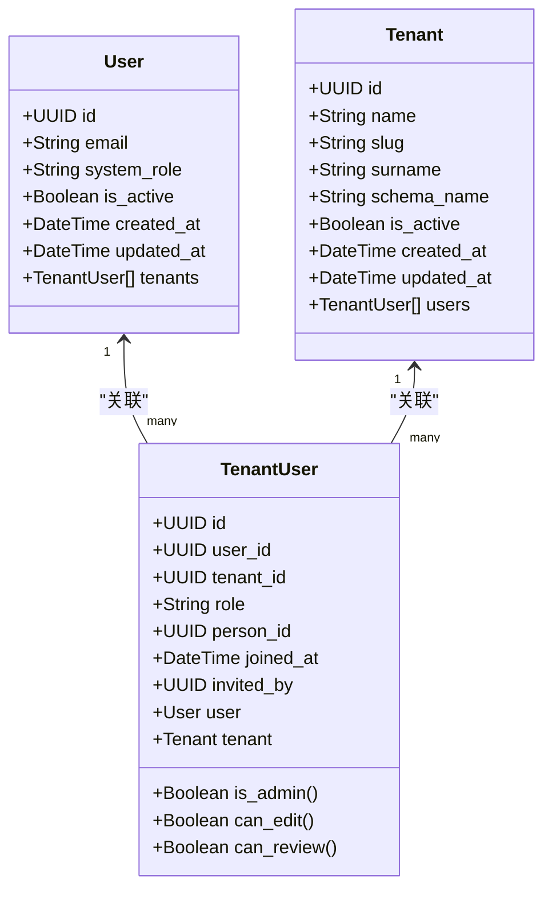
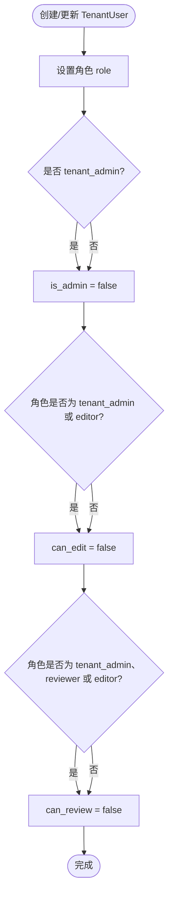
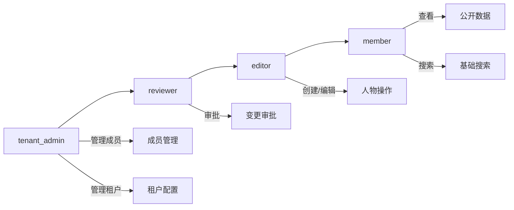
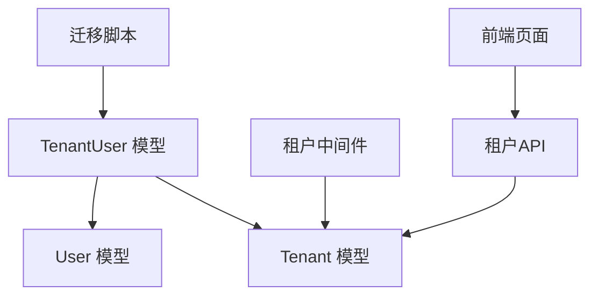

# 租户用户关系模型

<cite>
**本文档引用的文件**
- [system.py](file://backend/app/models/system.py)
- [tenant.py](file://backend/app/models/tenant.py)
- [001_initial.py](file://backend/migrations/versions/001_initial.py)
- [init3init_system.py](file://scripts/init3init_system.py)
- [tenant.py（中间件）](file://backend/app/middleware/tenant.py)
- [auth.py](file://backend/app/api/v1/endpoints/auth.py)
- [tenants.py](file://backend/app/api/v1/endpoints/tenants.py)
- [page.tsx](file://frontend/app/dashboard/page.tsx)
- [TenantsList.tsx](file://frontend/components/tenants/TenantsList.tsx)
- [ARCHITECTURE.md](file://docs/ARCHITECTURE.md)
</cite>

## 目录
1. [简介](#简介)
2. [项目结构](#项目结构)
3. [核心组件](#核心组件)
4. [架构概览](#架构概览)
5. [详细组件分析](#详细组件分析)
6. [依赖分析](#依赖分析)
7. [性能考虑](#性能考虑)
8. [故障排除指南](#故障排除指南)
9. [结论](#结论)
10. [附录](#附录)

## 简介
本文件针对多租户族谱管理系统中的租户用户关系（TenantUser）模型进行深入文档化，重点涵盖：
- 用户-租户关联实体的设计：user_id、tenant_id 外键约束与唯一性约束的实现现状与建议
- 租户内角色体系：member、tenant_admin、editor、reviewer 等角色的权限差异与使用场景
- person_id 字段如何将系统用户与族谱中的具体人物关联
- 成员管理相关字段：joined_at 加入时间与 invited_by 邀请人字段
- 角色判断属性 can_edit、can_review、is_admin 的权限控制逻辑
- 时间戳字段的自动管理机制
- 租户用户关系的 CRUD 操作示例与权限验证最佳实践
- 成员邀请、角色变更、权限验证的实际代码示例路径

## 项目结构
本项目采用前后端分离架构，后端基于 FastAPI + SQLAlchemy，前端基于 Next.js。租户用户关系模型位于后端模型层，并通过数据库迁移脚本定义表结构。

**图表来源**
- [system.py:23-181](file://backend/app/models/system.py#L23-L181)
- [tenant.py:23-244](file://backend/app/models/tenant.py#L23-L244)
- [001_initial.py:63-113](file://backend/migrations/versions/001_initial.py#L63-L113)
- [tenants.py:1-164](file://backend/app/api/v1/endpoints/tenants.py#L1-L164)
- [tenant.py（中间件）:15-142](file://backend/app/middleware/tenant.py#L15-L142)
- [page.tsx:1-133](file://frontend/app/dashboard/page.tsx#L1-L133)
- [TenantsList.tsx:1-118](file://frontend/components/tenants/TenantsList.tsx#L1-L118)

**章节来源**
- [system.py:23-181](file://backend/app/models/system.py#L23-L181)
- [001_initial.py:63-113](file://backend/migrations/versions/001_initial.py#L63-L113)
- [tenants.py:1-164](file://backend/app/api/v1/endpoints/tenants.py#L1-L164)
- [tenant.py（中间件）:15-142](file://backend/app/middleware/tenant.py#L15-L142)
- [page.tsx:1-133](file://frontend/app/dashboard/page.tsx#L1-L133)
- [TenantsList.tsx:1-118](file://frontend/components/tenants/TenantsList.tsx#L1-L118)

## 核心组件
- TenantUser 关系模型：定义用户与租户的多对多关系，包含角色、人物关联、加入时间与邀请人等字段
- User 与 Tenant 模型：系统级用户与租户模型，用于建立外键关系
- 数据库迁移：定义 tenant_users 表结构及索引
- 前端集成：用户仪表盘展示租户成员信息与角色标签

**章节来源**
- [system.py:123-181](file://backend/app/models/system.py#L123-L181)
- [001_initial.py:71-86](file://backend/migrations/versions/001_initial.py#L71-L86)
- [page.tsx:56-62](file://frontend/app/dashboard/page.tsx#L56-L62)

## 架构概览
租户用户关系在系统中的作用是连接系统用户与租户空间，支持按租户隔离的数据访问与权限控制。下图展示了模型、迁移与中间件之间的交互：

**图表来源**
- [system.py:73-181](file://backend/app/models/system.py#L73-L181)

**章节来源**
- [system.py:73-181](file://backend/app/models/system.py#L73-L181)

## 详细组件分析

### TenantUser 模型设计
- 外键约束
  - user_id 引用 users.id，删除策略为 CASCADE
  - tenant_id 引用 tenants.id，删除策略为 CASCADE
- 唯一性约束
  - 当前模型未显式声明 (user_id, tenant_id) 唯一性约束；建议在生产环境添加以防止重复成员
- 字段说明
  - role：默认 member，支持 tenant_admin、editor、reviewer 等
  - person_id：可选，将系统用户与族谱人物关联
  - joined_at：自动记录加入时间
  - invited_by：可选，记录邀请人
- 关系映射
  - back_populates 指向 User 和 Tenant 的 tenants/users 关系
- 权限属性
  - is_admin：仅 tenant_admin
  - can_edit：tenant_admin 或 editor
  - can_review：tenant_admin、reviewer 或 editor

**图表来源**
- [system.py:170-181](file://backend/app/models/system.py#L170-L181)

**章节来源**
- [system.py:123-181](file://backend/app/models/system.py#L123-L181)
- [001_initial.py:71-86](file://backend/migrations/versions/001_initial.py#L71-L86)
- [init3init_system.py:152-166](file://scripts/init3init_system.py#L152-L166)

### 角色体系与权限差异
- member：普通成员，具备基础查看与搜索能力
- editor：编辑者，除查看与搜索外，还可创建与编辑人物信息
- reviewer：审核者，在编辑基础上还可进行变更审批
- tenant_admin：租户管理员，拥有最高权限，可管理成员与租户配置

**图表来源**
- [ARCHITECTURE.md:220-270](file://docs/ARCHITECTURE.md#L220-L270)

**章节来源**
- [ARCHITECTURE.md:220-270](file://docs/ARCHITECTURE.md#L220-L270)

### 时间戳与自动管理
- joined_at：通过 server_default=func.now() 自动设置加入时间
- updated_at：在模型层面未见对 tenant_users 的 onupdate 处理，如需自动更新可在迁移中补充
- created_at/updated_at：在 User 与 Tenant 模型中体现自动时间戳管理

**章节来源**
- [system.py:152-157](file://backend/app/models/system.py#L152-L157)
- [001_initial.py:78-82](file://backend/migrations/versions/001_initial.py#L78-L82)

### 外键约束与唯一性约束现状
- 外键约束：已通过迁移脚本定义 user_id 与 tenant_id 的外键，删除策略为 CASCADE
- 唯一性约束：当前模型注释中保留了唯一性约束占位，但未实际启用；建议在迁移中添加 (user_id, tenant_id) 唯一性约束以保证每个用户在一个租户中仅有一条关系记录

**章节来源**
- [001_initial.py:71-86](file://backend/migrations/versions/001_initial.py#L71-L86)
- [system.py:163-165](file://backend/app/models/system.py#L163-L165)

### 前端集成与角色展示
- 仪表盘页面根据用户在各租户的角色显示不同标签（管理员、编辑、审核、成员）
- 租户列表组件展示租户公开状态与订阅计划

**章节来源**
- [page.tsx:56-62](file://frontend/app/dashboard/page.tsx#L56-L62)
- [TenantsList.tsx:100-109](file://frontend/components/tenants/TenantsList.tsx#L100-L109)

## 依赖分析
- 模型依赖
  - TenantUser 依赖 User 与 Tenant 的关系映射
  - 迁移脚本定义表结构与索引，确保外键约束生效
- 中间件依赖
  - 租户中间件负责识别请求上下文中的租户，为权限控制提供基础
- API 依赖
  - 租户 API 提供租户查询功能，前端通过该接口获取租户列表与详情

**图表来源**
- [system.py:123-181](file://backend/app/models/system.py#L123-L181)
- [001_initial.py:71-86](file://backend/migrations/versions/001_initial.py#L71-L86)
- [tenant.py（中间件）:15-142](file://backend/app/middleware/tenant.py#L15-L142)
- [tenants.py:1-164](file://backend/app/api/v1/endpoints/tenants.py#L1-L164)
- [page.tsx:1-133](file://frontend/app/dashboard/page.tsx#L1-L133)

**章节来源**
- [system.py:123-181](file://backend/app/models/system.py#L123-L181)
- [001_initial.py:71-86](file://backend/migrations/versions/001_initial.py#L71-L86)
- [tenant.py（中间件）:15-142](file://backend/app/middleware/tenant.py#L15-L142)
- [tenants.py:1-164](file://backend/app/api/v1/endpoints/tenants.py#L1-L164)
- [page.tsx:1-133](file://frontend/app/dashboard/page.tsx#L1-L133)

## 性能考虑
- 索引优化：迁移脚本已为 user_id 与 tenant_id 建立索引，有助于加速查询
- 外键删除策略：CASCADE 删除可避免孤立数据，但需注意大规模删除时的性能影响
- 时间戳：自动时间戳减少应用层处理开销，但需确保数据库时区一致性

**章节来源**
- [001_initial.py:85-86](file://backend/migrations/versions/001_initial.py#L85-L86)

## 故障排除指南
- 重复成员问题：若出现同一用户多次加入同一租户，检查是否已添加 (user_id, tenant_id) 唯一性约束
- 权限误判：确认角色值是否正确设置，is_admin/can_edit/can_review 属性依赖于 role 字段
- 时间不一致：检查数据库服务器时区设置，确保 joined_at 与系统时间一致

**章节来源**
- [system.py:170-181](file://backend/app/models/system.py#L170-L181)
- [001_initial.py:71-86](file://backend/migrations/versions/001_initial.py#L71-L86)

## 结论
TenantUser 模型为多租户族谱系统提供了清晰的用户-租户关联与角色控制机制。通过外键约束与迁移脚本，系统实现了稳定的关联关系；通过角色属性，系统能够灵活地控制编辑与审核权限。建议在生产环境中完善唯一性约束与时间戳更新策略，以提升数据完整性与一致性。

## 附录

### 租户用户关系 CRUD 示例（代码路径）
- 创建租户用户关系
  - 路径参考：[system.py:123-168](file://backend/app/models/system.py#L123-L168)
  - 迁移定义：[001_initial.py:71-86](file://backend/migrations/versions/001_initial.py#L71-L86)
- 查询租户用户关系
  - 使用 SQLAlchemy 查询 TenantUser 关联 User 与 Tenant
  - 参考：[system.py:159-161](file://backend/app/models/system.py#L159-L161)
- 更新角色与邀请信息
  - 修改 role、person_id、invited_by 字段
  - 参考：[system.py:146-157](file://backend/app/models/system.py#L146-L157)
- 删除租户用户关系
  - 外键删除策略为 CASCADE，会同时删除关联记录
  - 参考：[001_initial.py:81-82](file://backend/migrations/versions/001_initial.py#L81-L82)

### 权限验证最佳实践（代码路径）
- 角色判断属性
  - is_admin/can_edit/can_review 的实现位置
  - 参考：[system.py:170-181](file://backend/app/models/system.py#L170-L181)
- 前端角色展示
  - 仪表盘页面的角色标签映射
  - 参考：[page.tsx:56-62](file://frontend/app/dashboard/page.tsx#L56-L62)

### 成员邀请与角色变更流程（代码路径）
- 成员邀请
  - invited_by 字段用于记录邀请人
  - 参考：[system.py](file://backend/app/models/system.py#L157)
  - 迁移定义：[001_initial.py](file://backend/migrations/versions/001_initial.py#L80)
- 角色变更
  - 修改 role 字段并触发权限属性变化
  - 参考：[system.py:146-181](file://backend/app/models/system.py#L146-L181)