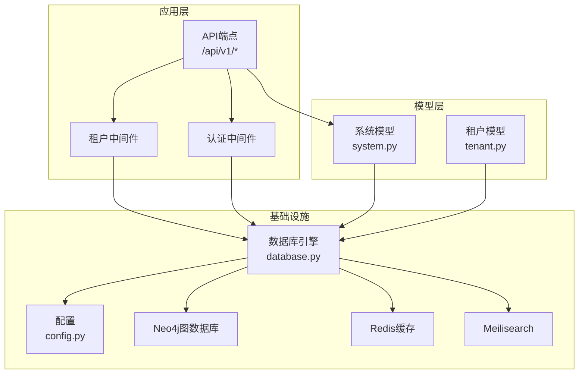
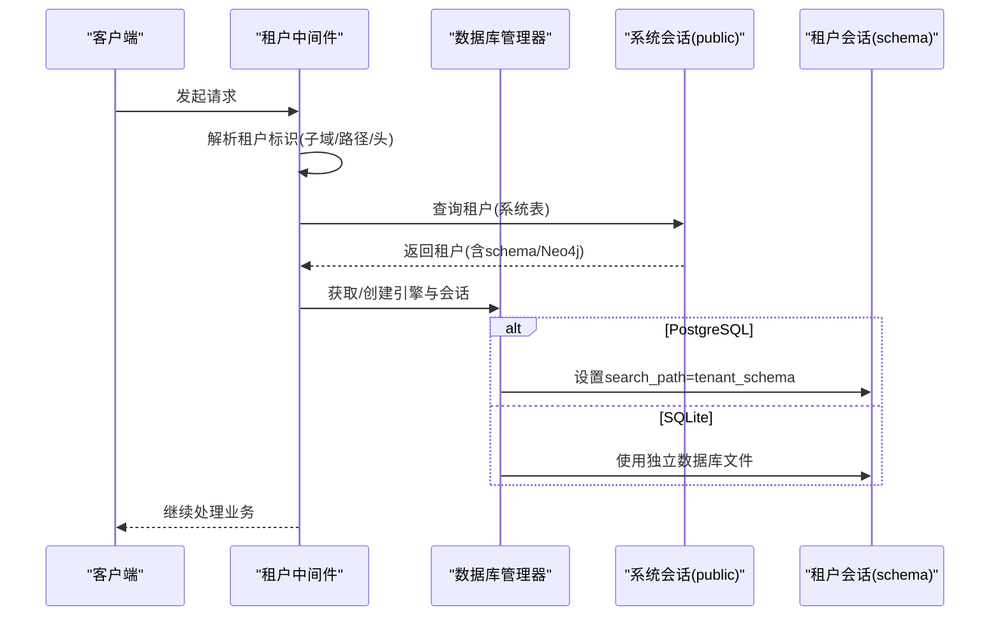
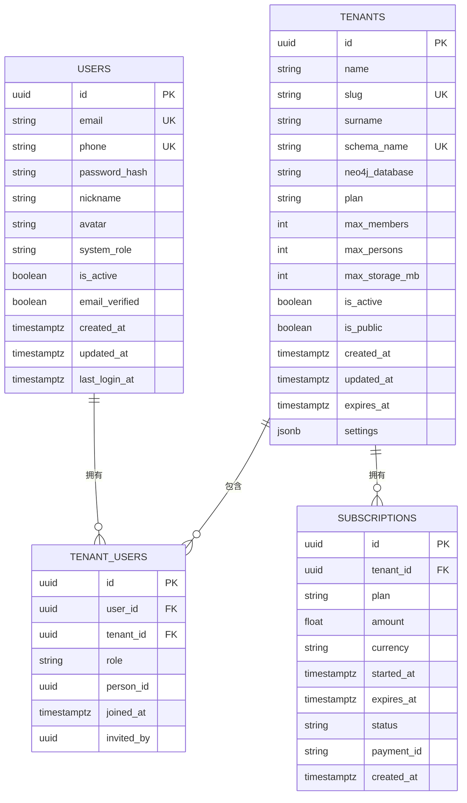
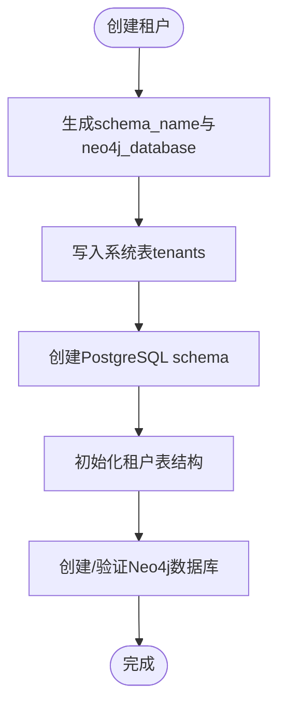
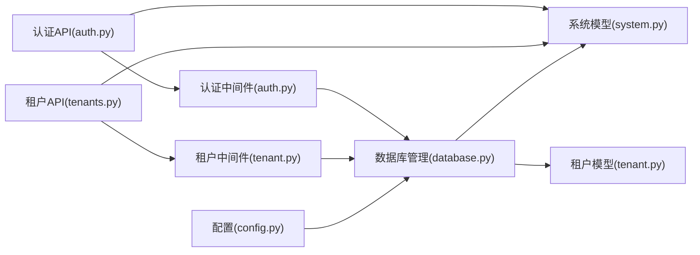

# 系统级数据模型

<cite>
**本文引用的文件**
- [system.py](file://backend/app/models/system.py)
- [tenant.py](file://backend/app/models/tenant.py)
- [001_initial.py](file://backend/migrations/versions/001_initial.py)
- [database.py](file://backend/app/core/database.py)
- [config.py](file://backend/app/core/config.py)
- [tenant.py（中间件）](file://backend/app/middleware/tenant.py)
- [auth.py（中间件）](file://backend/app/middleware/auth.py)
- [security.py](file://backend/app/core/security.py)
- [main.py](file://backend/app/main.py)
- [tenants.py（API端点）](file://backend/app/api/v1/endpoints/tenants.py)
- [auth.py（API端点）](file://backend/app/api/v1/endpoints/auth.py)
- [test_tenants.py](file://backend/tests/test_tenants.py)
- [create_tenant.py](file://scripts/create_tenant.py)
- [init.sql](file://docker/postgres/init.sql)
</cite>

## 目录
1. [简介](#简介)
2. [项目结构](#项目结构)
3. [核心组件](#核心组件)
4. [架构总览](#架构总览)
5. [详细组件分析](#详细组件分析)
6. [依赖关系分析](#依赖关系分析)
7. [性能考量](#性能考量)
8. [故障排查指南](#故障排查指南)
9. [结论](#结论)
10. [附录](#附录)

## 简介
本文件系统性梳理多租户族谱管理系统的“系统级数据模型”，聚焦于用户(User)、租户(Tenant)、租户用户(TenantUser)与订阅(Subscription)四大核心实体，明确字段定义、数据类型、约束与索引策略；阐述实体间一对多/多对多关系映射；说明主键生成策略（UUID与自增ID）、时间戳自动管理机制；解释系统角色权限体系（超级管理员、运营人员等）；并给出数据库schema隔离与Neo4j图数据库隔离的实现要点。文末提供表结构示例、使用示例与最佳实践。

## 项目结构
后端采用FastAPI + SQLAlchemy Async + Alembic迁移的分层架构：
- 模型层：系统级模型位于系统模式(public)，租户级模型位于各自schema中
- 迁移层：初始迁移脚本定义系统级表结构
- 中间件层：租户识别与会话上下文注入
- API层：认证与租户管理端点
- 配置层：数据库、Neo4j、Redis、搜索等外部服务配置
- 脚本层：租户创建与初始化工具

图表来源
- [main.py:45-92](file://backend/app/main.py#L45-L92)
- [database.py:24-171](file://backend/app/core/database.py#L24-L171)
- [tenant.py（中间件）:15-142](file://backend/app/middleware/tenant.py#L15-L142)
- [auth.py（中间件）:15-88](file://backend/app/middleware/auth.py#L15-L88)

章节来源
- [main.py:17-43](file://backend/app/main.py#L17-L43)
- [config.py:11-89](file://backend/app/core/config.py#L11-L89)

## 核心组件
本节从“字段定义、数据类型、约束、索引、关系映射、主键策略、时间戳”六个维度，系统化描述四个核心实体。

- 用户(User)
  - 字段与类型：主键id(UUID)、邮箱(唯一索引)、手机号(唯一)、密码哈希、昵称、头像、系统角色(system_role)、状态(is_active、email_verified)、时间戳(created_at、updated_at、last_login_at)
  - 约束与索引：邮箱唯一、手机号唯一、邮箱建立索引；created_at/updated_at默认值由服务器设置
  - 关系：与TenantUser为一对多（反向为users）
  - 主键策略：UUID，默认函数生成
  - 时间戳：服务器默认值与更新触发器
  - 角色属性：提供is_super_admin/is_operator便捷属性

- 租户(Tenant)
  - 字段与类型：主键id(UUID)、名称、slug(唯一索引)、姓氏、schema_name(唯一)、neo4j_database、套餐(plan)、容量(max_members/max_persons/max_storage_mb)、状态(is_active/is_public)、到期时间(expires_at)、配置(settings:JSONB)、时间戳
  - 约束与索引：slug唯一、schema_name唯一、slug建立索引
  - 关系：与TenantUser为一对多（反向为tenants）
  - 主键策略：UUID
  - 时间戳：服务器默认值与更新触发器

- 租户用户(TenantUser)
  - 字段与类型：主键id(UUID)、user_id(FK)、tenant_id(FK)、角色(role)、关联族谱人物(person_id)、加入时间(joined_at)、邀请人(invited_by)
  - 约束与索引：user_id/tenant_id建立索引；外键级联删除
  - 关系：与User/Tenant均为多对一
  - 主键策略：UUID
  - 角色属性：is_admin/can_edit/can_review便捷属性

- 订阅(Subscription)
  - 字段与类型：主键id(UUID)、tenant_id(FK)、套餐(plan)、金额(amount)/币种(currency)、起止时间(started_at/expires_at)、状态(status)、支付单号(payment_id)、创建时间(created_at)
  - 约束与索引：tenant_id建立索引；外键级联删除
  - 主键策略：UUID

章节来源
- [system.py:23-223](file://backend/app/models/system.py#L23-L223)

## 架构总览
系统通过中间件在请求生命周期内解析租户上下文，并按租户schema动态路由到对应数据库会话；同时，系统级表（public）用于存放全局元数据（用户、租户、订阅），租户级表（各schema）用于存放族谱数据（人物、分支、关系等）。Neo4j用于图数据存储，按租户隔离。

图表来源
- [tenant.py（中间件）:39-84](file://backend/app/middleware/tenant.py#L39-L84)
- [database.py:58-106](file://backend/app/core/database.py#L58-L106)
- [database.py:136-171](file://backend/app/core/database.py#L136-L171)

章节来源
- [tenant.py（中间件）:15-142](file://backend/app/middleware/tenant.py#L15-L142)
- [database.py:24-171](file://backend/app/core/database.py#L24-L171)

## 详细组件分析

### 实体关系与映射
- User 与 Tenant：通过 TenantUser 建立多对多关系（一个用户可属于多个租户，一个租户包含多个用户）
- Tenant 与 Subscription：一对多（一个租户可有多条订阅记录）
- TenantUser 与 User/Tenant：多对一（每条记录指向唯一用户与租户）

图表来源
- [system.py:23-223](file://backend/app/models/system.py#L23-L223)
- [001_initial.py:21-113](file://backend/migrations/versions/001_initial.py#L21-L113)

章节来源
- [system.py:23-223](file://backend/app/models/system.py#L23-L223)
- [001_initial.py:21-113](file://backend/migrations/versions/001_initial.py#L21-L113)

### 主键生成策略与UUID使用
- 系统级表（users、tenants、tenant_users、subscriptions）统一使用UUID作为主键，确保跨租户全局唯一与安全隔离
- 租户级表（如generation）仍使用自增整数主键，满足族谱内部有序编号需求
- 迁移脚本与模型定义均体现UUID主键与默认生成策略

章节来源
- [system.py:28-32](file://backend/app/models/system.py#L28-L32)
- [001_initial.py:27-47](file://backend/migrations/versions/001_initial.py#L27-L47)
- [tenant.py:28](file://backend/app/models/tenant.py#L28)

### 时间戳字段的自动管理
- 所有系统级与租户级模型均包含created_at与updated_at字段
- 服务器默认值由数据库函数提供，部分模型还配置了更新触发器以自动刷新updated_at
- 迁移脚本中明确设置了默认值与触发逻辑

章节来源
- [system.py:52-60](file://backend/app/models/system.py#L52-L60)
- [001_initial.py:40-46](file://backend/migrations/versions/001_initial.py#L40-L46)

### 租户隔离机制
- 数据库schema隔离：每个租户拥有独立schema，中间件在租户会话中设置search_path；SQLite模式下使用独立数据库文件
- Neo4j图数据库隔离：每个租户拥有独立数据库名或通过命名空间前缀实现隔离
- 初始化脚本负责创建schema与表结构，Neo4j数据库连接验证

图表来源
- [create_tenant.py:231-282](file://scripts/create_tenant.py#L231-L282)
- [create_tenant.py:18-44](file://scripts/create_tenant.py#L18-L44)
- [create_tenant.py:69-206](file://scripts/create_tenant.py#L69-L206)
- [create_tenant.py:208-229](file://scripts/create_tenant.py#L208-L229)

章节来源
- [database.py:58-106](file://backend/app/core/database.py#L58-L106)
- [database.py:136-171](file://backend/app/core/database.py#L136-L171)
- [create_tenant.py:18-44](file://scripts/create_tenant.py#L18-L44)
- [create_tenant.py:69-206](file://scripts/create_tenant.py#L69-L206)

### 系统角色权限体系
- 系统角色：system_role字段支持"super_admin"（超级管理员）、"operator"（运营人员）、"user"（普通用户）
- 租户角色：TenantUser.role支持"tenant_admin"/"editor"/"reviewer"/"member"
- 权限判定：User与TenantUser提供便捷属性进行快速判断（如is_super_admin、is_operator、is_admin、can_edit、can_review）
- 认证流程：JWT令牌签发与校验，支持访问/刷新令牌；中间件从Authorization头提取并验证

章节来源
- [system.py:90](file://backend/app/models/system.py#L90)
- [system.py:114-121](file://backend/app/models/system.py#L114-L121)
- [system.py:147](file://backend/app/models/system.py#L147)
- [system.py:170-181](file://backend/app/models/system.py#L170-L181)
- [auth.py（中间件）:15-88](file://backend/app/middleware/auth.py#L15-L88)
- [security.py:26-103](file://backend/app/core/security.py#L26-L103)

### 租户识别与上下文注入
- 识别顺序：URL路径(/t/{slug}) > 子域名(subdomain.domain) > 请求头(X-Tenant-ID)
- 上下文注入：request.state.tenant、tenant_schema、tenant_neo4j
- 公共路径：无需租户上下文（如认证、租户注册、健康检查）

章节来源
- [tenant.py（中间件）:15-142](file://backend/app/middleware/tenant.py#L15-L142)

### API与数据模型交互
- 租户列表/详情：基于系统表查询，支持按姓氏模糊过滤与分页
- 注册/登录：用户模型与JWT流程，登录成功更新最近登录时间
- 测试用例：覆盖租户列表、按slug查询、按姓氏搜索等场景

章节来源
- [tenants.py（API端点）:45-116](file://backend/app/api/v1/endpoints/tenants.py#L45-L116)
- [auth.py（API端点）:55-124](file://backend/app/api/v1/endpoints/auth.py#L55-L124)
- [test_tenants.py:11-112](file://backend/tests/test_tenants.py#L11-L112)

## 依赖关系分析
- 模型依赖：系统模型相互独立；租户模型依赖系统模型（如Person.created_by引用User）
- 运行时依赖：中间件依赖数据库管理器；API端点依赖模型与中间件
- 外部依赖：Neo4j、Redis、Meilisearch（可选）

图表来源
- [config.py:11-89](file://backend/app/core/config.py#L11-L89)
- [database.py:24-171](file://backend/app/core/database.py#L24-L171)
- [system.py:23-223](file://backend/app/models/system.py#L23-L223)
- [tenant.py:23-244](file://backend/app/models/tenant.py#L23-L244)
- [tenant.py（中间件）:15-142](file://backend/app/middleware/tenant.py#L15-L142)
- [auth.py（中间件）:15-88](file://backend/app/middleware/auth.py#L15-L88)
- [tenants.py（API端点）:1-164](file://backend/app/api/v1/endpoints/tenants.py#L1-L164)
- [auth.py（API端点）:1-179](file://backend/app/api/v1/endpoints/auth.py#L1-L179)

章节来源
- [main.py:45-92](file://backend/app/main.py#L45-L92)

## 性能考量
- 索引策略：系统级表的关键查询字段（如users.email、tenants.slug、tenant_users.user_id/tenant_id、subscriptions.tenant_id）已建立索引，建议在高并发场景下结合查询计划优化
- 连接池：非SQLite环境下启用连接池参数，合理设置pool_size与max_overflow
- schema切换：PostgreSQL通过SET search_path切换schema，避免硬编码schema前缀
- 时间戳：服务器默认值减少应用层开销，避免重复写入

章节来源
- [001_initial.py:48-104](file://backend/migrations/versions/001_initial.py#L48-L104)
- [database.py:33-56](file://backend/app/core/database.py#L33-L56)
- [database.py:136-171](file://backend/app/core/database.py#L136-L171)

## 故障排查指南
- 租户未找到/禁用：中间件返回404/403，检查slug是否正确、租户是否激活
- 认证失败：确认Authorization头格式、令牌有效性与过期时间
- 数据库连接异常：检查数据库URL、连接池参数与search_path设置
- Neo4j不可用：确认服务可达与凭据，注意社区版多数据库限制
- 初始化失败：核对PostgreSQL扩展(uuid-ossp/pg_trgm)与初始化SQL

章节来源
- [tenant.py（中间件）:40-84](file://backend/app/middleware/tenant.py#L40-L84)
- [auth.py（中间件）:15-88](file://backend/app/middleware/auth.py#L15-L88)
- [database.py:58-106](file://backend/app/core/database.py#L58-L106)
- [init.sql:1-8](file://docker/postgres/init.sql#L1-L8)

## 结论
该系统通过清晰的系统级与租户级模型分层、严格的租户隔离策略与完善的权限体系，实现了多租户族谱管理的核心能力。UUID主键与服务器默认值提升了安全性与一致性；中间件与数据库管理器协同保障了跨租户访问的可控性与可维护性。后续可在权限细化、审计追踪与搜索索引方面进一步增强。

## 附录

### 数据库表结构示例与字段说明（示意）
- users
  - id: UUID, 主键
  - email: 唯一索引
  - phone: 唯一
  - system_role: 默认"user"
  - is_active/email_verified: 状态位
  - created_at/updated_at: 服务器默认值
  - last_login_at: 登录时间

- tenants
  - id: UUID, 主键
  - slug: 唯一索引
  - schema_name: 唯一
  - plan/max_members/max_persons/max_storage_mb: 套餐与容量
  - is_active/is_public: 状态
  - settings: JSONB配置
  - created_at/updated_at/expires_at: 时间戳

- tenant_users
  - id: UUID, 主键
  - user_id/tenant_id: 外键(FK)
  - role: 默认"member"
  - person_id: 关联族谱人物
  - joined_at: 加入时间
  - invited_by: 邀请人

- subscriptions
  - id: UUID, 主键
  - tenant_id: 外键(FK)
  - plan/amount/currency: 套餐与计费
  - started_at/expires_at: 有效期
  - status: 状态
  - payment_id: 支付单号
  - created_at: 创建时间

章节来源
- [001_initial.py:25-104](file://backend/migrations/versions/001_initial.py#L25-L104)
- [system.py:23-223](file://backend/app/models/system.py#L23-L223)

### 使用示例与最佳实践
- 创建租户
  - 通过CLI脚本或API端点创建租户，系统自动生成schema_name与neo4j_database
  - 初始化PostgreSQL schema与表结构，验证Neo4j连接
- 用户注册与登录
  - 注册时密码加密存储；登录成功更新最近登录时间
  - 使用JWT令牌访问受保护接口
- 权限控制
  - 超级管理员与运营人员具备更高权限；租户内按角色控制编辑/审核能力
- 数据隔离
  - 严格遵循中间件的租户上下文注入，避免跨租户数据泄露
- 性能优化
  - 合理设置连接池参数；为高频查询字段建立索引；利用服务器默认值减少应用层写入

章节来源
- [create_tenant.py:231-282](file://scripts/create_tenant.py#L231-L282)
- [auth.py（API端点）:55-124](file://backend/app/api/v1/endpoints/auth.py#L55-L124)
- [tenants.py（API端点）:118-164](file://backend/app/api/v1/endpoints/tenants.py#L118-L164)
- [system.py:114-181](file://backend/app/models/system.py#L114-L181)