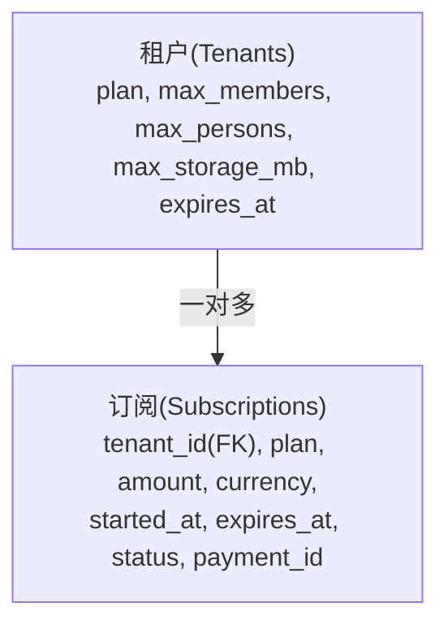
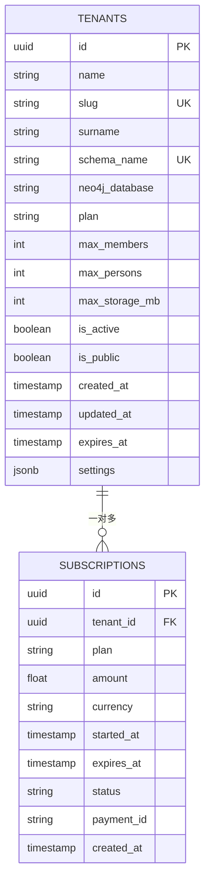
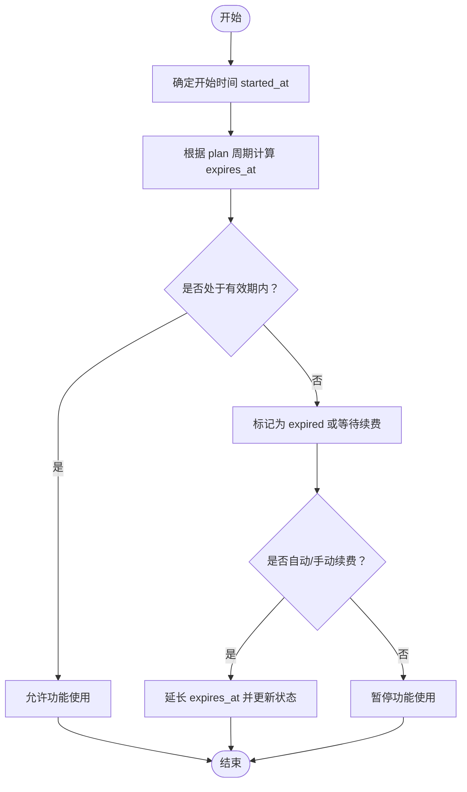
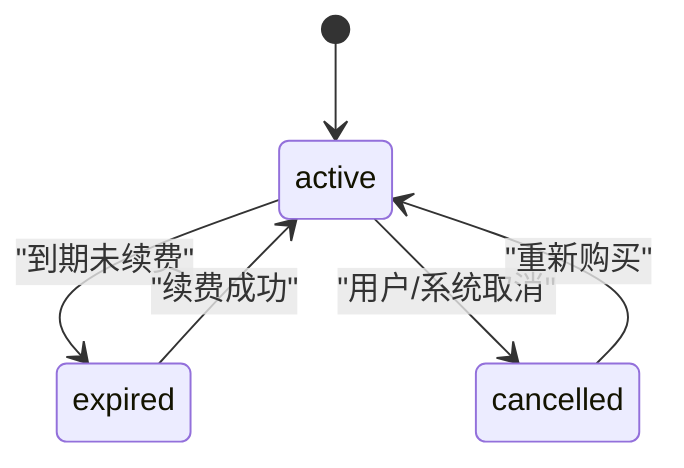
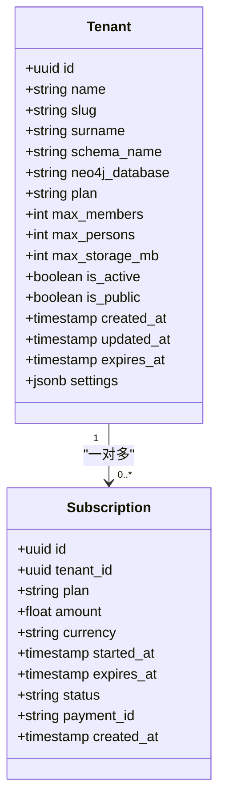
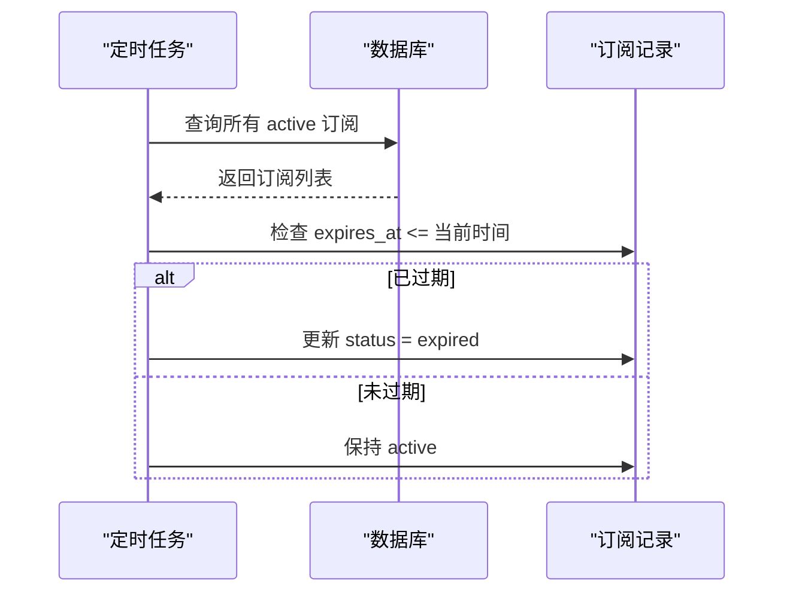
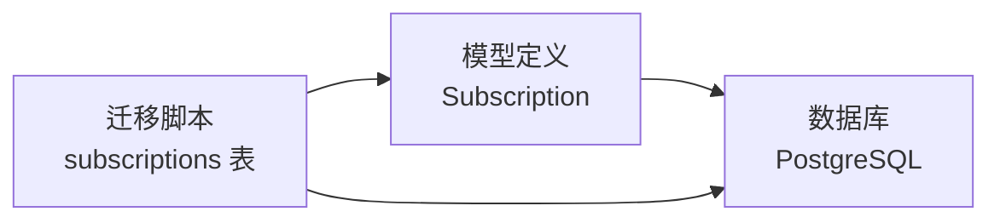

# 订阅模型

<cite>
**本文引用的文件**
- [backend/app/models/system.py](file://backend/app/models/system.py)
- [backend/migrations/versions/001_initial.py](file://backend/migrations/versions/001_initial.py)
- [docs/ARCHITECTURE.md](file://docs/ARCHITECTURE.md)
- [backend/app/api/v1/endpoints/tenants.py](file://backend/app/api/v1/endpoints/tenants.py)
- [scripts/init3init_system.py](file://scripts/init3init_system.py)
</cite>

## 目录
1. [简介](#简介)
2. [项目结构](#项目结构)
3. [核心组件](#核心组件)
4. [架构总览](#架构总览)
5. [详细组件分析](#详细组件分析)
6. [依赖分析](#依赖分析)
7. [性能考虑](#性能考虑)
8. [故障排查指南](#故障排查指南)
9. [结论](#结论)
10. [附录](#附录)

## 简介
本文件系统化梳理多租户族谱管理系统的“订阅（Subscription）”模型，覆盖以下关键主题：
- 订阅记录实体字段定义：tenant_id 外键、plan 套餐类型、amount 金额、currency 货币类型、started_at 开始时间、expires_at 结束时间、status 状态、payment_id 支付凭证号等。
- 订阅时长管理：开始与到期时间的计算方式、续费机制与策略。
- 订阅状态管理：active、expired、cancelled 状态的转换规则与触发条件。
- 支付信息记录：payment_id 的存储与验证流程建议。
- 订阅与租户的关系映射：一对多关系与级联删除策略。
- 过期检测与自动续费：实现机制与最佳实践。
- 实际操作示例与业务逻辑说明。
- 最佳实践与异常处理方案。

## 项目结构
订阅模型位于系统级公共模式（public schema）中，与租户（Tenant）模型通过外键建立一对多关系。迁移脚本与架构文档提供了数据库层面的建模依据；前端展示中也体现了 plan 字段在租户列表中的使用。

图表来源
- [backend/app/models/system.py:23-70](file://backend/app/models/system.py#L23-L70)
- [backend/app/models/system.py:183-222](file://backend/app/models/system.py#L183-L222)
- [backend/migrations/versions/001_initial.py:25-48](file://backend/migrations/versions/001_initial.py#L25-L48)
- [backend/migrations/versions/001_initial.py:88-104](file://backend/migrations/versions/001_initial.py#L88-L104)

章节来源
- [backend/app/models/system.py:23-70](file://backend/app/models/system.py#L23-L70)
- [backend/app/models/system.py:183-222](file://backend/app/models/system.py#L183-L222)
- [backend/migrations/versions/001_initial.py:25-48](file://backend/migrations/versions/001_initial.py#L25-L48)
- [backend/migrations/versions/001_initial.py:88-104](file://backend/migrations/versions/001_initial.py#L88-L104)
- [docs/ARCHITECTURE.md:274-358](file://docs/ARCHITECTURE.md#L274-L358)

## 核心组件
- 租户（Tenant）模型：包含 plan、max_members、max_persons、max_storage_mb、expires_at 等字段，用于表达租户的订阅级别与有效期。
- 订阅（Subscription）模型：记录单次订阅详情，包含套餐、金额、货币、起止时间、状态与支付凭证号等。

章节来源
- [backend/app/models/system.py:23-70](file://backend/app/models/system.py#L23-L70)
- [backend/app/models/system.py:183-222](file://backend/app/models/system.py#L183-L222)

## 架构总览
订阅模型与租户模型的关系如下：
- 外键约束：subscriptions.tenant_id 引用 tenants.id，并设置级联删除（ondelete='CASCADE'），确保租户删除时其所有订阅记录被一并清理。
- 关系映射：Tenant.users 与 Tenant.subscriptions 在代码中体现为一对多关系（Tenant 与 Subscription 通过 tenant_id 关联）。
- 数据库索引：subscriptions.tenant_id 建有索引，提升查询效率。

图表来源
- [backend/migrations/versions/001_initial.py:25-48](file://backend/migrations/versions/001_initial.py#L25-L48)
- [backend/migrations/versions/001_initial.py:88-104](file://backend/migrations/versions/001_initial.py#L88-L104)
- [docs/ARCHITECTURE.md:279-358](file://docs/ARCHITECTURE.md#L279-L358)

章节来源
- [backend/migrations/versions/001_initial.py:88-104](file://backend/migrations/versions/001_initial.py#L88-L104)
- [docs/ARCHITECTURE.md:274-358](file://docs/ARCHITECTURE.md#L274-L358)

## 详细组件分析

### 订阅实体字段定义
- tenant_id：UUID 类型，非空，作为外键引用 tenants.id，并建立索引；删除租户时级联删除其订阅记录。
- plan：字符串，非空，表示订阅套餐类型（如 free、professional 等）。
- amount：浮点数，可空，表示订单金额。
- currency：字符串，默认 CNY，表示货币类型。
- started_at：时间戳（带时区），非空，表示订阅生效开始时间。
- expires_at：时间戳（带时区），非空，表示订阅到期结束时间。
- status：字符串，默认 active，表示订阅状态（active、expired、cancelled）。
- payment_id：字符串，可空，存储支付凭证号。
- created_at：时间戳（带时区），服务器默认值，记录创建时间。

章节来源
- [backend/app/models/system.py:183-222](file://backend/app/models/system.py#L183-L222)
- [backend/migrations/versions/001_initial.py:88-104](file://backend/migrations/versions/001_initial.py#L88-L104)
- [docs/ARCHITECTURE.md:342-358](file://docs/ARCHITECTURE.md#L342-L358)

### 订阅时长管理与续费机制
- 开始时间与结束时间：
  - started_at 通常为当前时间或支付确认后的某个时间点。
  - expires_at 由 plan 对应的周期（如月、年）与 started_at 计算得出。
- 续费策略：
  - 自动续费：在到期前检查订阅状态与支付状态，若有效则按 plan 周期延长 expires_at。
  - 手动续费：用户支付后更新 amount、currency、payment_id，并延长 expires_at。
- 时区一致性：started_at 与 expires_at 均为带时区的时间戳，避免跨时区误差。

图表来源
- [backend/app/models/system.py:183-222](file://backend/app/models/system.py#L183-L222)
- [backend/migrations/versions/001_initial.py:88-104](file://backend/migrations/versions/001_initial.py#L88-L104)

章节来源
- [backend/app/models/system.py:183-222](file://backend/app/models/system.py#L183-L222)
- [backend/migrations/versions/001_initial.py:88-104](file://backend/migrations/versions/001_initial.py#L88-L104)

### 订阅状态管理
- active：有效状态，允许使用付费功能。
- expired：已过期状态，需续费方可恢复。
- cancelled：取消状态，通常由用户主动取消或支付失败导致。
- 状态转换规则：
  - active → expired：当系统检测到 expires_at 小于当前时间。
  - expired → active：续费成功后更新 expires_at 并切换为 active。
  - active/cancelled：由管理员或支付回调触发，更新 status 与 expires_at。

图表来源
- [backend/app/models/system.py:209-210](file://backend/app/models/system.py#L209-L210)
- [docs/ARCHITECTURE.md:353-353](file://docs/ARCHITECTURE.md#L353-L353)

章节来源
- [backend/app/models/system.py:209-210](file://backend/app/models/system.py#L209-L210)
- [docs/ARCHITECTURE.md:353-353](file://docs/ARCHITECTURE.md#L353-L353)

### 支付信息记录与验证
- payment_id：存储第三方支付平台返回的凭证号，便于对账与审计。
- 存储流程：支付完成后，将 payment_id 写入 subscriptions.payment_id。
- 验证流程建议：
  - 回调校验：收到支付平台回调时，先查询对应 payment_id 的订单状态，再决定是否更新 expires_at 与 status。
  - 幂等性：防止重复回调导致的状态不一致，采用幂等键（如 payment_id）进行去重。
  - 审计日志：记录每次支付事件与状态变更，便于问题追踪。

章节来源
- [backend/app/models/system.py:213-213](file://backend/app/models/system.py#L213-L213)
- [backend/migrations/versions/001_initial.py:99-99](file://backend/migrations/versions/001_initial.py#L99-L99)

### 订阅与租户的一对多关系与级联删除
- 关系映射：Tenant 与 Subscription 通过 tenant_id 建立一对多关系。
- 级联删除：删除租户时，其所有订阅记录将被级联删除，保证数据一致性。
- 索引优化：subscriptions.tenant_id 建有索引，加速按租户查询订阅记录。

图表来源
- [backend/app/models/system.py:23-70](file://backend/app/models/system.py#L23-L70)
- [backend/app/models/system.py:183-222](file://backend/app/models/system.py#L183-L222)

章节来源
- [backend/app/models/system.py:23-70](file://backend/app/models/system.py#L23-L70)
- [backend/app/models/system.py:183-222](file://backend/app/models/system.py#L183-L222)
- [backend/migrations/versions/001_initial.py:101-101](file://backend/migrations/versions/001_initial.py#L101-L101)
- [backend/migrations/versions/001_initial.py:104-104](file://backend/migrations/versions/001_initial.py#L104-L104)

### 过期检测与自动续费实现机制
- 过期检测：
  - 后台定时任务扫描 subscriptions，比较 expires_at 与当前时间，将过期记录标记为 expired。
- 自动续费：
  - 若 plan 支持自动续费且上次续费成功，则按周期延长 expires_at。
  - 更新 status 为 active，并记录续费事件。
- 手动续费：
  - 用户完成支付后，更新 amount、currency、payment_id，并延长 expires_at。

图表来源
- [backend/app/models/system.py:209-210](file://backend/app/models/system.py#L209-L210)
- [backend/migrations/versions/001_initial.py:96-97](file://backend/migrations/versions/001_initial.py#L96-L97)

章节来源
- [backend/app/models/system.py:209-210](file://backend/app/models/system.py#L209-L210)
- [backend/migrations/versions/001_initial.py:96-97](file://backend/migrations/versions/001_initial.py#L96-L97)

### 实际操作示例与业务逻辑说明
- 创建订阅：
  - 输入：tenant_id、plan、amount、currency、started_at、expires_at、status、payment_id。
  - 逻辑：校验 plan 与周期，生成 UUID 主键，写入数据库。
- 续费：
  - 输入：payment_id、amount、currency。
  - 逻辑：查询当前订阅，延长 expires_at，更新 status 为 active。
- 状态更新：
  - 触发：到期检测、用户取消、支付失败。
  - 逻辑：根据事件更新 status 与 expires_at，并记录审计。

章节来源
- [backend/app/models/system.py:183-222](file://backend/app/models/system.py#L183-L222)
- [backend/migrations/versions/001_initial.py:88-104](file://backend/migrations/versions/001_initial.py#L88-L104)

## 依赖分析
- 外键依赖：subscriptions.tenant_id → tenants.id，ondelete='CASCADE'。
- 索引依赖：subscriptions.tenant_id 建有索引，提升查询性能。
- 架构一致性：数据库迁移脚本与模型定义保持一致，确保字段类型与时序正确。

图表来源
- [backend/migrations/versions/001_initial.py:88-104](file://backend/migrations/versions/001_initial.py#L88-L104)
- [backend/app/models/system.py:183-222](file://backend/app/models/system.py#L183-L222)

章节来源
- [backend/migrations/versions/001_initial.py:88-104](file://backend/migrations/versions/001_initial.py#L88-L104)
- [backend/app/models/system.py:183-222](file://backend/app/models/system.py#L183-L222)

## 性能考虑
- 索引优化：为 subscriptions.tenant_id 建立索引，加速按租户查询与统计。
- 时间字段时区：started_at 与 expires_at 使用带时区时间戳，避免跨时区计算误差。
- 批处理续费：定时任务批量扫描与更新，减少频繁 IO。
- 缓存策略：对热点租户的订阅状态进行短期缓存，降低数据库压力。

## 故障排查指南
- 订阅未生效：
  - 检查 started_at 与 expires_at 是否正确设置。
  - 确认 status 为 active。
- 续费失败：
  - 核对 payment_id 是否重复或缺失。
  - 查看支付回调日志与幂等键处理。
- 过期未触发：
  - 检查定时任务执行情况与时间同步。
  - 确认数据库时区配置一致。
- 级联删除异常：
  - 确认外键约束与索引存在。
  - 检查删除租户前的依赖清理。

章节来源
- [backend/migrations/versions/001_initial.py:101-101](file://backend/migrations/versions/001_initial.py#L101-L101)
- [backend/migrations/versions/001_initial.py:104-104](file://backend/migrations/versions/001_initial.py#L104-L104)

## 结论
订阅模型以清晰的字段定义与严谨的外键约束为基础，结合明确的状态机与续费策略，支撑多租户族谱系统的商业化运营。通过索引优化与定时任务机制，可实现稳定高效的订阅生命周期管理。建议在生产环境中强化支付回调的幂等性与审计日志，确保数据一致性与可追溯性。

## 附录
- 初始化脚本：提供 subscriptions 表的创建与索引，确保系统启动即具备订阅能力。
- 前端展示：租户列表接口返回 plan 字段，便于前端识别订阅级别。

章节来源
- [scripts/init3init_system.py:169-185](file://scripts/init3init_system.py#L169-L185)
- [backend/app/api/v1/endpoints/tenants.py:70-81](file://backend/app/api/v1/endpoints/tenants.py#L70-L81)