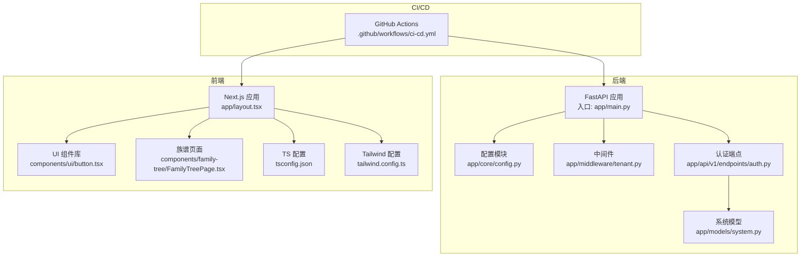
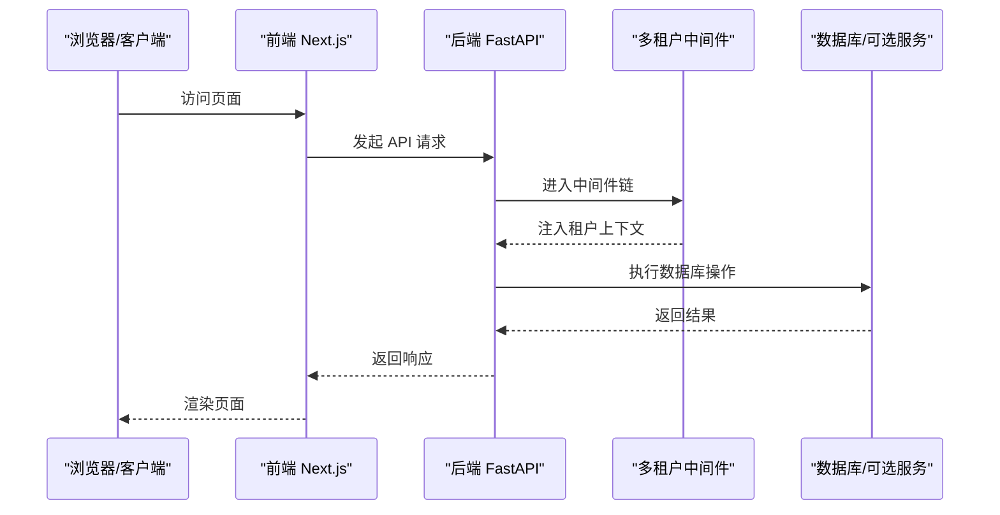
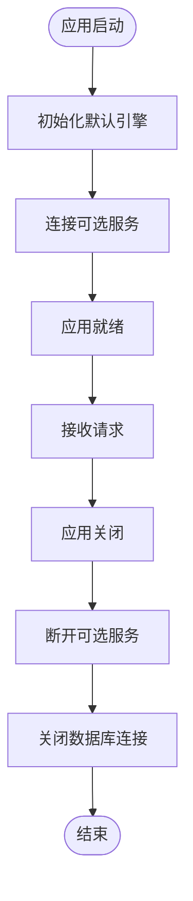
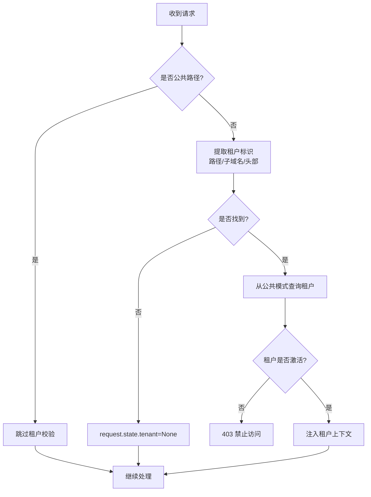
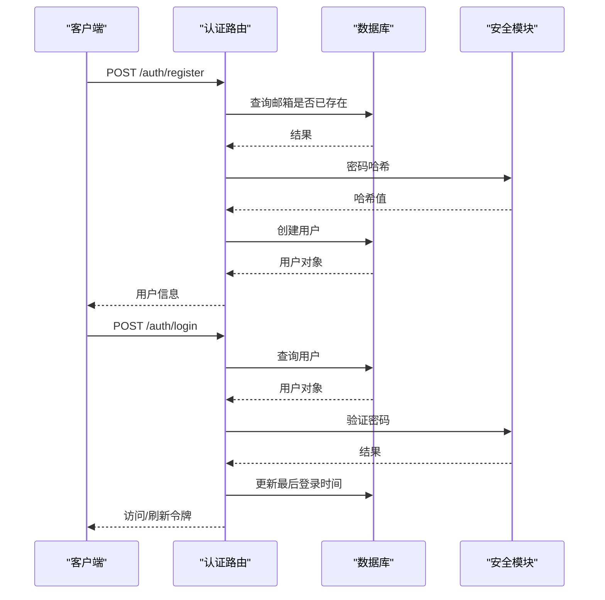
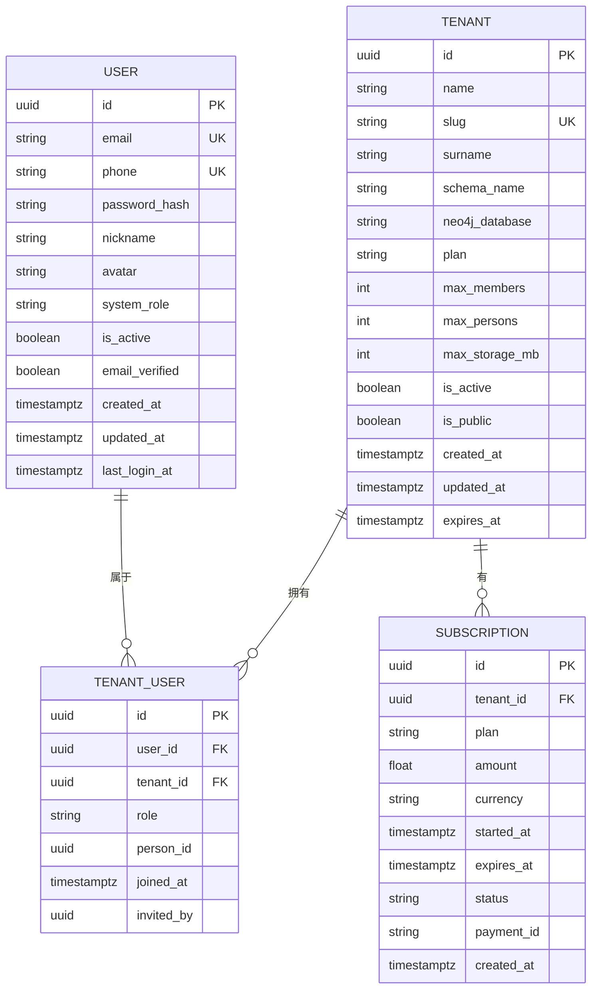
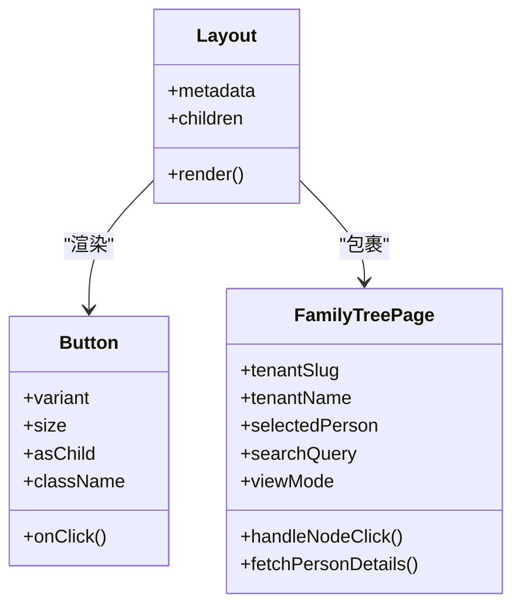
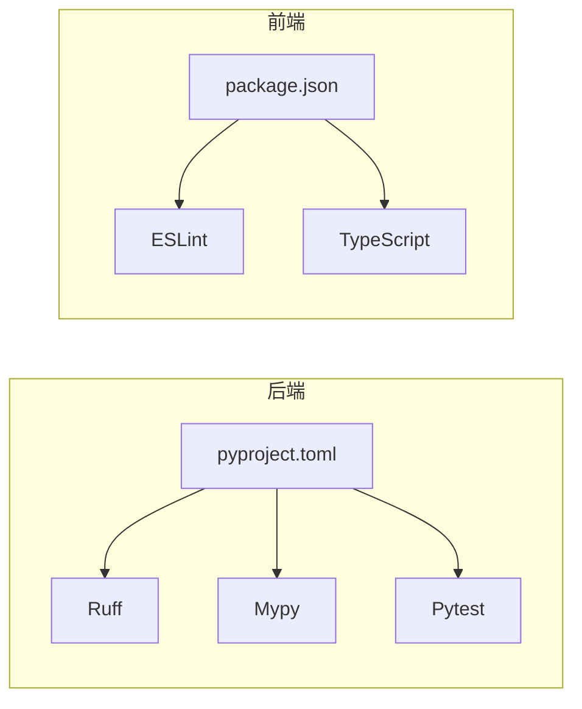

# 代码质量保证

<cite>
**本文引用的文件**
- [backend/pyproject.toml](file://backend/pyproject.toml)
- [backend/app/main.py](file://backend/app/main.py)
- [backend/app/core/config.py](file://backend/app/core/config.py)
- [backend/app/middleware/tenant.py](file://backend/app/middleware/tenant.py)
- [backend/app/api/v1/endpoints/auth.py](file://backend/app/api/v1/endpoints/auth.py)
- [backend/app/models/system.py](file://backend/app/models/system.py)
- [backend/tests/conftest.py](file://backend/tests/conftest.py)
- [.github/workflows/ci-cd.yml](file://.github/workflows/ci-cd.yml)
- [frontend/package.json](file://frontend/package.json)
- [frontend/tsconfig.json](file://frontend/tsconfig.json)
- [frontend/tailwind.config.ts](file://frontend/tailwind.config.ts)
- [frontend/app/layout.tsx](file://frontend/app/layout.tsx)
- [frontend/components/ui/button.tsx](file://frontend/components/ui/button.tsx)
- [frontend/components/family-tree/FamilyTreePage.tsx](file://frontend/components/family-tree/FamilyTreePage.tsx)
</cite>

## 目录
1. [引言](#引言)
2. [项目结构](#项目结构)
3. [核心组件](#核心组件)
4. [架构总览](#架构总览)
5. [详细组件分析](#详细组件分析)
6. [依赖分析](#依赖分析)
7. [性能考量](#性能考量)
8. [故障排查指南](#故障排查指南)
9. [结论](#结论)
10. [附录](#附录)

## 引言
本指南面向多租户族谱管理系统，聚焦后端（Python/FastAPI）与前端（TypeScript/Next.js）的代码质量保证最佳实践，覆盖编码规范、类型注解、错误处理、异步编程、前端类型安全与组件设计、状态管理、API 调用规范、单元与集成测试、代码审查清单、静态分析与 CI/CD 质量门禁等主题。目标是帮助团队在开发过程中持续产出高质量、可维护、可扩展且安全的代码。

## 项目结构
系统采用前后端分离架构：后端基于 FastAPI 提供多租户 API；前端基于 Next.js 构建多页面应用，通过 TypeScript 保障类型安全，并使用 TailwindCSS 管理样式。CI/CD 流水线在 GitHub Actions 中完成后端测试、前端检查与构建、镜像推送及部署。

图表来源
- [backend/app/main.py:1-103](file://backend/app/main.py#L1-L103)
- [backend/app/core/config.py:1-89](file://backend/app/core/config.py#L1-L89)
- [backend/app/middleware/tenant.py:1-142](file://backend/app/middleware/tenant.py#L1-L142)
- [backend/app/api/v1/endpoints/auth.py:1-179](file://backend/app/api/v1/endpoints/auth.py#L1-L179)
- [backend/app/models/system.py:1-223](file://backend/app/models/system.py#L1-L223)
- [frontend/app/layout.tsx:1-28](file://frontend/app/layout.tsx#L1-L28)
- [frontend/components/ui/button.tsx:1-56](file://frontend/components/ui/button.tsx#L1-L56)
- [frontend/components/family-tree/FamilyTreePage.tsx:1-226](file://frontend/components/family-tree/FamilyTreePage.tsx#L1-L226)
- [frontend/tsconfig.json:1-28](file://frontend/tsconfig.json#L1-L28)
- [frontend/tailwind.config.ts:1-36](file://frontend/tailwind.config.ts#L1-L36)
- [.github/workflows/ci-cd.yml:1-160](file://.github/workflows/ci-cd.yml#L1-L160)

章节来源
- [backend/app/main.py:1-103](file://backend/app/main.py#L1-L103)
- [frontend/app/layout.tsx:1-28](file://frontend/app/layout.tsx#L1-L28)

## 核心组件
- 后端应用生命周期与健康检查：应用启动时初始化数据库引擎、连接可选服务，关闭时释放资源；提供健康检查端点返回服务可用性。
- 配置中心：集中管理应用名称、版本、API 前缀、服务器地址、数据库、Redis、Meilisearch、JWT、CORS、存储等配置项。
- 多租户中间件：按路径前缀、子域名或请求头识别租户，校验租户存在性与激活状态，注入租户上下文。
- 认证端点：注册、登录、刷新令牌、当前用户信息查询，使用密码哈希与 JWT。
- 系统模型：定义租户、用户、租户-用户关系、订阅等核心实体。
- 前端布局与组件：根布局、UI 组件库按钮、族谱页面，使用 TypeScript 类型约束与 Tailwind 主题。

章节来源
- [backend/app/main.py:17-43](file://backend/app/main.py#L17-L43)
- [backend/app/main.py:72-86](file://backend/app/main.py#L72-L86)
- [backend/app/core/config.py:11-89](file://backend/app/core/config.py#L11-L89)
- [backend/app/middleware/tenant.py:15-84](file://backend/app/middleware/tenant.py#L15-L84)
- [backend/app/api/v1/endpoints/auth.py:55-87](file://backend/app/api/v1/endpoints/auth.py#L55-L87)
- [backend/app/models/system.py:23-71](file://backend/app/models/system.py#L23-L71)
- [frontend/app/layout.tsx:8-27](file://frontend/app/layout.tsx#L8-L27)
- [frontend/components/ui/button.tsx:6-33](file://frontend/components/ui/button.tsx#L6-L33)

## 架构总览
后端通过 FastAPI 暴露 REST 接口，中间件负责多租户上下文注入；前端通过 Next.js 页面与组件消费 API，使用 TypeScript 与 Tailwind 管理类型与样式；CI/CD 在 GitHub Actions 中执行测试、类型检查与构建。

图表来源
- [backend/app/middleware/tenant.py:39-84](file://backend/app/middleware/tenant.py#L39-L84)
- [backend/app/api/v1/endpoints/auth.py:55-87](file://backend/app/api/v1/endpoints/auth.py#L55-L87)
- [frontend/components/family-tree/FamilyTreePage.tsx:51-61](file://frontend/components/family-tree/FamilyTreePage.tsx#L51-L61)

## 详细组件分析

### 后端：应用生命周期与健康检查
- 生命周期管理：使用 lifespan 钩子在启动阶段初始化默认数据库引擎、连接可选服务，在关闭阶段断开服务与数据库连接。
- 健康检查：/health 返回应用版本与服务可用性状态，便于运维监控。

图表来源
- [backend/app/main.py:17-43](file://backend/app/main.py#L17-L43)
- [backend/app/main.py:72-86](file://backend/app/main.py#L72-L86)

章节来源
- [backend/app/main.py:17-43](file://backend/app/main.py#L17-L43)
- [backend/app/main.py:72-86](file://backend/app/main.py#L72-L86)

### 后端：多租户中间件
- 租户识别顺序：URL 路径前缀、子域名、请求头；对公共路径（如 /api/v1/auth、/health）跳过租户校验。
- 租户校验：从公共模式查询租户，校验是否存在与是否激活；将租户上下文注入 request.state。
- 错误处理：未找到租户返回 404，租户未激活返回 403。

图表来源
- [backend/app/middleware/tenant.py:39-84](file://backend/app/middleware/tenant.py#L39-L84)
- [backend/app/middleware/tenant.py:116-125](file://backend/app/middleware/tenant.py#L116-L125)

章节来源
- [backend/app/middleware/tenant.py:15-84](file://backend/app/middleware/tenant.py#L15-L84)
- [backend/app/middleware/tenant.py:116-125](file://backend/app/middleware/tenant.py#L116-L125)

### 后端：认证端点
- 注册：校验邮箱唯一性，生成密码哈希，创建用户并返回用户信息。
- 登录：查找用户并验证密码，更新最后登录时间，签发访问与刷新令牌。
- 刷新：验证刷新令牌，重新签发新令牌。
- 当前用户：返回当前用户信息。

图表来源
- [backend/app/api/v1/endpoints/auth.py:55-87](file://backend/app/api/v1/endpoints/auth.py#L55-L87)
- [backend/app/api/v1/endpoints/auth.py:89-124](file://backend/app/api/v1/endpoints/auth.py#L89-L124)
- [backend/app/api/v1/endpoints/auth.py:126-158](file://backend/app/api/v1/endpoints/auth.py#L126-L158)
- [backend/app/api/v1/endpoints/auth.py:161-179](file://backend/app/api/v1/endpoints/auth.py#L161-L179)

章节来源
- [backend/app/api/v1/endpoints/auth.py:55-87](file://backend/app/api/v1/endpoints/auth.py#L55-L87)
- [backend/app/api/v1/endpoints/auth.py:89-124](file://backend/app/api/v1/endpoints/auth.py#L89-L124)
- [backend/app/api/v1/endpoints/auth.py:126-158](file://backend/app/api/v1/endpoints/auth.py#L126-L158)
- [backend/app/api/v1/endpoints/auth.py:161-179](file://backend/app/api/v1/endpoints/auth.py#L161-L179)

### 后端：系统模型
- 租户模型：包含名称、slug、姓氏、数据库隔离字段（schema 名称、Neo4j 数据库名）、订阅配额、状态与元数据。
- 用户模型：邮箱唯一、密码哈希、昵称、头像、系统角色、状态与时间戳、最近登录时间。
- 租户-用户关系：用户在租户中的角色与加入时间等。
- 订阅模型：租户订阅计划、金额、货币、起止时间、状态与支付信息。

图表来源
- [backend/app/models/system.py:23-71](file://backend/app/models/system.py#L23-L71)
- [backend/app/models/system.py:73-121](file://backend/app/models/system.py#L73-L121)
- [backend/app/models/system.py:123-181](file://backend/app/models/system.py#L123-L181)
- [backend/app/models/system.py:183-223](file://backend/app/models/system.py#L183-L223)

章节来源
- [backend/app/models/system.py:23-71](file://backend/app/models/system.py#L23-L71)
- [backend/app/models/system.py:73-121](file://backend/app/models/system.py#L73-L121)
- [backend/app/models/system.py:123-181](file://backend/app/models/system.py#L123-L181)
- [backend/app/models/system.py:183-223](file://backend/app/models/system.py#L183-L223)

### 前端：布局与组件
- 根布局：定义站点元数据、字体变量与客户端提供者，启用防水合闪烁。
- UI 组件：按钮组件使用变体与尺寸配置，支持透传属性与组合模式。
- 族谱页面：动态导入可视化组件以避免 SSR 问题；提供搜索、视图切换与人物详情面板。

图表来源
- [frontend/app/layout.tsx:8-27](file://frontend/app/layout.tsx#L8-L27)
- [frontend/components/ui/button.tsx:35-56](file://frontend/components/ui/button.tsx#L35-L56)
- [frontend/components/family-tree/FamilyTreePage.tsx:36-129](file://frontend/components/family-tree/FamilyTreePage.tsx#L36-L129)

章节来源
- [frontend/app/layout.tsx:8-27](file://frontend/app/layout.tsx#L8-L27)
- [frontend/components/ui/button.tsx:6-33](file://frontend/components/ui/button.tsx#L6-L33)
- [frontend/components/family-tree/FamilyTreePage.tsx:11-22](file://frontend/components/family-tree/FamilyTreePage.tsx#L11-L22)

## 依赖分析
- 后端依赖：FastAPI、Pydantic、SQLAlchemy、asyncpg、aiosqlite、Alembic、Redis、Neo4j、Meilisearch、HTTPX、Passlib、Uvicorn 等。
- 前端依赖：Next.js、React、Zustand、TanStack React Query、Axios、TailwindCSS、Radix UI、Lucide React 等。
- 开发依赖：Ruff（代码风格）、Mypy（类型检查）、Pytest（测试）、Codecov（覆盖率）等。

图表来源
- [backend/pyproject.toml:7-36](file://backend/pyproject.toml#L7-L36)
- [backend/pyproject.toml:45-61](file://backend/pyproject.toml#L45-L61)
- [frontend/package.json:12-43](file://frontend/package.json#L12-L43)

章节来源
- [backend/pyproject.toml:7-36](file://backend/pyproject.toml#L7-L36)
- [backend/pyproject.toml:45-61](file://backend/pyproject.toml#L45-L61)
- [frontend/package.json:12-43](file://frontend/package.json#L12-L43)

## 性能考量
- 异步与并发：后端使用 SQLAlchemy Async 与 asyncpg/aiosqlite，建议在高并发场景下合理配置连接池大小与超时参数。
- 可选服务降级：Neo4j、Redis、Meilisearch 为可选服务，应用应具备在这些服务不可用时的降级能力与清晰日志提示。
- 前端渲染：动态导入重型可视化组件，避免 SSR 渲染阻塞；列表/树视图切换减少不必要的重渲染。
- 缓存与索引：对高频查询建立合适索引，结合缓存策略降低数据库压力。

## 故障排查指南
- 认证失败：检查邮箱唯一性、密码哈希与 JWT 签发流程；确认用户状态与刷新令牌有效性。
- 多租户错误：核对租户 slug 是否正确、租户是否激活；检查中间件路径匹配与请求头设置。
- 健康检查异常：确认数据库连接字符串、可选服务可达性与环境变量配置。
- 前端 API 调用：检查 API 前缀、租户路径拼接与错误处理分支；确保动态导入组件的加载状态与回退 UI。

章节来源
- [backend/app/api/v1/endpoints/auth.py:55-87](file://backend/app/api/v1/endpoints/auth.py#L55-L87)
- [backend/app/middleware/tenant.py:40-84](file://backend/app/middleware/tenant.py#L40-L84)
- [backend/app/main.py:72-86](file://backend/app/main.py#L72-L86)
- [frontend/components/family-tree/FamilyTreePage.tsx:51-61](file://frontend/components/family-tree/FamilyTreePage.tsx#L51-L61)

## 结论
本项目在后端与前端均建立了较为完善的基础设施：后端通过 FastAPI、异步 ORM 与多租户中间件实现高可扩展性；前端通过 TypeScript、组件化与动态导入保障类型安全与运行效率。配合 CI/CD 的自动化测试与构建，以及静态分析工具配置，能够有效提升整体代码质量与交付稳定性。后续可在以下方面持续改进：完善鉴权依赖注入、增强错误边界与日志、细化测试覆盖与 Mock 策略、优化可选服务的可观测性与降级策略。

## 附录

### Python 后端编码规范与最佳实践
- PEP8 与格式化：使用 Ruff 进行代码风格检查，行宽限制与规则已在配置中设定。
- 类型注解：使用 Pydantic v2 模型与类型注解，结合 Mypy 严格模式进行静态类型检查。
- 错误处理：统一使用 HTTPException 抛出语义化错误，返回结构化的错误载荷。
- 异步编程：优先使用 async/await，避免阻塞操作；在数据库层使用异步引擎与会话。
- 配置管理：集中于 Settings 类，使用 Pydantic Settings，支持环境变量与缓存实例。
- 安全性：密码使用强哈希算法，JWT 使用安全密钥与合理过期策略；CORS 仅允许必要源。

章节来源
- [backend/pyproject.toml:45-57](file://backend/pyproject.toml#L45-L57)
- [backend/app/core/config.py:11-89](file://backend/app/core/config.py#L11-L89)
- [backend/app/api/v1/endpoints/auth.py:64-68](file://backend/app/api/v1/endpoints/auth.py#L64-L68)
- [backend/app/api/v1/endpoints/auth.py:100-110](file://backend/app/api/v1/endpoints/auth.py#L100-L110)

### TypeScript 前端编码规范与最佳实践
- 类型安全：开启严格模式，使用 TypeScript 类型约束组件 props 与状态。
- 组件设计：采用组合式设计（Slot 模式），支持变体与尺寸配置，保持单一职责。
- 状态管理：可选用 Zustand 或 React Query 管理本地与远程状态，保持状态集中与可追踪。
- API 调用：封装统一的 API 客户端，集中处理错误与重试；在页面中使用动态导入避免 SSR 问题。
- 样式与主题：使用 TailwindCSS 与自定义主题变量，确保一致的设计语言与暗色支持。

章节来源
- [frontend/tsconfig.json:7-15](file://frontend/tsconfig.json#L7-L15)
- [frontend/components/ui/button.tsx:35-56](file://frontend/components/ui/button.tsx#L35-L56)
- [frontend/components/family-tree/FamilyTreePage.tsx:11-22](file://frontend/components/family-tree/FamilyTreePage.tsx#L11-L22)
- [frontend/tailwind.config.ts:10-32](file://frontend/tailwind.config.ts#L10-L32)

### 单元测试与集成测试指南
- 测试框架：后端使用 Pytest 与 pytest-asyncio；前端使用 Next.js 内置测试工具链。
- 测试数据：使用内存数据库（SQLite in-memory）与工厂函数创建测试用户；通过依赖注入替换真实数据库。
- Mock 策略：对可选服务（Neo4j、Redis、Meilisearch）进行 Mock 或使用容器化服务；对外部 API 使用 HTTPX AsyncClient。
- 覆盖率：后端使用 pytest-cov 生成覆盖率报告并上传至 Codecov；建议设置阈值门禁。
- 集成测试：通过 AsyncClient 发送请求，验证多租户中间件、认证流程与健康检查端点。

章节来源
- [backend/tests/conftest.py:35-105](file://backend/tests/conftest.py#L35-L105)
- [.github/workflows/ci-cd.yml:58-71](file://.github/workflows/ci-cd.yml#L58-L71)

### 代码审查检查清单
- 安全性：密码哈希强度、JWT 密钥管理、CORS 白名单、输入校验与 SQL 注入防护。
- 性能：连接池配置、索引使用、可选服务降级、前端组件懒加载与渲染优化。
- 可维护性：模块职责清晰、错误处理一致、日志与监控、配置集中化、文档与注释。
- 兼容性：跨浏览器与 SSR 支持、TypeScript 严格模式、依赖版本锁定。

### 静态代码分析与 CI/CD 质量门禁
- 后端：Ruff 规则集与行宽限制；Mypy 严格模式；Pytest 异步模式与覆盖率报告。
- 前端：ESLint 与 TypeScript 类型检查；构建与类型检查脚本；Tailwind 内容扫描。
- CI/CD：后端测试与覆盖率上传；前端 Lint、类型检查与构建；Docker 镜像构建与推送；生产部署触发。

章节来源
- [backend/pyproject.toml:45-61](file://backend/pyproject.toml#L45-L61)
- [frontend/package.json:5-11](file://frontend/package.json#L5-L11)
- [.github/workflows/ci-cd.yml:14-102](file://.github/workflows/ci-cd.yml#L14-L102)