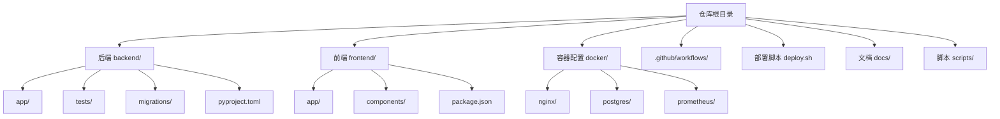
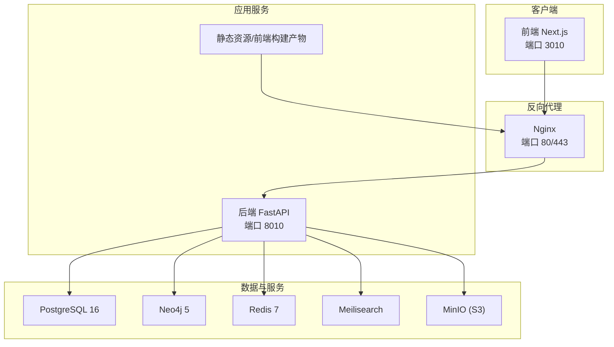
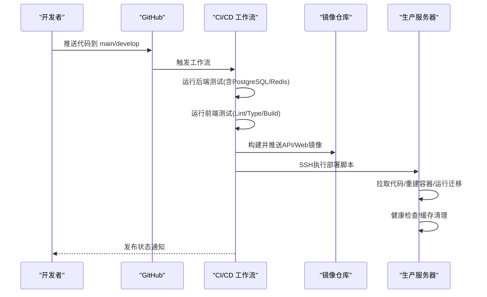
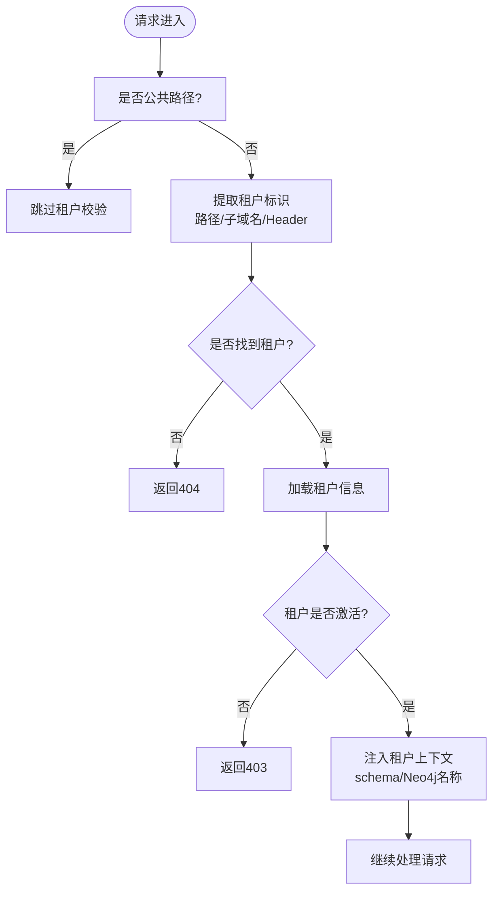
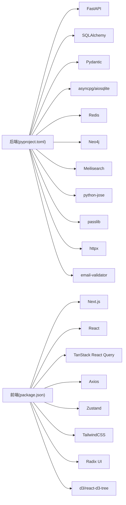

# 团队协作与项目管理

<cite>
**本文引用的文件**
- [README.md](file://README.md)
- [.github/workflows/ci-cd.yml](file://.github/workflows/ci-cd.yml)
- [backend/pyproject.toml](file://backend/pyproject.toml)
- [frontend/package.json](file://frontend/package.json)
- [docker-compose.yml](file://docker-compose.yml)
- [docker-compose.prod.yml](file://docker-compose.prod.yml)
- [deploy.sh](file://deploy.sh)
- [backend/app/main.py](file://backend/app/main.py)
- [backend/app/core/config.py](file://backend/app/core/config.py)
- [backend/app/middleware/tenant.py](file://backend/app/middleware/tenant.py)
- [backend/tests/conftest.py](file://backend/tests/conftest.py)
- [docs/LOCAL_DEVELOPMENT.md](file://docs/LOCAL_DEVELOPMENT.md)
- [scripts/create_tenant.py](file://scripts/create_tenant.py)
- [scripts/init_system.py](file://scripts/init_system.py)
</cite>

## 目录
1. [引言](#引言)
2. [项目结构](#项目结构)
3. [核心组件](#核心组件)
4. [架构总览](#架构总览)
5. [详细组件分析](#详细组件分析)
6. [依赖分析](#依赖分析)
7. [性能考虑](#性能考虑)
8. [故障排查指南](#故障排查指南)
9. [结论](#结论)
10. [附录](#附录)

## 引言
本指南面向多租户族谱管理系统团队，聚焦于团队协作与项目管理的最佳实践，覆盖代码版本控制策略、CI/CD 流程、测试与部署、文档维护、风险管理以及远程协作工具使用建议。目标是帮助团队建立高效、可追溯、可扩展的协作体系，确保项目高质量交付与可持续演进。

## 项目结构
项目采用前后端分离与容器化部署的组织方式，后端基于 FastAPI，前端基于 Next.js，数据库与图数据库、缓存、搜索引擎、对象存储等通过 Docker Compose 提供。仓库根目录包含 CI/CD 工作流、部署脚本、文档与脚本工具，便于统一管理与自动化执行。

图表来源
- [README.md:1-133](file://README.md#L1-L133)
- [docker-compose.yml:1-145](file://docker-compose.yml#L1-L145)
- [docker-compose.prod.yml:1-217](file://docker-compose.prod.yml#L1-L217)

章节来源
- [README.md:5-27](file://README.md#L5-L27)
- [docker-compose.yml:1-145](file://docker-compose.yml#L1-L145)
- [docker-compose.prod.yml:1-217](file://docker-compose.prod.yml#L1-L217)

## 核心组件
- 应用入口与生命周期：后端应用通过 lifespan 钩子完成数据库初始化、可选服务连接与关闭，提供健康检查端点。
- 配置管理：集中式设置类负责读取环境变量，支持开发/预发布/生产环境切换。
- 多租户中间件：支持子域名、路径前缀与请求头三种租户标识方式，统一注入租户上下文。
- 测试基础：pytest 异步测试夹具，内存数据库与依赖注入覆盖，便于快速验证。
- 部署与运行：本地开发与生产环境双套 compose 配置，配合一键部署脚本与 GitHub Actions 自动化流水线。

章节来源
- [backend/app/main.py:17-43](file://backend/app/main.py#L17-L43)
- [backend/app/core/config.py:11-89](file://backend/app/core/config.py#L11-L89)
- [backend/app/middleware/tenant.py:15-142](file://backend/app/middleware/tenant.py#L15-L142)
- [backend/tests/conftest.py:35-105](file://backend/tests/conftest.py#L35-L105)

## 架构总览
系统采用“容器化 + 微服务风格”的单体后端 + 前端 SPA 架构，后端提供 API，前端通过 Next.js 提供页面与交互；数据库层以 PostgreSQL 为主，辅以 Neo4j、Redis、Meilisearch、MinIO 等外部服务，通过 Docker Compose 统一编排。

图表来源
- [docker-compose.yml:89-132](file://docker-compose.yml#L89-L132)
- [docker-compose.prod.yml:98-172](file://docker-compose.prod.yml#L98-L172)
- [backend/app/main.py:72-86](file://backend/app/main.py#L72-L86)

## 详细组件分析

### 版本控制与分支管理策略
- 分支模型
  - 主分支：main 用于发布稳定版本，保护分支策略要求 PR 合并前必须通过 CI。
  - 开发分支：develop 用于集成特性开发，定期与 main 对齐。
  - 功能分支：feature/* 从 develop 派生，完成后合并回 develop。
  - 修复分支：hotfix/* 从 main 派生，修复后同时合并回 main 与 develop。
- 提交规范
  - 类型限定：feat、fix、docs、style、refactor、test、chore、perf、ci、revert。
  - 标题格式：类型(作用域): 描述，首字母小写，不超过 50 字。
  - 说明格式：正文解释动机与对比，必要时给出链接或截图。
  - 关联规则：在正文或提交信息中引用 Issue/PR 编号。
- 合并策略
  - PR 必须通过 CI（后端测试、前端测试、覆盖率报告）与代码审查。
  - 禁止直接推送 main/develop，强制走 MR/PR 流程。
- 冲突解决
  - 优先 rebase 保持线性历史；若存在复杂冲突，采用 merge commit 并在 PR 描述中说明。
  - 冲突解决后再次触发 CI，确保通过所有检查。

章节来源
- [.github/workflows/ci-cd.yml:3-7](file://.github/workflows/ci-cd.yml#L3-L7)
- [backend/pyproject.toml:58-61](file://backend/pyproject.toml#L58-L61)

### 持续集成与持续部署（CI/CD）
- 触发条件
  - 推送至 main/develop 触发后端与前端测试；针对 main 的推送进一步触发镜像构建与部署。
- 后端测试
  - 使用临时 PostgreSQL 与 Redis 容器，运行 pytest 并生成覆盖率报告上传至 codecov。
- 前端测试
  - 安装依赖、代码风格检查、类型检查与构建。
- 镜像构建与推送
  - 在 main 推送后，分别构建后端与前端镜像并推送到镜像仓库。
- 生产部署
  - 通过 SSH 登录服务器，执行部署脚本，拉取代码、重建容器、运行迁移、健康检查与缓存清理。

图表来源
- [.github/workflows/ci-cd.yml:13-160](file://.github/workflows/ci-cd.yml#L13-L160)
- [deploy.sh:22-52](file://deploy.sh#L22-L52)

章节来源
- [.github/workflows/ci-cd.yml:13-160](file://.github/workflows/ci-cd.yml#L13-L160)
- [deploy.sh:1-64](file://deploy.sh#L1-L64)

### 测试与质量保障
- 后端测试
  - 使用内存 SQLite 作为测试数据库，pytest 异步夹具注入依赖，覆盖认证、租户、族谱树、人员与租户相关接口。
  - 配置项启用覆盖率统计，CI 中上传覆盖率报告。
- 前端测试
  - 通过 npm 脚本执行 Lint、类型检查与构建，保证代码风格与类型安全。
- 代码质量工具
  - 后端：Ruff（lint）、Mypy（类型检查）。
  - 前端：ESLint、TypeScript 类型检查。

章节来源
- [backend/tests/conftest.py:35-105](file://backend/tests/conftest.py#L35-L105)
- [backend/pyproject.toml:45-61](file://backend/pyproject.toml#L45-L61)
- [frontend/package.json:5-11](file://frontend/package.json#L5-L11)

### 部署与回滚机制
- 一键部署脚本
  - 校验环境变量文件、拉取代码、构建并启动容器、健康检查、执行数据库迁移、清理缓存。
- 生产环境 compose
  - 包含数据库、图数据库、缓存、搜索引擎、对象存储、反向代理与监控组件，支持健康检查与重启策略。
- 回滚建议
  - 通过镜像标签固定版本，必要时回退到上一个稳定镜像标签；若数据库已迁移，结合迁移历史进行回滚或逆向迁移。

章节来源
- [deploy.sh:13-52](file://deploy.sh#L13-L52)
- [docker-compose.prod.yml:1-217](file://docker-compose.prod.yml#L1-L217)

### 多租户中间件与租户管理
- 租户识别顺序
  - 路径前缀 /t/{slug}/、子域名 {slug}.domain、请求头 X-Tenant-ID。
- 上下文注入
  - 未找到租户时返回 404；租户非激活状态返回 403；成功则注入 schema 与 Neo4j 数据库名。
- 初始化与租户创建
  - 提供系统初始化脚本与租户 CLI，支持创建系统表、超级用户、租户、租户模式下的表结构与关联关系。

图表来源
- [backend/app/middleware/tenant.py:39-84](file://backend/app/middleware/tenant.py#L39-L84)

章节来源
- [backend/app/middleware/tenant.py:15-142](file://backend/app/middleware/tenant.py#L15-L142)
- [scripts/init_system.py:18-77](file://scripts/init_system.py#L18-L77)
- [scripts/create_tenant.py:231-282](file://scripts/create_tenant.py#L231-L282)

### 配置与环境管理
- 配置来源
  - 通过 pydantic-settings 从 .env 文件加载，支持开发/预发布/生产环境切换与多种服务地址。
- 环境变量
  - 数据库、缓存、搜索引擎、对象存储、JWT、CORS 等关键参数集中管理。
- 健康检查
  - 应用提供 /health 端点，返回服务可用性状态。

章节来源
- [backend/app/core/config.py:11-89](file://backend/app/core/config.py#L11-L89)
- [backend/app/main.py:72-86](file://backend/app/main.py#L72-L86)

### 本地开发与环境一致性
- 无 Docker 最简方案
  - 仅需 Python 与 Node.js，SQLite 默认启用，Neo4j、Redis、Meilisearch 可选。
- Docker Compose
  - 提供开发与生产两套 compose，包含健康检查与持久化卷。
- 启动命令
  - 一键脚本与手动命令两种方式，便于不同平台与场景。

章节来源
- [docs/LOCAL_DEVELOPMENT.md:1-299](file://docs/LOCAL_DEVELOPMENT.md#L1-L299)
- [docker-compose.yml:1-145](file://docker-compose.yml#L1-L145)

## 依赖分析
- 后端依赖
  - FastAPI、SQLAlchemy、Pydantic、异步数据库驱动、Redis、Neo4j、Meilisearch、Python-Jose、Passlib、HTTPX、Redis、Meilisearch、dotenv、email-validator。
- 前端依赖
  - Next.js、React、TanStack React Query、Axios、Zustand、TailwindCSS、Radix UI、d3 与 react-d3-tree。
- 构建与工具
  - hatchling 构建后端包，Ruff/Lint、Mypy、pytest、ESLint、TypeScript。

图表来源
- [backend/pyproject.toml:7-25](file://backend/pyproject.toml#L7-L25)
- [frontend/package.json:12-31](file://frontend/package.json#L12-L31)

章节来源
- [backend/pyproject.toml:1-61](file://backend/pyproject.toml#L1-L61)
- [frontend/package.json:1-45](file://frontend/package.json#L1-L45)

## 性能考虑
- 数据库
  - SQLite 适合本地与小规模场景；生产建议 PostgreSQL，注意连接池大小与索引设计。
- 图数据库与缓存
  - Neo4j 与 Redis 为可选增强，按需启用并合理配置内存与策略。
- 搜索与存储
  - Meilisearch 用于全文检索，MinIO 提供对象存储，注意网络与带宽规划。
- 前端性能
  - 使用 Next.js 预渲染与缓存策略，减少首屏时间与带宽消耗。

## 故障排查指南
- 健康检查失败
  - 查看 API /health 返回的服务状态；确认各外部服务是否就绪。
- 数据库迁移
  - 生产环境执行迁移命令；若失败，检查数据库连接与权限。
- 缓存异常
  - 清理缓存后重试；确认 Redis 服务可用。
- 日志查看
  - 使用 compose 日志命令定位错误堆栈与告警。

章节来源
- [backend/app/main.py:72-86](file://backend/app/main.py#L72-L86)
- [deploy.sh:38-43](file://deploy.sh#L38-L43)

## 结论
本指南基于现有仓库配置与实现，提出了面向多租户族谱管理系统的团队协作与项目管理最佳实践。通过明确的分支与提交规范、完善的 CI/CD 流程、严格的测试与质量工具、清晰的部署与回滚策略，以及对多租户中间件与环境管理的关注，团队可在保证交付质量的同时提升协作效率与可维护性。

## 附录

### 团队沟通协作规范（建议）
- 需求评审
  - 每次迭代前进行需求评审，输出可追踪的需求文档与验收标准。
- 技术讨论
  - 重大技术决策形成文档与决策记录，避免口头约定。
- 进度跟踪
  - 使用看板工具（如 Jira/Tapd）跟踪任务状态，每日站会同步进展。
- 知识分享
  - 建立内部知识库，沉淀架构设计、最佳实践与常见问题解答。

### 文档维护标准（建议）
- 更新流程
  - 文档变更纳入 PR 审查流程，确保内容与实现一致。
- 版本管理
  - 重要文档采用语义化版本，变更日志记录关键修改。
- 质量检查
  - 交叉审阅与自动化检查（如拼写、链接有效性），确保可读性与准确性。
- 知识库建设
  - 分类整理文档，提供索引与搜索能力，便于检索与复用。

### 项目风险管理（建议）
- 风险识别
  - 列举技术债务、依赖升级、性能瓶颈、安全漏洞等风险清单。
- 应急预案
  - 明确故障分级与响应流程，准备回滚与热修复方案。
- 问题跟踪
  - 使用问题跟踪系统记录与闭环，定期复盘改进。
- 经验总结
  - 迭代结束后进行回顾，沉淀教训与优化建议。

### 远程协作工具使用指南（建议）
- 代码审查
  - 使用 GitHub/GitLab 的 MR/PR 流程，强制至少一次审查与 CI 通过。
- 在线会议
  - 采用结构化会议议程，记录会议纪要与行动项。
- 文档共享
  - 使用企业级文档平台，统一权限与版本控制。
- 任务管理
  - 采用看板与甘特图结合的方式，可视化任务依赖与里程碑。