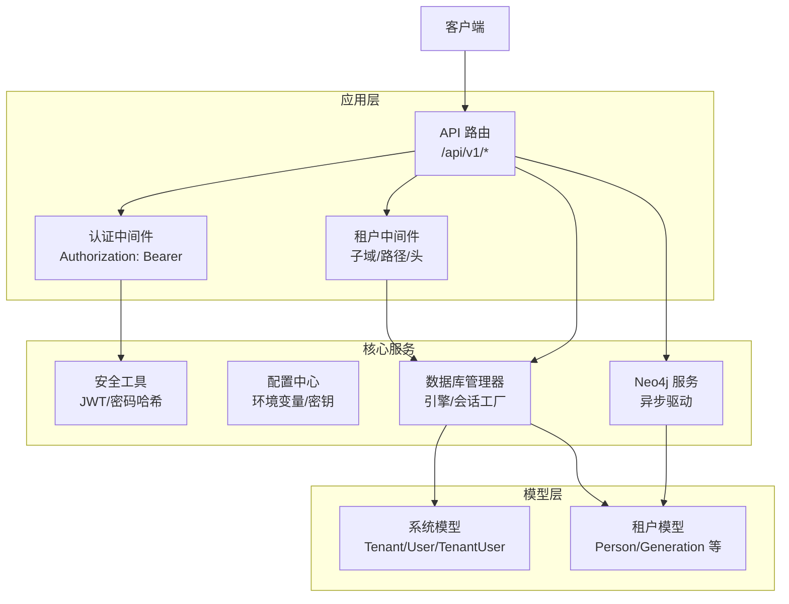
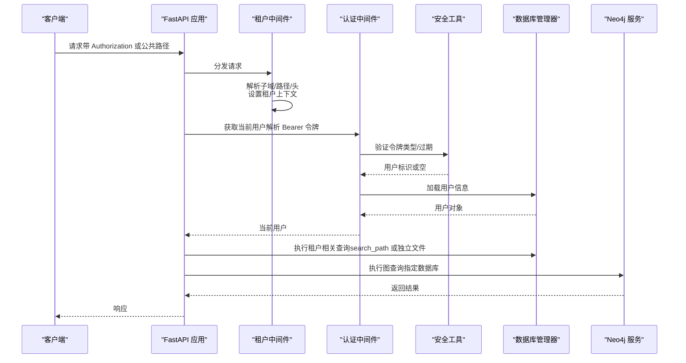
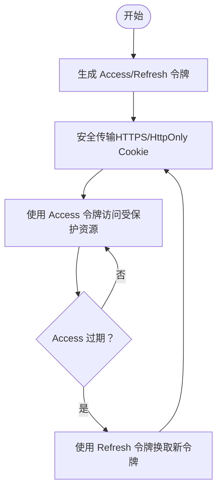
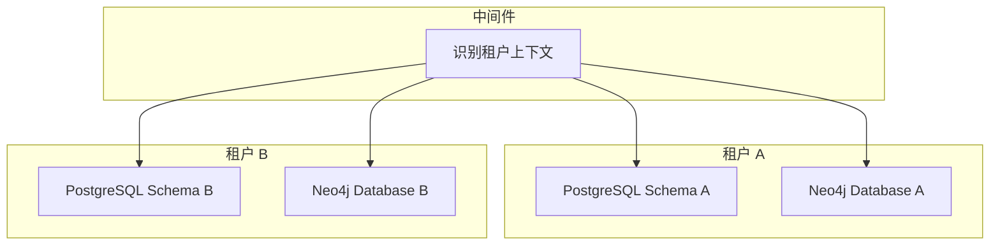
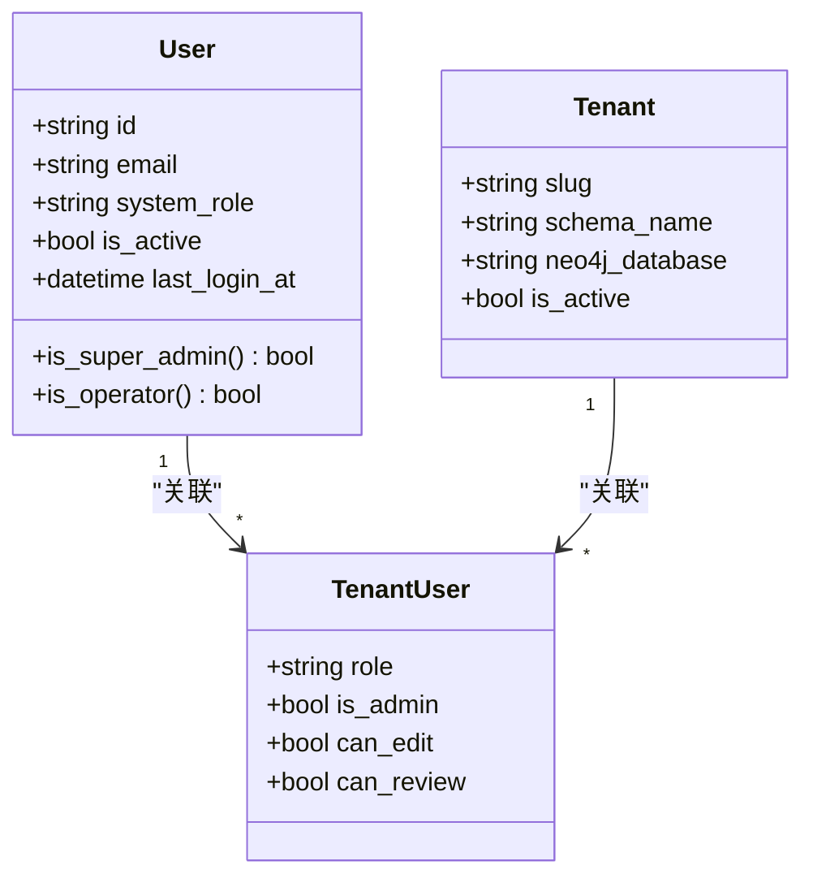
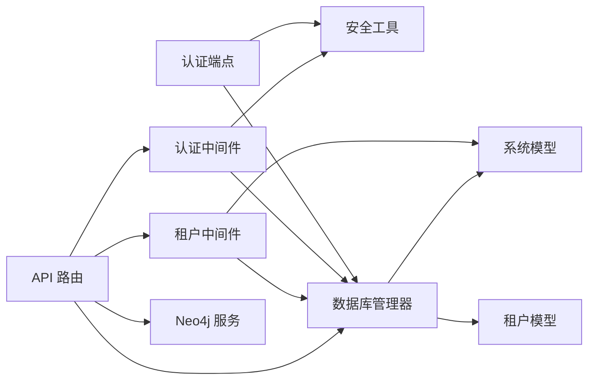

# 安全最佳实践

<cite>
**本文档引用的文件**
- [backend/app/core/security.py](file://backend/app/core/security.py)
- [backend/app/middleware/auth.py](file://backend/app/middleware/auth.py)
- [backend/app/middleware/tenant.py](file://backend/app/middleware/tenant.py)
- [backend/app/api/v1/endpoints/auth.py](file://backend/app/api/v1/endpoints/auth.py)
- [backend/app/models/system.py](file://backend/app/models/system.py)
- [backend/app/models/tenant.py](file://backend/app/models/tenant.py)
- [backend/app/core/config.py](file://backend/app/core/config.py)
- [backend/app/core/database.py](file://backend/app/core/database.py)
- [backend/app/services/neo4j_service.py](file://backend/app/services/neo4j_service.py)
- [backend/app/api/v1/endpoints/tenants.py](file://backend/app/api/v1/endpoints/tenants.py)
- [backend/app/main.py](file://backend/app/main.py)
- [backend/tests/test_auth.py](file://backend/tests/test_auth.py)
- [backend/pyproject.toml](file://backend/pyproject.toml)
- [backend/Dockerfile](file://backend/Dockerfile)
- [docker-compose.yml](file://docker-compose.yml)
</cite>

## 目录
1. [引言](#引言)
2. [项目结构](#项目结构)
3. [核心组件](#核心组件)
4. [架构总览](#架构总览)
5. [详细组件分析](#详细组件分析)
6. [依赖分析](#依赖分析)
7. [性能考虑](#性能考虑)
8. [故障排除指南](#故障排除指南)
9. [结论](#结论)
10. [附录](#附录)

## 引言
本指南面向多租户族谱管理系统，聚焦于安全设计与实现，覆盖以下关键领域：
- JWT 令牌管理：生成、刷新、过期与安全传输
- 多租户数据隔离：PostgreSQL Schema 隔离、Neo4j 图数据隔离与跨租户防护
- 认证与授权：密码哈希、会话管理、权限矩阵与中间件实现
- 输入验证与输出编码：SQL 注入、XSS、CSRF 防护
- 敏感数据保护：PII 脱敏、传输加密与存储加密
- 安全审计与监控：日志记录、异常检测与安全事件响应

## 项目结构
后端采用 FastAPI + SQLAlchemy 异步 ORM 架构，结合多租户中间件与数据库管理器实现租户上下文隔离；Neo4j 用于图数据查询与可视化。

图表来源
- [backend/app/main.py:45-91](file://backend/app/main.py#L45-L91)
- [backend/app/middleware/auth.py:15-88](file://backend/app/middleware/auth.py#L15-L88)
- [backend/app/middleware/tenant.py:15-142](file://backend/app/middleware/tenant.py#L15-L142)
- [backend/app/core/security.py:26-103](file://backend/app/core/security.py#L26-L103)
- [backend/app/core/database.py:24-171](file://backend/app/core/database.py#L24-L171)
- [backend/app/services/neo4j_service.py:12-373](file://backend/app/services/neo4j_service.py#L12-L373)
- [backend/app/models/system.py:23-223](file://backend/app/models/system.py#L23-L223)
- [backend/app/models/tenant.py:23-244](file://backend/app/models/tenant.py#L23-L244)

章节来源
- [backend/app/main.py:45-91](file://backend/app/main.py#L45-L91)
- [backend/docker-compose.yml:1-145](file://docker-compose.yml#L1-L145)

## 核心组件
- 安全工具（JWT/密码哈希）
  - 密码哈希与校验：使用 bcrypt 上下文
  - JWT 令牌生成与解码：支持 access/refresh 两类令牌，含过期时间与类型字段
- 认证中间件
  - 从 Authorization 头解析 Bearer 令牌，调用安全工具进行验证，加载用户信息
  - 提供可选/必需认证与超级用户检查依赖
- 租户中间件
  - 支持子域、路径前缀与自定义头识别租户
  - 将租户上下文写入请求状态，设置 schema 名与 Neo4j 数据库名
- 数据库管理器
  - 默认引擎用于系统表（public），按需为每个租户创建独立引擎/会话
  - SQLite 模式下以独立文件实现租户隔离；PostgreSQL 使用 search_path 切换 schema
- Neo4j 服务
  - 异步驱动封装，按租户数据库参数执行图查询
  - 查询中通过标签与属性限定作用域，避免跨租户误读

章节来源
- [backend/app/core/security.py:12-103](file://backend/app/core/security.py#L12-L103)
- [backend/app/middleware/auth.py:15-88](file://backend/app/middleware/auth.py#L15-L88)
- [backend/app/middleware/tenant.py:15-142](file://backend/app/middleware/tenant.py#L15-L142)
- [backend/app/core/database.py:24-171](file://backend/app/core/database.py#L24-L171)
- [backend/app/services/neo4j_service.py:12-373](file://backend/app/services/neo4j_service.py#L12-L373)

## 架构总览
下图展示认证、租户识别与数据访问的关键交互流程。

图表来源
- [backend/app/middleware/tenant.py:39-84](file://backend/app/middleware/tenant.py#L39-L84)
- [backend/app/middleware/auth.py:15-57](file://backend/app/middleware/auth.py#L15-L57)
- [backend/app/core/security.py:80-103](file://backend/app/core/security.py#L80-L103)
- [backend/app/core/database.py:136-171](file://backend/app/core/database.py#L136-L171)
- [backend/app/services/neo4j_service.py:56-60](file://backend/app/services/neo4j_service.py#L56-L60)

## 详细组件分析

### JWT 令牌管理策略
- 令牌类型与生命周期
  - Access 令牌：默认 24 小时过期，携带类型与过期时间
  - Refresh 令牌：默认 30 天过期，仅在登录与刷新接口使用
- 生成与验证
  - 生成：合并主题、过期时间与类型字段，使用对称算法签名
  - 验证：解码并校验类型一致性，失败返回空标识
- 安全传输建议
  - 仅通过 HTTPS 传输，禁止明文网络
  - Access 令牌置于 HttpOnly Cookie（建议）或安全通道传递
  - Refresh 令牌同样置于 HttpOnly Cookie 并限制 SameSite/Lax
- 刷新机制
  - 登录成功后同时发放 access/refresh
  - 刷新接口仅接受有效 refresh 令牌，重新签发新令牌对

图表来源
- [backend/app/core/security.py:26-77](file://backend/app/core/security.py#L26-L77)
- [backend/app/api/v1/endpoints/auth.py:89-158](file://backend/app/api/v1/endpoints/auth.py#L89-L158)

章节来源
- [backend/app/core/security.py:26-103](file://backend/app/core/security.py#L26-L103)
- [backend/app/api/v1/endpoints/auth.py:89-158](file://backend/app/api/v1/endpoints/auth.py#L89-L158)

### 多租户数据隔离
- PostgreSQL 隔离
  - 系统表位于 public 模式（租户、用户等）
  - 租户业务表位于各自 schema，运行时通过 search_path 切换
  - SQLite 模式下以独立数据库文件实现隔离
- Neo4j 隔离
  - 每个租户拥有独立数据库名称，查询时显式指定
  - 查询语句通过标签与属性限定作用域，避免跨库访问
- 跨租户防护
  - 中间件在请求进入路由前解析租户上下文，未识别则拒绝或降级
  - 所有数据访问必须基于当前租户上下文，禁止硬编码或全局共享

图表来源
- [backend/app/middleware/tenant.py:15-84](file://backend/app/middleware/tenant.py#L15-L84)
- [backend/app/core/database.py:58-106](file://backend/app/core/database.py#L58-L106)
- [backend/app/services/neo4j_service.py:35-39](file://backend/app/services/neo4j_service.py#L35-L39)

章节来源
- [backend/app/middleware/tenant.py:15-142](file://backend/app/middleware/tenant.py#L15-L142)
- [backend/app/core/database.py:24-171](file://backend/app/core/database.py#L24-L171)
- [backend/app/services/neo4j_service.py:12-373](file://backend/app/services/neo4j_service.py#L12-L373)

### 认证与授权方案
- 密码哈希
  - 使用 bcrypt 上下文生成不可逆哈希，注册与登录时进行比对
- 会话管理
  - 基于 JWT 的无状态会话，不依赖服务器端存储
  - 通过中间件解析 Authorization 头，验证令牌有效性并加载用户
- 权限矩阵
  - 系统角色：user/super_admin/operator
  - 租户角色：member/tenant_admin/editor/reviewer
  - 权限检查占位：中间件提供权限检查类，当前简化为已认证即通过，建议后续完善
- 中间件实现
  - 可选认证：允许匿名访问
  - 必需认证：401 未认证
  - 超级用户：403 权限不足

图表来源
- [backend/app/models/system.py:73-121](file://backend/app/models/system.py#L73-L121)
- [backend/app/models/system.py:123-181](file://backend/app/models/system.py#L123-L181)
- [backend/app/models/system.py:23-71](file://backend/app/models/system.py#L23-L71)

章节来源
- [backend/app/middleware/auth.py:15-88](file://backend/app/middleware/auth.py#L15-L88)
- [backend/app/models/system.py:73-181](file://backend/app/models/system.py#L73-L181)

### 输入验证与输出编码
- 输入验证
  - Pydantic 模型用于注册/登录/租户创建等请求体校验（长度、格式、正则）
  - 邮箱使用专用验证器
- 输出编码
  - 建议在前端渲染与模板输出时进行 HTML/CSS/JS 编码，防止 XSS
  - 对外部链接与富文本内容进行白名单过滤
- CSRF 防护
  - 建议在 SPA 中启用 SameSite Cookie、CSRF Token 与 Origin/Referer 校验
  - 本仓库未见显式 CSRF 实现，建议补充

章节来源
- [backend/app/api/v1/endpoints/auth.py:25-52](file://backend/app/api/v1/endpoints/auth.py#L25-L52)
- [backend/app/api/v1/endpoints/tenants.py:18-36](file://backend/app/api/v1/endpoints/tenants.py#L18-L36)

### 敏感数据保护
- PII 脱敏
  - 建议对出生日期、地址等字段在查询与返回时进行最小化披露
  - 可引入字段级访问控制与审计日志
- 传输加密
  - 生产环境必须启用 HTTPS，禁用明文 HTTP
  - JWT 密钥与第三方凭据通过环境变量注入
- 存储加密
  - 数据库连接使用 SSL（生产环境）
  - 文件存储建议启用服务端加密与访问控制

章节来源
- [backend/app/core/config.py:54-57](file://backend/app/core/config.py#L54-L57)
- [backend/docker-compose.yml:95-102](file://docker-compose.yml#L95-L102)

### 安全审计与监控
- 日志记录
  - 记录登录尝试、令牌刷新、敏感操作（新增租户、修改角色）
  - 区分访问日志与审计日志，保留至少 90 天
- 异常检测
  - 对频繁失败的登录、异常 IP、异常路径访问进行告警
- 安全事件响应
  - 冻结账户、撤销令牌、回滚变更与恢复备份
  - 事件分级与上报流程

## 依赖分析
- 组件耦合
  - 认证中间件依赖安全工具与数据库；租户中间件依赖数据库管理器与系统模型
  - API 层通过依赖注入复用中间件与安全工具
- 外部依赖
  - 数据库：PostgreSQL/SQLite（异步）、Redis（可选）
  - 图数据库：Neo4j（异步驱动）
  - 工具库：Pydantic、Passlib、python-jose、httpx、Meilisearch

图表来源
- [backend/app/api/v1/endpoints/auth.py:13-20](file://backend/app/api/v1/endpoints/auth.py#L13-L20)
- [backend/app/middleware/auth.py:10-12](file://backend/app/middleware/auth.py#L10-L12)
- [backend/app/middleware/tenant.py:11-12](file://backend/app/middleware/tenant.py#L11-L12)
- [backend/app/models/system.py:23-71](file://backend/app/models/system.py#L23-L71)
- [backend/app/models/tenant.py:23-40](file://backend/app/models/tenant.py#L23-L40)
- [backend/app/services/neo4j_service.py:9-10](file://backend/app/services/neo4j_service.py#L9-L10)

章节来源
- [backend/pyproject.toml:7-25](file://backend/pyproject.toml#L7-L25)

## 性能考虑
- 令牌缓存
  - 可在 Redis 中缓存短期令牌元信息，降低重复验证开销
- 数据库连接池
  - 合理设置池大小与溢出，避免高并发下的连接争用
- Neo4j 查询优化
  - 为常用属性建立索引，限制深度与返回数量
- CDN 与静态资源
  - 使用 CDN 缓存前端静态资源，减少主站压力

## 故障排除指南
- 401 未认证
  - 检查 Authorization 头格式是否为 Bearer
  - 核对令牌类型与过期时间
- 403 权限不足
  - 确认用户系统角色与租户角色
  - 检查权限检查依赖是否正确使用
- 404 租户不存在
  - 确认子域/路径/头是否正确传递
  - 检查租户激活状态
- Neo4j 连接失败
  - 校验 URI、用户名与密码
  - 确认数据库名称与查询中的限定符一致

章节来源
- [backend/app/middleware/auth.py:47-69](file://backend/app/middleware/auth.py#L47-L69)
- [backend/app/middleware/tenant.py:48-83](file://backend/app/middleware/tenant.py#L48-L83)
- [backend/app/services/neo4j_service.py:41-49](file://backend/app/services/neo4j_service.py#L41-L49)

## 结论
本系统在多租户隔离、JWT 管理与中间件设计方面具备良好基础。建议下一步完善：
- 权限矩阵与细粒度 RBAC
- CSRF 防护与安全头加固
- 审计日志与异常检测体系
- 传输与存储加密的强制策略
- 测试覆盖与渗透测试

## 附录
- 开发与部署
  - 使用 Docker Compose 启动 PostgreSQL、Neo4j、Redis、Meilisearch 与 API
  - 生产环境建议启用 HTTPS、只读数据库连接、最小权限原则

章节来源
- [backend/Dockerfile:1-24](file://backend/Dockerfile#L1-L24)
- [docker-compose.yml:1-145](file://docker-compose.yml#L1-L145)