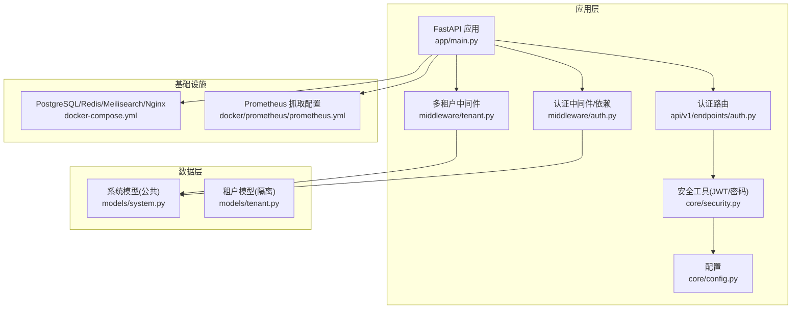
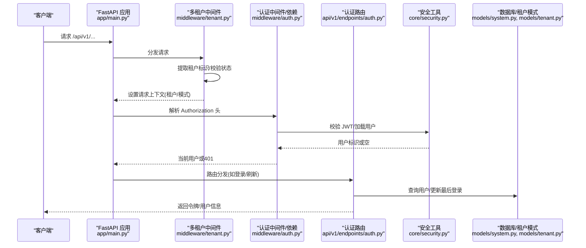
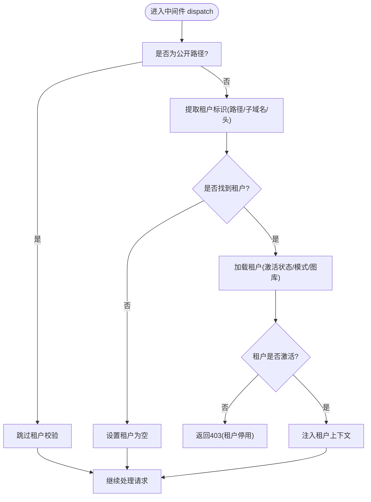
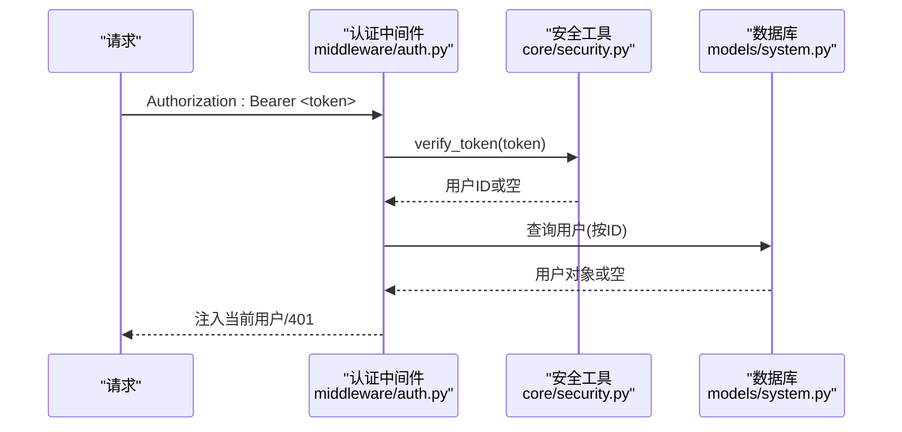
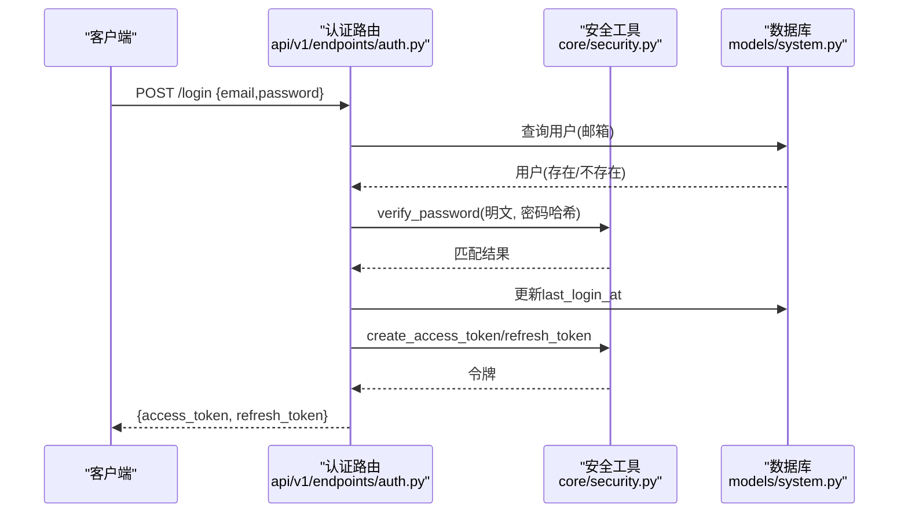
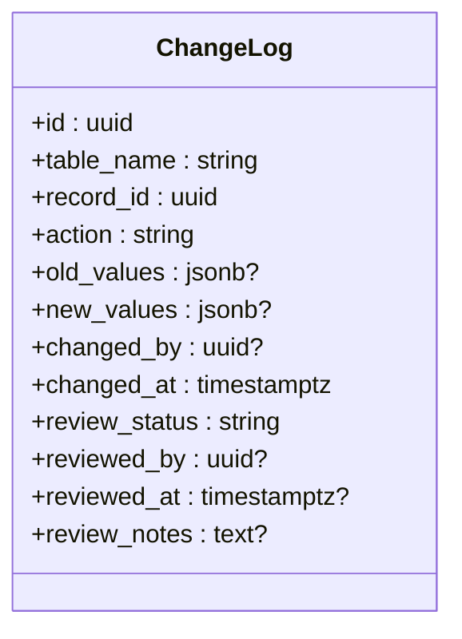
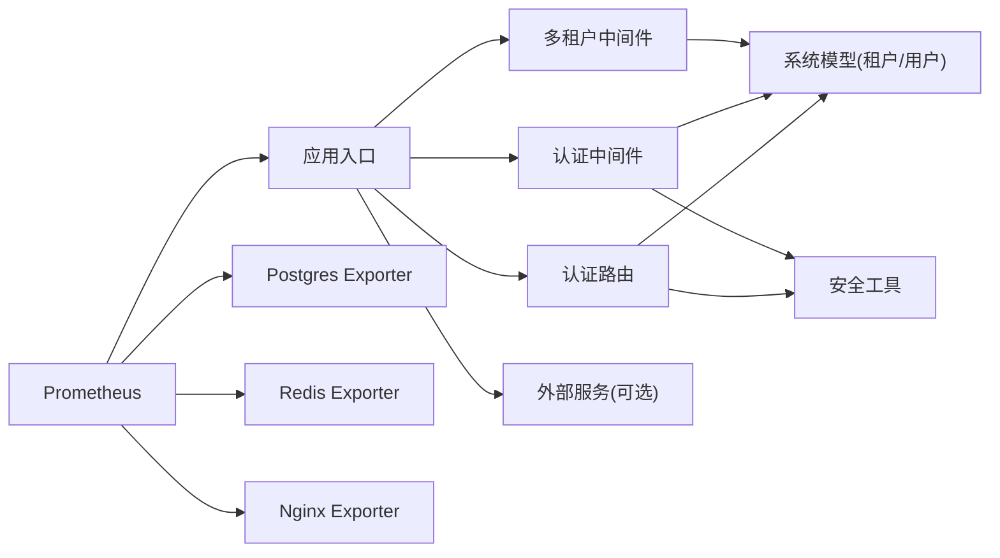

# 安全监控与审计

<cite>
**本文引用的文件**
- [backend/app/main.py](file://backend/app/main.py)
- [backend/app/middleware/tenant.py](file://backend/app/middleware/tenant.py)
- [backend/app/middleware/auth.py](file://backend/app/middleware/auth.py)
- [backend/app/api/v1/endpoints/auth.py](file://backend/app/api/v1/endpoints/auth.py)
- [backend/app/core/security.py](file://backend/app/core/security.py)
- [backend/app/core/config.py](file://backend/app/core/config.py)
- [backend/app/models/system.py](file://backend/app/models/system.py)
- [backend/app/models/tenant.py](file://backend/app/models/tenant.py)
- [docker-compose.yml](file://docker-compose.yml)
- [docker/prometheus/prometheus.yml](file://docker/prometheus/prometheus.yml)
</cite>

## 目录
1. [引言](#引言)
2. [项目结构](#项目结构)
3. [核心组件](#核心组件)
4. [架构总览](#架构总览)
5. [详细组件分析](#详细组件分析)
6. [依赖分析](#依赖分析)
7. [性能考虑](#性能考虑)
8. [故障排查指南](#故障排查指南)
9. [结论](#结论)
10. [附录](#附录)

## 引言
本文件面向多租户基因谱系管理平台，系统化阐述安全监控与审计实施方案，覆盖日志记录策略（访问日志、错误日志、安全事件日志）、异常检测机制（登录失败检测、异常行为分析、风险评估）、安全事件响应流程（事件分类、响应级别与处置程序）、性能监控与安全监控融合（DDoS 检测、资源滥用监控、API 调用异常检测），以及合规性审计要求（满足 GDPR、网络安全法等）。文档基于仓库现有代码与配置进行分析，并提出可落地的实施建议。

## 项目结构
后端采用 FastAPI 应用入口，通过中间件实现多租户上下文注入与鉴权依赖；认证模块提供注册、登录、令牌刷新与当前用户信息查询；安全工具负责密码哈希与 JWT 签发/校验；系统模型定义了租户、用户与订阅等公共表结构；租户模型定义了变更审计所需的变更日志表。容器编排文件定义了数据库、图数据库、缓存与搜索引擎等服务；Prometheus 配置定义了指标抓取目标。

**图表来源**
- [backend/app/main.py:45-91](file://backend/app/main.py#L45-L91)
- [backend/app/middleware/tenant.py:15-84](file://backend/app/middleware/tenant.py#L15-L84)
- [backend/app/middleware/auth.py:15-87](file://backend/app/middleware/auth.py#L15-L87)
- [backend/app/api/v1/endpoints/auth.py:55-179](file://backend/app/api/v1/endpoints/auth.py#L55-L179)
- [backend/app/core/security.py:16-103](file://backend/app/core/security.py#L16-L103)
- [backend/app/core/config.py:11-89](file://backend/app/core/config.py#L11-L89)
- [backend/app/models/system.py:23-223](file://backend/app/models/system.py#L23-L223)
- [backend/app/models/tenant.py:214-244](file://backend/app/models/tenant.py#L214-L244)
- [docker-compose.yml:1-145](file://docker-compose.yml#L1-L145)
- [docker/prometheus/prometheus.yml:12-32](file://docker/prometheus/prometheus.yml#L12-L32)

**章节来源**
- [backend/app/main.py:45-91](file://backend/app/main.py#L45-L91)
- [docker-compose.yml:1-145](file://docker-compose.yml#L1-L145)
- [docker/prometheus/prometheus.yml:12-32](file://docker/prometheus/prometheus.yml#L12-L32)

## 核心组件
- 多租户中间件：从请求中提取租户标识（子域名、路径前缀、自定义头），加载租户状态并设置请求上下文，对非公开路径进行租户上下文约束。
- 认证中间件与依赖：从 Authorization 头解析 Bearer 令牌，验证 JWT 并加载用户对象，提供“必需认证”“超级用户”等依赖。
- 认证路由：提供注册、登录、刷新令牌与当前用户信息接口，登录成功更新最近登录时间。
- 安全工具：提供密码哈希、JWT 签发（访问/刷新）与解码校验。
- 系统模型：定义租户、用户、租户-用户关系与订阅等公共表，支撑权限与计费控制。
- 租户模型：定义谱系数据表与变更审计表（变更日志），支持审计追踪与复核流程。
- 配置：集中管理数据库、缓存、搜索引擎、JWT 等参数。
- 健康检查与服务连接：应用启动时连接可选服务（Neo4j、Redis、Meilisearch），提供 /health 接口。

**章节来源**
- [backend/app/middleware/tenant.py:15-142](file://backend/app/middleware/tenant.py#L15-L142)
- [backend/app/middleware/auth.py:15-87](file://backend/app/middleware/auth.py#L15-L87)
- [backend/app/api/v1/endpoints/auth.py:55-179](file://backend/app/api/v1/endpoints/auth.py#L55-L179)
- [backend/app/core/security.py:16-103](file://backend/app/core/security.py#L16-L103)
- [backend/app/models/system.py:23-223](file://backend/app/models/system.py#L23-L223)
- [backend/app/models/tenant.py:214-244](file://backend/app/models/tenant.py#L214-L244)
- [backend/app/core/config.py:11-89](file://backend/app/core/config.py#L11-L89)
- [backend/app/main.py:17-42](file://backend/app/main.py#L17-L42)

## 架构总览
下图展示从客户端到应用、中间件、认证与数据层的整体交互，以及可选外部服务与监控指标采集。

**图表来源**
- [backend/app/main.py:66-70](file://backend/app/main.py#L66-L70)
- [backend/app/middleware/tenant.py:39-84](file://backend/app/middleware/tenant.py#L39-L84)
- [backend/app/middleware/auth.py:15-57](file://backend/app/middleware/auth.py#L15-L57)
- [backend/app/api/v1/endpoints/auth.py:89-123](file://backend/app/api/v1/endpoints/auth.py#L89-L123)
- [backend/app/core/security.py:80-103](file://backend/app/core/security.py#L80-L103)
- [backend/app/models/system.py:73-121](file://backend/app/models/system.py#L73-L121)

## 详细组件分析

### 组件A：多租户中间件与租户上下文
- 功能要点
  - 支持三种租户识别方式：URL 路径前缀、子域名、自定义头。
  - 对公开路径放行，不强制租户上下文。
  - 加载租户状态（激活/停用）并注入请求上下文（schema、Neo4j 数据库名）。
  - 未识别租户或租户不可用时返回结构化错误。
- 审计与安全意义
  - 通过统一的租户上下文，确保后续业务逻辑在正确的租户隔离环境中执行，避免越权访问。
  - 将租户状态纳入中间件校验，可在租户停用时阻断请求，降低风险暴露面。

**图表来源**
- [backend/app/middleware/tenant.py:39-84](file://backend/app/middleware/tenant.py#L39-L84)
- [backend/app/middleware/tenant.py:93-125](file://backend/app/middleware/tenant.py#L93-L125)

**章节来源**
- [backend/app/middleware/tenant.py:15-142](file://backend/app/middleware/tenant.py#L15-L142)

### 组件B：认证中间件与依赖
- 功能要点
  - 从 Authorization 头解析 Bearer 令牌，调用安全工具进行 JWT 校验。
  - 加载用户对象并提供“必需认证”“超级用户”等依赖，未通过时抛出 401/403。
  - 权限检查器为未来细粒度权限预留扩展点。
- 审计与安全意义
  - 统一的认证入口确保所有受保护路由均经过身份验证。
  - 通过依赖注入简化路由层的认证逻辑，降低绕过风险。

**图表来源**
- [backend/app/middleware/auth.py:15-57](file://backend/app/middleware/auth.py#L15-L57)
- [backend/app/core/security.py:80-103](file://backend/app/core/security.py#L80-L103)
- [backend/app/models/system.py:73-121](file://backend/app/models/system.py#L73-L121)

**章节来源**
- [backend/app/middleware/auth.py:15-87](file://backend/app/middleware/auth.py#L15-L87)
- [backend/app/core/security.py:16-103](file://backend/app/core/security.py#L16-L103)

### 组件C：认证路由与登录流程
- 功能要点
  - 注册：校验邮箱唯一性，生成密码哈希并创建用户。
  - 登录：校验凭据，更新最近登录时间，签发访问/刷新令牌。
  - 刷新：校验刷新令牌并签发新令牌。
  - 当前用户：返回用户信息。
- 审计与安全意义
  - 登录成功更新时间戳，便于后续异常登录检测与审计。
  - 令牌签发遵循最小权限原则，区分访问/刷新令牌类型。

**图表来源**
- [backend/app/api/v1/endpoints/auth.py:89-123](file://backend/app/api/v1/endpoints/auth.py#L89-L123)
- [backend/app/core/security.py:26-77](file://backend/app/core/security.py#L26-L77)
- [backend/app/models/system.py:73-121](file://backend/app/models/system.py#L73-L121)

**章节来源**
- [backend/app/api/v1/endpoints/auth.py:55-179](file://backend/app/api/v1/endpoints/auth.py#L55-L179)

### 组件D：变更审计与日志模型
- 功能要点
  - 变更日志表记录表名、记录ID、操作类型、旧值/新值、变更人、变更时间、复核状态等字段。
  - 支持审计追踪与复核流程，便于合规审计与问题回溯。
- 审计与安全意义
  - 为所有关键数据变更提供不可抵赖的审计轨迹。
  - 结合用户上下文与租户上下文，确保审计范围覆盖到具体租户内的具体记录。

**图表来源**
- [backend/app/models/tenant.py:214-244](file://backend/app/models/tenant.py#L214-L244)

**章节来源**
- [backend/app/models/tenant.py:214-244](file://backend/app/models/tenant.py#L214-L244)

### 组件E：系统模型与租户/用户/订阅
- 功能要点
  - 租户：名称、slug、族姓、数据库隔离(schema/Neo4j)、订阅计划与限额、状态与元数据。
  - 用户：邮箱/手机号、密码哈希、昵称/头像、系统角色、状态与登录时间戳、关联租户。
  - 租户-用户关系：角色、加入时间、邀请人、关联族谱人员。
  - 订阅：计划、金额/币种、起止时间、状态与支付单号。
- 审计与安全意义
  - 通过系统角色与租户角色实现最小权限与职责分离。
  - 订阅与限额为资源滥用监控提供边界条件。

**章节来源**
- [backend/app/models/system.py:23-223](file://backend/app/models/system.py#L23-L223)

## 依赖分析
- 中间件耦合
  - 多租户中间件依赖数据库加载租户状态，依赖配置中的公共数据库会话工厂。
  - 认证中间件依赖安全工具与数据库模型。
- 路由与模型
  - 认证路由依赖安全工具与系统模型；登录成功更新用户最近登录时间。
- 外部服务
  - 应用启动时连接可选服务（Neo4j、Redis、Meilisearch），健康检查接口汇总服务可用性。
- 监控
  - Prometheus 抓取 API、数据库、缓存与 Nginx Exporter 指标，为安全监控与性能监控融合提供基础。

**图表来源**
- [backend/app/middleware/tenant.py:11-125](file://backend/app/middleware/tenant.py#L11-L125)
- [backend/app/middleware/auth.py:10-44](file://backend/app/middleware/auth.py#L10-L44)
- [backend/app/api/v1/endpoints/auth.py:12-19](file://backend/app/api/v1/endpoints/auth.py#L12-L19)
- [backend/app/main.py:25-41](file://backend/app/main.py#L25-L41)
- [docker/prometheus/prometheus.yml:12-32](file://docker/prometheus/prometheus.yml#L12-L32)

**章节来源**
- [backend/app/middleware/tenant.py:11-125](file://backend/app/middleware/tenant.py#L11-L125)
- [backend/app/middleware/auth.py:10-44](file://backend/app/middleware/auth.py#L10-L44)
- [backend/app/api/v1/endpoints/auth.py:12-19](file://backend/app/api/v1/endpoints/auth.py#L12-L19)
- [backend/app/main.py:25-41](file://backend/app/main.py#L25-L41)
- [docker/prometheus/prometheus.yml:12-32](file://docker/prometheus/prometheus.yml#L12-L32)

## 性能考虑
- 指标采集与告警
  - Prometheus 已配置抓取 API、数据库、缓存与 Nginx 指标，建议在此基础上扩展安全相关指标（如登录失败率、API 错误率、慢查询比例、连接池使用率）。
- DDoS 与资源滥用检测
  - 在网关/反向代理层（Nginx）启用速率限制与 IP 黑名单；结合 Prometheus Alertmanager 实现阈值告警与自动化封禁。
  - 对认证接口设置独立的速率限制策略，防止暴力破解。
- API 调用异常检测
  - 基于 Prometheus 观察登录/刷新接口的错误率与延迟，建立异常检测规则；对异常峰值进行自动扩缩容或限流。
- 缓存与数据库
  - 合理配置 Redis 缓存与数据库连接池大小，避免在高并发场景下成为瓶颈；对敏感查询增加索引与查询优化。

[本节为通用指导，无需特定文件来源]

## 故障排查指南
- 认证失败
  - 检查 Authorization 头格式是否为 Bearer 令牌；确认令牌未过期且算法/密钥正确。
  - 核对用户是否存在且处于激活状态；查看最近登录时间是否被正确更新。
- 租户上下文缺失
  - 确认请求是否命中公开路径；检查子域名/路径前缀/自定义头是否符合预期；确认租户是否激活。
- 外部服务不可用
  - 查看 /health 接口返回的服务状态；检查容器日志与网络连通性；确认可选服务连接初始化顺序。
- 监控告警
  - 检查 Prometheus 抓取目标与指标可用性；核对 Alertmanager 配置与告警规则；确认告警通道已正确配置。

**章节来源**
- [backend/app/middleware/auth.py:20-34](file://backend/app/middleware/auth.py#L20-L34)
- [backend/app/middleware/tenant.py:93-114](file://backend/app/middleware/tenant.py#L93-L114)
- [backend/app/main.py:72-86](file://backend/app/main.py#L72-L86)
- [docker/prometheus/prometheus.yml:12-32](file://docker/prometheus/prometheus.yml#L12-L32)

## 结论
本方案以中间件与认证为核心，结合系统与租户模型，构建了多租户隔离下的统一身份认证与审计能力。通过 Prometheus 指标采集与可选服务集成，为安全与性能监控融合提供了基础。建议在现有基础上补充访问/错误/安全事件日志格式与存储策略、异常检测规则与响应流程，并完善合规性审计机制，以满足 GDPR、网络安全法等法规要求。

[本节为总结性内容，无需特定文件来源]

## 附录

### 日志记录策略（建议）
- 访问日志
  - 字段：时间戳、请求方法、路径、状态码、耗时、客户端IP、User-Agent、租户ID、用户ID、响应大小。
  - 存储：按天滚动写入，保留90天；归档至对象存储；支持检索与聚合分析。
- 错误日志
  - 字段：时间戳、级别、模块、消息、堆栈、请求ID、租户ID、用户ID、环境。
  - 存储：结构化输出到日志收集系统（如 ELK/Fluentd），支持关键字过滤与告警。
- 安全事件日志
  - 字段：时间戳、事件类型（登录失败、令牌刷新、权限拒绝、审计变更）、详情、上下文（IP、UA、租户、用户）。
  - 存储：独立索引与保留策略，满足合规审计要求。

[本节为概念性内容，无需特定文件来源]

### 异常检测机制（建议）
- 登录失败检测
  - 统计同一IP/账户在短时间内的失败次数，超过阈值触发临时封禁与告警。
- 异常行为分析
  - 基于用户画像与历史行为，检测异常登录时间/地点、异常API访问模式。
- 风险评估
  - 结合账户风险等级与租户限额，动态调整访问策略（如二次验证、降级功能）。

[本节为概念性内容，无需特定文件来源]

### 安全事件响应流程（建议）
- 事件分类
  - 低风险：弱密码提示、权限不足；中风险：登录失败、越权尝试；高风险：凭证泄露、大规模导出。
- 响应级别
  - L1：自动告警与限流；L2：人工审核与临时封禁；L3：全站降级与应急响应。
- 处置程序
  - 快速定位、隔离影响、恢复服务、修复漏洞、复盘改进、记录归档。

[本节为概念性内容，无需特定文件来源]

### 合规性审计要求（建议）
- 数据主体权利
  - 提供数据访问、更正、删除与可携带权；记录处理活动与数据共享范围。
- 数据安全
  - 实施加密传输与静态存储、最小化数据收集、定期安全评估与渗透测试。
- 审计与报告
  - 保留完整的访问与变更日志，支持监管检查；建立事件通知与处置流程。

[本节为概念性内容，无需特定文件来源]