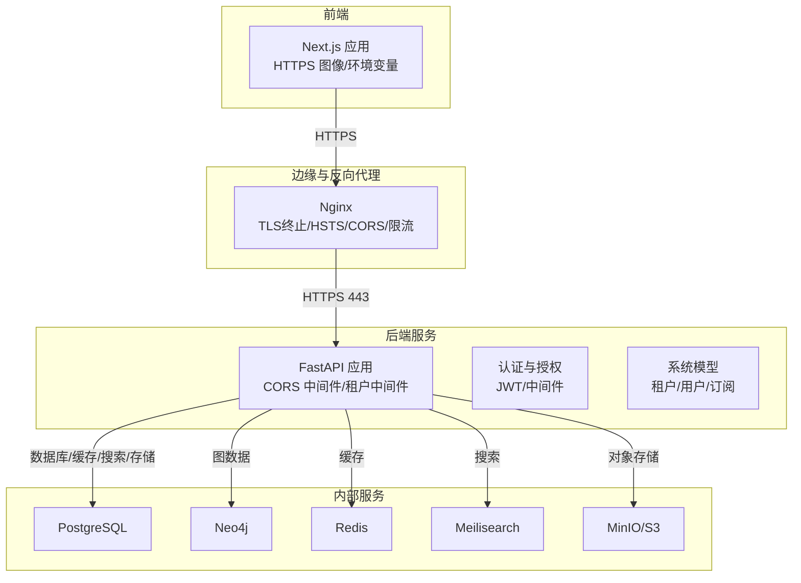
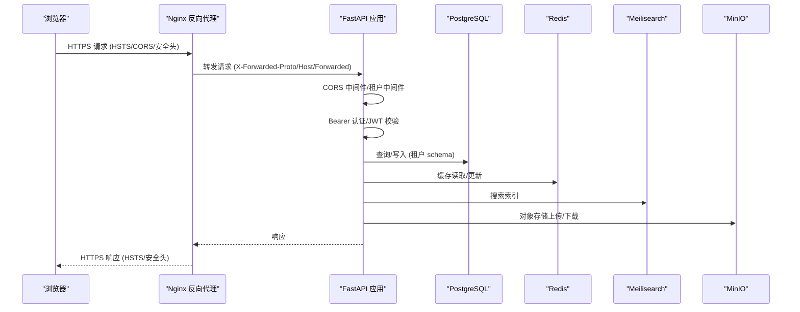
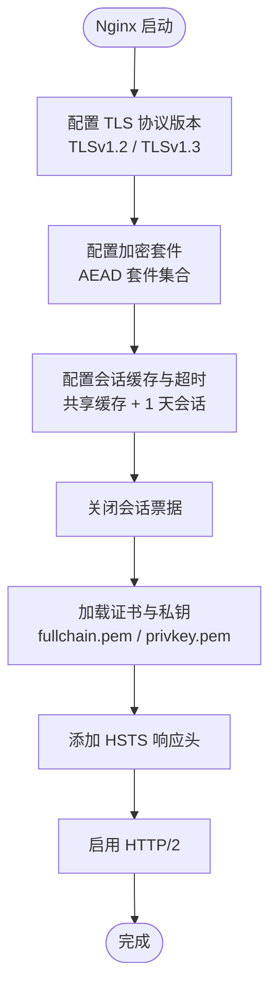
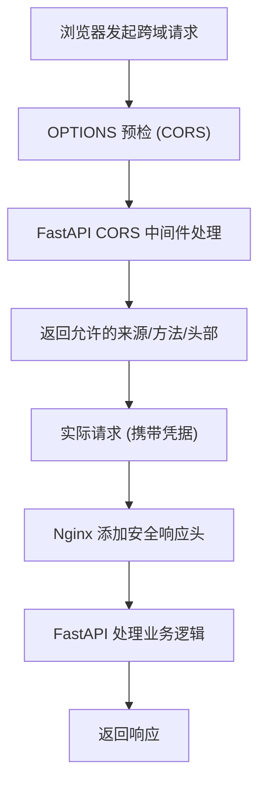
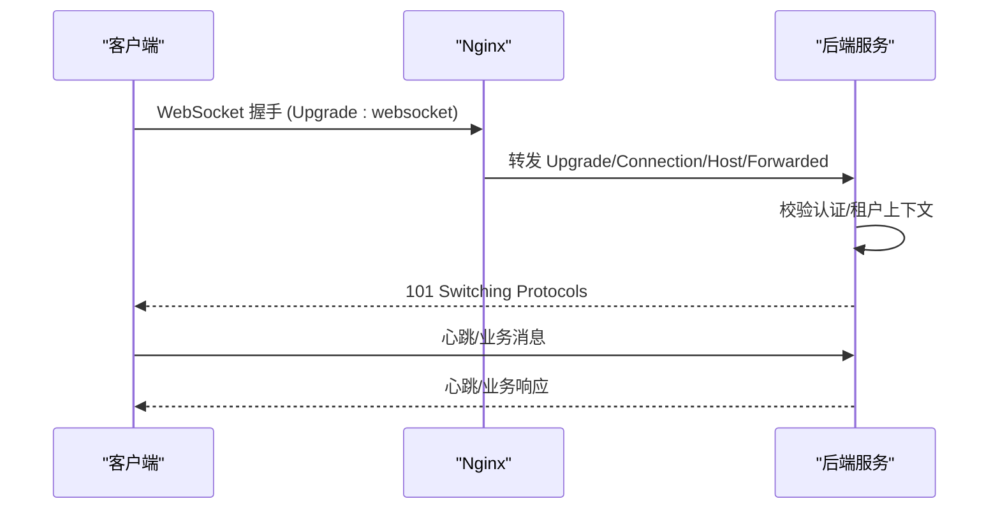
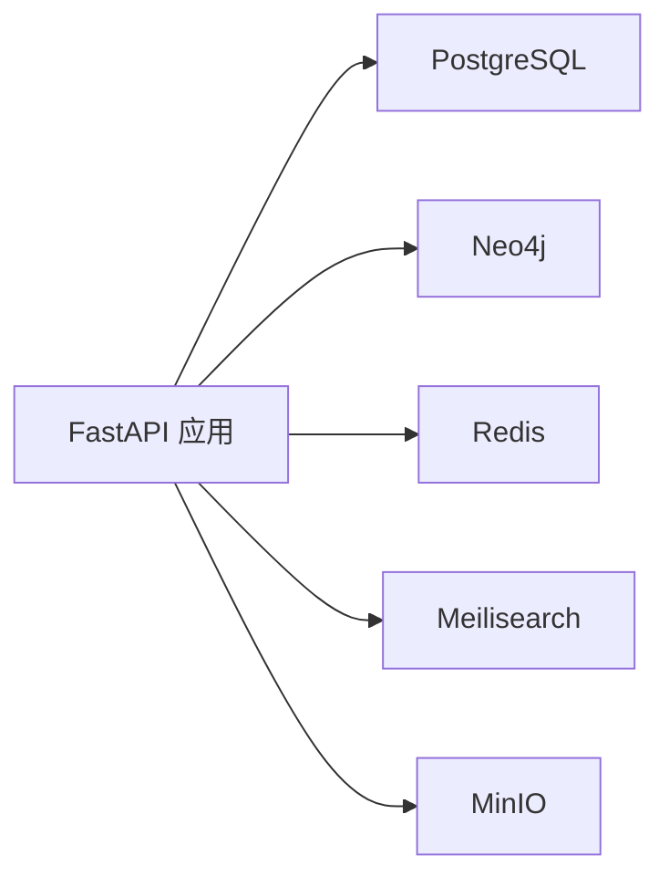
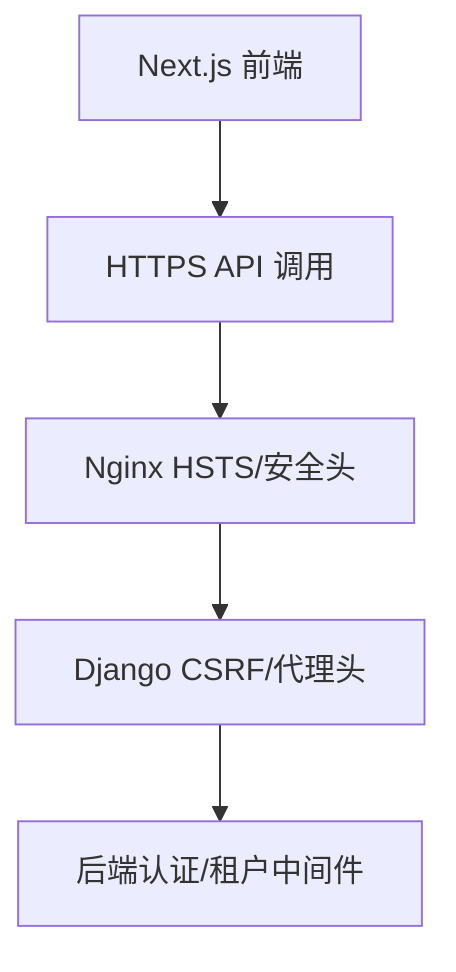
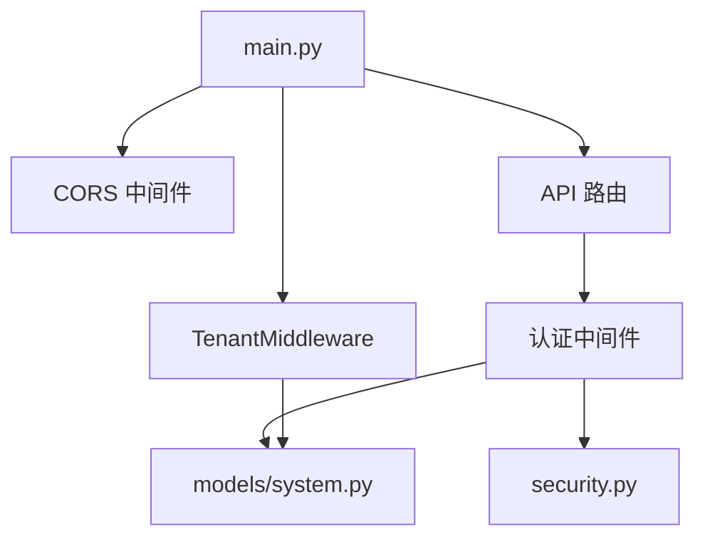

# 安全通信协议

<cite>
**本文引用的文件**
- [后端核心配置](file://backend/app/core/config.py)
- [后端主应用入口](file://backend/app/main.py)
- [后端安全工具](file://backend/app/core/security.py)
- [后端认证中间件](file://backend/app/middleware/auth.py)
- [后端多租户中间件](file://backend/app/middleware/tenant.py)
- [后端认证路由](file://backend/app/api/v1/endpoints/auth.py)
- [后端系统模型](file://backend/app/models/system.py)
- [Nginx 生产配置](file://docker/nginx/conf.d/default.conf)
- [Nginx 通用配置](file://docker/nginx/nginx.conf)
- [Django 设置](file://django_backup/liu_genealogy/settings.py)
- [Docker Compose 开发环境](file://docker-compose.yml)
- [Docker Compose 生产环境](file://docker-compose.prod.yml)
- [前端 Next 配置](file://frontend/next.config.js)
</cite>

## 目录
1. [引言](#引言)
2. [项目结构](#项目结构)
3. [核心组件](#核心组件)
4. [架构总览](#架构总览)
5. [详细组件分析](#详细组件分析)
6. [依赖关系分析](#依赖关系分析)
7. [性能考虑](#性能考虑)
8. [故障排除指南](#故障排除指南)
9. [结论](#结论)

## 引言
本文件聚焦于多租户系统中的安全通信协议实现，覆盖端到端链路：反向代理与边缘层（Nginx）的 HTTPS/TLS、CORS 与安全响应头、API 层的认证与授权、内部服务间通信（数据库、缓存、搜索引擎、对象存储）以及客户端侧的前端 SSL 与安全策略。文档基于仓库中现有实现进行梳理，并在必要处给出最佳实践建议。

## 项目结构
系统采用“Nginx 反向代理 + FastAPI 后端 + Next.js 前端”的三层架构，配合可选的后端服务（Neo4j、Redis、Meilisearch、MinIO）。生产环境通过 Nginx 提供统一的 TLS 终止、HSTS、CSP 等安全能力；开发环境通过 Docker Compose 将各组件编排运行。

图表来源
- [后端主应用入口:45-91](file://backend/app/main.py#L45-L91)
- [Nginx 生产配置:1-112](file://docker/nginx/conf.d/default.conf#L1-L112)
- [Docker Compose 生产环境:1-217](file://docker-compose.prod.yml#L1-L217)

章节来源
- [后端主应用入口:45-91](file://backend/app/main.py#L45-L91)
- [Docker Compose 开发环境:1-145](file://docker-compose.yml#L1-L145)
- [Docker Compose 生产环境:1-217](file://docker-compose.prod.yml#L1-L217)

## 核心组件
- 反向代理与边缘安全：Nginx 提供 TLS 终止、HSTS、CORS、速率限制、安全响应头等。
- API 认证与授权：JWT 令牌签发/校验、Bearer 认证中间件、超级用户权限检查。
- 多租户上下文：从子域名/路径/自定义头提取租户标识，设置租户 schema 与 Neo4j 数据库上下文。
- 内部服务连接：数据库（PostgreSQL）、图数据库（Neo4j）、缓存（Redis）、搜索（Meilisearch）、对象存储（MinIO）。
- 客户端安全：前端 Next.js 使用 HTTPS 图像源与 API 地址，生产环境通过 Nginx 提供 HTTPS。

章节来源
- [后端核心配置:11-89](file://backend/app/core/config.py#L11-L89)
- [后端安全工具:26-103](file://backend/app/core/security.py#L26-L103)
- [后端认证中间件:15-88](file://backend/app/middleware/auth.py#L15-L88)
- [后端多租户中间件:15-142](file://backend/app/middleware/tenant.py#L15-L142)
- [Nginx 通用配置:35-39](file://docker/nginx/nginx.conf#L35-L39)
- [Nginx 生产配置:14-27](file://docker/nginx/conf.d/default.conf#L14-L27)

## 架构总览
下图展示从浏览器到后端 API 的完整安全链路，包括 TLS 终止、CORS、认证、租户隔离与内部服务访问。

图表来源
- [后端主应用入口:57-67](file://backend/app/main.py#L57-L67)
- [后端认证中间件:15-57](file://backend/app/middleware/auth.py#L15-L57)
- [后端多租户中间件:39-84](file://backend/app/middleware/tenant.py#L39-L84)
- [Nginx 生产配置:33-43](file://docker/nginx/conf.d/default.conf#L33-L43)

## 详细组件分析

### HTTPS 与 TLS 安全设置
- 协议与加密套件
  - TLS 版本：启用 TLSv1.2 与 TLSv1.3。
  - 加密套件：使用现代 AEAD 套件（ECDHE-ECDSA-AES128-GCM-SHA256、ECDHE-RSA-AES128-GCM-SHA256、ECDHE-ECDSA-AES256-GCM-SHA384、ECDHE-RSA-AES256-GCM-SHA384）。
  - 服务器偏好：关闭“优先服务端密码套件”以允许客户端协商最优套件。
- 会话与票据
  - 会话超时：1 天；共享会话缓存：50MB。
  - 关闭会话票据（ssl_session_tickets off），降低重放风险。
- 证书与证书链
  - 使用 /etc/nginx/ssl/fullchain.pem 与 /etc/nginx/ssl/privkey.pem。
- HSTS
  - 在 HTTPS 响应头添加 Strict-Transport-Security，保护长期强制 HTTPS。
- HTTP/2
  - 启用 http2，提升连接复用与首包延迟。

图表来源
- [Nginx 生产配置:22-27](file://docker/nginx/conf.d/default.conf#L22-L27)
- [Nginx 通用配置:78-88](file://docker/nginx/nginx.conf#L78-L88)

章节来源
- [Nginx 生产配置:11-91](file://docker/nginx/conf.d/default.conf#L11-L91)
- [Nginx 通用配置:12-57](file://docker/nginx/nginx.conf#L12-L57)

### 证书管理与部署
- 证书位置：/etc/nginx/ssl/fullchain.pem、/etc/nginx/ssl/privkey.pem。
- 建议
  - 使用自动化 ACME 工具（如 certbot）定期续期。
  - 将私钥权限严格限制为仅 Nginx 进程可读。
  - 将证书链与私钥分离管理，避免误操作。

章节来源
- [Nginx 生产配置:15-16](file://docker/nginx/conf.d/default.conf#L15-L16)

### API 安全通信（CORS、预检与安全头部）
- CORS 配置
  - FastAPI 中间件允许指定来源、凭证、方法与头部。
  - 配置来源于 settings.cors_origins，支持逗号分隔字符串解析。
- 预检请求处理
  - 浏览器对非简单请求会发起 OPTIONS 预检；CORS 中间件自动处理。
- 安全响应头
  - X-Frame-Options、X-Content-Type-Options、Referrer-Policy、X-XSS-Protection（由 Nginx 添加）。
  - HSTS（由 Nginx 添加）。
- 速率限制
  - API 与登录接口分别设置速率区，防止暴力破解与滥用。

图表来源
- [后端主应用入口:57-67](file://backend/app/main.py#L57-L67)
- [后端核心配置:74-79](file://backend/app/core/config.py#L74-L79)
- [Nginx 通用配置:35-39](file://docker/nginx/nginx.conf#L35-L39)

章节来源
- [后端主应用入口:57-67](file://backend/app/main.py#L57-L67)
- [后端核心配置:59-80](file://backend/app/core/config.py#L59-L80)
- [Nginx 通用配置:35-39](file://docker/nginx/nginx.conf#L35-L39)

### WebSocket 安全连接方案
- 握手与升级
  - Nginx 在 API 与 Web 服务器中转发 Upgrade 与 Connection 头，支持 WebSocket 升级。
- 认证与会话
  - 建议在握手阶段通过查询参数或自定义头部传递短期认证令牌，后端校验后再建立连接。
- 连接验证
  - 建立连接后，定期发送心跳包并校验租户上下文与用户权限。
- 消息加密
  - 由于 WebSocket 通过 HTTPS 传输，消息本身无需额外加密；仍建议对敏感字段做最小化暴露与输入校验。

图表来源
- [Nginx 生产配置:35-43](file://docker/nginx/conf.d/default.conf#L35-L43)
- [后端认证中间件:15-57](file://backend/app/middleware/auth.py#L15-L57)
- [后端多租户中间件:39-84](file://backend/app/middleware/tenant.py#L39-L84)

章节来源
- [Nginx 生产配置:33-43](file://docker/nginx/conf.d/default.conf#L33-L43)

### 内部服务间通信安全
- 数据库（PostgreSQL）
  - 通过 Docker 网络内部通信；生产环境使用环境变量注入连接信息。
- 图数据库（Neo4j）
  - 默认 bolt:// 本地连接；生产环境建议启用 TLS 并配置认证。
- 缓存（Redis）
  - 通过 Docker 网络内部访问；生产环境建议启用密码认证与网络隔离。
- 搜索（Meilisearch）
  - 通过 Docker 网络内部访问；生产环境建议启用 Master Key 并限制来源。
- 对象存储（MinIO）
  - 通过 Docker 网络内部访问；生产环境建议启用 TLS 与 IAM 策略。

图表来源
- [Docker Compose 开发环境:96-102](file://docker-compose.yml#L96-L102)
- [Docker Compose 生产环境:108-118](file://docker-compose.prod.yml#L108-L118)

章节来源
- [Docker Compose 开发环境:96-102](file://docker-compose.yml#L96-L102)
- [Docker Compose 生产环境:108-118](file://docker-compose.prod.yml#L108-L118)

### 客户端安全通信（前端 SSL、安全 Cookie、HSTS）
- 前端 SSL 配置
  - Next.js 仅允许 HTTPS 图像源，避免混合内容。
  - 环境变量 NEXT_PUBLIC_API_URL 指向 HTTPS API。
- 安全 Cookie（Django）
  - CSRF 信任来源：CSRF_TRUSTED_ORIGINS 指定受信的 HTTPS 来源。
  - 代理头：SECURE_PROXY_SSL_HEADER 指示反向代理已终止 TLS。
- HSTS 策略
  - Nginx 在 HTTPS 响应中添加 Strict-Transport-Security，建议生产环境设置较长 max-age。

图表来源
- [前端 Next 配置:8-14](file://frontend/next.config.js#L8-L14)
- [Django 设置:43-47](file://django_backup/liu_genealogy/settings.py#L43-L47)
- [Nginx 生产配置](file://docker/nginx/conf.d/default.conf#L27)

章节来源
- [前端 Next 配置:1-23](file://frontend/next.config.js#L1-L23)
- [Django 设置:43-47](file://django_backup/liu_genealogy/settings.py#L43-L47)
- [Nginx 生产配置](file://docker/nginx/conf.d/default.conf#L27)

## 依赖关系分析
- 应用启动与中间件
  - FastAPI 应用在启动时注册 CORS 中间件与多租户中间件，并挂载 API 路由。
- 认证与授权
  - 认证中间件从 Authorization 头解析 Bearer 令牌，调用安全工具进行 JWT 校验，再从数据库加载用户。
- 租户上下文
  - 多租户中间件按优先级提取租户标识，加载租户状态并设置 schema 与 Neo4j 数据库上下文。
- 配置来源
  - 所有敏感配置（JWT 密钥、CORS 来源、服务地址）来自环境变量与配置类。

图表来源
- [后端主应用入口:57-70](file://backend/app/main.py#L57-L70)
- [后端认证中间件:15-57](file://backend/app/middleware/auth.py#L15-L57)
- [后端多租户中间件:39-84](file://backend/app/middleware/tenant.py#L39-L84)
- [后端安全工具:26-103](file://backend/app/core/security.py#L26-L103)
- [后端系统模型:23-71](file://backend/app/models/system.py#L23-L71)

章节来源
- [后端主应用入口:45-91](file://backend/app/main.py#L45-L91)
- [后端认证中间件:15-88](file://backend/app/middleware/auth.py#L15-L88)
- [后端多租户中间件:15-142](file://backend/app/middleware/tenant.py#L15-L142)
- [后端安全工具:1-103](file://backend/app/core/security.py#L1-L103)
- [后端系统模型:23-71](file://backend/app/models/system.py#L23-L71)

## 性能考虑
- TLS 性能
  - 启用 HTTP/2 与会话复用，减少握手开销。
  - 合理设置会话缓存大小与超时，平衡内存占用与复用率。
- CORS 性能
  - 最小化预检次数，合并请求与复用凭据。
- 速率限制
  - 为登录接口设置更严格的速率限制，保护账户安全。
- 前端缓存
  - 静态资源设置长缓存与 immutable 标记，降低带宽与延迟。

## 故障排除指南
- 401 未认证
  - 检查 Authorization 头是否为 Bearer 令牌格式；确认 JWT 密钥与算法一致。
- 403 超级用户权限不足
  - 确认用户系统角色为超级管理员。
- 租户未找到或未激活
  - 检查子域名/路径/自定义头是否正确；确认租户状态与 schema。
- CORS 跨域失败
  - 确认 settings.cors_origins 是否包含前端来源；检查预检响应头。
- TLS 握手失败
  - 检查证书链与私钥匹配；确认 Nginx 加载路径与权限；核对 TLS 版本与套件。
- HSTS 导致回退问题
  - 生产环境首次部署建议先测试非强制 HSTS，确认证书与配置无误后再启用。

章节来源
- [后端认证中间件:47-69](file://backend/app/middleware/auth.py#L47-L69)
- [后端多租户中间件:52-74](file://backend/app/middleware/tenant.py#L52-L74)
- [后端核心配置:74-79](file://backend/app/core/config.py#L74-L79)
- [Nginx 生产配置:22-27](file://docker/nginx/conf.d/default.conf#L22-L27)

## 结论
本项目在边缘层（Nginx）实现了现代 TLS 与安全响应头，在 API 层通过 CORS 中间件与 JWT 认证保障了跨域与身份安全，并通过多租户中间件实现了租户隔离。内部服务通过 Docker 网络隔离与环境变量配置实现最小暴露面。建议在生产环境中进一步强化证书轮换、mTLS、细粒度 RBAC 与审计日志，以满足更高合规要求。