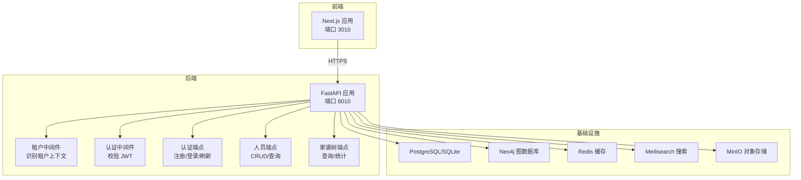
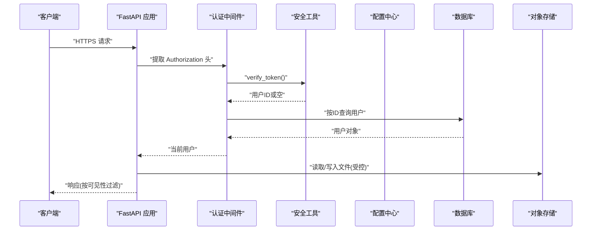
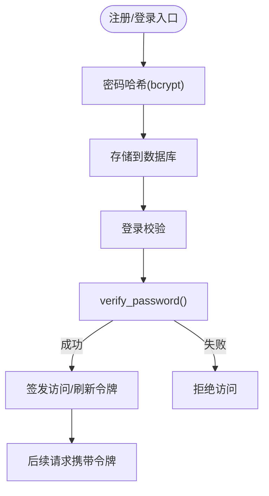
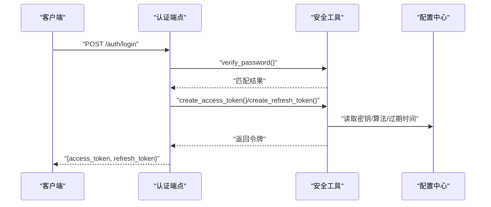
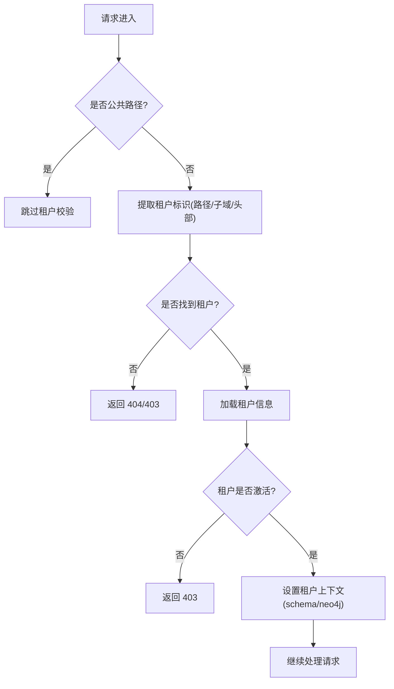
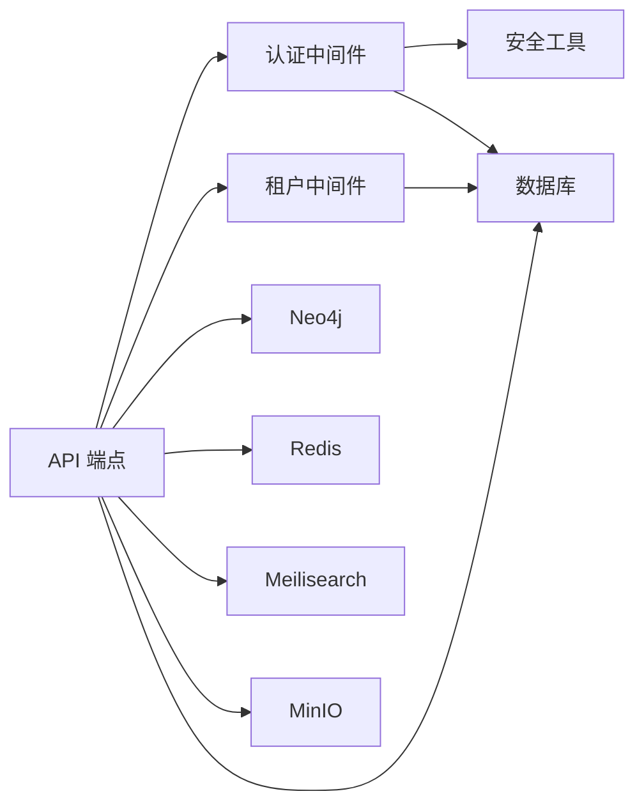

# 敏感数据保护

<cite>
**本文引用的文件**
- [backend/app/core/security.py](file://backend/app/core/security.py)
- [backend/app/core/config.py](file://backend/app/core/config.py)
- [backend/app/middleware/auth.py](file://backend/app/middleware/auth.py)
- [backend/app/middleware/tenant.py](file://backend/app/middleware/tenant.py)
- [backend/app/models/system.py](file://backend/app/models/system.py)
- [backend/app/models/tenant.py](file://backend/app/models/tenant.py)
- [backend/app/api/v1/endpoints/auth.py](file://backend/app/api/v1/endpoints/auth.py)
- [backend/app/api/v1/endpoints/persons.py](file://backend/app/api/v1/endpoints/persons.py)
- [backend/app/api/v1/endpoints/family_tree.py](file://backend/app/api/v1/endpoints/family_tree.py)
- [backend/app/core/database.py](file://backend/app/core/database.py)
- [backend/app/main.py](file://backend/app/main.py)
- [docker-compose.yml](file://docker-compose.yml)
- [django_backup/genealogy/models.py](file://django_backup/genealogy/models.py)
</cite>

## 目录
1. [引言](#引言)
2. [项目结构](#项目结构)
3. [核心组件](#核心组件)
4. [架构总览](#架构总览)
5. [详细组件分析](#详细组件分析)
6. [依赖分析](#依赖分析)
7. [性能考虑](#性能考虑)
8. [故障排查指南](#故障排查指南)
9. [结论](#结论)
10. [附录](#附录)

## 引言
本文件聚焦于多租户族谱系统中的敏感数据保护策略，围绕个人身份信息（PII）处理、密码与密钥安全存储、文件存储安全、数据传输安全以及数据生命周期管理进行系统性梳理。文档基于仓库现有代码实现进行分析，并在必要处给出改进建议与最佳实践。

## 项目结构
系统采用前后端分离与多租户架构，后端使用 FastAPI 提供 API，数据库采用 PostgreSQL（或 SQLite），图数据库使用 Neo4j，缓存使用 Redis，搜索引擎使用 Meilisearch，对象存储使用 MinIO（兼容 S3）。多租户通过子域、路径前缀或请求头识别租户上下文，并在数据库层面隔离不同租户的数据。

图表来源
- [backend/app/main.py:45-91](file://backend/app/main.py#L45-L91)
- [backend/app/middleware/tenant.py:15-84](file://backend/app/middleware/tenant.py#L15-L84)
- [docker-compose.yml:1-145](file://docker-compose.yml#L1-L145)

章节来源
- [backend/app/main.py:45-91](file://backend/app/main.py#L45-L91)
- [docker-compose.yml:1-145](file://docker-compose.yml#L1-L145)

## 核心组件
- 安全工具与令牌管理：负责密码哈希、JWT 签发与校验、令牌类型验证。
- 配置中心：集中管理应用配置，包括数据库、JWT、CORS、存储等。
- 认证中间件：从请求头提取并校验 JWT，解析用户身份。
- 租户中间件：解析租户标识（子域/路径/头部），设置租户上下文与数据库 schema。
- 数据库管理：支持 SQLite/PostgreSQL，多租户按 schema 或文件隔离。
- 模型层：系统级与租户级模型，包含用户、租户、人员、关系、变更日志等。
- API 层：认证、人员、家谱树等端点，实现业务逻辑与数据访问。

章节来源
- [backend/app/core/security.py:12-103](file://backend/app/core/security.py#L12-L103)
- [backend/app/core/config.py:11-89](file://backend/app/core/config.py#L11-L89)
- [backend/app/middleware/auth.py:15-88](file://backend/app/middleware/auth.py#L15-L88)
- [backend/app/middleware/tenant.py:15-142](file://backend/app/middleware/tenant.py#L15-L142)
- [backend/app/core/database.py:24-171](file://backend/app/core/database.py#L24-L171)
- [backend/app/models/system.py:23-223](file://backend/app/models/system.py#L23-L223)
- [backend/app/models/tenant.py:23-244](file://backend/app/models/tenant.py#L23-L244)

## 架构总览
下图展示敏感数据在系统中的流转与保护要点：认证令牌、密码哈希、租户隔离、文件存储与访问控制、以及服务间连接。

图表来源
- [backend/app/middleware/auth.py:15-57](file://backend/app/middleware/auth.py#L15-L57)
- [backend/app/core/security.py:80-103](file://backend/app/core/security.py#L80-L103)
- [backend/app/core/config.py:53-67](file://backend/app/core/config.py#L53-L67)

章节来源
- [backend/app/middleware/auth.py:15-57](file://backend/app/middleware/auth.py#L15-L57)
- [backend/app/core/security.py:80-103](file://backend/app/core/security.py#L80-L103)

## 详细组件分析

### 密码与密钥安全存储
- 密码处理
  - 使用 bcrypt 进行单向哈希，避免明文存储。
  - 注册时对明文密码调用哈希函数生成哈希值存入数据库。
  - 登录时使用哈希验证函数比对输入密码与存储哈希。
- JWT 密钥与算法
  - JWT 使用对称算法（HS256）签名，密钥由配置中心提供。
  - 访问令牌与刷新令牌分别签发，过期时间可配置。
- 机密配置
  - JWT 密钥、数据库凭据、对象存储密钥等均来自环境变量或配置文件。
  - 开发环境示例中存在默认密钥，生产环境应强制覆盖。

图表来源
- [backend/app/api/v1/endpoints/auth.py:55-86](file://backend/app/api/v1/endpoints/auth.py#L55-L86)
- [backend/app/api/v1/endpoints/auth.py:89-123](file://backend/app/api/v1/endpoints/auth.py#L89-L123)
- [backend/app/core/security.py:16-23](file://backend/app/core/security.py#L16-L23)
- [backend/app/core/security.py:26-77](file://backend/app/core/security.py#L26-L77)
- [backend/app/core/config.py:53-57](file://backend/app/core/config.py#L53-L57)

章节来源
- [backend/app/api/v1/endpoints/auth.py:55-123](file://backend/app/api/v1/endpoints/auth.py#L55-L123)
- [backend/app/core/security.py:16-77](file://backend/app/core/security.py#L16-L77)
- [backend/app/core/config.py:53-57](file://backend/app/core/config.py#L53-L57)

### 令牌签发与校验流程
- 访问令牌：包含子标识、过期时间与类型，使用配置的密钥与算法签名。
- 刷新令牌：较长有效期，仅用于换取新的访问令牌。
- 校验流程：解码令牌、验证算法与密钥、检查类型与过期时间。

图表来源
- [backend/app/api/v1/endpoints/auth.py:89-123](file://backend/app/api/v1/endpoints/auth.py#L89-L123)
- [backend/app/core/security.py:26-77](file://backend/app/core/security.py#L26-L77)
- [backend/app/core/config.py:53-57](file://backend/app/core/config.py#L53-L57)

章节来源
- [backend/app/api/v1/endpoints/auth.py:89-123](file://backend/app/api/v1/endpoints/auth.py#L89-L123)
- [backend/app/core/security.py:26-77](file://backend/app/core/security.py#L26-L77)

### 租户上下文与数据隔离
- 租户识别顺序：URL 路径前缀 → 子域 → 自定义头部。
- 未识别租户时，部分公共路径可放行；已识别租户则设置 schema 名称与 Neo4j 数据库名。
- 数据库引擎按租户 schema 动态创建，PostgreSQL 使用 schema 隔离，SQLite 使用独立文件。

图表来源
- [backend/app/middleware/tenant.py:15-84](file://backend/app/middleware/tenant.py#L15-L84)
- [backend/app/middleware/tenant.py:93-125](file://backend/app/middleware/tenant.py#L93-L125)
- [backend/app/core/database.py:58-106](file://backend/app/core/database.py#L58-L106)

章节来源
- [backend/app/middleware/tenant.py:15-142](file://backend/app/middleware/tenant.py#L15-L142)
- [backend/app/core/database.py:58-106](file://backend/app/core/database.py#L58-L106)

### 个人身份信息（PII）处理与最小化
- 可见性控制：人员记录包含可见性字段，支持公开、成员可见、私有三种级别，查询与返回时应按可见性过滤。
- 最小化原则：API 返回模型中仅包含必要的字段，避免泄露非必需信息；前端渲染时也应遵循最小化展示。
- 位置与隐私：出生地、埋葬地等敏感地理信息可按可见性策略隐藏或模糊化显示。

章节来源
- [backend/app/models/tenant.py:110-111](file://backend/app/models/tenant.py#L110-L111)
- [backend/app/api/v1/endpoints/persons.py:50-53](file://backend/app/api/v1/endpoints/persons.py#L50-L53)
- [backend/app/api/v1/endpoints/persons.py:180-205](file://backend/app/api/v1/endpoints/persons.py#L180-L205)
- [backend/app/api/v1/endpoints/persons.py:682-683](file://backend/app/api/v1/endpoints/persons.py#L682-L683)

### 文件存储安全方案
- 存储后端：使用 MinIO（兼容 S3），通过配置中心提供端点、访问密钥、密钥与桶名。
- 访问控制：建议在网关或反向代理层限制对象存储访问权限，仅允许后端服务直接访问。
- 传输加密：对象存储 API 与 Web 控制台端口在开发环境中未启用 TLS，生产环境应启用 HTTPS 并配置证书。
- 存储加密：建议开启服务器端加密（SSE）与客户端加密（CSE）双重保障，结合访问策略最小化暴露面。

章节来源
- [backend/app/core/config.py:62-67](file://backend/app/core/config.py#L62-L67)
- [docker-compose.yml:70-87](file://docker-compose.yml#L70-L87)

### 数据传输安全
- HTTPS 与反向代理：前端通过反向代理访问后端 API，应确保 TLS 终止在边缘层并使用强加密套件。
- TLS 版本与证书：生产环境应使用最新 TLS 版本，配置强密码套件与证书链校验。
- CORS 与安全头：后端已配置 CORS，建议补充安全响应头（如 HSTS、Content-Security-Policy）以增强传输层安全。

章节来源
- [backend/app/main.py:57-64](file://backend/app/main.py#L57-L64)
- [docker-compose.yml:1-145](file://docker-compose.yml#L1-L145)

### 数据生命周期管理
- 数据保留：系统未内置统一的数据保留策略，建议在租户配置中增加保留期限字段，并定期执行清理任务。
- 安全删除：删除人员记录前需解除父子与配偶关系，避免破坏图结构完整性；删除操作应记录审计日志。
- 归档策略：对于历史数据可导出至合规的长期存储介质，同时在系统中保留索引以便检索。

章节来源
- [backend/app/api/v1/endpoints/persons.py:444-492](file://backend/app/api/v1/endpoints/persons.py#L444-L492)
- [backend/app/models/tenant.py:214-243](file://backend/app/models/tenant.py#L214-L243)

## 依赖分析
- 组件耦合
  - 认证中间件依赖安全工具进行令牌校验，依赖数据库加载用户。
  - 租户中间件依赖数据库加载租户元数据，影响后续数据库会话的 schema 设置。
  - API 端点依赖中间件与数据库会话，同时依赖配置中心的外部服务参数。
- 外部依赖
  - 数据库：PostgreSQL/SQLite 引擎与会话管理。
  - 图数据库：Neo4j 连接与查询。
  - 缓存与搜索：Redis 与 Meilisearch。
  - 对象存储：MinIO（S3 兼容）。

图表来源
- [backend/app/middleware/auth.py:15-57](file://backend/app/middleware/auth.py#L15-L57)
- [backend/app/middleware/tenant.py:15-84](file://backend/app/middleware/tenant.py#L15-L84)
- [backend/app/core/database.py:24-106](file://backend/app/core/database.py#L24-L106)
- [docker-compose.yml:1-145](file://docker-compose.yml#L1-L145)

章节来源
- [backend/app/middleware/auth.py:15-57](file://backend/app/middleware/auth.py#L15-L57)
- [backend/app/middleware/tenant.py:15-84](file://backend/app/middleware/tenant.py#L15-L84)
- [backend/app/core/database.py:24-106](file://backend/app/core/database.py#L24-L106)
- [docker-compose.yml:1-145](file://docker-compose.yml#L1-L145)

## 性能考虑
- 数据库连接池：PostgreSQL 使用连接池参数控制并发与溢出，SQLite 在多租户场景下按 schema 使用独立文件，减少锁竞争。
- 缓存与搜索：Redis 用于会话与缓存，Meilisearch 提供全文检索，建议合理设置索引与更新策略。
- 令牌过期：短时访问令牌与长时刷新令牌结合，降低重放风险的同时减少频繁鉴权成本。

章节来源
- [backend/app/core/database.py:33-56](file://backend/app/core/database.py#L33-L56)
- [backend/app/core/config.py:38-40](file://backend/app/core/config.py#L38-L40)
- [backend/app/core/security.py:26-77](file://backend/app/core/security.py#L26-L77)

## 故障排查指南
- 认证失败
  - 检查 Authorization 头格式是否为 Bearer Token。
  - 核对令牌类型与过期时间，确认密钥与算法配置正确。
- 租户不可用
  - 确认租户标识解析顺序与请求头/子域/路径是否匹配。
  - 检查租户状态是否激活，数据库 schema 是否存在。
- 数据库连接异常
  - 核对数据库 URL、凭据与网络连通性。
  - SQLite 多租户模式下确认租户目录存在且具备写权限。
- 对象存储访问问题
  - 检查 MinIO 端点、密钥与桶名配置，确认服务健康状态。

章节来源
- [backend/app/middleware/auth.py:15-57](file://backend/app/middleware/auth.py#L15-L57)
- [backend/app/middleware/tenant.py:40-84](file://backend/app/middleware/tenant.py#L40-L84)
- [backend/app/core/database.py:63-96](file://backend/app/core/database.py#L63-L96)
- [docker-compose.yml:70-87](file://docker-compose.yml#L70-L87)

## 结论
本系统在多租户隔离、令牌安全与基础数据保护方面具备良好基础，但在生产部署仍需补齐以下关键项：强制覆盖默认密钥、启用传输层加密、完善数据保留与删除策略、强化文件存储访问控制与加密。通过持续优化与监控，可进一步提升整体敏感数据保护水平。

## 附录
- 建议的生产配置清单
  - 替换默认 JWT 密钥与算法，启用更强的哈希与随机盐。
  - 在反向代理层启用 TLS，配置强密码套件与证书链。
  - 对对象存储启用 HTTPS 与访问控制策略，开启服务器端与客户端加密。
  - 在租户配置中引入数据保留与删除策略，配合审计日志追踪敏感操作。