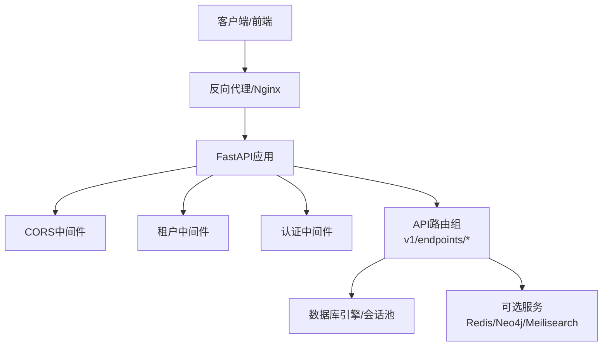
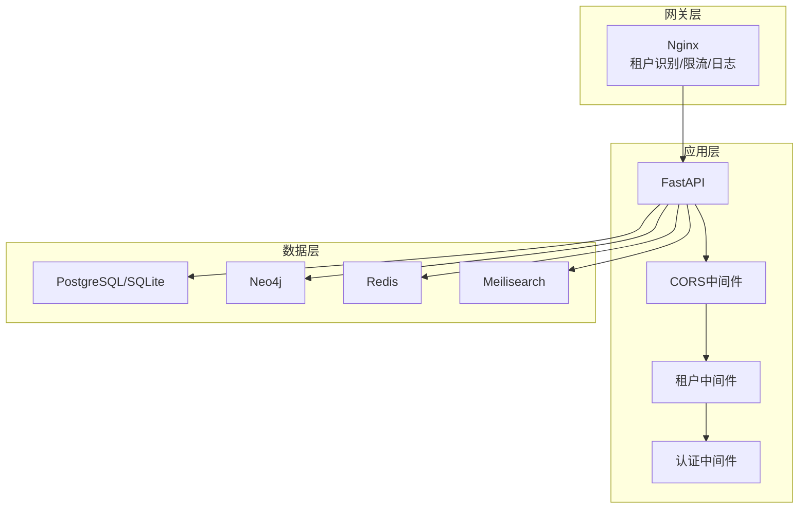
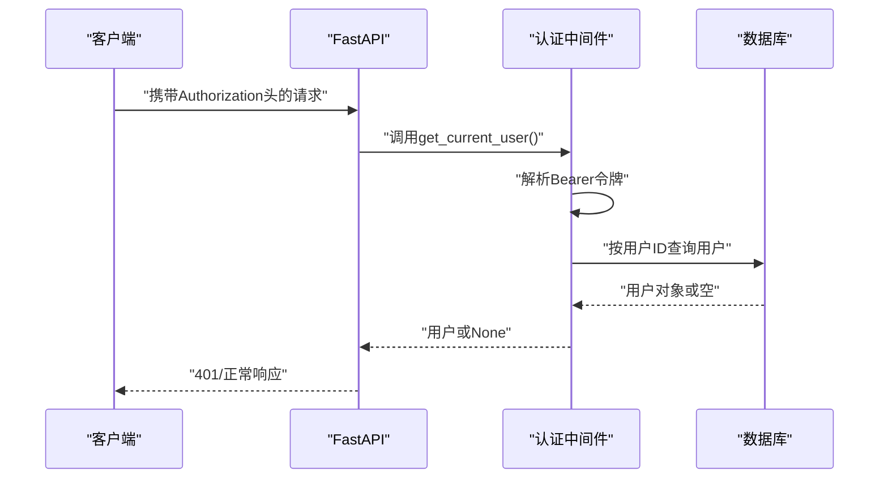
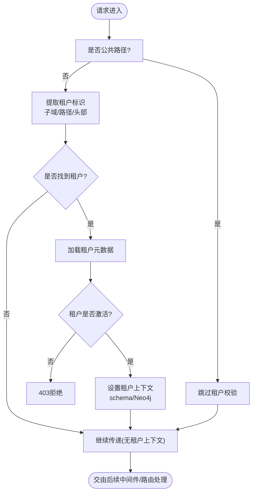
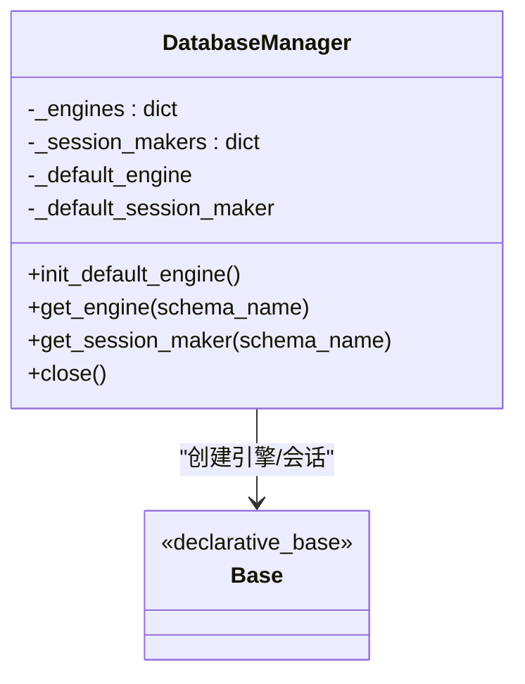
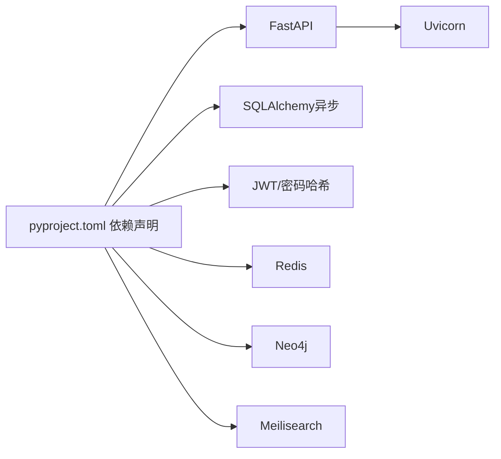

# API性能优化

<cite>
**本文引用的文件**
- [backend/app/main.py](file://backend/app/main.py)
- [backend/app/middleware/auth.py](file://backend/app/middleware/auth.py)
- [backend/app/middleware/tenant.py](file://backend/app/middleware/tenant.py)
- [backend/app/core/config.py](file://backend/app/core/config.py)
- [backend/app/core/database.py](file://backend/app/core/database.py)
- [backend/app/core/security.py](file://backend/app/core/security.py)
- [backend/app/api/v1/endpoints/auth.py](file://backend/app/api/v1/endpoints/auth.py)
- [backend/app/api/v1/endpoints/persons.py](file://backend/app/api/v1/endpoints/persons.py)
- [backend/app/api/v1/endpoints/family_tree.py](file://backend/app/api/v1/endpoints/family_tree.py)
- [backend/app/api/v1/endpoints/tenants.py](file://backend/app/api/v1/endpoints/tenants.py)
- [backend/pyproject.toml](file://backend/pyproject.toml)
- [docs/ARCHITECTURE.md](file://docs/ARCHITECTURE.md)
</cite>

## 目录
1. [简介](#简介)
2. [项目结构](#项目结构)
3. [核心组件](#核心组件)
4. [架构总览](#架构总览)
5. [详细组件分析](#详细组件分析)
6. [依赖分析](#依赖分析)
7. [性能考量](#性能考量)
8. [故障排查指南](#故障排查指南)
9. [结论](#结论)
10. [附录](#附录)

## 简介
本文件聚焦于多租户API系统的性能优化策略，围绕RESTful API的请求路由优化、响应时间监控、并发处理与限流策略；中间件性能优化（认证、租户、CORS）；批量API设计模式（批量查询、批量更新、异步处理）；API缓存策略（响应缓存、查询结果缓存、缓存失效）；API监控与性能分析（请求跟踪、错误率监控、性能指标收集）以及API版本管理与向后兼容性进行系统化梳理与落地建议。

## 项目结构
后端采用FastAPI + SQLAlchemy异步ORM，结合多租户中间件与数据库连接池，提供认证、租户识别、族谱数据等能力。整体结构清晰，便于在不牺牲可维护性的前提下实施性能优化。

图表来源
- [backend/app/main.py:45-91](file://backend/app/main.py#L45-L91)
- [backend/app/middleware/tenant.py:15-84](file://backend/app/middleware/tenant.py#L15-L84)
- [backend/app/middleware/auth.py:15-57](file://backend/app/middleware/auth.py#L15-L57)

章节来源
- [backend/app/main.py:45-91](file://backend/app/main.py#L45-L91)
- [backend/app/middleware/tenant.py:15-84](file://backend/app/middleware/tenant.py#L15-L84)
- [backend/app/middleware/auth.py:15-57](file://backend/app/middleware/auth.py#L15-L57)

## 核心组件
- 应用入口与生命周期：负责初始化数据库、可选服务连接、健康检查端点与中间件注册。
- 中间件层：CORS、租户识别、认证。
- 数据层：多租户数据库引擎与会话池管理，支持SQLite与PostgreSQL。
- API层：认证、租户、人物、族谱树等端点，统一响应结构。
- 安全与令牌：JWT生成、刷新与校验工具。

章节来源
- [backend/app/main.py:17-43](file://backend/app/main.py#L17-L43)
- [backend/app/core/database.py:24-117](file://backend/app/core/database.py#L24-L117)
- [backend/app/core/security.py:26-103](file://backend/app/core/security.py#L26-L103)
- [backend/app/api/v1/endpoints/auth.py:55-179](file://backend/app/api/v1/endpoints/auth.py#L55-L179)
- [backend/app/api/v1/endpoints/persons.py:172-493](file://backend/app/api/v1/endpoints/persons.py#L172-L493)
- [backend/app/api/v1/endpoints/family_tree.py:43-274](file://backend/app/api/v1/endpoints/family_tree.py#L43-L274)
- [backend/app/api/v1/endpoints/tenants.py:45-164](file://backend/app/api/v1/endpoints/tenants.py#L45-L164)

## 架构总览
系统采用“网关层（Nginx）—应用层（FastAPI）—数据层（PostgreSQL/Neo4j/Redis/Meilisearch）”分层架构。多租户通过中间件在请求进入时解析租户上下文，并切换数据库Schema或Neo4j数据库，确保数据隔离与性能可控。

图表来源
- [docs/ARCHITECTURE.md:34-78](file://docs/ARCHITECTURE.md#L34-L78)
- [backend/app/main.py:57-68](file://backend/app/main.py#L57-L68)
- [backend/app/middleware/tenant.py:15-84](file://backend/app/middleware/tenant.py#L15-L84)
- [backend/app/middleware/auth.py:15-57](file://backend/app/middleware/auth.py#L15-L57)

## 详细组件分析

### 认证中间件性能优化
- 令牌解析与用户加载：从请求头提取Bearer令牌，验证后按用户ID查询用户信息。建议：
  - 将用户信息缓存至Redis，命中则直接返回，避免重复数据库查询。
  - 对无效令牌快速失败，减少后续链路开销。
  - 使用轻量字段返回，避免一次性加载过多关联数据。
- 依赖注入与异常处理：统一的401/403异常路径，便于前端与监控系统识别。

图表来源
- [backend/app/middleware/auth.py:15-57](file://backend/app/middleware/auth.py#L15-L57)
- [backend/app/core/security.py:80-103](file://backend/app/core/security.py#L80-L103)

章节来源
- [backend/app/middleware/auth.py:15-57](file://backend/app/middleware/auth.py#L15-L57)
- [backend/app/core/security.py:80-103](file://backend/app/core/security.py#L80-L103)

### 租户中间件性能优化
- 租户识别顺序：子域 → 路径 → 请求头，优先匹配以减少正则与字符串处理成本。
- 公共路径白名单：跳过认证/租户校验的路径，降低无谓开销。
- 租户加载与状态校验：命中后设置请求上下文，包含schema与Neo4j数据库名，便于后续路由使用。
- 建议：
  - 将租户元数据缓存至Redis，命中即短路数据库查询。
  - 对非活跃租户快速拒绝，避免后续链路执行。

图表来源
- [backend/app/middleware/tenant.py:39-84](file://backend/app/middleware/tenant.py#L39-L84)
- [backend/app/middleware/tenant.py:93-126](file://backend/app/middleware/tenant.py#L93-L126)

章节来源
- [backend/app/middleware/tenant.py:39-84](file://backend/app/middleware/tenant.py#L39-L84)
- [backend/app/middleware/tenant.py:93-126](file://backend/app/middleware/tenant.py#L93-L126)

### CORS中间件性能配置
- 允许来源、凭证、方法与头均设为通配，简化跨域处理。
- 建议：
  - 在生产环境限定具体来源，减少预检请求与不必要的头字段。
  - 静态资源可由网关层统一处理跨域，后端仅保留必要配置。

章节来源
- [backend/app/main.py:57-64](file://backend/app/main.py#L57-L64)

### 数据库连接池与多租户引擎
- 默认引擎与会话池：根据数据库类型（SQLite/PostgreSQL）设置不同参数，PostgreSQL启用连接池与溢出。
- 多租户引擎：SQLite按租户生成独立数据库文件；PostgreSQL使用Schema隔离并设置服务端游标。
- 建议：
  - 为高并发场景适当增大池大小与溢出数，同时关注连接上限。
  - 对只读查询使用只读会话或专用只读副本（需额外架构支持）。

图表来源
- [backend/app/core/database.py:24-117](file://backend/app/core/database.py#L24-L117)

章节来源
- [backend/app/core/database.py:24-117](file://backend/app/core/database.py#L24-L117)

### RESTful API路由与并发处理
- 路由组织：按模块拆分端点（认证、租户、人物、族谱树），统一前缀与标签，便于监控与限流。
- 并发处理：FastAPI基于异步，配合异步SQLAlchemy可提升I/O密集型场景吞吐。
- 建议：
  - 对高并发端点增加速率限制与排队策略。
  - 对复杂查询（如族谱树）引入分页与深度限制，避免深层递归导致的高延迟。

章节来源
- [backend/app/api/v1/endpoints/auth.py:22-179](file://backend/app/api/v1/endpoints/auth.py#L22-L179)
- [backend/app/api/v1/endpoints/persons.py:17-717](file://backend/app/api/v1/endpoints/persons.py#L17-L717)
- [backend/app/api/v1/endpoints/family_tree.py:17-274](file://backend/app/api/v1/endpoints/family_tree.py#L17-L274)
- [backend/app/api/v1/endpoints/tenants.py:14-164](file://backend/app/api/v1/endpoints/tenants.py#L14-L164)

### 批量API设计模式
- 批量查询：在列表接口中通过过滤参数与分页控制数据规模，避免一次性返回大量数据。
- 批量更新：建议提供幂等的批量更新端点，内部使用事务与批量写入，减少往返次数。
- 异步处理：对于耗时操作（如大规模导入/导出），采用任务队列（RabbitMQ/Redis Streams）异步执行，并提供状态查询接口。
- 建议：
  - 批量端点增加速率限制与大小上限，防止滥用。
  - 返回统一的作业ID，前端轮询状态。

章节来源
- [backend/app/api/v1/endpoints/persons.py:172-235](file://backend/app/api/v1/endpoints/persons.py#L172-L235)
- [docs/ARCHITECTURE.md:98-140](file://docs/ARCHITECTURE.md#L98-L140)

### API缓存策略
- 响应缓存：对静态或低频变更的数据（如族谱统计、公开租户列表）启用HTTP缓存或Redis缓存。
- 查询结果缓存：对热门查询（如根节点树、热门人物）设置短期缓存，结合ETag/Last-Modified实现条件请求。
- 缓存失效：基于事件驱动（写操作触发）或定时刷新，确保数据一致性。
- 建议：
  - 为不同租户设置独立缓存键空间，避免串扰。
  - 对敏感数据禁用缓存或仅缓存聚合结果。

章节来源
- [backend/app/api/v1/endpoints/family_tree.py:234-270](file://backend/app/api/v1/endpoints/family_tree.py#L234-L270)
- [backend/app/api/v1/endpoints/tenants.py:45-88](file://backend/app/api/v1/endpoints/tenants.py#L45-L88)

### API监控与性能分析
- 健康检查：提供/version与/service状态端点，便于运维与负载均衡探活。
- 性能指标：建议采集请求延迟、吞吐量、错误率、数据库连接池使用率、可选服务可用性等。
- 请求跟踪：为每个请求分配Trace ID，贯穿网关、应用与下游服务，便于定位慢调用。
- 建议：
  - 使用APM（如Prometheus+Grafana）与分布式追踪（如Jaeger/OpenTelemetry）。
  - 对慢查询与异常请求报警。

章节来源
- [backend/app/main.py:72-87](file://backend/app/main.py#L72-L87)
- [docs/ARCHITECTURE.md:34-78](file://docs/ARCHITECTURE.md#L34-L78)

### API版本管理与向后兼容
- 版本前缀：统一使用/api/v1作为版本前缀，便于未来升级。
- 向后兼容：新增字段采用可选，变更行为通过明确的版本策略与弃用周期保证。
- 建议：
  - 发布前提供迁移指南与兼容性矩阵。
  - 对破坏性变更提供过渡期与双写策略。

章节来源
- [backend/app/main.py:47-54](file://backend/app/main.py#L47-L54)
- [docs/ARCHITECTURE.md:528-577](file://docs/ARCHITECTURE.md#L528-L577)

## 依赖分析
- 应用依赖：FastAPI、SQLAlchemy异步、Pydantic、JWT、密码哈希、Redis、Neo4j、Meilisearch等。
- 运行时：Uvicorn作为ASGI服务器，支持异步I/O与高并发。
- 建议：
  - 在生产环境固定依赖版本，避免意外升级导致性能波动。
  - 对可选服务（Redis/Neo4j/Meilisearch）做健康检查与降级策略。

图表来源
- [backend/pyproject.toml:7-25](file://backend/pyproject.toml#L7-L25)

章节来源
- [backend/pyproject.toml:7-25](file://backend/pyproject.toml#L7-L25)

## 性能考量
- 请求路由优化
  - 将高频端点置于更靠近路由树顶部的路径，减少匹配开销。
  - 对静态资源由网关层处理，后端专注业务逻辑。
- 响应时间监控
  - 为每个端点埋点，记录P50/P95/P99延迟与错误分布。
  - 对慢查询（如族谱树）增加超时与深度限制。
- 并发处理与限流
  - 使用中间件或网关层对IP/租户/用户维度进行限流，防止突发流量击穿。
  - 对数据库连接池参数进行压测调优，避免连接争用。
- 中间件性能
  - 认证与租户中间件尽量短路失败，避免多余数据库查询。
  - CORS保持最小必要配置，生产环境限定来源。
- 缓存与异步
  - 对只读数据与聚合结果启用缓存，结合失效策略。
  - 对耗时任务采用异步队列，提供状态查询接口。

## 故障排查指南
- 认证失败
  - 检查Authorization头格式与令牌有效性，确认用户存在且激活。
- 租户不存在/未激活
  - 核对租户标识来源（子域/路径/头部），检查租户状态与schema。
- 数据库连接异常
  - 检查连接池参数与数据库可用性，确认当前租户使用的引擎已初始化。
- 可选服务不可用
  - 健康检查端点显示服务状态，必要时降级到无缓存/无搜索模式。

章节来源
- [backend/app/middleware/auth.py:20-44](file://backend/app/middleware/auth.py#L20-L44)
- [backend/app/middleware/tenant.py:48-83](file://backend/app/middleware/tenant.py#L48-L83)
- [backend/app/core/database.py:33-56](file://backend/app/core/database.py#L33-L56)
- [backend/app/main.py:72-87](file://backend/app/main.py#L72-L87)

## 结论
通过在中间件层引入租户与认证的快速失败、在数据层启用连接池与多租户引擎、在API层统一响应与分页策略、在网关层实施限流与缓存，以及建立完善的监控与版本管理机制，可以在保证数据隔离与安全的前提下显著提升多租户API的性能与稳定性。建议在生产环境中逐步落地上述优化措施，并持续通过压测与监控反馈迭代。

## 附录
- 配置项参考
  - 数据库连接池：pool_size、max_overflow
  - JWT过期时间：access_token与refresh_token
  - CORS允许来源：cors_origins
- 依赖版本与构建
  - 依赖声明与测试配置位于pyproject.toml

章节来源
- [backend/app/core/config.py:34-80](file://backend/app/core/config.py#L34-L80)
- [backend/pyproject.toml:7-61](file://backend/pyproject.toml#L7-L61)