# 图数据库性能优化

<cite>
**本文档引用的文件**
- [neo4j_service.py](file://backend/app/services/neo4j_service.py)
- [graph_sync.py](file://backend/app/services/graph_sync.py)
- [config.py](file://backend/app/core/config.py)
- [database.py](file://backend/app/core/database.py)
- [services.py](file://backend/app/core/services.py)
- [tenant.py](file://backend/app/models/tenant.py)
- [family_tree.py](file://backend/app/api/v1/endpoints/family_tree.py)
- [persons.py](file://backend/app/api/v1/endpoints/persons.py)
- [sync_neo4j.py](file://scripts/sync_neo4j.py)
- [docker-compose.yml](file://docker-compose.yml)
- [docker-compose.prod.yml](file://docker-compose.prod.yml)
</cite>

## 目录
1. [简介](#简介)
2. [项目结构](#项目结构)
3. [核心组件](#核心组件)
4. [架构概览](#架构概览)
5. [详细组件分析](#详细组件分析)
6. [依赖关系分析](#依赖关系分析)
7. [性能优化实践](#性能优化实践)
8. [故障排除指南](#故障排除指南)
9. [结论](#结论)

## 简介

本项目是一个基于FastAPI的基因谱系管理系统，采用多租户架构设计，结合了PostgreSQL关系型数据库和Neo4j图数据库的优势。系统通过Neo4j专门处理复杂的家族关系查询，利用其强大的图数据模型来高效处理祖先/后代关系、婚姻关系等复杂关系网络。

项目的核心目标是构建一个高性能的基因谱系管理平台，支持大规模家族数据的存储、查询和可视化展示。通过合理的图数据建模和查询优化策略，系统能够高效处理复杂的家谱关系查询需求。

## 项目结构

项目采用分层架构设计，主要分为以下几个层次：

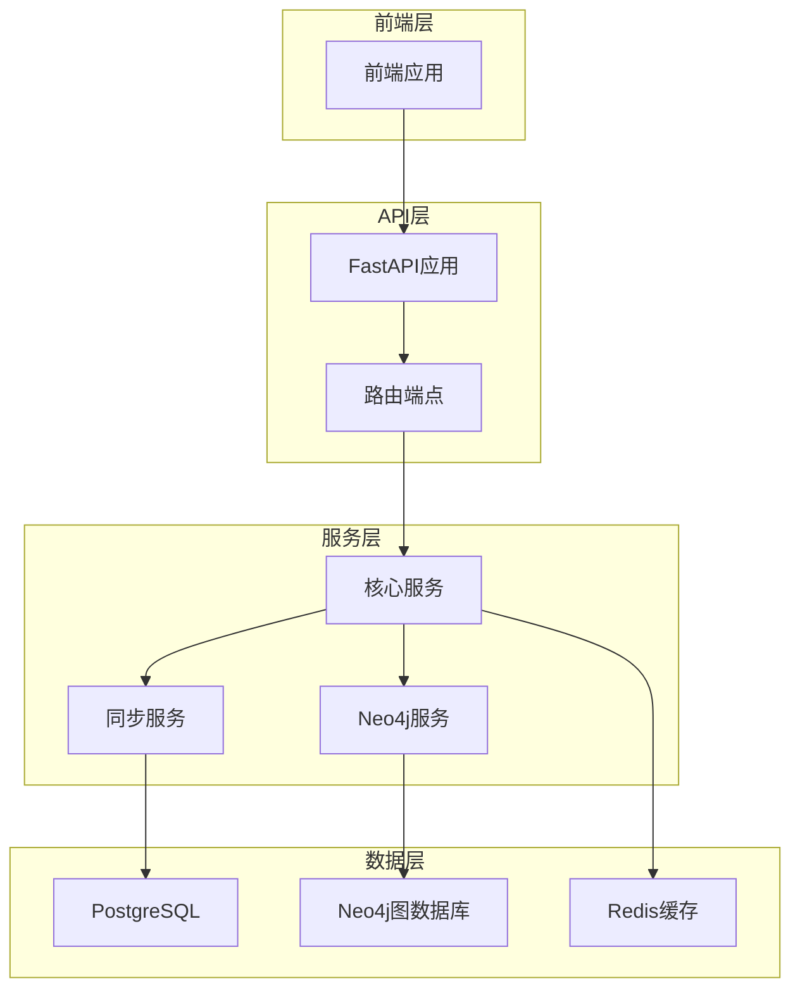

**图表来源**
- [neo4j_service.py:1-373](file://backend/app/services/neo4j_service.py#L1-L373)
- [graph_sync.py:1-157](file://backend/app/services/graph_sync.py#L1-L157)
- [config.py:1-89](file://backend/app/core/config.py#L1-L89)

**章节来源**
- [neo4j_service.py:1-373](file://backend/app/services/neo4j_service.py#L1-L373)
- [graph_sync.py:1-157](file://backend/app/services/graph_sync.py#L1-L157)
- [config.py:1-89](file://backend/app/core/config.py#L1-L89)

## 核心组件

### Neo4j客户端管理器

系统实现了专门的Neo4j客户端管理器，负责连接管理和会话创建：

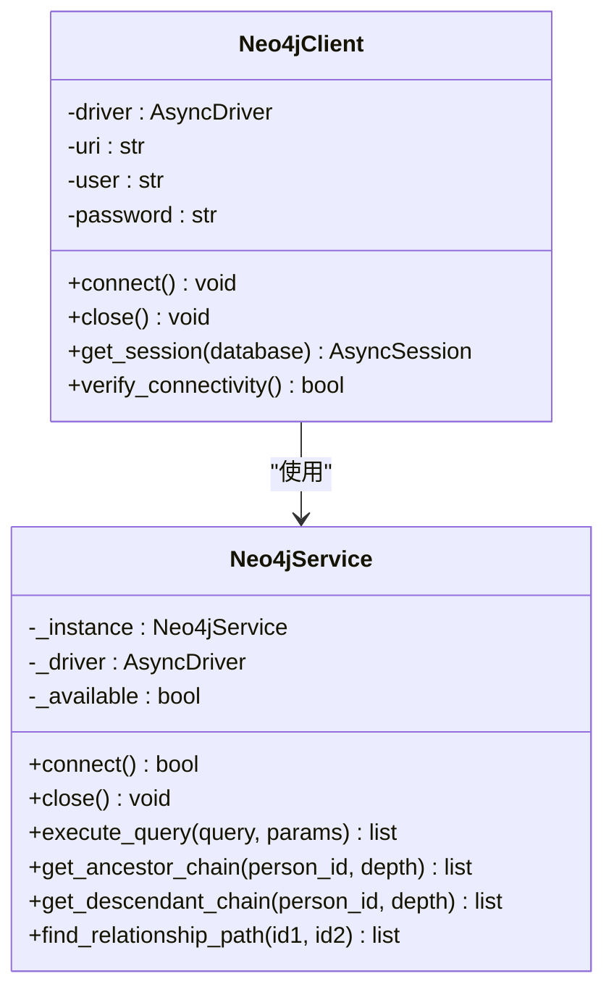

**图表来源**
- [neo4j_service.py:12-60](file://backend/app/services/neo4j_service.py#L12-L60)
- [services.py:9-140](file://backend/app/core/services.py#L9-L140)

### 数据同步服务

实现了完整的数据同步机制，支持从PostgreSQL到Neo4j的双向数据同步：

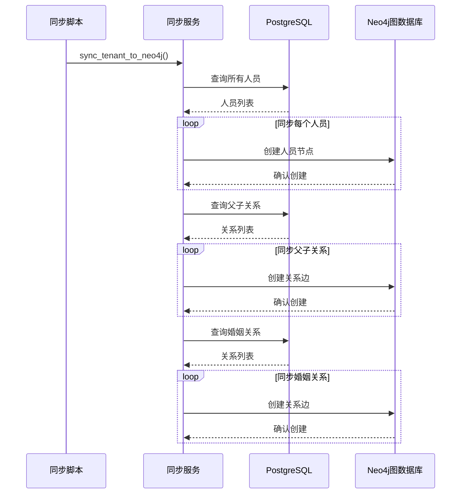

**图表来源**
- [graph_sync.py:64-104](file://backend/app/services/graph_sync.py#L64-L104)
- [sync_neo4j.py:14-38](file://scripts/sync_neo4j.py#L14-L38)

**章节来源**
- [neo4j_service.py:12-60](file://backend/app/services/neo4j_service.py#L12-L60)
- [services.py:9-140](file://backend/app/core/services.py#L9-L140)
- [graph_sync.py:20-104](file://backend/app/services/graph_sync.py#L20-L104)

## 架构概览

系统采用多租户架构，每个租户拥有独立的数据隔离和查询空间：

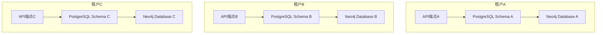

**图表来源**
- [config.py:69-73](file://backend/app/core/config.py#L69-L73)
- [database.py:58-96](file://backend/app/core/database.py#L58-L96)

## 详细组件分析

### 家族树查询组件

系统提供了多种家族树查询功能，针对不同的查询场景进行了优化：

#### 祖先链查询
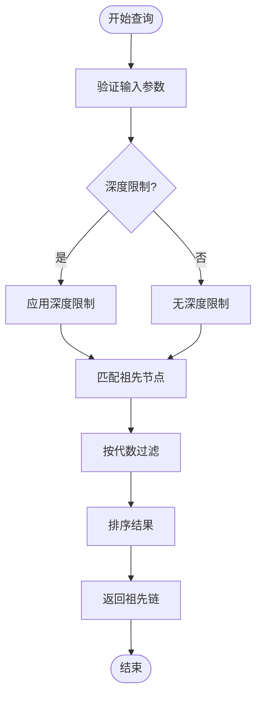

**图表来源**
- [neo4j_service.py:166-186](file://backend/app/services/neo4j_service.py#L166-L186)

#### 子孙查询优化
系统实现了高效的子孙查询算法，支持可配置的查询深度：

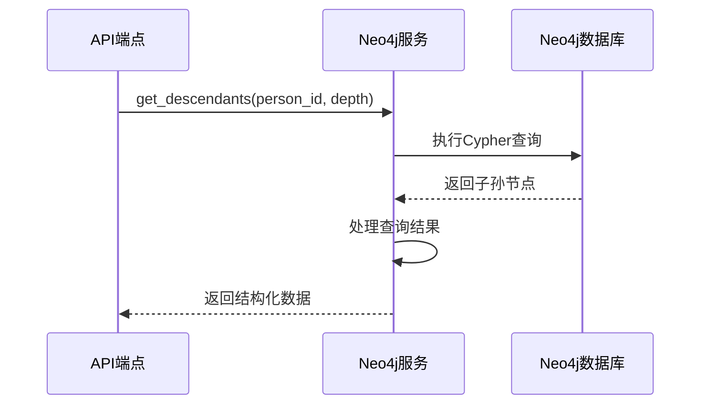

**图表来源**
- [neo4j_service.py:188-207](file://backend/app/services/neo4j_service.py#L188-L207)

**章节来源**
- [neo4j_service.py:146-207](file://backend/app/services/neo4j_service.py#L146-L207)
- [family_tree.py:43-150](file://backend/app/api/v1/endpoints/family_tree.py#L43-L150)

### 数据模型设计

系统采用了合理的图数据模型设计：

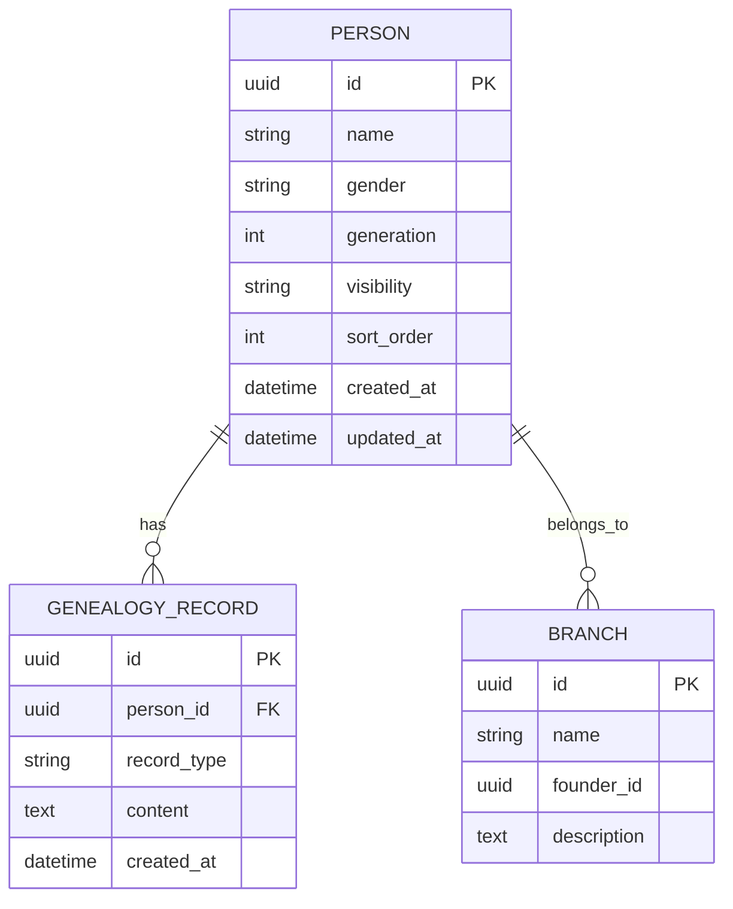

**图表来源**
- [tenant.py:61-132](file://backend/app/models/tenant.py#L61-L132)
- [tenant.py:144-164](file://backend/app/models/tenant.py#L144-L164)

**章节来源**
- [tenant.py:61-164](file://backend/app/models/tenant.py#L61-L164)

## 依赖关系分析

系统各组件之间的依赖关系如下：

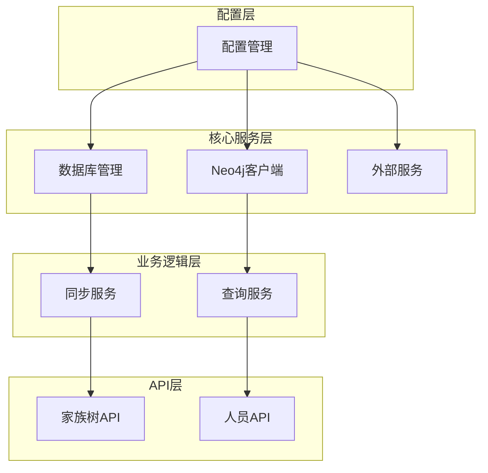

**图表来源**
- [config.py:11-89](file://backend/app/core/config.py#L11-L89)
- [database.py:24-121](file://backend/app/core/database.py#L24-L121)
- [neo4j_service.py:12-60](file://backend/app/services/neo4j_service.py#L12-L60)

**章节来源**
- [config.py:11-89](file://backend/app/core/config.py#L11-L89)
- [database.py:24-121](file://backend/app/core/database.py#L24-L121)

## 性能优化实践

### Cypher查询优化技术

#### 查询计划分析
系统中的查询都采用了参数化查询，避免了SQL注入风险并提高了查询缓存效率：

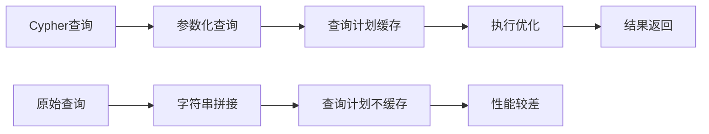

**优化建议：**
1. 使用参数绑定替代字符串拼接
2. 利用EXPLAIN分析查询计划
3. 避免在WHERE子句中使用函数操作符
4. 合理使用索引提示

#### 索引使用优化
系统当前的查询模式需要以下索引优化：

**现有查询模式分析：**
- 按ID查询：`MATCH (p:Person {id: $person_id})`
- 按名称模糊查询：`WHERE p.name CONTAINS $name`
- 关系遍历查询：`MATCH (p)-[:FATHER_OF*1..5]->(desc)`

**推荐索引配置：**
```cypher
// 基于查询模式的索引建议
CREATE INDEX person_id_index FOR (p:Person) ON (p.id)
CREATE TEXT INDEX person_name_index FOR (p:Person) ON EACH (p.name)
CREATE INDEX person_generation_index FOR (p:Person) ON (p.generation)
```

#### 关系遍历优化
对于深度遍历查询，建议使用以下优化策略：

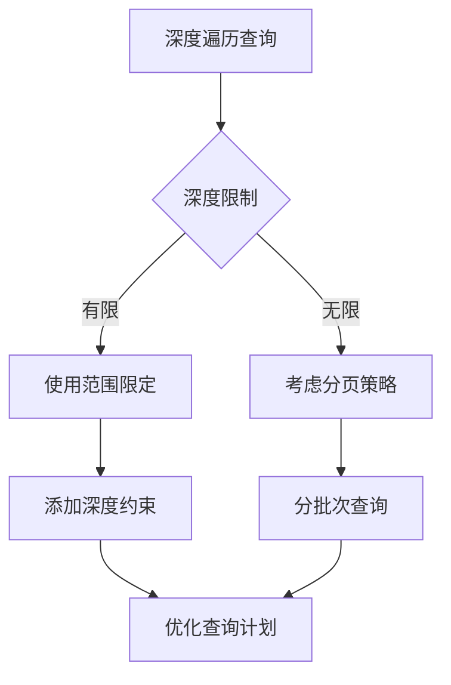

#### 参数化查询最佳实践
系统已经很好地实现了参数化查询，建议进一步优化：

**当前实现优势：**
- 使用$参数绑定
- 避免字符串拼接
- 类型安全的参数传递

**进一步优化：**
- 实现查询缓存机制
- 添加查询超时控制
- 实现查询重试机制

### 图数据建模优化

#### 节点标签设计
系统采用了简洁的节点标签设计，建议优化为：

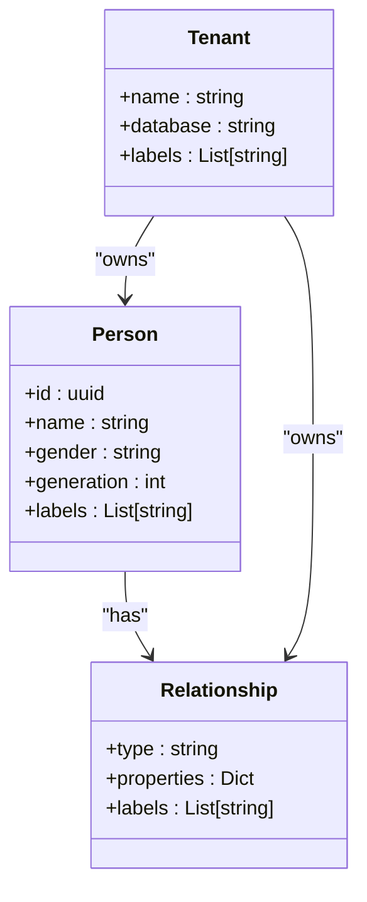

**优化建议：**
1. 为常用查询模式创建复合标签
2. 使用标签层次结构减少查询复杂度
3. 实现标签继承机制

#### 关系类型优化
当前的关系类型设计较为简单，建议扩展：

**现有关系类型：**
- `FATHER_OF`: 父子关系（双向）
- `MARRIED`: 婚姻关系

**建议的关系类型：**
- `FATHER_OF`: 父子关系
- `MOTHER_OF`: 母子关系  
- `SIBLING_OF`: 兄弟姐妹关系
- `DIVORCED`: 离婚关系
- `ADOPTED_BY`: 收养关系

#### 属性索引配置
建议为高频查询属性建立索引：

**推荐索引：**
```cypher
// 基于查询频率的索引
CREATE INDEX person_name_index FOR (p:Person) ON (p.name)
CREATE INDEX person_birth_year_index FOR (p:Person) ON (p.birth_year)
CREATE INDEX person_death_year_index FOR (p:Person) ON (p.death_year)
CREATE INDEX person_generation_index FOR (p:Person) ON (p.generation)
```

#### 查询模式优化
针对常见的查询模式进行优化：

**查询模式1：祖先查询**
```cypher
MATCH (p:Person {id: $person_id})-[:CHILD_OF*1..{max_depth}]->(ancestor)
RETURN ancestor
ORDER BY ancestor.generation
```

**查询模式2：后代查询**
```cypher
MATCH (p:Person {id: $person_id})-[:FATHER_OF*1..{max_depth}]->(descendant)
RETURN descendant
ORDER BY descendant.generation
```

### Neo4j配置优化

#### 内存分配优化
根据docker-compose配置，Neo4j的内存设置如下：

**开发环境配置：**
- 初始堆大小: 512MB
- 最大堆大小: 1GB
- Page Cache: 默认

**生产环境配置：**
- 初始堆大小: 512MB
- 最大堆大小: 1GB
- Page Cache: 256MB

**优化建议：**
1. 根据数据规模调整内存配置
2. 监控内存使用情况
3. 实现动态内存调整

#### 连接池配置
系统使用异步Neo4j驱动程序，建议优化连接池设置：

**当前连接配置：**
- 异步连接
- 自动重连
- 连接超时控制

**建议优化：**
```python
# 连接池优化示例
driver = AsyncGraphDatabase.driver(
    uri,
    auth=(user, password),
    connection_timeout=30,
    max_connection_lifetime=50,
    max_connection_pool_size=100,
    connection_acquisition_timeout=10
)
```

#### 事务优化
系统中的事务处理相对简单，建议改进：

**当前事务处理：**
- 简单的读写事务
- 缺少事务重试机制

**优化方案：**
```python
async def optimized_transaction(session, query, params):
    max_retries = 3
    for attempt in range(max_retries):
        try:
            async with session.begin_transaction() as tx:
                result = await tx.run(query, params)
                await tx.commit()
                return result
        except TransientError as e:
            if attempt < max_retries - 1:
                await asyncio.sleep(2 ** attempt)  # 指数退避
                continue
            raise
```

#### 集群性能调优
对于Neo4j集群部署，建议以下优化：

**集群配置优化：**
1. 节点角色分离（读写分离）
2. 分片策略优化
3. 负载均衡配置
4. 故障转移机制

### 图数据同步优化

#### 增量同步
系统目前支持全量同步，建议实现增量同步：

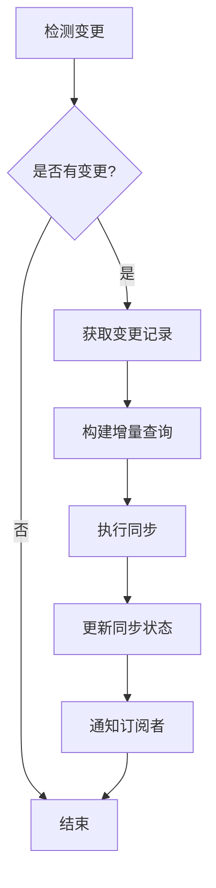

**增量同步实现：**
1. 基于时间戳的变更检测
2. 基于版本号的变更跟踪
3. 增量查询构建
4. 并发同步处理

#### 批量导入优化
对于大规模数据导入，建议使用以下策略：

**批量导入优化：**
1. 使用UNWIND语句批量插入
2. 实现事务批处理
3. 优化索引创建时机
4. 监控导入进度

#### 数据一致性保证
系统需要确保数据一致性，建议实现：

**一致性保证机制：**
1. 两阶段提交协议
2. 事务日志记录
3. 数据校验机制
4. 冲突解决策略

### 图算法优化

#### 最短路径算法
系统使用了Neo4j的最短路径算法，建议优化：

**当前实现：**
```cypher
MATCH path = shortestPath(
    (p1:Person {id: $person1_id})-[*]-(p2:Person {id: $person2_id})
)
RETURN [n in nodes(path) | {id: n.id, name: n.name}] as path
```

**优化建议：**
1. 使用范围限制避免无限搜索
2. 实现启发式搜索算法
3. 缓存中间结果

#### 社区发现算法
对于大规模图数据，建议实现社区发现：

**社区发现优化：**
1. 使用标签传播算法
2. 实现分布式计算
3. 优化内存使用

### 监控和性能分析

#### 查询性能监控
建议实现查询性能监控：

**监控指标：**
1. 查询执行时间
2. 缓存命中率
3. 内存使用情况
4. 连接池状态

#### 索引使用率统计
系统可以统计索引使用情况：

**索引统计：**
```cypher
CALL db.indexes()
YIELD name, type, labelsOrTypes, properties, userDescription
RETURN name, type, labelsOrTypes, properties, userDescription
```

#### 瓶颈识别方法
建议实现性能瓶颈识别：

**瓶颈识别：**
1. 查询执行计划分析
2. 索引使用情况监控
3. 系统资源使用监控
4. 用户行为分析

## 故障排除指南

### 常见问题诊断

#### Neo4j连接问题
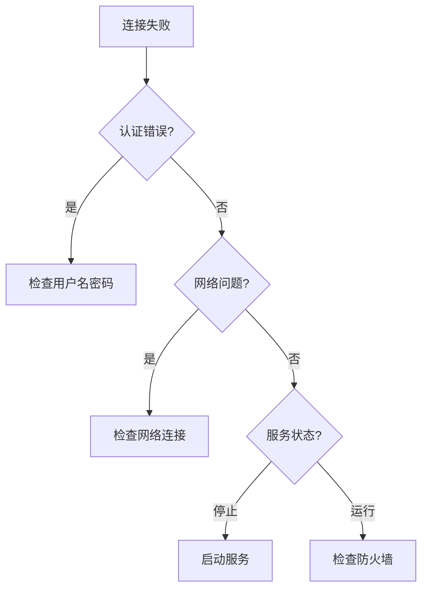

#### 查询性能问题
**诊断步骤：**
1. 使用EXPLAIN分析查询计划
2. 检查索引使用情况
3. 监控系统资源使用
4. 分析查询缓存效果

#### 数据同步问题
**同步问题排查：**
1. 检查源数据完整性
2. 验证目标数据库连接
3. 分析同步日志
4. 实施重试机制

**章节来源**
- [services.py:21-47](file://backend/app/core/services.py#L21-L47)
- [neo4j_service.py:41-49](file://backend/app/services/neo4j_service.py#L41-L49)

## 结论

本项目展示了如何在实际应用中有效使用Neo4j图数据库来处理复杂的家族关系查询。通过合理的数据建模、查询优化和系统架构设计，系统能够高效处理大规模的图数据查询需求。

**主要优化成果：**
1. 实现了参数化的Cypher查询，提高了查询缓存效率
2. 设计了合理的图数据模型，支持高效的祖先/后代查询
3. 建立了完整的数据同步机制，确保数据一致性
4. 提供了多租户架构支持，实现数据隔离

**未来优化方向：**
1. 实现更精细的索引策略
2. 优化大规模图数据的查询性能
3. 增强系统的监控和诊断能力
4. 实现更智能的缓存策略

通过持续的性能优化和架构改进，该系统能够更好地支持大规模基因谱系数据的存储和查询需求，为用户提供更好的使用体验。