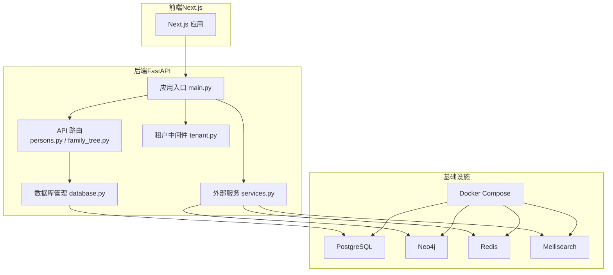
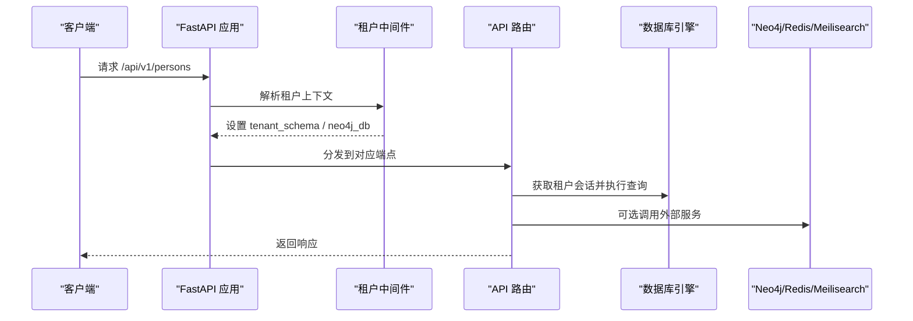
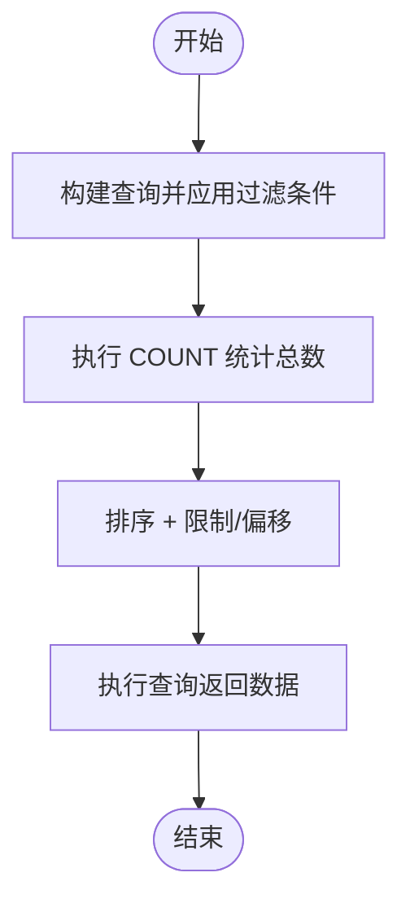
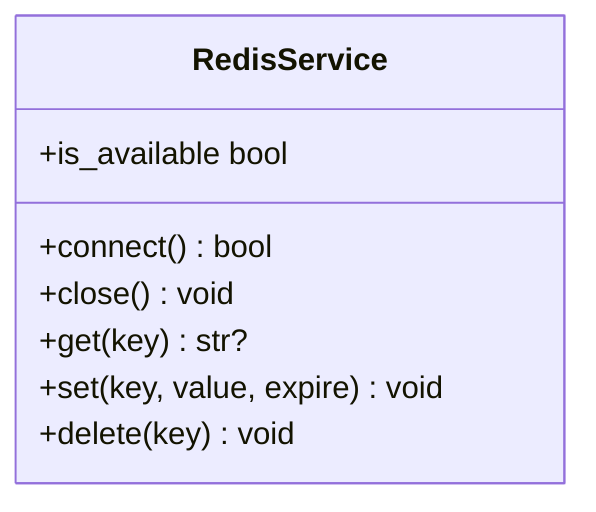
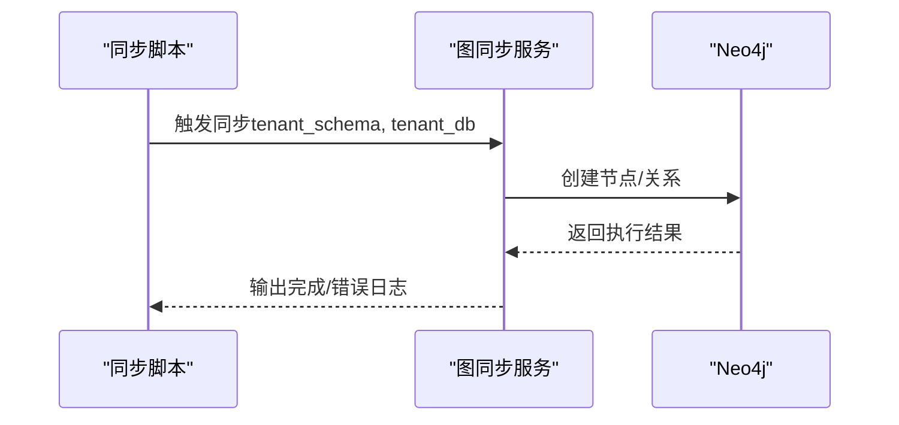
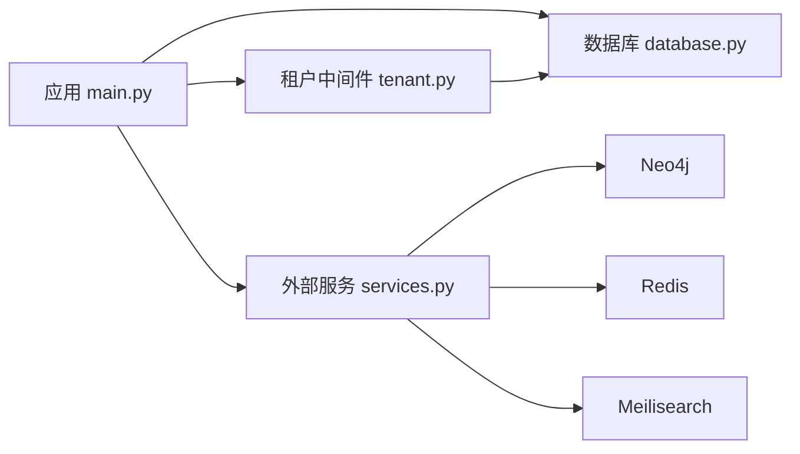

# 性能优化实践

<cite>
**本文引用的文件**
- [后端主入口 main.py](file://backend/app/main.py)
- [配置 config.py](file://backend/app/core/config.py)
- [数据库管理 database.py](file://backend/app/core/database.py)
- [租户中间件 tenant.py](file://backend/app/middleware/tenant.py)
- [外部服务管理 services.py](file://backend/app/core/services.py)
- [人员 API 端点 persons.py](file://backend/app/api/v1/endpoints/persons.py)
- [家谱树 API 端点 family_tree.py](file://backend/app/api/v1/endpoints/family_tree.py)
- [Neo4j 服务 neo4j_service.py](file://backend/app/services/neo4j_service.py)
- [系统模型（迁移）001_initial.py](file://backend/migrations/versions/001_initial.py)
- [Neo4j 同步脚本 sync_neo4j.py](file://scripts/sync_neo4j.py)
- [Docker Compose 配置 docker-compose.yml](file://docker-compose.yml)
- [Next.js 配置 next.config.js](file://frontend/next.config.js)
- [前端包管理 package.json](file://frontend/package.json)
- [PostgreSQL 初始化脚本 init.sql](file://docker/postgres/init.sql)
</cite>

## 目录
1. [简介](#简介)
2. [项目结构](#项目结构)
3. [核心组件](#核心组件)
4. [架构总览](#架构总览)
5. [详细组件分析](#详细组件分析)
6. [依赖关系分析](#依赖关系分析)
7. [性能考虑](#性能考虑)
8. [故障排查指南](#故障排查指南)
9. [结论](#结论)
10. [附录](#附录)

## 简介
本指南面向多租户族谱管理系统，聚焦于数据库查询优化、缓存策略、前端性能、API 性能、图数据库优化以及性能监控与分析。文档基于现有代码库进行深入分析，并结合可落地的最佳实践建议，帮助在开发与生产环境中实现稳定、高效、可扩展的性能表现。

## 项目结构
系统采用前后端分离架构：后端基于 FastAPI + SQLAlchemy Async（PostgreSQL/SQLite），支持多租户；图数据库使用 Neo4j；缓存与搜索分别集成 Redis 与 Meilisearch；前端基于 Next.js。Docker Compose 提供本地开发与测试环境编排。

**图表来源**
- [后端主入口 main.py:17-42](file://backend/app/main.py#L17-L42)
- [数据库管理 database.py:24-118](file://backend/app/core/database.py#L24-L118)
- [租户中间件 tenant.py:15-84](file://backend/app/middleware/tenant.py#L15-L84)
- [外部服务管理 services.py:268-285](file://backend/app/core/services.py#L268-L285)
- [Docker Compose 配置 docker-compose.yml:1-145](file://docker-compose.yml#L1-L145)

**章节来源**
- [后端主入口 main.py:17-42](file://backend/app/main.py#L17-L42)
- [Docker Compose 配置 docker-compose.yml:1-145](file://docker-compose.yml#L1-L145)

## 核心组件
- 多租户数据库引擎与会话管理：按租户动态创建引擎与会话，支持 SQLite 单文件与 PostgreSQL schema 多租户模式。
- 租户中间件：从子域名、路径或请求头提取租户标识，设置租户上下文。
- 外部服务：Neo4j 图数据库、Redis 缓存、Meilisearch 搜索，均具备可选连接与降级能力。
- API 层：人员与家谱树相关接口，包含分页、过滤、树构建等逻辑。
- 前端：Next.js 应用，使用 React Query 进行数据拉取与缓存。

**章节来源**
- [数据库管理 database.py:24-118](file://backend/app/core/database.py#L24-L118)
- [租户中间件 tenant.py:15-84](file://backend/app/middleware/tenant.py#L15-L84)
- [外部服务管理 services.py:268-285](file://backend/app/core/services.py#L268-L285)
- [人员 API 端点 persons.py:172-235](file://backend/app/api/v1/endpoints/persons.py#L172-L235)
- [家谱树 API 端点 family_tree.py:43-68](file://backend/app/api/v1/endpoints/family_tree.py#L43-L68)
- [前端包管理 package.json:12-31](file://frontend/package.json#L12-L31)

## 架构总览
系统通过租户中间件在请求进入时确定租户上下文，随后 API 路由根据租户选择对应的数据库会话与图数据库命名空间。外部服务（Neo4j/Redis/Meilisearch）作为可选增强，失败时提供降级路径。

**图表来源**
- [后端主入口 main.py:66-70](file://backend/app/main.py#L66-L70)
- [租户中间件 tenant.py:39-84](file://backend/app/middleware/tenant.py#L39-L84)
- [人员 API 端点 persons.py:172-235](file://backend/app/api/v1/endpoints/persons.py#L172-L235)
- [外部服务管理 services.py:268-285](file://backend/app/core/services.py#L268-L285)

## 详细组件分析

### 数据库查询优化策略
- 索引设计
  - 系统已创建租户、用户、订阅表的关键索引，建议在人员、分支、代际等高频查询字段上补充索引。
  - PostgreSQL 初始化脚本启用 trigram 扩展，便于模糊匹配场景。
- 查询计划分析
  - 使用租户隔离的会话执行查询，避免跨租户扫描；对复杂联接查询建议 EXPLAIN 分析。
- 连接优化
  - 异步连接池参数可调：池大小与溢出数量影响并发吞吐；SQLite 不支持池参数。
- 分页策略
  - 接口已实现分页与总数统计，建议固定 page_size 上限，避免超大偏移导致的性能退化。

**图表来源**
- [人员 API 端点 persons.py:187-235](file://backend/app/api/v1/endpoints/persons.py#L187-L235)

**章节来源**
- [系统模型（迁移）001_initial.py:25-104](file://backend/migrations/versions/001_initial.py#L25-L104)
- [PostgreSQL 初始化脚本 init.sql:1-8](file://docker/postgres/init.sql#L1-L8)
- [数据库管理 database.py:33-56](file://backend/app/core/database.py#L33-L56)
- [人员 API 端点 persons.py:172-235](file://backend/app/api/v1/endpoints/persons.py#L172-L235)

### 缓存策略实施
- Redis 集成
  - 外部服务模块提供 Redis 客户端封装，具备可用性检测与降级。
  - 建议对高频读取的列表、详情、统计等接口进行缓存，设置合理过期时间。
- 缓存失效策略
  - 写操作（增删改）触发缓存删除或更新；对批量写入建议使用队列异步清理。
- 热点数据处理
  - 对高访问量的节点（如祖先链、后代树）可预热缓存并缩短过期时间。
- 缓存穿透防护
  - 对空结果也做短时缓存；对非法输入进行校验与限流。

**图表来源**
- [外部服务管理 services.py:142-199](file://backend/app/core/services.py#L142-L199)

**章节来源**
- [外部服务管理 services.py:142-199](file://backend/app/core/services.py#L142-L199)

### 前端性能优化方案
- 组件懒加载与代码分割
  - Next.js 默认支持路由级代码分割；建议对重型可视化组件（如树形图）进一步拆分。
- 资源压缩与 CDN
  - 生产构建自动压缩 JS/CSS；静态资源可通过 CDN 加速。
- 数据拉取与缓存
  - 使用 React Query 管理请求缓存与重试；合理设置缓存时间与失效策略。
- 图形渲染优化
  - 对大规模树形图采用虚拟滚动与分层渲染，减少一次性绘制开销。

**章节来源**
- [Next.js 配置 next.config.js:1-23](file://frontend/next.config.js#L1-L23)
- [前端包管理 package.json:12-31](file://frontend/package.json#L12-L31)

### API 性能优化技巧
- 批量查询
  - 对需要多次关联的列表接口，尽量合并查询或使用预加载策略。
- 异步处理
  - 大数据导出、同步任务建议异步执行并通过状态轮询或消息通知。
- 结果缓存
  - 对不敏感的统计与列表接口开启缓存，降低数据库压力。
- 负载均衡
  - 前端通过反向代理或网关进行请求分发；后端可横向扩展实例数。

**章节来源**
- [人员 API 端点 persons.py:172-235](file://backend/app/api/v1/endpoints/persons.py#L172-L235)
- [家谱树 API 端点 family_tree.py:43-68](file://backend/app/api/v1/endpoints/family_tree.py#L43-L68)

### 图数据库性能优化（Neo4j）
- 查询优化
  - 使用最短路径与层级遍历时控制深度；对频繁查询建立节点标签与属性索引。
- 索引配置
  - 在 Person 的 id、generation 等常用过滤字段上建立索引；对关系类型（如 FATHER_OF、CHILD_OF）进行区分。
- 数据建模最佳实践
  - 将租户隔离映射到数据库名或标签；避免跨租户混合查询。
  - 关系方向明确，尽量单向边配合反向查询，减少双向边带来的维护成本。
- 同步与一致性
  - 提供 CLI 同步脚本，定期将关系型数据同步至图数据库，保证一致性。

**图表来源**
- [Neo4j 同步脚本 sync_neo4j.py:14-38](file://scripts/sync_neo4j.py#L14-L38)
- [Neo4j 服务 neo4j_service.py:65-144](file://backend/app/services/neo4j_service.py#L65-L144)

**章节来源**
- [Neo4j 服务 neo4j_service.py:65-144](file://backend/app/services/neo4j_service.py#L65-L144)
- [Neo4j 服务 neo4j_service.py:146-247](file://backend/app/services/neo4j_service.py#L146-L247)
- [Neo4j 服务 neo4j_service.py:249-289](file://backend/app/services/neo4j_service.py#L249-L289)
- [Neo4j 服务 neo4j_service.py:292-344](file://backend/app/services/neo4j_service.py#L292-L344)
- [Neo4j 服务 neo4j_service.py:347-373](file://backend/app/services/neo4j_service.py#L347-L373)
- [Neo4j 同步脚本 sync_neo4j.py:14-38](file://scripts/sync_neo4j.py#L14-L38)

## 依赖关系分析
- 应用生命周期与服务连接
  - 应用启动时初始化数据库引擎，尝试连接可选服务（Neo4j/Redis/Meilisearch），健康检查输出服务状态。
- 多租户依赖
  - 租户中间件依赖数据库加载租户信息，API 路由依赖租户上下文选择数据库会话。

**图表来源**
- [后端主入口 main.py:17-42](file://backend/app/main.py#L17-L42)
- [租户中间件 tenant.py:116-126](file://backend/app/middleware/tenant.py#L116-L126)
- [外部服务管理 services.py:268-285](file://backend/app/core/services.py#L268-L285)

**章节来源**
- [后端主入口 main.py:17-42](file://backend/app/main.py#L17-L42)
- [租户中间件 tenant.py:116-126](file://backend/app/middleware/tenant.py#L116-L126)
- [外部服务管理 services.py:268-285](file://backend/app/core/services.py#L268-L285)

## 性能考虑
- 数据库
  - 合理设置连接池参数；对高频过滤字段建立索引；避免 N+1 查询；使用分页与总数统计。
- 缓存
  - 对读多写少的数据进行缓存；设定合理的过期策略；对热点键进行预热。
- 前端
  - 利用懒加载与代码分割；对静态资源使用 CDN；优化图形渲染与数据请求。
- API
  - 批量查询与异步处理；对结果进行缓存；通过负载均衡提升吞吐。
- 图数据库
  - 控制遍历深度；建立必要索引；规范数据建模；定期同步与校验。

[本节为通用指导，无需列出具体文件来源]

## 故障排查指南
- 服务可用性检查
  - 健康检查端点返回数据库、Neo4j、Redis、搜索服务状态；若不可用，确认容器运行与网络连通。
- 租户上下文问题
  - 确认请求头、子域名或路径是否正确传递租户标识；检查租户是否激活。
- 外部服务异常
  - 若 Neo4j/Redis/Meilisearch 不可用，系统会降级到 SQL/本地逻辑；关注日志输出。

**章节来源**
- [后端主入口 main.py:73-86](file://backend/app/main.py#L73-L86)
- [租户中间件 tenant.py:40-84](file://backend/app/middleware/tenant.py#L40-L84)
- [外部服务管理 services.py:268-285](file://backend/app/core/services.py#L268-L285)

## 结论
通过多租户隔离、异步数据库连接、可选外部服务降级、前端懒加载与缓存、以及图数据库规范化建模与同步机制，系统可在保证功能完整性的同时获得良好的性能表现。建议在生产中持续监控关键指标，结合业务增长逐步完善索引与缓存策略。

[本节为总结，无需列出具体文件来源]

## 附录
- 开发与部署
  - 使用 Docker Compose 快速搭建本地环境；数据库、图数据库、缓存与搜索服务均容器化。
- 配置项参考
  - 数据库连接池、Redis 地址、Meilisearch 地址、JWT 参数等集中于配置模块。

**章节来源**
- [Docker Compose 配置 docker-compose.yml:1-145](file://docker-compose.yml#L1-L145)
- [配置 config.py:11-89](file://backend/app/core/config.py#L11-L89)