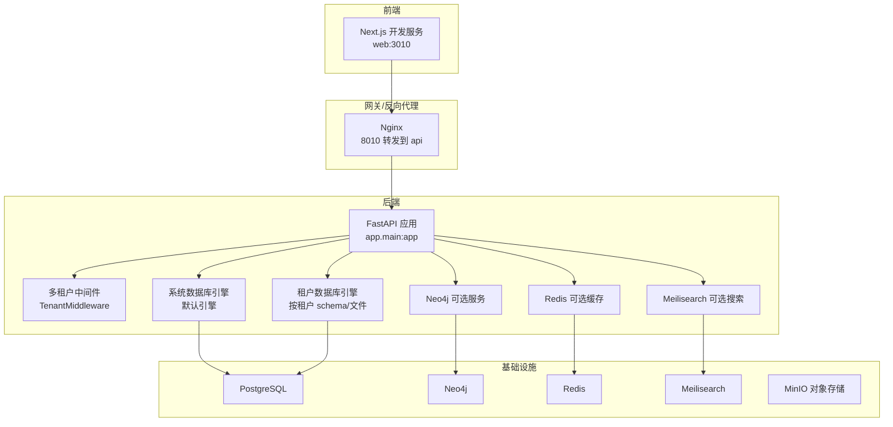
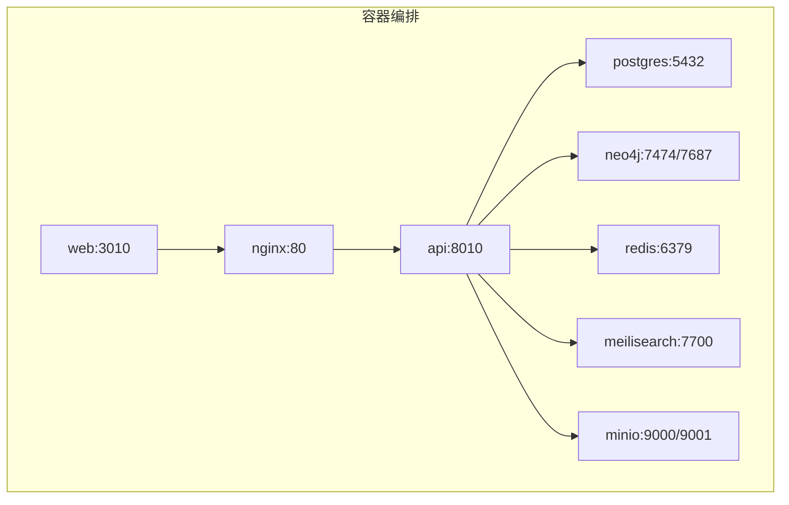
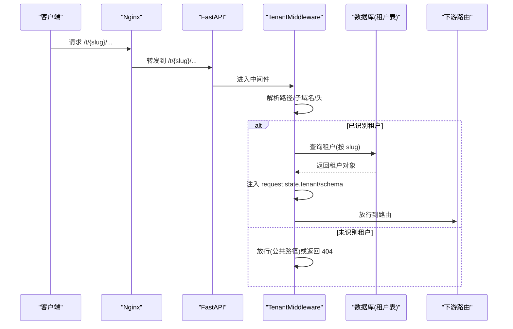
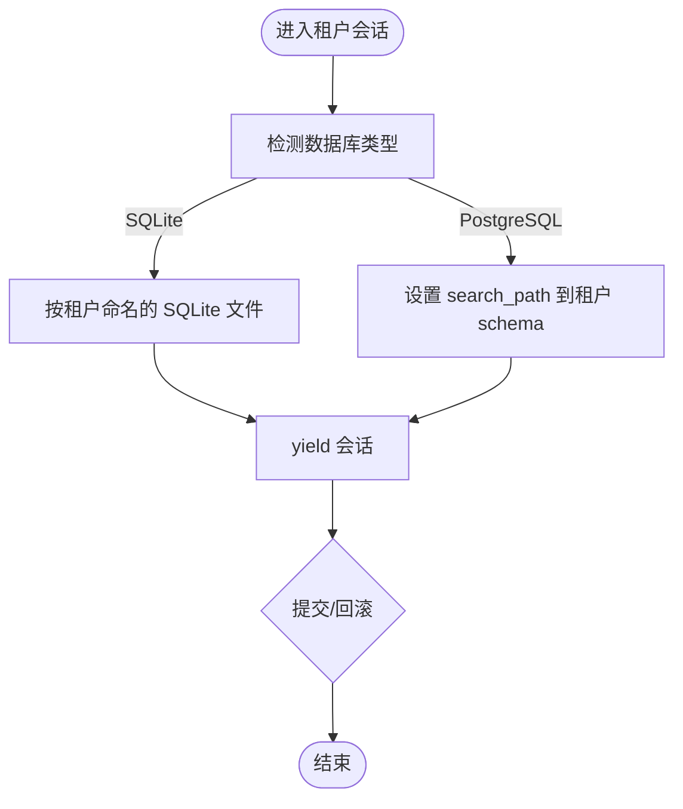
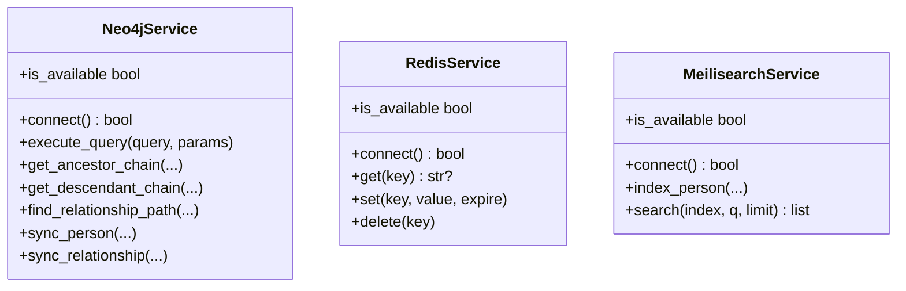
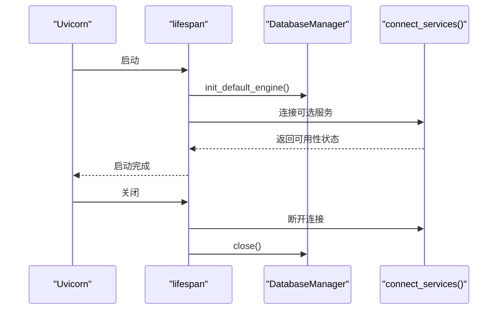
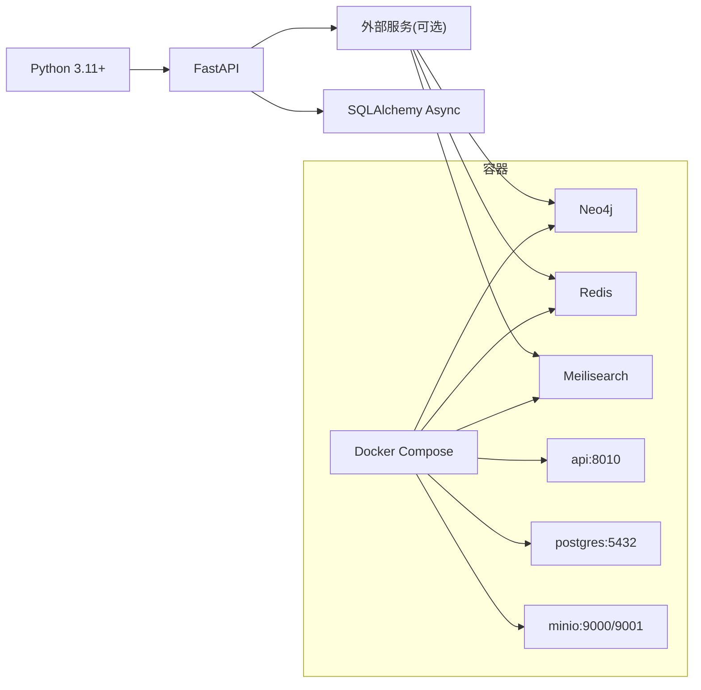

# 性能监控与分析

<cite>
**本文引用的文件**
- [backend/app/main.py](file://backend/app/main.py)
- [backend/app/core/config.py](file://backend/app/core/config.py)
- [backend/app/core/database.py](file://backend/app/core/database.py)
- [backend/app/core/services.py](file://backend/app/core/services.py)
- [backend/app/middleware/tenant.py](file://backend/app/middleware/tenant.py)
- [backend/app/api/v1/endpoints/tenants.py](file://backend/app/api/v1/endpoints/tenants.py)
- [backend/pyproject.toml](file://backend/pyproject.toml)
- [docker-compose.yml](file://docker-compose.yml)
- [docker/prometheus/prometheus.yml](file://docker/prometheus/prometheus.yml)
- [docker/nginx/nginx.conf](file://docker/nginx/nginx.conf)
</cite>

## 目录
1. [引言](#引言)
2. [项目结构](#项目结构)
3. [核心组件](#核心组件)
4. [架构总览](#架构总览)
5. [详细组件分析](#详细组件分析)
6. [依赖分析](#依赖分析)
7. [性能考虑](#性能考虑)
8. [故障排查指南](#故障排查指南)
9. [结论](#结论)
10. [附录](#附录)

## 引言
本文件面向多租户基因谱系系统的性能监控与分析，围绕应用性能管理（APM）工具配置、关键性能指标（KPI）、性能分析方法论、监控告警机制、日志与调试技巧以及性能测试策略展开。文档以代码库为依据，结合现有中间件、数据库与外部服务集成点，给出可落地的监控与优化建议。

## 项目结构
后端采用 FastAPI 应用，通过中间件实现多租户上下文注入；数据库层支持 SQLite/PostgreSQL 并提供多租户会话管理；外部服务（Neo4j、Redis、Meilisearch）采用可选连接模式，失败时提供降级能力；容器编排使用 Docker Compose，包含数据库、图数据库、缓存、搜索引擎与对象存储等基础设施。

图表来源
- [docker-compose.yml:90-114](file://docker-compose.yml#L90-L114)
- [backend/app/main.py:45-88](file://backend/app/main.py#L45-L88)
- [backend/app/middleware/tenant.py:15-84](file://backend/app/middleware/tenant.py#L15-L84)
- [backend/app/core/database.py:24-106](file://backend/app/core/database.py#L24-L106)
- [backend/app/core/services.py:268-284](file://backend/app/core/services.py#L268-L284)

章节来源
- [docker-compose.yml:1-145](file://docker-compose.yml#L1-L145)
- [backend/app/main.py:17-43](file://backend/app/main.py#L17-L43)

## 核心组件
- 应用生命周期与健康检查：应用启动/关闭阶段初始化数据库引擎、连接可选服务并打印状态；提供 /health 健康检查端点，返回服务可用性概览。
- 多租户中间件：从请求路径、子域名或自定义头提取租户标识，加载租户信息并注入请求上下文；对公开路径放行。
- 数据库管理器：统一管理默认引擎与按租户创建的引擎/会话；SQLite 使用独立文件隔离，PostgreSQL 使用 schema 隔离；提供租户会话上下文。
- 外部服务管理：Neo4j、Redis、Meilisearch 采用单例懒加载连接，失败时降级并输出提示；提供查询/索引/缓存等基础操作封装。
- 配置中心：集中管理数据库、缓存、搜索引擎、CORS、JWT 等参数；支持环境变量覆盖。

章节来源
- [backend/app/main.py:17-43](file://backend/app/main.py#L17-L43)
- [backend/app/middleware/tenant.py:15-84](file://backend/app/middleware/tenant.py#L15-L84)
- [backend/app/core/database.py:24-106](file://backend/app/core/database.py#L24-L106)
- [backend/app/core/services.py:9-140](file://backend/app/core/services.py#L9-L140)
- [backend/app/core/config.py:11-89](file://backend/app/core/config.py#L11-L89)

## 架构总览
下图展示应用在容器化环境中的运行关系，以及与外部服务的交互路径。该视图用于指导监控目标的选取与指标采集范围。

图表来源
- [docker-compose.yml:4-114](file://docker-compose.yml#L4-L114)

## 详细组件分析

### 组件A：多租户中间件与请求链路
- 功能要点
  - 租户识别顺序：URL 路径前缀、子域名、自定义头。
  - 公开路径放行，避免对注册、认证、管理等接口施加租户约束。
  - 将租户对象与 schema 名称注入请求上下文，供后续路由与数据访问使用。
- 性能影响
  - 每次请求均需解析路径/头并查询租户表，应确保租户表索引与查询高效。
  - 对公共路径放行可减少不必要的数据库访问。
- 监控建议
  - 记录租户识别命中率与耗时分布。
  - 统计未识别租户的请求比例，定位路由配置问题。
  - 观察租户活跃度与禁用状态导致的 404/403 比例。

图表来源
- [backend/app/middleware/tenant.py:39-84](file://backend/app/middleware/tenant.py#L39-L84)
- [backend/app/middleware/tenant.py:93-125](file://backend/app/middleware/tenant.py#L93-L125)

章节来源
- [backend/app/middleware/tenant.py:15-84](file://backend/app/middleware/tenant.py#L15-L84)
- [backend/app/api/v1/endpoints/tenants.py:45-88](file://backend/app/api/v1/endpoints/tenants.py#L45-L88)

### 组件B：数据库引擎与租户会话
- 功能要点
  - 默认引擎：根据数据库类型选择连接池参数或 SQLite 特性。
  - 多租户引擎：SQLite 按租户 schema 创建独立文件；PostgreSQL 使用 schema 隔离。
  - 会话上下文：在非 SQLite 场景设置 search_path，确保查询落在正确 schema。
- 性能影响
  - 连接池大小直接影响并发处理能力；SQLite 不支持连接池，需通过文件级隔离与并发控制规避竞争。
  - search_path 设置为每次查询带来额外开销，应评估是否需要在高频路径中缓存或减少切换。
- 监控建议
  - 连接池使用率、等待时间、超时次数。
  - 每个租户的查询延迟分布与慢查询统计。
  - SQLite 文件锁争用与磁盘 I/O 指标。

图表来源
- [backend/app/core/database.py:136-171](file://backend/app/core/database.py#L136-L171)

章节来源
- [backend/app/core/database.py:24-106](file://backend/app/core/database.py#L24-L106)
- [backend/app/core/database.py:136-171](file://backend/app/core/database.py#L136-L171)

### 组件C：外部服务（可选）与降级策略
- 功能要点
  - Neo4j：图查询能力，不可用时返回空结果并提示降级。
  - Redis：缓存读写，不可用时跳过缓存逻辑。
  - Meilisearch：全文检索，不可用时回退到 SQL LIKE。
- 性能影响
  - 外部服务可用性直接影响查询性能与功能完整性。
  - 降级路径通常意味着额外的 SQL 执行，可能放大数据库压力。
- 监控建议
  - 各服务可用性与延迟指标。
  - 降级触发频率与比例，定位服务稳定性问题。
  - 图/缓存/搜索查询的 P95/P99 延迟与错误率。

图表来源
- [backend/app/core/services.py:9-140](file://backend/app/core/services.py#L9-L140)
- [backend/app/core/services.py:142-200](file://backend/app/core/services.py#L142-L200)
- [backend/app/core/services.py:201-260](file://backend/app/core/services.py#L201-L260)

章节来源
- [backend/app/core/services.py:268-284](file://backend/app/core/services.py#L268-L284)

### 组件D：应用生命周期与健康检查
- 功能要点
  - 应用启动：初始化默认引擎、连接可选服务并打印状态。
  - 应用关闭：释放外部服务与数据库连接。
  - /health：返回服务可用性概览（数据库、Neo4j、Redis、搜索）。
- 监控建议
  - 启动/关闭耗时与异常堆栈。
  - /health 的可用性指标与响应时间。

图表来源
- [backend/app/main.py:17-43](file://backend/app/main.py#L17-L43)
- [backend/app/main.py:73-86](file://backend/app/main.py#L73-L86)

章节来源
- [backend/app/main.py:17-43](file://backend/app/main.py#L17-L43)
- [backend/app/main.py:73-86](file://backend/app/main.py#L73-L86)

## 依赖分析
- 语言与框架
  - Python 3.11+，FastAPI、SQLAlchemy 异步、异步 Redis/Neo4j/Meilisearch 客户端。
- 外部依赖
  - PostgreSQL/SQLite、Neo4j、Redis、Meilisearch、MinIO、Nginx。
- 监控与可观测性
  - Prometheus 抓取配置已定义，目标包括 API、Postgres Exporter、Redis Exporter、Nginx Exporter。

图表来源
- [backend/pyproject.toml:7-25](file://backend/pyproject.toml#L7-L25)
- [docker-compose.yml:4-114](file://docker-compose.yml#L4-L114)

章节来源
- [backend/pyproject.toml:1-61](file://backend/pyproject.toml#L1-L61)
- [docker/prometheus/prometheus.yml:12-32](file://docker/prometheus/prometheus.yml#L12-L32)

## 性能考虑
- 连接池与并发
  - PostgreSQL 使用连接池参数，SQLite 无连接池，需通过文件与并发控制保障一致性。
  - 建议根据峰值 QPS 与平均事务时长估算最大连接数，避免连接池耗尽。
- 多租户隔离
  - SQLite 模式下每租户独立文件，注意磁盘空间与文件句柄上限。
  - PostgreSQL 模式下通过 search_path 隔离，避免跨租户数据污染。
- 可选服务降级
  - 在外部服务不可用时，确保降级路径不会引发级联失败；对降级路径进行限流与熔断。
- 缓存策略
  - Redis 可显著降低重复查询成本；对热点数据设置合理 TTL，避免缓存穿透。
- 索引与查询
  - 租户表按 slug 建立唯一索引；对常用过滤字段建立复合索引。
  - 分页查询需限制 page_size，避免大偏移导致的性能退化。

## 故障排查指南
- 健康检查
  - 通过 /health 快速判断数据库、Neo4j、Redis、Meilisearch 的可用性。
- 日志与追踪
  - Nginx 提供访问日志格式，可用于入口层的请求统计与异常识别。
  - 应用层建议增加结构化日志，包含请求 ID、租户 ID、路由、耗时、错误码。
- 常见问题
  - 租户未找到/禁用：检查租户中间件的识别逻辑与数据库状态。
  - 外部服务超时：查看连接状态与延迟，必要时启用熔断与重试。
  - 数据库连接不足：调整连接池参数或优化慢查询。

章节来源
- [backend/app/main.py:73-86](file://backend/app/main.py#L73-L86)
- [docker/nginx/nginx.conf:16-20](file://docker/nginx/nginx.conf#L16-L20)

## 结论
本项目在多租户隔离、可选服务降级与容器化部署方面具备良好基础。建议在现有基础上完善 APM 工具接入、关键指标采集与告警策略，结合性能分析方法论持续优化系统性能与用户体验。

## 附录

### APM 工具配置与监控维度
- 性能监控
  - 指标：请求延迟（P50/P90/P95/P99）、吞吐量（QPS）、连接池使用率、租户查询延迟分布。
  - 采集：Prometheus 抓取 API、Postgres Exporter、Redis Exporter、Nginx Exporter。
- 错误追踪
  - 指标：错误率（4xx/5xx）、异常堆栈、外部服务错误。
  - 建议：在应用层捕获异常并记录上下文，结合追踪 ID 进行关联。
- 事务监控
  - 指标：租户会话耗时、数据库事务耗时、外部服务调用耗时。
  - 建议：对关键路径（租户识别、数据库查询、外部服务调用）埋点。
- 用户体验监控
  - 指标：页面首屏时间、接口响应时间、错误发生率。
  - 建议：前端埋点与后端日志联动，定位用户侧问题。

章节来源
- [docker/prometheus/prometheus.yml:12-32](file://docker/prometheus/prometheus.yml#L12-L32)

### 关键性能指标（KPI）
- 响应时间：接口 P50/P95/P99 延迟，分租户与公共路径对比。
- 吞吐量：每秒请求数（QPS），区分不同端点与租户。
- 错误率：4xx/5xx 比例与异常类型分布。
- 资源利用率：CPU、内存、磁盘 I/O、数据库连接池使用率。
- 业务指标：新增租户数、活跃租户数、搜索命中率、缓存命中率。

### 性能分析方法论
- 瓶颈识别
  - 通过延迟分布与错误率定位热点端点与异常路径。
  - 对比租户间差异，识别异常租户或异常查询。
- 根因分析
  - 结合请求追踪 ID 串联日志，定位数据库慢查询、外部服务超时或缓存失效。
- 趋势分析
  - 基于历史数据观察指标变化趋势，预测容量需求。
- 容量规划
  - 以峰值 QPS、平均事务时长与资源使用率为依据，推导连接池与实例规模。

### 监控告警机制
- 阈值设置
  - 延迟：P95 超过 2s；P99 超过 5s。
  - 错误率：整体错误率超过 1%，特定端点超过 5%。
  - 资源：数据库连接池使用率超过 80%，Redis 内存使用率超过 85%。
- 告警规则
  - 连续 5 分钟内多次触发同一阈值。
  - 业务指标异常波动（如新增租户数骤降）。
- 通知渠道
  - 邮件、即时通讯群组、电话（严重级别）。
- 应急响应
  - 快速降级（禁用可选服务）、扩容实例、回滚变更。

### 日志分析与调试技巧
- 结构化日志
  - 字段：请求 ID、租户 ID、方法/路径、状态码、耗时、用户代理、错误码与消息。
- 分布式追踪
  - 为每个请求生成 Trace ID，贯穿 Nginx、API、数据库与外部服务。
- 性能剖析
  - 使用性能分析工具（如 cProfile 或异步分析器）定位 CPU 密集型函数。
  - 对数据库与外部服务调用增加采样日志，识别慢调用。

### 性能测试策略
- 负载测试
  - 逐步提升并发用户数，观察延迟与错误率变化，识别拐点。
- 压力测试
  - 在极限条件下验证系统稳定性与恢复能力。
- 并发测试
  - 验证多租户场景下的隔离性与一致性。
- 回归测试
  - 将关键性能指标纳入 CI，防止回归。