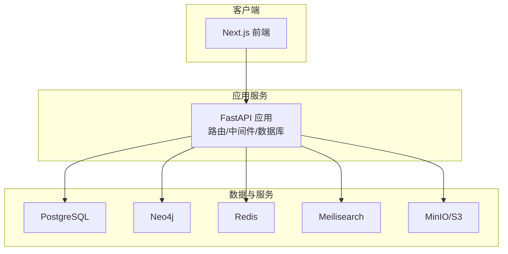
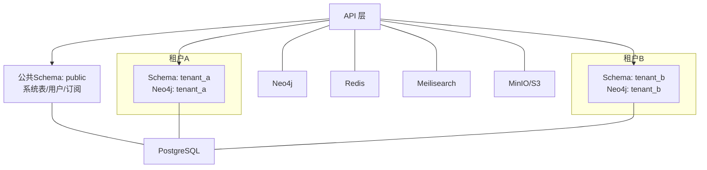
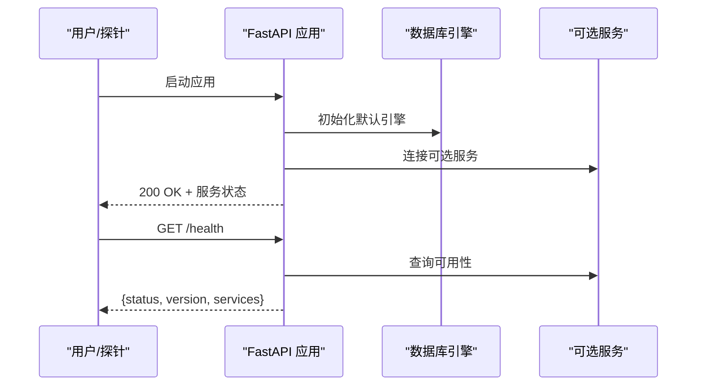
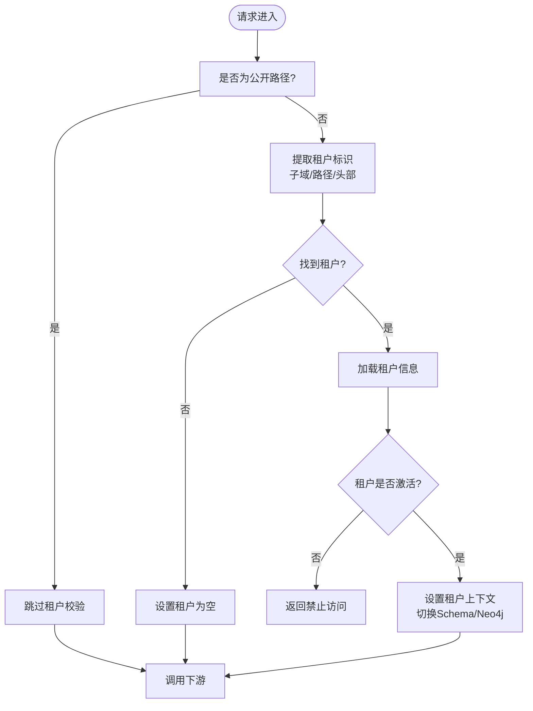
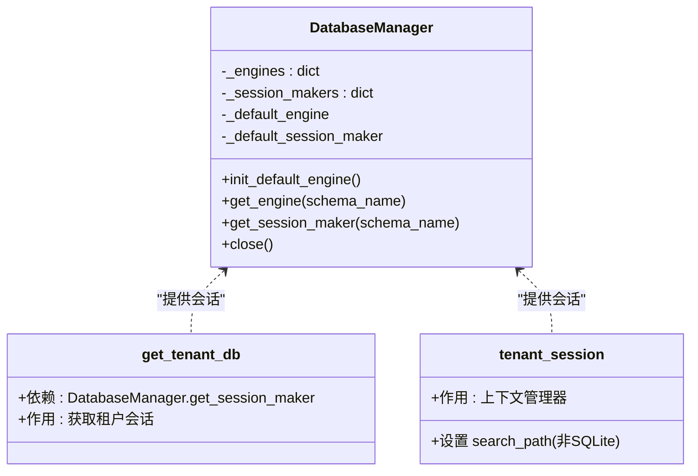
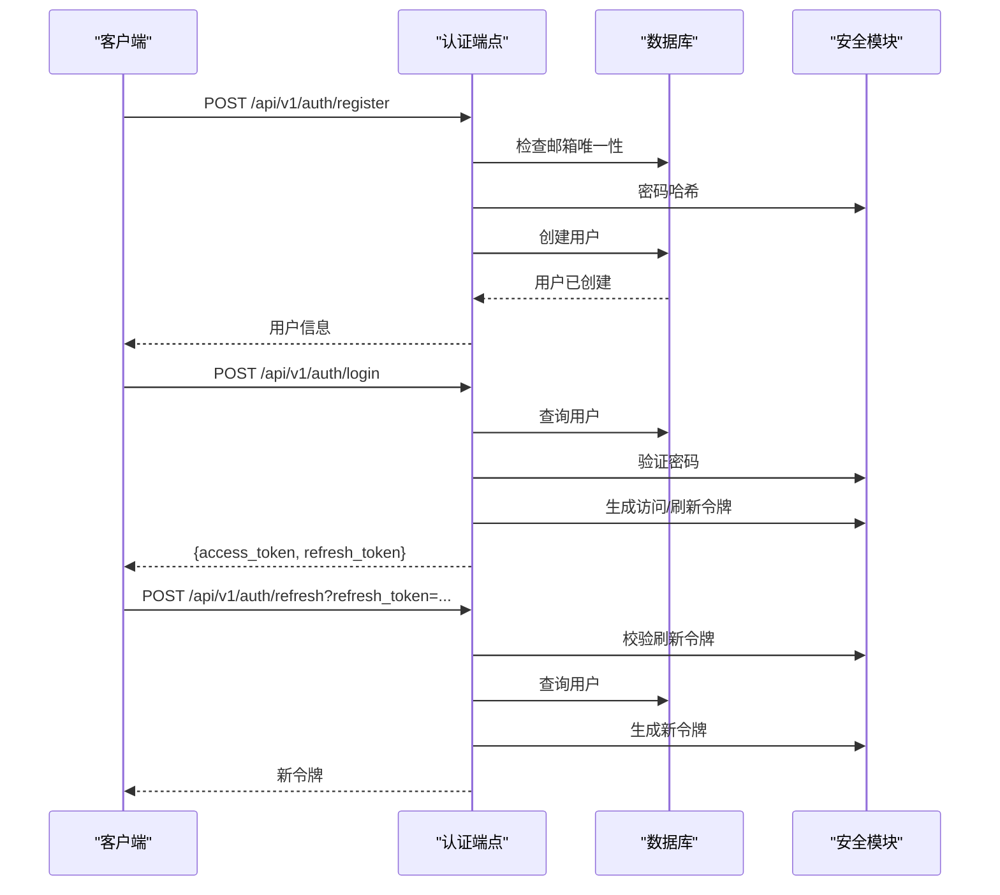
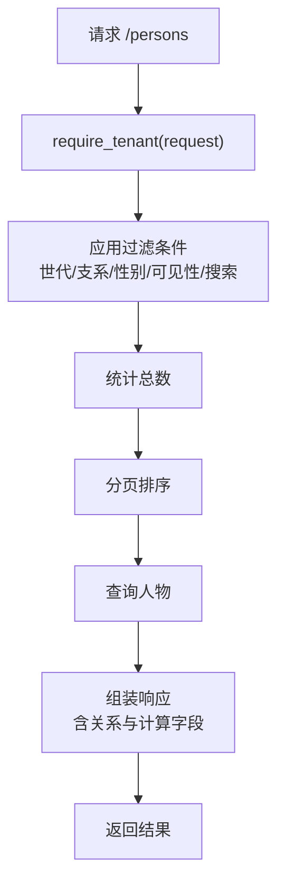
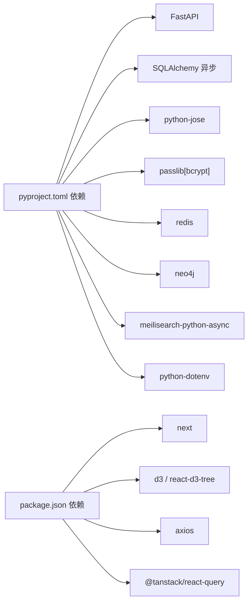

# 最佳实践

<cite>
**本文引用的文件**
- [backend/app/main.py](file://backend/app/main.py)
- [backend/app/core/config.py](file://backend/app/core/config.py)
- [backend/app/core/database.py](file://backend/app/core/database.py)
- [backend/app/middleware/tenant.py](file://backend/app/middleware/tenant.py)
- [backend/app/models/tenant.py](file://backend/app/models/tenant.py)
- [backend/app/api/v1/endpoints/auth.py](file://backend/app/api/v1/endpoints/auth.py)
- [backend/app/api/v1/endpoints/tenants.py](file://backend/app/api/v1/endpoints/tenants.py)
- [backend/app/api/v1/endpoints/persons.py](file://backend/app/api/v1/endpoints/persons.py)
- [backend/app/api/v1/endpoints/family_tree.py](file://backend/app/api/v1/endpoints/family_tree.py)
- [backend/app/core/security.py](file://backend/app/core/security.py)
- [backend/tests/test_auth.py](file://backend/tests/test_auth.py)
- [backend/pyproject.toml](file://backend/pyproject.toml)
- [docker-compose.yml](file://docker-compose.yml)
- [frontend/package.json](file://frontend/package.json)
- [docs/ARCHITECTURE.md](file://docs/ARCHITECTURE.md)
</cite>

## 目录
1. [简介](#简介)
2. [项目结构](#项目结构)
3. [核心组件](#核心组件)
4. [架构总览](#架构总览)
5. [详细组件分析](#详细组件分析)
6. [依赖分析](#依赖分析)
7. [性能考虑](#性能考虑)
8. [故障排查指南](#故障排查指南)
9. [结论](#结论)
10. [附录](#附录)

## 简介
本最佳实践指南面向“多租户族谱管理系统”的开发与维护，结合仓库中 FastAPI 后端、Next.js 前端、容器编排与架构文档，总结经验与教训，覆盖以下方面：
- 代码质量保证：编码规范、测试策略、代码审查标准
- 安全最佳实践：认证授权、数据加密、漏洞防护
- 性能优化：数据库查询、缓存、前端渲染
- 可扩展性：多租户隔离、服务解耦、演进路径
- 团队协作与项目管理：分支策略、CI/CD、文档与评审
- 用户体验与无障碍：交互设计、可访问性、性能指标
- 持续学习与技能发展：技术栈迭代、工具链升级

## 项目结构
系统采用前后端分离与多服务编排：
- 后端：FastAPI 应用，提供多租户 API；通过中间件识别租户上下文；数据库使用 SQLAlchemy 异步 ORM；可选集成 Neo4j、Redis、Meilisearch。
- 前端：Next.js 应用，使用 App Router，组件化构建族谱树与人物管理界面。
- 基础设施：Docker Compose 编排 PostgreSQL、Neo4j、Redis、Meilisearch、MinIO、API 与 Web。

图表来源
- [docker-compose.yml:1-145](file://docker-compose.yml#L1-L145)
- [backend/app/main.py:17-88](file://backend/app/main.py#L17-L88)
- [backend/app/core/database.py:24-121](file://backend/app/core/database.py#L24-L121)

章节来源
- [backend/app/main.py:17-88](file://backend/app/main.py#L17-L88)
- [docker-compose.yml:1-145](file://docker-compose.yml#L1-L145)

## 核心组件
- 应用入口与生命周期：创建 FastAPI 实例、注册中间件、挂载路由、健康检查与服务连接。
- 配置中心：集中管理数据库、缓存、搜索引擎、存储、JWT、CORS 等配置。
- 数据库与会话：统一的数据库管理器，支持 SQLite/PostgreSQL；按租户隔离（Schema 或文件）；提供租户会话上下文。
- 多租户中间件：从子域、路径或请求头提取租户标识，加载租户并切换数据库 Schema/Neo4j 数据库。
- 安全模块：密码哈希、JWT 签发与校验、令牌刷新。
- API 端点：认证、租户管理、人物与族谱树等核心业务接口。
- 测试与工具：pytest 异步测试、Ruff/Lint/Mypy 类型检查与静态分析。

章节来源
- [backend/app/main.py:17-88](file://backend/app/main.py#L17-L88)
- [backend/app/core/config.py:11-89](file://backend/app/core/config.py#L11-L89)
- [backend/app/core/database.py:24-171](file://backend/app/core/database.py#L24-L171)
- [backend/app/middleware/tenant.py:15-142](file://backend/app/middleware/tenant.py#L15-L142)
- [backend/app/core/security.py:16-103](file://backend/app/core/security.py#L16-L103)
- [backend/app/api/v1/endpoints/auth.py:55-179](file://backend/app/api/v1/endpoints/auth.py#L55-L179)
- [backend/app/api/v1/endpoints/tenants.py:45-164](file://backend/app/api/v1/endpoints/tenants.py#L45-L164)
- [backend/app/api/v1/endpoints/persons.py:172-717](file://backend/app/api/v1/endpoints/persons.py#L172-L717)
- [backend/app/api/v1/endpoints/family_tree.py:43-274](file://backend/app/api/v1/endpoints/family_tree.py#L43-L274)
- [backend/tests/test_auth.py:12-149](file://backend/tests/test_auth.py#L12-L149)
- [backend/pyproject.toml:1-61](file://backend/pyproject.toml#L1-L61)

## 架构总览
系统采用“多租户隔离 + 多数据库协同”的架构：
- 多租户隔离：PostgreSQL 使用 Schema 隔离（或 SQLite 每租户独立文件），Neo4j 使用独立数据库，确保数据强隔离。
- 认证与授权：JWT 令牌体系，配合角色与权限矩阵，实现细粒度访问控制。
- 搜索与缓存：Meilisearch 提供全文检索，Redis 提供会话与热点缓存。
- 文件存储：S3 兼容对象存储（MinIO）存放人物图片/视频等媒体资源。
- 前后端分离：前端 Next.js 通过统一 API 路由访问后端能力。

图表来源
- [docs/ARCHITECTURE.md:100-129](file://docs/ARCHITECTURE.md#L100-L129)
- [backend/app/core/database.py:58-96](file://backend/app/core/database.py#L58-L96)
- [backend/app/middleware/tenant.py:15-84](file://backend/app/middleware/tenant.py#L15-L84)

章节来源
- [docs/ARCHITECTURE.md:98-171](file://docs/ARCHITECTURE.md#L98-L171)

## 详细组件分析

### 应用生命周期与健康检查
- 生命周期钩子负责初始化默认引擎、连接可选服务（Neo4j/Redis/Meilisearch），并在关闭时释放资源。
- 健康检查端点返回数据库与可选服务可用性状态，便于运维监控。

图表来源
- [backend/app/main.py:17-42](file://backend/app/main.py#L17-L42)
- [backend/app/main.py:72-86](file://backend/app/main.py#L72-L86)

章节来源
- [backend/app/main.py:17-88](file://backend/app/main.py#L17-L88)

### 多租户中间件与租户上下文
- 识别顺序：子域 → 路径 → 请求头；对公开路径（认证、租户管理、健康检查等）跳过租户校验。
- 加载租户后设置租户上下文，切换数据库 Schema（或 SQLite 文件），以及 Neo4j 数据库。
- 提供获取当前租户与强制校验租户的辅助方法。

图表来源
- [backend/app/middleware/tenant.py:39-84](file://backend/app/middleware/tenant.py#L39-L84)
- [backend/app/middleware/tenant.py:93-125](file://backend/app/middleware/tenant.py#L93-L125)

章节来源
- [backend/app/middleware/tenant.py:15-142](file://backend/app/middleware/tenant.py#L15-L142)

### 数据库与租户会话
- 默认引擎与会话工厂：根据数据库类型（SQLite/PostgreSQL）选择不同参数；SQLite 不支持连接池。
- 按租户获取引擎与会话：PostgreSQL 使用 Schema 隔离；SQLite 为每租户独立数据库文件。
- 提供租户会话上下文，自动设置 search_path（非 SQLite）并处理事务提交/回滚。

图表来源
- [backend/app/core/database.py:24-121](file://backend/app/core/database.py#L24-L121)
- [backend/app/core/database.py:136-171](file://backend/app/core/database.py#L136-L171)

章节来源
- [backend/app/core/database.py:24-171](file://backend/app/core/database.py#L24-L171)

### 认证与授权流程
- 注册：邮箱唯一性校验，密码哈希后创建用户。
- 登录：验证凭据，更新最近登录时间，签发访问/刷新令牌。
- 刷新：校验刷新令牌，重新签发新令牌。
- 令牌校验：解码 JWT，区分访问/刷新类型。

图表来源
- [backend/app/api/v1/endpoints/auth.py:55-179](file://backend/app/api/v1/endpoints/auth.py#L55-L179)
- [backend/app/core/security.py:26-103](file://backend/app/core/security.py#L26-L103)

章节来源
- [backend/app/api/v1/endpoints/auth.py:55-179](file://backend/app/api/v1/endpoints/auth.py#L55-L179)
- [backend/app/core/security.py:16-103](file://backend/app/core/security.py#L16-L103)

### 人物与族谱树 API
- 人物管理：分页、过滤、搜索、父子/配偶关系维护。
- 族谱树：从根节点或最早祖先构建树，支持深度限制；提供祖先链与后代树。
- 数据模型：人物、世代、支系、配偶关系、变更日志等。

图表来源
- [backend/app/api/v1/endpoints/persons.py:172-235](file://backend/app/api/v1/endpoints/persons.py#L172-L235)
- [backend/app/middleware/tenant.py:133-141](file://backend/app/middleware/tenant.py#L133-L141)

章节来源
- [backend/app/api/v1/endpoints/persons.py:172-717](file://backend/app/api/v1/endpoints/persons.py#L172-L717)
- [backend/app/models/tenant.py:61-244](file://backend/app/models/tenant.py#L61-L244)

### 租户管理 API
- 列表与详情：公开租户列表与详情，支持按姓氏筛选。
- 创建租户：生成 schema 名称与 Neo4j 数据库名，预留后续迁移与初始化步骤。

章节来源
- [backend/app/api/v1/endpoints/tenants.py:45-164](file://backend/app/api/v1/endpoints/tenants.py#L45-L164)

### 前端与可视化
- 前端依赖：Next.js、React、TanStack React Query、Axios、Zustand、D3/React-D3-Tree 等。
- 族谱树组件：基于 react-d3-tree，支持拖拽、缩放、点击节点导航。

章节来源
- [frontend/package.json:12-44](file://frontend/package.json#L12-L44)

## 依赖分析
- 后端依赖：FastAPI、SQLAlchemy 异步、Pydantic/Settings、JWT、Passlib、Redis、Neo4j、Meilisearch、dotenv 等。
- 工具链：Ruff Lint、Mypy 类型检查、pytest 异步测试、pytest-cov 覆盖率。
- 前端依赖：Next.js、D3、React Query、Tailwind 等。

图表来源
- [backend/pyproject.toml:7-25](file://backend/pyproject.toml#L7-L25)
- [frontend/package.json:12-44](file://frontend/package.json#L12-L44)

章节来源
- [backend/pyproject.toml:1-61](file://backend/pyproject.toml#L1-L61)
- [frontend/package.json:1-45](file://frontend/package.json#L1-L45)

## 性能考虑
- 数据库查询优化
  - 使用分页与有序查询，避免一次性拉取大量数据。
  - 在人物列表中按 generation_id/sort_order 排序，减少前端二次排序成本。
  - 对常用过滤字段建立索引（建议在迁移脚本中补充）。
- 缓存策略
  - 使用 Redis 缓存热点查询（如人物详情、统计信息）与会话数据。
  - 对族谱树根节点与深度组合进行缓存，降低重复计算。
- 前端性能提升
  - 仅在需要时加载 D3/Tree 组件，使用 Suspense 与骨架屏。
  - 对树节点懒加载，限制渲染深度，避免大规模 DOM。
  - 使用 React Query 的查询去重与本地缓存，减少重复请求。
- 可选服务
  - Meilisearch 用于全文检索，建议预建索引与分词配置。
  - Neo4j 适合复杂关系查询，注意 Cypher 查询优化与索引。

章节来源
- [backend/app/api/v1/endpoints/persons.py:187-222](file://backend/app/api/v1/endpoints/persons.py#L187-L222)
- [backend/app/api/v1/endpoints/family_tree.py:43-149](file://backend/app/api/v1/endpoints/family_tree.py#L43-L149)
- [docker-compose.yml:58-69](file://docker-compose.yml#L58-L69)

## 故障排查指南
- 认证失败
  - 检查邮箱是否已注册、密码是否正确、账户是否启用。
  - 校验 JWT 密钥与算法配置，确认刷新令牌有效。
- 租户不可用
  - 确认租户 slug 正确、租户处于激活状态、中间件已正确设置租户上下文。
  - 检查数据库 Schema/SQLite 文件是否存在，Neo4j 数据库是否创建。
- 数据库连接异常
  - 核对 DATABASE_URL、池大小与溢出配置；SQLite 不支持池参数。
- 健康检查
  - 通过 /health 端点确认数据库、可选服务可用性；若不可用，检查对应容器状态与日志。

章节来源
- [backend/app/api/v1/endpoints/auth.py:94-123](file://backend/app/api/v1/endpoints/auth.py#L94-L123)
- [backend/app/middleware/tenant.py:48-83](file://backend/app/middleware/tenant.py#L48-L83)
- [backend/app/core/database.py:33-56](file://backend/app/core/database.py#L33-L56)
- [backend/app/main.py:72-86](file://backend/app/main.py#L72-L86)

## 结论
本项目以多租户为核心，采用清晰的分层与隔离策略，结合 FastAPI 的高性能与 Next.js 的现代化前端体验，具备良好的可扩展性与可维护性。建议在后续迭代中完善权限矩阵、增强审计日志、补齐索引与缓存策略，并持续优化前端交互与可访问性。

## 附录

### 代码质量保证最佳实践
- 编码规范
  - 使用 Ruff 进行 Lint，统一风格与规则；Mypy 进行类型检查，提升可读性与稳定性。
  - Pydantic 模型用于输入输出校验，确保接口契约清晰。
- 测试覆盖率
  - pytest 异步测试覆盖认证流程；建议逐步扩展至人物、族谱树、租户管理等模块。
  - 使用 fixtures 管理测试数据与会话，保持测试隔离。
- 代码审查标准
  - 关注安全性（密码哈希、令牌校验）、健壮性（异常处理、边界条件）、可维护性（模块拆分、错误码统一）。

章节来源
- [backend/pyproject.toml:45-61](file://backend/pyproject.toml#L45-L61)
- [backend/tests/test_auth.py:12-149](file://backend/tests/test_auth.py#L12-L149)

### 安全最佳实践
- 身份认证与授权
  - 使用 JWT 令牌，短有效期访问令牌 + 长效刷新令牌；刷新令牌单独校验。
  - 建议引入基于角色的权限矩阵与细粒度资源授权。
- 数据加密与传输
  - 生产环境使用 HTTPS；敏感配置通过环境变量注入；数据库连接使用 SSL。
- 漏洞防护
  - 输入校验与长度限制；SQL 注入防护（使用 ORM/参数化查询）；XSS/CSRF 防护（CORS 与 CSRF 中间件）。

章节来源
- [backend/app/core/security.py:26-103](file://backend/app/core/security.py#L26-L103)
- [backend/app/core/config.py:53-80](file://backend/app/core/config.py#L53-L80)

### 可扩展性设计与架构演进
- 多租户演进
  - 从 Schema 隔离过渡到独立数据库/实例，结合读写分离与备份策略。
  - 引入租户配额与计费系统，配合订阅表与用量监控。
- 服务解耦
  - 将搜索、缓存、文件服务下沉为独立服务，通过 API 或消息队列交互。
  - 引入异步任务（消息队列）处理大数据导入与导出。

章节来源
- [docs/ARCHITECTURE.md:98-171](file://docs/ARCHITECTURE.md#L98-L171)

### 团队协作与项目管理
- 分支策略
  - 主干保护 + Feature 分支 + Pull Request + 代码审查。
- CI/CD
  - 使用 GitHub Actions（仓库已提供工作流文件）进行自动化测试与构建。
- 文档与评审
  - 架构文档与 API 文档同步更新；定期进行技术评审与风险评估。

章节来源
- [.github/workflows/ci-cd.yml](file://.github/workflows/ci-cd.yml)
- [docs/ARCHITECTURE.md:1-800](file://docs/ARCHITECTURE.md#L1-L800)

### 用户体验与无障碍
- 交互设计
  - 族谱树支持拖拽、缩放、点击查看详情；提供加载骨架屏与错误提示。
- 可访问性
  - 为图像提供替代文本；键盘可导航；高对比度与字体大小调整。
- 性能指标
  - 关注首屏渲染时间、交互延迟与树节点渲染帧率，持续优化。

章节来源
- [frontend/package.json:12-44](file://frontend/package.json#L12-L44)

### 持续学习与技能发展
- 技术栈迭代
  - 关注 FastAPI/SQLAlchemy/Next.js 生态的新版本特性与最佳实践。
- 工具链升级
  - 持续改进 Lint/Mypy/测试策略，提升交付质量与效率。
- 学习路径
  - 多租户架构、图数据库应用、前端可视化与性能优化专题研读。