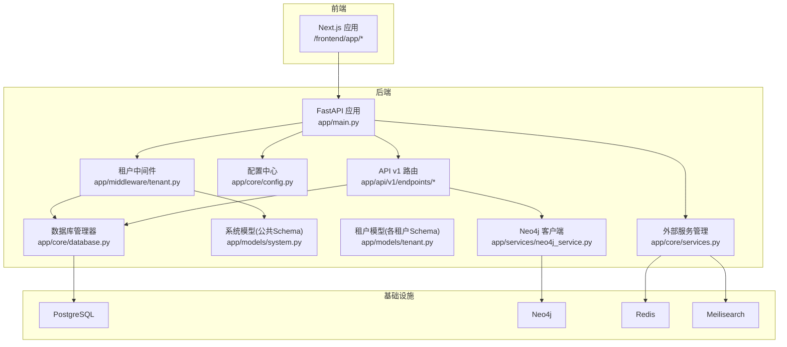
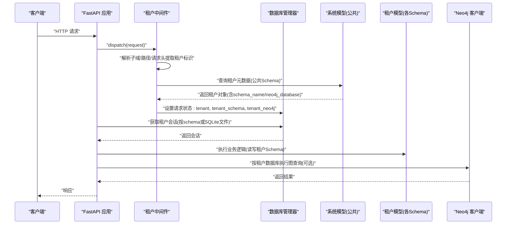
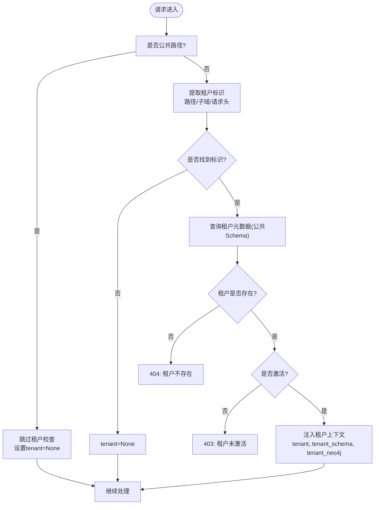
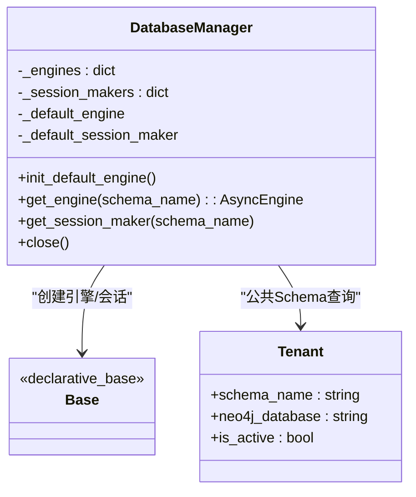
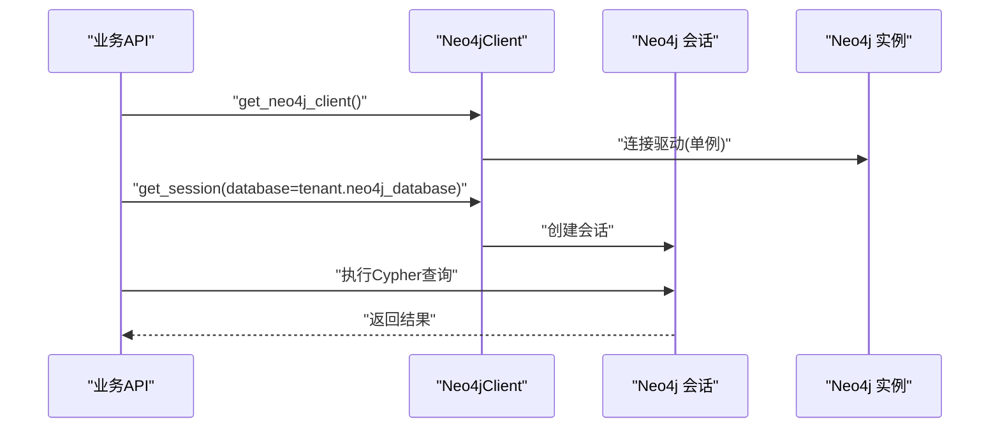
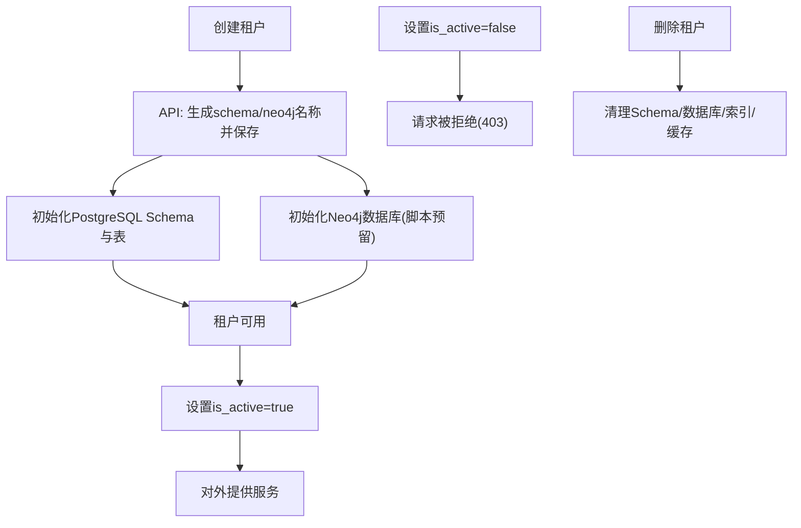
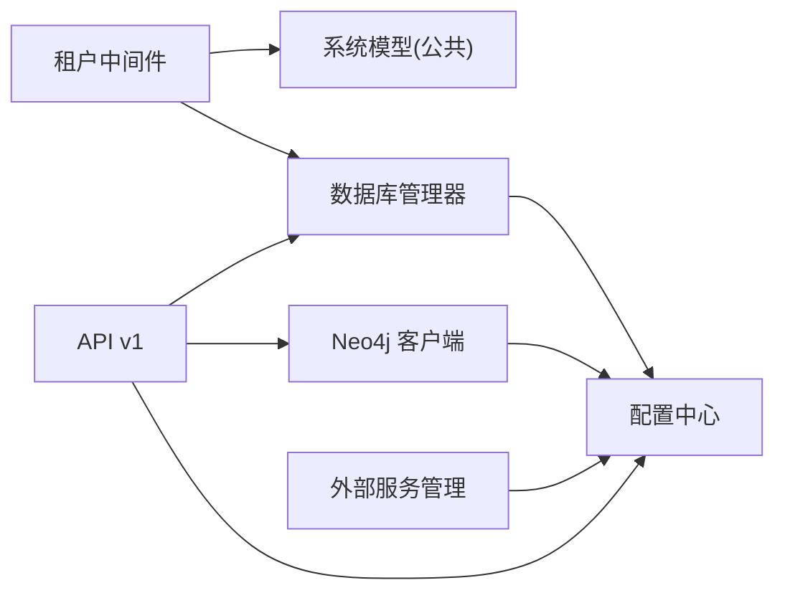

# 多租户架构设计

<cite>
**本文档引用的文件**
- [backend/app/middleware/tenant.py](file://backend/app/middleware/tenant.py)
- [backend/app/models/system.py](file://backend/app/models/system.py)
- [backend/app/models/tenant.py](file://backend/app/models/tenant.py)
- [backend/app/core/database.py](file://backend/app/core/database.py)
- [backend/app/core/config.py](file://backend/app/core/config.py)
- [backend/app/main.py](file://backend/app/main.py)
- [backend/app/api/v1/endpoints/tenants.py](file://backend/app/api/v1/endpoints/tenants.py)
- [backend/app/services/neo4j_service.py](file://backend/app/services/neo4j_service.py)
- [backend/app/core/services.py](file://backend/app/core/services.py)
- [backend/scripts/create_tenant.py](file://backend/scripts/create_tenant.py)
- [docker-compose.yml](file://docker-compose.yml)
- [backend/tests/test_tenants.py](file://backend/tests/test_tenants.py)
</cite>

## 目录
1. [引言](#引言)
2. [项目结构](#项目结构)
3. [核心组件](#核心组件)
4. [架构总览](#架构总览)
5. [详细组件分析](#详细组件分析)
6. [依赖关系分析](#依赖关系分析)
7. [性能考虑](#性能考虑)
8. [故障排查指南](#故障排查指南)
9. [结论](#结论)
10. [附录](#附录)

## 引言
本设计文档面向“多租户族谱管理系统”，围绕租户隔离策略（PostgreSQL Schema 隔离与 Neo4j 数据库隔离）、租户识别机制（子域、URL 路径、请求头）、租户中间件工作原理（租户信息提取、数据库连接切换、会话管理）、租户生命周期管理（创建、激活、停用、删除）以及租户配置与资源配额控制进行系统化阐述。文档同时提供架构图、序列图与流程图，帮助读者从高层到代码级全面理解系统。

## 项目结构
后端采用 FastAPI + SQLAlchemy Async + Neo4j 的技术栈，前端使用 Next.js。系统通过中间件在请求入口处解析租户上下文，随后根据租户上下文选择对应的数据库 Schema 或 Neo4j 数据库执行业务逻辑。外部服务（Redis、Meilisearch、Neo4j）以可选方式接入，具备优雅降级能力。

图表来源
- [backend/app/main.py:45-92](file://backend/app/main.py#L45-L92)
- [backend/app/middleware/tenant.py:15-84](file://backend/app/middleware/tenant.py#L15-L84)
- [backend/app/core/database.py:24-121](file://backend/app/core/database.py#L24-L121)
- [backend/app/models/system.py:23-71](file://backend/app/models/system.py#L23-L71)
- [backend/app/models/tenant.py:23-244](file://backend/app/models/tenant.py#L23-L244)
- [backend/app/services/neo4j_service.py:12-53](file://backend/app/services/neo4j_service.py#L12-L53)
- [backend/app/core/services.py:9-285](file://backend/app/core/services.py#L9-L285)

章节来源
- [backend/app/main.py:17-43](file://backend/app/main.py#L17-L43)
- [docker-compose.yml:1-145](file://docker-compose.yml#L1-L145)

## 核心组件
- 租户中间件：负责从请求中提取租户标识（子域/路径/请求头），加载租户元数据，设置请求状态中的租户上下文（Schema 名称与 Neo4j 数据库名）。
- 数据库管理器：按租户 Schema 动态创建/复用引擎与会话；对 SQLite 使用独立文件模拟多租户，对 PostgreSQL 使用 SET search_path 切换 Schema。
- 系统模型与租户模型：系统层（公共 Schema）存储租户元数据与用户关系；租户层（各租户 Schema）存储族谱数据。
- Neo4j 客户端：按租户数据库名执行图查询；提供可选服务封装与降级策略。
- 外部服务管理：对可选服务（Redis、Meilisearch、Neo4j）进行连接与可用性检查，失败时提供降级提示。
- 租户 API：提供租户列表、详情、创建等接口；创建接口预留了 PostgreSQL Schema 与 Neo4j 数据库初始化位置。
- CLI 脚本：用于创建租户 Schema、初始化表结构、创建 Neo4j 数据库（当前为占位，实际部署需完善）。

章节来源
- [backend/app/middleware/tenant.py:15-142](file://backend/app/middleware/tenant.py#L15-L142)
- [backend/app/core/database.py:24-171](file://backend/app/core/database.py#L24-L171)
- [backend/app/models/system.py:23-223](file://backend/app/models/system.py#L23-L223)
- [backend/app/models/tenant.py:23-244](file://backend/app/models/tenant.py#L23-L244)
- [backend/app/services/neo4j_service.py:12-373](file://backend/app/services/neo4j_service.py#L12-L373)
- [backend/app/core/services.py:9-285](file://backend/app/core/services.py#L9-L285)
- [backend/app/api/v1/endpoints/tenants.py:17-164](file://backend/app/api/v1/endpoints/tenants.py#L17-L164)
- [backend/scripts/create_tenant.py:18-282](file://backend/scripts/create_tenant.py#L18-L282)

## 架构总览
系统通过中间件在请求进入时确定租户上下文，随后所有数据库操作均基于该上下文选择正确的 Schema 或数据库。外部服务以可选方式增强功能，未就绪时提供降级提示。

图表来源
- [backend/app/middleware/tenant.py:39-84](file://backend/app/middleware/tenant.py#L39-L84)
- [backend/app/core/database.py:136-171](file://backend/app/core/database.py#L136-L171)
- [backend/app/models/system.py:23-71](file://backend/app/models/system.py#L23-L71)
- [backend/app/services/neo4j_service.py:56-60](file://backend/app/services/neo4j_service.py#L56-L60)

## 详细组件分析

### 租户中间件
- 租户识别顺序：URL 路径前缀 /t/{slug}/ → 子域（排除 www/api/admin/app）→ 请求头 X-Tenant-ID。
- 公共路径豁免：健康检查、认证、租户列表、管理端等无需租户上下文。
- 租户校验：存在性与激活状态检查；不存在返回 404，未激活返回 403。
- 上下文注入：request.state.tenant、request.state.tenant_schema、request.state.tenant_neo4j。

图表来源
- [backend/app/middleware/tenant.py:25-84](file://backend/app/middleware/tenant.py#L25-L84)
- [backend/app/middleware/tenant.py:93-114](file://backend/app/middleware/tenant.py#L93-L114)
- [backend/app/middleware/tenant.py:116-125](file://backend/app/middleware/tenant.py#L116-L125)

章节来源
- [backend/app/middleware/tenant.py:15-142](file://backend/app/middleware/tenant.py#L15-L142)

### 数据库与 Schema 隔离
- 默认引擎：公共 Schema 使用默认引擎；SQLite 情况下每个租户使用独立 SQLite 文件。
- PostgreSQL：按租户 schema_name 创建异步引擎与会话；每次租户会话建立时执行 SET search_path TO {schema_name}。
- 会话管理：提供 get_tenant_db 与 tenant_session 两种租户会话获取方式，均在异常时回滚并抛出。

图表来源
- [backend/app/core/database.py:24-121](file://backend/app/core/database.py#L24-L121)
- [backend/app/models/system.py:23-71](file://backend/app/models/system.py#L23-L71)

章节来源
- [backend/app/core/database.py:24-171](file://backend/app/core/database.py#L24-L171)

### Neo4j 图数据库隔离
- 客户端：按租户 neo4j_database 参数打开会话，执行节点与关系创建、查询等。
- 可选服务：通过服务管理器连接 Neo4j，失败时提供降级提示；应用仍可运行但图功能受限。
- 查询示例：祖先/后代/兄弟/配偶查询、按代际检索、名称模糊搜索、树形结构导出、统计查询。

图表来源
- [backend/app/services/neo4j_service.py:56-60](file://backend/app/services/neo4j_service.py#L56-L60)
- [backend/app/services/neo4j_service.py:35-39](file://backend/app/services/neo4j_service.py#L35-L39)
- [backend/app/core/services.py:21-61](file://backend/app/core/services.py#L21-L61)

章节来源
- [backend/app/services/neo4j_service.py:12-373](file://backend/app/services/neo4j_service.py#L12-L373)
- [backend/app/core/services.py:9-285](file://backend/app/core/services.py#L9-L285)

### 租户识别机制对比与适用场景
- 子域（tenant.example.com）
  - 优点：天然隔离、便于 DNS/CDN 缓存、利于品牌化。
  - 缺点：需要额外域名与证书、DNS 配置复杂。
  - 适用：生产环境、多品牌、高并发。
- URL 路径（/t/{slug}/...）
  - 优点：无需额外域名、部署简单。
  - 缺点：URL 较长、SEO 不如子域友好。
  - 适用：演示环境、内部系统、快速原型。
- 请求头（X-Tenant-ID）
  - 优点：对客户端透明、适合代理/网关场景。
  - 缺点：安全性依赖网关/代理正确传递与校验。
  - 适用：微服务网关、反向代理统一入口。

章节来源
- [backend/app/middleware/tenant.py:19-23](file://backend/app/middleware/tenant.py#L19-L23)
- [backend/app/middleware/tenant.py:93-114](file://backend/app/middleware/tenant.py#L93-L114)

### 租户生命周期管理
- 创建
  - API 层：生成 schema_name 与 neo4j_database，持久化到公共 Schema 的 Tenant 表。
  - 初始化：创建 PostgreSQL Schema、初始化租户表结构、创建 Neo4j 数据库（脚本已预留，需完善）。
  - CLI：提供命令行工具批量创建租户与初始化资源。
- 激活/停用
  - 通过修改 Tenant.is_active 控制访问权限；中间件在请求阶段拒绝未激活租户。
- 删除
  - 建议先停用再清理：删除租户 Schema/Neo4j 数据库、清理相关资源与索引。
- 配置与配额
  - Tenant 计划字段与配额字段（最大成员数、最大人员数、最大存储）用于资源限制与计费。

图表来源
- [backend/app/api/v1/endpoints/tenants.py:118-164](file://backend/app/api/v1/endpoints/tenants.py#L118-L164)
- [backend/scripts/create_tenant.py:231-282](file://backend/scripts/create_tenant.py#L231-L282)
- [backend/app/middleware/tenant.py:64-74](file://backend/app/middleware/tenant.py#L64-L74)

章节来源
- [backend/app/api/v1/endpoints/tenants.py:17-164](file://backend/app/api/v1/endpoints/tenants.py#L17-L164)
- [backend/scripts/create_tenant.py:18-282](file://backend/scripts/create_tenant.py#L18-L282)
- [backend/app/middleware/tenant.py:48-83](file://backend/app/middleware/tenant.py#L48-L83)

### 租户配置管理与资源配额
- 配置项：Tenant.settings 字段用于存储租户特定配置；系统默认计划与免费配额在配置中定义。
- 配额控制：在业务层对成员数、人员数、存储使用进行检查与限制；超出阈值可触发告警或阻断。
- 计费与订阅：Subscription 模型用于记录租户付费计划与有效期，可作为配额与功能开关依据。

章节来源
- [backend/app/models/system.py:41-65](file://backend/app/models/system.py#L41-L65)
- [backend/app/core/config.py:69-73](file://backend/app/core/config.py#L69-L73)
- [backend/app/models/system.py:183-223](file://backend/app/models/system.py#L183-L223)

## 依赖关系分析
- 中间件依赖系统模型（公共 Schema）查询租户元数据，进而影响数据库与图数据库的选择。
- API 层依赖数据库管理器与 Neo4j 客户端；外部服务管理器提供可选连接。
- 配置中心贯穿全局，决定数据库、图数据库、缓存、搜索引擎等连接参数。

图表来源
- [backend/app/middleware/tenant.py:11-12](file://backend/app/middleware/tenant.py#L11-L12)
- [backend/app/api/v1/endpoints/tenants.py:11-12](file://backend/app/api/v1/endpoints/tenants.py#L11-L12)
- [backend/app/core/database.py:16-171](file://backend/app/core/database.py#L16-L171)
- [backend/app/core/config.py:11-89](file://backend/app/core/config.py#L11-L89)
- [backend/app/core/services.py:262-285](file://backend/app/core/services.py#L262-L285)

章节来源
- [backend/app/middleware/tenant.py:15-142](file://backend/app/middleware/tenant.py#L15-L142)
- [backend/app/api/v1/__init__.py:4-20](file://backend/app/api/v1/__init__.py#L4-L20)
- [backend/app/core/database.py:24-171](file://backend/app/core/database.py#L24-L171)
- [backend/app/core/config.py:11-89](file://backend/app/core/config.py#L11-L89)
- [backend/app/core/services.py:262-285](file://backend/app/core/services.py#L262-L285)

## 性能考虑
- 连接池：PostgreSQL 使用可配置的连接池大小与溢出；SQLite 在多租户场景下建议使用独立文件避免锁争用。
- 会话管理：租户会话在异常时自动回滚，减少脏数据风险；建议在业务层尽量缩短事务时间。
- 外部服务：Redis/Meilisearch/Neo4j 为可选服务，未就绪时提供降级提示，不影响主流程。
- 查询优化：Neo4j 查询应结合索引与标签过滤；SQL 查询注意在公共 Schema 与租户 Schema 上建立必要索引。

## 故障排查指南
- 租户未找到（404）
  - 检查租户 slug 是否正确；确认中间件是否正确解析子域/路径/请求头。
- 租户未激活（403）
  - 检查 Tenant.is_active；确认租户状态。
- 数据库连接问题
  - 确认 PostgreSQL/Neo4j 地址、凭据与网络连通性；查看容器日志。
- 外部服务不可用
  - 查看服务可用性检查输出；确认 Redis/Meilisearch/Neo4j 是否启动。
- 测试验证
  - 使用测试用例验证租户列表、详情、按姓氏搜索等功能。

章节来源
- [backend/app/middleware/tenant.py:52-74](file://backend/app/middleware/tenant.py#L52-L74)
- [backend/tests/test_tenants.py:11-112](file://backend/tests/test_tenants.py#L11-L112)

## 结论
本系统通过中间件在请求入口统一解析租户上下文，结合数据库管理器与 Neo4j 客户端实现租户级数据隔离与图计算能力。系统对可选外部服务采用优雅降级策略，保证核心功能稳定运行。租户生命周期与配置/配额控制在模型与 API 层面均有清晰体现，便于后续扩展与运维。

## 附录
- 开发与部署
  - 使用 docker-compose 启动 PostgreSQL、Neo4j、Redis、Meilisearch、MinIO、后端 API、前端 Web。
  - 环境变量与服务地址在 compose 文件中集中配置。
- 健康检查
  - 提供 /health 接口展示服务状态；中间件与外部服务管理器均提供可用性检测。

章节来源
- [docker-compose.yml:1-145](file://docker-compose.yml#L1-L145)
- [backend/app/main.py:73-87](file://backend/app/main.py#L73-L87)