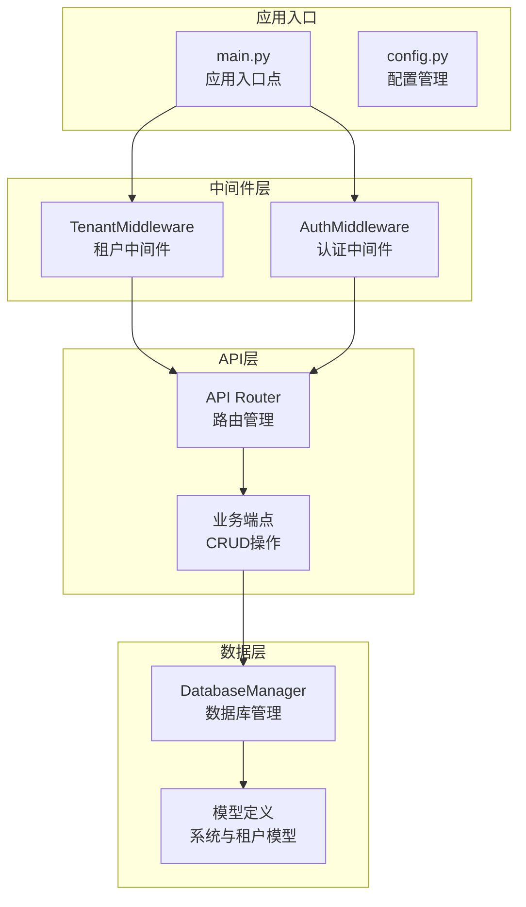
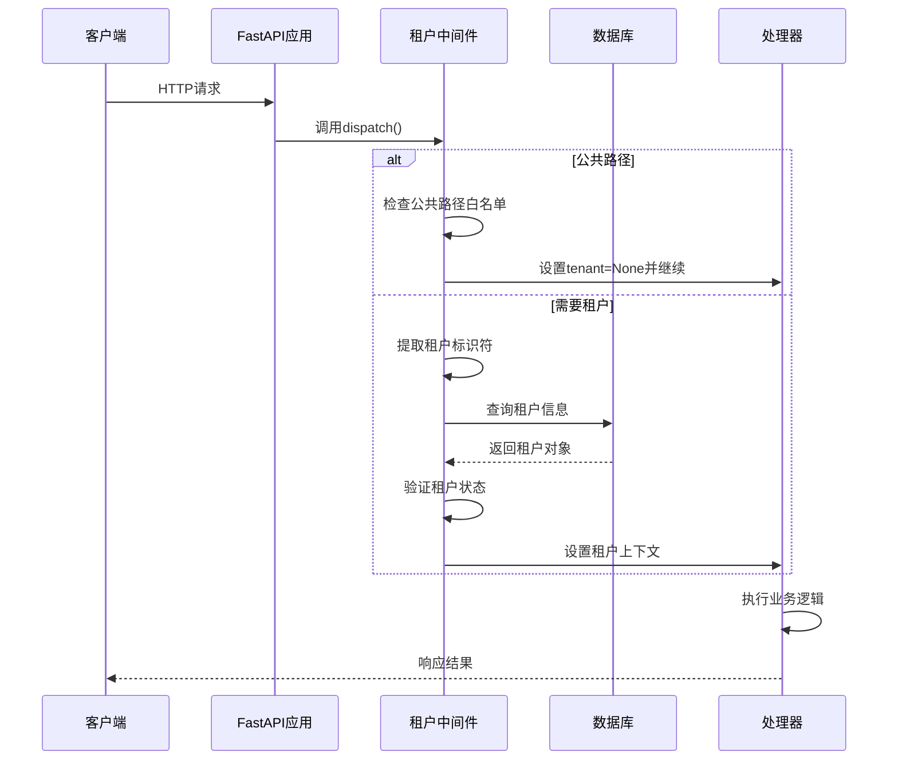
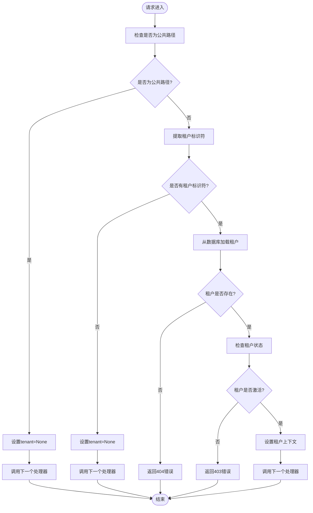
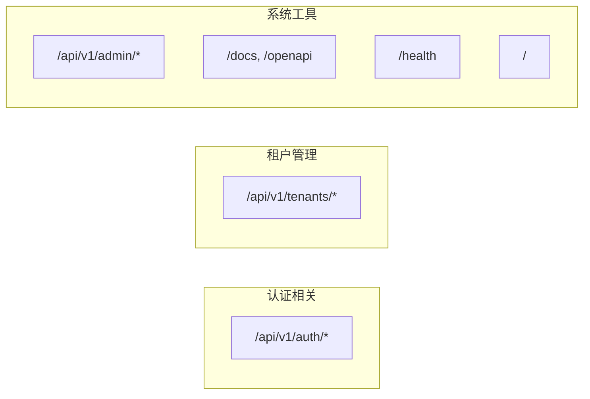
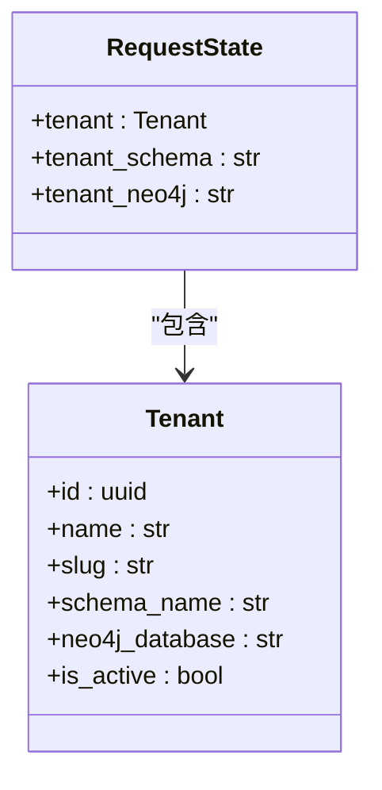
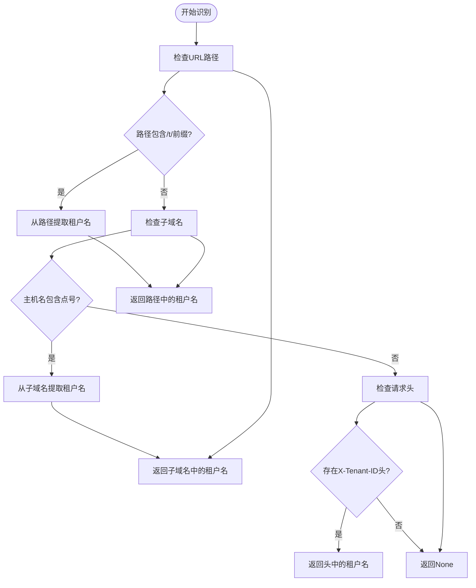
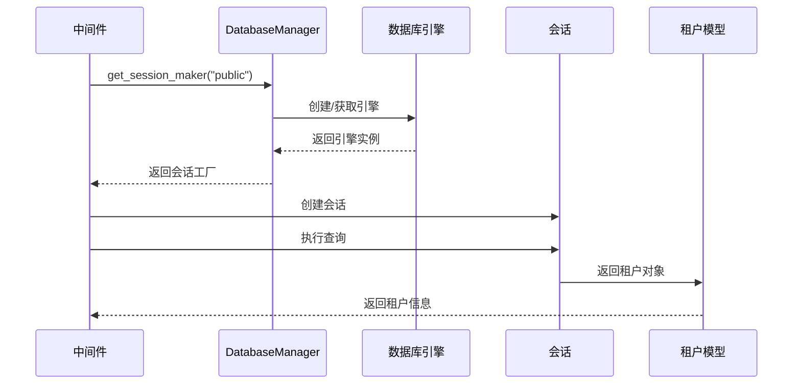
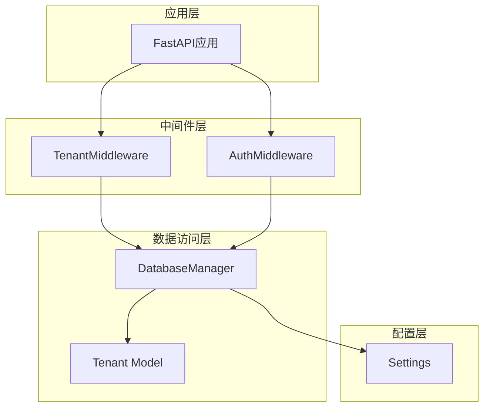
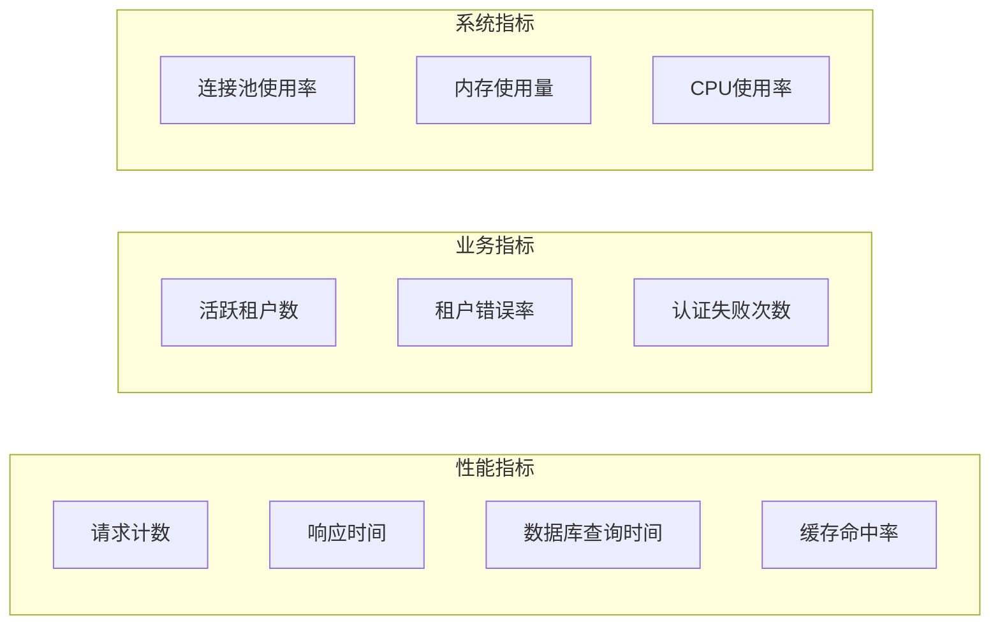

# 租户中间件实现

<cite>
**本文档引用的文件**
- [tenant.py](file://backend/app/middleware/tenant.py)
- [main.py](file://backend/app/main.py)
- [system.py](file://backend/app/models/system.py)
- [database.py](file://backend/app/core/database.py)
- [tenants.py](file://backend/app/api/v1/endpoints/tenants.py)
- [persons.py](file://backend/app/api/v1/endpoints/persons.py)
- [family_tree.py](file://backend/app/api/v1/endpoints/family_tree.py)
- [config.py](file://backend/app/core/config.py)
- [auth.py](file://backend/app/middleware/auth.py)
</cite>

## 目录
1. [简介](#简介)
2. [项目结构](#项目结构)
3. [核心组件](#核心组件)
4. [架构概览](#架构概览)
5. [详细组件分析](#详细组件分析)
6. [依赖关系分析](#依赖关系分析)
7. [性能考虑](#性能考虑)
8. [故障排除指南](#故障排除指南)
9. [结论](#结论)

## 简介

本文件详细阐述了多租户族谱管理系统中的租户中间件实现。该中间件是整个系统多租户架构的核心组件，负责在每个HTTP请求到达时识别并设置租户上下文，确保数据隔离和访问控制的正确性。本文档深入分析了TenantMiddleware类的工作机制、生命周期管理、公共路径白名单设计、租户状态管理以及性能优化策略。

## 项目结构

多租户族谱管理系统的后端采用FastAPI框架构建，整体架构遵循分层设计模式：

**图表来源**
- [main.py:45-91](file://backend/app/main.py#L45-L91)
- [tenant.py:15-142](file://backend/app/middleware/tenant.py#L15-L142)

**章节来源**
- [main.py:1-103](file://backend/app/main.py#L1-103)
- [config.py:1-89](file://backend/app/core/config.py#L1-L89)

## 核心组件

### TenantMiddleware类

TenantMiddleware是多租户系统的核心组件，继承自Starlette的BaseHTTPMiddleware基类。该类实现了完整的租户识别和上下文设置功能。

#### 主要特性

1. **多级租户识别顺序**：
   - 子域名识别（如：liu.genealogy.com）
   - URL路径识别（如：/t/liu/...）
   - 请求头识别（X-Tenant-ID）

2. **公共路径白名单**：
   - 认证相关接口
   - 租户管理接口
   - 文档和健康检查接口

3. **租户状态管理**：
   - request.state.tenant：当前租户对象
   - request.state.tenant_schema：租户数据库模式名
   - request.state.tenant_neo4j：租户Neo4j数据库名

**章节来源**
- [tenant.py:15-142](file://backend/app/middleware/tenant.py#L15-L142)

## 架构概览

租户中间件在整个请求处理流程中扮演着关键角色，其工作流程如下：

**图表来源**
- [tenant.py:39-84](file://backend/app/middleware/tenant.py#L39-L84)
- [main.py:66-67](file://backend/app/main.py#L66-L67)

## 详细组件分析

### 租户中间件生命周期管理

#### dispatch方法执行流程

TenantMiddleware的dispatch方法是整个中间件的核心，负责完整的请求处理生命周期：

**图表来源**
- [tenant.py:39-84](file://backend/app/middleware/tenant.py#L39-L84)

#### 异常处理机制

中间件实现了完善的异常处理机制：

1. **租户未找到异常**：当租户标识符对应的租户不存在时，返回404状态码
2. **租户未激活异常**：当租户处于非激活状态时，返回403状态码
3. **格式化响应**：所有异常都返回统一的JSON响应格式

**章节来源**
- [tenant.py:52-74](file://backend/app/middleware/tenant.py#L52-L74)

### 公共路径白名单设计理念

#### 设计原则

公共路径白名单的设计基于以下原则：

1. **最小权限原则**：只有必要的系统管理功能才不需要租户上下文
2. **安全性考虑**：认证、注册等敏感操作需要明确的租户边界
3. **可维护性**：清晰的路径分类便于理解和维护

#### 白名单包含的路径类型

**图表来源**
- [tenant.py:25-34](file://backend/app/middleware/tenant.py#L25-L34)

**章节来源**
- [tenant.py:25-34](file://backend/app/middleware/tenant.py#L25-L34)

### 租户状态管理技术细节

#### 上下文设置过程

中间件通过Python的request.state属性来设置租户上下文：

**图表来源**
- [tenant.py:76-79](file://backend/app/middleware/tenant.py#L76-L79)
- [system.py:23-70](file://backend/app/models/system.py#L23-L70)

#### 辅助函数

中间件提供了两个重要的辅助函数：

1. **get_tenant(request)**：安全地从请求状态中获取租户对象
2. **require_tenant(request)**：获取租户对象或抛出404异常

**章节来源**
- [tenant.py:128-141](file://backend/app/middleware/tenant.py#L128-L141)

### 租户识别机制

#### 多级识别策略

中间件实现了三级租户识别机制，按优先级顺序进行：

**图表来源**
- [tenant.py:93-114](file://backend/app/middleware/tenant.py#L93-L114)

**章节来源**
- [tenant.py:93-114](file://backend/app/middleware/tenant.py#L93-L114)

### 数据库集成

#### 租户信息查询

中间件通过数据库管理器查询租户信息：

**图表来源**
- [tenant.py:116-125](file://backend/app/middleware/tenant.py#L116-L125)
- [database.py:120-121](file://backend/app/core/database.py#L120-L121)

**章节来源**
- [tenant.py:116-125](file://backend/app/middleware/tenant.py#L116-L125)
- [database.py:24-106](file://backend/app/core/database.py#L24-L106)

## 依赖关系分析

### 组件间依赖关系

**图表来源**
- [main.py:14-14](file://backend/app/main.py#L14-L14)
- [tenant.py:11-12](file://backend/app/middleware/tenant.py#L11-L12)
- [database.py:24-121](file://backend/app/core/database.py#L24-L121)

### 关键依赖关系

1. **中间件依赖**：
   - DatabaseManager：数据库连接管理
   - Tenant模型：租户数据结构定义

2. **应用集成**：
   - FastAPI应用：中间件注册和生命周期管理
   - API路由器：业务逻辑处理

**章节来源**
- [main.py:14-14](file://backend/app/main.py#L14-L14)
- [tenant.py:11-12](file://backend/app/middleware/tenant.py#L11-L12)

## 性能考虑

### 优化策略

#### 数据库连接优化

1. **连接池管理**：DatabaseManager实现了智能的连接池管理，避免重复创建数据库连接
2. **异步操作**：使用SQLAlchemy异步引擎，提高并发处理能力
3. **缓存策略**：对于频繁访问的租户信息，可以考虑添加缓存层

#### 中间件性能优化

1. **早期退出**：公共路径检查使用早期退出机制，避免不必要的数据库查询
2. **正则表达式优化**：URL路径匹配使用编译后的正则表达式
3. **最小化数据库访问**：只在需要时才查询租户信息

#### 监控指标设计

建议实现以下监控指标：

**章节来源**
- [database.py:24-106](file://backend/app/core/database.py#L24-L106)
- [tenant.py:25-34](file://backend/app/middleware/tenant.py#L25-L34)

## 故障排除指南

### 常见问题及解决方案

#### 租户识别失败

**问题**：用户访问租户特定页面时提示租户未找到

**可能原因**：
1. URL路径格式不正确
2. 子域名配置错误
3. X-Tenant-ID请求头缺失

**解决方案**：
1. 检查URL格式是否符合 `/t/{tenant_slug}/` 模式
2. 验证DNS解析和反向代理配置
3. 确认客户端正确发送X-Tenant-ID头

#### 租户状态异常

**问题**：租户被标记为未激活但仍需访问

**可能原因**：
1. 租户订阅过期
2. 系统管理员手动禁用
3. 数据库状态不同步

**解决方案**：
1. 检查租户状态字段
2. 验证订阅状态
3. 同步数据库状态

#### 性能问题

**问题**：中间件响应时间过长

**可能原因**：
1. 数据库连接池耗尽
2. 正则表达式匹配复杂度高
3. 缺少必要的索引

**解决方案**：
1. 调整数据库连接池参数
2. 优化正则表达式模式
3. 添加适当的数据库索引

**章节来源**
- [tenant.py:52-74](file://backend/app/middleware/tenant.py#L52-L74)
- [database.py:24-106](file://backend/app/core/database.py#L24-L106)

## 结论

租户中间件作为多租户族谱管理系统的核心组件，通过精心设计的多级识别机制、完善的异常处理和高效的性能优化策略，为整个系统提供了可靠的租户隔离和访问控制能力。

### 主要成就

1. **灵活的租户识别**：支持多种租户标识符提取方式，适应不同的部署场景
2. **完善的错误处理**：提供清晰的错误信息和统一的响应格式
3. **高效的性能设计**：通过连接池管理和早期退出机制优化性能
4. **清晰的架构设计**：模块化的设计便于维护和扩展

### 未来改进方向

1. **缓存机制**：为频繁访问的租户信息添加缓存层
2. **监控增强**：集成更全面的性能监控和告警机制
3. **安全加固**：增加更多的安全检查和防护措施
4. **测试覆盖**：完善单元测试和集成测试覆盖率

该中间件实现为多租户应用开发提供了优秀的参考模板，其设计理念和实现细节值得在类似项目中借鉴和应用。