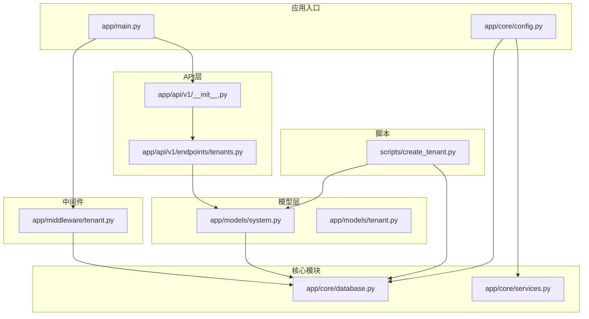
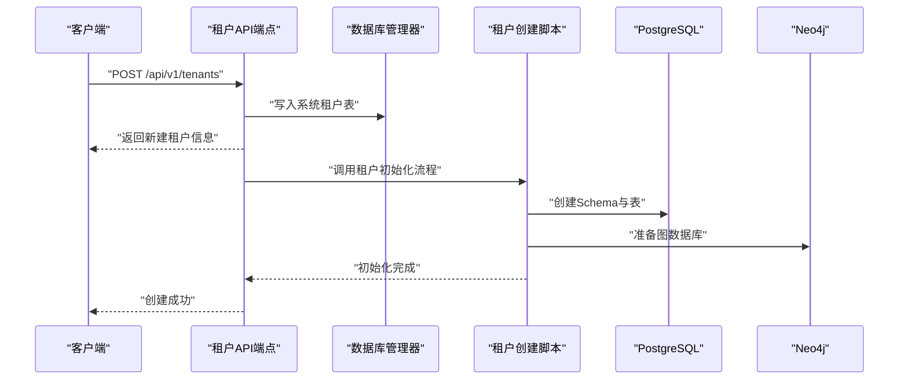
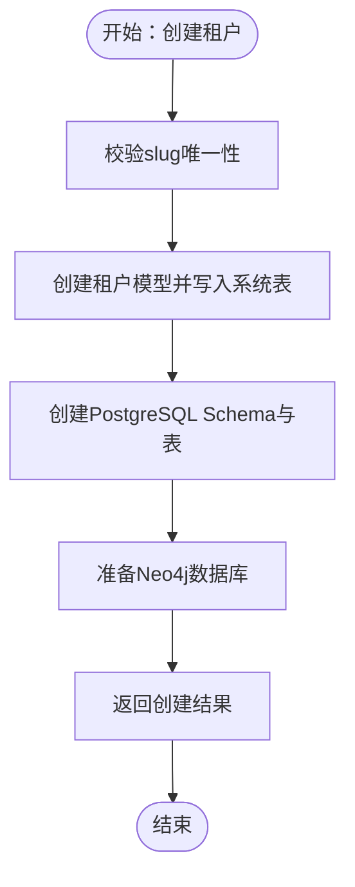
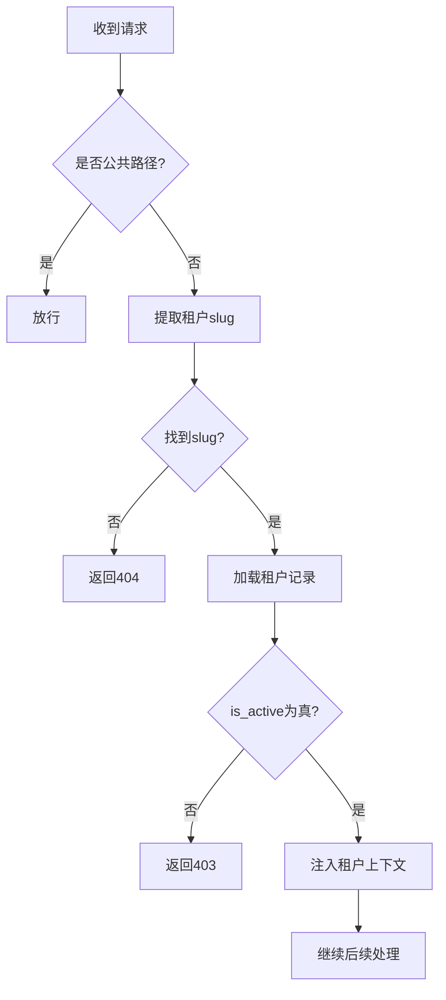
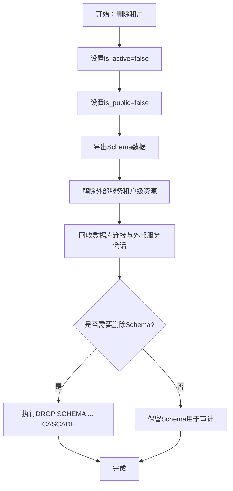
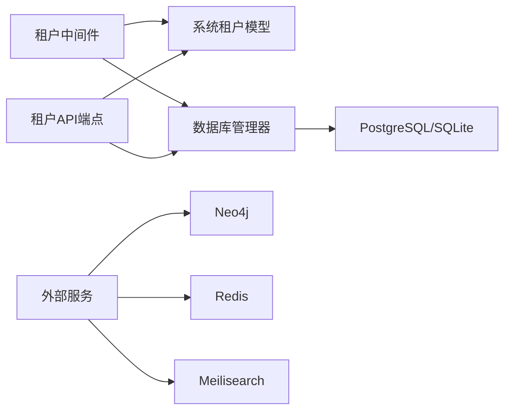

# 租户生命周期管理

<cite>
**本文引用的文件**
- [backend/app/models/system.py](file://backend/app/models/system.py)
- [backend/app/models/tenant.py](file://backend/app/models/tenant.py)
- [backend/app/api/v1/endpoints/tenants.py](file://backend/app/api/v1/endpoints/tenants.py)
- [backend/app/middleware/tenant.py](file://backend/app/middleware/tenant.py)
- [backend/app/core/database.py](file://backend/app/core/database.py)
- [backend/app/core/services.py](file://backend/app/core/services.py)
- [backend/app/core/config.py](file://backend/app/core/config.py)
- [backend/app/main.py](file://backend/app/main.py)
- [scripts/create_tenant.py](file://scripts/create_tenant.py)
- [backend/tests/test_tenants.py](file://backend/tests/test_tenants.py)
- [backend/app/api/v1/__init__.py](file://backend/app/api/v1/__init__.py)
</cite>

## 目录
1. [简介](#简介)
2. [项目结构](#项目结构)
3. [核心组件](#核心组件)
4. [架构总览](#架构总览)
5. [详细组件分析](#详细组件分析)
6. [依赖分析](#依赖分析)
7. [性能考虑](#性能考虑)
8. [故障排查指南](#故障排查指南)
9. [结论](#结论)
10. [附录](#附录)

## 简介
本文件面向多租户族谱管理系统，系统性梳理租户从“创建”到“删除”的完整生命周期，覆盖租户注册、激活、停用与注销各阶段的状态转换；详述租户创建流程中的数据库初始化、Schema创建与默认配置设置；阐述租户状态管理机制（激活状态检查与访问权限控制）；给出租户删除的清理策略（数据归档、依赖关系解除与资源回收）；并提出租户配额管理的设计思路（存储空间、用户数量与并发连接数）。最后提供最佳实践与故障恢复方案。

## 项目结构
后端采用FastAPI + SQLAlchemy异步ORM + 多租户隔离设计，核心目录与职责如下：
- 应用入口与中间件：应用启动、CORS、租户中间件、健康检查
- API层：v1路由聚合，租户相关端点
- 核心模块：数据库引擎与会话管理、外部服务（Neo4j/Redis/Meilisearch）
- 模型层：系统级租户模型与公共Schema；租户级族谱模型
- 脚本：租户创建CLI工具
- 测试：租户API测试



图表来源
- [backend/app/main.py:1-103](file://backend/app/main.py#L1-L103)
- [backend/app/middleware/tenant.py:1-142](file://backend/app/middleware/tenant.py#L1-L142)
- [backend/app/api/v1/__init__.py:1-20](file://backend/app/api/v1/__init__.py#L1-L20)
- [backend/app/api/v1/endpoints/tenants.py:1-164](file://backend/app/api/v1/endpoints/tenants.py#L1-L164)
- [backend/app/core/database.py:1-171](file://backend/app/core/database.py#L1-L171)
- [backend/app/core/services.py:1-285](file://backend/app/core/services.py#L1-L285)
- [backend/app/models/system.py:1-223](file://backend/app/models/system.py#L1-L223)
- [backend/app/models/tenant.py:1-244](file://backend/app/models/tenant.py#L1-L244)
- [scripts/create_tenant.py:1-306](file://scripts/create_tenant.py#L1-L306)

章节来源
- [backend/app/main.py:1-103](file://backend/app/main.py#L1-L103)
- [backend/app/api/v1/__init__.py:1-20](file://backend/app/api/v1/__init__.py#L1-L20)

## 核心组件
- 租户模型（系统级）：定义租户标识、隔离参数、订阅与配额、状态字段与元数据等
- 租户API端点：提供租户列表、查询、创建等接口
- 租户中间件：解析请求上下文中的租户标识，注入租户Schema与Neo4j数据库名，并进行激活状态校验
- 数据库管理器：按租户Schema动态创建引擎与会话，支持SQLite与PostgreSQL多租户模式
- 外部服务：Neo4j图数据库、Redis缓存、Meilisearch全文检索的可选服务
- 租户创建脚本：自动化完成租户在系统表的登记、PostgreSQL Schema与表创建、Neo4j数据库准备

章节来源
- [backend/app/models/system.py:23-71](file://backend/app/models/system.py#L23-L71)
- [backend/app/api/v1/endpoints/tenants.py:18-164](file://backend/app/api/v1/endpoints/tenants.py#L18-L164)
- [backend/app/middleware/tenant.py:15-142](file://backend/app/middleware/tenant.py#L15-L142)
- [backend/app/core/database.py:24-171](file://backend/app/core/database.py#L24-L171)
- [backend/app/core/services.py:9-285](file://backend/app/core/services.py#L9-L285)
- [scripts/create_tenant.py:18-282](file://scripts/create_tenant.py#L18-L282)

## 架构总览
系统通过租户中间件在每个请求进入时识别当前租户，注入其Schema与图数据库名称，并在访问租户专属资源前进行激活状态检查。租户创建流程由API端点触发，写入系统租户表后，脚本负责创建PostgreSQL Schema与表、初始化Neo4j数据库，最终返回可用的租户实例。



图表来源
- [backend/app/api/v1/endpoints/tenants.py:118-164](file://backend/app/api/v1/endpoints/tenants.py#L118-L164)
- [backend/app/core/database.py:58-106](file://backend/app/core/database.py#L58-L106)
- [scripts/create_tenant.py:231-282](file://scripts/create_tenant.py#L231-L282)

## 详细组件分析

### 租户模型与状态字段
- 关键字段：标识（名称、slug、姓氏）、隔离参数（schema_name、neo4j_database）、订阅与配额（plan、max_members、max_persons、max_storage_mb）、状态（is_active、is_public）、过期时间（expires_at）、配置（settings）
- 关系：与用户模型通过租户用户关系表建立多对多关联，支持角色与加入时间等信息

```mermaid
classDiagram
class 租户 {
+uuid id
+string name
+string slug
+string surname
+string schema_name
+string neo4j_database
+string plan
+int max_members
+int max_persons
+int max_storage_mb
+bool is_active
+bool is_public
+datetime created_at
+datetime updated_at
+datetime expires_at
+dict settings
}
class 用户 {
+uuid id
+string email
+string phone
+string system_role
+bool is_active
+datetime created_at
+datetime updated_at
}
class 租户用户 {
+uuid id
+uuid user_id
+uuid tenant_id
+string role
+uuid person_id
+datetime joined_at
}
租户 "1" <---> "many" 租户用户 : "关系"
用户 "1" <---> "many" 租户用户 : "关系"
```

图表来源
- [backend/app/models/system.py:23-71](file://backend/app/models/system.py#L23-L71)
- [backend/app/models/system.py:123-181](file://backend/app/models/system.py#L123-L181)

章节来源
- [backend/app/models/system.py:23-71](file://backend/app/models/system.py#L23-L71)
- [backend/app/models/system.py:123-181](file://backend/app/models/system.py#L123-L181)

### 租户创建流程（注册 → 激活）
- 注册阶段
  - API端点接收租户创建请求，校验slug唯一性，生成schema_name与neo4j_database，写入系统租户表
  - 返回租户基本信息（含计划、创建时间等）
- 初始化阶段
  - 调用脚本创建PostgreSQL Schema与族谱相关表
  - 准备Neo4j数据库（或使用命名前缀隔离）
- 激活阶段
  - 默认is_active为True，中间件在请求处理中检查租户是否激活，未激活则拒绝访问



图表来源
- [backend/app/api/v1/endpoints/tenants.py:118-164](file://backend/app/api/v1/endpoints/tenants.py#L118-L164)
- [scripts/create_tenant.py:231-282](file://scripts/create_tenant.py#L231-L282)

章节来源
- [backend/app/api/v1/endpoints/tenants.py:118-164](file://backend/app/api/v1/endpoints/tenants.py#L118-L164)
- [scripts/create_tenant.py:18-282](file://scripts/create_tenant.py#L18-L282)

### 租户状态管理与访问控制
- 中间件职责
  - 识别顺序：URL路径前缀/t/{slug}、子域名、自定义Header
  - 对公共路径放行；对非公共路径加载租户并校验激活状态
  - 将租户上下文、schema_name、neo4j_database注入request.state
- 访问控制
  - 未找到租户：返回404错误
  - 租户未激活：返回403错误
  - 公共路径（认证、注册、管理、健康检查等）无需租户上下文



图表来源
- [backend/app/middleware/tenant.py:39-84](file://backend/app/middleware/tenant.py#L39-L84)
- [backend/app/middleware/tenant.py:93-125](file://backend/app/middleware/tenant.py#L93-L125)

章节来源
- [backend/app/middleware/tenant.py:15-142](file://backend/app/middleware/tenant.py#L15-L142)

### 租户删除与清理策略
- 删除时机
  - 停用：将is_active置为False，阻止新请求访问
  - 注销：标记租户为不可见（is_public=False），清理公开索引与展示
- 清理步骤
  - 数据归档：导出租户Schema下的所有表数据至备份存储
  - 依赖解除：移除对外部服务的租户级索引或命名空间
  - 资源回收：释放数据库连接池、关闭外部服务会话；PostgreSQL可保留Schema以供审计，或在合规允许下执行DROP SCHEMA
- 回收验证
  - 健康检查接口确认外部服务可用性
  - 确认无活动会话与未提交事务



图表来源
- [backend/app/models/system.py:47-61](file://backend/app/models/system.py#L47-L61)
- [backend/app/main.py:72-86](file://backend/app/main.py#L72-L86)
- [backend/app/core/database.py:108-118](file://backend/app/core/database.py#L108-L118)
- [backend/app/core/services.py:280-285](file://backend/app/core/services.py#L280-L285)

章节来源
- [backend/app/models/system.py:47-61](file://backend/app/models/system.py#L47-L61)
- [backend/app/main.py:72-86](file://backend/app/main.py#L72-L86)
- [backend/app/core/database.py:108-118](file://backend/app/core/database.py#L108-L118)
- [backend/app/core/services.py:280-285](file://backend/app/core/services.py#L280-L285)

### 租户配额管理设计思路
- 存储空间限制
  - PostgreSQL：通过Schema隔离与表大小监控实现上限；可结合对象存储桶配额
  - 文件存储：基于桶配额与单文件大小限制
- 用户数量限制
  - 通过租户用户关系表统计成员数，超过阈值禁止新增成员
- 并发连接数控制
  - 数据库连接池：根据租户Plan设置pool_size与max_overflow
  - 外部服务：为高负载租户分配独立索引或数据库实例
- 配额变更与审计
  - 订阅模型记录历史Plan与限额；变更时记录日志并通知租户管理员

章节来源
- [backend/app/models/system.py:42-46](file://backend/app/models/system.py#L42-L46)
- [backend/app/core/database.py:33-56](file://backend/app/core/database.py#L33-L56)
- [backend/app/core/config.py:69-73](file://backend/app/core/config.py#L69-L73)

### 租户API与路由组织
- 路由前缀：/api/v1
- 租户端点：GET /tenants（分页、筛选）、GET /tenants/{slug}、POST /tenants（创建）
- 租户专属路由：/t/{tenant_slug} 下挂载族谱与人员相关端点

章节来源
- [backend/app/api/v1/endpoints/tenants.py:45-116](file://backend/app/api/v1/endpoints/tenants.py#L45-L116)
- [backend/app/api/v1/__init__.py:14-19](file://backend/app/api/v1/__init__.py#L14-L19)

## 依赖分析
- 组件耦合
  - 租户中间件依赖数据库管理器与系统租户模型，用于加载租户上下文
  - API端点依赖系统租户模型与数据库会话
  - 数据库管理器按schema_name动态创建引擎，避免跨租户数据污染
  - 外部服务为可选依赖，失败不影响主流程
- 可能的循环依赖
  - 当前模块间为单向依赖，无明显循环
- 外部依赖
  - PostgreSQL/SQLite、Neo4j、Redis、Meilisearch



图表来源
- [backend/app/middleware/tenant.py:11-125](file://backend/app/middleware/tenant.py#L11-L125)
- [backend/app/api/v1/endpoints/tenants.py:11-14](file://backend/app/api/v1/endpoints/tenants.py#L11-L14)
- [backend/app/core/database.py:24-106](file://backend/app/core/database.py#L24-L106)
- [backend/app/core/services.py:263-285](file://backend/app/core/services.py#L263-L285)

章节来源
- [backend/app/middleware/tenant.py:11-125](file://backend/app/middleware/tenant.py#L11-L125)
- [backend/app/api/v1/endpoints/tenants.py:11-14](file://backend/app/api/v1/endpoints/tenants.py#L11-L14)
- [backend/app/core/database.py:24-106](file://backend/app/core/database.py#L24-L106)
- [backend/app/core/services.py:263-285](file://backend/app/core/services.py#L263-L285)

## 性能考虑
- 连接池与会话
  - 为不同租户按需创建引擎与会话，避免全局共享导致的锁争用
  - SQLite场景下按租户文件隔离，减少跨租户I/O干扰
- 外部服务降级
  - Neo4j/Redis/Meilisearch不可用时自动降级为SQL回退或禁用缓存，保证核心功能可用
- 查询优化
  - 租户专属路由仅在已识别租户上下文后访问，减少无效查询
  - 使用索引与分页，避免全表扫描

## 故障排查指南
- 租户未找到
  - 检查slug是否正确、是否被占用；确认中间件识别逻辑（路径/子域名/Header）
- 租户未激活
  - 检查is_active字段；确认创建流程是否完成初始化
- 数据库连接异常
  - 查看数据库管理器初始化与会话创建日志；核对连接池参数
- 外部服务不可用
  - 检查服务连通性与凭据；查看服务连接状态输出
- API测试
  - 使用测试用例验证列表、查询、按姓氏筛选等功能

章节来源
- [backend/app/middleware/tenant.py:40-84](file://backend/app/middleware/tenant.py#L40-L84)
- [backend/app/core/database.py:58-106](file://backend/app/core/database.py#L58-L106)
- [backend/app/core/services.py:268-277](file://backend/app/core/services.py#L268-L277)
- [backend/tests/test_tenants.py:11-112](file://backend/tests/test_tenants.py#L11-L112)

## 结论
该系统通过明确的租户模型、中间件驱动的上下文注入与可选外部服务，实现了从创建到删除的完整生命周期管理。建议在生产环境中强化鉴权与配额审计、完善数据归档与Schema回收策略，并持续监控外部服务可用性以保障稳定性。

## 附录
- 最佳实践
  - 创建租户时同步初始化Schema与表，确保一致性
  - 为高负载租户预留独立外部服务实例或索引
  - 定期审计配额使用情况，及时提醒与阻断超限行为
- 故障恢复
  - 快速定位中间件识别失败、数据库连接异常与外部服务不可用问题
  - 利用健康检查接口与测试用例快速验证修复效果