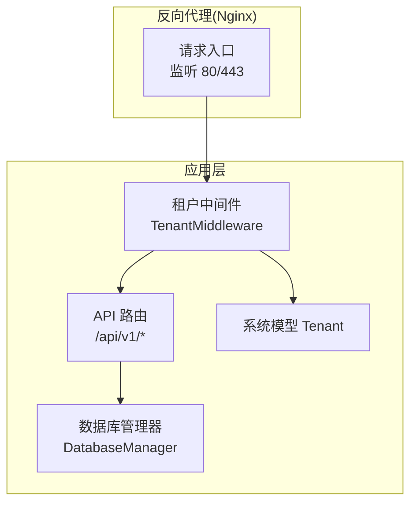
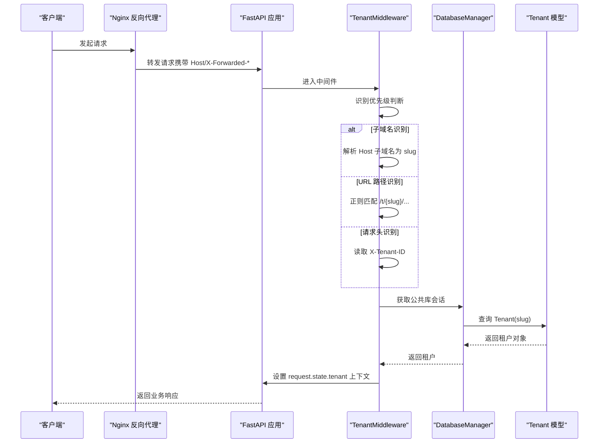
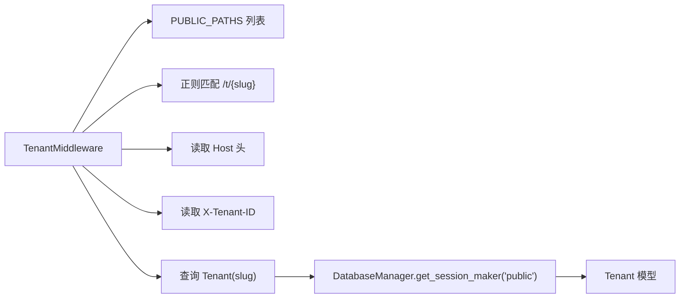
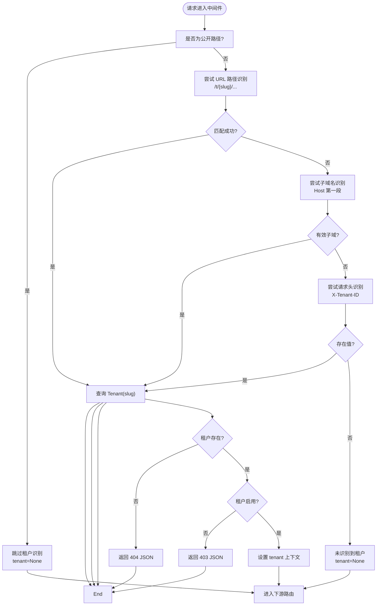

# 租户识别机制

<cite>
**本文引用的文件**
- [backend/app/middleware/tenant.py](file://backend/app/middleware/tenant.py)
- [backend/app/models/system.py](file://backend/app/models/system.py)
- [backend/app/api/v1/endpoints/tenants.py](file://backend/app/api/v1/endpoints/tenants.py)
- [backend/app/main.py](file://backend/app/main.py)
- [backend/app/core/database.py](file://backend/app/core/database.py)
- [backend/app/core/config.py](file://backend/app/core/config.py)
- [docker/nginx/conf.d/default.conf](file://docker/nginx/conf.d/default.conf)
- [docker-compose.yml](file://docker-compose.yml)
- [docs/ARCHITECTURE.md](file://docs/ARCHITECTURE.md)
- [backend/tests/test_tenants.py](file://backend/tests/test_tenants.py)
</cite>

## 目录
1. [简介](#简介)
2. [项目结构](#项目结构)
3. [核心组件](#核心组件)
4. [架构总览](#架构总览)
5. [详细组件分析](#详细组件分析)
6. [依赖分析](#依赖分析)
7. [性能考量](#性能考量)
8. [故障排查指南](#故障排查指南)
9. [结论](#结论)
10. [附录](#附录)

## 简介
本文件面向多租户族谱管理系统，系统性阐述三种租户识别方法的实现原理与优先级：子域名识别（Subdomain，如 liu.genealogy.com）、URL 路径识别（Path，如 /t/liu/...）与请求头识别（Header，X-Tenant-ID）。文档覆盖以下要点：
- 识别优先级与匹配规则（含正则表达式与主机名解析）
- 租户识别失败时的错误响应格式与调试建议
- 不同部署场景下的配置建议（反向代理、负载均衡）
- 安全性分析与防护措施

## 项目结构
后端采用 FastAPI + SQLAlchemy 异步 ORM，租户识别通过中间件在请求进入路由前完成。前端 Next.js 使用动态路由 [tenant] 接收租户参数。

图表来源
- [backend/app/middleware/tenant.py:15-141](file://backend/app/middleware/tenant.py#L15-L141)
- [backend/app/main.py:45-91](file://backend/app/main.py#L45-L91)
- [backend/app/core/database.py:24-171](file://backend/app/core/database.py#L24-L171)
- [backend/app/models/system.py:23-71](file://backend/app/models/system.py#L23-L71)

章节来源
- [backend/app/middleware/tenant.py:15-141](file://backend/app/middleware/tenant.py#L15-L141)
- [backend/app/main.py:45-91](file://backend/app/main.py#L45-L91)

## 核心组件
- 租户中间件 TenantMiddleware：负责识别租户上下文，设置 request.state.tenant、tenant_schema、tenant_neo4j，并在识别失败时返回统一错误格式。
- 系统模型 Tenant：存储租户元数据（slug、schema_name、neo4j_database、is_active 等），用于识别与隔离。
- 数据库管理器 DatabaseManager：按租户 schema 动态获取会话，支持 SQLite/PostgreSQL 的多租户模式。
- Nginx 反向代理：统一入口、SSL 终止、转发 Host/X-Real-IP/X-Forwarded-* 请求头。

章节来源
- [backend/app/middleware/tenant.py:15-141](file://backend/app/middleware/tenant.py#L15-L141)
- [backend/app/models/system.py:23-71](file://backend/app/models/system.py#L23-L71)
- [backend/app/core/database.py:24-171](file://backend/app/core/database.py#L24-L171)
- [docker/nginx/conf.d/default.conf:30-62](file://docker/nginx/conf.d/default.conf#L30-L62)

## 架构总览
租户识别在请求生命周期中的位置如下：

图表来源
- [backend/app/middleware/tenant.py:39-125](file://backend/app/middleware/tenant.py#L39-L125)
- [backend/app/core/database.py:118-125](file://backend/app/core/database.py#L118-L125)
- [backend/app/models/system.py:23-71](file://backend/app/models/system.py#L23-L71)

## 详细组件分析

### 租户识别优先级与匹配规则
- 优先级顺序
  1) 子域名识别（Host 的第一段作为 slug）
  2) URL 路径识别（/t/{slug}/...）
  3) 请求头识别（X-Tenant-ID）

- 匹配规则与细节
  - 子域名识别
    - 从请求头 Host 中提取第一段作为 subdomain；若非常见子域（www、api、admin、app），则视为租户 slug。
    - 该逻辑位于中间件的 _extract_tenant_slug 方法中。
  - URL 路径识别
    - 若请求路径包含 /t/ 前缀，则使用正则表达式提取紧随其后的第一个片段作为 slug。
    - 正则模式基于常量 TENANT_PATH_PREFIX（"/t/"）构建。
  - 请求头识别
    - 读取自定义请求头 X-Tenant-ID，直接作为 slug 使用。
  - 公共路径豁免
    - 对于 /api/v1/auth、/api/v1/tenants、/api/v1/admin、/docs、/openapi、/health、/ 等路径，跳过租户识别。

- 识别失败处理
  - 未识别到 slug：request.state.tenant 设为 None，继续后续路由处理。
  - 识别到 slug 但租户不存在：返回统一错误 JSON，包含 success:false 与 error.code/error.message。
  - 识别到 slug 且租户存在但 is_active=false：返回 403 错误 JSON。

章节来源
- [backend/app/middleware/tenant.py:19-114](file://backend/app/middleware/tenant.py#L19-L114)
- [backend/app/middleware/tenant.py:52-74](file://backend/app/middleware/tenant.py#L52-L74)

### 租户加载与上下文注入
- 通过 DatabaseManager 在公共 schema（public）查询 Tenant 模型，依据 slug 匹配。
- 成功识别后，将租户对象写入 request.state.tenant，并设置 tenant_schema 与 tenant_neo4j 供后续服务使用。
- 该流程在中间件 dispatch 的主分支中完成。

章节来源
- [backend/app/middleware/tenant.py:48-84](file://backend/app/middleware/tenant.py#L48-L84)
- [backend/app/middleware/tenant.py:116-125](file://backend/app/middleware/tenant.py#L116-L125)
- [backend/app/core/database.py:118-125](file://backend/app/core/database.py#L118-L125)
- [backend/app/models/system.py:23-71](file://backend/app/models/system.py#L23-L71)

### 错误响应格式与调试建议
- 错误响应结构
  - 字段：success（布尔）、error（对象，包含 code 与 message）。
  - 示例场景：租户不存在（TENANT_NOT_FOUND）、租户未激活（TENANT_INACTIVE）。
- 调试建议
  - 检查请求头 Host 是否正确传递至后端（Nginx 配置需保留 Host）。
  - 确认 slug 规范（仅小写字母、数字、连字符，且符合后端校验规则）。
  - 核对租户是否已创建且 is_active=true。
  - 查看中间件日志与数据库查询结果。

章节来源
- [backend/app/middleware/tenant.py:52-74](file://backend/app/middleware/tenant.py#L52-L74)

### 租户识别失败处理策略
- 未识别到 slug：不阻断请求，继续路由处理（适用于公开接口）。
- 租户不存在：返回 404 JSON，便于前端或调用方处理。
- 租户未激活：返回 403 JSON，提示站点当前不可用。
- 识别到 slug 但数据库查询异常：由中间件捕获并交由上层异常处理器统一处理。

章节来源
- [backend/app/middleware/tenant.py:48-84](file://backend/app/middleware/tenant.py#L48-L84)

### 不同部署场景下的识别配置建议

#### 单机开发环境（Docker Compose）
- 后端容器暴露端口 8010，前端本地开发端口 3010。
- Nginx 将 /api/* 转发到 api 容器，Host 与 X-Forwarded-* 头由 Nginx 透传。
- 建议：确保 Host 头包含可解析的子域名或使用 /t/{slug}/... 路径访问。

章节来源
- [docker-compose.yml:90-132](file://docker-compose.yml#L90-L132)
- [docker/nginx/conf.d/default.conf:30-62](file://docker/nginx/conf.d/default.conf#L30-L62)

#### 生产环境（多实例与负载均衡）
- 反向代理（Nginx/Traefik/Caddy）需保留并正确传递 Host、X-Real-IP、X-Forwarded-For、X-Forwarded-Proto。
- 负载均衡器应保持会话亲和（若需要）或确保各节点共享公共配置。
- 子域名与路径两种识别方式可并存，以满足不同客户端需求。

章节来源
- [docker/nginx/conf.d/default.conf:30-62](file://docker/nginx/conf.d/default.conf#L30-L62)

### 安全性分析与防护措施
- 输入验证
  - URL 路径识别使用正则提取 slug，建议在上游网关或 API 层进一步限制 slug 格式与长度。
- 头部注入风险
  - X-Tenant-ID 为自定义头部，仅在可信网络内使用或配合鉴权；避免直接暴露给不受信任的客户端。
- 主机名绕过
  - 子域名识别会跳过常见子域（www、api、admin、app），降低误识别概率；仍需结合白名单策略。
- 访问控制
  - 对 /api/v1/tenants 等敏感接口，建议增加鉴权与速率限制。
- 日志与审计
  - 记录租户识别决策（来源类型、slug、命中与否）以便审计与排障。

章节来源
- [backend/app/middleware/tenant.py:93-114](file://backend/app/middleware/tenant.py#L93-L114)
- [docker/nginx/conf.d/default.conf:30-62](file://docker/nginx/conf.d/default.conf#L30-L62)

## 依赖分析
租户识别链路的关键依赖关系如下：

图表来源
- [backend/app/middleware/tenant.py:25-125](file://backend/app/middleware/tenant.py#L25-L125)
- [backend/app/core/database.py:98-125](file://backend/app/core/database.py#L98-L125)
- [backend/app/models/system.py:23-71](file://backend/app/models/system.py#L23-L71)

章节来源
- [backend/app/middleware/tenant.py:25-125](file://backend/app/middleware/tenant.py#L25-L125)
- [backend/app/core/database.py:98-125](file://backend/app/core/database.py#L98-L125)

## 性能考量
- 中间件开销
  - 仅在非公开路径执行识别逻辑，减少不必要的计算。
  - 正则匹配与数据库查询均为 O(1)/O(log n) 级别，整体开销可控。
- 数据库连接
  - 通过 DatabaseManager 缓存引擎与会话工厂，避免重复初始化。
- 并发与池化
  - PostgreSQL 场景使用连接池参数（pool_size、max_overflow），SQLite 场景按租户独立文件，避免 schema 切换成本。

章节来源
- [backend/app/core/database.py:33-96](file://backend/app/core/database.py#L33-L96)
- [backend/app/core/config.py:35-40](file://backend/app/core/config.py#L35-L40)

## 故障排查指南
- 常见问题与定位
  - 404 租户不存在：确认 slug 是否正确、是否已创建、大小写与连字符是否一致。
  - 403 租户未激活：检查租户状态 is_active。
  - 公开接口仍要求租户：确认请求路径是否在 PUBLIC_PATHS 列表中。
- 测试参考
  - 租户列表、按姓氏搜索、按 slug 获取等接口的测试用例可作为行为参考。

章节来源
- [backend/tests/test_tenants.py:12-111](file://backend/tests/test_tenants.py#L12-L111)
- [backend/app/api/v1/endpoints/tenants.py:45-115](file://backend/app/api/v1/endpoints/tenants.py#L45-L115)

## 结论
本系统通过“子域名 → URL 路径 → 请求头”的三层识别机制，兼顾了灵活性与兼容性。中间件在请求早期完成租户上下文注入，配合统一错误响应与公共路径豁免策略，既保证了多租户隔离，又提升了用户体验。生产部署中建议强化反向代理头透传、速率限制与鉴权策略，并持续监控识别命中率与错误率以优化配置。

## 附录

### 识别流程图（算法实现）

图表来源
- [backend/app/middleware/tenant.py:39-125](file://backend/app/middleware/tenant.py#L39-L125)