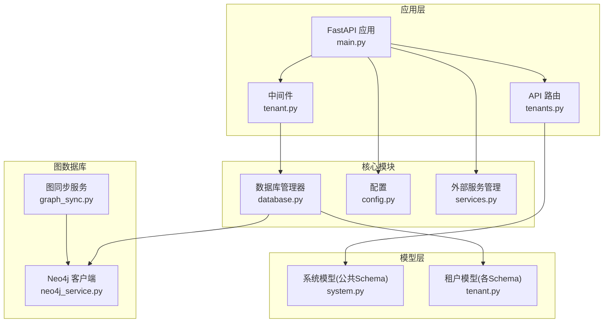
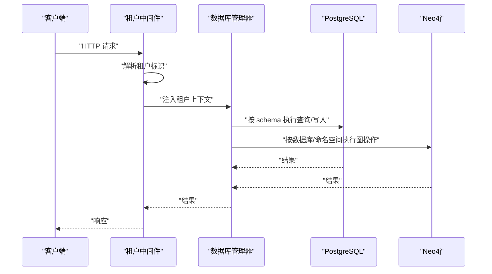
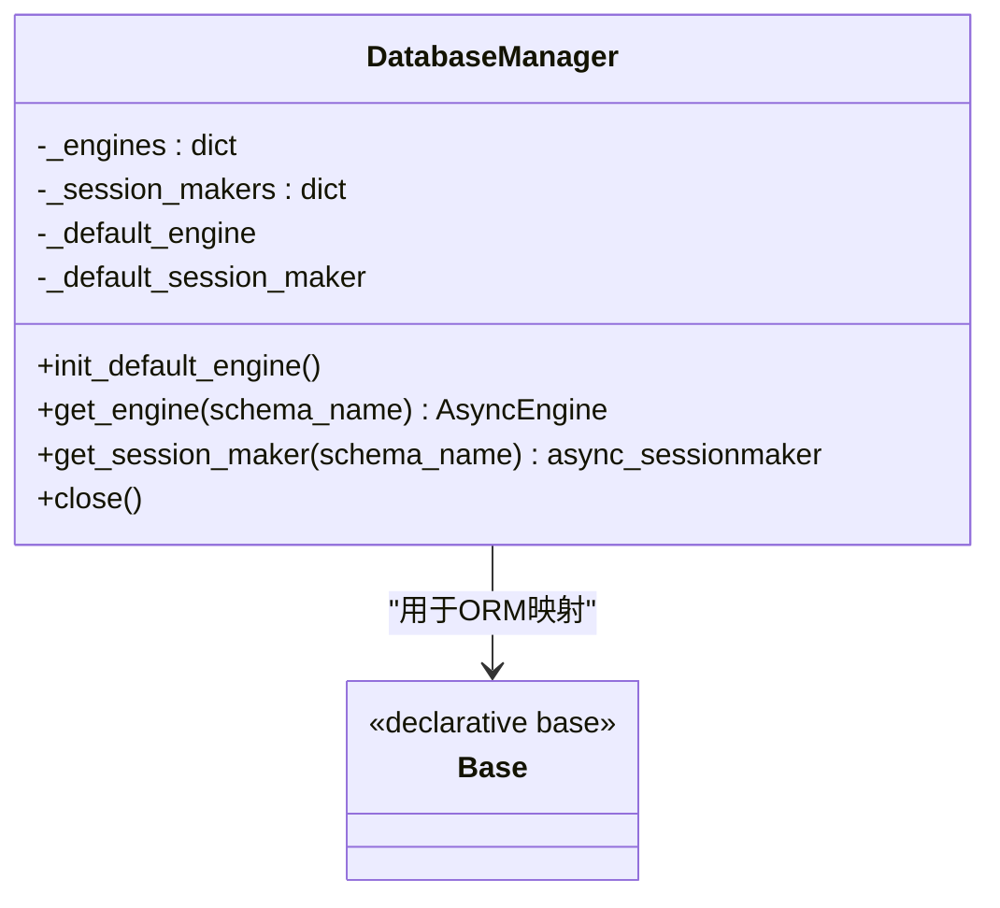
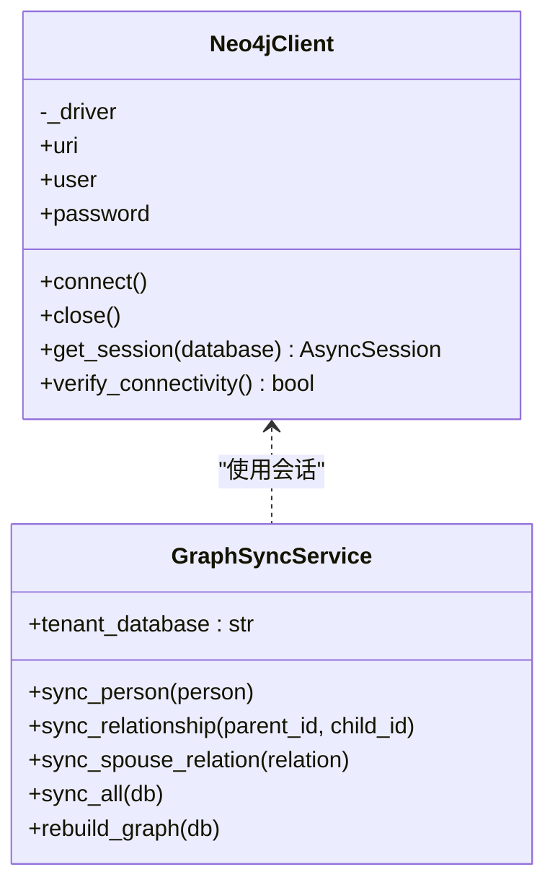
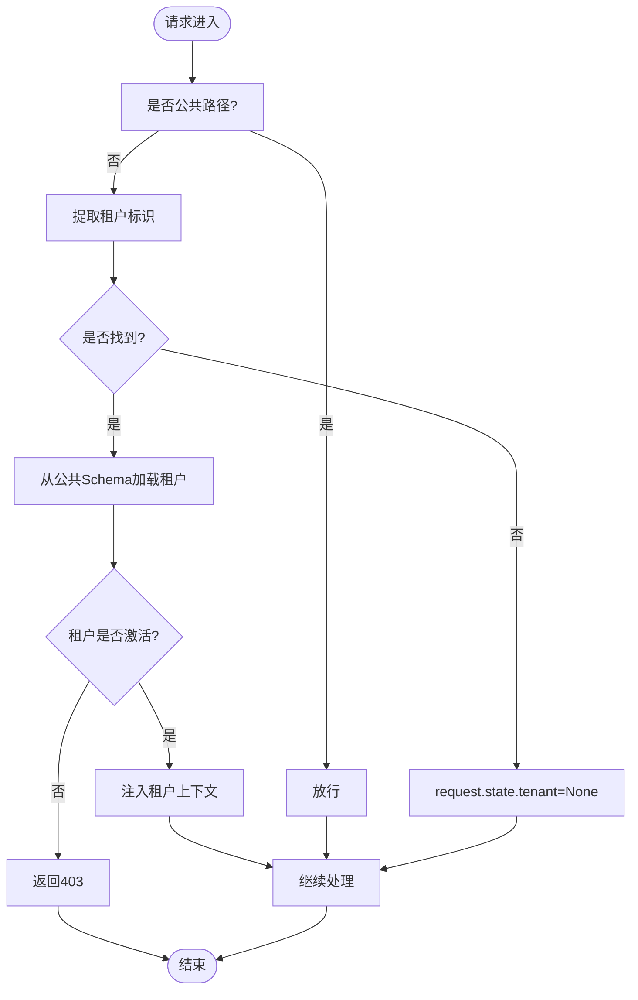
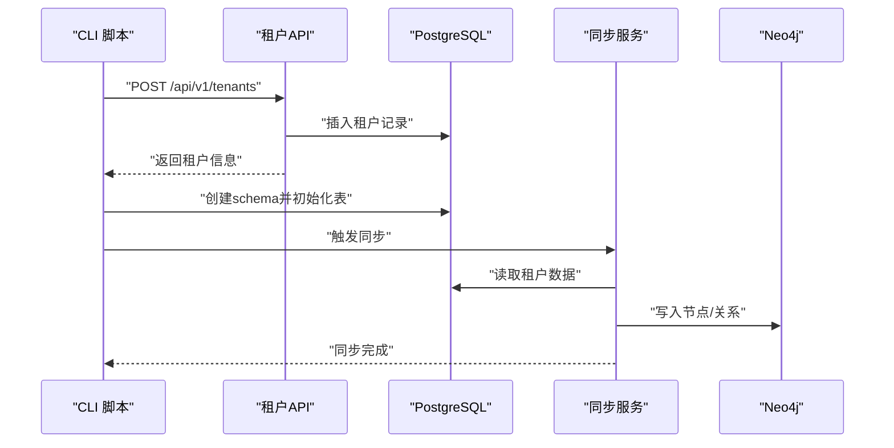
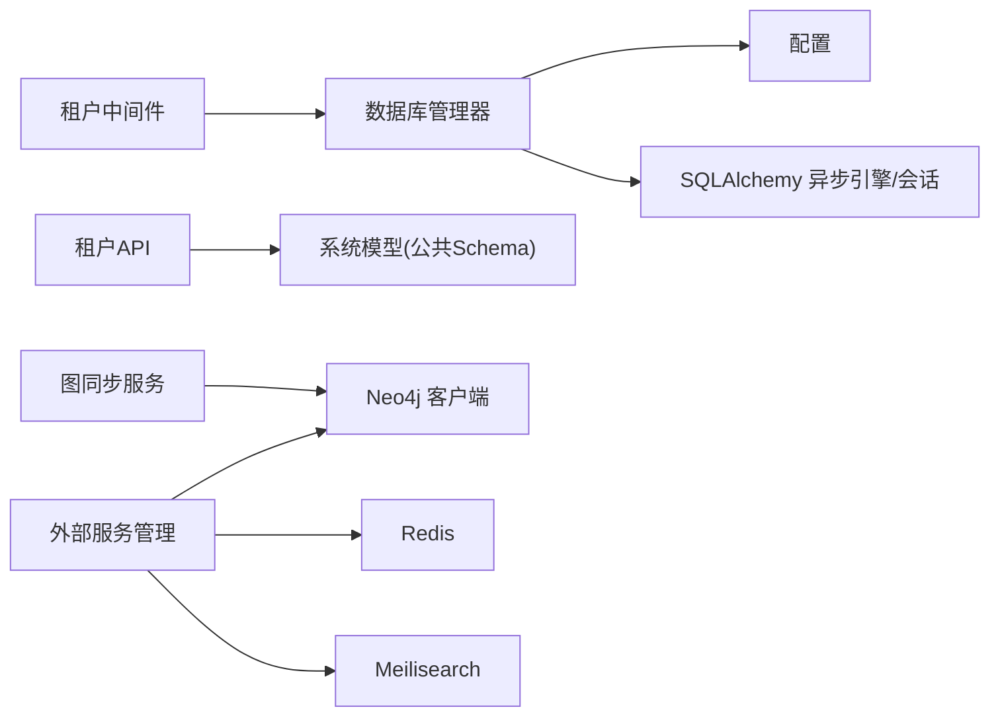

# 租户隔离策略

<cite>
**本文引用的文件**
- [backend/app/core/database.py](file://backend/app/core/database.py)
- [backend/app/middleware/tenant.py](file://backend/app/middleware/tenant.py)
- [backend/app/models/system.py](file://backend/app/models/system.py)
- [backend/app/models/tenant.py](file://backend/app/models/tenant.py)
- [backend/app/services/neo4j_service.py](file://backend/app/services/neo4j_service.py)
- [backend/app/services/graph_sync.py](file://backend/app/services/graph_sync.py)
- [backend/app/core/config.py](file://backend/app/core/config.py)
- [backend/app/main.py](file://backend/app/main.py)
- [backend/app/api/v1/endpoints/tenants.py](file://backend/app/api/v1/endpoints/tenants.py)
- [scripts/create_tenant.py](file://scripts/create_tenant.py)
- [scripts/sync_neo4j.py](file://scripts/sync_neo4j.py)
- [docker-compose.yml](file://docker-compose.yml)
- [docker-compose.prod.yml](file://docker-compose.prod.yml)
</cite>

## 目录
1. [引言](#引言)
2. [项目结构](#项目结构)
3. [核心组件](#核心组件)
4. [架构总览](#架构总览)
5. [详细组件分析](#详细组件分析)
6. [依赖关系分析](#依赖关系分析)
7. [性能考量](#性能考量)
8. [故障排查指南](#故障排查指南)
9. [结论](#结论)
10. [附录：配置与最佳实践](#附录配置与最佳实践)

## 引言
本文件面向多租户族谱管理系统，系统性阐述两种数据库隔离策略：
- PostgreSQL Schema 隔离（逻辑/物理隔离结合）
- Neo4j 隔离（独立数据库实例与命名空间隔离）

我们将从架构设计、数据流、处理逻辑、集成点、错误处理与性能等方面进行深入分析，并提供技术对比、配置示例与最佳实践建议，帮助在安全性、可维护性与性能之间做出平衡决策。

## 项目结构
后端采用 FastAPI + SQLAlchemy Async + Neo4j 的组合，租户信息存储于公共 Schema 的系统表中，业务数据按租户划分到各自 Schema；图数据通过 Neo4j 的数据库或标签/命名空间实现隔离。

图表来源
- [backend/app/main.py:45-92](file://backend/app/main.py#L45-L92)
- [backend/app/middleware/tenant.py:15-84](file://backend/app/middleware/tenant.py#L15-L84)
- [backend/app/core/database.py:24-171](file://backend/app/core/database.py#L24-L171)
- [backend/app/models/system.py:23-71](file://backend/app/models/system.py#L23-L71)
- [backend/app/models/tenant.py:23-244](file://backend/app/models/tenant.py#L23-L244)
- [backend/app/services/neo4j_service.py:12-373](file://backend/app/services/neo4j_service.py#L12-L373)
- [backend/app/services/graph_sync.py:20-157](file://backend/app/services/graph_sync.py#L20-L157)
- [backend/app/core/config.py:11-89](file://backend/app/core/config.py#L11-L89)
- [backend/app/core/services.py:9-285](file://backend/app/core/services.py#L9-L285)

章节来源
- [backend/app/main.py:17-103](file://backend/app/main.py#L17-L103)
- [backend/app/middleware/tenant.py:15-142](file://backend/app/middleware/tenant.py#L15-L142)
- [backend/app/core/database.py:24-171](file://backend/app/core/database.py#L24-L171)
- [backend/app/models/system.py:23-71](file://backend/app/models/system.py#L23-L71)
- [backend/app/models/tenant.py:23-244](file://backend/app/models/tenant.py#L23-L244)
- [backend/app/services/neo4j_service.py:12-373](file://backend/app/services/neo4j_service.py#L12-L373)
- [backend/app/services/graph_sync.py:20-157](file://backend/app/services/graph_sync.py#L20-L157)
- [backend/app/core/config.py:11-89](file://backend/app/core/config.py#L11-L89)
- [backend/app/core/services.py:9-285](file://backend/app/core/services.py#L9-L285)

## 核心组件
- 数据库管理器：负责默认引擎与多租户引擎/会话工厂的创建与缓存，支持 PostgreSQL 与 SQLite 的差异化处理。
- 租户中间件：解析请求中的租户标识（子域名、路径前缀、Header），加载租户元数据并注入请求状态。
- 系统模型与租户模型：系统表（公共 Schema）保存租户元数据（含 schema_name 与 neo4j_database），业务表位于各租户 Schema。
- Neo4j 客户端与图同步：提供节点/关系创建与查询能力，并支持将 PostgreSQL 数据同步至 Neo4j。
- 外部服务管理：对可选服务（Neo4j、Redis、Meilisearch）进行连接与降级处理。

章节来源
- [backend/app/core/database.py:24-171](file://backend/app/core/database.py#L24-L171)
- [backend/app/middleware/tenant.py:15-142](file://backend/app/middleware/tenant.py#L15-L142)
- [backend/app/models/system.py:23-71](file://backend/app/models/system.py#L23-L71)
- [backend/app/models/tenant.py:23-244](file://backend/app/models/tenant.py#L23-L244)
- [backend/app/services/neo4j_service.py:12-373](file://backend/app/services/neo4j_service.py#L12-L373)
- [backend/app/services/graph_sync.py:20-157](file://backend/app/services/graph_sync.py#L20-L157)
- [backend/app/core/services.py:9-285](file://backend/app/core/services.py#L9-L285)

## 架构总览
系统通过“中间件识别租户 → 数据库/图数据库按租户路由”的方式实现隔离。请求进入时，中间件根据多种策略提取租户标识，随后业务层使用对应 schema 或数据库执行读写。

图表来源
- [backend/app/middleware/tenant.py:39-84](file://backend/app/middleware/tenant.py#L39-L84)
- [backend/app/core/database.py:136-171](file://backend/app/core/database.py#L136-L171)
- [backend/app/services/neo4j_service.py:35-60](file://backend/app/services/neo4j_service.py#L35-L60)

## 详细组件分析

### PostgreSQL Schema 隔离与连接池管理
- 多租户引擎与会话工厂缓存：每个租户 schema 对应一个 AsyncEngine 与 async_sessionmaker，避免重复创建带来的开销。
- SQLite 与 PostgreSQL 差异化：
  - SQLite：不支持 schema，采用“每租户独立数据库文件”策略，路径位于默认数据库目录下的 tenants 子目录。
  - PostgreSQL：使用 schema 命名空间隔离，通过设置 search_path 实现逻辑隔离。
- 连接池参数：默认引擎使用配置项 database_pool_size 与 database_max_overflow 控制连接池大小；schema 引擎固定较小池大小以降低并发压力。
- 会话切换：tenant_session 与 get_tenant_db 在每次会话开始时设置 search_path（SQLite 跳过），确保后续查询作用于正确 schema。

图表来源
- [backend/app/core/database.py:24-121](file://backend/app/core/database.py#L24-L121)

章节来源
- [backend/app/core/database.py:24-171](file://backend/app/core/database.py#L24-L171)
- [backend/app/core/config.py:34-40](file://backend/app/core/config.py#L34-L40)

### Neo4j 隔离策略
- 独立数据库实例：系统支持为每个租户创建独立 Neo4j 数据库（企业版特性）。当前代码通过数据库参数传递实现隔离。
- 命名空间隔离：在社区版中，通过在节点标签或属性中加入租户标识（如数据库名）实现逻辑隔离，查询时限定该命名空间。
- 客户端与会话：Neo4jClient 支持按 database 参数获取会话；查询方法均接收 database 参数，保证跨租户隔离。
- 同步策略：GraphSyncService 将 PostgreSQL 中的人口与关系数据同步到 Neo4j，使用统一的 database 名称作为命名空间。

图表来源
- [backend/app/services/neo4j_service.py:12-60](file://backend/app/services/neo4j_service.py#L12-L60)
- [backend/app/services/graph_sync.py:20-104](file://backend/app/services/graph_sync.py#L20-L104)

章节来源
- [backend/app/services/neo4j_service.py:12-373](file://backend/app/services/neo4j_service.py#L12-L373)
- [backend/app/services/graph_sync.py:20-157](file://backend/app/services/graph_sync.py#L20-L157)

### 租户中间件与请求上下文
- 租户识别顺序：URL 路径前缀 /t/{slug}/... → 子域名 tenant.domain → Header X-Tenant-ID。
- 公共路径放行：健康检查、认证、租户管理等无需租户上下文。
- 租户加载：从公共 Schema 的 tenants 表加载租户元数据，注入 request.state.tenant、tenant_schema、tenant_neo4j。
- 错误处理：租户不存在返回 404，租户未激活返回 403。

图表来源
- [backend/app/middleware/tenant.py:39-84](file://backend/app/middleware/tenant.py#L39-L84)
- [backend/app/middleware/tenant.py:116-126](file://backend/app/middleware/tenant.py#L116-L126)

章节来源
- [backend/app/middleware/tenant.py:15-142](file://backend/app/middleware/tenant.py#L15-L142)
- [backend/app/models/system.py:23-71](file://backend/app/models/system.py#L23-L71)

### 租户创建与初始化流程
- 租户创建：API 接收租户基本信息，生成 schema_name 与 neo4j_database，并持久化到公共 Schema 的 tenants 表。
- PostgreSQL 初始化：脚本创建 schema 并初始化业务表（SQL 直接执行）。
- Neo4j 初始化：脚本验证连接（社区版通过标签/命名空间隔离），为后续同步做准备。
- 同步脚本：将指定租户的 PostgreSQL 数据同步到 Neo4j，支持全量重建与增量更新。

图表来源
- [backend/app/api/v1/endpoints/tenants.py:118-164](file://backend/app/api/v1/endpoints/tenants.py#L118-L164)
- [scripts/create_tenant.py:18-282](file://scripts/create_tenant.py#L18-L282)
- [backend/app/services/graph_sync.py:106-115](file://backend/app/services/graph_sync.py#L106-L115)

章节来源
- [backend/app/api/v1/endpoints/tenants.py:118-164](file://backend/app/api/v1/endpoints/tenants.py#L118-L164)
- [scripts/create_tenant.py:18-282](file://scripts/create_tenant.py#L18-L282)
- [scripts/sync_neo4j.py:14-38](file://scripts/sync_neo4j.py#L14-L38)
- [backend/app/services/graph_sync.py:106-157](file://backend/app/services/graph_sync.py#L106-L157)

## 依赖关系分析
- 中间件依赖数据库管理器以获取租户上下文；API 层依赖系统模型（公共 Schema）进行租户查询。
- 数据库管理器依赖配置模块读取连接参数；同时依赖 SQLAlchemy 异步引擎与会话工厂。
- Neo4j 客户端与同步服务相互协作，前者提供会话，后者封装查询与写入。
- 外部服务管理器对可选服务进行统一接入与降级处理，不影响主流程。

图表来源
- [backend/app/middleware/tenant.py:11-125](file://backend/app/middleware/tenant.py#L11-L125)
- [backend/app/core/database.py:16-171](file://backend/app/core/database.py#L16-L171)
- [backend/app/core/config.py:11-89](file://backend/app/core/config.py#L11-L89)
- [backend/app/services/graph_sync.py:12-17](file://backend/app/services/graph_sync.py#L12-L17)
- [backend/app/core/services.py:263-285](file://backend/app/core/services.py#L263-L285)

章节来源
- [backend/app/middleware/tenant.py:11-125](file://backend/app/middleware/tenant.py#L11-L125)
- [backend/app/core/database.py:16-171](file://backend/app/core/database.py#L16-L171)
- [backend/app/core/config.py:11-89](file://backend/app/core/config.py#L11-L89)
- [backend/app/services/graph_sync.py:12-17](file://backend/app/services/graph_sync.py#L12-L17)
- [backend/app/core/services.py:263-285](file://backend/app/core/services.py#L263-L285)

## 性能考量
- PostgreSQL 连接池
  - 默认引擎使用配置项控制池大小，适合系统表与少量公共操作。
  - 每个租户 schema 引擎使用较小池，避免单租户占用过多连接。
  - SQLite 每租户独立文件，避免 schema 切换开销，但文件数量增长带来管理复杂度。
- Neo4j
  - 使用数据库参数或命名空间隔离，查询时限定范围，减少扫描成本。
  - 可选服务（Redis、Meilisearch）失败时自动降级，不影响核心功能。
- 同步策略
  - 全量重建适合首次导入，增量同步适合日常变更，需评估写放大与一致性。

[本节为通用性能讨论，不直接分析具体文件]

## 故障排查指南
- 租户中间件
  - 404：租户不存在或 slug 不匹配。
  - 403：租户未激活。
  - 解决：确认 tenants 表状态与请求头/子域名/路径是否正确。
- 数据库连接
  - PostgreSQL：检查 database_url、pool_size、max_overflow 是否合理。
  - SQLite：确认 tenants 目录存在且权限正确。
- Neo4j
  - 连接失败：检查 URI、用户名密码；确认容器运行与端口开放。
  - 查询异常：确认 database 参数与命名空间标签是否一致。
- 同步问题
  - 同步失败：检查租户 schema 与 Neo4j 数据库名是否匹配；查看日志输出。

章节来源
- [backend/app/middleware/tenant.py:52-74](file://backend/app/middleware/tenant.py#L52-L74)
- [backend/app/core/database.py:136-171](file://backend/app/core/database.py#L136-L171)
- [backend/app/services/neo4j_service.py:41-49](file://backend/app/services/neo4j_service.py#L41-L49)
- [scripts/sync_neo4j.py:31-37](file://scripts/sync_neo4j.py#L31-L37)

## 结论
本系统通过“公共 Schema 存储租户元数据 + 各自 Schema 存储业务数据 + Neo4j 命名空间/数据库隔离”的组合，实现了清晰的多租户边界。在 PostgreSQL 上，通过 search_path 与连接池策略平衡了隔离与性能；在 Neo4j 上，通过数据库参数或命名空间实现强隔离。整体架构具备良好的扩展性与可维护性，同时对外部服务采用可选接入与降级策略，提升了鲁棒性。

[本节为总结性内容，不直接分析具体文件]

## 附录：配置与最佳实践

### 技术对比与权衡
- PostgreSQL Schema 隔离
  - 优点：逻辑隔离清晰，迁移与备份相对简单；SQLite 场景下物理隔离更直观。
  - 缺点：需要严格管理 search_path 与权限；大量 schema 增加管理复杂度。
  - 影响：连接池需按租户拆分，避免资源争用。
- Neo4j 隔离
  - 优点：图查询性能高，命名空间隔离在社区版即可实现。
  - 缺点：多数据库部署成本更高；需确保查询始终限定命名空间。
  - 影响：同步策略需考虑一致性与回滚。

[本小节为概念性对比，不直接分析具体文件]

### 配置示例与要点
- 应用配置（示例字段）
  - 数据库连接：database_url、database_pool_size、database_max_overflow
  - Neo4j 连接：neo4j_uri、neo4j_user、neo4j_password
  - CORS、JWT、存储等其他配置项
- Docker Compose
  - PostgreSQL、Neo4j、Redis 健康检查与端口映射
  - 生产环境使用环境变量注入敏感配置

章节来源
- [backend/app/core/config.py:34-57](file://backend/app/core/config.py#L34-L57)
- [docker-compose.yml:4-56](file://docker-compose.yml#L4-L56)
- [docker-compose.prod.yml:6-46](file://docker-compose.prod.yml#L6-L46)

### 最佳实践建议
- 租户创建
  - 自动生成 schema_name 与 neo4j_database，保持一致性与可预测性。
  - 创建租户后立即初始化 schema 与表结构，确保后续写入可用。
- 数据访问
  - 优先使用 tenant_session/get_tenant_db 获取会话，确保 search_path 正确。
  - 对公共数据访问使用公共 schema 会话，避免误用租户 schema。
- 图数据同步
  - 先同步节点，再同步关系，确保外键约束满足。
  - 定期校验 Neo4j 与 PostgreSQL 的一致性，必要时重建。
- 监控与告警
  - 记录连接失败、查询超时、同步异常等事件。
  - 对外部服务可用性进行周期性探测。

[本小节为通用建议，不直接分析具体文件]