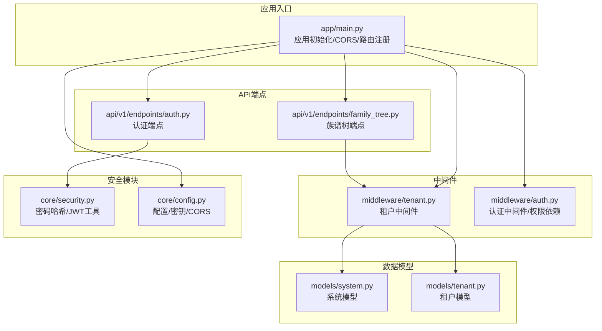
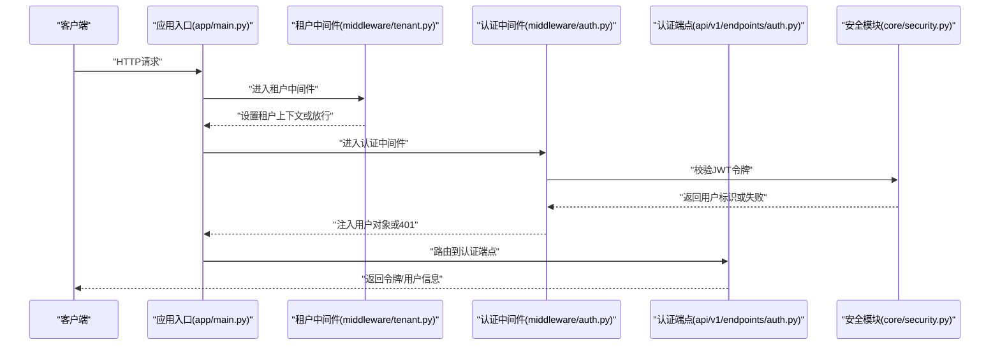
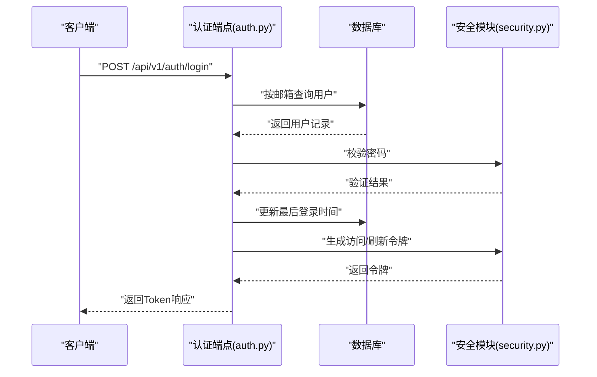
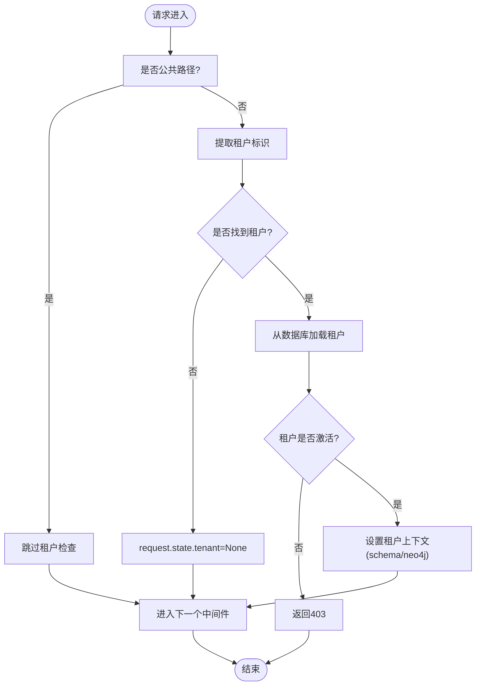
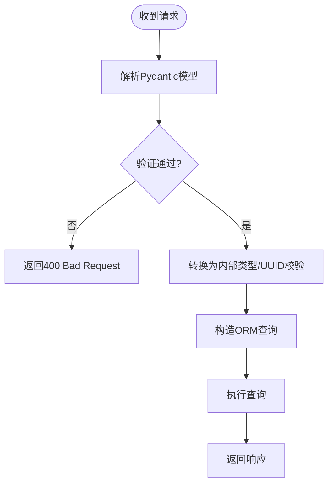
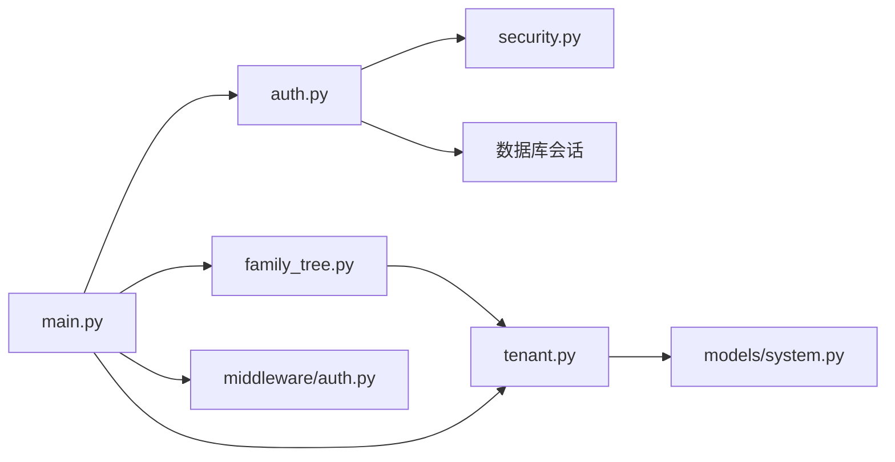

# API安全防护

<cite>
**本文档引用的文件**
- [backend/app/core/security.py](file://backend/app/core/security.py)
- [backend/app/middleware/auth.py](file://backend/app/middleware/auth.py)
- [backend/app/middleware/tenant.py](file://backend/app/middleware/tenant.py)
- [backend/app/api/v1/endpoints/auth.py](file://backend/app/api/v1/endpoints/auth.py)
- [backend/app/api/v1/endpoints/family_tree.py](file://backend/app/api/v1/endpoints/family_tree.py)
- [backend/app/core/config.py](file://backend/app/core/config.py)
- [backend/app/main.py](file://backend/app/main.py)
- [backend/app/models/system.py](file://backend/app/models/system.py)
- [backend/app/models/tenant.py](file://backend/app/models/tenant.py)
- [backend/tests/test_auth.py](file://backend/tests/test_auth.py)
- [backend/tests/conftest.py](file://backend/tests/conftest.py)
</cite>

## 目录
1. [简介](#简介)
2. [项目结构](#项目结构)
3. [核心组件](#核心组件)
4. [架构总览](#架构总览)
5. [详细组件分析](#详细组件分析)
6. [依赖分析](#依赖分析)
7. [性能考虑](#性能考虑)
8. [故障排除指南](#故障排除指南)
9. [结论](#结论)
10. [附录](#附录)

## 简介
本文件面向多租户族谱管理系统的API安全防护，系统采用JWT令牌进行认证与授权，结合多租户中间件实现租户隔离，并通过FastAPI内置的Pydantic模型实现输入验证与参数过滤。当前实现未包含显式的防重放攻击（时间戳与随机数）、CSRF防护与跨域请求的完整安全策略、API限流与防暴力破解机制，以及统一的错误信息脱敏处理。本文在现有代码基础上，提出安全加固建议与最佳实践，帮助在不破坏功能的前提下提升整体安全性。

## 项目结构
后端基于FastAPI构建，采用分层架构：
- 应用入口与中间件：应用生命周期、CORS、租户中间件
- 安全模块：密码哈希、JWT生成与校验
- 认证与授权：认证端点、用户依赖注入、超级用户检查
- 多租户：租户识别、上下文设置、租户级数据库会话
- 数据模型：系统级与租户级数据模型
- API端点：认证、族谱树等业务接口
- 测试：认证相关端到端测试

**图表来源**
- [backend/app/main.py:45-91](file://backend/app/main.py#L45-L91)
- [backend/app/middleware/tenant.py:15-84](file://backend/app/middleware/tenant.py#L15-L84)
- [backend/app/middleware/auth.py:15-87](file://backend/app/middleware/auth.py#L15-L87)
- [backend/app/core/security.py:26-103](file://backend/app/core/security.py#L26-L103)
- [backend/app/api/v1/endpoints/auth.py:55-179](file://backend/app/api/v1/endpoints/auth.py#L55-L179)
- [backend/app/api/v1/endpoints/family_tree.py:43-274](file://backend/app/api/v1/endpoints/family_tree.py#L43-L274)
- [backend/app/core/config.py:53-61](file://backend/app/core/config.py#L53-L61)
- [backend/app/models/system.py:23-71](file://backend/app/models/system.py#L23-L71)
- [backend/app/models/tenant.py:61-133](file://backend/app/models/tenant.py#L61-L133)

**章节来源**
- [backend/app/main.py:45-91](file://backend/app/main.py#L45-L91)
- [backend/app/core/config.py:53-61](file://backend/app/core/config.py#L53-L61)

## 核心组件
- JWT与密码安全
  - 使用bcrypt进行密码哈希与校验
  - 使用HS256算法生成访问与刷新令牌，支持自定义过期时间
- 认证中间件
  - 从Authorization头解析Bearer令牌并校验有效性
  - 将用户对象注入到请求上下文中，供后续端点使用
- 租户中间件
  - 支持子域名、路径前缀与自定义Header三种方式识别租户
  - 对公共路径放行，对非公共路径加载租户并设置租户上下文
- 输入验证与参数过滤
  - Pydantic模型用于请求体与查询参数的自动验证与类型约束
- 错误处理
  - 明确的HTTP状态码与错误消息返回，但未见统一的敏感信息脱敏策略

**章节来源**
- [backend/app/core/security.py:16-103](file://backend/app/core/security.py#L16-L103)
- [backend/app/middleware/auth.py:15-87](file://backend/app/middleware/auth.py#L15-L87)
- [backend/app/middleware/tenant.py:15-142](file://backend/app/middleware/tenant.py#L15-L142)
- [backend/app/api/v1/endpoints/auth.py:26-52](file://backend/app/api/v1/endpoints/auth.py#L26-L52)
- [backend/app/api/v1/endpoints/family_tree.py:46-48](file://backend/app/api/v1/endpoints/family_tree.py#L46-L48)

## 架构总览
下图展示API请求在系统中的流转与安全控制点：

**图表来源**
- [backend/app/main.py:57-70](file://backend/app/main.py#L57-L70)
- [backend/app/middleware/tenant.py:39-84](file://backend/app/middleware/tenant.py#L39-L84)
- [backend/app/middleware/auth.py:15-57](file://backend/app/middleware/auth.py#L15-L57)
- [backend/app/core/security.py:80-103](file://backend/app/core/security.py#L80-L103)
- [backend/app/api/v1/endpoints/auth.py:55-124](file://backend/app/api/v1/endpoints/auth.py#L55-L124)

## 详细组件分析

### 认证与授权流程
- 登录流程
  - 校验用户凭据，更新最近登录时间
  - 生成访问与刷新令牌并返回
- 刷新令牌流程
  - 验证刷新令牌有效性并重新签发新令牌
- 当前不足
  - 缺少CSRF防护与跨域请求的严格策略
  - 未实现防重放攻击（时间戳与随机数）
  - 未实现API限流与暴力破解防护
  - 错误信息未统一脱敏

**图表来源**
- [backend/app/api/v1/endpoints/auth.py:89-124](file://backend/app/api/v1/endpoints/auth.py#L89-L124)
- [backend/app/core/security.py:26-77](file://backend/app/core/security.py#L26-L77)

**章节来源**
- [backend/app/api/v1/endpoints/auth.py:89-158](file://backend/app/api/v1/endpoints/auth.py#L89-L158)
- [backend/app/core/security.py:26-77](file://backend/app/core/security.py#L26-L77)

### 多租户隔离与上下文
- 租户识别顺序：URL路径前缀、子域名、自定义Header
- 对公共路径放行，其他路径加载租户并设置schema与Neo4j数据库上下文
- 未激活租户返回403，租户不存在返回404

**图表来源**
- [backend/app/middleware/tenant.py:39-84](file://backend/app/middleware/tenant.py#L39-L84)
- [backend/app/middleware/tenant.py:93-126](file://backend/app/middleware/tenant.py#L93-L126)

**章节来源**
- [backend/app/middleware/tenant.py:15-142](file://backend/app/middleware/tenant.py#L15-L142)

### 输入验证、参数过滤与SQL注入防护
- Pydantic模型用于请求体与查询参数的自动验证
  - 示例：深度参数范围限制、UUID格式校验
- SQLAlchemy ORM查询避免原生SQL拼接，降低注入风险
- 建议补充
  - 对于动态查询，确保仅使用ORM提供的参数化查询接口
  - 对外部输入进行白名单校验与长度限制

**图表来源**
- [backend/app/api/v1/endpoints/family_tree.py:46-68](file://backend/app/api/v1/endpoints/family_tree.py#L46-L68)
- [backend/app/api/v1/endpoints/family_tree.py:162-165](file://backend/app/api/v1/endpoints/family_tree.py#L162-L165)

**章节来源**
- [backend/app/api/v1/endpoints/family_tree.py:46-68](file://backend/app/api/v1/endpoints/family_tree.py#L46-L68)
- [backend/app/api/v1/endpoints/family_tree.py:162-165](file://backend/app/api/v1/endpoints/family_tree.py#L162-L165)

### CSRF防护策略与跨域请求处理
- 当前实现
  - 启用了CORS中间件，允许所有方法与头部
- 建议
  - 限定允许的源列表，避免通配符
  - 对于无Cookie场景，CSRF风险较低；若存在Cookie认证，需引入CSRF令牌机制
  - 对关键写操作端点增加Referer与Origin校验

**章节来源**
- [backend/app/main.py:57-64](file://backend/app/main.py#L57-L64)
- [backend/app/core/config.py:60-61](file://backend/app/core/config.py#L60-L61)

### 防重放攻击机制
- 当前实现
  - 未发现显式的时间戳验证与随机数使用
- 建议
  - 在请求中携带时间戳与随机数，服务端校验时间窗口（如±5分钟）与随机数唯一性
  - 对重复请求进行去重缓存（Redis）

[本节为概念性建议，无需“章节来源”]

### API限流与防暴力破解
- 当前实现
  - 未发现显式限流与暴力破解防护
- 建议
  - 在登录与注册端点实施速率限制（如每IP每分钟请求数）
  - 对失败登录尝试进行账户锁定或验证码触发
  - 结合Redis实现分布式限流

[本节为概念性建议，无需“章节来源”]

### 错误信息的安全处理
- 当前实现
  - 认证失败返回通用错误信息，避免泄露具体原因
- 建议
  - 统一错误响应格式，隐藏堆栈与内部细节
  - 对敏感字段进行脱敏（如密码、令牌）

**章节来源**
- [backend/app/api/v1/endpoints/auth.py:100-110](file://backend/app/api/v1/endpoints/auth.py#L100-L110)

## 依赖分析
- 模块耦合
  - 认证端点依赖安全模块与数据库会话
  - 租户中间件依赖系统模型与数据库管理器
  - 应用入口集中注册中间件与路由
- 外部依赖
  - Pydantic用于数据验证
  - SQLAlchemy用于ORM
  - FastAPI用于路由与中间件

**图表来源**
- [backend/app/api/v1/endpoints/auth.py:13-19](file://backend/app/api/v1/endpoints/auth.py#L13-L19)
- [backend/app/middleware/tenant.py:11-12](file://backend/app/middleware/tenant.py#L11-L12)
- [backend/app/models/system.py:23-71](file://backend/app/models/system.py#L23-L71)
- [backend/app/main.py:57-70](file://backend/app/main.py#L57-L70)

**章节来源**
- [backend/app/api/v1/endpoints/auth.py:13-19](file://backend/app/api/v1/endpoints/auth.py#L13-L19)
- [backend/app/middleware/tenant.py:11-12](file://backend/app/middleware/tenant.py#L11-L12)
- [backend/app/models/system.py:23-71](file://backend/app/models/system.py#L23-L71)
- [backend/app/main.py:57-70](file://backend/app/main.py#L57-L70)

## 性能考虑
- JWT令牌大小与过期时间
  - 访问令牌过期时间较长时可减少频繁刷新，但需权衡安全风险
- 数据库连接池
  - 合理设置连接池大小与溢出数量，避免高并发下的连接争用
- 查询优化
  - 对树形查询使用索引与分页，避免深层递归导致的N+1问题

[本节为一般性建议，无需“章节来源”]

## 故障排除指南
- 认证失败
  - 检查Authorization头格式与Bearer前缀
  - 确认JWT密钥与算法配置一致
- 租户不可用
  - 检查租户是否激活与是否存在
  - 确认租户Schema与Neo4j数据库配置正确
- 跨域问题
  - 校验CORS允许的源列表与凭证设置
- 测试验证
  - 使用测试套件覆盖注册、登录、令牌刷新等关键路径

**章节来源**
- [backend/app/middleware/auth.py:20-34](file://backend/app/middleware/auth.py#L20-L34)
- [backend/app/middleware/tenant.py:52-74](file://backend/app/middleware/tenant.py#L52-L74)
- [backend/tests/test_auth.py:13-149](file://backend/tests/test_auth.py#L13-L149)
- [backend/tests/conftest.py:43-69](file://backend/tests/conftest.py#L43-L69)

## 结论
当前系统已具备基础的JWT认证、租户隔离与输入验证能力。为进一步提升API安全，建议补充：
- CSRF防护与严格的跨域策略
- 防重放攻击（时间戳与随机数）
- API限流与暴力破解防护
- 统一错误信息脱敏与安全日志
- 完善的监控与告警机制

[本节为总结性内容，无需“章节来源”]

## 附录

### 安全测试方法
- 单元与集成测试
  - 注册重复邮箱、错误密码登录、令牌刷新等场景
- 渗透测试
  - 模拟SQL注入、XSS、CSRF与暴力破解
- 自动化扫描
  - 使用工具对API进行静态与动态安全扫描

**章节来源**
- [backend/tests/test_auth.py:13-149](file://backend/tests/test_auth.py#L13-L149)
- [backend/tests/conftest.py:43-105](file://backend/tests/conftest.py#L43-L105)

### 常见安全漏洞与防护措施
- SQL注入
  - 仅使用ORM参数化查询，避免原生SQL拼接
- XSS
  - 对输出进行HTML转义，限制富文本输入
- CSRF
  - 关键操作要求CSRF令牌，校验Referer/Origin
- 令牌泄露
  - 最小权限与短有效期，启用HTTPS与安全存储

[本节为概念性内容，无需“章节来源”]

### 具体防护配置与监控方案
- 配置项
  - JWT密钥与算法、CORS允许源、令牌过期时间
- 监控
  - 记录异常登录、频繁失败请求、跨域违规
  - 告警阈值：失败登录次数、请求延迟、错误率

**章节来源**
- [backend/app/core/config.py:53-61](file://backend/app/core/config.py#L53-L61)
- [backend/app/main.py:57-64](file://backend/app/main.py#L57-L64)