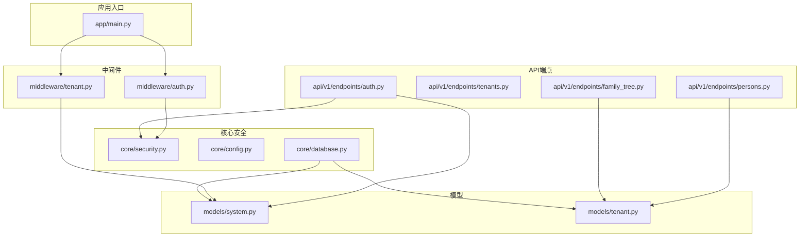
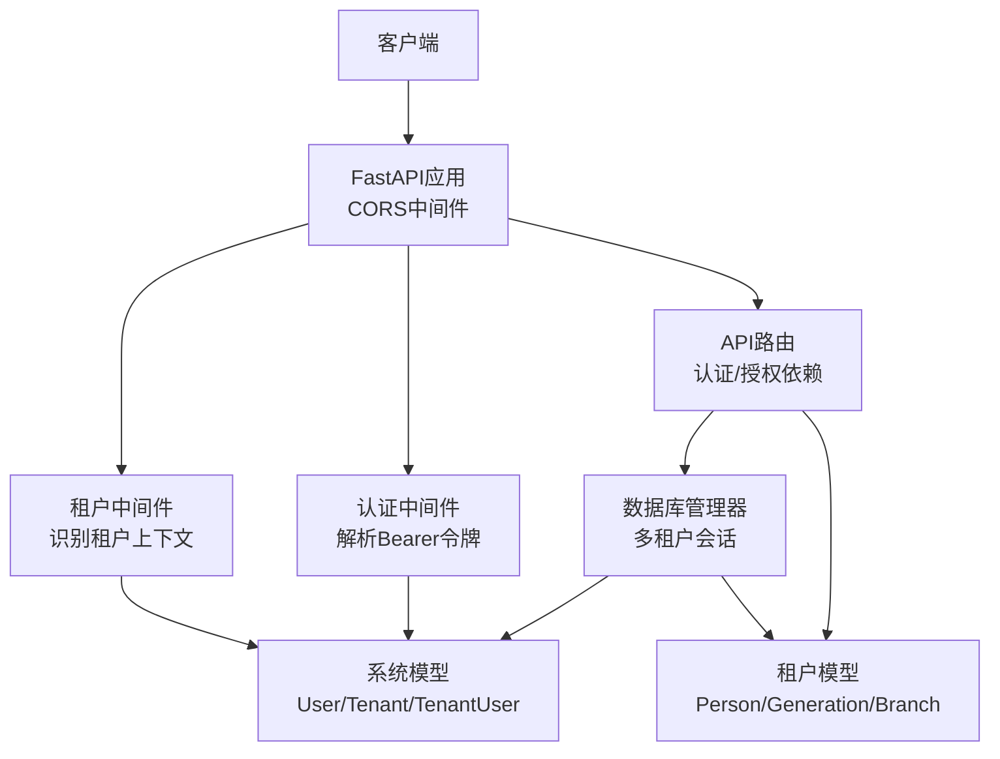
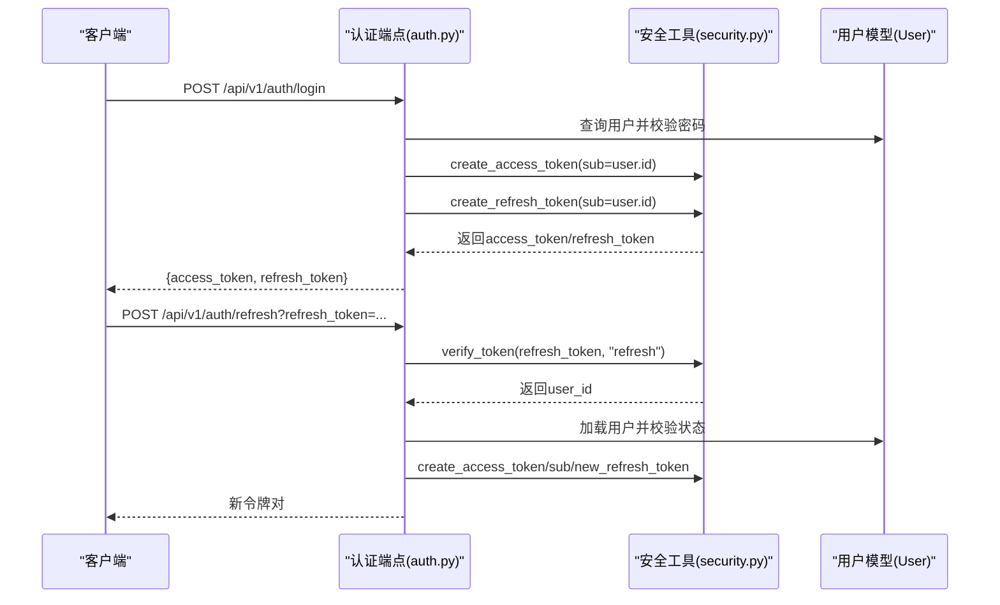
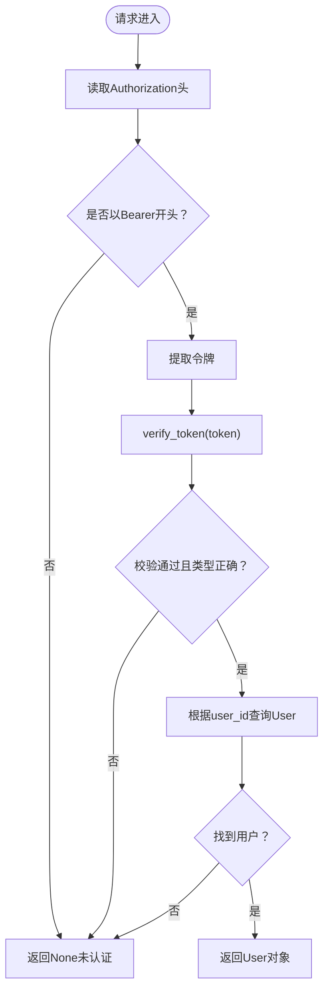
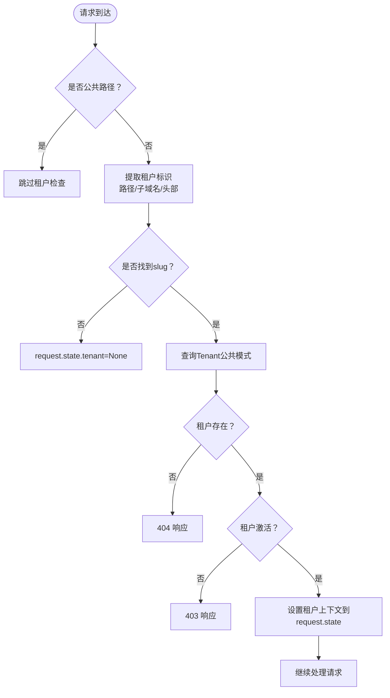
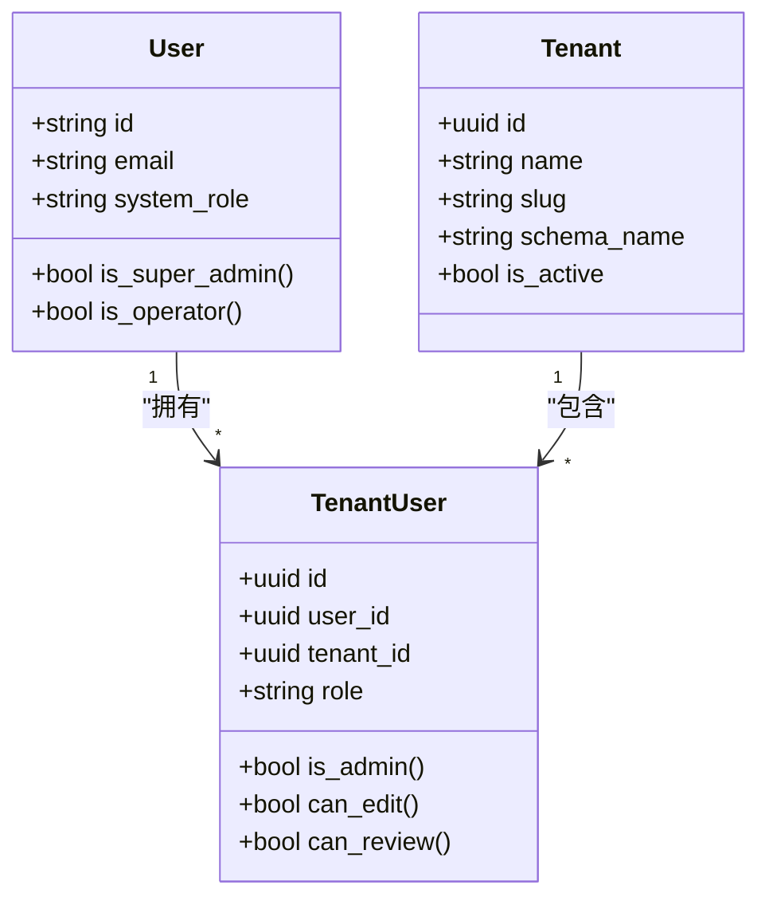
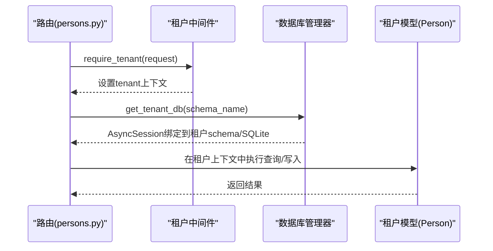
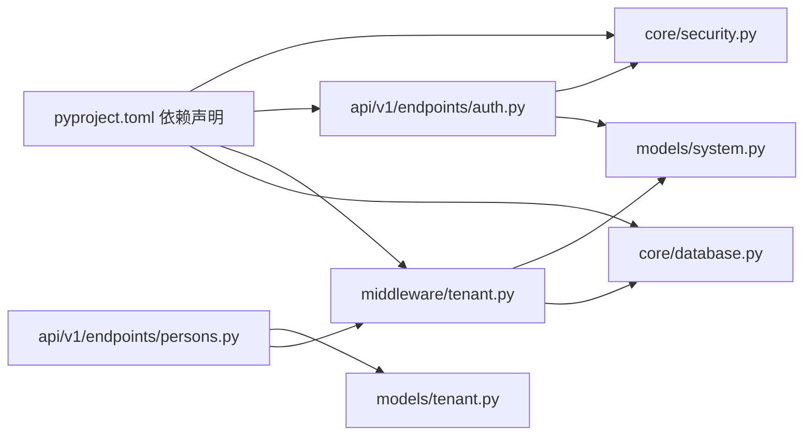

# 安全架构设计

<cite>
**本文档引用的文件**
- [backend/app/core/security.py](file://backend/app/core/security.py)
- [backend/app/middleware/auth.py](file://backend/app/middleware/auth.py)
- [backend/app/middleware/tenant.py](file://backend/app/middleware/tenant.py)
- [backend/app/api/v1/endpoints/auth.py](file://backend/app/api/v1/endpoints/auth.py)
- [backend/app/models/system.py](file://backend/app/models/system.py)
- [backend/app/models/tenant.py](file://backend/app/models/tenant.py)
- [backend/app/core/config.py](file://backend/app/core/config.py)
- [backend/app/api/v1/endpoints/tenants.py](file://backend/app/api/v1/endpoints/tenants.py)
- [backend/app/api/v1/endpoints/persons.py](file://backend/app/api/v1/endpoints/persons.py)
- [backend/app/api/v1/endpoints/family_tree.py](file://backend/app/api/v1/endpoints/family_tree.py)
- [backend/app/core/database.py](file://backend/app/core/database.py)
- [backend/app/main.py](file://backend/app/main.py)
- [backend/tests/test_auth.py](file://backend/tests/test_auth.py)
- [backend/pyproject.toml](file://backend/pyproject.toml)
</cite>

## 目录
1. [引言](#引言)
2. [项目结构](#项目结构)
3. [核心组件](#核心组件)
4. [架构总览](#架构总览)
5. [详细组件分析](#详细组件分析)
6. [依赖关系分析](#依赖关系分析)
7. [性能考虑](#性能考虑)
8. [故障排除指南](#故障排除指南)
9. [结论](#结论)
10. [附录](#附录)

## 引言
本文件为多租户族谱管理系统制定全面的安全架构设计文档，覆盖身份认证、授权控制、数据加密、API防护与审计日志等关键领域。系统采用JWT令牌机制实现会话管理，结合多租户中间件实现租户上下文隔离，并通过RBAC（基于角色的访问控制）模型在系统级与租户级层面实施细粒度权限控制。同时，系统具备数据访问控制策略以确保租户间数据隔离与敏感信息保护，并提供API安全防护措施（防重放、CSRF防护、输入验证）以及安全审计与日志记录方案。

## 项目结构
后端采用FastAPI框架，按功能模块化组织，核心安全相关模块分布如下：
- 核心安全：JWT工具、密码哈希、配置管理
- 中间件：认证中间件、租户中间件
- API层：认证、租户、族谱、人员等端点
- 模型层：系统级（公共模式）与租户级（独立模式）模型
- 数据层：数据库管理器与多租户会话
- 应用入口：FastAPI应用、CORS、健康检查

**图表来源**
- [backend/app/main.py:45-92](file://backend/app/main.py#L45-L92)
- [backend/app/middleware/auth.py:1-88](file://backend/app/middleware/auth.py#L1-L88)
- [backend/app/middleware/tenant.py:1-142](file://backend/app/middleware/tenant.py#L1-L142)
- [backend/app/core/security.py:1-103](file://backend/app/core/security.py#L1-L103)
- [backend/app/core/config.py:1-89](file://backend/app/core/config.py#L1-L89)
- [backend/app/core/database.py:1-171](file://backend/app/core/database.py#L1-L171)
- [backend/app/api/v1/endpoints/auth.py:1-179](file://backend/app/api/v1/endpoints/auth.py#L1-L179)
- [backend/app/api/v1/endpoints/tenants.py:1-164](file://backend/app/api/v1/endpoints/tenants.py#L1-L164)
- [backend/app/api/v1/endpoints/persons.py:1-717](file://backend/app/api/v1/endpoints/persons.py#L1-L717)
- [backend/app/api/v1/endpoints/family_tree.py:1-274](file://backend/app/api/v1/endpoints/family_tree.py#L1-L274)
- [backend/app/models/system.py:1-223](file://backend/app/models/system.py#L1-L223)
- [backend/app/models/tenant.py:1-244](file://backend/app/models/tenant.py#L1-L244)

**章节来源**
- [backend/app/main.py:45-92](file://backend/app/main.py#L45-L92)
- [backend/app/core/config.py:11-89](file://backend/app/core/config.py#L11-L89)

## 核心组件
- JWT令牌机制：密码哈希、访问令牌与刷新令牌生成、令牌解码与校验
- 认证中间件：从请求头提取Bearer令牌、验证并加载用户
- 租户中间件：识别租户上下文（子域名、路径、头部），设置schema或SQLite文件
- RBAC权限模型：系统级角色（超级管理员、运营者、普通用户）与租户级角色（管理员、编辑者、审核者、成员）
- 数据访问控制：基于租户上下文的查询隔离与可见性控制
- API安全防护：CORS配置、输入参数校验、错误处理
- 审计与日志：变更日志表、操作审计字段

**章节来源**
- [backend/app/core/security.py:16-103](file://backend/app/core/security.py#L16-L103)
- [backend/app/middleware/auth.py:15-88](file://backend/app/middleware/auth.py#L15-L88)
- [backend/app/middleware/tenant.py:15-142](file://backend/app/middleware/tenant.py#L15-L142)
- [backend/app/models/system.py:73-181](file://backend/app/models/system.py#L73-L181)
- [backend/app/models/tenant.py:214-244](file://backend/app/models/tenant.py#L214-L244)

## 架构总览
系统安全架构围绕“多租户隔离 + JWT认证 + RBAC授权 + 数据访问控制 + API防护 + 审计日志”展开。JWT用于会话状态管理；租户中间件在请求进入路由前确定租户上下文；认证中间件解析并验证令牌；RBAC在系统级与租户级分别定义角色与权限；数据访问控制确保跨租户隔离与敏感数据保护；API层对输入进行严格校验并返回标准化错误；审计日志记录关键操作。

**图表来源**
- [backend/app/main.py:57-70](file://backend/app/main.py#L57-L70)
- [backend/app/middleware/tenant.py:39-84](file://backend/app/middleware/tenant.py#L39-L84)
- [backend/app/middleware/auth.py:15-57](file://backend/app/middleware/auth.py#L15-L57)
- [backend/app/core/database.py:124-171](file://backend/app/core/database.py#L124-L171)
- [backend/app/models/system.py:23-181](file://backend/app/models/system.py#L23-L181)
- [backend/app/models/tenant.py:23-244](file://backend/app/models/tenant.py#L23-L244)

## 详细组件分析

### JWT令牌机制与流程
- 密码哈希：使用bcrypt上下文对明文密码进行哈希存储
- 访问令牌：包含sub、exp、type=access，过期时间可配置
- 刷新令牌：包含sub、exp、type=refresh，过期时间可配置
- 令牌验证：解码并校验算法与类型，返回用户标识
- 登录/注册：成功后返回access_token与refresh_token
- 刷新：使用有效refresh_token换取新的令牌对

**图表来源**
- [backend/app/api/v1/endpoints/auth.py:89-158](file://backend/app/api/v1/endpoints/auth.py#L89-L158)
- [backend/app/core/security.py:26-103](file://backend/app/core/security.py#L26-L103)

**章节来源**
- [backend/app/core/security.py:16-103](file://backend/app/core/security.py#L16-L103)
- [backend/app/api/v1/endpoints/auth.py:89-158](file://backend/app/api/v1/endpoints/auth.py#L89-L158)

### 认证中间件与依赖注入
- 从Authorization头提取Bearer令牌
- 调用verify_token进行解码与类型校验
- 从数据库加载用户对象
- 提供依赖：RequireAuth、RequireSuperuser、OptionalAuth
- 权限检查器占位：当前仅做认证检查，后续扩展

**图表来源**
- [backend/app/middleware/auth.py:15-57](file://backend/app/middleware/auth.py#L15-L57)
- [backend/app/core/security.py:80-103](file://backend/app/core/security.py#L80-L103)

**章节来源**
- [backend/app/middleware/auth.py:15-88](file://backend/app/middleware/auth.py#L15-L88)

### 租户中间件与多租户隔离
- 识别顺序：URL路径(/t/{slug}/...) → 子域名 → X-Tenant-ID
- 公共路径白名单：无需租户上下文（如认证、租户列表、健康检查）
- 加载租户：从公共模式数据库查询Tenant
- 状态校验：租户存在且激活
- 设置上下文：request.state.tenant、tenant_schema、tenant_neo4j
- 依赖：require_tenant在路由中强制租户上下文

**图表来源**
- [backend/app/middleware/tenant.py:39-84](file://backend/app/middleware/tenant.py#L39-L84)
- [backend/app/middleware/tenant.py:128-142](file://backend/app/middleware/tenant.py#L128-L142)

**章节来源**
- [backend/app/middleware/tenant.py:15-142](file://backend/app/middleware/tenant.py#L15-L142)

### RBAC权限模型设计
- 系统级角色
  - user：普通用户
  - operator：运营人员（部分系统管理能力）
  - super_admin：超级管理员（最高权限）
- 租户级角色
  - member：普通成员
  - editor：可编辑
  - reviewer：可审核
  - tenant_admin：租户管理员（最高租户权限）
- 角色属性
  - is_admin、can_edit、can_review等属性便于快速判断
- 权限矩阵（建议）
  - 系统级：仅super_admin可执行系统级管理操作
  - 租户级：tenant_admin可管理租户内资源；editor可增改；reviewer可审核；member只读或有限读取
  - 当前权限检查器为占位，需在具体路由中启用

**图表来源**
- [backend/app/models/system.py:73-181](file://backend/app/models/system.py#L73-L181)

**章节来源**
- [backend/app/models/system.py:73-181](file://backend/app/models/system.py#L73-L181)
- [backend/app/middleware/auth.py:72-82](file://backend/app/middleware/auth.py#L72-L82)

### 数据访问控制策略
- 租户间隔离
  - 租户中间件在请求进入路由前设置租户上下文
  - 所有租户级API均调用require_tenant，确保上下文存在
  - 数据库会话按租户schema或SQLite文件建立，避免跨租户查询
- 敏感数据保护
  - 人员模型包含visibility字段（public/member/private），用于控制可见性
  - 变更日志表记录所有关键操作，支持审计追踪
- 数据库连接
  - 支持SQLite（每租户独立文件）与PostgreSQL（schema隔离）
  - 通过DatabaseManager统一管理引擎与会话

**图表来源**
- [backend/app/api/v1/endpoints/persons.py:172-321](file://backend/app/api/v1/endpoints/persons.py#L172-L321)
- [backend/app/middleware/tenant.py:128-142](file://backend/app/middleware/tenant.py#L128-L142)
- [backend/app/core/database.py:136-171](file://backend/app/core/database.py#L136-L171)

**章节来源**
- [backend/app/api/v1/endpoints/persons.py:172-321](file://backend/app/api/v1/endpoints/persons.py#L172-L321)
- [backend/app/models/tenant.py:61-132](file://backend/app/models/tenant.py#L61-L132)
- [backend/app/core/database.py:24-107](file://backend/app/core/database.py#L24-L107)

### API安全防护措施
- 防重放攻击
  - 使用短期有效的access_token与长期的refresh_token
  - 建议引入nonce与时间戳校验（当前实现未包含）
- CSRF防护
  - 服务端为API接口，不直接使用浏览器Cookie；建议在前端侧通过SameSite Cookie与CSP加强防护（当前实现未包含）
- 输入验证
  - Pydantic模型对请求体进行严格校验（长度、格式、枚举值）
  - 路由参数同样进行范围与格式限制
- 错误处理
  - 统一返回401/403/404/400等语义化错误
  - 认证失败与权限不足时返回明确错误码

**章节来源**
- [backend/app/api/v1/endpoints/persons.py:20-93](file://backend/app/api/v1/endpoints/persons.py#L20-L93)
- [backend/app/api/v1/endpoints/family_tree.py:20-41](file://backend/app/api/v1/endpoints/family_tree.py#L20-L41)
- [backend/app/middleware/auth.py:47-69](file://backend/app/middleware/auth.py#L47-L69)

### 安全审计与日志记录
- 变更日志表
  - 记录表名、记录ID、动作类型、旧值/新值、操作人、时间、审核状态
  - 支持审核流程与追溯
- 日志记录
  - 应用启动/关闭日志、服务可用性日志
  - 建议增加登录、令牌刷新、关键业务操作的日志记录

**章节来源**
- [backend/app/models/tenant.py:214-244](file://backend/app/models/tenant.py#L214-L244)
- [backend/app/main.py:17-42](file://backend/app/main.py#L17-L42)

## 依赖关系分析
- 外部依赖
  - FastAPI、SQLAlchemy、Pydantic、python-jose(passlib)、httpx等
  - 可选服务：Redis、Neo4j、Meilisearch
- 内部依赖
  - 安全工具依赖配置settings
  - 认证端点依赖安全工具与系统模型
  - 租户中间件依赖系统模型与数据库管理器
  - 租户级API依赖租户中间件与租户模型

**图表来源**
- [backend/pyproject.toml:7-25](file://backend/pyproject.toml#L7-L25)
- [backend/app/core/security.py:10](file://backend/app/core/security.py#L10)
- [backend/app/api/v1/endpoints/auth.py:12-21](file://backend/app/api/v1/endpoints/auth.py#L12-L21)
- [backend/app/middleware/tenant.py:11-12](file://backend/app/middleware/tenant.py#L11-L12)
- [backend/app/models/system.py:20](file://backend/app/models/system.py#L20)
- [backend/app/core/database.py:16](file://backend/app/core/database.py#L16)
- [backend/app/api/v1/endpoints/persons.py:13-16](file://backend/app/api/v1/endpoints/persons.py#L13-L16)
- [backend/app/models/tenant.py:20](file://backend/app/models/tenant.py#L20)

**章节来源**
- [backend/pyproject.toml:7-25](file://backend/pyproject.toml#L7-L25)

## 性能考虑
- 数据库连接池
  - 默认引擎与会话工厂已配置，PostgreSQL场景下使用连接池参数
  - SQLite场景为每租户独立文件，避免schema切换开销
- 令牌有效期
  - access_token短期有效，减少令牌泄露风险
  - refresh_token长期有效但需安全存储
- 缓存与异步
  - 可利用Redis缓存热点数据与令牌黑名单
  - 异步数据库会话减少I/O阻塞

[本节为通用指导，无需特定文件引用]

## 故障排除指南
- 认证失败
  - 检查Authorization头格式是否为Bearer
  - 核对令牌签名算法与密钥配置
  - 确认用户状态为激活
- 租户上下文缺失
  - 确认请求头或路径包含正确的租户标识
  - 检查租户是否存在且处于激活状态
- 数据访问异常
  - 确认已调用require_tenant
  - 检查数据库连接是否指向正确的schema或SQLite文件
- 测试验证
  - 单元测试覆盖注册、登录、刷新与密码哈希

**章节来源**
- [backend/tests/test_auth.py:12-149](file://backend/tests/test_auth.py#L12-L149)
- [backend/app/middleware/auth.py:20-57](file://backend/app/middleware/auth.py#L20-L57)
- [backend/app/middleware/tenant.py:40-84](file://backend/app/middleware/tenant.py#L40-L84)

## 结论
本安全架构设计以JWT为核心会话机制，结合多租户中间件实现强隔离，通过RBAC模型在系统与租户两个维度提供细粒度权限控制，并在API层强化输入验证与错误处理。配合变更日志与审计字段，形成完整的安全审计闭环。建议后续增强防重放与CSRF防护，并完善权限检查器的具体实现与令牌黑名单机制，以进一步提升整体安全性。

[本节为总结性内容，无需特定文件引用]

## 附录
- 配置项要点
  - JWT密钥与算法、令牌过期时间
  - CORS允许源、数据库连接参数
  - 租户默认套餐与配额
- 关键流程参考
  - 登录与刷新令牌序列图
  - 租户上下文识别流程图
  - 数据访问控制流程图

**章节来源**
- [backend/app/core/config.py:53-61](file://backend/app/core/config.py#L53-L61)
- [backend/app/api/v1/endpoints/auth.py:89-158](file://backend/app/api/v1/endpoints/auth.py#L89-L158)
- [backend/app/middleware/tenant.py:93-114](file://backend/app/middleware/tenant.py#L93-L114)
- [backend/app/api/v1/endpoints/persons.py:172-321](file://backend/app/api/v1/endpoints/persons.py#L172-L321)